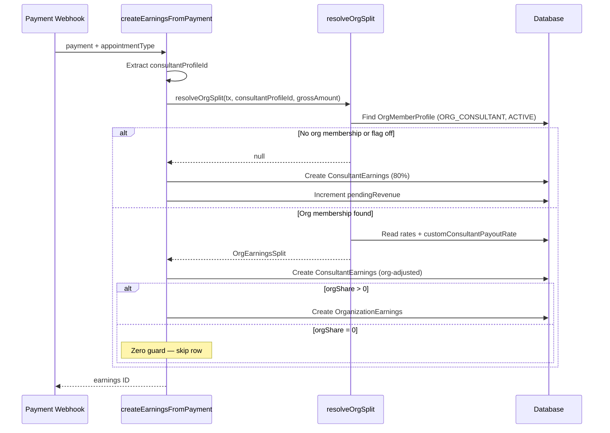

# Earnings and Revenue

**Status**: Implemented (Apr 2026)
**Branch**: `feature/enterprise`
**Scope**: 2-way and 3-way revenue splits, org earnings, refund handling

## Overview

In the standard B2C marketplace, every payment is split two ways: 80% to the consultant, 20% to the platform. This is controlled by `PAYOUT_CONSTANTS.PLATFORM_FEE_PERCENTAGE` (20) and `PAYOUT_CONSTANTS.CONSULTANT_SHARE_PERCENTAGE` (80) in `lib/payments/payouts/constants.ts`.

When a consultant belongs to a PROVIDER or HYBRID organization, the split becomes three-way: platform commission, org retain, and consultant payout. These rates are configurable per-org on `OrganizationProfile` (defaults: 10% platform, 5% org, 85% consultant) and can be overridden per-consultant via `OrganizationMemberProfile.customConsultantPayoutRate`. The 3-way split is only active when `ENABLE_PROVIDER_ORGS = true`.

---

## Standard 2-Way Split (B2C)

**When this applies**: Independent consultants (no org membership), BUYER org consultants (BUYER orgs use standard marketplace pricing), and when `ENABLE_PROVIDER_ORGS = false`.

**Formula**:
```
platformFee      = grossAmount * 0.20
consultantShare  = grossAmount - platformFee
```

### Worked Example

Session price: ₹10,000 (10,00,000 paise)

```
┌──────────────────────────────────────────────────────────┐
│                   2-WAY SPLIT                             │
│                   Total: ₹10,000                         │
├──────────────┬──────────┬──────────┬─────────────────────┤
│ Party        │ Rate     │ Amount   │ Notes               │
├──────────────┼──────────┼──────────┼─────────────────────┤
│ Platform     │ 20%      │ ₹2,000   │ PLATFORM_FEE_PCT    │
│ Consultant   │ 80%      │ ₹8,000   │ CONSULTANT_SHARE_PCT│
├──────────────┼──────────┼──────────┼─────────────────────┤
│ TOTAL        │ 100%     │ ₹10,000  │                     │
└──────────────┴──────────┴──────────┴─────────────────────┘
```

---

## 3-Way Split (PROVIDER / HYBRID)

**When this applies**: Consultant has an active `ORG_CONSULTANT` membership in a PROVIDER or HYBRID org with `status = ACTIVE`, and `ENABLE_PROVIDER_ORGS = true`.

**Rate fields on `OrganizationProfile`**:

| Field | Default | Description |
|-------|---------|-------------|
| `platformCommissionRate` | `0.10` | Platform's slice (10%) |
| `orgRetainRate` | `0.05` | Org keeps this (5%) |
| `consultantPayoutRate` | `0.85` | Consultant receives this (85%) |

**Validation**: Rates must sum to 1.0. Enforced at the API layer (PATCH `/api/organizations/[id]`).

**Per-consultant override**: `OrganizationMemberProfile.customConsultantPayoutRate` -- when set, replaces `consultantPayoutRate` for that consultant. The org's share becomes the remainder: `1.0 - platformCommissionRate - customConsultantPayoutRate`.

**Formula** (from `resolveOrgSplit` in `lib/payments/payouts/earnings-service.ts`):
```
platformFee      = Math.round(grossAmount * platformCommissionRate)
consultantShare  = Math.round(grossAmount * effectiveConsultantRate)
orgShare         = grossAmount - platformFee - consultantShare
```

The org share is computed as a remainder to avoid rounding errors -- the three values always sum exactly to `grossAmount`.

### Worked Example (Default Rates)

Session price: ₹10,000 (10,00,000 paise)

```
┌──────────────────────────────────────────────────────────────┐
│                     3-WAY SPLIT (Defaults)                    │
│                     Total: ₹10,000                           │
├──────────────┬──────────┬──────────┬─────────────────────────┤
│ Party        │ Rate     │ Amount   │ Destination             │
├──────────────┼──────────┼──────────┼─────────────────────────┤
│ Platform     │ 10%      │ ₹1,000   │ Platform revenue        │
│ Organization │ 5%       │ ₹500     │ OrganizationEarnings    │
│ Consultant   │ 85%      │ ₹8,500   │ ConsultantEarnings      │
├──────────────┼──────────┼──────────┼─────────────────────────┤
│ TOTAL        │ 100%     │ ₹10,000  │                         │
└──────────────┴──────────┴──────────┴─────────────────────────┘
```

### Worked Example (Custom Rates: 15/20/65)

Org has overridden rates: `platformCommissionRate = 0.15`, `orgRetainRate = 0.20`, `consultantPayoutRate = 0.65`.

Session price: ₹10,000

```
┌──────────────────────────────────────────────────────────────┐
│                     3-WAY SPLIT (Custom)                      │
│                     Total: ₹10,000                           │
├──────────────┬──────────┬──────────┬─────────────────────────┤
│ Party        │ Rate     │ Amount   │ Notes                   │
├──────────────┼──────────┼──────────┼─────────────────────────┤
│ Platform     │ 15%      │ ₹1,500   │                         │
│ Organization │ 20%      │ ₹2,000   │                         │
│ Consultant   │ 65%      │ ₹6,500   │                         │
├──────────────┼──────────┼──────────┼─────────────────────────┤
│ TOTAL        │ 100%     │ ₹10,000  │                         │
└──────────────┴──────────┴──────────┴─────────────────────────┘
```

---

## Earnings Modes (UI Presets)

These are not stored as an enum -- they describe the effective behavior based on org kind and rate configuration.

### Marketplace

**When**: BUYER org, or independent consultant (no org membership).

**Rates**: Standard 20% platform / 80% consultant. No org earnings.

**DB effect**: Only `ConsultantEarnings` rows created. No `OrganizationEarnings`.

### Agency Split

**When**: PROVIDER or HYBRID org with `earningsRecipient = CONSULTANT` (default).

**Rates**: Configurable (default 10/5/85). Org receives payouts.

**DB effect**: Both `ConsultantEarnings` and `OrganizationEarnings` rows created per payment.

### Platform-only (Internal Training)

**When**: HYBRID org with `earningsRecipient = ORGANIZATION` on a salaried consultant. Combined with rates like `platformCommissionRate = 1.0`, `orgRetainRate = 0.0`, `consultantPayoutRate = 0.0`.

**Rates**: 100% goes to platform. No consultant or org earnings.

**DB effect**: No `OrganizationEarnings` row created (zero guard in `createEarningsFromPayment`). No `ConsultantEarnings.consultantShare` (value = 0, so no `pendingRevenue` increment). Pure SaaS fee.

---

## earningsRecipient Flag

**Field**: `OrganizationMemberProfile.earningsRecipient` -- enum `CONSULTANT` | `ORGANIZATION`

**Default**: `CONSULTANT`

When set to `ORGANIZATION`, the consultant's share is redirected to the org. The platform fee stays the same. The org captures everything except the platform's slice.

### Side-by-Side Example

Session price: ₹10,000. Org rates: 10/5/85.

```
earningsRecipient = CONSULTANT (default)     earningsRecipient = ORGANIZATION
┌──────────────┬──────────┐                  ┌──────────────┬──────────┐
│ Platform     │ ₹1,000   │                  │ Platform     │ ₹1,000   │
│ Organization │ ₹500     │                  │ Organization │ ₹9,000   │
│ Consultant   │ ₹8,500   │                  │ Consultant   │ ₹0       │
└──────────────┴──────────┘                  └──────────────┴──────────┘
```

**Use cases**: University professors who are salaried (the university captures their share). Corporate trainers whose compensation is fixed salary, not per-session.

**Implementation** (in `resolveOrgSplit`, line 137):
```
if (earningsRecipient === "ORGANIZATION") {
    orgShare = grossAmount - platformFee  // org captures everything except platform fee
    consultantShare = 0
}
```

---

## Collaborator Interaction

When a webinar or class has multiple consultants (via the collaborator system) AND the owner belongs to a PROVIDER/HYBRID org, both systems interact:

1. The 3-way split determines the **total consultant pool** (e.g., 85% of ₹10,000 = ₹8,500)
2. The collaborator split divides that pool among host + collaborators
3. The org share stays fixed regardless of how many collaborators exist

### Worked Example

Webinar at ₹10,000. Org rates: 10/5/85. Host (60%), Co-Host A (25%), Moderator B (15%).

```
Step 1: 3-way split
  Platform:    10% = ₹1,000
  Org:          5% = ₹500
  Consult pool: 85% = ₹8,500

Step 2: Collaborator split (of the ₹8,500 consultant pool)
┌──────────────┬──────────┬──────────┬─────────────────────────┐
│ Party        │ Pool %   │ Amount   │ Earnings Row            │
├──────────────┼──────────┼──────────┼─────────────────────────┤
│ Host         │ 60%      │ ₹5,100   │ ConsultantEarnings(OWNER)│
│ Co-Host A    │ 25%      │ ₹2,125   │ ConsultantEarnings(COLLAB)│
│ Moderator B  │ 15%      │ ₹1,275   │ ConsultantEarnings(COLLAB)│
├──────────────┼──────────┼──────────┼─────────────────────────┤
│ Pool Total   │ 100%     │ ₹8,500   │                         │
│ Org          │ —        │ ₹500     │ OrganizationEarnings    │
│ Platform     │ —        │ ₹1,000   │ (no row — platform rev) │
└──────────────┴──────────┴──────────┴─────────────────────────┘
```

---

## Refund Handling

Both `ConsultantEarnings` and `OrganizationEarnings` are reversed proportionally on refund. The `refundEarnings()` function in `lib/payments/payouts/earnings-service.ts` handles both.

### Full Refund on 3-Way Split

Session ₹10,000 with default rates. Full refund:

```
┌─────────────────────┬──────────────┬──────────────┐
│ Party               │ Original     │ After Refund │
├─────────────────────┼──────────────┼──────────────┤
│ ConsultantEarnings  │ ₹8,500       │ REFUNDED     │
│ OrganizationEarnings│ orgShare ₹500│ REFUNDED     │
│ Platform fee        │ ₹1,000       │ Reversed     │
└─────────────────────┴──────────────┴──────────────┘
```

### Partial Refund (50%)

```
refundRatio = refundAmount / paymentAmount = 0.5

ConsultantEarnings.refundedShareAmount += ₹4,250
OrganizationEarnings.refundedAmount += ₹250
```

Earnings status remains non-REFUNDED until the cumulative refund exhausts the original share.

---

## Code Flow

The following sequence diagram illustrates the earnings creation flow from payment webhook through org split resolution to database writes.



```
Payment Webhook (or skipPayment for org billing modes)
  │
  ▼
createEarningsFromPayment()
  │
  ├── Get consultantProfileId from payment.appointment
  ├── Calculate grossAmount from payment.originalAmount
  ├── Calculate holdUntil (24-168 hours depending on type)
  │
  ├──► resolveOrgSplit(tx, consultantProfileId, grossAmount)
  │      │
  │      ├── ENABLE_PROVIDER_ORGS = false? → return null (B2C path)
  │      │
  │      ├── Find OrganizationMemberProfile where:
  │      │     role = ORG_CONSULTANT, status = ACTIVE
  │      │     org.kind IN (PROVIDER, HYBRID), org.status = ACTIVE
  │      │
  │      ├── Not found? → return null (B2C path)
  │      │
  │      ├── Calculate effective rates (custom override or org default)
  │      │
  │      └── Return OrgEarningsSplit { platformFee, orgShare, consultantShare }
  │
  ├── orgSplit is null → B2C 2-way split
  │     platformFee = grossAmount * 20%
  │     consultantPool = grossAmount - platformFee
  │
  ├── orgSplit exists → B2B 3-way split
  │     platformFee = orgSplit.platformFee
  │     consultantPool = orgSplit.consultantShare
  │
  ├── Calculate collaborator splits (if webinar/class with accepted collabs)
  │
  ├── Create ConsultantEarnings row(s)
  │     Increment consultantProfile.pendingRevenue
  │
  └── orgSplit && orgShare > 0?
        │
        └── Create OrganizationEarnings row
            (skipped if orgShare = 0 — zero guard)
```

---

## Edge Cases

| Scenario | Behavior |
|----------|----------|
| Zero org share (Platform-only mode) | No `OrganizationEarnings` row created. Log message: "Platform-only mode ... skipping 0-value org earnings" |
| Multi-org consultant | `resolveOrgSplit` picks the first active PROVIDER/HYBRID membership. Future: allow consultant to select which org gets credit per-booking. |
| Per-consultant rate override + collaborator | Override applies to the host's org membership. Collaborators in other orgs (or independent) use their own org split or the B2C split. |
| Partial refund on 3-way split | `refundRatio` applied proportionally to both `ConsultantEarnings.refundedShareAmount` and `OrganizationEarnings.refundedAmount`. Status set to REFUNDED only when cumulative refund >= original share. |
| Refund of PAID earnings (already disbursed) | Requires `forceRefund: true`. Creates a TDS reversal record (`isReversal: true`) and decrements `totalRevenue` instead of `pendingRevenue`. |
| Idempotent duplicate webhook | `P2002` unique constraint catch returns existing earnings ID. Logged as idempotent success. |
| BUYER org consultant payment | `resolveOrgSplit` returns `null` because the org's kind is BUYER (not in `["PROVIDER", "HYBRID"]`). Standard 2-way split applies. |
| Rates don't sum to 1.0 | API validation rejects the PATCH. If somehow persisted, `orgShare = grossAmount - platformFee - consultantShare` absorbs the discrepancy (remainder pattern). |
