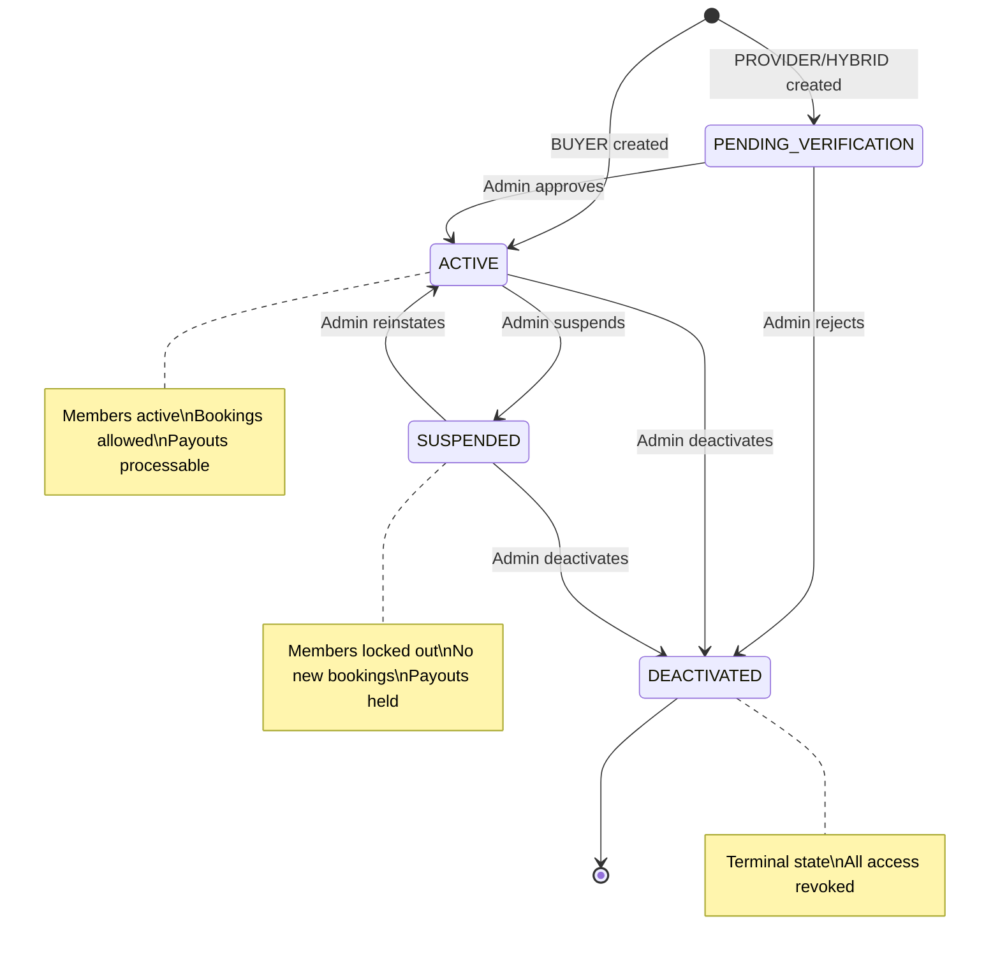

# Organization Lifecycle

**Status**: Implemented (Apr 2026)
**Branch**: `feature/enterprise`
**Scope**: Creation, verification, activation, deactivation

## Overview

Organizations are the enterprise container on Familiarise. Every org progresses through a lifecycle: it is created via a multi-step wizard, may require admin verification (PROVIDER/HYBRID), becomes ACTIVE when verified, and can later be suspended or deactivated. Three org kinds exist -- BUYER (corporates/schools purchasing sessions for employees), PROVIDER (consultant agencies hosting multiple consultants), and HYBRID (both). PROVIDER and HYBRID orgs are gated behind the `ENABLE_PROVIDER_ORGS` feature flag; attempting to create one while the flag is off returns 501.

---

## Creation

### Wizard Steps

The creation wizard lives at `/dashboard/organization/create`. The number of steps varies by org kind:

- **BUYER** — 5 steps: Org Info → Billing & Seats → Branding → Invite Team → Review
- **PROVIDER** — 5 steps: Org Info → Revenue Rates → Branding → Invite Team → Review (no Billing step; `billingMode` is omitted from the POST)
- **HYBRID** — 6 steps: Org Info → Billing & Seats → Revenue Rates → Branding → Invite Team → Review

```
BUYER (5 steps):
Step 0      Step 1           Step 2      Step 3       Step 4
OrgInfo ──► Billing & Seats ──► Branding ──► InviteTeam ──► Review

PROVIDER (5 steps):
Step 0      Step 1            Step 2      Step 3       Step 4
OrgInfo ──► Revenue Rates ──► Branding ──► InviteTeam ──► Review

HYBRID (6 steps):
Step 0      Step 1           Step 2           Step 3      Step 4       Step 5
OrgInfo ──► Billing & Seats ──► Revenue Rates ──► Branding ──► InviteTeam ──► Review

   └── Org created on Step 0 "Next" (POST /api/organizations)
       because Step 2/3 file uploads need the org ID
```

| Step | Kind | Fields | Notes |
| ---- | ---- | ------ | ----- |
| 0 - OrgInfo | All | name, kind, description, industry, sizeBucket, website, billingEmail | Org created here (Organization + OrganizationProfile + Member + OrgMemberProfile in one transaction) |
| 1 - Billing & Seats | BUYER, HYBRID | billingMode, paymentTermsDays, seatsTotal | billingMode options: TAG_ONLY, SEAT_PACK, INVOICED_MONTHLY |
| 1/2 - Revenue Rates | PROVIDER (step 1), HYBRID (step 2) | platformCommissionRate, orgRetainRate, consultantPayoutRate | Three percentage inputs; must sum to 100% (validated at API layer). `RevenueRatesStep` component. |
| - Branding | All | logo, bannerImage, primaryColor, secondaryColor | File uploads require orgId from Step 0 |
| - InviteTeam | All | inviteEmails[], inviteRole | Send email invitations via Resend |
| - Review | All | (read-only summary) | Final confirmation |

**File**: `app/dashboard/organization/create/types.ts` (OrgWizardData interface)

### What Gets Created (Step 0 Transaction)

A single Prisma `$transaction` creates four rows atomically:

```
┌──────────────────────┐     1:1     ┌──────────────────────────┐
│ Organization         │────────────►│ OrganizationProfile      │
│ (BetterAuth table)   │             │                          │
│ name, slug, logo     │             │ kind, status, billingMode│
└──────────────────────┘             │ billingEmail, rates ...  │
         │                           └──────────────────────────┘
         │ 1:1                                    │ 1:many
         ▼                                        ▼
┌──────────────────────┐     1:1     ┌──────────────────────────┐
│ Member               │────────────►│ OrganizationMemberProfile│
│ (BetterAuth table)   │             │                          │
│ userId, role         │             │ role: ORG_OWNER          │
│                      │             │ status: ACTIVE           │
└──────────────────────┘             └──────────────────────────┘
```

If `billingMode === SEAT_PACK`, an `OrgCreditPool` row with zero balance is also created so the dashboard can render without a null check.

### Slug Generation

Slugs are derived from the org name (`slugify()`), or the caller can supply one. On unique-constraint collision (Prisma P2002), a random 6-character suffix is appended and the transaction is retried once.

### Ownership Limit

A user may own at most 5 organizations (mirroring BetterAuth's `organizationLimit`). Exceeding this returns 403.

---

## Status Transitions

The following state diagram shows all valid organization status transitions and the conditions that trigger them.



```
                   APPROVE
PENDING_VERIFICATION ──────────► ACTIVE ──────────► SUSPENDED
        │                          │                    │
        │ REJECT                   │                    │
        ▼                          │                    ▼
   DEACTIVATED ◄───────────────────┘              DEACTIVATED
                    (manual)
```

| Org Kind | Initial Status | Reason |
| -------- | -------------- | ------ |
| BUYER | ACTIVE | No verification needed -- self-serve |
| PROVIDER | PENDING_VERIFICATION | Requires platform admin approval |
| HYBRID | PENDING_VERIFICATION | Requires platform admin approval |

### Admin Verification

**Endpoint**: `POST /api/admin/organizations/[orgId]/verify`
**Auth**: Platform ADMIN only (`requireAdminAuth`)
**Body**: `{ action: "APPROVE" | "REJECT", reason?: string }`

| Action | Result |
| ------ | ------ |
| APPROVE | status set to ACTIVE |
| REJECT | status set to DEACTIVATED, reason stored |

Concurrency: Uses atomic `updateMany({ where: { status: "PENDING_VERIFICATION" } })`. If two admins race, the second sees `count = 0` and gets 404. Prevents double-approve/double-reject. See `docs/enterprise/15-concurrency-and-locking.md` §6.

**File**: `app/api/admin/organizations/[orgId]/verify/route.ts`

---

## Member Management

### Roles

| Role | Available In | Capabilities |
| ---- | ------------ | ------------ |
| ORG_OWNER | All kinds | Full control: billing, deletion, settings, members |
| ORG_ADMIN | All kinds | Members + plans + settings (no billing/deletion) |
| ORG_MANAGER | All kinds | BUYER: team analytics + seat mgmt. PROVIDER: consultant earnings view |
| ORG_CONSULTANT | PROVIDER/HYBRID | Provides services on behalf of the org (feature-flagged) |
| ORG_LEARNER | BUYER/HYBRID | Employee/student consuming sessions |
| ORG_SUPPORT | All kinds | Support staff with no billing access |

### Invitations

Invitations are sent by email (via Resend). The flow:

```
ORG_OWNER/ADMIN sends invite
        │
        ▼
Email delivered to invitee
        │
        ▼
Invitee clicks accept link
        │
        ▼
Member + OrganizationMemberProfile created
(role from invitation, status: ACTIVE)
```

Concurrency notes:
- **Sending** (`POST /api/organizations/[orgId]/invitations`): wrapped in a Serializable TX to prevent two concurrent POSTs creating duplicate pending invitations for the same email. PostgreSQL SSI aborts the loser (P2034 → 409).
- **Accepting** (`POST /api/organizations/invitations/accept`): atomic `updateMany({ where: { status: "pending" } })` at TX start — only one concurrent accept sees `count = 1`; the other gets 409 INVITATION_ALREADY_ACCEPTED.

See `docs/enterprise/15-concurrency-and-locking.md` §§1 and 4.

### Seat Management (BUYER / HYBRID)

BUYER orgs track seats via `seatsTotal` and `seatsUsed` on OrganizationProfile. When a new ORG_LEARNER is added:

- Atomic seat acquisition: `UPDATE ... SET seatsUsed = seatsUsed + 1 WHERE seatsUsed < seatsTotal`
- `seatAssignedAt` timestamp recorded on the member profile
- `seatsTotal = null` means unlimited seats (rare; custom enterprise plans)

---

## Wizard Abandonment

**Problem**: The org is created on Step 0 "Next" (to provide an orgId for file uploads in Step 2). If the user abandons the wizard at Step 1 or later, a partially-configured org exists in the database.

**Current state**: These orphaned orgs remain in the database. BUYER orgs are ACTIVE but lack branding/billing config. PROVIDER/HYBRID orgs remain PENDING_VERIFICATION, so they are inert.

**Planned solution**: Cleanup cron job (Issue #661) or introduction of a DRAFT status that precedes PENDING_VERIFICATION/ACTIVE.

---

## SSO Setup

SSO is configured after org creation by the ORG_OWNER. It is part of the org lifecycle but has its own complexity. See `08-sso-and-authentication.md` for full details.

---

## Deactivation

When an org is deactivated:

- Members lose access to the org dashboard
- Sessions tied to the org are no longer bookable
- Payouts (PROVIDER/HYBRID) are held until resolved
- The org is filtered out from member listing queries (`status !== "DEACTIVATED"`)
- SSO domain claims are not automatically released (manual cleanup needed)

---

## Key Files

| File | Purpose |
| ---- | ------- |
| `app/api/organizations/route.ts` | GET (list orgs) + POST (create org) |
| `app/api/admin/organizations/[orgId]/verify/route.ts` | Admin verification (APPROVE/REJECT) |
| `app/dashboard/organization/create/types.ts` | OrgWizardData + StepProps interfaces |
| `prisma/schema.prisma` (lines 458-567) | Organization, OrganizationProfile, enums |
| `prisma/schema.prisma` (lines 569-627) | OrganizationMemberProfile, OrgMemberRole |
| `lib/auth-helpers.ts` | `requireOrgAccess()` helper for role-gated endpoints |
| `lib/feature-flags.ts` | `ENABLE_PROVIDER_ORGS` flag |

---

## Edge Cases

| Scenario | Behavior |
| -------- | -------- |
| Wizard abandoned after Step 0 | Partially-configured org persists; cleanup cron planned (Issue #661) |
| Slug collision on create | Random suffix appended, transaction retried once |
| Reducing `seatsTotal` below `seatsUsed` | Not currently blocked at API layer -- needs validation guard |
| Deactivating org with pending payouts | Payouts remain in PENDING status; manual admin resolution required |
| User owns 5 orgs and tries to create a 6th | 403: "maximum number of owned organizations (5)" |
| Creating PROVIDER org with flag off | 501: "PROVIDER organizations are not yet available" |
| Two concurrent invitation accepts | Second gets 409 INVITATION_ALREADY_ACCEPTED (atomic `updateMany` in TX) |
| Two owners concurrently demoting each other | Post-update count inside TX: whichever commits last sees 0 owners → 409 LAST_OWNER |
| Two admins approving the same org simultaneously | Atomic `updateMany` on `PENDING_VERIFICATION`; second gets 404 |
