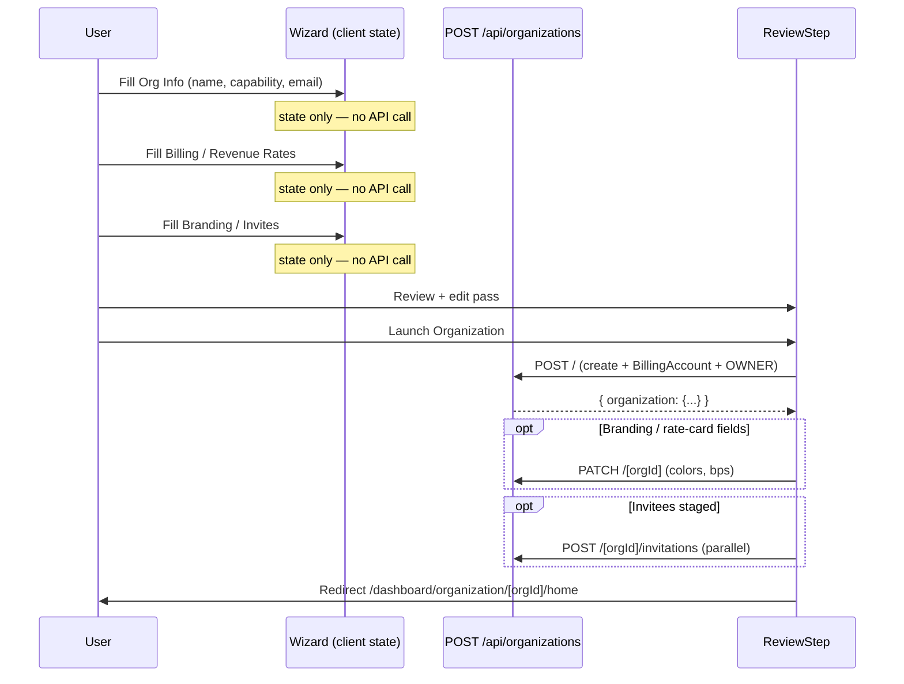

# Organization lifecycle

Three models carry their own lifecycle state machine in the enterprise
layer: `Organization`, `Contract`, and `Program`. Each is driven by a
Prisma enum and guarded by explicit allowed-transition tables in the
API.

## `OrgStatus` state machine

```prisma
enum OrgStatus {
  PENDING_VERIFICATION
  ACTIVE
  SUSPENDED
  DEACTIVATED
}
```

```
                      ┌──────► SUSPENDED ──────┐
PENDING_VERIFICATION ─┤                        │──► DEACTIVATED (terminal)
                      └──────► ACTIVE ◄────────┘
                                │
                                └──► DEACTIVATED
```

Transitions are gated by `POST /api/admin/organizations/[orgId]/verify`
(`app/api/admin/organizations/[orgId]/verify/route.ts`). The route
accepts `action: VERIFY | SUSPEND | REACTIVATE | DEACTIVATE` and
enforces:

| From                   | Allowed actions          |
|------------------------|--------------------------|
| `PENDING_VERIFICATION` | `VERIFY`, `DEACTIVATE`   |
| `ACTIVE`               | `SUSPEND`, `DEACTIVATE`  |
| `SUSPENDED`            | `REACTIVATE`, `DEACTIVATE` |
| `DEACTIVATED`          | none — terminal          |

Every transition emits an `OrgAuditLog` row in the `SYSTEM` category
with one of `AUDIT_ACTIONS.SYSTEM.{VERIFIED, SUSPENDED, REACTIVATED,
DEACTIVATED}`.

## What each status allows

- **PENDING_VERIFICATION** — the default on org creation. The org owner
  can configure settings, BillingAccount, invite members, and sketch
  contracts. `requireOrgAccess` still lets members in. Payments and
  payouts are not intended to flow until an admin flips the status to
  ACTIVE.
- **ACTIVE** — the only status where every feature is live.
- **SUSPENDED** — read-only guards are up to each caller; the org
  record is still accessible. The suspension reason is captured in the
  `OrgAuditLog.details.reason` field.
- **DEACTIVATED** — `requireOrgAccess` rejects every caller with a
  `403 "Organization has been deactivated"`. The row is retained for
  audit; admins use this instead of `DELETE` when the org has any
  contracts, invoices, POs, or earnings.

## Deletion

`DELETE /api/organizations/[orgId]` (`app/api/organizations/[orgId]/route.ts`)
is owner-only and refuses if the org has **any** of:

- `contracts` (any status)
- `invoices`
- `purchaseOrders`
- `earnings`

The error message tells the caller to use the admin deactivate path
instead. This is not a compliance rule — it's an audit-trail guarantee.

## Organization creation

`POST /api/organizations` (`app/api/organizations/route.ts`) runs a
single Prisma transaction that:

1. Validates a unique lower-case slug.
2. Creates the `Organization` with `status = PENDING_VERIFICATION` and
   `rootId = <the new org's own id>` (hierarchy is schema-only in v1;
   root orgs self-point).
3. If `canSponsor=true`, creates the `BillingAccount` with the chosen
   `fundingSource`. `walletBalance = 0` is set when the source is
   `WALLET`, and `null` otherwise.
4. Creates an `OWNER` `Membership` row AND a matching BetterAuth `Member`
   row, bridged via `Membership.betterAuthMemberId`.
5. Writes the first `OrgAuditLog` row (category `MEMBER`, action
   `MEMBER_ADDED`).

If `canSponsor || canHost` is false the request is rejected at the Zod
boundary.

### Wizard flow: commit-on-review

The UI wizard at `components/organization/create-wizard/` **defers the
POST to the final Review step's "Launch" action**. Earlier steps
accumulate state in local React state only — dropping out before
Review leaves zero rows in the database. This avoids orphan
`Organization` records from users who bail mid-setup.



If `Launch` fails after the POST succeeded but before the PATCH or
invites land, the wizard keeps `initialData.orgId` in state so the
retry hits the same org row — the POST path is short-circuited and the
retry is fully idempotent.

## `Contract` lifecycle

```prisma
enum ContractStatus {
  DRAFT
  ACTIVE
  EXPIRED
  TERMINATED
}
```

- `DRAFT` → `ACTIVE` via `PATCH /api/organizations/[orgId]/contracts/[contractId]`
  (OWNER only). The handler sets `signedAt = now()` and flips the status.
- `ACTIVE` → `EXPIRED` is set by a cron walk (stub in v1) when `effectiveTo`
  passes. Earnings already snapshot their `rateCardId` + bps so in-flight
  settlement isn't affected.
- `ACTIVE` → `TERMINATED` is an OWNER-initiated early exit. Programs
  attached to a terminated contract can't accept new bookings
  (`POST /programs` refuses to attach to a TERMINATED/EXPIRED contract
  in `app/api/organizations/[orgId]/programs/route.ts`).

`DELETE /api/organizations/[orgId]/contracts/[contractId]` is only
permitted on `DRAFT` contracts; anything else must transition to
`TERMINATED`.

Each transition emits an `OrgAuditLog` entry in the `CONTRACT` category
via `AUDIT_ACTIONS.CONTRACT.{CONTRACT_CREATED, CONTRACT_SIGNED,
CONTRACT_TERMINATED, CONTRACT_EXPIRED}`.

## `Program` lifecycle

```prisma
enum ProgramStatus {
  ACTIVE
  PAUSED
  EXPIRED
  CANCELLED
}
```

- `PAUSED` stops new `ProgramAssignment`s and new bookings against
  existing assignments. Existing sessions already in-flight are not
  cancelled.
- `EXPIRED` is driven by the cron that walks contract `effectiveTo`.
- `CANCELLED` is a terminal state set by
  `DELETE /api/organizations/[orgId]/programs/[programId]` (MAINTAINER)
  when there are no assignments. If assignments exist, the route flips
  to `CANCELLED` status rather than hard-deleting.

`POST /api/organizations/[orgId]/programs/[programId]/assignments`
only accepts assignments when `program.status = ACTIVE`.

## Related docs

- `01-organization-types.md` — capability flips also gate status
  mutations (can't disable canSponsor with a non-zero wallet).
- `08-sso-and-authentication.md` — SSO enforcement for
  PENDING_VERIFICATION orgs.
- `16-programs.md` — the program subtypes behind this lifecycle.
