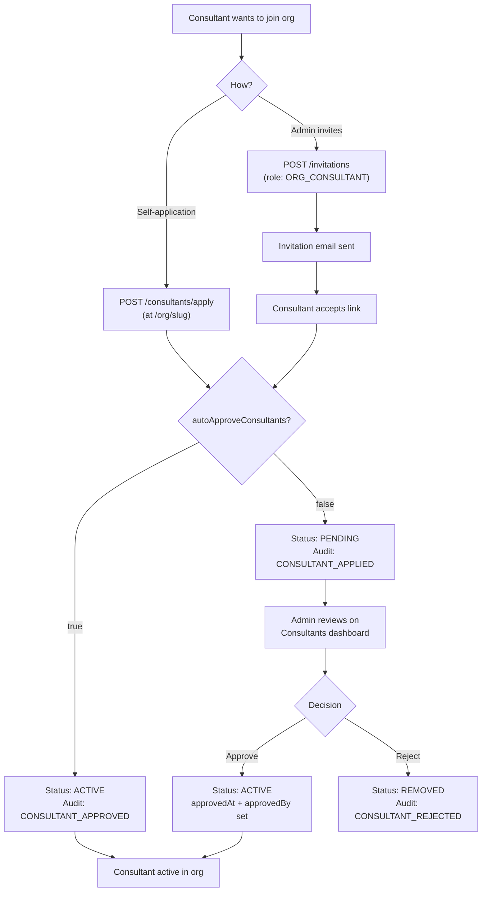

# Consultant Lifecycle

**Status**: Implemented (Apr 2026)
**Branch**: `feature/enterprise`
**Scope**: PROVIDER and HYBRID orgs only
**Feature Flag**: `ENABLE_PROVIDER_ORGS`

## Overview

Consultants join PROVIDER and HYBRID organizations through two paths: invitation by an org admin, or self-application through the org's public page. In both cases, the consultant either enters PENDING status for admin review, or is auto-approved if the org has enabled `autoApproveConsultants`. Once active, each consultant can have a custom payout rate and earnings recipient configuration. All state changes are recorded in the audit log.

---

## Two Onboarding Paths

The following flowchart shows both consultant onboarding paths -- admin invitation and self-application -- converging at the auto-approve decision point.



### Path A: Invitation (Push)

The org admin sends an invite with `role=ORG_CONSULTANT`. The consultant receives an email and accepts.

```
┌──────────────┐         ┌──────────────┐         ┌──────────────┐
│ ORG_ADMIN    │         │   Email      │         │ Consultant   │
│ sends invite │────────►│   delivered  │────────►│ clicks       │
│ (role: ORG_  │         │   via Resend │         │ accept link  │
│  CONSULTANT) │         │              │         │              │
└──────────────┘         └──────────────┘         └──────┬───────┘
                                                         │
                                                         ▼
                                            ┌────────────────────────┐
                                            │ Member + OrgMember-    │
                                            │ Profile created        │
                                            │                        │
                                            │ autoApproveConsultants?│
                                            │ ├── true → ACTIVE      │
                                            │ └── false → PENDING    │
                                            └────────────────────────┘
```

### Path B: Self-Application (Pull)

The consultant visits the org's public page (`/org/[slug]`) and clicks "Apply".

```
Consultant visits /org/[slug]
        │
        ▼
POST /api/organizations/[orgId]/consultants/apply
Body: { note?: string }
        │
        ▼
┌──────────────────────────────────────────────┐
│ Validation checks:                           │
│ 1. Org exists, is PROVIDER/HYBRID, is ACTIVE │
│ 2. Caller has a verified ConsultantProfile   │
│ 3. Caller is not already a member (→ 409)    │
└──────────────┬───────────────────────────────┘
               │
               ▼
┌──────────────────────────────────────┐
│ Transaction:                         │
│ 1. Find or create BetterAuth Member │
│ 2. Create OrgMemberProfile          │
│    (role: ORG_CONSULTANT)            │
│ 3. Write OrgAuditLog entry          │
└──────────────┬───────────────────────┘
               │
               ▼
     autoApproveConsultants?
     ├── true  → status: ACTIVE,  approvedAt: now, approvedBy: null
     └── false → status: PENDING, awaiting admin review
```

**File**: `app/api/organizations/[orgId]/consultants/apply/route.ts`

---

## Application Review

### Listing Pending Applications

**Endpoint**: `GET /api/organizations/[orgId]/consultants?status=PENDING`
**Auth**: Any org member (via `requireOrgAccess`)
**Response**: Array of OrgMemberProfile objects with nested user and consultantProfile data

The response includes:
- User info (name, email, image)
- Consultant profile (headline, rating, isVerified)
- Application metadata (applicationNote, appliedAt)

Valid status filter values: `ACTIVE`, `PENDING`, `SUSPENDED`, `REMOVED`.

### Approve or Reject

**Endpoint**: `POST /api/organizations/[orgId]/consultants`
**Auth**: ORG_ADMIN or higher (`requireOrgAccess(orgId, "ORG_ADMIN")`)
**Body**: `{ memberId: string, action: "APPROVE" | "REJECT" }`

| Action | Effect |
| ------ | ------ |
| APPROVE | status set to ACTIVE, `approvedAt` = now, `approvedBy` = acting admin's member ID |
| REJECT | status set to REMOVED |

Both actions write an OrgAuditLog entry (CONSULTANT_APPROVED or CONSULTANT_REJECTED).

**File**: `app/api/organizations/[orgId]/consultants/route.ts`

---

## Application Metadata

All application-related fields live on `OrganizationMemberProfile`:

| Field | Type | Description |
| ----- | ---- | ----------- |
| `applicationNote` | String? (Text) | Free-text note submitted with the application (max 1000 chars) |
| `appliedAt` | DateTime? | Timestamp of application submission |
| `approvedAt` | DateTime? | Timestamp of approval (null if auto-approved has `approvedBy = null`) |
| `approvedBy` | String? | OrgMemberProfile.id of the admin who approved (null for auto-approve) |

---

## Multi-Org Support

A consultant can be `ORG_CONSULTANT` in multiple PROVIDER orgs simultaneously. There is no exclusivity constraint.

```
┌───────────────────┐
│ ConsultantProfile │
│ (Alice)           │
└────────┬──────────┘
         │
    ┌────┴──────────────────────┐
    │                           │
    ▼                           ▼
┌─────────────────┐    ┌─────────────────┐
│ Org A (PROVIDER)│    │ Org B (PROVIDER)│
│                 │    │                 │
│ Rate: 85%       │    │ Rate: 90%       │
│ Recipient:      │    │ Recipient:      │
│   CONSULTANT    │    │   ORGANIZATION  │
└─────────────────┘    └─────────────────┘
```

Each org has independent configuration for that consultant:
- Its own payout rate split
- Its own `earningsRecipient` setting
- Its own approval/rejection state

---

## Per-Consultant Configuration

### Custom Payout Rate

`customConsultantPayoutRate` on OrgMemberProfile overrides the org-level `consultantPayoutRate`.

**Worked example:**

| Setting | Org Default | Consultant A (override) | Consultant B (no override) |
| ------- | ----------- | ----------------------- | -------------------------- |
| Platform commission | 10% | 10% | 10% |
| Org retain | 5% | 5% | 5% |
| Consultant payout | 85% | 90% (custom) | 85% (default) |

For a ₹10,000 session:
- Consultant A receives: ₹9,000 (90%)
- Consultant B receives: ₹8,500 (85%)
- Org retains: ₹500 (A) or ₹500 (B) -- org rate unchanged
- Platform takes: ₹1,000 in both cases
- Note: when `customConsultantPayoutRate` is set, the org's share may need re-balancing to ensure the three rates sum to 1.0.

### Earnings Recipient

The `earningsRecipient` field on OrgMemberProfile controls where the consultant's share goes:

| Value | Meaning | Use Case |
| ----- | ------- | -------- |
| `CONSULTANT` (default) | Consultant receives their share directly | Freelance/independent consultants |
| `ORGANIZATION` | Org captures the consultant's share too | Salaried/internal consultants |

When set to `ORGANIZATION`, the org receives both its own 5% share and the consultant's 85% share (90% total), and handles the consultant's compensation outside Familiarise.

---

## Audit Trail

Every consultant lifecycle event writes to `OrgAuditLog`:

| Action | When | Details JSON |
| ------ | ---- | ------------ |
| `CONSULTANT_APPLIED` | Self-application submitted (not auto-approved) | `{ consultantProfileId, userId, autoApproved: false, note }` |
| `CONSULTANT_APPROVED` | Admin approves, or auto-approve triggers | `{ consultantProfileId, userId, autoApproved: true/false }` or `{ memberId }` |
| `CONSULTANT_REJECTED` | Admin rejects application | `{ memberId }` |

---

## Key Files

| File | Purpose |
| ---- | ------- |
| `app/api/organizations/[orgId]/consultants/apply/route.ts` | POST: self-application |
| `app/api/organizations/[orgId]/consultants/route.ts` | GET: list consultants; POST: approve/reject |
| `app/api/organizations/public/[slug]/route.ts` | Public org page (apply button target) |
| `prisma/schema.prisma` (lines 569-618) | OrganizationMemberProfile model |
| `prisma/schema.prisma` (lines 620-627) | OrgMemberRole enum |
| `prisma/schema.prisma` (lines 629-634) | OrgMemberStatus enum |
| `prisma/schema.prisma` (lines 951-954) | EarningsRecipient enum |

---

## Edge Cases

| Scenario | Behavior | Status Code |
| -------- | -------- | ----------- |
| Duplicate application (already a member) | "You are already a member of this organization" | 409 |
| Applying to a BUYER org | "Organization not found or not accepting consultant applications" | 404 |
| Unverified consultant applying | "You must be a verified consultant to apply" | 403 |
| Approving a non-PENDING member | "No pending consultant application found with that ID" | 404 |
| Feature flag off | "PROVIDER organization consultants are not yet available" | 501 |
| Consultant in multiple orgs | Allowed -- no exclusivity constraint | 201 |
| Org not ACTIVE | Self-application query filters `status: "ACTIVE"` -- returns 404 | 404 |
