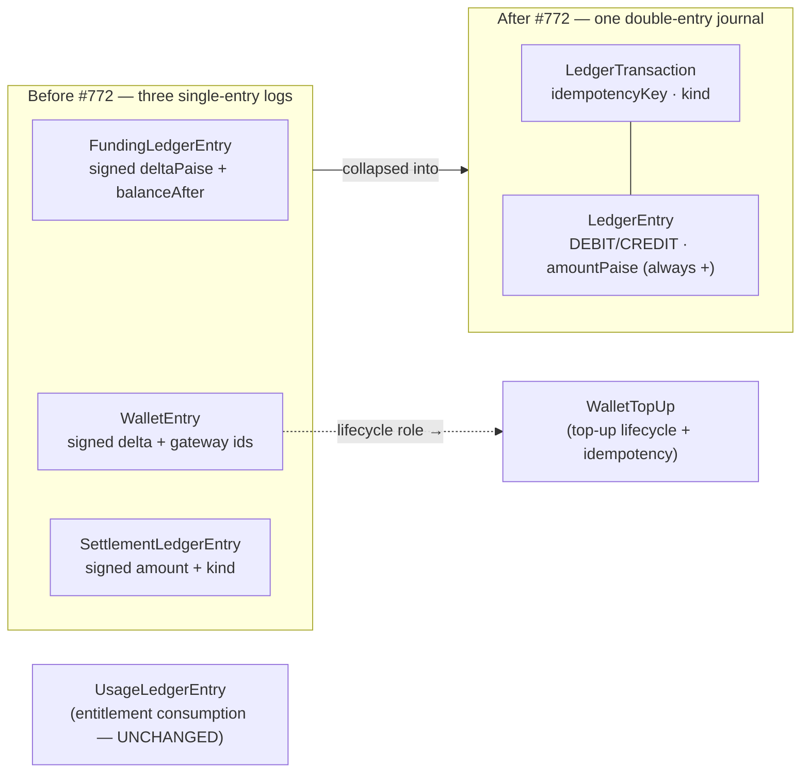

# Money model overview

**What this covers:** the principles every money doc in this section (`06`–`14`) builds on — integer paise, the double-entry journal, derived balances, and what the **#772 cutover** changed. Read this first; the rest of the band is detail.

> **One-sentence model.** Every cash event in the platform is recorded as **one balanced double-entry transaction** in a single journal (`LedgerTransaction` + `LedgerEntry`), and **every balance is derived by summing that journal** — nothing about "how much money is where" is stored as an authoritative number.

---

## 1. Three rules that never bend

1. **Money is integer paise.** No floats, ever. ₹1 = 100 paise; `amountPaise: 50000` is ₹500. Floating-point rounding has no place in a ledger. Percentages and splits are **basis points** (`bps`, integer; 10000 = 100%), not floats — see [chart of accounts](07-chart-of-accounts.md) and [booking → earnings](10-booking-to-earnings.md).
2. **Every cash event is a balanced transaction.** A posting set is only valid when **Σ(DEBIT) == Σ(CREDIT)**. `postLedgerTxn()` rejects anything else with `LedgerImbalanceError` before a row is written. This is the invariant the nightly reconciler re-proves (`LEDGER_TXN_IMBALANCE`).
3. **Balances are derived, never stored.** "What do we owe this org / this consultant / the government?" is always a `SUM` over journal entries (`ledgerBalancePaise()`), not a column. The few balance-shaped columns that exist (`BillingAccount.walletBalance`) are **caches** the reconciler asserts against the journal — see §4.

---

## 2. What #772 changed (read this if you've seen the old docs)

Before the cutover the schema carried **three single-entry, signed-delta logs**:

| Removed model | What it logged | Where it lives now |
| --- | --- | --- |
| `FundingLedgerEntry` | money allocations (top-up / booking debit / refund / grant) with a running `balanceAfterPaise` | the journal (`LedgerEntry` on the relevant accounts) |
| `WalletEntry` | per-row wallet history + gateway idempotency | `WalletTopUp` (lifecycle/idempotency) + `LedgerEntry` on the org `WALLET` account (history) |
| `SettlementLedgerEntry` (+ `SettlementKind`) | external settlements (invoice issued/paid, payout sent, refund) | `LedgerTransaction.kind` + `OrgAuditLog` |

**Why one journal beats three logs.** The old logs each answered one question but couldn't cross-check each other without JSON joins and date heuristics. A double-entry journal makes the cross-check structural: because every transaction balances and every balance is a sum of the same rows, a single invariant (`Σdebit == Σcredit`) guarantees the books tie out. Reconciliation went from "compare three logs and hope" to "re-sum one journal."

> **If you read `FundingLedgerEntry`, `WalletEntry`, `SettlementLedgerEntry`, or `SettlementKind` anywhere outside [`history/`](history/) — it's stale. File it.** The usage ledger (`UsageLedgerEntry`) is **not** one of the removed logs; it tracks *entitlement consumption*, not money — see [programs](21-programs.md).

So today there are **two** ledgers, not three:

- **The money journal** — `LedgerTransaction`/`LedgerEntry`, double-entry, this section's subject.
- **The usage ledger** — `UsageLedgerEntry`, single-entry, counts engagements consumed against a program cap. Different question ("what did this member consume?"), different table.

---

## 3. The three moving parts of the journal

| Thing | Role | Detail |
| --- | --- | --- |
| `LedgerAccount` | a bucket money sits in (CASH, WALLET, …), scoped to platform / org / consultant | [chart of accounts](07-chart-of-accounts.md) |
| `LedgerTransaction` | one balanced cash event, `idempotencyKey @unique`, free-string `kind` | [ledger & postings](08-ledger-and-postings.md) |
| `LedgerEntry` | one leg of a transaction: `direction` + positive `amountPaise BigInt` | [ledger & postings](08-ledger-and-postings.md) |

The sign of money is carried by **direction**, never by a negative amount. Every `LedgerEntry.amountPaise` is a positive integer; whether it adds or subtracts from a balance depends on the entry's `direction` and the account's normal side (§ in [chart of accounts](07-chart-of-accounts.md)).

---

## 4. "Derived, but cached" — the one nuance

A pure double-entry system would compute every balance on read. We do that *almost* everywhere. The single exception is the **wallet overdraft guard**: a booking must atomically check "does this org have enough wallet balance?" and decrement it, under concurrency, without two bookings both spending the last rupee. The cheapest correct primitive for that is a conditional SQL `UPDATE … WHERE walletBalance >= amount` — which needs a real column.

So `BillingAccount.walletBalance` exists as a **cache** of the org's `WALLET` account balance. The contract:

- The journal is the source of truth.
- The cache is what the hot path reads/writes for the atomic guard.
- The nightly reconciler asserts `-balance(WALLET) == walletBalance` (`WALLET_BALANCE_DRIFT`); any divergence is an incident, never something to hand-patch.

This "reconciled cache" pattern recurs: `ConsultantEarnings`/`OrganizationEarnings` amount columns are also caches the reconciler checks against the booking journal (`EARNINGS_LEDGER_DRIFT`). See [ledger integrity](14-ledger-integrity.md).

---

## 5. Where each money flow is documented

| Flow | Journal `kind` | Doc |
| --- | --- | --- |
| Wallet top-up (`Dr CASH / Cr WALLET`) | `TOPUP` | [wallet & top-ups](09-wallet-and-topups.md) |
| Booking (funding legs → fee/payable/GST) | `BOOKING` | [booking → earnings](10-booking-to-earnings.md) |
| Payout to a consultant / host org | `PAYOUT` / `ORG_PAYOUT` | [payout pipeline](11-payout-pipeline.md) |
| Invoice issued / paid | `INVOICE_ISSUED` / `INVOICE_PAID` | [invoicing](12-invoicing.md) |
| Refund / top-up refund | `REFUND` / `TOPUP_REFUND` | [invoicing](12-invoicing.md), [wallet & top-ups](09-wallet-and-topups.md) |
| How funding sources stack on one checkout | — | [payment legs](13-payment-legs.md) |
| Proving it all ties out | — | [ledger integrity](14-ledger-integrity.md) |

---

## 6. Money vocabulary — five distinct flows

New devs routinely conflate these. They are different flows with different models — learn the distinction once:

- **Refund** — money back to the *buyer* (consultee). A booking is reversed; the buyer's card/wallet is credited. Model `Refund` (`lib/payments/operations/refund.ts`), status `PENDING → SUCCEEDED | FAILED | CANCELLED` (gateway-aligned — success is `SUCCEEDED`, matching Razorpay's `refund.processed`). Journal: `refund:<refundId>` reverses the booking legs ([§4.7](08-ledger-and-postings.md)); a *top-up* refund is `topup-refund:<paymentId>`.
- **Reimbursement** — money from an *org to its own member* who fronted org-sponsored spend. Model `OrganizationReimbursement` (`/api/organizations/[orgId]/reimbursements`). **Not** a refund — org → member, not platform → card.
- **Payout** — money from the *platform to a seller* (consultant or host org), net of commission + TDS. Models `ConsultantPayout` / `OrganizationPayout`; journal `payout:<id>` / `orgpayout:<id>` (Dr `*_PAYABLE` / Cr `CASH` + `TDS_PAYABLE`) — see [payout pipeline](11-payout-pipeline.md).
- **Referral** — a *platform-funded* incentive, not a buyer payment. A shared link earns a `ReferralCredit`; consumed at checkout as `PaymentLeg.source = REFERRAL_CREDIT`, posting to `PLATFORM_PROMO` (the platform absorbs it) inside the booking txn.
- **Credits** — two senses, don't confuse: (a) an **org's prepaid wallet balance** — the `WALLET` ledger account, cached on `BillingAccount.walletBalance`; (b) a **consultee's referral/promo credits** — `ReferralCredit`, consumed via the `REFERRAL_CREDIT` leg. The first is org money we owe back; the second is a platform-funded discount.

> The old per-row `WalletEntry` with `reason = REFERRAL_BONUS` is gone (#772); referral credits now live as `ReferralCredit` and post to `PLATFORM_PROMO` when consumed.

---

### Related docs
- [Chart of accounts](07-chart-of-accounts.md) — the buckets and their normal sides.
- [Ledger & postings](08-ledger-and-postings.md) — `postLedgerTxn`, idempotency, every flow's legs.
- [Wallet & top-ups](09-wallet-and-topups.md) — the cache pattern in practice.
- [Ledger integrity](14-ledger-integrity.md) — the reconciler that proves the model holds.
- Ground truth: `lib/payments/ledger/post.ts`, `prisma/schema.prisma` (the `Ledger*` models), `scripts/reconcile/reconcile-ledgers.ts`.
