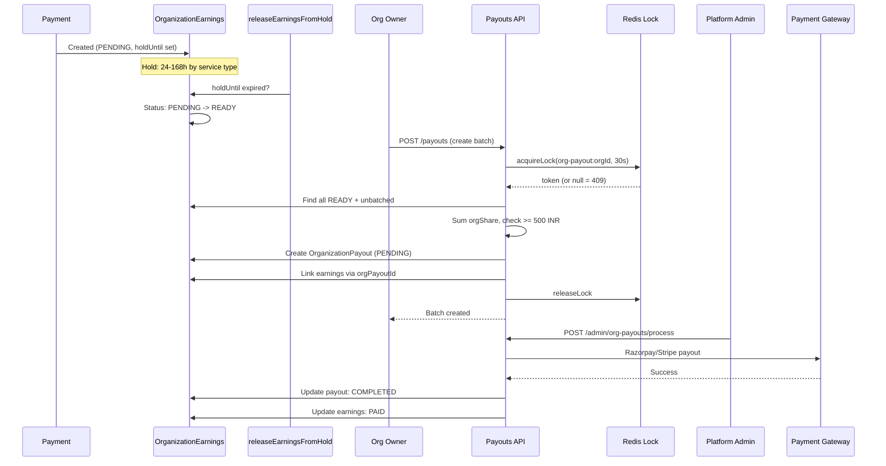

# Payout Pipeline

**Status**: Implemented (Apr 2026)
**Branch**: `feature/enterprise`
**Scope**: PROVIDER and HYBRID orgs
**Feature Flag**: `ENABLE_PROVIDER_ORGS`

## Overview

When a learner books a session with an org-affiliated consultant, the payment is split three ways: platform fee, org share, and consultant share. The org's slice is tracked as an `OrganizationEarnings` row. After a service-type-specific hold period, earnings become READY. The org owner can then batch all READY earnings into an `OrganizationPayout`, which a platform admin processes through Razorpay or Stripe. This pipeline mirrors the existing consultant payout system.

---

## Pipeline Stages

The following sequence diagram shows the full payout pipeline from payment receipt through hold release, batch creation with distributed locking, to admin-initiated gateway disbursement.



```
Payment received (learner checkout)
        │
        ▼
┌──────────────────────────────────────────────┐
│ OrganizationEarnings created                 │
│ status: PENDING                              │
│ holdUntil: now + hold period                 │
│                                              │
│ grossAmount    ── full payment amount        │
│ platformFee    ── 10% (default)              │
│ orgShare       ── 5% (default)               │
│ refundedAmount ── 0                          │
└──────────────────────┬───────────────────────┘
                       │
                       ▼ [hold period elapses]
              Cron: releaseEarningsFromHold
                       │
                       ▼
              status: READY
              orgPayoutId: null (unbatched)
                       │
                       ▼ [ORG_OWNER clicks "Create Payout Batch"]
┌──────────────────────────────────────────────┐
│ OrganizationPayout created                   │
│ status: PENDING                              │
│ All READY earnings linked via orgPayoutId    │
└──────────────────────┬───────────────────────┘
                       │
                       ▼ [Platform ADMIN processes]
              POST /api/admin/org-payouts/process
                       │
                       ▼
              Gateway disbursement
              (Razorpay IMPS/RTGS or Stripe Connect)
                       │
                       ▼
              OrganizationPayout.status: COMPLETED
              Linked earnings status: PAID
```

### Hold Periods

Earnings remain in PENDING status until the hold period elapses, at which point a cron job transitions them to READY.

| Service Type | Hold Period | Rationale |
| ------------ | ----------- | --------- |
| CONSULTATION | 24 hours | Short sessions -- quick confirmation |
| CLASS | 24 hours | Similar to consultations |
| WEBINAR | 48 hours | Larger audiences -- more refund risk |
| SUBSCRIPTION | 168 hours (7 days) | Recurring -- needs churn buffer |

**File**: `lib/payments/payouts/constants.ts` -- `PAYOUT_CONSTANTS.HOLD_PERIOD_HOURS`

---

## Revenue Split (Default)

The org-level rates are stored on `OrganizationProfile`:

| Party | Default Rate | Field |
| ----- | ------------ | ----- |
| Platform | 10% | `platformCommissionRate` |
| Organization | 5% | `orgRetainRate` |
| Consultant | 85% | `consultantPayoutRate` |

**Validation**: The three rates must sum to 1.0, enforced at the PATCH endpoint.

**Worked example** -- ₹10,000 consultation:

```
┌─────────────────────────────────────────────────┐
│ Payment: ₹10,000                                │
│                                                  │
│ Platform fee:    ₹1,000  (10%)  ── retained     │
│ Org share:       ₹500    (5%)   ── OrgEarnings  │
│ Consultant share:₹8,500  (85%)  ── separate     │
│                                    payout system │
└─────────────────────────────────────────────────┘
```

Per-consultant override: if `OrgMemberProfile.customConsultantPayoutRate` is set (e.g. 90%), that consultant's share is ₹9,000 and the remaining split adjusts accordingly.

---

## Batch Creation

### Who

ORG_OWNER only.

### Endpoint

`POST /api/organizations/[orgId]/payouts`

### What Happens

1. Pre-check eligibility via `getOrgPayoutEligibility()`
2. If eligible, call `createOrgPayoutBatch()`
3. Inside the batch function:
   - Acquire a Redis distributed lock (`org-payout:{orgProfileId}`, 30s TTL)
   - Find all READY, unbatched OrganizationEarnings
   - Calculate totals: grossRevenue, platformFee, totalOrgShare, refunds, netPayout
   - Verify `netPayout >= MINIMUM_PAYOUT_AMOUNT` (₹500)
   - Verify payout account exists and is VERIFIED
   - Create OrganizationPayout record (status: PENDING)
   - Link all earnings to the payout via `orgPayoutId`
   - Write PAYOUT_INITIATED audit log entry
   - Release the lock

### Safety: Distributed Lock

```
acquireLock("org-payout:{orgProfileId}", 30_000)
        │
        ├── Success (token returned) → proceed with batch
        │
        └── Failure (null) → throw "Another payout batch is being
                              created... Please try again." → 409
```

The lock uses Upstash Redis `SET NX PX` and is released in a `finally` block. If Redis is unavailable (circuit breaker OPEN), `acquireLock` returns null and the caller sees the "try again" message.

**File**: `lib/redis.ts` -- `acquireLock()`, `releaseLock()`

### Minimum Threshold

`PAYOUT_CONSTANTS.MINIMUM_PAYOUT_AMOUNT = 50000` (₹500 in paise)

If the net payout amount is below ₹500, the batch is rejected with a 400 error.

### Payout Account Requirement

An `OrganizationPayoutAccount` must exist and have `status: VERIFIED`. Without it, batch creation fails.

---

## Processing

### Who

Platform ADMIN only.

### Endpoint

`POST /api/admin/org-payouts/process`

### What Happens

1. Finds all OrganizationPayout records with `status: PENDING`
2. For each payout, calls `processOrgPayout(payoutId)`
3. Processing flow:

```
PENDING ──► PROCESSING ──► COMPLETED
                │               │
                │ on error      │
                ▼               ▼
             FAILED         Linked earnings
                            status: PAID
```

**Claim-once atomicity**: The PENDING → PROCESSING transition uses a conditional
`updateMany({ where: { id, status: PENDING } })`. If the affected row count is 0,
another concurrent call already claimed the payout — the current call throws
without dispatching to the gateway. This prevents duplicate disbursements even
if the admin process route is triggered multiple times.

### Gateway Dispatch

| Gateway | Condition | Transfer Mode |
| ------- | --------- | ------------- |
| Razorpay | `razorpayFundAccountId` set on payout account | IMPS (< ₹2L) or RTGS (>= ₹2L) |
| Stripe | `stripeConnectId` set on payout account | Connect Transfer |
| Neither | No gateway IDs configured | Marked as manual (COMPLETED with failureReason note) |

**Razorpay mode selection**: `payout.amount >= 20000000` (₹2,00,000 in paise) uses RTGS; otherwise IMPS.

**Idempotency**: Both Razorpay and Stripe payouts pass `idempotencyKey: "org-payout-{payoutId}"` to prevent duplicate disbursements. Combined with the atomic claim-once status transition above, this gives defence-in-depth: even if two jobs race past the claim check, the gateway itself will reject the duplicate.

**File**: `lib/payments/payouts/org-payout-service.ts`

---

## Payout Account

**Endpoints**: `GET / PUT / DELETE /api/organizations/[orgId]/payout-account`
**Auth**: ORG_OWNER only

### Bank Details (PUT body)

| Field | Required | Example |
| ----- | -------- | ------- |
| `accountHolderName` | Yes | "Acme Consulting Pvt Ltd" |
| `accountNumber` | Yes | "1234567890123456" |
| `bankName` | Yes | "HDFC Bank" |
| `ifscCode` | No | "HDFC0001234" |
| `routingNumber` | No | (for international banks) |
| `swiftCode` | No | (for international banks) |

### Encryption

Account numbers are encrypted at rest using AES-256-GCM:

```
Format:  [12 bytes IV] [ciphertext] [16 bytes auth tag]
Key:     ORG_PAYOUT_ENCRYPTION_KEY env var (64 hex chars = 32 bytes)
Generate: openssl rand -hex 32
```

The encrypted bytes are base64-encoded before storage. GET never returns the full account number -- only `accountNumberLast4`.

**File**: `lib/payments/payouts/account-crypto.ts`

### Account Status

| Status | Meaning |
| ------ | ------- |
| PENDING_VERIFICATION | Just created -- awaiting admin verification |
| VERIFIED | Ready for payouts |
| FAILED_VERIFICATION | Admin rejected or verification failed |
| SUSPENDED | Temporarily blocked |

---

## Configurable Frequency

`OrganizationProfile.payoutFrequency` supports three values:

| Value | Meaning |
| ----- | ------- |
| WEEKLY | Payouts every week |
| BI_WEEKLY | Payouts every two weeks |
| MONTHLY (default) | Payouts once a month |

**Current state**: Payout batch creation is manual (org owner triggers via dashboard). Automated cron-based batching based on `payoutFrequency` is a planned follow-up.

---

## Audit Trail

| Action | When | Description Example |
| ------ | ---- | ------------------- |
| `PAYOUT_INITIATED` | Batch created | "Payout batch created: 5000 INR (12 earnings)" |
| `PAYOUT_PROCESSED` | Admin processes | "Payout {id} processed: 5000 INR" |
| `SETTINGS_CHANGED` | Payout account upserted/deleted | "Payout account updated" / "Payout account deleted" |

---

## Key Files

| File | Purpose |
| ---- | ------- |
| `lib/payments/payouts/org-payout-service.ts` | Core: eligibility check, batch creation, processing |
| `lib/payments/payouts/constants.ts` | Hold periods, minimum payout, RTGS threshold |
| `lib/payments/payouts/account-crypto.ts` | AES-256-GCM encrypt/decrypt for bank account numbers |
| `app/api/organizations/[orgId]/payouts/route.ts` | GET (list payouts) + POST (create batch) |
| `app/api/organizations/[orgId]/payout-account/route.ts` | GET/PUT/DELETE payout account |
| `app/api/admin/org-payouts/process/route.ts` | Admin: process all pending payouts |
| `lib/redis.ts` | `acquireLock()` / `releaseLock()` for distributed lock |
| `prisma/schema.prisma` (lines 660-766) | OrganizationPayoutAccount, OrganizationPayout, OrganizationEarnings |

---

## Edge Cases

| Scenario | Behavior | Status Code |
| -------- | -------- | ----------- |
| Concurrent batch creation | Redis lock prevents second call -- "try again" | 409 |
| Below minimum threshold | "Net payout amount (X) is below minimum threshold (500)" | 400 |
| Unverified payout account | "Payout account must be verified" | 400 |
| No payout account configured | Eligibility check returns ineligible | 400 |
| No READY earnings | "No earnings ready for payout" | 400 |
| Gateway processing fails | Payout marked FAILED with `failureReason`, error re-thrown | 500 |
| BUYER org requests payout | "BUYER orgs do not have payouts" | 400 |
| Redis unavailable (circuit open) | `acquireLock` returns null -- treated as lock held | 409 |
| Razorpay not configured | Payout marked COMPLETED with manual processing note | 200 |
