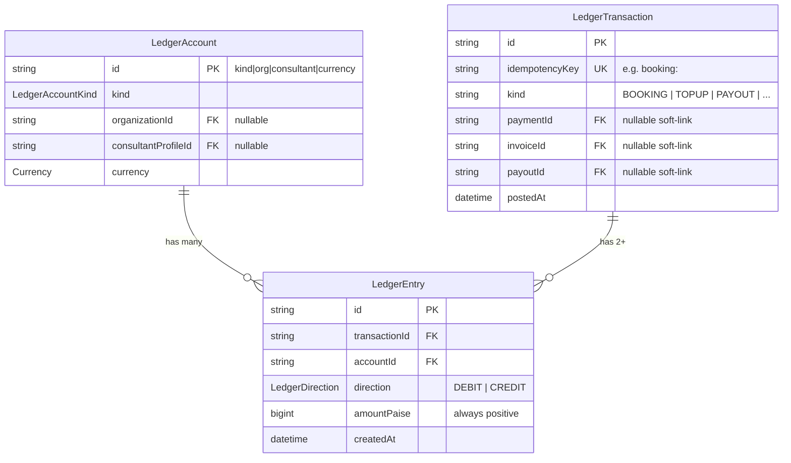
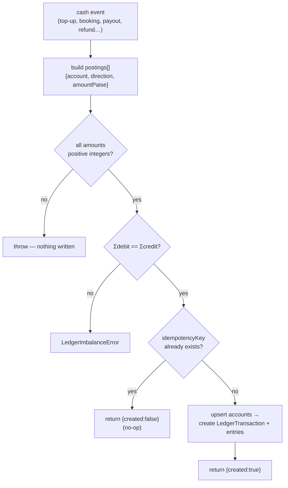

# Ledger & postings

**What this covers:** the double-entry journal in detail — the `postLedgerTxn()` API, the balance invariant, idempotency, immutability, and the **exact legs every money flow posts**, transcribed from code. This is the reference the rest of the money band cites.

> Replaces the old "three-ledger discipline" doc. The three single-entry logs it described (`FundingLedgerEntry` / `WalletEntry` / `SettlementLedgerEntry`) were collapsed into this one journal by **#772** — see [money model overview](06-money-model-overview.md) for the why.

---

## 1. The three tables



- `LedgerAccount` — a bucket; id is its [deterministic scope string](07-chart-of-accounts.md).
- `LedgerTransaction` — one balanced cash event. `idempotencyKey @unique` is the dedupe anchor; `kind` is a **free `String`** (a convention, not a DB enum); `paymentId`/`invoiceId`/`payoutId` are optional indexed soft-links for tracing.
- `LedgerEntry` — one leg. `amountPaise` is a **positive** `BigInt`; the sign lives in `direction`.

---

## 2. `postLedgerTxn()` — the only way money is recorded

```ts
postLedgerTxn(db, {
  idempotencyKey: "booking:pay_123",
  kind: "BOOKING",
  paymentId: "pay_123",
  postings: [ /* { account, direction, amountPaise }, ... */ ],
}): Promise<{ transactionId: string; created: boolean }>
```

What it guarantees (`lib/payments/ledger/post.ts`):

1. **Positive integers only.** Each posting's `amountPaise` must be a positive integer — non-integer or `<= 0` throws.
2. **Balance or bust.** It sums DEBIT and CREDIT legs; if `Σdebit !== Σcredit` it throws `LedgerImbalanceError` and writes nothing.
3. **Idempotent on `idempotencyKey`.** A fast-path `findUnique` returns `{ created: false }` for a repeat key. The `@unique` constraint is the hard guard underneath: if two callers race, the loser's insert hits `P2002`, aborts its transaction, and the retry lands on the fast-path. **Redeliveries and retries are safe.**
4. **Composable in a `$transaction`.** Pass the tx client (`tx`) and the posting joins the caller's atomic unit — so the money leg and the business write (claim a top-up, mark a payout paid) commit together or not at all.
5. **Accounts resolve on demand.** Each posting's `AccountRef` is upserted to its deterministic id, so callers never pre-create accounts.

`ledgerBalancePaise(db, ref)` is the read side: it groups the account's entries by direction and returns `Number(Σdebit − Σcredit)` — the **signed** balance. Interpret the sign per the account's normal side ([chart of accounts](07-chart-of-accounts.md)).



---

## 3. The posting vocabulary (`kind`)

`kind` is a string convention, paired with a structured `idempotencyKey`:

| `kind` | `idempotencyKey` | Posted by |
| --- | --- | --- |
| `TOPUP` | `topup:<providerOrderId>` | `walletCredit()` — `lib/api/organizations/wallet.ts` |
| `BOOKING` | `booking:<paymentId>` | `createEarningsFromPayment()` — `lib/payments/payouts/earnings-service.ts` |
| `INVOICE_PAID` | `invoicepaid:<invoiceId>` | invoice-paid webhook — `app/api/webhooks/utils.ts` |
| `TOPUP_REFUND` | `topup-refund:<providerPaymentId>` | refund webhook — `app/api/webhooks/utils.ts` |
| `REFUND` | `refund:<refundId>` | `reverseBookingLedger()` — `lib/payments/operations/refund.ts` |
| `PAYOUT` | `payout:<payoutId>` | consultant payout — `lib/payments/payouts/payout-service.ts` |
| `ORG_PAYOUT` | `orgpayout:<payoutId>` | host-org payout — `lib/payments/payouts/org-payout-service.ts` |

`INVOICE_ISSUED`, `OVERAGE`, and `GRANT` are reserved in the vocabulary; note that **invoice *issuance* posts no money leg** — the receivable was already accrued in the booking transaction (`ORG_RECEIVABLE` debit from the `INVOICE_ACCRUAL` leg), so issuance just rolls accrued bookings into an `OrganizationInvoice` and writes an `OrgAuditLog` row. Payment is what clears the receivable.

---

## 4. The postings, flow by flow

All amounts are paise; every block balances (`Σdebit == Σcredit`).

### 4.1 Top-up — `TOPUP` (`topup:<orderId>`)
Org pays cash; we now owe it wallet spending power.
```
Dr CASH(platform)        amount
   Cr WALLET(org)        amount
```

### 4.2 Booking — `BOOKING` (`booking:<paymentId>`)
The funding legs of the checkout become debits; the fee/payable/tax split becomes credits. The debit side is assembled from the payment's `PaymentLeg` rows ([payment legs](13-payment-legs.md)):

```
Dr CASH(platform)            sum of CARD legs
Dr WALLET(org)               sum of WALLET legs
Dr ORG_RECEIVABLE(org)       sum of INVOICE_ACCRUAL + OVERAGE_INVOICE_ACCRUAL legs
Dr PLATFORM_PROMO            sum of REFERRAL_CREDIT legs
Dr DISCOUNT                  max(0, originalAmount + taxAmount − amount)
   Cr PLATFORM_FEE           platform fee
   Cr CONSULTANT_PAYABLE(consultant)   total consultant pool
   Cr ORG_PAYABLE(org)       org share (only if > 0)
   Cr GST_PAYABLE            tax amount
```
`LICENSE` legs carry `amountPaise = 0` (no money moves — the seat is pre-paid), so they contribute nothing. **Only single-consultant bookings post this transaction inline**; multi-collaborator bookings defer the journal (tracked coverage gap **#773**) — see [booking → earnings](10-booking-to-earnings.md).

### 4.3 Invoice paid — `INVOICE_PAID` (`invoicepaid:<invoiceId>`)
The org settles its NET-NN invoice; the receivable accrued at booking clears.
```
Dr CASH(platform)            invoice total
   Cr ORG_RECEIVABLE(org)    invoice total
```

### 4.4 Consultant payout — `PAYOUT` (`payout:<payoutId>`)
We pay what we owed the consultant; TDS is withheld for the government.
```
Dr CONSULTANT_PAYABLE(consultant)   net + TDS
   Cr CASH(platform)                net paid
   Cr TDS_PAYABLE                   TDS withheld (only if > 0)
```

### 4.5 Host-org payout — `ORG_PAYOUT` (`orgpayout:<payoutId>`)
The host-org mirror of 4.4.
```
Dr ORG_PAYABLE(org)          net + TDS
   Cr CASH(platform)         net paid
   Cr TDS_PAYABLE            TDS withheld (only if > 0)
```

### 4.6 Top-up refund — `TOPUP_REFUND` (`topup-refund:<providerPaymentId>`)
A confirmed top-up is refunded; the IOU shrinks, cash returns to the gateway. Exact reverse of 4.1.
```
Dr WALLET(org)               refund amount (clamped to original top-up)
   Cr CASH(platform)         refund amount
```

### 4.7 Booking refund — `REFUND` (`refund:<refundId>`)
A booking is refunded (fully or partially). The original booking legs are reversed **proportionally**: the fee/payable/GST credits become debits, and the funding legs become credits. `PLATFORM_FEE` carries the balancing *plug* so the set ties out.
```
Dr PLATFORM_FEE              platform plug (funding − consultant − org − GST share)
Dr CONSULTANT_PAYABLE(owner) refunded consultant share
Dr ORG_PAYABLE(org)          refunded org share
Dr GST_PAYABLE               refunded GST share
   Cr CASH / WALLET / ORG_RECEIVABLE / PLATFORM_PROMO   the original funding legs, prorated
```
Posted only when the debit side balances to the refunded funding total (a guard in `refund.ts`); a partial/edge case that wouldn't balance is skipped and logged rather than written half-formed.

---

## 5. Invariants

1. **Balanced.** Enforced at write (`postLedgerTxn`) and re-proved nightly (`LEDGER_TXN_IMBALANCE`).
2. **Immutable.** `LedgerEntry.transactionId` is `onDelete: Restrict` — postings are never deleted or updated. A wrong posting is corrected by a **counter-transaction**, not an edit (that's what `REFUND`/`TOPUP_REFUND` are).
3. **Positive amounts only.** Sign is `direction`, never a negative `amountPaise`.
4. **One event, one key.** Every flow's `idempotencyKey` is derived from a stable upstream id, so at-least-once webhooks and cron retries collapse to one posting. See [concurrency & idempotency](20-concurrency-and-idempotency.md).

## 6. What NOT to do

- **Don't read a balance from a column.** Sum the journal via `ledgerBalancePaise()` (the one cache, `walletBalance`, is the documented exception in [money model overview](06-money-model-overview.md) §4).
- **Don't post an unbalanced set** "to fix later" — there is no later; it throws.
- **Don't delete or update a `LedgerEntry`.** Post a counter-transaction.
- **Don't invent a `kind`** without adding it to the vocabulary table above and giving it a structured `idempotencyKey`.

---

## Balance reads — maintained snapshot (#776)

`ledgerBalancePaise()` reads an O(1) maintained running balance
(`LedgerAccountBalance`, keyed 1:1 by the deterministic account id) rather than
scanning every entry. `postLedgerTxn` folds each posting's signed delta
(`+DEBIT` / `−CREDIT`) into the snapshot **inside the same transaction** as the
journal write; the idempotency fast-path returns before any mutation, so a
retried key never double-applies. The append-only `LedgerEntry` journal stays
the source of truth — the snapshot is a derived cache the reconcile cron
validates (`LEDGER_BALANCE_SNAPSHOT_DRIFT`, [14-ledger-integrity](14-ledger-integrity.md)).
`ledgerBalanceFromJournalPaise()` is the authoritative fallback (and the
reconcile check's ground truth). No backfill — a fresh seed posts through
`postLedgerTxn`, so snapshots populate as money moves.

### Related docs
- [Money model overview](06-money-model-overview.md) · [Chart of accounts](07-chart-of-accounts.md) — the principles and buckets this doc applies.
- [Wallet & top-ups](09-wallet-and-topups.md) · [Booking → earnings](10-booking-to-earnings.md) · [Payout pipeline](11-payout-pipeline.md) · [Invoicing](12-invoicing.md) — each flow in narrative.
- [Payment legs](13-payment-legs.md) — how the booking debit side is assembled.
- [Ledger integrity](14-ledger-integrity.md) — the reconciler.
- Ground truth: `lib/payments/ledger/post.ts`; posting call sites in `earnings-service.ts`, `wallet.ts`, `org-payout-service.ts`, `payout-service.ts`, `refund.ts`, `app/api/webhooks/utils.ts`.
