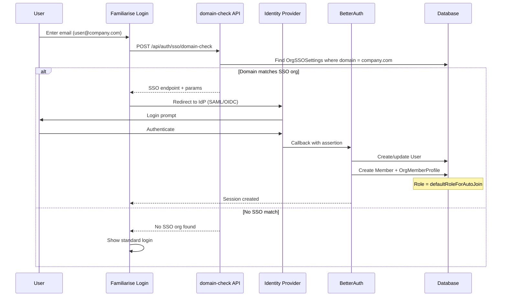

# SSO and Authentication

**Status**: Implemented (Apr 2026) -- NOT yet tested against real IdPs
**Branch**: `feature/enterprise`
**Scope**: Per-org SAML and OIDC configuration
**Dependency**: BetterAuth SSO plugin (`@better-auth/sso`)

## Overview

Enterprise customers need their employees to sign in via their corporate identity provider (Okta, Azure AD, Google Workspace, etc.) rather than creating separate Familiarise credentials. The SSO system supports both SAML and OIDC protocols, with per-org configuration of allowed email domains, enforcement policies, and default roles for auto-joined users. The actual SAML/OIDC handshake is handled by BetterAuth's SSO plugin; Familiarise adds the policy layer on top.

---

## Architecture

### Two Layers

```
┌─────────────────────────────────────────────────────────┐
│ Familiarise Policy Layer                                │
│                                                          │
│ OrganizationSSOSettings                                  │
│ ├── allowedEmailDomains: String[]                       │
│ ├── enforceSSO: Boolean                                  │
│ └── defaultRoleForAutoJoin: OrgMemberRole               │
│                                                          │
│ (Stored in Prisma, managed via /api/organizations/       │
│  [orgId]/sso endpoints)                                  │
└─────────────────────────────────────────────────────────┘
                         │
                         │ queries
                         ▼
┌─────────────────────────────────────────────────────────┐
│ BetterAuth SSO Plugin                                   │
│                                                          │
│ ssoProvider table (auto-generated by BetterAuth)         │
│ ├── providerId, issuer, domain                          │
│ ├── organizationId (links to Organization)              │
│ ├── samlConfig (JSON string)                             │
│ └── oidcConfig (JSON string)                             │
│                                                          │
│ (Handles actual SAML assertions / OIDC token exchange)   │
└─────────────────────────────────────────────────────────┘
```

### OrganizationSSOSettings (Policy)

| Field | Type | Default | Purpose |
| ----- | ---- | ------- | ------- |
| `allowedEmailDomains` | String[] | `[]` | Email domains this org claims (e.g. `["acme.com", "acme.edu"]`) |
| `enforceSSO` | Boolean | `false` | If true, domain-matched users MUST use SSO -- personal OAuth (Google/GitHub) is rejected |
| `defaultRoleForAutoJoin` | OrgMemberRole | `ORG_LEARNER` | Role assigned when a new user auto-joins via SSO |

**File**: `prisma/schema.prisma` (lines 636-658)

### ssoProvider (BetterAuth)

The BetterAuth plugin auto-generates the `ssoProvider` table. Each row represents one IdP configuration linked to an org via `organizationId`. Familiarise writes to this table via direct Prisma calls (the plugin does not expose typed CRUD helpers).

---

## Domain-Based Signin Routing

```
User enters email at login
        │
        ▼
POST /api/auth/sso/domain-check
        │
        ▼
Extract domain from email (e.g. "alice@acme.com" → "acme.com")
        │
        ▼
Query OrganizationSSOSettings WHERE allowedEmailDomains contains domain
        │
        ├── Match found ──► Return SSO provider endpoint + params
        │                         │
        │                         ▼
        │                   Redirect to IdP (Okta, Azure AD, etc.)
        │                         │
        │                         ▼
        │                   IdP authenticates user
        │                         │
        │                         ▼
        │                   Callback to BetterAuth
        │                         │
        │                         ▼
        │                   Session created
        │
        └── No match ──► Standard login
                         (Google/GitHub OAuth or email/password)
```

The following sequence diagram shows the SSO login flow from email entry through domain-based routing to session creation.



### Cross-Org Domain Conflict

Two organizations cannot claim the same email domain. Domain uniqueness is enforced via the `OrgDomainClaim` model (one row per domain, `domain @unique`). The PATCH handler syncs claims atomically inside a single transaction: deletes stale claims, creates new ones, then upserts SSO settings. A concurrent claim on the same domain hits the `@unique` constraint (Prisma P2002) and is returned as 409.

```
// Inside one $transaction():
deleteMany  stale OrgDomainClaim rows for this org
createMany  new  OrgDomainClaim rows  ← P2002 if domain taken by another org
upsert      OrganizationSSOSettings

Conflict → 409: "Domain(s) already claimed by another organization: acme.com"
```

This replaced an earlier TOCTOU pattern (`findMany` then `upsert`) that allowed two concurrent PATCH requests to both claim the same domain before either committed.

**File**: `app/api/organizations/[orgId]/sso/route.ts` (PATCH handler)
**Schema**: `OrgDomainClaim` model in `prisma/schema.prisma`
**See also**: `docs/enterprise/15-concurrency-and-locking.md` §3 (SSO Domain Claim TOCTOU)

---

## Provider Configuration

### SAML

Required fields in `samlConfig`:

| Field | Description | Example |
| ----- | ----------- | ------- |
| `issuer` | IdP entity ID | `"https://accounts.google.com/o/saml2?idpid=..."` |
| `entryPoint` | IdP SSO URL | `"https://accounts.google.com/o/saml2/idp?idpid=..."` |
| `cert` | X.509 certificate (PEM) | `"MIIDdDCCAlygAwIB..."` |
| `callbackUrl` | (optional) ACS URL | `"https://familiarise.com/api/auth/sso/callback"` |

### OIDC

Required fields in `oidcConfig`:

| Field | Description | Example |
| ----- | ----------- | ------- |
| `issuer` | Token issuer URL | `"https://login.microsoftonline.com/{tenant}/v2.0"` |
| `clientId` | Application/client ID | `"abc123-def456-..."` |
| `clientSecret` | Client secret | `"secret..."` |
| `discoveryEndpoint` | .well-known URL | `"https://login.microsoftonline.com/{tenant}/v2.0/.well-known/openid-configuration"` |
| `pkce` | Use PKCE? (default: true) | `true` |
| `scopes` | (optional) Extra scopes | `["profile", "email"]` |

**File**: `app/api/organizations/[orgId]/sso/providers/route.ts`

---

## API Endpoints

| Endpoint | Method | Auth | Purpose |
| -------- | ------ | ---- | ------- |
| `/api/organizations/[orgId]/sso` | GET | ORG_OWNER | Get SSO settings + list of providers |
| `/api/organizations/[orgId]/sso` | PATCH | ORG_OWNER | Update allowedEmailDomains, enforceSSO, defaultRoleForAutoJoin |
| `/api/organizations/[orgId]/sso/providers` | GET | ORG_OWNER | List registered SSO providers |
| `/api/organizations/[orgId]/sso/providers` | POST | ORG_OWNER | Register a new SAML or OIDC provider |
| `/api/organizations/[orgId]/sso/providers/[providerId]` | DELETE | ORG_OWNER | Remove a provider (hard delete) |

### Creating a Provider (POST)

Body:

```
{
  "providerId": "okta-main",           // alphanumeric slug
  "domain": "acme.com",                // matches allowedEmailDomains
  "issuer": "https://okta.acme.com",   // IdP identifier
  "providerType": "saml" | "oidc",
  "samlConfig": { ... },               // required if providerType = "saml"
  "oidcConfig": { ... }                // required if providerType = "oidc"
}
```

The config objects are `JSON.stringify`'d and stored in BetterAuth's `samlConfig` / `oidcConfig` columns.

---

## Membership Sync

When a user logs in via SSO for the first time, BetterAuth creates a `Member` row linking the user to the org. However, BetterAuth does NOT create the `OrganizationMemberProfile` that Familiarise requires.

**Auto-repair mechanism**: The `customSession` callback in `lib/auth.ts` detects when a user has a BetterAuth `Member` row but no corresponding `OrganizationMemberProfile`, and creates one automatically on first session load:

```
SSO login ──► BetterAuth creates Member row
                    │
                    ▼
              customSession callback
                    │
                    ▼
              Member exists but no OrgMemberProfile?
              ├── Yes → Create OrgMemberProfile
              │         role: defaultRoleForAutoJoin
              │         status: ACTIVE
              │
              └── No → Normal session
```

---

## Verification Status

This system has **NOT** been tested against real identity providers. Before going live with a customer, the following must be verified:

| IdP | Protocol | Status |
| --- | -------- | ------ |
| Okta | SAML | Untested |
| Okta | OIDC | Untested |
| Azure AD | SAML | Untested |
| Azure AD | OIDC | Untested |
| Google Workspace | SAML | Untested |
| Google Workspace | OIDC | Untested |
| OneLogin | SAML | Untested |

Key areas to verify:
- Attribute mapping (name, email extraction from SAML assertion / OIDC claims)
- Certificate rotation handling
- Session management (logout propagation)
- Error states (expired certs, misconfigured discovery URLs)

---

## Key Files

| File | Purpose |
| ---- | ------- |
| `app/api/organizations/[orgId]/sso/route.ts` | GET/PATCH SSO settings (domain policy) |
| `app/api/organizations/[orgId]/sso/providers/route.ts` | GET/POST SSO providers (SAML/OIDC) |
| `app/api/organizations/[orgId]/sso/providers/[providerId]/route.ts` | DELETE a provider |
| `prisma/schema.prisma` (lines 636-658) | OrganizationSSOSettings model |
| `lib/auth.ts` | BetterAuth config + customSession auto-repair |

---

## Edge Cases

| Scenario | Behavior |
| -------- | -------- |
| User's email matches two SSO orgs | Cannot happen -- `OrgDomainClaim.domain @unique` prevents concurrent claims; PATCH returns 409 |
| `enforceSSO = true` + user tries Google OAuth | Personal OAuth should be blocked for domain-matched users (enforcement at middleware level) |
| Domain claimed by another org | PATCH returns 409 listing conflicting domains |
| Deleting last SSO provider | Provider deleted; existing sessions remain valid; new SSO logins fail |
| SSO user not yet in org | BetterAuth creates Member; customSession auto-creates OrgMemberProfile with defaultRoleForAutoJoin |
| Provider config has expired cert | BetterAuth SAML validation will fail at assertion time -- user sees auth error |
| `allowedEmailDomains = []` + provider exists | Provider is registered but no domain routing occurs -- SSO unreachable via domain flow |
