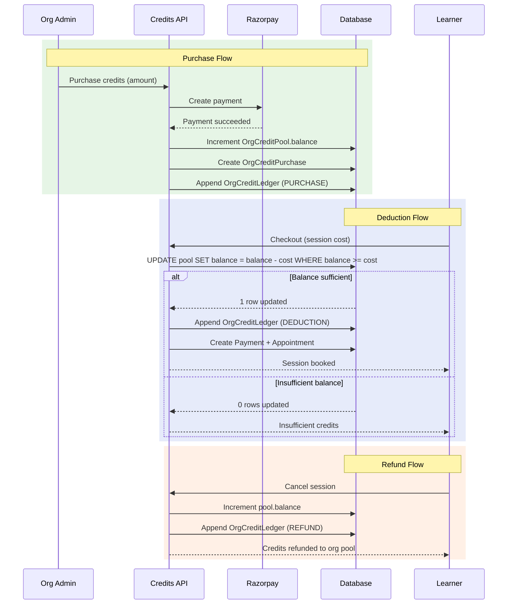

# Credit System

**Status**: Implemented (Apr 2026)
**Branch**: `feature/enterprise`
**Scope**: SEAT_PACK billing mode only

## Overview

Organizations using the SEAT_PACK billing mode pre-purchase credits (denominated in paise) into a credit pool. When their learners book sessions, credits are deducted atomically from the pool instead of requiring a per-session payment. Every credit mutation -- purchase, deduction, or refund -- writes an immutable ledger entry for audit. The system uses conditional SQL updates to prevent overdraft under concurrent load.

---

## Data Model

```
┌──────────────────────┐
│ OrganizationProfile  │
│ billingMode:         │
│   SEAT_PACK          │
└─────────┬────────────┘
          │ 1:1
          ▼
┌──────────────────────┐       ┌──────────────────────┐
│ OrgCreditPool        │       │ OrgCreditPurchase    │
│                      │       │                      │
│ balance: Int (paise) │       │ creditsPurchased     │
│ totalPurchased: Int  │       │ amountPaid           │
│ currency: "INR"      │       │ paymentId → Payment  │
│                      │       │ status (enum)        │
│                      │       │ providerOrderId      │
│                      │       │ processedAt          │
│                      │       │ cancelledAt          │
└──────────────────────┘       └──────────────────────┘
          │ 1:many
          ▼
┌──────────────────────┐
│ OrgCreditLedger      │
│                      │
│ delta: Int (signed)  │
│ reason: String       │
│ paymentId: String?   │
│ memberProfileId:     │
│   String?            │
│ balanceAfter: Int    │
│ createdAt            │
└──────────────────────┘
```

### OrgCreditPool

One pool per SEAT_PACK organization. Created automatically at org creation time (with zero balance) so the dashboard can render without a null check.

| Field | Type | Description |
| ----- | ---- | ----------- |
| `balance` | Int | Current available credits in paise |
| `totalPurchased` | Int | Lifetime total credits purchased in paise |
| `currency` | String | Always "INR" |

### OrgCreditPurchase

Records each credit purchase event. Links to the Razorpay `Payment` record that funded it.

| Field | Type | Description |
| ----- | ---- | ----------- |
| `creditsPurchased` | Int | Amount added to the pool (paise) |
| `amountPaid` | Int | Gateway charge (paise) -- typically equals `creditsPurchased` |
| `paymentId` | String? (unique) | FK to Payment (Razorpay transaction) |
| `status` | `OrgCreditPurchaseStatus` | Purchase lifecycle state (default `PENDING`) |
| `providerOrderId` | String? **@unique** | Razorpay order ID stored immediately after order creation |
| `providerPaymentId` | String? | Razorpay payment ID recorded on webhook confirmation |
| `processedAt` | DateTime? | Timestamp set when status transitions to `PROCESSED` |
| `cancelledAt` | DateTime? | Timestamp set when status transitions to `CANCELLED` |

**`OrgCreditPurchaseStatus` enum**: `PENDING | PROCESSED | CANCELLED`

- A new purchase is created with `status: PENDING` and `providerOrderId` set after the Razorpay order is created.
- The webhook handler guards on `status === "PENDING"` before applying pool credits; on success it sets `status: PROCESSED` and `processedAt`.
- The cleanup cron job queries all `status: "PENDING"` purchases past their expiry window and sets `status: CANCELLED` with `cancelledAt`.

**Webhook idempotency**: `providerOrderId` carries a `@unique` constraint (added in commit 19da4448). A retried Razorpay webhook attempting to create a second `OrgCreditPurchase` with the same order ID hits Prisma P2002 → the handler returns 200 without double-crediting the pool. See `docs/enterprise/15-concurrency-and-locking.md` §7.

### OrgCreditLedger

Immutable, append-only log of every credit state change. One row per mutation.

| Field | Type | Description |
| ----- | ---- | ----------- |
| `delta` | Int (signed) | Positive for purchase/refund, negative for deduction |
| `reason` | String | `"purchase"`, `"booking"`, `"refund"`, or `"adjustment"` |
| `paymentId` | String? | FK to the booking Payment (for booking/refund rows) |
| `memberProfileId` | String? | Which ORG_LEARNER consumed credits (for booking rows) |
| `balanceAfter` | Int | Running balance after this entry |
| `createdAt` | DateTime | Immutable timestamp |

**File**: `prisma/schema.prisma` (lines 857-906)

---

## Operations

### Purchase Credits

```
Org admin → Dashboard → Credits page → "Purchase"
        │
        ▼
Razorpay payment flow
        │
        ▼ (webhook confirms payment)
purchaseCredits(tx, orgProfileId, creditsPaise, paymentId)
        │
        ▼
OrgCreditPool.balance   += creditsPaise  (atomic increment)
OrgCreditPool.totalPurchased += creditsPaise
        │
        ▼
OrgCreditLedger entry: delta=+creditsPaise, reason="purchase"
```

**Function**: `purchaseCredits(tx, organizationProfileId, creditsPaise, paymentId?)`
**Atomicity**: Uses Prisma's `{ increment: creditsPaise }` operator -- no read-then-write race.

### Deduct Credits

```
Learner checkout → session booked against org
        │
        ▼
deductCredits(tx, orgProfileId, amountPaise, paymentId, memberProfileId)
        │
        ▼
Raw SQL: UPDATE "OrgCreditPool"
         SET balance = balance - amountPaise
         WHERE organizationProfileId = ?
           AND balance >= amountPaise
        │
        ├── rows affected = 1 → success
        │
        └── rows affected = 0 → throw "Insufficient credits: need X paise"
        │
        ▼
Read back pool.balance
        │
        ▼
OrgCreditLedger entry: delta=-amountPaise, reason="booking"
```

**Function**: `deductCredits(tx, organizationProfileId, amountPaise, paymentId?, memberProfileId?)`
**Atomicity**: Uses conditional raw SQL `UPDATE ... WHERE balance >= amount`. This is the key concurrency guard -- if two learners book simultaneously, one will see `rows = 0` and get an "Insufficient credits" error.

### Refund Credits

```
Session cancelled by consultant or admin
        │
        ▼
creditRefund(tx, orgProfileId, amountPaise, paymentId)
        │
        ▼
OrgCreditPool.balance += amountPaise  (atomic increment)
        │
        ▼
OrgCreditLedger entry: delta=+amountPaise, reason="refund"
```

**Function**: `creditRefund(tx, organizationProfileId, amountPaise, paymentId?)`
**Atomicity**: Uses Prisma `{ increment: amountPaise }` -- always succeeds (refunds cannot overdraw).

**File**: `lib/payments/operations/org-credits.ts`

---

## Worked Example

An organization purchases ₹10,00,000 in credits, books 100 sessions at ₹10,000 each, then gets 1 refund.

| # | Action | Delta (paise) | Balance After (paise) | Balance After (INR) | Reason |
| - | ------ | ------------- | --------------------- | ------------------- | ------ |
| 1 | Purchase ₹10,00,000 | +10,00,00,000 | 10,00,00,000 | ₹10,00,000 | purchase |
| 2 | Booking #1 (₹10,000) | -10,00,000 | 9,90,00,000 | ₹9,90,000 | booking |
| 3 | Booking #2 (₹10,000) | -10,00,000 | 9,80,00,000 | ₹9,80,000 | booking |
| ... | ... | ... | ... | ... | ... |
| 101 | Booking #100 (₹10,000) | -10,00,000 | 0 | ₹0 | booking |
| 102 | Refund #1 (₹10,000) | +10,00,000 | 10,00,000 | ₹10,000 | refund |

After this sequence:
- `OrgCreditPool.balance` = 10,00,000 (₹10,000)
- `OrgCreditPool.totalPurchased` = 10,00,00,000 (₹10,00,000)
- `OrgCreditLedger` has 102 rows (1 purchase + 100 bookings + 1 refund)
- Booking #101 would fail with "Insufficient credits: need 1000000 paise" before the refund, and succeed after

---

The following sequence diagram shows the complete credit lifecycle: purchase, deduction at checkout, and refund on cancellation.



## Concurrency Safety

The deduction path is the only operation with overdraft risk. It uses a conditional raw SQL UPDATE:

```
UPDATE "OrgCreditPool"
SET balance = balance - {amount}, "updatedAt" = NOW()
WHERE "organizationProfileId" = {id}
  AND balance >= {amount}
```

This is a single atomic statement -- PostgreSQL's row-level locking ensures that when two transactions execute concurrently, one sees the pre-decrement balance and succeeds, the other sees the post-decrement balance and fails (returns 0 rows affected).

```
┌──────────────┐     ┌──────────────┐
│ Learner A    │     │ Learner B    │
│ books ₹5,000 │     │ books ₹7,000 │
└──────┬───────┘     └──────┬───────┘
       │                    │
       ▼                    ▼
  UPDATE WHERE         UPDATE WHERE
  balance >= 500000    balance >= 700000
       │                    │
       │ Pool has ₹10,000   │
       │ (10,00,000 paise)  │
       ▼                    ▼
  rows = 1 (success)   rows = 1 (success)
  balance = 5,00,000   balance = -2,00,000?  ← IMPOSSIBLE
                        ↑
                        PostgreSQL row lock
                        means B sees balance
                        AFTER A's decrement
                        = 5,00,000 >= 7,00,000?
                        = false → rows = 0
                        → "Insufficient credits"
```

Purchases and refunds use Prisma's `{ increment: N }` and cannot overdraft, so they need no conditional guard.

---

## Key Files

| File | Purpose |
| ---- | ------- |
| `lib/payments/operations/org-credits.ts` | Core: `deductCredits()`, `creditRefund()`, `purchaseCredits()` |
| `prisma/schema.prisma` (lines 857-871) | OrgCreditPool model |
| `prisma/schema.prisma` (lines 873-888) | OrgCreditPurchase model |
| `prisma/schema.prisma` (lines 890-906) | OrgCreditLedger model |
| `prisma/schema.prisma` (lines 555-560) | OrganizationBillingMode enum (SEAT_PACK) |
| `app/api/organizations/route.ts` (line 252) | Creates OrgCreditPool on SEAT_PACK org creation |
| `lib/payments/operations/checkout.ts` | Checkout flow that calls `deductCredits()` for SEAT_PACK orgs |

---

## Edge Cases

| Scenario | Behavior |
| -------- | -------- |
| Two learners book simultaneously, pool has enough for only one | First UPDATE acquires row lock, succeeds; second sees decremented balance, fails with "Insufficient credits" |
| Deduction of 0 or negative amount | Throws "Deduction amount must be positive" (validation guard) |
| Pool at exactly ₹0, learner tries to book | `balance >= amount` fails → "Insufficient credits" |
| Refund to a depleted pool (balance = 0) | Always succeeds -- `increment` adds credits back, balance goes positive |
| Orphaned purchase (payment webhook received but pool update fails) | OrgCreditPurchase row exists without corresponding pool increment; cleanup cron needed |
| Pool does not exist (non-SEAT_PACK org) | `deductCredits` throws Prisma error (no matching row for UPDATE); caller must check billingMode before calling |
| Duplicate webhook delivery for the same payment | Webhook guards on `status === "PENDING"`; a second delivery finds `status: PROCESSED` and is a no-op |
| Stale PENDING purchase (user abandoned checkout) | Cleanup cron sets `status: CANCELLED` + `cancelledAt`; pool balance is unaffected |
