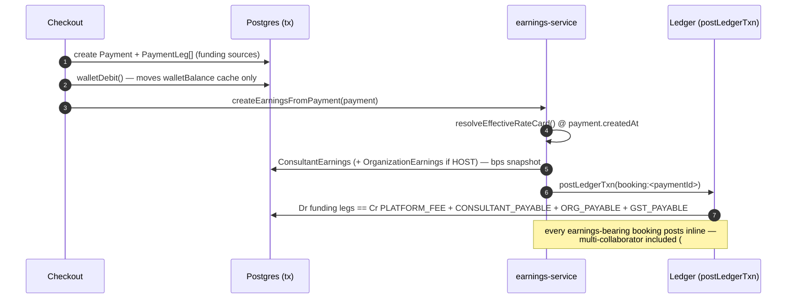

# Booking → earnings

**What this covers:** how a sponsored booking turns into money — the three-way split (`RateCard`, basis points, snapshots), the `BOOKING` ledger posting it produces, and the `ConsultantEarnings` / `OrganizationEarnings` rows that cache the result for payout. The funding side (which sources paid) is in [payment legs](09-payment-legs.md); the journal mechanics are in [ledger & postings](03-ledger-and-postings.md).

> Every host-side booking produces a `ConsultantEarnings` row and (if the expert settles to a HOST org) an `OrganizationEarnings` row. The split is resolved from a `RateCard` **at booking time**, snapshotted, and posted as one balanced `BOOKING` transaction. A retroactive rate change must never rewrite history.

---

## 1. The flow



The `walletDebit` in step 2 moves only the **cache** ([wallet & top-ups](04-wallet-and-topups.md)); the authoritative `Dr WALLET` leg is posted later, inside the booking transaction, where the full split is known.

---

## 2. `RateCard` — the split

```prisma
model RateCard {
  id              String  @id @default(uuid())
  ownerOrgId      String?       // org-scoped card …
  ownerContractId String?       // … or contract-scoped (never both)
  planType        CoveredPlanType?  // null = any
  planId          String?           // null = any
  minGrossPaise   Int?
  maxGrossPaise   Int?
  // Basis points — sum must equal 10000. Integer math; no float drift.
  platformBps     Int
  orgBps          Int
  consultantBps   Int
  effectiveFrom   DateTime  @default(now())
  effectiveTo     DateTime?
}
```

Two scoping columns let a card live at the **org** level (default across contracts) or the **contract** level (a negotiated per-customer split). Exactly one owner is set.

**Time-scoped, never updated.** A rate change closes the old card (`effectiveTo = now()`) and inserts a new one (`effectiveFrom = now()`) in one transaction (`bumpRateCard()`, `lib/api/organizations/rate-card.ts`). Yesterday's booking still resolves the card where `effectiveFrom <= booking.createdAt < effectiveTo`.

**One open window per scope, guarded twice (#1405).** The bump is a read-then-write: it looks for the currently effective card, closes it, and inserts the replacement. Under the default isolation level two administrators bumping the same scope at the same moment could each read "nothing is open here" and each insert a row with `effectiveTo = NULL`, after which `resolveEffectiveRateCard()` had two equally valid candidates and picked between them non-deterministically — two bookings a second apart could settle on different splits. `POST /api/organizations/{orgId}/rate-cards` now runs that transaction at the `Serializable` isolation level and wraps it in `withSerializableRetry()`, so the losing writer aborts and re-runs against the winner's state instead of surfacing a serialization error to the caller. Behind that, the partial unique index `rate_card_one_open_window` in `prisma/sql/check-constraints.sql` makes the invariant structural: it is declared `NULLS NOT DISTINCT` over the four scope columns, because three of them are nullable and Postgres would otherwise treat every NULL as distinct and exempt exactly the rows that need covering (an expression index over `COALESCE` was rejected: the enum-to-text cast is not immutable). A write that still collides comes back as HTTP 409 with the code `RATE_CARD_OPEN_WINDOW_CONFLICT`, which asks the caller to re-read the current card and retry rather than reporting a server fault.

**Resolution order** (`resolveEffectiveRateCard()`, most-specific → least):

1. `Membership.rateCardOverride` (per-expert).
2. Contract-scoped + `planId`.
3. Org-scoped + `planId`.
4. Contract-scoped + `CoveredPlanType`.
5. Org-scoped + `CoveredPlanType`.
6. Contract-scoped default.
7. Org-scoped default.
8. Hardcoded `DEFAULT_RATE_CARD` = **10% / 10% / 80%** (platform / org / expert); `rateCardId = null` is the sentinel for "defaults used".

**Which tiers a booking can reach depends on one flag.** `resolveOrgSplit()` (`lib/payments/payouts/earnings-service.ts`) is the resolver's only production caller, and until #1335 it passed just `orgId`, `membershipOverrideId` and `at`. A settling booking could therefore land only on tiers 1, 7 and 8 — the per-expert override, the org-scoped default, or the hardcoded fallback — even though it had already resolved the plan that selects tiers 2 through 5. The rate-card POST handler will happily create a contract-scoped or `planId`-scoped card, so such a card could exist and never be chosen.

`RATE_CARD_SCOPED_RESOLUTION` closes that gap, and it is **off unless the value is exactly `on`**. The default is off because the flip changes which card settles live money: any scoped card an org created while the tiers were unreachable would begin paying a different split the moment it becomes selectable, so an org must be able to audit its cards first and flip second. The gate is `isScopedRateCardResolutionEnabled()` in `lib/api/organizations/rate-card.ts`; off, `resolveOrgSplit()` makes the pre-#1335 call verbatim.

With the flag on, settlement forwards three more fields, all derived inside the same transaction that writes the earnings rows:

| Field        | Where it comes from                                                                                                                                       | When it is null                                                                                                                                                                                                                     |
| ------------ | --------------------------------------------------------------------------------------------------------------------------------------------------------- | ----------------------------------------------------------------------------------------------------------------------------------------------------------------------------------------------------------------------------------- |
| `planType`   | The settlement's own `AppointmentType`, mapped through the exhaustive `RATE_CARD_PLAN_TYPE` record so an enum rename fails the build.                     | Never, on the primary leg.                                                                                                                                                                                                          |
| `planId`     | The plan already resolved for the org-ownership lookup.                                                                                                   | Consultation and subscription bookings, whose plan ids are not carried in the settlement payload. Those still resolve at `planType` granularity (tiers 4 and 5).                                                                    |
| `contractId` | `BookingUtilization` (unique on `paymentId`) → `ProgramAssignment` → `Program` → `Contract`, which is the only link a settling payment has to a contract. | Marketplace and self-funded bookings, which have no contract; subscription bookings, which meter utilization at slot-allocation time and so have none yet at settlement; and any contract that does not belong to the settling org. |

That last exclusion is a tenancy guard rather than a nicety. A contract-scoped card is created under `POST /organizations/{orgId}/rate-cards`, which checks the contract against that org, so `ownerContractId` alone identifies the owner — and `resolveEffectiveRateCard()` matches `ownerContractId` without re-asserting the org. Since `Contract.organizationId` is the **sponsoring** (buyer) org (`Payment.organizationId`) while `resolveOrgSplit()` resolves the expert's **host** (supply) org (`Payment.hostOrganizationId`), forwarding a buyer contract unguarded would let one tenant's booking settle on another tenant's negotiated split. Contract scope is therefore reachable when `Payment.organizationId === Payment.hostOrganizationId` (the same-org HYBRID case); on a **Cross-Org Booking (`Buyer Org != Host Org`)**, `resolveOrgSplit()` resolves the Host Org's org-scoped `RateCard` tiers (`planId` → `planType` → org default → `DEFAULT_RATE_CARD`).

### 2.0 Cross-Org Bookings (`Buyer Org != Host Org`)

A single booking can involve two distinct organizations simultaneously:

- **Buyer / Sponsor Org (`Payment.organizationId`, `@relation("PaymentOrgTag")`)**: The organization whose member booked the session and whose `BillingAccount` (`Payment.billingAccountId`) or `ProgramAssignment` funds it (`WALLET`, `INVOICE_ACCRUAL`, `LICENSE`, or `PERSONAL`).
- **Supply / Host Org (`Payment.hostOrganizationId`, `@relation("PaymentHostOrg")`)**: The `canHost = true` organization whose `EXPERT` member delivered the consultation, subscription, webinar, or class.

When `Payment.organizationId !== Payment.hostOrganizationId`:

1. **Funding Debit (Buyer Org A)**: The `BOOKING` ledger transaction debits Buyer Org A's funding rail (`Dr WALLET(orgA)` or `Dr ORG_RECEIVABLE(orgA)`, or `Dr CASH` on a `CARD` co-pay leg).
2. **Earnings & Payable Credit (Host Org B)**: `resolveOrgSplit()` resolves Host Org B's effective `RateCard` (`ownerOrgId = orgB.id`), creates `OrganizationEarnings` (`organizationId = orgB.id`) and `ConsultantEarnings`, and posts `Cr ORG_PAYABLE(orgB)` + `Cr CONSULTANT_PAYABLE(expert)` + `Cr PLATFORM_FEE` + `Cr GST_PAYABLE` in the same balanced `booking:<paymentId>` transaction.

The collaborator leg passes each collaborator's own host org (`collaboratorHostOrgId`) into `resolveOrgSplit()` without forwarding the buyer's contract scope, so a seller's contract never selects a rate card owned by a collaborator's separate host organization.

**The bps invariant:** `platformBps + orgBps + consultantBps === 10000` on every row — enforced at the creation site (`bumpRateCard()` + the rate-card POST handler) and by the SQL check constraint in `prisma/sql/check-constraints.sql`.

> **Everything is bps now.** #772 unified splits on integer basis points (`10000 = 100%`). The old `Float` `sharePercentage` / `revenueSharePercentage` columns are gone — `ConsultantEarnings.shareBps` and the collaborator `revenueShareBps` columns replace them. Float money math is banned.

### 2.1 Two worked splits — marketplace vs HOST org

The split a booking gets depends on whether the expert settles to a HOST org. `resolveOrgSplit()` (`lib/payments/payouts/earnings-service.ts`) looks for an `ACTIVE` `EXPERT` membership on a `canHost` org; if there isn't one, the booking takes the **marketplace path**, and if there is, it takes the **RateCard three-way path**. Same ₹8,000 booking (`grossAmount = 800_000` paise; GST is computed separately on the fee region), two outcomes:

**Marketplace — Arjun Anderson (seeded freelance solo, no HOST-org panel).** No org split resolves, so `createEarningsFromPayment()` takes a flat `PAYOUT_CONSTANTS.PLATFORM_FEE_PERCENTAGE` (**20%**) and the consultant gets the rest — there is no org leg at all:

```
grossAmount          = 800_000 paise
platformFeePaise     = round(800_000 × 20 / 100) = 160_000   (platform's 20%)
totalConsultantPool  = 800_000 − 160_000         = 640_000   (Arjun's ConsultantEarnings)
```

Arjun nets **₹6,400**; the platform recognizes **₹1,600**. His `ConsultantEarnings.consultantSharePaise` carries the full ₹6,400 — no `OrganizationEarnings` row exists because no org is in the loop.

**HOST org — a LearnPro panel expert (seeded RateCard 10 / 10 / 80).** Now `resolveOrgSplit()` finds the LearnPro EXPERT membership (`Payment.hostOrganizationId = learnpro.id`) and computes the split inline against the resolved rate card. Each independent share is **floored**, and the **org leg absorbs the rounding remainder**:

```
grossAmount          = 800_000 paise
platformFeePaise     = floor(800_000 × 1000 / 10000) = floor(80_000.0)  =  80_000  (10%)
consultantSharePaise = floor(800_000 × 8000 / 10000) = floor(640_000.0) = 640_000  (80%)
orgShare             = 800_000 − 80_000 − 640_000                       =  80_000  (the 10% org leg, by subtraction)
```

So the same ₹8,000 splits ₹800 platform / ₹6,400 to the panel expert / ₹800 retained by LearnPro — a three-way posting (`Cr PLATFORM_FEE` + `Cr CONSULTANT_PAYABLE` + `Cr ORG_PAYABLE`), see [chart of accounts §4](02-chart-of-accounts.md). The floors matter on odd amounts: a ₹8,001 booking (`800_100`) gives `platformFee = 80_010`, `consultantShare = 640_080`, `orgShare = 800_100 − 80_010 − 640_080 = 80_010` — the remainder lands in the org leg, never lost. Two independent `floor`s can each shave a paise; subtracting-the-rest into `orgShare` is what keeps `platformFee + consultantShare + orgShare == gross` exactly.

> Note the marketplace path uses the `PLATFORM_FEE_PERCENTAGE` constant (20%), **not** the `DEFAULT_RATE_CARD` (10/10/80). The default card is the fallback _inside_ `resolveOrgSplit()` — it only applies on the HOST-org path when no more-specific card resolves. A true solo marketplace booking never reaches `resolveOrgSplit()`, so the two figures (20% vs 10%) are _not_ a contradiction: they're two different code paths gated on whether a `canHost` EXPERT membership exists.

---

## 3. The `BOOKING` posting

The split becomes one balanced transaction (`booking:<paymentId>`, kind `BOOKING`). The funding legs ([payment legs](09-payment-legs.md)) are the debits; the split is the credits:

```
Dr CASH / WALLET(buyerOrg) / ORG_RECEIVABLE(buyerOrg) / PLATFORM_PROMO   (the funding legs)
Dr DISCOUNT            max(0, originalAmount + taxAmount − Σ(funding-leg debits))
   Cr PLATFORM_FEE                    platform fee (+ any overage surchargePaise)
   Cr CONSULTANT_PAYABLE(consultant)  consultant share (one leg per earning consultant)
   Cr ORG_PAYABLE(hostOrg)            host org share (one leg per earning host org, if > 0)
   Cr GST_PAYABLE                     tax amount (incl. GST on overage surcharge if applicable)
```

See [ledger & postings §4.2](03-ledger-and-postings.md) for the exact leg-to-account mapping. **Every earnings-bearing booking posts inline — multi-collaborator and cross-org included** (#773, #778). The splits path resolves the primary expert's and each collaborator's HOST-org settlement up front and posts one balanced `booking:<paymentId>` transaction: funding debits by leg source against `Payment.organizationId` (buyer org), then credits of `PLATFORM_FEE` (the primary fee plus the settled collaborators' fee slices), one `CONSULTANT_PAYABLE` per party (a settled collaborator's earnings row stores the share **net** of the host-org cut, so cache equals journal credit exactly), one `ORG_PAYABLE` per distinct host org, and `GST_PAYABLE`. A posting failure rolls the whole earnings creation back, and the reconciler's `EARNINGS_WITHOUT_BOOKING_TXN` finding (threshold 0) enforces that the platform never again runs partially journaled.

---

## 4. Earnings rows are reconciled caches (Multi-Collaborator Same-Org & Cycle-Ordinal Keying)

Both earnings tables carry **bps snapshots** so a later rate bump can't rewrite them, plus cached amount columns the reconciler checks:

```prisma
model OrganizationEarnings {
  id                   String       @id @default(uuid())
  paymentId            String
  organizationId       String       // the HOST org earning the split
  consultantProfileId  String?      // the specific expert whose slice produced this row
  role                 EarningRole  @default(OWNER) // OWNER | COLLABORATOR
  cycleOrdinal         Int?         // recurring subscription billing cycle index
  grossAmountPaise     BigInt
  orgSharePaise        BigInt
  platformFeePaise     BigInt
  consultantSharePaise BigInt
  refundedAmountPaise  BigInt       @default(0)
  rateCardIdApplied    String?
  platformBpsApplied   Int?
  orgBpsApplied        Int?
  consultantBpsApplied Int?
  status               EarningStatus // PENDING → READY → BATCHED → PAID (HELD on dispute or CHARGE_MEMBER overage hold)
  holdUntil            DateTime?     @db.Timestamptz
  preDisputeStatus     EarningStatus?
  @@unique([paymentId, organizationId, consultantProfileId, role, cycleOrdinal])
}
model ConsultantEarnings {
  shareBps             Int           // multi-collaborator split, basis points
  role                 EarningRole   @default(OWNER)
  cycleOrdinal         Int?
  platformFeePaise     BigInt
  consultantSharePaise BigInt
  status               EarningStatus // PENDING → READY → BATCHED → PAID (HELD on dispute or CHARGE_MEMBER overage hold)
  holdUntil            DateTime?     @db.Timestamptz
}
```

Settlement/payout code reads the `*Applied` / `*AtBooking` snapshots and the cached amounts — **never** the live `RateCard`. The reconciler asserts the cached amounts equal the booking journal's `PLATFORM_FEE + CONSULTANT_PAYABLE + ORG_PAYABLE` credits (`EARNINGS_LEDGER_DRIFT`, [ledger integrity](13-ledger-integrity.md)).

**Why the 5-column unique key `@@unique([paymentId, organizationId, consultantProfileId, role, cycleOrdinal])` matters:**

- **Multi-collaborator same-org group sessions**: On a webinar or class where the primary instructor (`role = OWNER`) and one or more co-instructors (`role = COLLABORATOR`) belong to the **same** Host Org (`organizationId`), each expert can carry their own `Membership.rateCardOverride` and revenue share (`shareBps`). Keying by `(paymentId, organizationId, consultantProfileId, role, cycleOrdinal)` allows multiple `OrganizationEarnings` rows for the same `(paymentId, organizationId)` — one per `(consultantProfileId, role)` — without unique-constraint collisions, preserving per-expert rate-card snapshots and per-slice refund attribution.
- **Recurring subscription cycles**: When a subscription releases earnings per cycle (`cycleOrdinal = 1, 2, ...`), each cycle mints its own `OrganizationEarnings` row under the same `paymentId`.

---

## 5. `PayoutRecipient` — who gets the expert leg

`Membership.payoutRecipient` decides where the consultant share lands:

- `SELF` (default, marketplace) — booked to `ConsultantEarnings` for the expert's own payout.
- `ORGANIZATION` — internal/salaried expert; the expert-share leg is booked to the org, collapsing the three-way split into platform + org for that booking.

See [expert lifecycle](../30-programs-and-lifecycle/03-expert-lifecycle.md) for how an org flips an expert to `ORGANIZATION` on approval.

---

## 6. Program overage & Co-Pay Split `PaymentLeg`s — when a booking breaches the cap

A sponsored booking can exceed the covering `ProgramAssignment`'s cap (a `LICENSED_SEAT`'s `coveredEngagementsPerCycle` or a `CREDIT_POOL`'s `creditBudgetPerCycle`). What happens is governed by the program's `OverageBehavior` (`BLOCK` / `CHARGE_MEMBER` / `CHARGE_ORG`) and computed by one pure mapper, `computeOverageForBooking` (`lib/payments/billing/overage.ts`), shared by both the pre-checkout preview and the at-checkout recorder so the two can never drift. All `(FundingSource × ProgramType × OverageBehavior × overageSurchargeBps)` permutations are unlocked in the engine (guided in the UI via `<MotivationBanner />` and `<AdvancedPermutationGate />`).

### 6.1 The marginal: base + surcharge

The marginal is the **over-cap portion of the real booking price** (consulting rates are heterogeneous, so it's a pass-through, optionally capped per engagement by `priceCapPerEngagementPaise`), then marked up by `overageSurchargeBps`. `OverageEvent` itemizes both so the charge stays auditable and GST-splittable:

- `basePaise` — the pass-through over-cap portion. **Invariant: `coveredPaise + basePaise == booking price`.**
- `surchargePaise` — `floor(basePaise × overageSurchargeBps / 10000)`. The surcharge is what can push the marginal _above_ a single booking price (overage costs more, by design).
- `marginalPaise` — the authoritative charged total, `basePaise + surchargePaise` plus 18% GST on the surcharge.

The surcharge is the only part of an overage that carries new GST. `basePaise` is a slice of the parent booking's tax-inclusive price, and the parent's `booking:` journal already credited its GST, so taxing it again would book the same tax twice. GST on the surcharge comes from the shared tax engine (`determineTax`) for the payer's place of supply: the member's own buyer country for `CHARGE_MEMBER`, the organisation's `dataResidencyRegion` for `CHARGE_ORG`. On `CHARGE_MEMBER` it is the side-`Payment`'s `taxAmount`; on `CHARGE_ORG` it rides the tax-inclusive `OVERAGE_INVOICE_ACCRUAL` leg and is added to the parent's `taxAmount`, so the booking journal credits `GST_PAYABLE` and the rollup bills it once. The pre-checkout preview below still quotes the pre-tax marginal.

### 6.2 Pre-checkout preview

`previewOverageForBooking` (`lib/payments/billing/overage-preview.ts`, surfaced at `POST /api/organizations/[orgId]/checkout/overage-preview`) answers "if this member books this plan via this org now, will it breach the cap and what does it cost?" — so the checkout UI warns **before** pay. It resolves the same active assignment as checkout and runs the same mapper over the assignment's _current_ (pre-booking) usage, returning `coveredPaise` / `marginalPaise` / `surchargePaise`, `willExceedCap`, `willBlock`, and `chargeTo`. `PERSONAL` funding without a covering program or an unlimited `LICENSE` seat → `applicable: false` (no overage line shown).

### 6.3 At-checkout recording, `LICENSE + CARD` Co-Pay Split Legs, & the circuit breaker

On a real over-cap checkout, `recordOverageAtCheckout` (`lib/payments/billing/overage-settlement.ts`) runs inside the booking's `Serializable` tx:

- **Circuit breaker.** `maxOveragePerCyclePaise` is a per-cycle overage ceiling. If `cycleOverageSoFarPaise + marginal` would breach it, the mapper returns `decision: BLOCK, chargeTo: null` **regardless of `overageBehavior`** — the recorder throws `PROGRAM_CAP_EXHAUSTED` (HTTP 402), the same shape as a `BLOCK`-behavior refusal but with a distinct code so the dashboard can say "cycle ceiling" vs "per-member allocation". An unknown/missing `overageBehavior` also **fails safe to `BLOCK`**.
- **`CHARGE_MEMBER` — Synchronous Co-Pay Split `PaymentLeg`s (`LICENSE + CARD`, `WALLET + CARD`, `INVOICE_ACCRUAL + CARD`)**:
  - When a member pays their overage synchronously at checkout (including a partial-cap breach on a `LICENSE`, `WALLET`, or `INVOICE` program), a single `Payment` row writes **two stackable `PaymentLeg`s**:
    1. The org-covered leg: `LICENSE` (`amountPaise = 0` representing `coveredPaise`), `WALLET` (`amountPaise = coveredPaise`), or `INVOICE_ACCRUAL` (`amountPaise = coveredPaise`).
    2. The learner co-pay leg: `CARD` (`amountPaise = marginalPaise + marginalGstPaise`, `sourceRef = gatewayPaymentId`).
  - The SQL leg-sum trigger (`prisma/sql/payment-legs-triggers.sql`, `assert_payment_legs_ok`) explicitly permits mixed `LICENSE` (`0`) + monetary (`CARD` / `OVERAGE_INVOICE_ACCRUAL`) legs on the same `Payment`, verifying that the non-`LICENSE`, non-`REFERRAL_CREDIT` legs equal the payable `Payment.amount`.
- **`CHARGE_MEMBER` — Post-Hoc Side-Payment (`/dashboard/overage`) with Earnings Hold**:
  - When the member overage is collected asynchronously via a parent-linked **PENDING side-`Payment`** (`parentPaymentId`) and an `OverageEvent(PENDING)`, checkout carves `basePaise` out of the parent org leg (`INVOICE_ACCRUAL`, `WALLET`, or `LICENSE`) and places an **earnings hold** (`EarningStatus.HELD`) on the over-cap share of `ConsultantEarnings` and `OrganizationEarnings`.
  - Holding the over-cap consultant/org earnings share until the member's side-payment transitions to `CHARGED` eliminates the unsecured write-off risk: if the member never pays and the 14-day timeout (`jobs/billing/timeout-member-overages.ts`) flips the `OverageEvent` to `FAILED`, the held over-cap earnings slice is reversed cleanly without platform loss. When the member's side-payment succeeds, the webhook posts the `OVERAGE_MEMBER` org-relief leg and releases the earnings hold (`HELD → PENDING/READY`).
- **`CHARGE_ORG` on the `INVOICE` rail (`overageSurchargeBps >= 0`)** → carves `basePaise` out of the base `INVOICE_ACCRUAL` leg and writes `marginalPaise` (`basePaise + surchargePaise` + surcharge GST) as a distinct **`OVERAGE_INVOICE_ACCRUAL`** leg (dodging the `@@unique([paymentId, source])` clash) + an `OverageEvent(PENDING)`. The cycle-close rollup turns it into an `InvoiceLineItem` and walks the event `PENDING → ACCRUED → CHARGED` ([invoicing](08-invoicing.md)).
- **`CHARGE_ORG` on the `WALLET` rail (`overageSurchargeBps >= 0`)** → `walletDebit()` atomically debits `coveredPaise + marginalPaise` (including any `surchargePaise` and its GST) in the payment's `WALLET` leg (`Dr WALLET(org)`), and records an `OverageEvent` born `CHARGED` with `settledAt` stamped and `paymentId` pointing at the booking payment. On cancellation, `applyRefundCascade` credits the full `WALLET` leg back to `BillingAccount.walletBalance` and transitions the `OverageEvent` to `REVERSED`.
- **`CHARGE_ORG` on the `LICENSE` rail (`overageSurchargeBps >= 0`)** → writes a ₹0 `LICENSE` leg for `coveredPaise` plus an **`OVERAGE_INVOICE_ACCRUAL`** leg (`Dr ORG_RECEIVABLE(org)`) for `marginalPaise` + an `OverageEvent(PENDING)`, which rolls into a child/monthly `OrganizationInvoice` at cycle close.

The `chargeStatus` state machine itself is a single guarded transition (`transitionOverage`, `overage-transitions.ts`); the overage-event lifecycle table of states (`PENDING/ACCRUED/CHARGED/BLOCKED/REVERSED/FAILED`) is in [funding & programs](../00-foundations/03-funding-and-programs.md) / [programs](../30-programs-and-lifecycle/02-programs.md).

An overage always keeps the `BOOKING` journal balanced: `surchargePaise` is credited to `PLATFORM_FEE` (an over-cap surcharge is a platform markup for exceeding the program cap, while the consultant is paid out of `originalAmount`), and the 18% GST on `surchargePaise` is credited to `GST_PAYABLE`, matching `OrganizationInvoice.taxAmount` and the nightly ledger reconciler.

The refusals checkout can raise from inside its transaction all carry a machine-readable code, and the catch around that transaction rethrows any error whose code is registered in `BUSINESS_ERROR_CODES` instead of rewriting it. `PROGRAM_CAP_EXHAUSTED` therefore reaches the buyer as the HTTP 402 it was thrown as, with a toast that names the admin action, rather than as the 500 "Something Went Wrong" it used to collapse into.

---

## 7. Design decisions & trade-offs

- **Snapshot the card at booking, never resolve it retroactively.** A `RateCard` is time-scoped and immutable: a rate change closes the old row and inserts a new one (`bumpRateCard()`), and every earnings row stamps the `*Applied` bps it was split on (`OrganizationEarnings.platformBpsApplied/orgBpsApplied/consultantBpsApplied`, `ConsultantEarnings.shareBps`). The rejected alternative — a mutable card that settlement reads live — is simpler by one table-write but **corrupts history**: a Monday rate bump would silently restate Sunday's already-posted booking, and the reconciler's `EARNINGS_LEDGER_DRIFT` ([§4](#4-earnings-rows-are-reconciled-caches)) would then fire on every pre-bump payment because the cached amounts no longer match a card that changed underneath them. The cost is the snapshot columns + the close-and-insert dance; the benefit is that yesterday's money is _frozen_ — settlement code reads the snapshot, never the live card.
- **`floor` each independent share, subtract-the-rest into the org leg.** Three `round`s could sum to gross ± 1 paise; flooring `platformFee` and `consultantShare` independently and computing `orgShare = gross − platformFee − consultantShare` makes the identity `platformFee + consultantShare + orgShare == gross` hold _by construction_ (§2.1). The org leg deliberately absorbs the ≤1 paise remainder — it's the residual party, and a clamp guards the rare negative-`orgShare` case (`resolveOrgSplit()`, `lib/payments/payouts/earnings-service.ts`).
- **Earnings rows are reconciled caches, not the source of truth.** The authoritative split is the `BOOKING` journal's credits; the `Earnings` tables cache it (with bps snapshots) so payout can read one row instead of re-summing the journal per consultant. Same contract as `walletBalance` ([money model overview §4](01-money-model-overview.md)): append-only journal is truth, the cache is reconciled nightly (`EARNINGS_LEDGER_DRIFT`).

### 🛠️ What this design survived

- **The silently-dropped `DISCOUNT` plug on referral-funded bookings (`d335901e`, #776 / #785 review).** The `BOOKING` posting's `DISCOUNT` leg is the platform-absorbed gap between gross (`originalAmount + taxAmount`) and the funding actually applied. It was computed off `Payment.amount` — but a `REFERRAL_CREDIT` leg funds the booking (debited as `PLATFORM_PROMO`) and is **already excluded** from `Payment.amount` (the post-credit figure). So the credit was counted twice (once as `PLATFORM_PROMO`, once inside `DISCOUNT`), the posting failed `Σdebit == Σcredit`, and `postLedgerTxn` threw — silently dropping the _entire booking transaction_ for any referral-funded booking while the earnings rows still wrote. The fix bases the plug on `Σ(funding-leg debits)` (`fundingDebitTotal`, `lib/payments/payouts/earnings-service.ts`), counting the credit once. **Full narrative + the posting block lives in [ledger & postings §5b](03-ledger-and-postings.md#5b-what-this-design-survived)** — this doc owns the booking-split side; that doc owns the journal mechanics. The `DISCOUNT … max(0, originalAmount + taxAmount − Σ(funding-leg debits))` line in §3's posting box is the trace back to this fix: it bases on the funding-leg sum precisely so the referral credit isn't double-counted.

### 6.4 CHARGE_MEMBER timeout — two crons, two jobs

A member-pays overage sits `PENDING` until the side-payment SUCCEEDS. **Two distinct crons** retire never-settled ones — read both before touching either:

| Cron                                                     | Window                                     | What it does                                                                                                                                                                                          | Notifies? |
| -------------------------------------------------------- | ------------------------------------------ | ----------------------------------------------------------------------------------------------------------------------------------------------------------------------------------------------------- | --------- |
| `jobs/cleanup/sweep-abandoned-overage-charges.ts` (#785) | 7 days off the synthetic `overage:` intent | FAILs **never-_started_** side-charges (member never even minted the order) so they stop counting toward the circuit-breaker ceiling — **silent ceiling relief**                                      | No        |
| `jobs/billing/timeout-member-overages.ts` (#779 §A)      | hard **14-day** wall                       | FAILs the `OverageEvent` via the dedicated `chargeTimedOutAt` stamp + telemetry (`chargeAttemptCount` / `lastChargeAttemptAt` / `chargeFailureReason`) and **tells the member** the obligation lapsed | Yes       |

They're idempotent against each other: a row the 7-day sweep already moved to `FAILED` no longer matches `chargeStatus = PENDING` in the 14-day cron, and both claim on a `…:null` gate so a re-run/replica matches zero rows. A late capture webhook can still recover a wrongly-swept charge (`FAILED → CHARGED`, see `transitionOverage`).

### 6.5 Refund-failed notification

Refunds (including overage reversals) are gateway-bound; a `Refund` that the gateway **rejects** is stamped `failedAt` + `failureReason`, and the refund reconcile cron (`jobs/refunds/reconcile-pending-refunds.ts`, every 15 min) pages the payer via `notifyFailedRefunds`, selecting `FAILED` refunds where `failedNotifiedAt IS NULL` and stamping it so the alert fires once. (`Refund.reason` is the _operator's_ reason for refunding; `failureReason` is _why the gateway said no_ — don't conflate them.) See [invoicing §8](08-invoicing.md) for the refund credit-note cascade.

---

### Related docs

- [Payment legs](09-payment-legs.md) — the funding side (the booking's debits).
- [Ledger & postings](03-ledger-and-postings.md) — the `BOOKING` transaction in full.
- [Payout pipeline](07-payout-pipeline.md) — how earnings roll up into payouts.
- [Ledger integrity](13-ledger-integrity.md) — `EARNINGS_LEDGER_DRIFT`.
- [Concurrency & idempotency](../30-programs-and-lifecycle/01-concurrency-and-idempotency.md) — the atomic rate-card bump.
- [Expert lifecycle](../30-programs-and-lifecycle/03-expert-lifecycle.md) · [Harness verdict](../60-scenarios-and-verdicts/02-harness-verdict.md).
