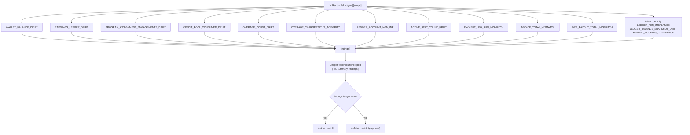
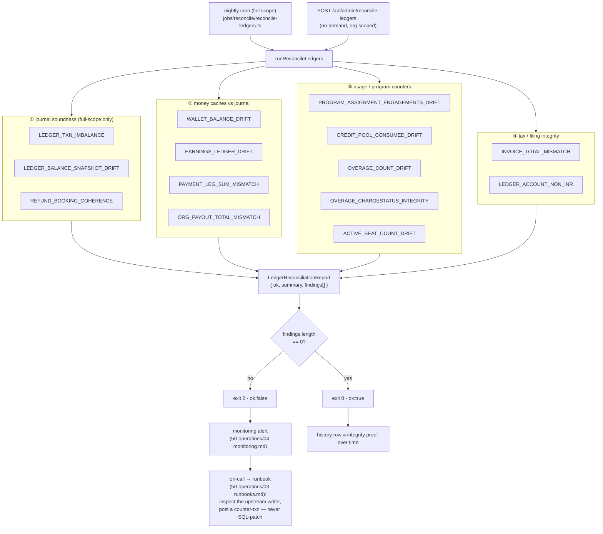

# Ledger integrity & reconciliation

**What this covers:** the read-only auditor that proves the money model holds — the invariants it checks, the one informational coverage metric, how it runs (nightly cron + on-demand admin route), and what a finding means. This is the safety net that lets us trust derived balances and reconciled caches.

> **Why this exists.** The journal is the source of truth, but a few numbers are **cached** for the hot path (`walletBalance`) or **denormalized** for query speed (`engagementsUsed`, `activeSeatCount`, the `Earnings` amount columns). A cache is only safe if something independently re-derives it and screams on drift. That something is `scripts/reconcile/reconcile-ledgers.ts` — **read-only**; it never writes to an audited table, only to `LedgerReconciliationReport`.

---

## 1. The checks

The auditor grew with the money model (#775/#776/#782/#783): the original seven invariants are now **fourteen** `Finding` kinds. Three run **full-scope only** (the global journal sweeps — `LEDGER_TXN_IMBALANCE`, `LEDGER_BALANCE_SNAPSHOT_DRIFT`, `REFUND_BOOKING_COHERENCE`); the rest accept an `organizationId` filter for incident triage.

| Finding `kind` | Scope | Asserts | Drift means |
| --- | --- | --- | --- |
| `WALLET_BALANCE_DRIFT` | per `BillingAccount` | `-balance(WALLET, org) == walletBalance` (WALLET is credit-normal, so owed = Σcredit−Σdebit) | the cache diverged from the journal — a writer skipped the journal or a manual SQL edit slipped in |
| `EARNINGS_LEDGER_DRIFT` | per payment **with** a `BOOKING` txn | cached `ConsultantEarnings(platformFee+consultantShare) + OrganizationEarnings(orgShare)` == journal `PLATFORM_FEE+CONSULTANT_PAYABLE+ORG_PAYABLE` credits | the earnings cache disagrees with the booking journal |
| `PROGRAM_ASSIGNMENT_ENGAGEMENTS_DRIFT` | per **active** `ProgramAssignment` (`periodEnd >= now`) | `sum(UsageLedgerEntry.engagementsConsumed) == engagementsUsed` | a partial-rollback bug, a missing ledger write, or manual SQL desynced the denormalized counter |
| `CREDIT_POOL_CONSUMED_DRIFT` | per **active** CREDIT_POOL `ProgramAssignment` | `sum(UsageLedgerEntry.priceAtBookingPaise) == consumedPaise` (refund rows post negative, so the sum nets) | the CREDIT_POOL money-meter write in `recordBookingUtilization`/`reverseBookingUtilization` desynced |
| `OVERAGE_COUNT_DRIFT` | per **active** `ProgramAssignment` | `count(OverageEvent where chargeStatus ∉ {REVERSED,BLOCKED}) == overageCount` | the over-cap counter bump/decrement missed; a charged-then-refunded overage awaiting a credit note (#716) is the expected benign cause |
| `OVERAGE_CHARGESTATUS_INTEGRITY` | per `OverageEvent` (link/state) | CHARGE_MEMBER pending/failed/charged ⇒ has a side-`Payment`; CHARGE_ORG accrued/charged ⇒ has an `InvoiceLineItem`; any `CHARGED` ⇒ `settledAt` set | the `transitionOverage` state machine was bypassed or a write half-completed |
| `LEDGER_ACCOUNT_NON_INR` | per `LedgerAccount` | `currency == INR` for every account (#783) | a posting keyed an INR-paise amount by a display currency — would break receivable/payable clearing |
| `ACTIVE_SEAT_COUNT_DRIFT` | per `BillingSubscription` | `activeSeatCount == count(in-period LICENSED_SEAT ACTIVE assignments)` | the per-seat invoice line-item counter missed a write (or reflects historical drift before its writer existed) |
| `PAYMENT_LEG_SUM_MISMATCH` | per `Payment` with org legs | `sum(PaymentLeg.amountPaise) == Payment.amount` (LICENSE legs are 0) | a leg writer (checkout / wallet / referral / overage) emitted the wrong amount |
| `INVOICE_TOTAL_MISMATCH` | per `OrganizationInvoice` | `totalPaise == subtotalPaise + CGST + SGST + IGST` | a mis-totaled GST invoice (filing defect); the issue-time assert in `invoice-rollup.ts` blocks new ones, this sweeps legacy/manual rows |
| `ORG_PAYOUT_TOTAL_MISMATCH` | per `OrganizationPayout` | `sum(orgShare − refunded) of batched earnings == netPayoutPaise` | the batch claim updated earnings but the payout total diverged |
| `LEDGER_TXN_IMBALANCE` | per `LedgerTransaction` (**full scope only**) | `Σdebit == Σcredit` | a manual SQL edit or a future writer bug broke a posting; **zero of these across a reseed is the gate** that justified removing the three legacy logs |
| `LEDGER_BALANCE_SNAPSHOT_DRIFT` | per `LedgerAccount` (**full scope only**) | maintained `LedgerAccountBalance` snapshot == journal `Σ(DEBIT)−Σ(CREDIT)` (#776) | the O(1) running-balance cache drifted, or an account with entries has no snapshot row (a posting bypassed `postLedgerTxn`) |
| `REFUND_BOOKING_COHERENCE` | per `BookingUtilization` (**full scope only**) | fully-refunded payment ⇒ utilization reversed; reversed utilization ⇒ a `SUCCEEDED` refund backs it (#776 §C) | a cap leak (money back but the seat still consumed) or a seat released for free |

**Grouped by what each check protects** — the flat list above is alphabetical; this is the pipeline as a defender, from "is the journal itself sound" through "do the caches match" to "who gets paged":

The grouping is conceptual, not a code boundary (all fourteen run in one pass); it's how to *triage*: an ① finding means the journal itself is wrong (rare, high-severity — a manual SQL edit or a writer that bypassed `postLedgerTxn`); ②–④ mean a *cache* drifted from a sound journal (fix the writer, re-derive the cache via a counter-transaction).

Each `Finding` is a compact row: `{ kind, organizationId?, billingAccountId?, billingSubscriptionId?, invoiceId?, paymentId?, payoutId?, programAssignmentId?, expectedPaise, actualPaise, deltaPaise, details? }`. For the count-based checks (`…ENGAGEMENTS_DRIFT`, `…SEAT_COUNT_DRIFT`, `OVERAGE_COUNT_DRIFT`) and the link/state ones the `*Paise` fields hold **counts / events**, not paise — `details.unit` records the real unit.

---

## 2. The coverage metric (informational, not a finding)

`summary.earningsPaymentsWithoutBookingTxn` counts earnings-bearing payments that have **no** `BOOKING` journal transaction yet — the multi-collaborator runtime path and seed rows (tracked gap **#773**). It is reported for visibility but does **not** fail the run, because `EARNINGS_LEDGER_DRIFT` only checks payments that *do* have a booking txn. When #773 lands the booking journal for multi-collaborator splits, this metric trends to zero.

---

## 3. How it runs

- **Library:** `runReconcileLedgers({ scope, organizationId?, triggeredById? })` → `ReconcileReport`. Scope is `"full"` or `"org:<id>"`; passing `organizationId` limits every per-row check to one org and **skips the three global journal sweeps** (`LEDGER_TXN_IMBALANCE`, `LEDGER_BALANCE_SNAPSHOT_DRIFT`, `REFUND_BOOKING_COHERENCE`), which run full-scope only.
- **Nightly cron:** `jobs/reconcile/reconcile-ledgers.ts` calls it with `scope: "full"`, persists a `LedgerReconciliationReport`, and exits **0** (clean), **2** (discrepancies — page ops), or **1** (fatal error). Scheduled via `.github/workflows/reconcile-ledgers.yml`.
- **On-demand:** `POST /api/admin/reconcile-ledgers` runs the same auditor, optionally scoped to one org via the request body — for incident triage without waiting for the nightly run.
- **Report storage:** every run writes a `LedgerReconciliationReport { scope, ok, durationMs, summary, findings, triggeredById }`. The history is the audit trail of integrity over time.

---

## 4. When a finding fires

A finding is an **incident signal, never a thing to hand-patch.** The drift is a symptom; the fix is upstream (the writer that diverged), and the correction — if money is involved — is a **counter-transaction**, not a SQL `UPDATE` on a balance. See [runbooks](../50-operations/03-runbooks.md) for the per-finding triage procedure (which writer to inspect, how to post a correcting entry, when to page).

The cutover (#772) shipped with this auditor returning `ok: true`, **0 findings**, across a full DB reseed — the empirical proof that the double-entry journal and every reconciled cache agree.

---

## 5. Design decisions & trade-offs

- **Read-only by construction.** The reconciler writes *only* `LedgerReconciliationReport`; it never touches an audited table. The alternative — an "auto-heal" that SQL-patches a drifted cache — was rejected: a drift is a *symptom of an upstream writer bug*, and silently patching the cache would hide the bug while possibly papering over real lost/duplicated money. The cost is that every finding needs a human (or a follow-up counter-transaction); the benefit is the auditor can never itself become a source of corruption.
- **Counts and events reuse the `*Paise` fields.** Rather than a separate schema per check kind, count-based findings (`…ENGAGEMENTS_DRIFT`, `…SEAT_COUNT_DRIFT`, `OVERAGE_COUNT_DRIFT`) and link/state findings stuff counts into `expectedPaise`/`actualPaise`/`deltaPaise` and record the real unit in `details.unit`. One row shape for all fourteen kinds keeps the report queryable and the alerting uniform; the cost is that `*Paise` is a slight misnomer for those rows (the `unit` tag is the disambiguator).
- **One informational metric that does *not* fail the run.** `earningsPaymentsWithoutBookingTxn` (#773) is reported but never flips `ok:false`, because `EARNINGS_LEDGER_DRIFT` deliberately only checks payments that *have* a booking txn. Letting a known, tracked coverage gap fail the nightly run would train ops to ignore a red reconciler — the worst possible outcome for a safety net. So it's surfaced as a trend-to-zero metric instead of a finding.

## 6. What this design survived

- **Growing from 7 invariants to 14 without a rewrite (#775/#776/#782/#783).** The original seven checks proved the journal + the first caches; each later money feature added its own invariant in the *same* `Finding` union and `findings[]` collector — `LEDGER_BALANCE_SNAPSHOT_DRIFT` + `REFUND_BOOKING_COHERENCE` (#776), the overage trio (#782), `LEDGER_ACCOUNT_NON_INR` (`c38b9631`, #783). The single-pass, single-report shape absorbed every addition; a per-feature reconciler script would have fragmented the audit trail.
- **The #785 money-safety series leaned on this auditor as its oracle.** Several #785 fixes (`ca6e9073` uncredited top-up recovery, `59f6e038` circuit-breaker ceiling relief, `738d8130` refund×chargeback netting) cite "reconcile Clean" in their commit messages as the *acceptance test* — the bug was reproduced, the fix applied, and the proof was the reconciler going back to `ok:true`. The auditor isn't just a nightly guard; it's the regression harness the money-safety work was validated against.

---

### Related docs
- [Money model overview](01-money-model-overview.md) §4 — the reconciled-cache contract.
- [Ledger & postings](03-ledger-and-postings.md) — the postings these checks re-sum.
- [Payment legs](08-payment-legs.md) — the leg-sum invariant (`PAYMENT_LEG_SUM_MISMATCH`).
- [Runbooks](../50-operations/03-runbooks.md) — per-finding incident response.
- [Monitoring](../50-operations/04-monitoring.md) — alerting on report `ok:false`.
- Ground truth: `scripts/reconcile/reconcile-ledgers.ts`, `jobs/reconcile/reconcile-ledgers.ts`, `LedgerReconciliationReport` in `prisma/schema.prisma`.
