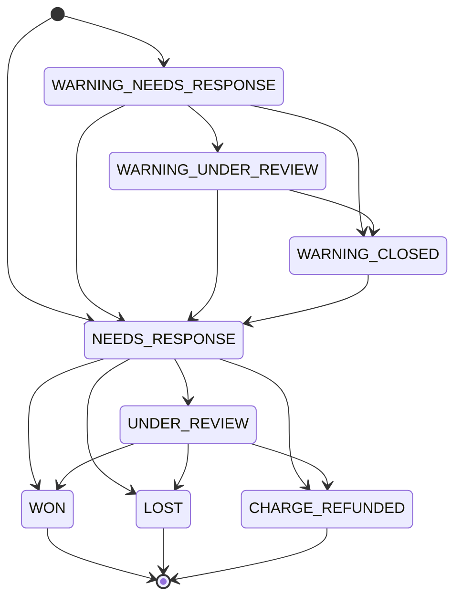
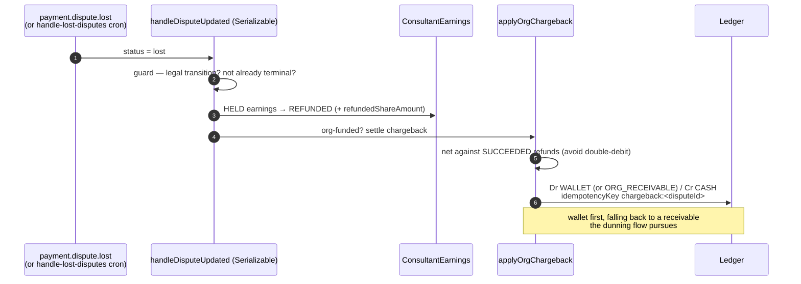

# Disputes

**What this covers:** the organization/B2B side of disputes (chargebacks) — how a lost dispute on an org-funded booking settles against the org, how disputed earnings are held, and the dispute state machine our code maintains. The consumer-marketplace (B2C) dispute UI and the gateway-generic flow stay documented in [`docs/payments/refunds-disputes/`](../../payments/refunds-disputes/README.md); this doc is the enterprise lens on the same handler.

A dispute is the buyer's bank pulling money back without going through our refund engine, so its money-path mirror is a refund but the *trigger* is external. The handler lives in `app/api/webhooks/utils.ts` (`handleDisputeCreated`, `handleDisputeUpdated`, `applyOrgChargeback`), guarded by the state machine in `lib/payments/dispute-status.ts`.

---

## 1. Our 8-state dispute machine

`DisputeStatus` (`prisma/schema.prisma`) has eight values, shaped after the Stripe/Razorpay dispute lifecycles. The early-warning cluster (`WARNING_*`) models pre-dispute fraud alerts; the active cluster (`NEEDS_RESPONSE`, `UNDER_REVIEW`) models a live chargeback; and the terminal cluster (`WON`, `LOST`, `CHARGE_REFUNDED`) records the verdict. The allowed transitions are enforced by `isLegalDisputeTransition` in `lib/payments/dispute-status.ts`.

The **early-warning cluster** (`WARNING_NEEDS_RESPONSE`, `WARNING_UNDER_REVIEW`, `WARNING_CLOSED`) represents a bank's early fraud signal that has not yet become a formal chargeback; a closed warning can still escalate into a real dispute, which is why `WARNING_CLOSED` is allowed to transition forward to `NEEDS_RESPONSE` and is **not** treated as terminal. The **active cluster** (`NEEDS_RESPONSE`, `UNDER_REVIEW`) is a live chargeback awaiting our evidence and then the bank's review. The **terminal cluster** (`WON`, `LOST`, `CHARGE_REFUNDED`) is final: `TERMINAL_DISPUTE_STATUSES` lists `WON`/`LOST`/`CHARGE_REFUNDED`, and `isLegalDisputeTransition` rejects any outgoing edge from them so a delayed or replayed webhook can never re-drive the lost-dispute side effects.

---

## 2. Razorpay's two-axis model

Razorpay does not use our eight Stripe-shaped statuses; it models a dispute along **two independent axes**, a `status` and a `phase`, and our handler has to collapse both onto our single enum. The two axes are summarized below before the mapping.

The **status** axis has five values: `open` (the dispute was raised), `under_review` (the issuing bank is reviewing the evidence we contested with), `won` (the bank accepted our documents), `lost` (the bank rejected them), and `closed` (the transaction was closed after we supplied details or refunded the customer). The **phase** axis tracks escalation: `fraud` and `retrieval` are early, soft information requests; `chargeback` is the formal money-pulling claim; and `pre_arbitration` and `arbitration` are successive, costly re-challenges adjudicated by the card network (https://razorpay.com/docs/api/disputes/entity/). Each dispute carries a `respond_by` Unix-timestamp deadline; missing it forfeits the dispute. `amount_deducted` reports funds pulled from the Razorpay balance and stays `0` until the dispute is `lost`, while `deduct_at_onset` indicates whether the balance is debited the moment the dispute is raised.

The table below maps Razorpay's `status` to our `DisputeStatus`, with the webhook that delivers it and the code path that performs the mapping.

| Razorpay `status` | Delivering webhook | Our enum (via `mapDisputeStatus`) | Correct? |
| --- | --- | --- | --- |
| `open` | `payment.dispute.created` | `NEEDS_RESPONSE` (default branch) | Works only by falling through to the default; no explicit `open` case. |
| `under_review` | `payment.dispute.under_review` | `UNDER_REVIEW` | Mapper is correct, but the event is **never dispatched** (Gap 2). |
| `won` | `payment.dispute.won` | `WON` (dispatch forces `"won"`) | Correct. |
| `lost` | `payment.dispute.lost` | `LOST` (dispatch forces `"lost"`) | Correct. |
| `closed` | `payment.dispute.closed` | `NEEDS_RESPONSE` (default branch) | **Wrong** — a terminal dispute is recorded as still needing a response (Gap 1). |
| (none) | `payment.dispute.action_required` | — | Event **unhandled** (Gap 3). |

The three `WARNING_*` enum values have no Razorpay source at all — Razorpay folds its early `fraud`/`retrieval` phases into `open`/`under_review`, never a `warning_*` status — so those states only ever populate from the Stripe path.

We also record `deduct_at_onset === false` as our `isChargeRefundable` flag (`handleDisputeCreated`). This is a reasonable proxy but conflates "refundable" with "not yet deducted"; finance reconciliation should not be surprised when funds are in fact held at onset.

Authoritative: this section is gateway behavior, not regulation; the consumer-protection framing for refunds (which a `CHARGE_REFUNDED`/accept outcome triggers) is in [refunds §4](10-refunds.md) and `docs/compliance/09`.

---

## 3. Evidence and contesting — and an outdated doc claim

A merchant resolves a Razorpay dispute by either **accepting** it (the customer is refunded and the dispute closes) or **contesting** it with evidence. Contrary to our older payments documentation, Razorpay now exposes both as APIs rather than dashboard-only actions: `POST /v1/disputes/:id/accept` and `PATCH /v1/disputes/:id/contest` (https://razorpay.com/docs/api/disputes/contest/, https://razorpay.com/docs/api/disputes/accept/). A contest is built by uploading supporting documents to obtain document ids, then submitting them under typed evidence fields (`shipping_proof`, `proof_of_service`, `customer_communication`, `explanation_letter`, `refund_confirmation`, and others) with `action: "draft"` to save or `action: "submit"` to send to the bank — at least one document id is required to submit. Submitting moves the dispute to `under_review`, and the bank's verdict arrives as `payment.dispute.won` or `payment.dispute.lost`.

> 🟥 **Divergence:** the absorbed payments docs assert Razorpay has no dispute API — `docs/payments/refunds-disputes/03-dispute-flow.md` states "NO direct dispute API" and `01-architecture.md` labels the Razorpay box "(No dispute API)". The cron `scripts/disputes/reconcile-disputes.ts` carries the same stale comment ("Razorpay doesn't support dispute API") and routes every Razorpay dispute to `razorpayManualReviewCount` for manual dashboard review. As of June 2026 the contest/accept endpoints above exist; the assertion that it is impossible is outdated. (This flags the divergence; do not edit `docs/compliance` here.)

---

## 4. Three handler bugs (verified against code)

The dispute handler has three real defects, each verified against the dispatch switch in `app/api/webhooks/razorpay-dispatch.ts` and the mapper in `app/api/webhooks/utils.ts`. They are presented here as gaps because each silently drops or mis-records a dispute signal.

> 🟡 **Gap 1 — `closed` mis-maps to `NEEDS_RESPONSE` (no issue filed yet).** `mapDisputeStatus` (`app/api/webhooks/utils.ts`, ~line 1297) has explicit cases for `won`, `lost`, `under_review`, `charge_refunded`, and the five `warning_*`/`needs_response` strings, but **no `case "closed"`** — so `closed` hits the `default` and returns `NEEDS_RESPONSE`. The `payment.dispute.closed` dispatch case passes the raw status string straight through to `handleDisputeUpdated`, so a *resolved* dispute is mapped to a state that says it still needs a response. In practice the downstream legal-transition guard then masks the symptom unpredictably: if the dispute was already terminal the transition is rejected, and if it was already `NEEDS_RESPONSE` the same-status check no-ops — but an `UNDER_REVIEW` dispute receiving `closed` is rejected as an illegal `UNDER_REVIEW → NEEDS_RESPONSE` backward transition and never reaches a terminal state. The fix is a `case "closed"` mapping to a terminal state (`CHARGE_REFUNDED` when a refund was issued, else a closed/terminal verdict).

> 🟡 **Gap 2 — `payment.dispute.under_review` is never dispatched (no issue filed yet).** Razorpay fires this event after a contest is submitted for bank review, and `mapDisputeStatus("under_review")` would correctly return `UNDER_REVIEW` — but `razorpay-dispatch.ts` has **no `case` for `payment.dispute.under_review`**; the switch handles only `created`, `won`, `lost`, and `closed`. The event falls to the dispatcher's `default` (logged as "Unhandled Razorpay event type"), so a contested dispute never advances out of `NEEDS_RESPONSE` in our records even while the bank is actively reviewing it. The fix is to subscribe to the event and add a dispatch case calling `handleDisputeUpdated(id, "under_review", null)`.

> 🟡 **Gap 3 — `payment.dispute.action_required` is unhandled (no issue filed yet).** Razorpay fires this when it or the bank needs more documents from us; it is a deadline-bearing state. There is **no case for it anywhere** in `razorpay-dispatch.ts`, so it falls through to the dispatcher's `default` and is dropped. Because it carries its own `respond_by`, dropping it risks an auto-loss on a missed deadline that we never surfaced. The fix is to subscribe and dispatch it to a deadline-tracking state.

A related but lower-severity observation: `open` is not explicitly mapped either — it works today only because the `default` branch happens to return `NEEDS_RESPONSE`. An explicit `case "open"` would make the mapping intentional and resilient to a future default change.

---

## 5. The dispute crons and the LOST → cascade path

Three crons keep dispute state honest when webhooks are missed or deadlines approach, each a thin GitHub-Actions wrapper over a script in `scripts/disputes/`.

The **reconcile-disputes** cron (`jobs/disputes/reconcile-disputes.ts`, every 6 hours) re-queries the gateway for disputes that are still `NEEDS_RESPONSE`/`UNDER_REVIEW` (or their warning variants) and either approaching their `dueBy` deadline or stale for 24 hours, then adopts any changed status. It reconciles **Stripe** disputes live, but every **Razorpay** dispute is shunted to a manual-review counter rather than reconciled (see the Gap 3 / §3 divergence about the now-existing Razorpay API). The **alert-dispute-deadlines** cron (hourly) finds `NEEDS_RESPONSE`/`WARNING_NEEDS_RESPONSE` disputes whose `dueBy` falls within 48 hours, escalating to critical within 12 hours, and flags any past-due disputes. The **handle-lost-disputes** cron (every 6 hours) is the backstop for a missed `payment.dispute.lost` webhook: it finds `LOST` disputes whose earnings are not yet `REFUNDED` and runs the canonical `refundEarnings(paymentId, { forceRefund: true })`, loudly counting any earnings that were already `PAID` (which require manual recovery).

When a dispute is lost, `handleDisputeUpdated` runs the money reversal inline, and for an org-funded booking it settles the chargeback against the org via `applyOrgChargeback`.

`applyOrgChargeback` is idempotent on `chargeback:<disputeId>` and deliberately **nets the chargeback against any `SUCCEEDED` refund already booked on the same payment**, so the org is debited exactly once when a refund and a lost chargeback are two routes to the same "customer got the money back." The Serializable isolation on `handleDisputeUpdated` (and on `refundPayment`) is what makes that netting race-safe: an interleaving refund and lost-chargeback form a dangerous read-write structure and one transaction aborts and is retried, rather than both reversing the org for the same money.

---

## 6. Disputes and earnings holds

A dispute is the reason the earnings `HELD` state exists. When `handleDisputeCreated` records a new dispute, it flips that payment's `ConsultantEarnings` from `PENDING`/`READY` to `HELD`, freezing the funds so a payout cannot leave while the chargeback is live. The resolution then unwinds the hold: a `WON` (or `WARNING_CLOSED`) dispute releases `HELD` earnings back to `READY`, while a `LOST`/`CHARGE_REFUNDED` dispute marks them `REFUNDED` and increments `refundedShareAmount` for the un-refunded remainder. The full set of earning states and the payout gates they govern live in [earnings lifecycle](06-earnings-lifecycle.md).

---

### Related docs
- [Refunds](10-refunds.md) — the money path a `CHARGE_REFUNDED`/accept outcome shares.
- [Earnings lifecycle](06-earnings-lifecycle.md) — the `HELD` → `READY`/`REFUNDED` transitions a dispute drives.
- [Payout pipeline](07-payout-pipeline.md) — why held earnings must not pay out.
- [Payment webhooks](12-payment-webhooks.md) — the inbound `payment.dispute.*` events and the dispatch switch these gaps live in.
- B2C / gateway-generic details: [`docs/payments/refunds-disputes/`](../../payments/refunds-disputes/README.md).
- Ground truth: `app/api/webhooks/utils.ts`, `lib/payments/dispute-status.ts`, `app/api/webhooks/razorpay-dispatch.ts`, `scripts/disputes/*.ts`.
