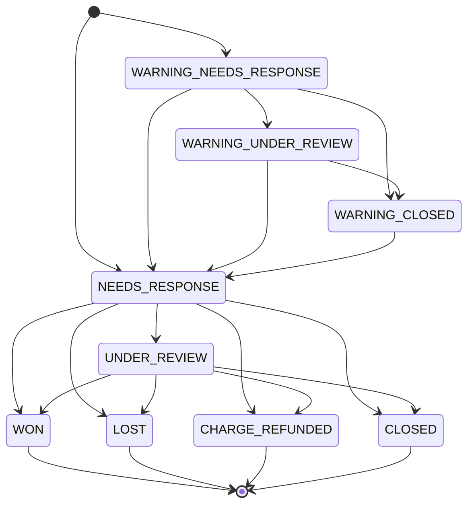
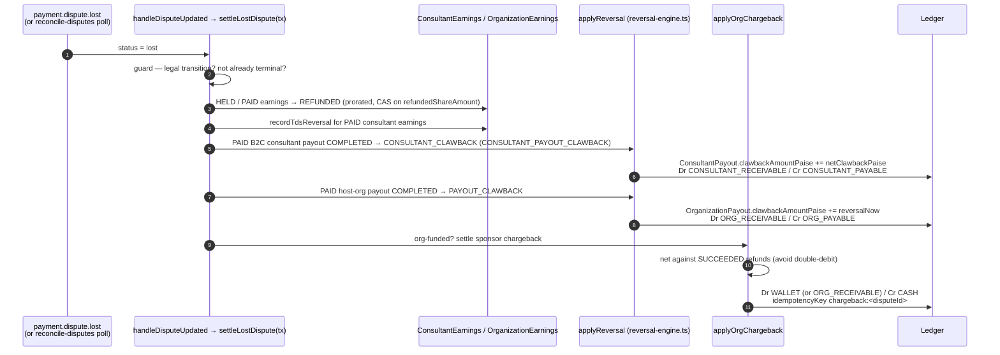

# Disputes

**What this covers:** the organization/B2B side of disputes (chargebacks) — how a lost dispute on an org-funded booking settles against the org, how disputed earnings are held, and the dispute state machine our code maintains. The consumer-marketplace (B2C) dispute UI and the gateway-generic flow stay documented in [`docs/payments/refunds-disputes/`](../../payments/refunds-disputes/README.md); this doc is the enterprise lens on the same handler.

A dispute is the buyer's bank pulling money back without going through our refund engine, so its money-path mirror is a refund but the *trigger* is external. The handler lives in `app/api/webhooks/utils.ts` (`handleDisputeCreated`, `handleDisputeUpdated`, `applyOrgChargeback`), guarded by the state machine in `lib/payments/dispute-status.ts`.

---

## 1. Our 8-state dispute machine

`DisputeStatus` (`prisma/schema.prisma`) has nine values, shaped after the Stripe/Razorpay dispute lifecycles. The early-warning cluster (`WARNING_*`) models pre-dispute fraud alerts; the active cluster (`NEEDS_RESPONSE`, `UNDER_REVIEW`) models a live chargeback; and the terminal cluster (`WON`, `LOST`, `CHARGE_REFUNDED`, `CLOSED`) records the outcome — `CLOSED` is Razorpay's ended-without-verdict terminal, reached when the merchant supplied transaction details or refunded the customer. The allowed transitions are enforced by `isLegalDisputeTransition` in `lib/payments/dispute-status.ts`.

```mermaid
stateDiagram-v2
    [*] --> WARNING_NEEDS_RESPONSE
    [*] --> NEEDS_RESPONSE
    WARNING_NEEDS_RESPONSE --> WARNING_UNDER_REVIEW
    WARNING_NEEDS_RESPONSE --> WARNING_CLOSED
    WARNING_NEEDS_RESPONSE --> NEEDS_RESPONSE
    WARNING_UNDER_REVIEW --> WARNING_CLOSED
    WARNING_UNDER_REVIEW --> NEEDS_RESPONSE
    WARNING_CLOSED --> NEEDS_RESPONSE
    NEEDS_RESPONSE --> UNDER_REVIEW
    NEEDS_RESPONSE --> WON
    NEEDS_RESPONSE --> LOST
    NEEDS_RESPONSE --> CHARGE_REFUNDED
    NEEDS_RESPONSE --> CLOSED
    UNDER_REVIEW --> WON
    UNDER_REVIEW --> LOST
    UNDER_REVIEW --> CHARGE_REFUNDED
    UNDER_REVIEW --> CLOSED
    WON --> [*]
    LOST --> [*]
    CHARGE_REFUNDED --> [*]
    CLOSED --> [*]
```

The **early-warning cluster** (`WARNING_NEEDS_RESPONSE`, `WARNING_UNDER_REVIEW`, `WARNING_CLOSED`) represents a bank's early fraud signal that has not yet become a formal chargeback; a closed warning can still escalate into a real dispute, which is why `WARNING_CLOSED` is allowed to transition forward to `NEEDS_RESPONSE` and is **not** treated as terminal. The **active cluster** (`NEEDS_RESPONSE`, `UNDER_REVIEW`) is a live chargeback awaiting our evidence and then the bank's review. The **terminal cluster** (`WON`, `LOST`, `CHARGE_REFUNDED`, `CLOSED`) is final: `TERMINAL_DISPUTE_STATUSES` lists all four, and `isLegalDisputeTransition` rejects any outgoing edge from them so a delayed or replayed webhook can never re-drive the lost-dispute side effects.

---

## 2. Razorpay's two-axis model

Razorpay does not use our eight Stripe-shaped statuses; it models a dispute along **two independent axes**, a `status` and a `phase`, and our handler has to collapse both onto our single enum. The two axes are summarized below before the mapping.

The **status** axis has five values: `open` (the dispute was raised), `under_review` (the issuing bank is reviewing the evidence we contested with), `won` (the bank accepted our documents), `lost` (the bank rejected them), and `closed` (the transaction was closed after we supplied details or refunded the customer). The **phase** axis tracks escalation: `fraud` and `retrieval` are early, soft information requests; `chargeback` is the formal money-pulling claim; and `pre_arbitration` and `arbitration` are successive, costly re-challenges adjudicated by the card network (https://razorpay.com/docs/api/disputes/entity/). Each dispute carries a `respond_by` Unix-timestamp deadline; missing it forfeits the dispute. `amount_deducted` reports funds pulled from the Razorpay balance and stays `0` until the dispute is `lost`, while `deduct_at_onset` indicates whether the balance is debited the moment the dispute is raised.

The table below maps Razorpay's `status` to our `DisputeStatus`, with the webhook that delivers it and the code path that performs the mapping.

| Razorpay `status` | Delivering webhook | Our enum (via `mapDisputeStatus`) | Correct? |
| --- | --- | --- | --- |
| `open` | `payment.dispute.created` | `NEEDS_RESPONSE` (default branch) | Works only by falling through to the default; no explicit `open` case. |
| `under_review` | `payment.dispute.under_review` | `UNDER_REVIEW` | Correct — the event is dispatched alongside `action_required` (#789). |
| `won` | `payment.dispute.won` | `WON` (dispatch forces `"won"`) | Correct. |
| `lost` | `payment.dispute.lost` | `LOST` (dispatch forces `"lost"`) | Correct. |
| `closed` | `payment.dispute.closed` | `CLOSED` (terminal) | Correct — proceedings ended without a verdict; still-`HELD` earnings release, refund-consumed ones are already `REFUNDED`. |
| (entity status) | `payment.dispute.action_required` | `NEEDS_RESPONSE` | Correct in effect — the deadline-bearing signal lands back in the needs-response state and the hourly deadline alert cron picks up its `respond_by`. Razorpay allows roughly three business days to respond, so this event is the urgent one. |

The three `WARNING_*` enum values have no Razorpay source at all — Razorpay folds its early `fraud`/`retrieval` phases into `open`/`under_review`, never a `warning_*` status — so those states only ever populate from the Stripe path.

We also record `deduct_at_onset === false` as our `isChargeRefundable` flag (`handleDisputeCreated`). This is a reasonable proxy but conflates "refundable" with "not yet deducted"; finance reconciliation should not be surprised when funds are in fact held at onset.

Authoritative: this section is gateway behavior, not regulation; the consumer-protection framing for refunds (which a `CHARGE_REFUNDED`/accept outcome triggers) is in [refunds §4](10-refunds.md) and `docs/compliance/09`.

---

## 3. Evidence and contesting — and an outdated doc claim

A merchant resolves a Razorpay dispute by either **accepting** it (the customer is refunded and the dispute closes) or **contesting** it with evidence. Contrary to our older payments documentation, Razorpay now exposes both as APIs rather than dashboard-only actions: `POST /v1/disputes/:id/accept` and `PATCH /v1/disputes/:id/contest` (https://razorpay.com/docs/api/disputes/contest/, https://razorpay.com/docs/api/disputes/accept/). A contest is built by uploading supporting documents to obtain document ids, then submitting them under typed evidence fields (`shipping_proof`, `proof_of_service`, `customer_communication`, `explanation_letter`, `refund_confirmation`, and others) with `action: "draft"` to save or `action: "submit"` to send to the bank — at least one document id is required to submit. Submitting moves the dispute to `under_review`, and the bank's verdict arrives as `payment.dispute.won` or `payment.dispute.lost`.

> **Divergence resolved.** The absorbed payments docs used to assert Razorpay has no dispute API; `docs/payments/refunds-disputes/03-dispute-flow.md` and `01-architecture.md` now reflect the contest/accept endpoints, and `scripts/disputes/reconcile-disputes.ts` polls Razorpay disputes via `GET /v1/disputes/:id` — adopting status through the CAS and settling an adopted LOST through the shared path. `razorpayManualReviewCount` now counts only rows the poll cannot adopt (unknown gateway id, unmapped status, unlinked payment). Wiring an evidence-upload surface to the contest/accept endpoints is tracked in the launch-residuals register.

---

## 4. Three handler bugs — all resolved

An earlier revision of this section documented three real defects in the dispatch switch (`app/api/webhooks/razorpay-dispatch.ts`) and the mapper (`app/api/webhooks/utils.ts`). All three are now fixed; the history is kept here because the failure modes are instructive.

**Gap 1 (resolved in the #709/#752 triage PR) — `closed` used to mis-map to `NEEDS_RESPONSE`.** `mapDisputeStatus` had no `case "closed"`, so Razorpay's ended-without-verdict terminal fell to the `default` and a resolved dispute was recorded as still needing a response — or, when the dispute was already `UNDER_REVIEW`, the transition guard rejected the backward move and the dispute never reached a terminal state at all. The fix added a dedicated `CLOSED` value to the `DisputeStatus` enum, mapped `"closed"` to it, registered it as terminal in `lib/payments/dispute-status.ts`, and made `handleDisputeUpdated` release any still-`HELD` earnings on close (rows consumed by a refund are already `REFUNDED` by the refund cascade, so that release is a natural no-op when money moved).

**Gap 2 (resolved under #789) — `payment.dispute.under_review` was never dispatched.** The dispatcher now routes it (together with `action_required`) through `handleDisputeUpdated`, so a contested dispute advances to `UNDER_REVIEW` while the bank reviews the evidence.

**Gap 3 (resolved under #789) — `payment.dispute.action_required` was dropped.** It now dispatches through the same progress path and lands the dispute back in `NEEDS_RESPONSE`. This event is the urgent one: Razorpay's published guidance allows roughly **three business days** to respond before the right to contest lapses, and the hourly `alert-dispute-deadlines` cron surfaces the `respond_by` window (48-hour warning, 12-hour critical).

A related but lower-severity observation still stands: `open` is not explicitly mapped — it works today only because the `default` branch happens to return `NEEDS_RESPONSE`. An explicit `case "open"` would make the mapping intentional and resilient to a future default change.

---

## 5. The dispute crons and the LOST → cascade path

Three crons keep dispute state honest when webhooks are missed or deadlines approach, each a thin GitHub-Actions wrapper over a script in `scripts/disputes/`.

The **reconcile-disputes** cron (`jobs/disputes/reconcile-disputes.ts`, every 6 hours) re-queries the gateway for disputes that are still `NEEDS_RESPONSE`/`UNDER_REVIEW` (or their warning variants) and either approaching their `dueBy` deadline or stale for 24 hours, then adopts any changed status. It reconciles **Stripe** disputes live and **Razorpay** disputes via `GET /v1/disputes/:id`; a Razorpay row the poll cannot adopt (unknown gateway id, unmapped status, unlinked payment) counts toward manual review instead. The **alert-dispute-deadlines** cron (hourly) finds `NEEDS_RESPONSE`/`WARNING_NEEDS_RESPONSE` disputes whose `dueBy` falls within 48 hours, escalating to critical within 12 hours, and flags any past-due disputes. There is no `handle-lost-disputes` cron: the backstop for a missed `payment.dispute.lost` webhook is the same reconcile run — a `LOST` outcome adopted by the poll settles through the shared `settleLostDispute(tx, dispute)` (`app/api/webhooks/utils.ts`), the exact same atomic money path used by `handleDisputeUpdated`.

When a dispute is lost, `settleLostDispute(tx, dispute)` executes inside the caller's Serializable transaction and fans the reversal out across consultant earnings, host-org earnings, completed payouts (via `lib/payments/operations/reversal-engine.ts`), and the sponsoring org (via `applyOrgChargeback`):

```mermaid
sequenceDiagram
    autonumber
    participant GW as payment.dispute.lost<br/>(or reconcile-disputes poll)
    participant H as handleDisputeUpdated → settleLostDispute(tx)
    participant E as ConsultantEarnings / OrganizationEarnings
    participant RE as applyReversal (reversal-engine.ts)
    participant Org as applyOrgChargeback
    participant L as Ledger

    GW->>H: status = lost
    H->>H: guard — legal transition? not already terminal?
    H->>E: HELD / PAID earnings → REFUNDED (prorated, CAS on refundedShareAmount)
    H->>E: recordTdsReversal for PAID consultant earnings
    H->>RE: PAID B2C consultant payout COMPLETED → CONSULTANT_CLAWBACK (CONSULTANT_PAYOUT_CLAWBACK)
    RE->>L: ConsultantPayout.clawbackAmountPaise += netClawbackPaise<br/>Dr CONSULTANT_RECEIVABLE / Cr CONSULTANT_PAYABLE
    H->>RE: PAID host-org payout COMPLETED → PAYOUT_CLAWBACK
    RE->>L: OrganizationPayout.clawbackAmountPaise += reversalNow<br/>Dr ORG_RECEIVABLE / Cr ORG_PAYABLE
    H->>Org: org-funded? settle sponsor chargeback
    Org->>Org: net against SUCCEEDED refunds (avoid double-debit)
    Org->>L: Dr WALLET (or ORG_RECEIVABLE) / Cr CASH<br/>idempotencyKey chargeback:<disputeId>
```

### 5.1 `settleLostDispute` and `CONSULTANT_PAYOUT_CLAWBACK` (`CONSULTANT_CLAWBACK`)

`settleLostDispute` prorates every reversal by `prorationFactor = min(dispute.amountPaise / dispute.payment.amount, 1)` so partial disputes reverse only the disputed fraction of each party's share:

1. **Consultant earnings (`HELD` and `PAID`):**
   - Each matching `ConsultantEarnings` row is updated with a compare-and-set on `(id, status IN ['HELD', 'PAID'], refundedShareAmount: alreadyRefunded)` that flips `status` to `REFUNDED`, clears `preDisputeStatus`, and increments `refundedShareAmount` by `reversalNow = min(floor(consultantSharePaise * prorationFactor), remainingRefundable)`.
   - When the CAS succeeds and `earning.payoutId` is present, `recordTdsReversal` (`lib/payments/tax/tds-service.ts`) writes a negative `TDSRecord` (and `TdsAdjustment` if the original quarter was already filed) so withheld tax is reversed alongside the principal.
   - When the earning was already `PAID` on a `COMPLETED` `ConsultantPayout` for a **B2C** payment (`!dispute.payment.organizationId`), the net-of-TDS cash recovery (`netClawbackPaise = floor(reversalNow * (1 - payoutTds / payoutGross))`) is accumulated per `consultantPayoutId` and passed to the unified reversal engine (`lib/payments/operations/reversal-engine.ts`):
     - `applyReversal(tx, { source: { kind: "CONSULTANT_CLAWBACK", consultantPayoutId, consultantProfileId }, amountPaise: claw.amountPaise, reason, refundId: "dispute:<dispute.id>" })` (dispatched to `reverseConsultantPayoutClawback` / `postConsultantPayoutClawback`, the `CONSULTANT_PAYOUT_CLAWBACK` branch).
     - `postConsultantPayoutClawback` claims idempotency key `clawback:dispute:<dispute.id>:consultant-payout:<consultantPayoutId>` via `postLedgerTxn` (`Dr CONSULTANT_RECEIVABLE / Cr CONSULTANT_PAYABLE`, net of TDS) and increments `ConsultantPayout.clawbackAmountPaise` + stamps `clawbackInitiatedAt` only when the journal is newly created (`res.created === true`), guaranteeing atomic dual-write parity.
   - On an org-funded payment (`dispute.payment.organizationId` set), the sponsoring org bears the chargeback via `applyOrgChargeback`, so no `CONSULTANT_RECEIVABLE` is booked.

2. **Host-org earnings (`HELD` and `PAID`):**
   - Each matching `OrganizationEarnings` row is flipped to `REFUNDED` with a CAS on `(id, status IN ['HELD', 'PAID'], refundedAmountPaise: alreadyRefunded)`.
   - When the row was already `PAID` on a `COMPLETED` `OrganizationPayout`, `applyReversal` (`kind: "PAYOUT_CLAWBACK"`, via `reversePayoutClawback` / `postPayoutClawback`) claims idempotency key `clawback:dispute:<dispute.id>:payout:<orgPayoutId>`, posts `Dr ORG_RECEIVABLE / Cr ORG_PAYABLE`, and increments `OrganizationPayout.clawbackAmountPaise`.

3. **Sponsoring-org chargeback (`applyOrgChargeback`) and credit notes:**
   - `applyOrgChargeback` is idempotent on `chargeback:<disputeId>` and **nets the chargeback against any `SUCCEEDED` refund already booked on the same payment**, so the sponsoring org is debited at most once (`Dr WALLET` or `Dr ORG_RECEIVABLE` / `Cr CASH`).
   - When the disputed payment was billed on an issued `OrganizationInvoice`, the resulting `CreditNote` links to `disputeId` (`@unique`), one of the three mutually exclusive statutory triggers enforced by `credit_note_trigger_xor` (`CHECK (num_nonnulls("refundId", "disputeId", "overageEventId") = 1)`).

---

## 6. Disputes and earnings holds

A dispute is the reason the earnings `HELD` state exists. When `handleDisputeCreated` records a new dispute, it flips that payment's `ConsultantEarnings` and `OrganizationEarnings` from `PENDING`/`READY` to `HELD` (preserving `preDisputeStatus`), freezing the funds so a payout cannot leave while the chargeback is live. The resolution then unwinds the hold: a `WON`, `WARNING_CLOSED`, or `CLOSED` dispute releases `HELD` earnings back to their recorded `preDisputeStatus` (`READY` or `PENDING`), while a `LOST`/`CHARGE_REFUNDED` dispute runs `settleLostDispute` to mark `HELD` and `PAID` rows `REFUNDED`, increment their cumulative refunded columns, and book any completed-payout clawbacks. The full set of earning states and the payout gates they govern live in [earnings lifecycle](06-earnings-lifecycle.md).

---

### Related docs
- [Refunds](10-refunds.md) — the money path a `CHARGE_REFUNDED`/accept outcome shares, plus the unified reversal engine and `CreditNote` triggers.
- [Earnings lifecycle](06-earnings-lifecycle.md) — the `HELD` → `READY`/`REFUNDED` transitions a dispute drives.
- [Payout pipeline](07-payout-pipeline.md) — why held earnings must not pay out and how `clawbackAmountPaise` is tracked.
- [Payment webhooks](12-payment-webhooks.md) — the inbound `payment.dispute.*` events and the dispatch switch.
- B2C / gateway-generic details: [`docs/payments/refunds-disputes/`](../../payments/refunds-disputes/README.md).
- Ground truth: `app/api/webhooks/utils.ts` (`settleLostDispute`, `applyOrgChargeback`), `lib/payments/operations/reversal-engine.ts`, `lib/payments/dispute-status.ts`, `app/api/webhooks/razorpay-dispatch.ts`, `scripts/disputes/*.ts`.
