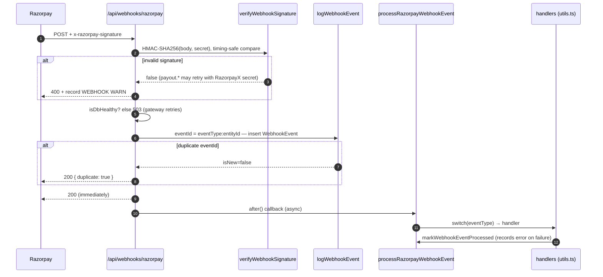
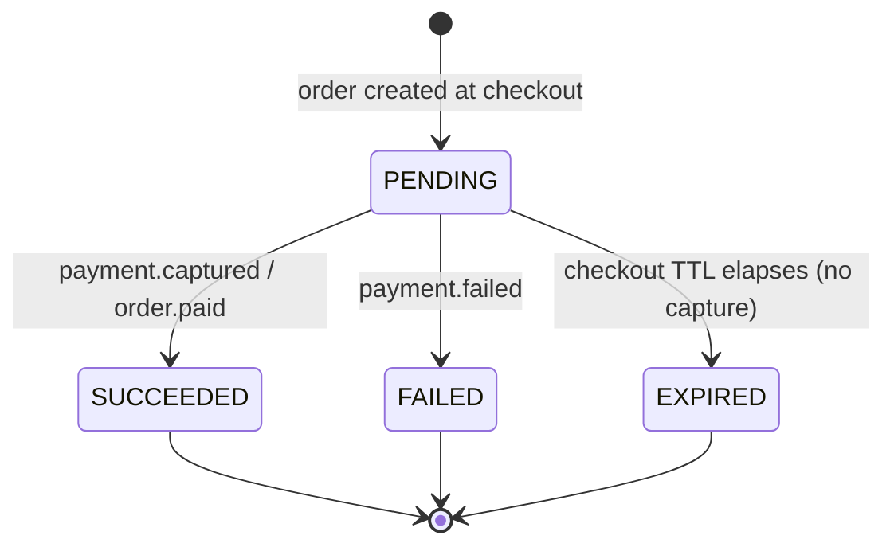

# Payment webhooks (inbound)

**What this covers:** the **inbound** gateway webhooks (Razorpay → us) that mutate money state — captures, refunds, payouts, and disputes — from signature verification through to the handlers that move the ledger. This is the opposite direction from the org-facing **outbound** webhook product (us → an org's HRIS/ERP), which is documented in [outbound webhooks](../40-compliance-and-data/04-outbound-webhooks.md); do not confuse the two — inbound webhooks are how money truth *arrives*, outbound webhooks are how lifecycle events *leave*.

The inbound pipeline is the authoritative source of asynchronous money state: a synchronous gateway API response is only an acknowledgement, and the real outcome (`processed`, `failed`, `won`, `lost`) always arrives here by webhook.

---

## 1. The ingestion pipeline

A Razorpay webhook enters at the route `app/api/webhooks/razorpay/route.ts`, is verified and deduplicated synchronously, then dispatched asynchronously so the route can return HTTP 200 inside Razorpay's 5-second timeout. The dispatch switch itself lives in a Next-agnostic module, `app/api/webhooks/razorpay-dispatch.ts`, so the stuck-event sweeper can replay through the exact same handler routing.



The first stage is **signature verification**. `verifyWebhookSignature` (`app/api/webhooks/utils.ts`) computes `HMAC-SHA256(rawBody, RAZORPAY_WEBHOOK_SECRET)` as hex, validates the incoming signature is exactly 64 hex chars and equal length, and compares with `crypto.timingSafeEqual` so the check cannot be timed. The pattern, condensed:

```ts
const expected = crypto.createHmac("sha256", secret).update(body).digest("hex");
if (signature.length !== 64) return { isValid: false, body };
const sigBuf = Buffer.from(signature, "hex");
const expectedBuf = Buffer.from(expected, "hex");
if (sigBuf.length !== expectedBuf.length) return { isValid: false, body };
return { isValid: crypto.timingSafeEqual(sigBuf, expectedBuf), body };
```

A failed verification is rejected with HTTP 400 and recorded as a `WEBHOOK` warning (repeated failures are a tamper/misconfig signal). For `payout.*` events only, the route re-verifies with a separate `RAZORPAYX_WEBHOOK_SECRET` when the main secret fails, since RazorpayX may sign with its own key. After verification the route runs a lightweight `isDbHealthy` probe and returns 503 if the database is unreachable, so the gateway retries rather than dropping the event.

The second stage is **persistence and dedup**. The route builds a composite `eventId` of the form `eventType:entityId` — pulling the entity id from `payload.{payment|order|refund|dispute|payout}.entity.id`, falling back to `account_id` or a SHA-256 of the body — so a `payment.captured` and a `refund.created` for the same entity never collide on one idempotency key. `logWebhookEvent` then upserts a `WebhookEvent` row keyed on the unique `eventId`; a duplicate returns `isNew=false` and the route answers 200 with `{ duplicate: true }` without processing.

The third stage is **asynchronous dispatch**. The route returns 200 immediately and runs `processRazorpayWebhookEvent` in Next's `after()` callback, which switches on `eventType` to the right handler and, in its `finally`, calls `markWebhookEventProcessed` to stamp success or record the handler error for retry.

The **replay path** exists because the `after()` callback runs *after* the 200 is sent: if the process crashes mid-callback the `WebhookEvent` row is left `processed=false, error=null` and the gateway, having seen the 200, never retries. The `sweep-stuck-webhook-events` cron (`jobs/cleanup/sweep-stuck-webhook-events.ts`, ~every 10 minutes) finds those rows older than ~6 minutes (but younger than 72 hours), reconstructs an envelope, and re-drives them through the same `processRazorpayWebhookEvent`. Because the handlers are idempotent, the replay either completes the side effects (recovered) or stamps the error (surfaced for review). The same `processed=false, error=null` shape is also produced deliberately by a defer-sentinel handler: a Razorpay refund webhook that arrives **before** its payment is captured is deferred (left unprocessed) rather than failed, so the sweeper re-drives it once the capture lands instead of losing it permanently. To stop an unknown payment from churning forever, the sweeper terminally caps a deferred event once it ages past `giveUpAfterHours` (7 days), stamping it processed with a "gave up: payment never arrived" error (#813).

---

## 2. Idempotency design

The pipeline survives at-least-once delivery, concurrent workers, and cron re-drives because money state is protected at three independent layers, each making a retry a no-op.

`WebhookEvent.eventId` is `@unique` and is the **first** gate: a redelivered event with the same `eventType:entityId` is caught by `logWebhookEvent`, which returns `isNew=false` and skips processing entirely. (The three-state machine on `processed`/`error` also lets a *failed* attempt be retried while a successfully-processed one stays skipped, and a >5-minute in-progress row is treated as abandoned and re-eligible.)

`Refund.cascadedAt` is the **second** gate, for the refund side effects specifically. `applyRefundCascade` claims it `null → now()` with a conditional `updateMany` and no-ops if the claim count is zero, so even if the same refund arrives by webhook, by the backstop cron, and by an app call at once, exactly one runs the earnings/leg/wallet/ledger reversal. See [refunds §2](10-refunds.md).

`LedgerTransaction.idempotencyKey` is the **third** gate, at the money-movement layer. Every posting carries a per-flow key (`refund:<refundId>`, `topup-refund:<paymentId>`, `chargeback:<disputeId>`, `invoicepaid:<invoiceId>`), and `postLedgerTxn` returns `created=false` on a duplicate key without writing a second journal entry — so even a handler that runs twice posts money once. The [money model overview §4a](01-money-model-overview.md) explains why keys are per-flow rather than per-request.

---

## 3. Event catalog

The table below lists the Razorpay events the dispatcher consumes, grouped by domain, with the handler outcome for each. Events the gateway emits that we do **not** consume are listed afterward.

| Domain | Event | Handler outcome |
| --- | --- | --- |
| payment | `payment.captured` | Route by `notes.type`: org top-up → `confirmTopUp`, invoice → mark `PAID`, overage → overage handler, else B2C `handlePaymentSuccess`. |
| payment | `order.paid` | Same routing as `payment.captured` but at the order level (no payment id); the org top-up branch defers to `payment.captured`. |
| payment | `payment.failed` | Org top-up → delete pending placeholder; invoice → clear stored order id for retry; else B2C `handlePaymentFailure`. |
| refund | `refund.created` | Resolve `payment_id` → `order_id`, then `handleRefundCreated` (status `created`/`pending` → `PENDING`). If the underlying payment is not yet captured, the event is **deferred** (left unprocessed) and re-driven by the stuck-event sweeper rather than lost (#813). |
| refund | `refund.processed` | `handleRefundCreated` with status `processed` → `SUCCEEDED`, runs `applyRefundCascade`. Same before-capture deferral applies. |
| refund | `refund.failed` | `handleRefundCreated` with forced status `failed` → `FAILED`. |
| refund | `refund.speed_changed` | **Log-only** — no state change (see below). |
| dispute | `payment.dispute.created` | `handleDisputeCreated`: create `Dispute`, hold earnings, map `open` → `NEEDS_RESPONSE`. |
| dispute | `payment.dispute.won` | `handleDisputeUpdated(id, "won", null)` → `WON`, release held earnings. |
| dispute | `payment.dispute.lost` | `handleDisputeUpdated(id, "lost", null)` → `LOST`, refund earnings + org chargeback. |
| dispute | `payment.dispute.closed` | `handleDisputeUpdated(id, status, null)` — but `closed` mis-maps (see below). |
| payout | `payout.processed` / `reversed` / `rejected` / `queued` / `pending` / `cancelled` | `handleRazorpayPayoutWebhook`: org payout reconciler first, else consultant payout path. |

The events the gateway emits but the dispatcher does **not** consume — falling through to the dispatcher's `default` ("Unhandled Razorpay event type") — are:

- `refund.speed_changed` is technically consumed but **log-only**: we discard `speed_requested`/`speed_processed` and the fee credit-back. 🟡 Material for support/finance only — see [refunds §3](10-refunds.md).
- `payout.updated` has no case; intermediate payout updates are dropped and we wait for a terminal `payout.*`. Low impact.
- `payment.dispute.under_review` has **no dispatch case** at all. 🟡 Material: a contested dispute never advances to `UNDER_REVIEW` in our records — see [disputes §4, Gap 2](11-disputes.md).
- `payment.dispute.action_required` has **no dispatch case** at all. 🟡 Material: a deadline-bearing "more documents needed" signal is silently dropped, risking auto-loss — see [disputes §4, Gap 3](11-disputes.md).

Separately, `mapDisputeStatus` has no `closed` case, so `payment.dispute.closed` (which *is* dispatched) mis-maps a terminal dispute to `NEEDS_RESPONSE`. 🟡 See [disputes §4, Gap 1](11-disputes.md).

---

## 4. Payment status machine

`PaymentStatus` (`prisma/schema.prisma`) has four values, and the webhook events drive the transitions between them.



A `Payment` is created in `PENDING` when checkout creates the gateway order. A successful capture (`payment.captured` or `order.paid`) flips it to `SUCCEEDED` via `handlePaymentSuccess`; a gateway failure (`payment.failed`) flips it to `FAILED` via `handlePaymentFailure`. `EXPIRED` is not driven by a webhook but by the **checkout TTL**: an order that is never captured before its time-to-live elapses is expired by cleanup rather than by a gateway event. Only a `SUCCEEDED` payment is refundable — `refundPayment` rejects any payment not in `SUCCEEDED`.

---

## 5. Monitoring and archival

Three concerns keep the inbound pipeline observable and bounded: replay of crashed events, archival of old rows, and alerting on verification failures.

The **stuck-event sweeper** (`sweep-stuck-webhook-events`, §1) is the primary recovery mechanism — it re-drives `processed=false, error=null` events that an `after()` crash left behind, which would otherwise become the highest-blast-radius zombies (PAID money with an ISSUED invoice, uncredited top-ups, unpersisted chargebacks). The sweeper also drains the deliberate before-capture deferrals (a `refund.created`/`refund.processed` whose payment is not yet captured), giving each one up to a 7-day `giveUpAfterHours` window before it is terminally capped so an unknown payment cannot churn indefinitely (#813). Its sister, the **archive cron** (`archive-webhook-events`, weekly), deletes processed events older than 30 days and failed/errored events older than 90 days, keeping the table lean while retaining failures long enough to debug. **Alerting** rides on the row state: a handler error is stamped on `WebhookEvent.error` (surfaced by the sweeper's `stillFailing` count), and a signature-verification failure is recorded as a `WEBHOOK` warning via `recordSystemEvent`, since repeated HMAC failures indicate tampering or a secret misconfiguration. The org-relevant operator surfaces are absorbed from `docs/payments/webhooks/01-monitoring.md`.

---

### Related docs
- [Outbound webhooks](../40-compliance-and-data/04-outbound-webhooks.md) — the org-facing webhook *product* (us → external), the opposite direction from this doc.
- [Refunds](10-refunds.md) — the `refund.*` events and the cascade they trigger.
- [Disputes](11-disputes.md) — the `payment.dispute.*` events and the three dispatch/mapping gaps.
- [Ledger & postings](03-ledger-and-postings.md) — `postLedgerTxn` idempotency keys.
- B2C / gateway-generic details: [`docs/payments/webhooks/`](../../payments/webhooks/README.md).
- Ground truth: `app/api/webhooks/razorpay/route.ts`, `app/api/webhooks/razorpay-dispatch.ts`, `app/api/webhooks/utils.ts`, `jobs/cleanup/sweep-stuck-webhook-events.ts`, `jobs/cleanup/archive-webhook-events.ts`.
