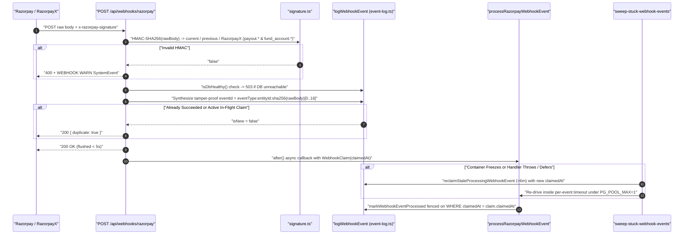

# Payment webhooks (inbound)

**What this covers:** the **inbound** gateway webhooks (Razorpay & RazorpayX → Familiarise) that mutate money state — captures, checkout failures, refunds, payouts, reverse penny drop validations, and disputes — from signature verification through CAS-fenced execution to ledger postings and recovery sweeps. Outbound enterprise webhooks (Familiarise → tenant HRIS/ERP) are documented separately in [outbound webhooks](../40-compliance-and-data/04-outbound-webhooks.md).

---

## 1. Ingestion Pipeline, CAS Fencing & Freeze Recovery

Inbound Razorpay and RazorpayX webhooks arrive at `POST /api/webhooks/razorpay` (`app/api/webhooks/razorpay/route.ts`), verify authenticity against raw request bytes, check Postgres availability (`503` when unreachable so Razorpay backs off for up to 24h), record an idempotent claim on `WebhookEvent`, and return HTTP `200` well inside Razorpay's strict **5-second** timeout before running domain handlers via Next.js `after()`.

```mermaid
sequenceDiagram
    autonumber
    participant RZP as "Razorpay / RazorpayX"
    participant Route as "POST /api/webhooks/razorpay"
    participant Sig as "signature.ts"
    participant Log as "logWebhookEvent (event-log.ts)"
    participant Disp as "processRazorpayWebhookEvent"
    participant Sweep as "sweep-stuck-webhook-events"

    RZP->>Route: "POST raw body + x-razorpay-signature"
    Route->>Sig: "HMAC-SHA256(rawBody) -> current / previous / RazorpayX (payout.* & fund_account.*)"
    alt "Invalid HMAC"
        Sig-->>Route: "false"
        Route-->>RZP: "400 + WEBHOOK WARN SystemEvent"
    end
    Route->>Log: "isDbHealthy() check -> 503 if DB unreachable"
    Route->>Log: "Synthesize tamper-proof eventId = eventType:entityId:sha256(rawBody)[0..16]"
    alt "Already Succeeded or Active In-Flight Claim"
        Log-->>Route: "isNew = false"
        Route-->>RZP: "200 { duplicate: true }"
    end
    Route-->>RZP: "200 OK (flushed < 5s)"
    Route->>Disp: "after() async callback with WebhookClaim(claimedAt)"
    alt "Container Freezes or Handler Throws / Defers"
        Sweep->>Log: "reclaimStaleProcessingWebhookEvent (>6m) with new claimedAt"
        Sweep->>Disp: "Re-drive inside per-event timeout under PG_POOL_MAX=1"
    end
    Disp->>Log: "markWebhookEventProcessed fenced on WHERE claimedAt = claim.claimedAt"
```

### Multi-Secret Verification & Tamper-Proof `eventId` Synthesis

1. **Multi-Secret Isolation (`signature.ts`)**: `RAZORPAY_WEBHOOK_SECRET` (`current`) and optional rotation secret `RAZORPAY_WEBHOOK_SECRET_PREVIOUS` (`previous`) are checked first. If neither matches, `RAZORPAYX_WEBHOOK_SECRET` is tested **only** when `isPayoutEventName(rawBody)` confirms `event.startsWith("payout.") || event.startsWith("fund_account.")` — preventing payout credentials from ever forging customer payment events.
2. **Why `${eventType}:${entityId}:${sha256(rawBody).slice(0, 16)}` Is Mandatory**:
   - Raw `x-razorpay-event-id` headers are **unsigned** (`x-razorpay-signature` hashes body bytes only), allowing trivial header-mutation replay amplification.
   - Plain `${eventType}:${entityId}` without a payload hash drops legitimate subsequent updates on the same entity (e.g., consecutive `payout.updated` webhooks when `status_details` changes followed later by bank `utr` assignment on one `pout_...`, or multi-round `payment.dispute.action_required` / `pre_arbitration` updates on one `disp_...`).
   - Appending `sha256(rawBody).slice(0, 16)` keeps deduplication 100% bound to signature-authenticated bytes while collapsing exact delivery retries and letting genuine state progressions through.

---

## 2. Multi-Layer Idempotency & `PG_POOL_MAX=1` Concurrency Discipline

Serverless instances execute with **`PG_POOL_MAX=1`**. Every transaction inside webhook handlers passes the transaction client `tx` explicitly to every downstream helper, ledger posting (`postLedgerTxn`), and earnings CAS mutation — never calling the global `prisma` client inside `$transaction`.

Money state is defended across four independent gates:

1. **`WebhookEvent.eventId` (`@unique`) + `WebhookClaim` CAS Fencing**: Prevents concurrent duplicate execution and fences `markWebhookEventProcessed` on `where: { eventId, claimedAt: claim.claimedAt }` so an unfreezing Netlify container whose 5-minute claim expired cannot overwrite a sweeper worker's result.
2. **`Payment.gatewayPaymentId` (`@unique`) + Single-Writer Capture Rule**: `Payment.paymentStatus = SUCCEEDED` and `Payment.gatewayPaymentId = pay_...` are written exclusively by `handlePaymentSuccess` (invoked across webhook capture, `/api/checkout/verify-signature`, and `/api/checkout/verify?sync=true` via shared `routeCapturedPayment`). Subsequent `refund.*` and `payment.dispute.*` webhooks resolve `pay_... -> Payment` via indexed local lookup without blocking on external REST API calls.
3. **`Refund.cascadedAt` & In-Place Placeholder Adoption**: Outbound refunds reserve a `pending_<uuid>` row (`Refund.id`) passed in `metadata: { reservationId: Refund.id }`. When `refund.created` / `refund.processed` arrives first, `handleRefundCreated` adopts the `pending_<uuid>` row in place (`refundId = rfnd_...`), and `applyRefundCascade` atomically claims `cascadedAt: null -> now()` via CAS `updateMany`.
4. **`LedgerTransaction.idempotencyKey` (`@unique`)**: Enforces exact once-only journal postings (`booking:<paymentId>`, `refund:<refundId>`, `chargeback:<disputeId>`, `payout-reversal:<payoutId>`, `invoicepaid:<invoiceId>`).

---

## 3. Domain Lifecycle Rules & Distributed Edge Cases

| Domain                           | Events Consumed                                                                                                | Distributed Invariants Enforced                                                                                                                                                                                                                                                                                                                                                                                                                                                                                                                               |
| -------------------------------- | -------------------------------------------------------------------------------------------------------------- | ------------------------------------------------------------------------------------------------------------------------------------------------------------------------------------------------------------------------------------------------------------------------------------------------------------------------------------------------------------------------------------------------------------------------------------------------------------------------------------------------------------------------------------------------------------- |
| **Checkout Captures & Failures** | `payment.captured`, `order.paid`, `payment.failed`                                                             | `payment.captured` / `order.paid` routes by `notes.type` (`credit_purchase`, `invoice_payment`, `overage_member`, `recording_purchase`, or B2C booking). On `payment.failed`, `handlePaymentFailure` checks `paymentStatus === "SUCCEEDED"` inside its transaction to ignore late failures on already-paid orders; active checkout holds (`expiresAt > now()`) are **preserved** without overwriting customer-facing `Payment.description` and wallet/referral credits remain locked while the buyer retries inside Razorpay Checkout on the same `order_id`. |
| **Refunds**                      | `refund.created`, `refund.processed`, `refund.failed`, `refund.speed_changed`                                  | Adopts `pending_<uuid>` reservations in place via `notes.reservationId`; returns `DeferSignal` if `refund.*` overtakes `payment.captured` so `sweep-stuck-webhook-events` replays it cleanly once capture commits.                                                                                                                                                                                                                                                                                                                                            |
| **Disputes & Chargebacks**       | `payment.dispute.created`, `under_review`, `action_required`, `won`, `lost`, `closed`                          | `action_required` (including `pre_arbitration` escalations) transitions `UNDER_REVIEW -> NEEDS_RESPONSE` and refreshes `dueBy`. On `won` / `closed`, `HELD` earnings release **only** when `tx.dispute.count({ where: { paymentId, id: { not: dispute.id }, status: { notIn: ["WON", "LOST", "CHARGE_REFUNDED", "CLOSED", "WARNING_CLOSED"] } } }) === 0`. Out-of-order `created` (before payment exists) and `updated` (before dispute exists) return `DeferSignal`.                                                                                         |
| **RazorpayX Payouts**            | `payout.initiated`, `updated`, `processed`, `reversed`, `failed`, `rejected`, `queued`, `pending`, `cancelled` | Non-terminal webhooks keep consultant payouts at `PROCESSING`; terminal `COMPLETED` transitions exclude terminal statuses via CAS `WHERE`. `OrganizationPayout` falls back to `reference_id` when `gatewayPayoutId` is null. `markConsultantPayoutReversed` and `markOrgPayoutReversed` settle `COMPLETED -> REVERSED` (inverse journal + `PAID -> READY` earnings + TDS reversal) and pre-settlement `REVERSED` (`BATCHED -> READY` detach without inverse journal) inside **one atomic `$transaction(tx)`**.                                                |
| **Account Validation (RPD)**     | `fund_account.validation.completed`, `fund_account.validation.failed`                                          | Verifies `PayoutAccount` / `OrganizationPayoutAccount` via CAS `updateMany` when `status === "completed"` and `accountStatus === "valid"` (strictly matched on `fund_account.id`), and transitions `OrganizationPayoutAccount` (`PENDING_VERIFICATION -> FAILED_VERIFICATION`) on failed validations using `razorpayFundAccountId` or `id: referenceId` when `fund_account` is `null`.                                                                                                                                                                        |

---

## 4. State-as-Outbox Post-Capture Side Effects & Auto-Refunds

Post-capture external network side effects never block the Phase 1 Serializable ledger commit:

- **Stream Channel Provisioning (`Appointment.chatChannelEnsuredAt`)**: Written only after Stream channel creation succeeds post-commit; `reconcile-orphaned-confirmations` heals confirmed paid appointments where `chatChannelEnsuredAt IS NULL`.
- **Automatic Unfulfilled Capture Refunds (`Payment.description` Marker)**: Captures arriving on released holds, GiST overlap losers, cancelled bookings, or amount mismatches stamp `Auto-refund pending: <reason>. Booking NOT confirmed.` inside Phase 1 and drain idempotently via `retry-auto-refunds`.

---

## 5. Sweeping, Alerting & Multi-Table Retention

1. **`sweep-stuck-webhook-events` (`scripts/cleanup/sweep-stuck-webhook-events.ts`)**: Scans stale (`>6m`) unprocessed, failed, or deferred rows across `"razorpay"`, `"stream"`, and `"novu"` under `withCronLock("sweep-stuck-webhook-events", { failMode: "closed" })`, enforcing per-event timeouts (`Promise.race`), single-event batch Sentry alerts (`deferCount >= 5` or age `> 1h`), and a 7-day (`168h`) `gave up:` cap.
2. **`archive-webhook-events` (`scripts/cleanup/archive-webhook-events.ts`)**: Runs weekly (Sunday 00:00 UTC) to prune processed `WebhookEvent` rows (>30d), failed `WebhookEvent` rows (**90 days**), aged `EmailEvent` records (**90 days**), and terminal `OutboundWebhookDelivery` records (>30d).

---

## Deprecated & Superseded Approaches

- **Direct `Payment.paymentStatus = SUCCEEDED` Writes in `/api/checkout/verify-signature`**: Superseded by routing all confirmation paths through `routeCapturedPayment` -> `handlePaymentSuccess`, eliminating skipped appointments, missing earnings, and unposted ledger entries when client signature verification raced ahead of webhooks.
- **Unconditional Slot Destruction & Wallet Credit Restoration on `payment.failed`**: Superseded by preserving unexpired holds (`expiresAt > now()`) because Razorpay Checkout fires `payment.failed` on intermediate failed card/UPI attempts within one `order_id`.
- **Multi-Query Non-Atomic Payout Reversals & Unconditional `COMPLETED` Overwrites**: Superseded by single-transaction `markConsultantPayoutReversed(tx)` / `markOrgPayoutReversed(tx)` and CAS exclusion of `FAILED` rows during `payout.processed`.
