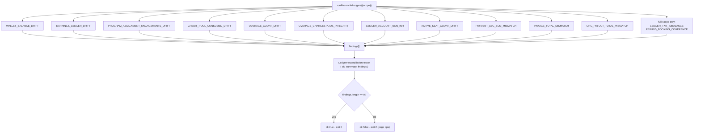
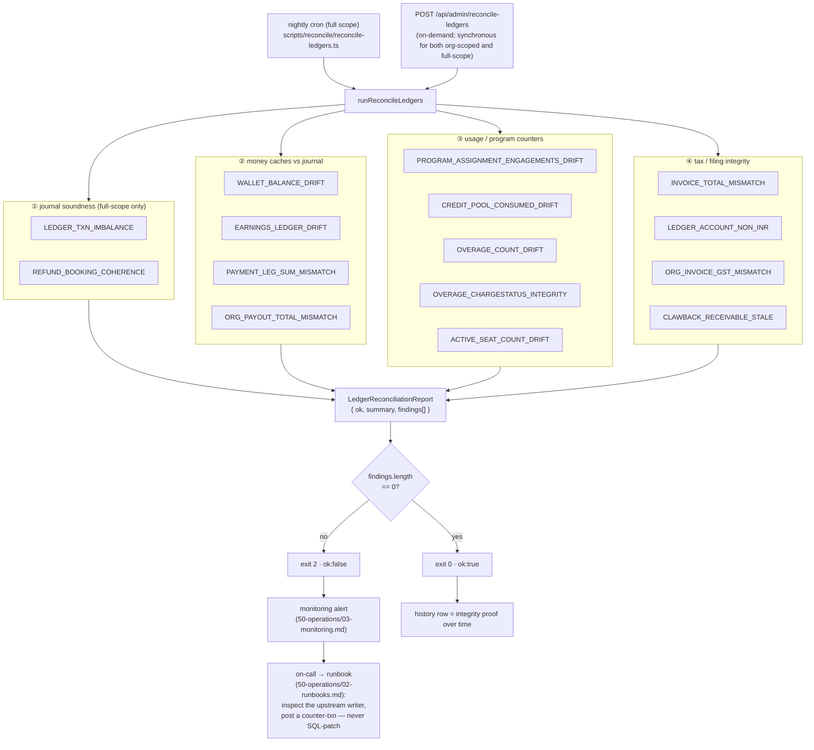

# Ledger integrity & reconciliation

**What this covers:** the auditor that proves the money model holds — the invariants it checks, the one informational coverage metric, how it runs (nightly cron + on-demand admin route), what a finding means, and the single protective action a wallet-cache drift now triggers. This is the safety net that lets us trust derived balances and reconciled caches.

> **Why this exists.** The journal is the source of truth, but a few numbers are **cached** for the hot path (`walletBalance`) or **denormalized** for query speed (`engagementsUsed`, `activeSeatCount`, the `Earnings` amount columns). A cache is only safe if something independently re-derives it and screams on drift. That something is `scripts/reconcile/reconcile-ledgers.ts` — it never hand-patches an audited table, writing only `LedgerReconciliationReport`. Its one protective side effect is that a `WALLET_BALANCE_DRIFT` finding makes the reconciler **freeze that wallet's spend and page P0** (see the design notes below); it still never SQL-patches the drifted cache itself.

---

## 1. The checks

The auditor verifies **thirteen** core `Finding` kinds via single-pass, set-based PostgreSQL aggregations (`$queryRaw` / `groupBy`). Two run **full-scope only** (the global journal sweeps — `LEDGER_TXN_IMBALANCE` and `REFUND_BOOKING_COHERENCE`); the rest accept an `organizationId` filter for incident triage.

| Finding `kind`                         | Scope                                                                           | Asserts                                                                                                                                                              | Drift means                                                                                                                                                                                                        |
| -------------------------------------- | ------------------------------------------------------------------------------- | -------------------------------------------------------------------------------------------------------------------------------------------------------------------- | ------------------------------------------------------------------------------------------------------------------------------------------------------------------------------------------------------------------ |
| `WALLET_BALANCE_DRIFT`                 | per `BillingAccount`                                                            | `-balance(WALLET, org) == walletBalance` (WALLET is credit-normal, so owed = Σcredit−Σdebit)                                                                         | the cache diverged from the journal — a writer skipped the journal or a manual SQL edit slipped in                                                                                                                 |
| `EARNINGS_LEDGER_DRIFT`                | per payment **with** a `BOOKING` txn                                            | cached `ConsultantEarnings(platformFee+consultantShare) + OrganizationEarnings(orgShare)` == journal `PLATFORM_FEE+CONSULTANT_PAYABLE+ORG_PAYABLE` credits           | the earnings cache disagrees with the booking journal                                                                                                                                                              |
| `PROGRAM_ASSIGNMENT_ENGAGEMENTS_DRIFT` | per **active** `ProgramAssignment` (`periodEnd >= now`)                         | `sum(UsageLedgerEntry.engagementsConsumed) == engagementsUsed`                                                                                                       | a partial-rollback bug, a missing ledger write, or manual SQL desynced the denormalized counter                                                                                                                    |
| `CREDIT_POOL_CONSUMED_DRIFT`           | per **active** CREDIT_POOL `ProgramAssignment`                                  | `sum(UsageLedgerEntry.priceAtBookingPaise) == consumedPaise` (refund rows post negative, so the sum nets)                                                            | the CREDIT_POOL money-meter write in `recordBookingUtilization`/`reverseBookingUtilization` desynced                                                                                                               |
| `OVERAGE_COUNT_DRIFT`                  | per **active** `ProgramAssignment`                                              | `count(OverageEvent where chargeStatus ∉ {REVERSED,BLOCKED}) == overageCount`                                                                                        | the over-cap counter bump/decrement missed; a charged-then-refunded overage awaiting a credit note is the expected benign cause                                                                                    |
| `OVERAGE_CHARGESTATUS_INTEGRITY`       | per `OverageEvent` (link/state)                                                 | CHARGE_MEMBER pending/failed/charged ⇒ has a side-`Payment`; CHARGE_ORG accrued/charged ⇒ has an `InvoiceLineItem`; any `CHARGED` ⇒ `settledAt` set                  | the `transitionOverage` state machine was bypassed or a write half-completed                                                                                                                                       |
| `LEDGER_ACCOUNT_NON_INR`               | per `LedgerAccount`                                                             | `currency == INR` for every account                                                                                                                                  | a posting keyed an INR-paise amount by a display currency — would break receivable/payable clearing                                                                                                                |
| `ACTIVE_SEAT_COUNT_DRIFT`              | per `BillingSubscription`                                                       | `activeSeatCount == count(in-period LICENSED_SEAT ACTIVE assignments)`                                                                                               | the per-seat invoice line-item counter missed a write (or reflects historical drift before its writer existed)                                                                                                     |
| `PAYMENT_LEG_SUM_MISMATCH`             | per `Payment` with org legs                                                     | `sum(non-reversal, non-REFERRAL_CREDIT PaymentLeg.amountPaise) == Payment.amount` (LICENSE legs are 0; the referral credit is already netted out of `amount`)        | a leg writer (checkout / wallet / referral / overage) emitted the wrong amount                                                                                                                                     |
| `INVOICE_TOTAL_MISMATCH`               | per `OrganizationInvoice`                                                       | `totalPaise == subtotalPaise + CGST + SGST + IGST`                                                                                                                   | a mis-totaled GST invoice (filing defect); the issue-time assert in `invoice-rollup.ts` blocks new ones, this sweeps legacy/manual rows                                                                            |
| `ORG_PAYOUT_TOTAL_MISMATCH`            | per `OrganizationPayout` in `PENDING` / `APPROVED` / `PROCESSING` / `COMPLETED` | `sum(orgShare − refunded) of batched earnings == netPayoutPaise`                                                                                                     | the batch claim updated earnings but the payout total diverged. Terminal-with-release statuses (`FAILED`, `REVERSED`, `CANCELLED`) are skipped because they detach their earnings back to `READY` by design        |
| `LEDGER_TXN_IMBALANCE`                 | per `LedgerTransaction` (**full scope only**)                                   | `Σdebit == Σcredit`                                                                                                                                                  | a manual SQL edit or a future writer bug broke a posting                                                                                                                                                           |
| `REFUND_BOOKING_COHERENCE`             | per `BookingUtilization` (**full scope only**)                                  | fully-refunded payment ⇒ utilization reversed; reversed utilization ⇒ a `SUCCEEDED` refund backs it                                                                  | a cap leak (money back but the seat still consumed) or a seat released for free                                                                                                                                    |
| `LEDGER_DUAL_WRITE_GAP`                | per `OrganizationPayout` with `clawbackAmountPaise > 0`                         | a `clawback:*` `LedgerTransaction` exists against that payout                                                                                                        | the payout claims recovered cash the journal never saw                                                                                                                                                             |
| `ORG_INVOICE_GST_MISMATCH`             | per issued `OrganizationInvoice`, one finding per invoice                       | output tax less credit notes == net `GST_PAYABLE` behind it: the billed bookings' journals (a paisa per booking), else its `invoice-issued:` and refund journals     | one side taxed something the other did not, or a subscription or manual invoice issued without its `invoice-issued:` journal                                                                                       |
| `CLAWBACK_RECEIVABLE_STALE`            | one finding per run, listing every payee                                        | no clawback receivable is older than 90 days | the payee has had no payout large enough to net the clawback, so ops must recover it another way |

**Grouped by what each check protects:**

The grouping is conceptual, not a code boundary (all checks run in one pass); it's how to _triage_: an ① finding means the journal itself is wrong (rare, high-severity — a manual SQL edit or a writer that bypassed `postLedgerTxn`); ②–④ mean a _cache_ drifted from a sound journal (fix the writer, re-derive the cache via a counter-transaction).

Each `Finding` is a compact row: `{ kind, organizationId?, billingAccountId?, billingSubscriptionId?, invoiceId?, paymentId?, payoutId?, programAssignmentId?, expectedPaise, actualPaise, deltaPaise, details? }`. For the count-based checks (`…ENGAGEMENTS_DRIFT`, `…SEAT_COUNT_DRIFT`, `OVERAGE_COUNT_DRIFT`) and the link/state ones the `*Paise` fields hold **counts / events**, not paise — `details.unit` records the real unit.

---

## 2. The coverage metric (informational, not a finding)

`summary.earningsPaymentsWithoutBookingTxn` counts earnings-bearing payments that have **no** `BOOKING` journal transaction yet. It is reported for visibility but does **not** fail the run, because `EARNINGS_LEDGER_DRIFT` only checks payments that _do_ have a booking txn.

A related but stricter check, the `EARNINGS_WITHOUT_BOOKING_TXN` finding, does fail the run: it flags an earnings-bearing payment missing its `BOOKING` journal transaction. An earnings row and its journal always commit in one transaction, and the check reads earnings before journal transactions, so it needs no grace window.

---

## 3. How it runs

- **Library:** `runReconcileLedgers({ scope, organizationId?, triggeredById? })` → `ReconcileReport`. Scope is `"full"` or `"org:<id>"`; passing `organizationId` limits every per-row check to one org and **skips the two global journal sweeps** (`LEDGER_TXN_IMBALANCE` and `REFUND_BOOKING_COHERENCE`), which run full-scope only.
- **Nightly cron:** `scripts/reconcile/reconcile-ledgers.ts` calls `runReconcileLedgers({ scope: "full" })`, persists a `LedgerReconciliationReport`, freezes any wallet with `WALLET_BALANCE_DRIFT`, and exits **0** (clean), **2** (discrepancies — page ops), or **1** (fatal error). Scheduled via `.github/workflows/cron-daily.yml`.
- **On-demand HTTP & Admin routes:** `POST /api/admin/reconcile-ledgers` and `POST /api/cleanup/reconcile-ledgers` invoke `runReconcileLedgers` synchronously in-process. Because all checks are set-based SQL aggregations (`$queryRaw` / `groupBy`), a full-scope run completes in ~1–2 seconds without chunking or background workers.
- **Report storage:** every run writes a `LedgerReconciliationReport { scope, ok, durationMs, summary, findings, triggeredById }`. The history is the audit trail of integrity over time.

---

## 4. When a finding fires

A finding is an **incident signal, never a thing to hand-patch.** The drift is a symptom; the fix is upstream (the writer that diverged), and the correction — if money is involved — is a **counter-transaction**, not a SQL `UPDATE` on a balance. See [runbooks](../50-operations/02-runbooks.md) for the per-finding triage procedure (which writer to inspect, how to post a correcting entry, when to page).

---

## 5. Design decisions & trade-offs

- **Never hand-patches a cache — but fails closed on wallet drift.** The reconciler writes _only_ `LedgerReconciliationReport` and never touches an audited table. When a `WALLET_BALANCE_DRIFT` finding shows a wallet's cached balance no longer matches its journal, `scripts/reconcile/reconcile-ledgers.ts` calls `freezeWalletSpend` for that `BillingAccount` and pages P0. The freeze rides the append-only `SystemEvent` log (a `WALLET_FREEZE` / `WALLET_UNFREEZE` pair keyed on `correlationId`), fails closed so an unreadable log blocks the spend rather than leaking it, and gates only discretionary checkout spend — never a top-up credit.
- **Counts and events reuse the `*Paise` fields.** Rather than a separate schema per check kind, count-based findings (`…ENGAGEMENTS_DRIFT`, `…SEAT_COUNT_DRIFT`, `OVERAGE_COUNT_DRIFT`) and link/state findings stuff counts into `expectedPaise`/`actualPaise`/`deltaPaise` and record the real unit in `details.unit`.
- **The known-drift baseline (`lib/payments/ledger/baseline.ts`).** Baselined findings still land in the persisted `LedgerReconciliationReport` and are counted in `baselinedDiscrepanciesCount`, while only `activeDiscrepanciesCount` decides the exit code. Entries are keyed to a specific entity id (never a finding kind), carry a mandatory expiry date, and `LEDGER_TXN_IMBALANCE` may never be baselined.

### Related docs

- [Money model overview](01-money-model-overview.md) §4 — the reconciled-cache contract.
- [Ledger & postings](03-ledger-and-postings.md) — the postings these checks re-sum.
- [Payment legs](09-payment-legs.md) — the leg-sum invariant (`PAYMENT_LEG_SUM_MISMATCH`).
- [Runbooks](../50-operations/02-runbooks.md) — per-finding incident response.
- [Monitoring](../50-operations/03-monitoring.md) — alerting on report `ok:false`.
- Ground truth: `scripts/reconcile/reconcile-ledgers.ts`, `LedgerReconciliationReport` in `prisma/schema.prisma`.

---

## Deprecated & Superseded Approaches

> [!WARNING]
> **Do NOT re-introduce these patterns.** They were superseded by fast set-based PostgreSQL aggregation in `scripts/reconcile/reconcile-ledgers.ts`.

1. **Chunked Cursor State Machine (`advanceReconcileRun` / `ReconcileCursorState`)**: Previously, `reconcile-ledgers.ts` walked 5 tables row-by-row in TypeScript (139 serialised DB round trips taking 22–27 seconds), persisting a keyset cursor (`summary.progress`) on `LedgerReconciliationReport` with a 12-second soft chunk deadline (`RECONCILE_CHUNK_BUDGET_MS`). Rewriting those checks as set-based SQL `GROUP BY` / `HAVING` queries reduced full-scope execution to ~1–2 seconds in a single pass, making the multi-step cursor engine obsolete.
2. **Netlify Background Function Driver (`netlify/functions/reconcile-ledgers-background`)**: Previously, `POST /api/admin/reconcile-ledgers` kicked a Netlify Background Function that looped `POST /api/cleanup/reconcile-ledgers?runId=...` up to 400 times. Because full-scope runs now finish well within a standard HTTP request budget, `POST /api/admin/reconcile-ledgers` runs `runReconcileLedgers` synchronously in-process and the background function was removed.
3. **Duplicate `jobs/reconcile/reconcile-ledgers.ts` Wrapper**: Previously, a separate wrapper file in `jobs/reconcile/` called `scripts/reconcile/reconcile-ledgers.ts`. All scheduled and HTTP invocations now call `scripts/reconcile/reconcile-ledgers.ts` directly.

