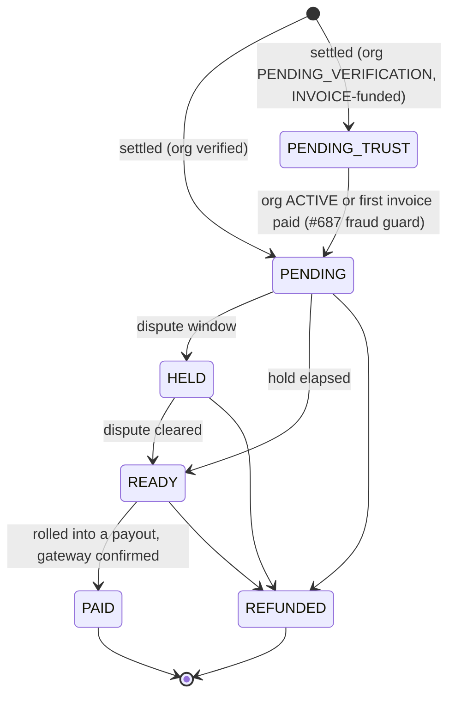
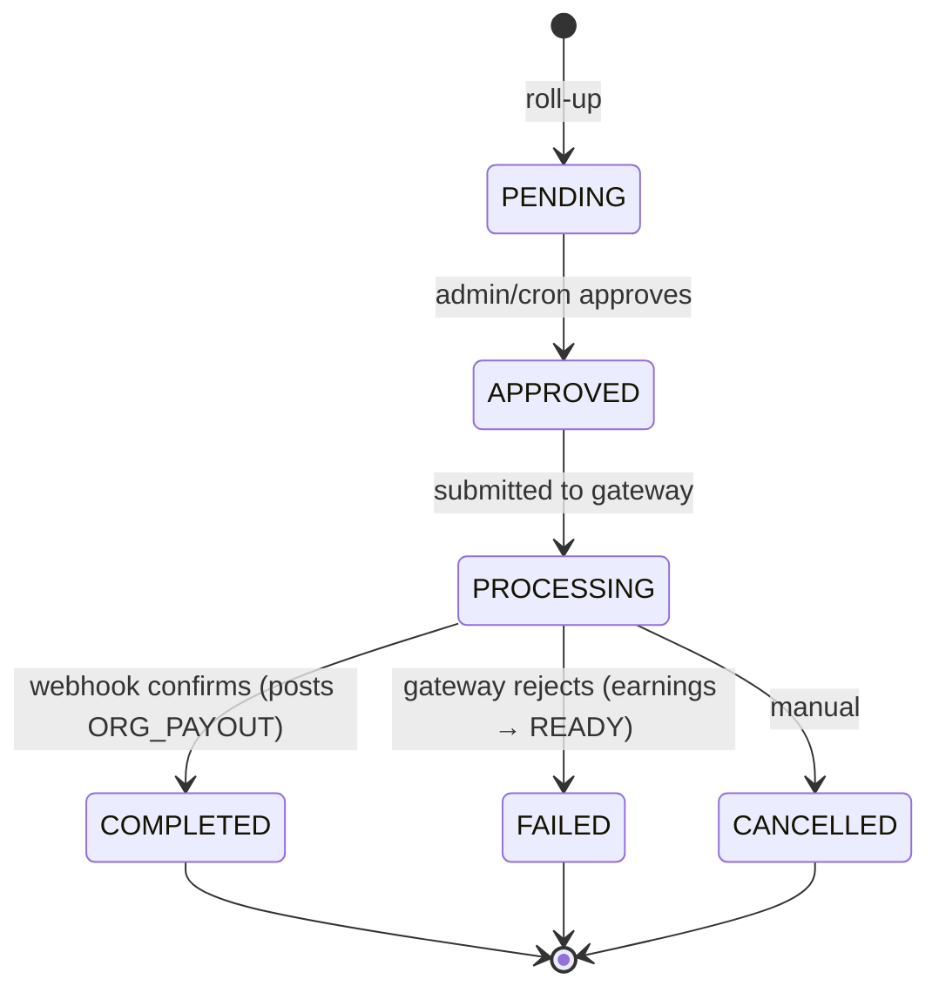
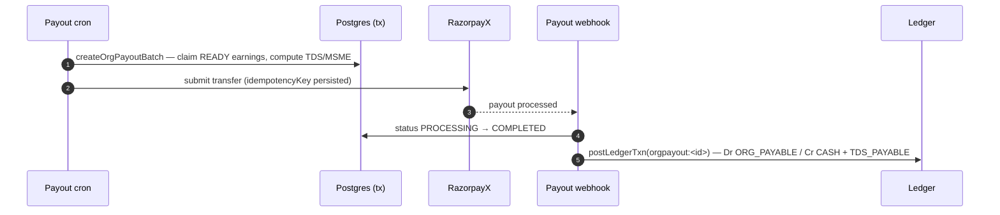

# Payout pipeline (host-side)

**What this covers:** how host-org earnings roll up into an `OrganizationPayout`, the `ORG_PAYOUT` ledger posting that settles the payable, and the India statutory fields (TDS / MSME / FEMA) the payout carries. The consultant-side payout (`PAYOUT`) is the mirror; the split that creates earnings is in [booking → earnings](10-booking-to-earnings.md).

> When a booking settles for a `canHost` org (or an EXPERT membership with `payoutRecipient = ORGANIZATION`), an `OrganizationEarnings` row accrues. A weekly/monthly/quarterly cron rolls `READY` earnings into one `OrganizationPayout`; when the gateway confirms, an `ORG_PAYOUT` transaction draws the org's `ORG_PAYABLE` down to match the cash that left.

---

## 1. `OrganizationEarnings` → `OrganizationPayout`

`OrganizationEarnings` is append-only (refunds **decrement** `refundedAmountPaise`, never delete) and carries the bps snapshot ([booking → earnings §4](10-booking-to-earnings.md)). Each row moves through `EarningStatus`:



`PENDING_TRUST` is the invoice-fraud guard (#687): earnings accrued for a still-unverified INVOICE-funded org are parked until the org goes `ACTIVE` or pays its first invoice — so an unverified org can't accrue real consultant earnings and ghost. `holdUntil` (≈ `completedAt + 3d`) gates `PENDING → READY` to cover dispute windows.

**Roll-up** (`POST /api/organizations/[orgId]/payouts`, OWNER only):
1. Select `READY` earnings for the org with `orgPayoutId IS NULL` in `[periodStart, periodEnd]`.
2. Sum `orgSharePaise − refundedAmountPaise`.
3. Create `OrganizationPayout(status = PENDING)`.
4. Stamp each earnings row with `orgPayoutId`.
5. Emit `OrgAuditLog(PAYOUT, PAYOUT_INITIATED)`.

A weekly cron does the same in batch (`createOrgPayoutBatch`, `lib/payments/payouts/org-payout-service.ts`); live submission to RazorpayX is gated by `ENABLE_LIVE_PAYOUTS` with idempotency-key persistence.

---

## 2. `PayoutStatus` + the `ORG_PAYOUT` posting



On `PROCESSING → COMPLETED` the service posts the settlement (`orgpayout:<payoutId>`, kind `ORG_PAYOUT`):

```
Dr ORG_PAYABLE(org)   net + TDS         (clear what we owed the org)
   Cr CASH(platform)  net paid
   Cr TDS_PAYABLE     TDS withheld      (only if > 0)
```



The **consultant** payout is the mirror — `payout:<payoutId>`, kind `PAYOUT`: `Dr CONSULTANT_PAYABLE / Cr CASH + TDS_PAYABLE` (`lib/payments/payouts/payout-service.ts`). On `FAILED`/`CANCELLED`, earnings are unlinked (`orgPayoutId = null`, back to `READY`) and provisional TDS records deleted. The reconciler asserts `sum(orgShare − refunded) == netPayoutPaise` (`ORG_PAYOUT_TOTAL_MISMATCH`, [ledger integrity](14-ledger-integrity.md)).

> 🔒 **`ENABLE_LIVE_PAYOUTS` is still off.** The whole pipeline runs — batching, TDS/MSME, the status machine, the ledger posting — but **gateway submission is held**, so payouts sit at `PROCESSING` (surfaced in the UI as "pending platform enablement", never as a failure). The `ORG_PAYOUT`/`PAYOUT` ledger leg posts only on the real `PROCESSING → COMPLETED` webhook, so no cash-leaving entry exists until go-live. See [feature flags](25-feature-flags-and-rollout.md) and the [live-payout go-live runbook](45-live-payout-go-live-runbook.md).

---

## 3. India statutory fields on `OrganizationPayout`

The model carries every column the Indian payout needs; TDS + MSME deadline are populated live, FEMA (15CA/CB, FIRC) is manual until the first non-resident host org ships.

```prisma
tdsSectionApplied String?   // "194J" | "194O" | "194C"
tdsAmountPaise    Int?
mustPayByDate     DateTime? // MSME 15/45-day rule
paRouteProvider   String?   // "RAZORPAYX" | "CASHFREE_PAYOUTS"
paReferenceId     String?
form15caPartCRef  String?
form15cbRef       String?
dtaaRateApplied   Decimal?
rbiPurposeCode    String?   // P0802 | P0807
fxRateUsed        Decimal?
firceRef          String?
```

- **TDS** — `computeTdsForPayout` (`lib/compliance/tds.ts`). Default section **194-O** for ECO payouts (Familiarise is the e-commerce operator); `ConsultantProfile.tdsSection` overrides to 194J/194C; a Section 197 cert applies `tdsLowerRateCert` + rate; PAN fallback withholds punitively (**194-O carries its own 5% no-PAN rate** — *not* the 20% of Section 206AA, which applies to 194J/194C). DTAA rates apply to non-residents only when strictly lower than the section default. `createOrgPayoutBatch` deducts TDS before dispatch; the `ORG_PAYOUT` posting's `Cr TDS_PAYABLE` records the withheld amount. Form 26Q/27Q export is backlog, and the refund-driven `TdsAdjustment` reversal is **schema-only — not yet written by any code** (#778 §E/§F; see [invoicing §8](12-invoicing.md)). **For the current rate, defer to [`../compliance/01-tds-overview.md`](../compliance/01-tds-overview.md)** — the compliance docs are authoritative on rates.
  > 🟡 **Income-tax Act 2025 (effective 1-Apr-2026).** The code and `tdsSectionApplied` still store the **1961-Act** section labels (`194J`/`194O`/`194C`). Under the new Income-tax Act, 2025 the TDS sections (192–194T) are consolidated — non-salary TDS folds into **Section 393** (salary into 392) and quarterly returns/challans now key off numeric payment codes rather than the old `194x` numbers, which trigger validation errors on filings for payments on/after 1-Apr-2026. The withholding math is unchanged; only the section *citation* used at filing time is renumbered. Treat every `194x` label in this band as "needs a 2025-Act mapping before the next 26Q/27Q export" — tracked in the compliance band, not yet reflected in `tds.ts`.
- **MSME 15/45-day** — `computeMsmePaymentDeadline` (`lib/compliance/msme.ts`) from `OrganizationMsmeInfo`: MICRO + written agreement → 45d; MICRO/SMALL no agreement → 15d; MEDIUM/NONE → `contract.paymentTermsDays`. Daily overdue sweep: `jobs/compliance/msme-payment-alerts.ts`.
- **Cross-border (FEMA)** — for `NON_RESIDENT` experts: `form15caPartCRef`/`form15cbRef` (CA tax clearance), `rbiPurposeCode` (P0802 computing / P0807 consultancy), `dtaaRateApplied`, `fxRateUsed` + `firceRef`.

---

## 4. `OrganizationPayoutAccount`

`PUT /api/organizations/[orgId]/payout-account` (OWNER) creates/replaces the row. `accountNumberEncrypted` is AES-GCM at rest; only `accountNumberLast4` is plain for display. Holds `stripeConnectId` / `razorpayContactId` / `razorpayFundAccountId`. Payout processing refuses any account not `VERIFIED` (`OrgPayoutAccountStatus`).

## 5. Payment attribution

`Payment.organizationId` is the **sponsoring** org; the **hosting** org is reached via `OrganizationEarnings.paymentId`. They coincide when a HYBRID org sponsors its own expert; independent otherwise. Post-A3, one payment can carry multiple `OrganizationEarnings` (one per collaborator HOST org) — see [booking → earnings §4](10-booking-to-earnings.md).

---

### Related docs
- [Booking → earnings](10-booking-to-earnings.md) — the rate-card bps snapshot that feeds the earnings row.
- [Ledger & postings](08-ledger-and-postings.md) — the `ORG_PAYOUT` / `PAYOUT` transactions.
- [Ledger integrity](14-ledger-integrity.md) — `ORG_PAYOUT_TOTAL_MISMATCH`.
- [Expert lifecycle](22-expert-lifecycle.md) — how `payoutRecipient` decides whether an earnings row exists.
- [Compliance map](30-compliance-dpdp-gst-tds-msme.md) → [`../compliance/`](../compliance/00-overview.md) — authoritative TDS/MSME/FEMA rules.
