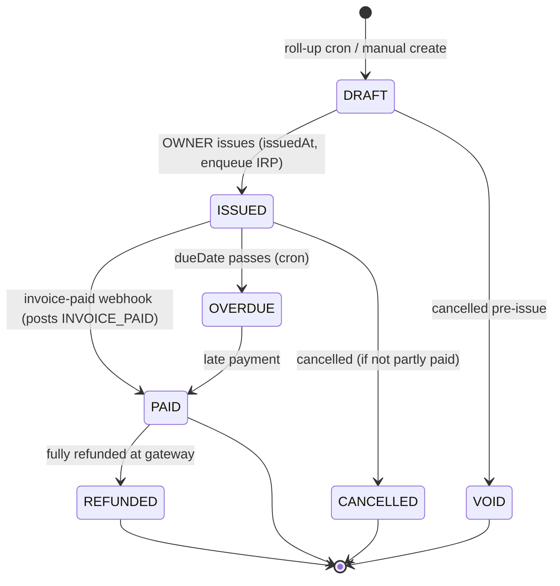
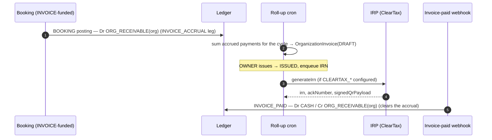

# Invoicing

**What this covers:** the India-compliant `OrganizationInvoice` — its lifecycle, GST breakdown, IRN/e-invoice fields, CGST Rule 46 numbering, the PO 3-way match, and how invoice payment clears the `ORG_RECEIVABLE` accrued at booking time. Funding mechanics are in [payment legs](13-payment-legs.md); the postings are in [ledger & postings](08-ledger-and-postings.md).

> An INVOICE-funded org doesn't pay cash at booking — each booking debits `ORG_RECEIVABLE(org)` (the `INVOICE_ACCRUAL` leg). A monthly roll-up turns those accruals into an `OrganizationInvoice`; when the org pays, the `INVOICE_PAID` posting clears the receivable.

---

## 1. Lifecycle



`OrgInvoiceStatus` = `DRAFT | ISSUED | PAID | OVERDUE | VOID | CANCELLED | REFUNDED`. `REFUNDED` is distinct from `VOID`: `VOID` is pre-payment (cancelled before settlement), `REFUNDED` is post-payment. `PATCH …/invoices/[invoiceId]` (OWNER) gates transitions against an allow-list.



On `ISSUED → PAID` the invoice-paid webhook (`app/api/webhooks/utils.ts`) posts `invoicepaid:<invoiceId>` (kind `INVOICE_PAID`): `Dr CASH / Cr ORG_RECEIVABLE(org)` for the invoice total, in the same transaction that flips the status. Note **issuance posts no money leg** — the receivable was accrued at booking; issuance just rolls accrued bookings into the invoice and records an audit row ([ledger & postings §3](08-ledger-and-postings.md)).

---

## 2. Schema highlights

```prisma
model OrganizationInvoice {
  id               String @id @default(uuid())
  billingAccountId String
  organizationId   String
  purchaseOrderId  String?
  contractId       String?     // SetNull — invoice stays audit-readable if contract dies

  invoiceNumber String @unique          // <PREFIX>-<FY>-<SEQ>, CGST Rule 46
  status        OrgInvoiceStatus @default(DRAFT)

  // Money (integer paise)
  displayCurrency    Currency
  fxRateUsed         Decimal?
  inrEquivalentPaise Int            // always captured for GST filings
  subtotalPaise      Int
  igstPaise          Int @default(0)
  cgstPaise          Int @default(0)
  sgstPaise          Int @default(0)
  totalPaise         Int
  taxRate            Decimal?

  lineItems InvoiceLineItem[]       // typed rows (was Json `items`)

  // GST
  hsnCode       String  @default("999293")
  placeOfSupply String? @db.VarChar(2)
  reverseCharge Boolean @default(false)
  lutNumber     String?              // zero-rated exports
  gstin         String?  @db.VarChar(15)

  // E-invoice (IRN)
  irn             String? @db.VarChar(64)
  ackNumber       String?
  ackDate         DateTime?
  signedQrPayload String? @db.Text
  irpStatus       IrpStatus @default(PENDING)
  irpUploadedAt   DateTime?

  // Lifecycle
  billingCycleStart DateTime?
  billingCycleEnd   DateTime?
  autoGenerated     Boolean @default(false)
  issuedAt          DateTime?
  dueDate           DateTime
  paidAt            DateTime?
  pdfUrl            String?

  paymentId      String? @unique   // one-off invoices
  billedPayments Payment[]         // monthly roll-up: captured payments
}
```

> **Line items are typed now.** #772-era schema work replaced the old `items Json` blob with a relational `InvoiceLineItem[]` (one row per line: description, quantity, unit price paise, HSN, optional `paymentId`). Reads are still render/audit-time, but the typed table removes the JSON-shape drift risk and lets the PDF route + GST export query line-level data.

---

## 3. GST breakdown (CGST / SGST / IGST)

| Condition | Tax columns |
|---|---|
| Intra-state (same state) | `cgstPaise` + `sgstPaise` (usually 9% + 9%) |
| Inter-state | `igstPaise` (usually 18%) |
| Export (zero-rated) | all tax = 0; `lutNumber` set |
| Reverse charge | `reverseCharge = true`; buyer self-accounts |

`placeOfSupply` is the buyer's 2-char GST state code (e.g. `"27"` Maharashtra). `deriveGstBreakdown` (`lib/compliance/gst.ts`) populates the columns. Authoritative rules: [`../compliance/02-gst-overview.md`](../compliance/02-gst-overview.md). The booking's `GST_PAYABLE` credit ([ledger & postings §4.2](08-ledger-and-postings.md)) is the platform-side liability; the invoice records the customer-facing breakdown.

`hsnCode` default `999293` (commercial training & coaching); line items may override per-row.

---

## 4. IRN (e-invoice)

The model carries every field the IRP returns: `irn` (64-char), `ackNumber`, `ackDate`, `signedQrPayload`, `irpStatus` (`PENDING | GENERATED | CANCELLED | FAILED`), `irpUploadedAt`. `DRAFT → ISSUED` enqueues the daily IRP uploader (`.github/workflows/irp-uploader.yml`), which calls `generateIrn` (`lib/compliance/irp.ts`) for `PENDING` rows inside the CBIC window. Live but **env-gated**: with `CLEARTAX_API_KEY` / `CLEARTAX_GSP_TOKEN` / `CLEARTAX_GSTIN` set it makes real ClearTax calls; without them rows go `FAILED` after bounded retries (`irpRetryCount`, `irpLastError`). For sub-₹5cr orgs IRN is voluntary below the AATO threshold, so that's acceptable.

---

## 5. Invoice numbering — CGST Rule 46

`invoiceNumber` = `<PREFIX>-<FY>-<SEQ>`, e.g. `ACME-2026-0042`. `PREFIX` = `Organization.invoiceNumberPrefix` or the uppercased slug; `FY` = Indian fiscal year (Apr–Mar); `SEQ` = 4-digit monotonic per `(organizationId, fiscalYear)`, allocated atomically from `OrgInvoiceCounter` via `INSERT … ON CONFLICT … RETURNING`. `@@unique([organizationId, invoiceNumber])` is the backstop; the counter is the primary mechanism. Helper: `lib/payments/billing/invoice-numbering.ts`.

---

## 6. Purchase orders + 3-way match

`PurchaseOrder` (created via `POST …/purchase-orders`, OWNER) declares a budget; `requiresPO = true` on the org warns when an OWNER creates a contract without one. The classic AP control:

1. **PO** declares the commit (`totalAmountPaise`).
2. **Contract** ties the cycle + terms to the PO (`Contract.purchaseOrderId`).
3. **Invoice** points at the same PO and decrements `remainingAmountPaise`.

**Atomic compare-and-swap** guards the balance (`…/invoices/route.ts`):

```ts
const claim = await tx.purchaseOrder.updateMany({
  where: { id, organizationId: orgId, status: "ACTIVE",
           remainingAmountPaise: { gte: gst.totalPaise } },
  data:  { remainingAmountPaise: { decrement: gst.totalPaise } },
});
if (claim.count !== 1) throw { httpStatus: 409, code: "PO_BALANCE_EXCEEDED" };
```

The predicate is the lock: two POSTs racing for the last ₹1 can't both win (`claim.count = 1` for exactly one). When `remainingAmountPaise` hits zero the PO goes `CLOSED`. **Restoration:** the PATCH route runs the inverse increment when an invoice goes `VOID`/`CANCELLED` with a PO attached (only restores what was decremented, gated by the transition allow-list). UI copy for `PO_BALANCE_EXCEEDED` lives in `lib/labels/org-errors.ts`. Regression coverage: `__tests__/enterprise/po-balance-enforcement.test.ts`.

---

## 7. Refunds

A fully-refunded paid invoice goes `PAID → REFUNDED`. The booking-level refund posts a `REFUND` transaction that reverses the original legs proportionally — including the prorated `GST_PAYABLE` reversal — see [ledger & postings §4.7](08-ledger-and-postings.md). GST credit-note issuance for refunds is tracked in compliance ([`../compliance/05-refund-and-chargeback-tax-adjustments.md`](../compliance/05-refund-and-chargeback-tax-adjustments.md)).

## 8. Auto-generated vs hand-rolled

- `autoGenerated = true` — monthly roll-up cron; `billedPayments[]` lists captured payments.
- `autoGenerated = false` — OWNER-created via `POST …/invoices` for ad-hoc charges (setup fees, overage bundles).

---

### Related docs
- [Funding & programs](02-funding-and-programs.md) — the INVOICE funding source.
- [Payment legs](13-payment-legs.md) — how `INVOICE_ACCRUAL` legs roll up.
- [Ledger & postings](08-ledger-and-postings.md) — the `INVOICE_PAID` / `REFUND` transactions.
- [Compliance map](30-compliance-dpdp-gst-tds-msme.md) → [`../compliance/02-gst-overview.md`](../compliance/02-gst-overview.md) — authoritative GST / TCS / IRN rules.
