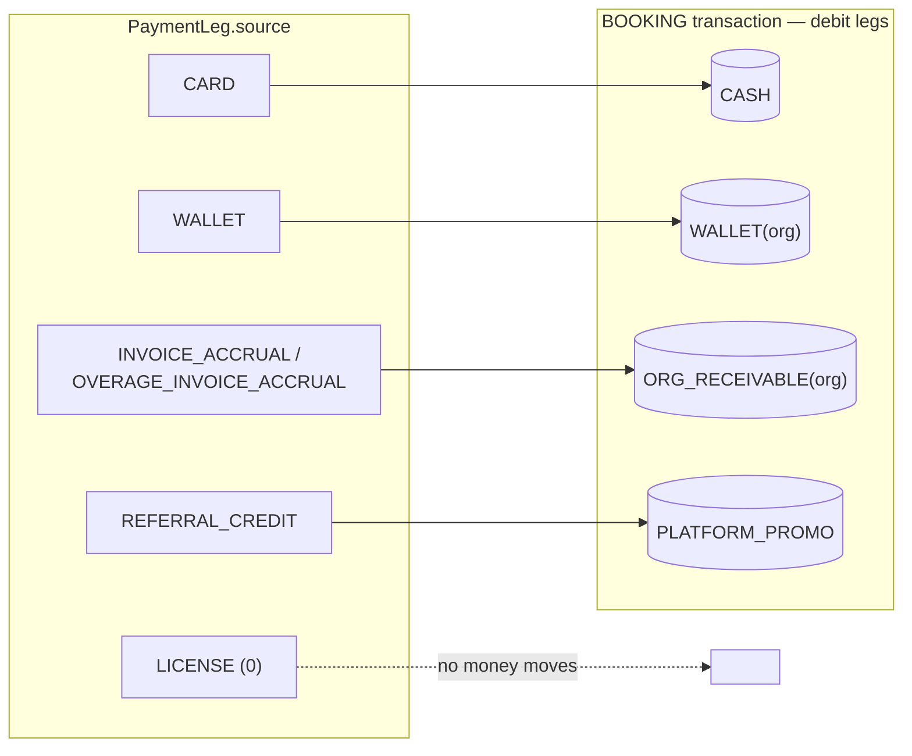

# Payment legs & stackable funding

**What this covers:** how one booking can be funded by several sources at once (`PaymentLeg`), and how each leg source maps to a **debit in the `BOOKING` ledger posting**. This is the funding side of [booking → earnings](10-booking-to-earnings.md).

> A single checkout can stack funding: a wallet covers most of the price, a referral credit chips in, the learner's card picks up the rest. `PaymentLeg` models it — one `Payment`, N legs whose amounts sum to `Payment.amount`. Those same legs become the **debit side** of the booking journal transaction.

---

## 1. Schema

```prisma
model PaymentLeg {
  id          String           @id @default(uuid())
  paymentId   String
  payment     Payment          @relation(fields: [paymentId], references: [id], onDelete: Cascade)
  source      PaymentLegSource
  amountPaise Int
  sourceRef   String?   // referral-credit id | gateway txn id | accrual ref
  createdAt   DateTime  @default(now())
  @@unique([paymentId, source])
  @@index([paymentId])
  @@index([source])
}

enum PaymentLegSource {
  CARD                      // external gateway charge
  WALLET                    // BillingAccount wallet debit
  REFERRAL_CREDIT           // platform-issued personal credit
  INVOICE_ACCRUAL           // rolled into an OrganizationInvoice at month-end
  OVERAGE_INVOICE_ACCRUAL   // program-overage portion, billed via invoice
  LICENSE                   // absorbed by a LICENSED_SEAT program (no money moves)
}
```

---

## 2. Each leg → the account it debits in the `BOOKING` posting



`earnings-service.ts` sums the legs by source and emits one debit per non-zero bucket; `LICENSE` legs (`amountPaise = 0`) post nothing. The credit side is the fee/payable/GST split ([§3 of booking → earnings](10-booking-to-earnings.md)).

| Source | Writer | Trigger | Booking debit |
|--------|--------|---------|---------------|
| `CARD` | checkout handler | learner paid via gateway; `amountPaise` = remainder after wallet + credits | `CASH` |
| `WALLET` | `walletDebit()` | sponsor org `fundingSource = WALLET`; leg written in the same tx as the cache decrement | `WALLET(org)` |
| `REFERRAL_CREDIT` | referral consumption helper | platform referral credits applied at checkout | `PLATFORM_PROMO` |
| `INVOICE_ACCRUAL` | checkout handler | sponsor org `fundingSource = INVOICE`; no cash at booking, sum-per-cycle becomes the invoice | `ORG_RECEIVABLE(org)` |
| `OVERAGE_INVOICE_ACCRUAL` | checkout handler | program-overage portion billed via invoice | `ORG_RECEIVABLE(org)` |
| `LICENSE` | checkout handler | active `LICENSED_SEAT` assignment absorbs the session; `amountPaise = 0` | — (no money) |

---

## 3. Invariants

1. **Sum identity.** `sum(PaymentLeg.amountPaise) === Payment.amount` (LICENSE is 0). Enforced at checkout; the reconciler's `PAYMENT_LEG_SUM_MISMATCH` is the retroactive detector ([ledger integrity](14-ledger-integrity.md)).
2. **Leg count ≥ 1.** A `SUCCEEDED` payment with zero legs is a data bug.
3. **Source uniqueness per payment.** `@@unique([paymentId, source])` — a duplicate-source leg fails on insert (`P2002`) rather than corrupting the sum. If split-billing across sub-orgs becomes real, drop this and add a `legGroupId` (tracked follow-up).
4. **`sourceRef` for reversal.** Populated for `REFERRAL_CREDIT` (→ `ReferralCredit.id`) and where a gateway/accrual ref exists. `WALLET` legs no longer reference a per-row wallet log (`WalletEntry` was removed in #772) — the authoritative wallet movement is the booking journal's `Dr WALLET(org)` leg; the cache decrement is `walletDebit()`. `LICENSE`/`CARD` may omit `sourceRef`.

---

## 4. Worked example: a stacked checkout

Learner price ₹5,000 (500,000 paise). INVOICE-funded org with a `LICENSED_SEAT` program covering CONSULT plans up to ₹3,000/session; the remainder is `CHARGE_MEMBER`. Learner has ₹500 of referral credits.

```
price:                500,000
  - licence absorbs:  300,000  → PaymentLeg(LICENSE,         amountPaise=0)
  - overage amount:   200,000
    - referral covers: 50,000  → PaymentLeg(REFERRAL_CREDIT, amountPaise=50000)
    - card covers:    150,000  → PaymentLeg(CARD,            amountPaise=150000)

sum (excl. LICENSE=0): 200,000  ==  Payment.amount: 200,000
```

The resulting booking posting debits `PLATFORM_PROMO` 50,000 + `CASH` 150,000 against the fee/payable/GST credits.

---

## 5. Refunds

Refunds are a `Refund` row (not an inverse leg) plus a `REFUND` journal transaction that reverses the booking legs proportionally ([ledger & postings §4.7](08-ledger-and-postings.md)):
- `WALLET` legs → the refund's `Cr WALLET(org)` returns spending power; the cache is credited via `walletCredit(reason=REFUND)`.
- `REFERRAL_CREDIT` legs → referral balance re-credited.
- `CARD` legs → gateway refund issued.
- `INVOICE_ACCRUAL` legs → credit line on the next invoice cycle.
- `LICENSE` legs → no money; `BookingUtilization.reversedAt` set and `engagementsUsed` decremented ([programs](21-programs.md)).

---

## 6. Why `PaymentLeg`, not N columns on `Payment`

Sources are unbounded (already 6, more coming); columns would mean wide, mostly-null rows + a migration per source. The leg table indexes the `(paymentId, source)` join settlement and analytics need, and `sourceRef` avoids a JOIN to the credit/referral table from every settlement query.

---

### Related docs
- [Funding & programs](02-funding-and-programs.md) — how each `FundingSource` maps to a leg source.
- [Booking → earnings](10-booking-to-earnings.md) — the credit side of the booking posting.
- [Wallet & top-ups](09-wallet-and-topups.md) — `WALLET` leg mechanics.
- [Invoicing](12-invoicing.md) — how `INVOICE_ACCRUAL` legs roll up.
- [Ledger & postings](08-ledger-and-postings.md) — the full booking/refund transactions.
