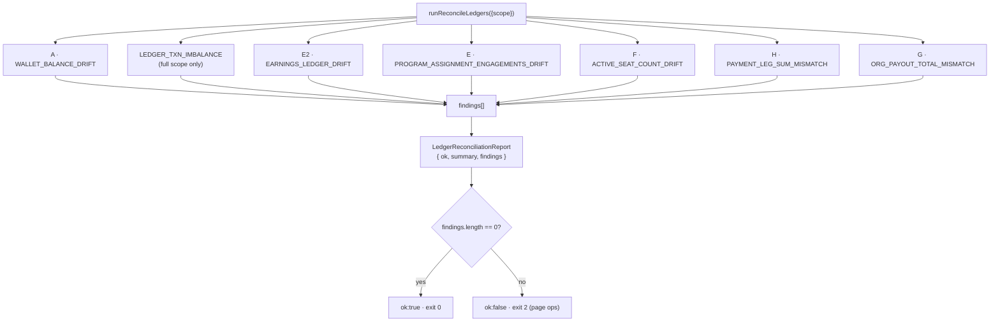

# Ledger integrity & reconciliation

**What this covers:** the read-only auditor that proves the money model holds — the seven invariants it checks, the one informational coverage metric, how it runs (nightly cron + on-demand admin route), and what a finding means. This is the safety net that lets us trust derived balances and reconciled caches.

> **Why this exists.** The journal is the source of truth, but a few numbers are **cached** for the hot path (`walletBalance`) or **denormalized** for query speed (`engagementsUsed`, `activeSeatCount`, the `Earnings` amount columns). A cache is only safe if something independently re-derives it and screams on drift. That something is `scripts/reconcile/reconcile-ledgers.ts` — **read-only**; it never writes to an audited table, only to `LedgerReconciliationReport`.

---

## 1. The seven checks

| Finding `kind` | Scope | Asserts | Drift means |
| --- | --- | --- | --- |
| `WALLET_BALANCE_DRIFT` | per `BillingAccount` | `-balance(WALLET, org) == walletBalance` (WALLET is credit-normal, so owed = Σcredit−Σdebit) | the cache diverged from the journal — a writer skipped the journal or a manual SQL edit slipped in |
| `LEDGER_TXN_IMBALANCE` | per `LedgerTransaction` (full scope only) | `Σdebit == Σcredit` | a manual SQL edit or a future writer bug broke a posting; **zero of these across a reseed is the gate** that justified removing the three legacy logs |
| `EARNINGS_LEDGER_DRIFT` | per payment **with** a `BOOKING` txn | cached `ConsultantEarnings(platformFee+consultantShare) + OrganizationEarnings(orgShare)` == journal `PLATFORM_FEE+CONSULTANT_PAYABLE+ORG_PAYABLE` credits | the earnings cache disagrees with the booking journal |
| `PROGRAM_ASSIGNMENT_ENGAGEMENTS_DRIFT` | per **active** `ProgramAssignment` (`periodEnd >= now`) | `sum(UsageLedgerEntry.engagementsConsumed) == engagementsUsed` | a partial-rollback bug, a missing ledger write, or manual SQL desynced the denormalized counter |
| `ACTIVE_SEAT_COUNT_DRIFT` | per `BillingSubscription` | `activeSeatCount == count(in-period LICENSED_SEAT ACTIVE assignments)` | the per-seat invoice line-item counter missed a write (or reflects historical drift before its writer existed) |
| `PAYMENT_LEG_SUM_MISMATCH` | per `Payment` with org legs | `sum(PaymentLeg.amountPaise) == Payment.amount` (LICENSE legs are 0) | a leg writer (checkout / wallet / referral) emitted the wrong amount |
| `ORG_PAYOUT_TOTAL_MISMATCH` | per `OrganizationPayout` | `sum(orgShare − refunded) of batched earnings == netPayoutPaise` | the batch claim updated earnings but the payout total diverged |

Each `Finding` is a compact row: `{ kind, organizationId?, billingAccountId?, paymentId?, payoutId?, programAssignmentId?, expectedPaise, actualPaise, deltaPaise, details? }`. For the count-based checks (`…ENGAGEMENTS_DRIFT`, `ACTIVE_SEAT_COUNT_DRIFT`) the `*Paise` fields hold **counts**, not paise — `details.unit` records the real unit.

---

## 2. The coverage metric (informational, not a finding)

`summary.earningsPaymentsWithoutBookingTxn` counts earnings-bearing payments that have **no** `BOOKING` journal transaction yet — the multi-collaborator runtime path and seed rows (tracked gap **#773**). It is reported for visibility but does **not** fail the run, because `EARNINGS_LEDGER_DRIFT` only checks payments that *do* have a booking txn. When #773 lands the booking journal for multi-collaborator splits, this metric trends to zero.

---

## 3. How it runs

- **Library:** `runReconcileLedgers({ scope, organizationId?, triggeredById? })` → `ReconcileReport`. Scope is `"full"` or `"org:<id>"`; passing `organizationId` limits every check to one org (and skips the global `LEDGER_TXN_IMBALANCE` sweep, which is full-scope only).
- **Nightly cron:** `jobs/reconcile/reconcile-ledgers.ts` calls it with `scope: "full"`, persists a `LedgerReconciliationReport`, and exits **0** (clean), **2** (discrepancies — page ops), or **1** (fatal error). Scheduled via `.github/workflows/reconcile-ledgers.yml`.
- **On-demand:** `POST /api/admin/reconcile-ledgers` runs the same auditor, optionally scoped to one org via the request body — for incident triage without waiting for the nightly run.
- **Report storage:** every run writes a `LedgerReconciliationReport { scope, ok, durationMs, summary, findings, triggeredById }`. The history is the audit trail of integrity over time.

---

## 4. When a finding fires

A finding is an **incident signal, never a thing to hand-patch.** The drift is a symptom; the fix is upstream (the writer that diverged), and the correction — if money is involved — is a **counter-transaction**, not a SQL `UPDATE` on a balance. See [runbooks](42-runbooks.md) for the per-finding triage procedure (which writer to inspect, how to post a correcting entry, when to page).

The cutover (#772) shipped with this auditor returning `ok: true`, **0 findings**, across a full DB reseed — the empirical proof that the double-entry journal and every reconciled cache agree.

---

### Related docs
- [Money model overview](06-money-model-overview.md) §4 — the reconciled-cache contract.
- [Ledger & postings](08-ledger-and-postings.md) — the postings these checks re-sum.
- [Payment legs](13-payment-legs.md) — the leg-sum invariant (`PAYMENT_LEG_SUM_MISMATCH`).
- [Runbooks](42-runbooks.md) — per-finding incident response.
- [Monitoring](43-monitoring.md) — alerting on report `ok:false`.
- Ground truth: `scripts/reconcile/reconcile-ledgers.ts`, `jobs/reconcile/reconcile-ledgers.ts`, `LedgerReconciliationReport` in `prisma/schema.prisma`.
