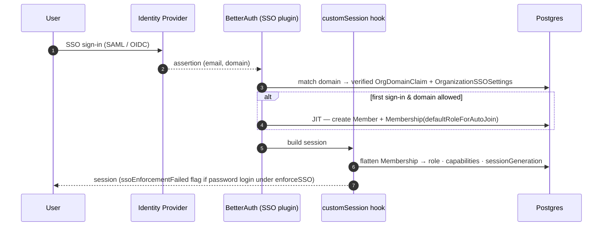

# SSO and authentication

SSO for the enterprise layer is a two-table split:

- `OrganizationSSOSettings` — policy columns we own (allowed domains,
  enforcement, auto-join role).
- `SsoProvider` — BetterAuth-owned SAML/OIDC config (issuer, entity,
  cert, redirect). Our schema carries a back-reference via
  `organizationId`.

A third table, `OrgDomainClaim`, asserts domain ownership at the
platform scope so two different orgs can't both enforce SSO for the
same email domain.



JIT auto-join and session refresh are detailed in [16-jit-and-session-refresh](16-jit-and-session-refresh.md).

## `OrganizationSSOSettings`

```prisma
model OrganizationSSOSettings {
  id             String @id @default(uuid())
  organizationId String @unique
  allowedEmailDomains    String[]   @default([])
  enforceSSO             Boolean    @default(false)
  defaultRoleForAutoJoin MemberRole @default(LEARNER)
  ...
}
```

- `allowedEmailDomains` — the domain allowlist for auto-join on first
  SSO sign-in (e.g. `["acme.com", "acme.co.in"]`). Not case-sensitive;
  normalised to lower-case at write time.
- `enforceSSO` — when `true`, accounts whose email matches one of the
  allowed domains must authenticate via SSO. Password/OAuth sign-ins
  are allowed for auditing (the session is flagged) but the
  `customSession` hook marks them `ssoEnforcementFailed = true`, which
  the dashboard uses to block entry.
- `defaultRoleForAutoJoin` — the `MemberRole` assigned when an SSO
  user lands in the org for the first time. Default `LEARNER`.

Managed via `GET /api/organizations/[orgId]/sso` (MANAGER) and
`PATCH /api/organizations/[orgId]/sso` (OWNER).

## `SsoProvider`

```prisma
model SsoProvider {
  id             String  @id
  issuer         String
  oidcConfig     String?
  samlConfig     String?
  userId         String?
  providerId     String
  organizationId String?
  domain         String
  ...
}
```

Created via `POST /api/organizations/[orgId]/sso/providers` (OWNER),
listed via `GET` (MANAGER), deleted via `DELETE` (OWNER). The
BetterAuth plugin handles the SAML/OIDC handshake; this table is
consulted by our `customSession` hook (`lib/auth.ts`) to decide whether
the account that just logged in satisfies the enforcing org's policy.

## `OrgDomainClaim`

```prisma
model OrgDomainClaim {
  id             String @id @default(uuid())
  domain         String @unique
  organizationId String
  claimedAt      DateTime @default(now())
  ...
}
```

`domain` is globally unique. Two orgs cannot both claim `acme.com` —
the second POST returns a Prisma P2002 error which the
`/api/organizations/[orgId]/domain-claims` handler maps to a 409.

Claims are managed by OWNER:

- `POST /api/organizations/[orgId]/domain-claims` — adds a claim for
  the current org.
- `DELETE /api/organizations/[orgId]/domain-claims/[domain]` — releases
  a claim.

A domain claim is a stronger signal than `allowedEmailDomains`: it
asserts that the org is the *exclusive* rightful home for any user
with that email domain, which is what drives the login-time redirect
UX and enforces single-tenancy for HRIS auto-sync.

## Anti-lockout guards

SSO is a compliance-sensitive feature; we make it very hard to lock
yourself out:

1. **Enforcement only applies to SSO users.** The `customSession` hook
   checks for an `Account` row with `providerId` matching one of the
   registered `SsoProvider.providerId` values. It fails *closed* —
   i.e. it only flags a session as non-SSO when SSO is actually
   configured. An org that has `enforceSSO = true` but zero registered
   providers never locks anyone out (the `customSession` code has an
   explicit "no registered providers" early return in `lib/auth.ts`).
2. **Platform admins always get in.** `requireOrgAccess` bypasses
   membership checks for `UserRole.ADMIN` and returns a synthesized
   OWNER membership — a lock-out can always be resolved by a platform
   admin from the admin console.
3. **Owners can disable enforcement from anywhere.** The PATCH handler
   at `/api/organizations/[orgId]/sso` does not itself require SSO.
4. **Domain claim release is DELETE-by-owner.** Not
   DELETE-by-anyone-with-matching-email.

## Auto-join flow

When an SSO user lands for the first time:

1. BetterAuth creates the platform `User` + `Account` (with
   `providerId = ssoProvider.providerId`).
2. BetterAuth's organization plugin sees a matching org (via allowed
   domain) and creates a bare `Member` row.
3. `customSession` (`lib/auth.ts`) spots the bare `Member` without a
   `Membership` sibling and auto-creates one:
   - `role = defaultRoleForAutoJoin` — **locked to `LEARNER`** (audit
     Phase A.1; see [#jit-default-role](#jit-default-role) below).
   - `status = ACTIVE`
   - `consulteeProfileId` is populated when the role is LEARNER and
     the user has an existing ConsulteeProfile.
4. The `Member.id` is recorded as `Membership.betterAuthMemberId` so
   the bridge between the two tables is live.

The auto-repair is wrapped in a try/catch that swallows Prisma P2002
(unique-constraint races) ONLY — every other error re-throws and
surfaces at the BetterAuth boundary. Audit Phase A.3 narrowed the
prior bare `catch {}` because it swallowed transient DB drops + RLS
denials, leaving users with a session cookie but no Membership row.

For the full sequence (including the `sessionGeneration` marker that
keeps active sessions fresh after role changes) see
[`16-jit-and-session-refresh.md`](./16-jit-and-session-refresh.md).

### JIT default role

`OrganizationSSOSettings.defaultRoleForAutoJoin` is locked at
`LEARNER` — the schema is `z.literal("LEARNER")` in
`lib/labels/org-labels.ts:JitDefaultRoleSchema`. The PATCH handler at
`/api/organizations/[orgId]/sso` rejects any other value with 400
`INVALID_DEFAULT_ROLE`.

Pre-audit, this field accepted any role including `OWNER`. With SSO
enabled, the first user to sign in via the IdP became co-owner of the
org instantly — a catastrophic privilege grant if the IdP was ever
misconfigured (or if anyone in the IT department happened to be on
that domain). The fix is principle-of-least-privilege: everyone lands
as LEARNER, admins promote explicitly via `/dashboard/.../members`,
the promotion is audit-logged (`MEMBER_ROLE_CHANGED`).

### Cert rotation

Cert rotation is **delete-then-recreate**, NOT PATCH. We deliberately
don't ship a `PATCH /sso/providers/[providerId]` endpoint because
silent config drift between the dashboard's cached state and the
actual IdP is a recurring source of broken SAML handshakes.

When your cert is approaching expiry:
1. Export the new PEM block from your IdP's admin console.
2. In Familiarise, DELETE the existing provider.
3. POST a fresh provider with the same `providerId` + new `cert`.

The cron at `scripts/sso-cert-expiry-alert.ts` warns 30 days before
expiry so this fire-drill is never a surprise.

### Cert format validation

POST validates the `samlConfig.cert` field via Node's
`crypto.X509Certificate` constructor before any DB write. A malformed
PEM (e.g. pasting the base64 fingerprint by mistake, or pasting only
the body without `-----BEGIN/END CERTIFICATE-----` markers) returns
400 with a friendly error pointing at where to find the correct PEM
in the IdP console.

Pre-audit, the schema was `z.string().min(1)`. Garbage strings passed
the schema check and crashed BetterAuth's underlying SAML adapter
(`@node-saml/node-saml`) at first signin with
`TypeError: Cannot read properties of undefined (reading 'metadata')`.
The 500 had an empty body, and the UI gave no feedback. Audit Phase A.2.

#### Pre-auth runtime guard (SSO.1, May 2026)

Provider rows registered BEFORE `validateSamlCert` landed in the
schema bypass the registration-time check entirely. The same crash
can also happen if an operator force-edits the row in psql, or if a
migration replays a stale dump.

`/api/auth/sso/domain-check` now pre-parses the stored `samlConfig`
JSON and the X.509 cert before the signin UI hands the user off to
BetterAuth's SAML flow. If either parse fails, the route returns:

```json
{
  "enforceSSO": true,
  "providerMisconfigured": true,
  "errorCode": "SSO_PROVIDER_MISCONFIGURED"
}
```

The signin page (`app/auth/signin/page.tsx`) renders this as a toast
("Your SSO provider's certificate is invalid. Contact your IT admin
to re-paste the X.509 PEM.") and leaves the user on the credentials
form — which they may have for legacy reasons — instead of bouncing
into a BetterAuth 500. The friendly copy lives in
`lib/labels/org-errors.ts` under `SSO_PROVIDER_MISCONFIGURED`.

OIDC providers are not affected by this guard — they have no cert
and fail differently (unreachable `discoveryEndpoint`, rejected
`clientSecret`, etc.). Recovering an org from this state means:
delete the bad provider via the SSO settings UI and recreate it
with a valid PEM (the `[providerId]` DELETE route is the
delete-then-recreate path described above; there is intentionally
no PATCH).

See `__tests__/sso/domain-check-misconfigured-cert.test.ts` for the
regression coverage and `validateSamlCert` in
`lib/sso/provider-schemas.ts` for the shared parse helper used at
both registration time and this runtime guard.

### IdP-issued email verification

The SAML assertion / OIDC token's `email` claim is trusted as the
user's verified identity. We do NOT re-check email ownership in
Familiarise — the IdP is the authority.

**This means your IdP MUST be configured to:**
- Only release email claims for verified mailbox owners.
- Reject sign-ins from accounts whose email is unverified.
- For Okta: see "Profile → Profile editor → email → required + verified".
- For Azure AD: see "Enterprise apps → Familiarise → SSO → Edit attributes & claims".
- For Google Workspace: enforced by default — all `@your-domain.com`
  emails are verified Workspace addresses.

If your IdP releases an unverified email (e.g. an Azure AD guest
account whose email was never proven), an attacker could impersonate
that email. Familiarise's domain-ownership gate
(`OrgDomainClaim.verifiedAt`) prevents cross-org email spoofing, but
within-org spoofing depends on IdP hygiene.

## Session enforcement

The `customSession` hook at the end of `lib/auth.ts` runs on every
request and:

- Hydrates `organizationMemberships[]` into the session shape (see
  `00-overview.md` for the exact field list).
- Computes `ssoEnforcementFailed` per the checks above.
- Silently drops any enforcement check if the user's email domain
  doesn't match any enforcing org (failing open, not closed, so a
  non-corporate sign-in isn't blocked by an unrelated tenant's policy).

The hook also runs `shouldRejectSession` (`lib/sso/enforce-session.ts`)
at the `session` hook level — this is the defence-in-depth check that
runs at `sign-in` time rather than at session-read time.

## Typed error codes

Every typed HTTP error the SSO + auth routes emit. Each `code` is the stable contract; the humanized copy lives in `lib/labels/org-errors.ts` (`humanizeOrgError`), wrapped at every dashboard mutation site so the UI never shows a raw code.

| Code | HTTP | Route(s) | Cause / fix |
|---|---|---|---|
| `SSO_REQUIRED` | 403 | session creation | Email+password on an enforced domain → use the SSO button. |
| `DOMAIN_NOT_OWNED` | 422 | `POST .../sso/providers` | Domain claimed by another org / never claimed. Claim + verify first. |
| `DOMAIN_NOT_VERIFIED` | 422 | `POST .../sso/providers` | Domain claimed but DNS TXT not yet verified. |
| `DOMAIN_ALREADY_REGISTERED` | 409 | `POST .../sso/providers` | Two providers for one domain. Pick one. |
| `PROVIDERID_TAKEN` | 409 | `POST .../sso/providers` | `SsoProvider.providerId` is globally unique (URL slug). |
| `ROLE_TRANSITION_BLOCKED` | 409 | `POST /members`, `PATCH /members/[id]` | LEARNER ↔ EXPERT direct transition — remove + re-add. See `lib/enterprise/role-transitions.ts`. |
| `ORG_NOT_VERIFIED` | 409 | revenue routes (top-up, invoice issue, payout) | PENDING_VERIFICATION org tried money. Admin must verify. |
| `LAST_OWNER_GUARD` | 409 | `PATCH`/`DELETE /members/[id]` | Can't remove the only active OWNER. Promote another first. |
| `INVALID_X509_CERT` | 400 | `POST .../sso/providers` | Cert isn't valid PEM. Re-export `-----BEGIN CERTIFICATE-----…`. |
| `INVALID_DEFAULT_ROLE` | 400 | `PATCH .../sso` | `defaultRoleForAutoJoin` must be `LEARNER`; promote explicitly. |
| `PROGRAM_TYPE_NOT_AVAILABLE` | 400 | `POST .../programs` | Programs v2 (PROJECT/RETAINER) not yet available (#703). |

**Adding a new code:** stable `UPPER_SNAKE_CASE` constant (no version prefix); pick the status (`400` malformed body · `403` auth gate · `409` state conflict · `422` precondition failed); `throw Object.assign(new Error("CODE"), { httpStatus, code })`; add a row here + to `ORG_ERROR_COPY`; add a test asserting `status` + `body.code`.

## Testing SSO locally

Real IdPs cost iteration time. Four approaches, top-down — each catches bugs the one above can't:

| # | Tool | Protocol | Setup | Proves |
|---|---|---|---|---|
| 1 | `mocksaml.com` | SAML | zero (needs a public tunnel for the ACS POST) | assertion parsing + `customSession` auto-provisions a typed `Membership` |
| 2 | `saml-idp` (npm) | SAML | `npx saml-idp …` | SP-initiated flow, cert rotation, attribute mapping (no tunnel) |
| 3 | Keycloak (Docker) | SAML + OIDC | Docker | OIDC **PKCE** round-trip; closest to Okta/Azure |
| 4 | Auth0 / Okta dev tenant | OIDC / SAML | free signup | real-world signoff before a customer link |

**Prereqs (all):** dev server at `NEXT_PUBLIC_APP_URL`; a seeded org with `OWNER` (`npm run db:seed:small`); add `allowedEmailDomains` + a provider under `/dashboard/organization/<orgId>/settings/sso` — the Add Provider dialog shows the ACS / Redirect URI + SP Metadata URL to paste into the IdP.

**Keycloak OIDC + PKCE (the regression-critical path):**
```bash
docker run --name kc -p 8080:8080 -e KEYCLOAK_ADMIN=admin \
  -e KEYCLOAK_ADMIN_PASSWORD=admin quay.io/keycloak/keycloak:latest start-dev
# BetterAuth gates discovery on trustedOrigins — allowlist Keycloak for local:
BETTER_AUTH_TRUSTED_ORIGINS="http://localhost:3000,http://localhost:8080" npm run dev
```
Create a realm + user, an OIDC client (Client auth ON, Standard flow ON, redirect `http://localhost:3000/api/auth/sso/callback/kc-oidc`, **PKCE = S256**), then register it in the Add Provider dialog (Issuer `http://localhost:8080/realms/<realm>`, Discovery `…/.well-known/openid-configuration`). **PKCE check:** on "Sign in with SSO", the redirect to Keycloak's `/auth` must carry `code_challenge=<43+ char>` + `code_challenge_method=S256`. If missing, `ssoClient()` isn't wired or the signin page is doing a raw `fetch`.

**Common failure modes:** `redirect_uri mismatch` → copy the dialog's URI verbatim (case-sensitive); `InResponseTo mismatch` → lost `better-auth.state` cookie (sameSite); `code_verifier missing` → `ssoClient()` plugin not registered; typed `Membership` not created → `customSession` sync runs on session load, visit `/dashboard` once after the redirect.

## Related docs

- [16-jit-and-session-refresh](16-jit-and-session-refresh.md) — JIT auto-join sequence, `sessionGeneration` marker, role-change refresh without forced logout.
- [18-rate-limiting](18-rate-limiting.md) — why BetterAuth's built-in limiter is disabled; the Upstash-backed auth + SSO limiters.
- [03-roles-and-permissions](03-roles-and-permissions.md) — `MemberRole` rank ladder.
- [23-dashboard-pages](23-dashboard-pages.md) — the `/settings/sso` page driving these APIs.
