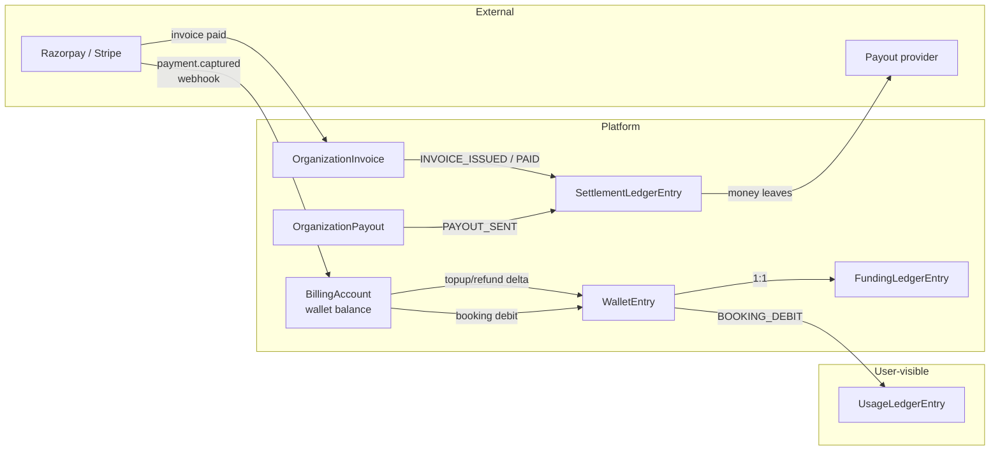

# Three-ledger discipline

The enterprise schema carries three immutable ledgers:

- `UsageLedgerEntry` — every consumed entitlement (sessions, minutes).
- `FundingLedgerEntry` — every money-like allocation (wallet top-ups,
  booking debits, refund credits, adjustments, grants).
- `SettlementLedgerEntry` — every real financial settlement (invoice
  issued/paid, payment received, payout sent, refund issued,
  chargeback, credit note).

## Why three?

The three ledgers answer three different questions:

1. **"What did this member consume?"** → Usage.
2. **"Where did the money go inside the platform?"** → Funding.
3. **"How did the platform settle with external parties?"** →
   Settlement.

Pre-Arch-4 these were mixed into a single `OrgCreditLedger` + ad-hoc
`Payment` + `ConsultantEarnings` rows. Reconciling across them
required JSON joins and date heuristics.

## Schema

```prisma
model UsageLedgerEntry {
  id                  String @id @default(uuid())
  programAssignmentId String?
  membershipId        String
  paymentId           String?
  sessionsConsumed    Int        // signed (negative on reversal)
  minutesConsumed     Int?
  priceAtBookingPaise Int
  wasOverage          Boolean @default(false)
  notes               String?
  createdAt           DateTime @default(now())
  @@index([membershipId, createdAt])
  @@index([programAssignmentId, createdAt])
}

model FundingLedgerEntry {
  id                String @id @default(uuid())
  billingAccountId  String
  deltaPaise        Int           // signed
  reason            FundingReason
  balanceAfterPaise Int
  paymentId         String?
  walletEntryId     String? @unique
  notes             String?
  createdAt         DateTime @default(now())
  @@index([billingAccountId, createdAt])
}

model SettlementLedgerEntry {
  id             String @id @default(uuid())
  organizationId String?
  paymentId      String?
  invoiceId      String?
  payoutId       String?
  kind           SettlementKind
  amountPaise    Int           // signed
  currency       Currency
  notes          String?
  createdAt      DateTime @default(now())
  @@index([organizationId, createdAt])
  @@index([kind, createdAt])
}
```

## Invariants

1. **Rows are immutable.** No UPDATEs; corrections are posted as
   counter-entries.
2. **Every mutation to running-balance state writes a ledger row in
   the same transaction.** `walletDebit()` writes both a `WalletEntry`
   and a `FundingLedgerEntry`. `recordBookingUtilization()` writes a
   `BookingUtilization` + `UsageLedgerEntry`. The invoice issuance
   path writes a `SettlementLedgerEntry(kind=INVOICE_ISSUED)`.
3. **Ledger rows carry `balanceAfter` where applicable** (Funding) so
   point-in-time reconciliation doesn't require a running sum.
4. **Reversals are new rows, not updates.** A refund writes an
   opposing `UsageLedgerEntry` with negative `sessionsConsumed` and a
   `SettlementLedgerEntry(kind=REFUND_ISSUED)`. The original rows
   are untouched — `BookingUtilization.reversedAt` is the marker.

## Reconciliation identities

Enforced by a nightly cron stub (see `19-harness-verdict.md`):

- **Wallet identity:** `sum(FundingLedgerEntry.deltaPaise)` for a
  billing account equals `BillingAccount.walletBalance`.
- **Usage identity:** For a ProgramAssignment,
  `sum(UsageLedgerEntry.sessionsConsumed)` equals
  `ProgramAssignment.sessionsUsed`.
- **Settlement identity:** For an OrganizationInvoice, the
  `SettlementLedgerEntry(kind=INVOICE_PAID)` amount matches
  `OrganizationInvoice.totalPaise`.

The `jobs/reconcile/reconcile-ledgers.ts` cron (scheduled nightly via
`.github/workflows/reconcile-ledgers.yml`) asserts these identities
and persists findings to the `LedgerReconciliationReport` model. An
admin API at `POST /api/admin/reconcile-ledgers` runs the same
auditor on-demand, scoped to a single org if a body is supplied. See
`25-idempotency-keys.md` for the idempotency posture.

### Money-flow overview



Every arrow **must** have a webhook or cron source of truth — no
manual row inserts in production. See `23-runbooks.md` if an arrow
drifts and the reconciler flags it.

## `FundingReason` vs `WalletReason`

| `WalletReason` | `FundingReason` |
|----------------|------------------|
| `TOPUP`        | `TOPUP`          |
| `BOOKING`      | `BOOKING_DEBIT`  |
| `REFUND`       | `REFUND_CREDIT`  |
| `ADJUSTMENT`   | `ADJUSTMENT`     |
| —              | `GRANT`          |

The wallet enum is user-facing (shows up on the wallet history page);
the funding enum is ledger-facing. Every `WalletEntry` has exactly
one `FundingLedgerEntry`, joined via
`FundingLedgerEntry.walletEntryId @unique`.

### Why two tables, not one

It's tempting to look at the near-1:1 pairing and the parallel enums
and say "merge them, add a `dashboardVisible` flag." Don't. The
separation is load-bearing for two reasons:

1. **Audiences differ.** `WalletEntry` is queried by the org's billing
   tab and feeds the user-facing transaction list — it carries gateway
   idempotency keys (`providerOrderId`, `providerPaymentId`) that
   product UI needs. `FundingLedgerEntry` carries `balanceAfterPaise`
   for point-in-time audit and is queried by finance/accounting
   exports. Different read patterns, different retention policies,
   different access scopes.
2. **`GRANT` is the carve-out.** Platform-side awards (promotional
   credits, support comps, post-incident migration backfill) get a
   `FundingLedgerEntry` with `reason = GRANT` and **no**
   `walletEntryId`. There's no corresponding `WalletEntry` because
   the wallet history page intentionally doesn't show platform grants
   (they look like fraud signals to a CFO scanning the org's wallet
   tab). A merged table with a flag would still need this carve-out;
   the cost of the extra table is mostly in the schema, not in the
   write path.

If platform grants ever become user-visible (e.g. as part of a
loyalty program), the merge becomes viable — see the "redundancies"
follow-up issue.

## `SettlementKind`

```
INVOICE_ISSUED
INVOICE_PAID
PAYMENT_RECEIVED
REFUND_ISSUED
PAYOUT_SENT
CHARGEBACK
CREDIT_NOTE
```

Each kind maps to one real-world event that moves money across the
platform boundary. `PAYMENT_RECEIVED` is written at the gateway-
webhook level (Razorpay/Stripe succeeded), `PAYOUT_SENT` when the
payout provider confirms. Both are cron-driven in v1; the rows
themselves can be inserted by hand via the payout/invoice endpoints.

## What NOT to write

- Don't write a ledger row for read operations.
- Don't write a Funding entry for a booking without a Wallet debit
  (they should be 1:1).
- Don't write a Settlement entry for a refund without reversing the
  corresponding Usage and Funding rows (via
  `reverseBookingUtilization()` + `walletCredit()`).
- Don't delete a ledger row. Ever. If a row is wrong, post a counter
  entry.

## Related docs

- `09-wallet-and-ledger.md` — the Funding ledger in action.
- `16-programs.md` — the Usage ledger in action.
- `10-invoicing.md` / `07-payout-pipeline.md` — the Settlement ledger
  in action.
- `19-harness-verdict.md` — reconciliation cron status.
