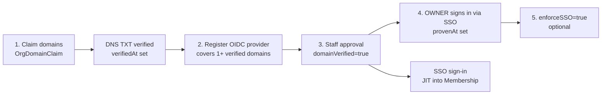

# SSO and authentication

This page is the enterprise view of single sign-on. It covers what an
organisation has to do to get SSO, and what SSO changes for its members.

The canonical, code-level description is
[authentication/sso.md](../../authentication/sso.md). It covers plugin options,
claim checks, secret encryption, callback URLs and failure handling. The wider
sign-in stack is in the [authentication overview](../../authentication/README.md).

SSO is OIDC-only on `@better-auth/sso` 1.7.7. SAML and SCIM are not supported.

## The path to an enforced SSO tenant

An org goes through five steps, each gated on the one before it.

1. **Claim and verify domains.** An OWNER creates an `OrgDomainClaim`
   (`POST /api/organizations/[orgId]/domain-claims`). They publish the
   returned token as a TXT record at `_familiarise-verify.<domain>`, then call
   `POST .../domain-claims/[domain]/verify`, which sets `verifiedAt`. A domain
   can be verified by only one org.
2. **Register an OIDC provider.** An OWNER calls
   `POST /api/organizations/[orgId]/sso/providers` (`identity.manage`) with the
   issuer, discovery URL, client id and secret, plus `domains`. `domains` lists
   one or more of the org's verified domains, for example every UPN suffix of
   one Entra tenant. The server runs OIDC discovery, generates the
   `providerId`, encrypts the config and stores the row with
   `domainVerified=false`. Platform ADMINs get an email. PKCE is always on and
   the scopes are fixed to `openid email profile`.
3. **Staff approval.** A platform ADMIN picks the provider from the **Pending
   SSO approvals** queue on the back-office Organizations page and approves it
   (`POST /api/admin/organizations/[orgId]/sso-providers/[providerId]/approval`).
   Approval re-checks a verified claim for every covered domain. The org's
   OWNERs get an email on approval and on revocation.
4. **Prove it.** An org OWNER signs in once through the approved provider.
   That stamps `SsoProvider.provenAt`. The settings page shows "Approved — sign
   in once as an owner" until then.
5. **Enforce (optional).** `PATCH /api/organizations/[orgId]/sso` with
   `enforceSSO=true` needs a verified domain and an approved provider. It
   answers `409 SSO_NOT_PROVEN` until one is proven. Turning it on signs out
   everyone on the enforced domains, members or not, except the OWNER who
   turned it on.

Settings and claims are read with `identity.read` (OWNER, MAINTAINER) and
changed with `identity.manage` (OWNER only), from **Settings → Domains & SSO**
in the org dashboard.

**Rotating the IdP client secret.** Entra secrets expire after at most 24
months. An OWNER rotates the secret in place from the provider row:
`PATCH .../sso/providers/[providerId]` with `{ clientSecret }`. The
`providerId`, the redirect URI and the approval stay as they are. The same
PATCH with `{ domains }` adds or removes covered domains.

## What an org can configure

`OrganizationSSOSettings` has three policy columns:

| Column                   | Meaning                                                                      |
| ------------------------ | ---------------------------------------------------------------------------- |
| `enforceSSO`             | Members on the enforced domains must sign in through a covering provider.    |
| `defaultRoleForAutoJoin` | `MemberRole` given on a JIT join without an invitation. Locked to `LEARNER`. |
| `version`                | Optimistic-lock counter; a stale write gets `409 VERSION_CONFLICT`.          |

Enforcement is **per domain**. A verified domain is enforced only when an
approved provider covers it and at least one covering provider is proven. A
second verified domain that no provider covers keeps password and Google
sign-in. For example, a domain verified only to lift the seat cap is not
locked out.

## Guards against locking an org out

- Enforcement only applies to an `ACTIVE` org with a verified claim. A pending,
  suspended or deactivated org cannot gate sessions for its email suffix (see
  [organization-lifecycle](../00-foundations/05-organization-lifecycle.md)).
- Enforce-on needs an OWNER's successful SSO sign-in through an approved
  provider. A misconfigured IdP is caught before anyone is signed out.
- Deleting the last approved provider, or releasing a domain claim behind it,
  is refused while `enforceSSO` is on. Releasing a claim unapproves every
  provider that covers it, in the same transaction.
- If the IdP breaks while enforced, an ADMIN turns enforcement off from the
  back-office org page (`POST /api/admin/organizations/[orgId]/sso-enforcement`).
  Members can then use password or social sign-in until the IdP is back.

## Identity trust and linking

An SSO sign-in is accepted only if all of these hold:

- the provider is approved;
- the email's domain is one the provider covers, and the org still holds a
  verified claim for it;
- the IdP vouches for the email:
  - `email_verified` is true;
  - for Google, `hd` is one of the covered domains, so a personal Google
    account on a company alias is refused;
  - for Entra, `xms_edov` is true. Add it as an optional ID-token claim in the
    app registration.

Users created by SSO are `emailVerified`. BetterAuth auto-links an SSO identity
to an existing verified user with the same email. Each user can hold at most
one identity per provider.

## JIT membership and deprovisioning

Every SSO login runs `provisionUser` → `provisionSsoMembership`
(`lib/sso/jit-membership.ts`) after the claim checks. A first login writes a
typed `Membership` row in the provider's org.

- **Role.** If the email has a pending invitation to that org, its role is used
  and the invitation is marked accepted in the same transaction. Otherwise the
  role is `defaultRoleForAutoJoin`.
- **Seats.** A join refused by the seat cap succeeds on a later login, once a
  seat frees up.
- **Existing rows.** Any existing row, `REMOVED` and `SUSPENDED` included, is
  left alone, so the IdP never undoes an admin's removal.
- **Org state.** The org must not be suspended or deactivated. A
  `PENDING_VERIFICATION` org admits only a capped number of active members.

Role changes after that reach the session without a forced logout; see
[jit-and-session-refresh](02-jit-and-session-refresh.md).

Deprovisioning has no SCIM. When an admin removes or suspends a member whose
email is on one of the org's verified domains, all of that user's sessions end
in the same transaction. The SSO session lifetime cap bounds the rest.

## Typed error codes

The humanised copy for org routes lives in `lib/labels/org-errors.ts`. The
sign-in page copy for `SSO_REQUIRED` and the other auth codes is described in
[authentication/errors.md](../../authentication/errors.md).

| Code                           | HTTP | Route                                  | Cause / fix                                                     |
| ------------------------------ | ---- | -------------------------------------- | --------------------------------------------------------------- |
| `SSO_REQUIRED`                 | 403  | session creation                       | Non-SSO sign-in on an enforced domain. Use the SSO button.      |
| `SSO_EMAIL_DOMAIN_MISMATCH`    | 403  | SSO callback                           | The IdP asserted an email outside the provider's domains.       |
| `SSO_EMAIL_NOT_VERIFIED`       | 403  | SSO callback                           | IdP did not vouch for the email (Entra: add `xms_edov`).        |
| `SSO_HOSTED_DOMAIN_MISMATCH`   | 403  | SSO callback                           | A personal Google account; use the Workspace account.           |
| `SSO_ACCOUNT_ALREADY_LINKED`   | 403  | SSO callback                           | The user already has a different identity at this provider.     |
| `SSO_NOT_PROVEN`               | 409  | `PATCH .../sso`, staff door            | No OWNER has signed in through an approved provider yet.        |
| `DOMAIN_ALREADY_CLAIMED`       | 409  | `POST .../domain-claims`               | Another org holds the domain.                                   |
| `DOMAIN_NOT_OWNED`             | 422  | `POST`/`PATCH .../sso/providers`       | The org has no claim on a domain. Claim and verify first.       |
| `DOMAIN_NOT_VERIFIED`          | 422  | `POST`/`PATCH .../sso/providers`       | A claim exists but its DNS TXT record is not verified yet.      |
| `DOMAIN_ALREADY_COVERED`       | 409  | `POST`/`PATCH .../sso/providers`       | Another provider of the org already covers the domain.          |
| `OIDC_DISCOVERY_FAILED`        | 422  | `POST .../sso/providers`               | The issuer's discovery document could not be fetched or parsed. |
| `SSO_ENCRYPTION_KEY_MISSING`   | 500  | `POST`/`PATCH .../sso/providers`       | `AUTH_CONFIG_ENCRYPTION_KEY` is not set on the server.          |
| `DOMAIN_VERIFICATION_REQUIRED` | 403  | `PATCH .../sso`                        | `enforceSSO=true` without a verified domain.                    |
| `VERSION_CONFLICT`             | 409  | `PATCH .../sso`, `PATCH .../providers` | Changed in another session. Reload and retry.                   |
| `NOTHING_TO_RESUBMIT`          | 409  | `POST .../verification/resubmit`       | The org is not a rejected, still-pending verification.          |

`enforceSSO=true` with no approved provider returns a plain `409`, with an
`error` message and no stable `code`.

## Auditing

Refused sign-ins (`SSO_REQUIRED`, `SSO_EMAIL_DOMAIN_MISMATCH`) write an
`SSO_SIGN_IN_REFUSED` row to the org's audit log. The log keeps at most one row
per email, code and hour, so org admins can see who was turned away and why.

Provider registration, updates (`SSO_PROVIDER_UPDATED`) and enforcement flips
are audited too. Staff approval and revocation are in `OpsActionLog`.

## Testing SSO locally

`npm run test` runs `__tests__/sso/oidc-round-trip.test.ts`, a full OIDC round
trip against `oauth2-mock-server`. It includes an `email_verified=false`
refusal. For a real browser flow, use an Auth0 or Okta developer tenant. Point
its redirect URI at `${BETTER_AUTH_URL}/api/auth/sso/callback/<providerId>`.

## Related docs

- [authentication/sso.md](../../authentication/sso.md): canonical SSO design,
  claim checks, secret key rotation, failure modes.
- [jit-and-session-refresh](02-jit-and-session-refresh.md): the JIT sequence
  and how role changes reach live sessions.
- [rate-limiting](03-rate-limiting.md): limits on SSO sign-in, the callback
  and the domain-check probe.
- [organization-lifecycle](../00-foundations/05-organization-lifecycle.md): org
  states and the verification resubmit loop.
- [roles-and-permissions](../00-foundations/04-roles-and-permissions.md): the
  `MemberRole` ladder and `identity.*` permissions.

## Deprecated & Superseded Approaches

- **Org-wide enforcement over every verified domain, with one provider per
  domain.** This locked out the users of a second domain that had no provider
  of its own. Per-domain coverage with multi-domain providers replaced it.
- **"Existing sessions are not affected by enforcement".** This was never true
  of the code: enforce-on revokes sessions, and the enabling OWNER now keeps
  theirs.
- **Delete-and-recreate to change a provider.** This needed a new redirect URI
  and a new approval. It was replaced by in-place PATCH for the secret and the
  domains.
- **Trusting the IdP's email claim without `email_verified`, `hd` or
  `xms_edov` checks.** This was replaced by the claim checks above.
