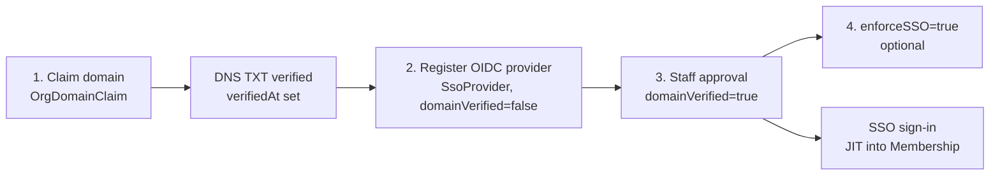

# SSO and authentication

This page is the enterprise view of single sign-on: what an organisation has
to do to get SSO, and what it changes for its members. The canonical,
code-level description (plugin options, secret encryption, callback URLs,
failure handling) is [authentication/sso.md](../../authentication/sso.md);
the wider sign-in stack is in the
[authentication overview](../../authentication/README.md).

SSO is OIDC-only. SAML and SCIM are not supported.

## The path to an enforced SSO tenant

An org goes through four steps, each gated on the one before it.

1. **Claim and verify a domain.** An OWNER creates an `OrgDomainClaim`
   (`POST /api/organizations/[orgId]/domain-claims`), publishes the returned
   token as a TXT record at `_familiarise-verify.<domain>`, then calls
   `POST .../domain-claims/[domain]/verify`, which sets `verifiedAt`. A domain
   can be claimed by only one org.
2. **Register an OIDC provider.** An OWNER calls
   `POST /api/organizations/[orgId]/sso/providers` (`identity.manage`) with the
   issuer, discovery URL, client id and secret for a domain the org has verified. The server
   runs OIDC discovery, generates the `providerId`, encrypts the client secret
   and stores the row with `domainVerified=false`. There is no edit: to change
   a provider, delete it and register a new one. The secret is never returned.
3. **Staff approval.** A platform ADMIN approves the provider from the org's
   back-office page
   (`POST /api/admin/organizations/[orgId]/sso-providers/[providerId]/approval`),
   which re-checks the domain claim and sets `domainVerified=true`. Until then
   BetterAuth refuses sign-in through that provider.
4. **Enforce (optional).** `PATCH /api/organizations/[orgId]/sso` with
   `enforceSSO=true` needs a verified domain and at least one approved
   provider. Once on, any session for an address on the org's verified domains
   that did not come through one of its approved providers is refused with
   `SSO_REQUIRED` before the cookie is issued
   (`databaseHooks.session.create.before`, `lib/sso/enforce-session.ts`).

Settings and claims are read with `identity.read` (OWNER, MAINTAINER) and
changed with `identity.manage` (OWNER only), from **Settings → Domains & SSO**
in the org dashboard.

## What an org can configure

`OrganizationSSOSettings` has three policy columns:

| Column                   | Meaning                                                             |
| ------------------------ | ------------------------------------------------------------------- |
| `enforceSSO`             | Members on the org's verified domains must sign in through its SSO. |
| `defaultRoleForAutoJoin` | `MemberRole` given on JIT join. Locked to `LEARNER` by the API.     |
| `version`                | Optimistic-lock counter; a stale write gets `409 VERSION_CONFLICT`. |

The verified `OrgDomainClaim` rows are the only list of domains: every
verified domain of an enforcing org is enforced.

## Guards against locking an org out

- Enforcement only applies to an `ACTIVE` org with a verified claim. A
  pending, suspended or deactivated org cannot gate sessions for its email
  suffix (see [organization-lifecycle](../00-foundations/05-organization-lifecycle.md)).
- If an enforcing org has no approved provider, enforcement fails open rather
  than locking everyone out.
- Deleting the last approved provider, or releasing the domain claim behind
  it, is refused while `enforceSSO` is on. Releasing a claim resets
  `domainVerified=false` on that domain's providers in the same transaction.
- If the IdP is down, an OWNER who still has a live session turns
  `enforceSSO` off (existing sessions are not affected by enforcement); members
  can then use password or social sign-in until the IdP is back.

## JIT membership

A first SSO sign-in creates the BetterAuth user and, through
`provisionUser` → `provisionSsoMembership` (`lib/sso/jit-membership.ts`), a
typed `Membership` row in the provider's org with `defaultRoleForAutoJoin`.
This runs on every SSO login, so a join refused by the seat cap succeeds on a
later login once a seat frees up. Any existing row, including `REMOVED` and
`SUSPENDED`, is left alone: the IdP never undoes an admin's removal. The org
must not be suspended or deactivated, and a `PENDING_VERIFICATION` org admits
only a capped number of active members. A refused join is recorded as an
`SSO` system event. Role changes after that reach the session without a
forced logout; see [jit-and-session-refresh](02-jit-and-session-refresh.md).

Familiarise trusts the email the IdP asserts. The domain claim stops one org
from claiming another org's addresses; spoofing inside an org depends on the
IdP only releasing verified emails.

## Typed error codes

The humanised copy for org routes lives in `lib/labels/org-errors.ts`; the
sign-in page copy for `SSO_REQUIRED` and the other auth codes is described in
[authentication/errors.md](../../authentication/errors.md).

| Code                           | HTTP | Route                            | Cause / fix                                                     |
| ------------------------------ | ---- | -------------------------------- | --------------------------------------------------------------- |
| `SSO_REQUIRED`                 | 403  | session creation                 | Non-SSO sign-in on an enforced domain. Use the SSO button.      |
| `DOMAIN_ALREADY_CLAIMED`       | 409  | `POST .../domain-claims`         | Another org holds the domain.                                   |
| `DOMAIN_NOT_OWNED`             | 422  | `POST .../sso/providers`         | The org has no claim on the domain. Claim and verify first.     |
| `DOMAIN_NOT_VERIFIED`          | 422  | `POST .../sso/providers`         | Claim exists but the DNS TXT record is not verified yet.        |
| `OIDC_DISCOVERY_FAILED`        | 422  | `POST .../sso/providers`         | The issuer's discovery document could not be fetched or parsed. |
| `SSO_ENCRYPTION_KEY_MISSING`   | 500  | `POST .../sso/providers`         | `AUTH_CONFIG_ENCRYPTION_KEY` is not set on the server.          |
| `DOMAIN_VERIFICATION_REQUIRED` | 403  | `PATCH .../sso`                  | `enforceSSO=true` without a verified domain.                    |
| `VERSION_CONFLICT`             | 409  | `PATCH .../sso`                  | Settings changed in another session. Reload and retry.          |
| `NOTHING_TO_RESUBMIT`          | 409  | `POST .../verification/resubmit` | The org is not a rejected, still-pending verification.          |

A duplicate provider for the same domain, and `enforceSSO=true` with no
approved provider, return a plain `409` with an `error` message and no stable
`code`.

## Testing SSO locally

`__tests__/sso/oidc-round-trip.test.ts` runs a full OIDC round trip against
`oauth2-mock-server` in `npm run test`. For a real browser flow, run Keycloak
in Docker or use an Auth0/Okta developer tenant; the steps are in
[authentication/sso.md](../../authentication/sso.md).

## Related docs

- [authentication/sso.md](../../authentication/sso.md) — canonical SSO
  design, secret key rotation, failure modes.
- [jit-and-session-refresh](02-jit-and-session-refresh.md) — JIT sequence and
  how role changes reach live sessions.
- [rate-limiting](03-rate-limiting.md) — limits on SSO sign-in, callback and
  the domain-check probe.
- [organization-lifecycle](../00-foundations/05-organization-lifecycle.md) —
  org states and the verification resubmit loop.
- [roles-and-permissions](../00-foundations/04-roles-and-permissions.md) —
  `MemberRole` ladder and `identity.*` permissions.
