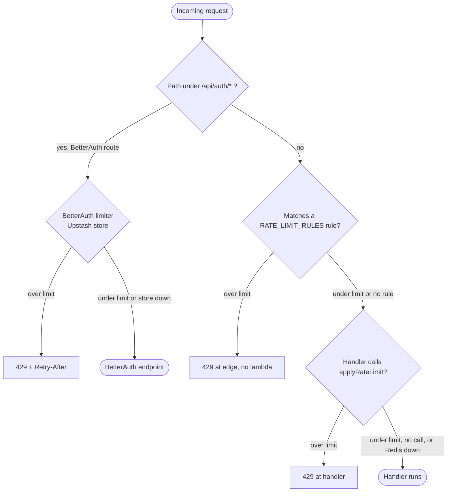

# Rate limiting

This document is the coverage matrix for auth and enterprise rate
limiting: it records who enforces what and at which layer. It is
written for engineers touching `middleware.ts`, `lib/rate-limit.ts`,
`lib/auth/rate-limit.ts`, any
unauthenticated route under `app/api/auth/**`, or the wallet, invoice,
and webhook endpoints.

---

## §0 — Three enforcement layers

Rate limits live in **three** places, and the matrix in §2 marks which is
which. The auth-specific budgets, and the reasoning behind each number, are
in [authentication/rate-limiting-and-abuse.md](../../authentication/rate-limiting-and-abuse.md);
this page is the enterprise coverage matrix.

1. **BetterAuth's own limiter** (`rateLimit` in `lib/auth.ts`, rules and
   store in `lib/auth/rate-limit.ts`) — covers every `/api/auth/*` path,
   including plugin paths such as `/two-factor/*` and `/sign-in/sso`. It is
   always enabled and stores its counters in Upstash through a
   `customStorage` adapter (atomic `INCR` + `PEXPIRE`, key
   `sha256(ip|path)`), so the count is shared across lambdas. A slow or
   failing store (500 ms timeout) fails open with a throttled Sentry event.
2. **Edge middleware** (`middleware.ts`, `RATE_LIMIT_RULES`) — runs before
   any function is invoked, so it stops cost amplification. It does **not**
   limit BetterAuth paths. Auth-adjacent rules are the pre-login SSO domain
   probe, invitation accept and the session-management routes. Rules that
   spend a named policy take their limiter from `limiterFor(scope)` in
   `lib/rate-limit/policies.ts`, so the 429 body reports the same `scope`
   the budget is declared under.
3. **Route handler** (`applyRateLimit(limiter, key, scope)` inside the
   handler) — for authenticated writes whose key (`orgId`, the acting user,
   an invitation id in the body) the edge cannot read cheaply.

`applyRateLimit` (`lib/rate-limit.ts`, Upstash sliding window via
`makeLimiter`) also fails **open** when Redis is unreachable and returns
`429` with `X-RateLimit-Remaining` on exceed.



`/api/auth/sso/domain-check` is an app route, not a BetterAuth one, so it
takes the edge branch.

---

## §1 — Why BetterAuth's limiter runs on Upstash

BetterAuth's default store is per-process memory; on Netlify that is one
counter per warm lambda, which an attacker can outrun. Plugging an Upstash
store into BetterAuth keeps one coherent limiter for every auth path, with
BetterAuth's own path matching, instead of re-declaring auth paths at the
edge. The edge table therefore has no `/api/auth/*` rules for BetterAuth
endpoints, and nothing counts the same request twice.

### Trade-off: per-subsystem limiters vs one global gate

Each surface gets a window sized to its threat: password sign-in is
30/15 min per IP and path (brute force), webhook config is 5/min on `org:`
(config thrash), data export is 1/24 h on `org:` (expensive job). One global
bucket cannot express that spread, and because the keys differ (IP vs
`org:` vs user) one noisy org behind a corporate NAT could starve everyone
(see §6).

---

## §2 — Coverage matrix

### BetterAuth (`AUTH_RATE_LIMIT_RULES` in `lib/auth/rate-limit.ts`)

Keyed per client IP and path. Unlisted paths get the 100/min default.
`withRetryAfter` mirrors BetterAuth's `X-Retry-After` to `Retry-After`.

| Path (under `/api/auth`)           | Budget        |
| ---------------------------------- | ------------- |
| `/sign-in/email`                   | 30 per 15 min |
| `/change-password`                 | 5 per 15 min  |
| `/verify-password`                 | 5 per 15 min  |
| `/two-factor/verify-*`             | 5 per min     |
| `/two-factor/*`                    | 10 per min    |
| `/sign-up/email`                   | 10 per hour   |
| `/request-password-reset`          | 5 per hour    |
| `/send-verification-email`         | 10 per hour   |
| `/reset-password`                  | 20 per hour   |
| `/reset-password/*`                | 10 per hour   |
| `/verify-email`                    | 30 per hour   |
| `/sign-in/social`, `/callback/*`   | 30 per 15 min |
| `/sign-in/sso`                     | 20 per 15 min |
| `/sso/callback`, `/sso/callback/*` | 30 per 15 min |
| `/get-session`, `/sign-out`        | not limited   |

### Edge-enforced (`middleware.ts` → `RATE_LIMIT_RULES`)

| Surface                                                          | Scope / limiter               | Window         | Key            | Skip localhost |
| ---------------------------------------------------------------- | ----------------------------- | -------------- | -------------- | -------------- |
| `GET /api/auth/sso/domain-check`                                 | `enterprise.sso-domain-check` | 120 per hour   | IP             | yes            |
| `POST /api/organizations/invitations/accept`                     | `enterprise.invite-accept`    | 60 per hour    | IP             | yes            |
| `/api/user/sessions*` except `/api/user/sessions/current`        | `sessionMgmtLimiter`          | 120 per 15 min | IP             | yes            |
| `POST /api/organizations/[orgId]/billing-account/wallet/top-ups` | `orgWalletTopUpLimiter`       | 20 per hour    | `org:${orgId}` | yes            |

> **`sso-domain-check` and `invite-accept` were both raised for shared NATs**
> — 60 → 120/hr and 30 → 60/hr respectively. Both sit on the critical path of
> a corporate sign-in or a member's first sign-up, and one office floor is a
> single IP. The `redisPrefix` override in the policy table keeps them on
> their original Redis keys.
>
> The `enterprise.invite-accept` policy also declares a 20/hour
> per-invitation (`token`) budget, but no handler spends it yet: the
> invitation id is in the POST body, which the edge cannot read.

### Handler-enforced (`applyRateLimit(...)` inside the route)

Handler limiters can key on the org or the acting user rather than the raw
IP. Copy the exact key when adding a sibling route to an existing limiter.

| Surface                                                                      | Limiter                                        | Window       | Key                         | Gate                |
| ---------------------------------------------------------------------------- | ---------------------------------------------- | ------------ | --------------------------- | ------------------- |
| `POST /api/admin/team/members`, `POST .../[userId]/setup-link`               | `staffCreateLimiter` (`platform.staff-create`) | 20 / hour    | acting ADMIN (`accountKey`) | ADMIN               |
| `GET /api/user/sessions`, `DELETE .../[sessionId]`, `POST .../revoke-others` | `sessionMgmtUserLimiter`                       | 60 / 15 min  | user id                     | signed in           |
| `GET /api/admin/users/[userId]/sessions`, `POST .../sessions/revoke`         | `adminSessionAccessLimiter`                    | 120 / 15 min | acting operator             | `users.read`        |
| `POST /api/organizations/[orgId]/invitations`                                | `orgInviteLimiter`                             | 20 / hour    | `${orgId}`                  | MAINTAINER+         |
| `POST /api/organizations/[orgId]/webhooks`                                   | `orgWebhookLimiter`                            | 5 / min      | `org:${orgId}`              | billing-admin∨owner |
| `PATCH /api/organizations/[orgId]/webhooks/[endpointId]`                     | `orgWebhookLimiter`                            | 5 / min      | `org:${orgId}`              | billing-admin∨owner |
| `POST .../webhooks/[endpointId]/rotate-secret`                               | `orgWebhookLimiter`                            | 5 / min      | `org:${orgId}`              | OWNER               |
| `POST /api/organizations/[orgId]/data-exports`                               | `orgDataExportLimiter`                         | 1 / 24 h     | `org:${orgId}`              | billing-admin∨owner |

> **`orgInviteLimiter` keys on the bare `orgId`** (not `org:${orgId}`);
> the webhook + data-export limiters use the `org:` prefix. The keys are
> distinct prefixes (`rl:org-invite` vs `rl:org-webhook` etc.) so the
> mismatch is cosmetic, but copy the exact key when adding a sibling
> route to the same limiter.

### Gated but NOT rate-limited (intentional)

These v2 routes rely on their auth gate + state preconditions; no
limiter is wired, and none is needed at current threat-model:

| Surface                            | Gate        | Why no limiter                                                                            |
| ---------------------------------- | ----------- | ----------------------------------------------------------------------------------------- |
| `POST .../verification/resubmit`   | MAINTAINER+ | Idempotent state flip gated on "previously rejected & still pending"; nothing to amplify. |
| `GET .../checkout/overage-preview` | any member  | Read-only projection; covered by the §4 authed-read rationale.                            |
| `POST` / `DELETE .../consent`      | MANAGER+    | MANAGER-gated config write; low call volume, audit-logged.                                |

Everything else inherits the org-scoped role gates in
`lib/auth-helpers.ts:requireOrgAccess` (whose `permission` option names a
matrix key, such as `billing.manage` on finance writes) plus the
IP-level Cloudflare / Netlify edge rate limits (the latter are
operational, not in code).

---

## §3 — Localhost bypass

`isBypassableIp(clientIp)` (`lib/rate-limit.ts`) returns true for `::1`,
`127.0.0.1`, and the `unknown_ip` sentinel — **but only when
`NODE_ENV !== "production"`**. In production it returns `false` for
every value (including the sentinel), so a header-stripping proxy can't
silently disable a limiter. The booking-algorithm-tests + Chrome MCP
runs need to fire hundreds of requests in a few minutes; the dev-only
bypass keeps them unblocked without weakening production limits.

The bypass is opt-in **per rule**: each `RATE_LIMIT_RULES` entry carries
a `skipLocalhost` flag and the value is intentionally inconsistent — the
auth + enterprise _write_ rules set it `true` (bypass on localhost), the
public _read_ rules (consultant search, eligibility, newsletter,
availability) set it `false` so they rate-limit even locally. Preserve
the original per-rule value when editing.

BetterAuth's limiter has its own equivalent: the Upstash store skips
`127.0.0.1` and `::1` outside production and never skips in production.

See `CLAUDE.md` memory note on agent-006 booking tests for context.

---

## §4 — What's NOT rate-limited (and why)

- **Authenticated org-scoped reads** (`GET /api/organizations/[orgId]/...`)
  — gated by `requireOrgAccess`. A bad actor with a valid OWNER
  session can already query the org's data; rate-limiting would just
  punish a UI bug that triggers a fetch loop. Use TanStack Query's
  `staleTime` to deduplicate.
- **Webhooks** (`POST /api/webhooks/razorpay`, etc.) — signature
  verification is the gate. Rate-limiting would risk dropping
  legitimate retries from the gateway.
- **Static assets + Next.js system routes** — handled at the edge.

---

## §5 — How to add a new limiter

1. Define the limiter once in `lib/rate-limit.ts` via the shared helper
   (don't hand-roll `new Ratelimit({...})` — `makeLimiter` wires the
   shared Upstash `redis` client + sliding window):
   ```ts
   export const myLimiter = makeLimiter(<count>, "<window>", "rl:my-key");
   ```
   Pick a **unique `rl:` prefix** so its bucket can't collide with
   another limiter's keyspace.
2. Choose the layer:
   - **A BetterAuth path** (`/api/auth/*`): add a rule to
     `AUTH_RATE_LIMIT_RULES` in `lib/auth/rate-limit.ts`. Do not add an
     edge rule for it; the request would be counted twice.
   - **Auth-adjacent or enterprise surface with a named policy**: declare
     a row in `RATE_POLICIES` (`lib/rate-limit/policies.ts`: scope, window,
     dimensions, `description`) and spend it with `limiterFor(scope,
dimension)` from the edge rule or the handler, so the number lives in
     one place.
   - **Edge, anything else** (public reads, cheap key): append a
     `RateRule` to `RATE_LIMIT_RULES` in `middleware.ts` — `{ label,
match, limiter, key?, scope?, skipLocalhost }`. Omit `key` to
     default to client IP; return `null` from `key` to skip when the
     identifier can't be parsed.
   - **Handler** (authed write, key needs the resolved `orgId` or user):
     call `const rl = await applyRateLimit(myLimiter, key); if (rl) return rl;`
     near the top of the handler, after the auth gate.
     `applyRateLimit` returns a `429` `Response` on exceed and `null` on
     pass, and fails open if Redis is down.
3. **Document the limiter in §2 of this doc** (correct layer + key +
   window) so the matrix stays complete.
4. Add a test that fires N requests and asserts the tail returns 429.

---

## §6 — Common pitfalls

- **Don't pick a key shared across tenants.** A limiter keyed on
  `unknown_ip` from behind a corporate NAT will punish the whole
  company.
- **Don't put unauthenticated-path limits behind the auth gate.** A
  limiter spent only after `requireApiAuth` never gates a brute-force
  attacker; it must run before the session check.
- **Don't name a route that does not exist.** An old edge rule named
  `/api/auth/forget-password`; BetterAuth has no such endpoint, so the
  forgot-password flow ran unthrottled. BetterAuth paths are now limited
  inside BetterAuth, which matches its own routes.
- **Don't put a plaintext address in a Redis key.** Upstash keys are
  plaintext at rest and visible in `MONITOR`. Use `accountKey(email)` or
  `tokenKey(token)` from the policy table.
- **Don't throttle a provider's webhook endpoint.** A 429 on a Stream
  delivery is not a deferral — Stream retries inside a fifteen-second
  budget and then drops the event permanently.
- **Don't conflate idempotency with rate limiting.** A wallet top-up
  retry of the same `clientIdempotencyKey` is legitimate and should
  not count against the limiter (or should at least be deduped before
  counting). The current `orgWalletTopUpLimiter` counts every request;
  the idempotency key handles deduplication at the route layer.

---

## §7 — References

- [authentication/rate-limiting-and-abuse.md](../../authentication/rate-limiting-and-abuse.md)
  — the auth limiter, breached-password check and abuse posture.
- [ADR 7 — Upstash rate limiting](../70-design-decisions/07-upstash-rate-limiting.md).
