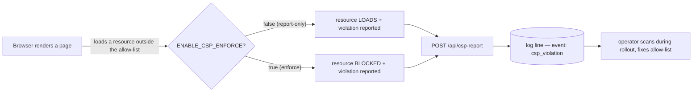

# Security headers

**New here?** HTTP response headers are instructions the server hands
the browser on every page: *don't let other sites frame me*
(`X-Frame-Options`), *only talk to me over HTTPS*
(`Strict-Transport-Security`), *only load scripts from this allow-list*
(`Content-Security-Policy`, "CSP"). They cost nothing at runtime and are
the first thing a large-customer security review greps for, so getting
them right is table stakes for enterprise.

PR #655 adds the two missing headers that block any large-customer
security review on Familiarise: `Content-Security-Policy` (report-only
by default) and `Strict-Transport-Security`. The other five were
already in place; they get a brief mention here for completeness.

**Design decision: ship CSP in report-only first, enforce later.**
A CSP that's even slightly too strict *breaks the page* — a blocked
script is a blank dashboard, in production, for everyone. So the policy
ships as `Content-Security-Policy-Report-Only`: the browser evaluates
every directive and *reports* what it would have blocked, but blocks
nothing. Violations POST to `/api/csp-report` and surface as
`event: "csp_violation"` log lines, giving a real-traffic window to find
the legitimate origin we forgot before any user hits a wall. Flipping
`ENABLE_CSP_ENFORCE=true` swaps the header key to
`Content-Security-Policy` — same directives, now enforced. The trade-off
is that report-only protects *nothing* while it's on (a real injection
isn't blocked, only logged); the bet is that a short observation window
is cheaper than a production breakage, and the §Rollout schedule keeps
that window bounded.



## Header inventory (production)

All seven production headers, their values, and what each one defends against, are listed in the table below.

| Header | Value | Notes |
|---|---|---|
| `Content-Security-Policy-Report-Only` | see `next.config.mjs` CSP_DIRECTIVES | flipped to enforce by `ENABLE_CSP_ENFORCE=true` |
| `Strict-Transport-Security` | `max-age=63072000; includeSubDomains; preload` | 2-year window + preload-list eligibility |
| `X-Frame-Options` | `DENY` | Anti-clickjacking |
| `X-Content-Type-Options` | `nosniff` | Anti-MIME-sniffing |
| `X-DNS-Prefetch-Control` | `off` | Reduces info leakage |
| `Referrer-Policy` | `strict-origin-when-cross-origin` | |
| `Permissions-Policy` | `camera=(self), microphone=(self), geolocation=(), payment=()` | Stream.io needs camera/mic; payment is iframe-scoped via Razorpay |

All seven are applied globally via `next.config.mjs` `async headers()`
(the single `source: "/(.*)"` block over `securityHeaders`). There are
no per-route overrides — the production allow-list is already narrow
enough to cover the dashboard surface (`/dashboard/organization/[orgId]/**`)
and the public marketplace pages alike.

## CSP allow-list rationale

Anything outside the directives below will be blocked once `ENABLE_CSP_ENFORCE=true`, so each external origin earns its place by being load-bearing for a real product surface.

The `script-src` directive keeps `'self' 'unsafe-inline' 'unsafe-eval'`, which is non-negotiable until Next.js 16 ships hashed inline runtime chunks. Its external origins are Razorpay's checkout CDN (`https://checkout.razorpay.com`, the payment SDK), Sentry (`https://*.sentry.io`, error reporting), Stream.io (`https://*.getstream.io`, the call widget), and Supabase (`https://*.supabase.co`, storage signed URLs).

The `connect-src` directive governs XHR, fetch, and WebSocket targets. It opens `https://api.razorpay.com` for payments, both `wss://*.getstream.io` and `https://*.getstream.io` for Stream call signalling and media, `https://*.supabase.co` and `https://*.upstash.io` for storage and Redis, `https://*.sentry.io` for error reporting, and `https://api.resend.com` for transactional email.

The `media-src` directive serves Stream.io recording and call audio/video, so it requires both `blob:` (local recording playback) and the getstream.io CDN.

The `frame-src` directive allows Razorpay's checkout iframe; without this entry, payments break the moment CSP is flipped to enforce mode.

The remaining directives in `CSP_DIRECTIVES` carry no external origins
and are listed here for completeness: `default-src 'self'`,
`style-src 'self' 'unsafe-inline'` (Tailwind/runtime inline styles),
`font-src 'self' data:`, and `img-src 'self' data: https: blob:` —
note `img-src` is deliberately broad (`https:`) because user/consultant
avatars come from many CDNs (Google, GitHub, logo.dev, Supabase, …);
tightening it would mean enumerating every avatar host in the
`images.remotePatterns` list.

## Rollout

The rollout walks a bounded three-step schedule that keeps the report-only observation window from drifting open indefinitely.

1. On day zero, which is now, report-only mode is already shipped, so violations stream to `/api/csp-report` and surface as `event: "csp_violation"` log lines without blocking anything.
2. On day seven, review the report log for unexpected entries, update the allow-list if a legitimate dependency was missed, and create an issue if a suspicious entry shows up.
3. On day fourteen, flip `ENABLE_CSP_ENFORCE=true` in the production environment so the header key changes from `Content-Security-Policy-Report-Only` to `Content-Security-Policy`; the same reports keep arriving, but the browser now blocks the offending request instead of allowing-but-flagging it.

## Auditing

The production headers are visible to anyone with `curl -sI`, which makes the rollout-readiness check a one-liner.

```bash
curl -sI https://app.familiarise.work/ | grep -iE 'content-security|strict-transport|x-frame'
```

Expected lines:

```
content-security-policy-report-only: default-src 'self'; ...
strict-transport-security: max-age=63072000; includeSubDomains; preload
x-frame-options: DENY
```
