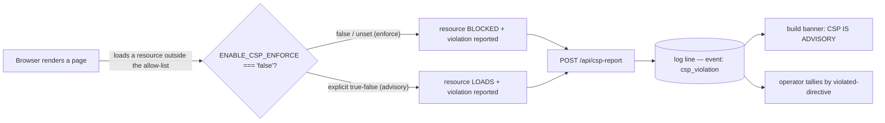

# Security headers

**New here?** HTTP response headers are instructions the server hands
the browser on every page: *don't let other sites frame me*
(`X-Frame-Options`), *only talk to me over HTTPS*
(`Strict-Transport-Security`), *only load scripts from this allow-list*
(`Content-Security-Policy`, "CSP"). They cost nothing at runtime and are
the first thing a large-customer security review greps for, so getting
them right is table stakes for enterprise.

## Design decision: enforcement is opt-**out**

`ENABLE_CSP_ENFORCE` is read, and **only an explicit `false` disables it**:

```js
const CSP_ENFORCE = process.env.ENABLE_CSP_ENFORCE !== "false";
const CSP_HEADER_KEY = CSP_ENFORCE
  ? "Content-Security-Policy"
  : "Content-Security-Policy-Report-Only";
```

`=== "true"` is the old behaviour, and unset is what production has always
been — which is exactly why unset now means *enforcing*. A flag that is
off unless switched on is off in every deployment that forgets, and
forgetting is the normal case: it is how the observation window was
never closed.

Setting `ENABLE_CSP_ENFORCE=false` re-opens report-only and **prints a
loud banner on every production build**, in `console.warn`, which
`compiler.removeConsole` does not strip (`error` and `warn` are
excluded; `log` is not). The banner names the runbook, states that
nothing is blocked, and says env changes are baked at build.

> **Rollback is a redeploy, not a config push.** `process.env` is read at
> config-evaluation time and lands in the `headers()` output, so a
> production env change does not take effect until the next deploy. This
> corrects an earlier claim in the operations runbook that said "no
> restart required"; that was wrong and cost a rollback window.

What enforcement is *not*: it is not a reason to keep the window open
forever. Leaving this advisory indefinitely is a finding on a security
audit, and the header it emits protects nothing — a real injection is
logged, not stopped.


```mermaid
flowchart LR
  B[Browser renders a page] -->|"loads a resource outside the allow-list"| EVAL{"ENABLE_CSP_ENFORCE === 'false'?"}
  EVAL -->|"false / unset (enforce)"| BLOCK["resource BLOCKED + violation reported"]
  EVAL -->|"explicit true-false (advisory)"| ALLOW["resource LOADS + violation reported"]
  BLOCK --> POST["POST /api/csp-report"]
  ALLOW --> POST
  POST --> LOG[("log line — event: csp_violation")]
  LOG --> WARN["build banner: CSP IS ADVISORY"]
  LOG --> OP["operator tallies by violated-directive"]
```

**The observation window only works if the reports actually arrive.**
`/api/csp-report` originally shared `spamLimiter`, which allows 5
requests per hour — a budget sized for a human deciding to file a support
ticket. A browser emits one report per violated directive per
navigation, so a single person opening a few dashboard pages exhausted
the hour in seconds and every subsequent report was rejected with a
`429`. The rollout was therefore blind in precisely the situation it
exists to observe. The endpoint now has its own limiter
(`cspReportLimiter`, 120/min on IP) sized for browser-generated volume.
If you add a report sink in future, size its limiter by **who generates
the traffic**, not by how much you want to receive.

## Header inventory (production)

All eight production headers, their values, and what each one defends
against:

| Header | Value | Notes |
|---|---|---|
| `Content-Security-Policy` | see `next.config.mjs` `CSP_DIRECTIVES` | becomes `Content-Security-Policy-Report-Only` only when `ENABLE_CSP_ENFORCE=false` |
| `Reporting-Endpoints` | `csp-endpoint="<RESOLVED_APP_URL>/api/csp-report"` | binds the `report-to` group to an **absolute** URL; omitted when the origin did not resolve |
| `Strict-Transport-Security` | `max-age=63072000; includeSubDomains; preload` | 2-year window + preload-list eligibility |
| `X-Frame-Options` | `DENY` | Anti-clickjacking |
| `X-Content-Type-Options` | `nosniff` | Anti-MIME-sniffing |
| `X-DNS-Prefetch-Control` | `off` | Reduces info leakage |
| `Referrer-Policy` | `strict-origin-when-cross-origin` | |
| `Permissions-Policy` | `camera=(self), microphone=(self), geolocation=(), payment=()` | Stream.io needs camera/mic; payment is iframe-scoped via Razorpay |

All are applied globally via `next.config.mjs` `async headers()` (the
single `source: "/(.*)"` block over `securityHeaders`). There are no
per-route overrides — the production allow-list is already narrow enough
to cover the dashboard surface (`/dashboard/organization/[orgId]/**`) and
the public marketplace pages alike.

`Reporting-Endpoints` is emitted in **both** header modes: reports keep
flowing after enforcement, they are just attached to a blocked request
instead. It is omitted when `RESOLVED_APP_URL` does not resolve, because
a `report-to` directive pointing at a group no header defines is a
silently-dropped directive — better to ship `report-uri` alone, which
still delivers.

## The full directive list

`CSP_DIRECTIVES`, in order, with the three "added without a compatibility
cost" directives marked. Anything not listed will be **blocked**,
because the policy is enforcing.

| Directive | Value |
|---|---|
| `default-src` | `'self'` |
| `script-src` | `'self' 'unsafe-inline' 'unsafe-eval'` + `checkout.razorpay.com`, `js.stripe.com`, `*.sentry.io`, `*.getstream.io`, `*.supabase.co`, **`challenges.cloudflare.com`** |
| `connect-src` | `'self'` + `*.getstream.io` (`wss:`), `*.stream-io-api.com` (`wss:`), `*.stream-io-video.com` (`wss:`), `*.stream-io-cdn.com`, `*.supabase.co`, `*.upstash.io`, `api.razorpay.com`, `api.stripe.com`, `*.sentry.io`, `api.resend.com`, `*.novu.co` (`wss:`) |
| `img-src` | `'self' data: https: blob:` |
| `media-src` | `'self' blob:` + `*.getstream.io`, `*.stream-io-cdn.com`, `*.stream-io-api.com` |
| `style-src` | `'self' 'unsafe-inline'` |
| `frame-src` | `'self'` + `checkout.razorpay.com`, `api.razorpay.com`, `js.stripe.com`, `hooks.stripe.com`, **`challenges.cloudflare.com`** |
| `font-src` | `'self' data:` |
| `frame-ancestors` | `'none'` |
| **`object-src`** | **`'none'`** |
| **`base-uri`** | **`'self'`** |
| **`form-action`** | **`'self'`** |
| `report-uri` | `/api/csp-report` |
| `report-to` | `csp-endpoint` (omitted when the origin did not resolve) |

### The three directives that were simply absent

`object-src 'none'`, `base-uri 'self'` and `form-action 'self'` are absent-by-
accident rather than by decision, and adding them costs nothing here: the app
ships no `<object>`/`<embed>`, no `<base>`, and every form action is
same-origin. That last fact is the point rather than an accident.

- **`object-src 'none'`.** No `<object>` or `<embed>` anywhere, and none of the
  allow-listed origins serve plugin content. Without it a plugin document
  inherits `default-src 'self'`, which still permits *same-origin* plugin
  content. `'none'` is a real control, not decoration. The payment iframes are
  `<iframe>` (covered by `frame-src`), not `<object>`.
- **`base-uri 'self'`.** Stops an injected `<base href>` from re-pointing every
  relative URL on the page — including form targets and lazy-loaded chunks — at
  an attacker's origin. `default-src` does **not** cover this: `base-uri` is one
  of the directives that does not fall back to it. Every route here uses
  absolute or root-relative URLs, so nothing depends on a `<base>`.
- **`form-action 'self'`.** Where a form without an explicit `action` may
  submit, and also **not** covered by `default-src`. The auth surface is why
  this is not merely theoretical: the sign-in and SSO forms post to
  same-origin `/api/auth/*`, so `'self'` permits every one of them, and the
  directive forecloses an injected form exfiltrating credentials to a third
  party.

### Cloudflare Turnstile in two directives

`challenges.cloudflare.com` is the bot gate on sign-up, sign-in, password-reset
and the SSO start. It appears in **both** `script-src` (for
`/turnstile/v0/api.js`) and `frame-src` (managed mode renders the challenge in
an iframe on that origin).

`connect-src` is deliberately **not** extended: only pre-clearance mode fetches
`/cdn-cgi/`, and we run interaction-only. The widget renders nothing when
`NEXT_PUBLIC_TURNSTILE_SITE_KEY` is unset, so dev and CI are unaffected and
neither origin is contacted on a deployment without the key.

### Stream.io does not run on getstream.io

This is the mistake the allow-list originally made, and it is worth stating
plainly because it is easy to repeat: `getstream.io` is Stream's **marketing
and documentation** domain. No SDK traffic goes there. The clients talk to three
unrelated domains, and a CSP host wildcard does not span them:

| Domain | Carries |
| --- | --- |
| `*.stream-io-api.com` | REST calls and both websockets (`wss://video.stream-io-api.com`, `wss://chat.stream-io-api.com`) |
| `*.stream-io-video.com` | the edge-latency hint (`hint.stream-io-video.com`) the client fetches *before* a call to choose an SFU, then the SFU edge itself |
| `*.stream-io-cdn.com` | call recordings and chat attachments |

Because only `*.getstream.io` was listed, every dashboard load filed violation
reports for traffic the product cannot function without, and video calling would
have failed outright the moment enforcement was switched on. The domains were
confirmed against a real browser network log on a deploy preview rather than
read off Stream's docs, which is the only way to catch this class of drift.

`*.getstream.io` remains in the list: Stream still serves some static assets
from it, and dropping it is a separate change with its own unobserved blast
radius.

### `script-src` keeps `'unsafe-eval'`, and that is not a pending cleanup

It stays until Next.js 16 ships hashed inline runtime chunks. It is also what
the Stream background-filter / noise-cancellation add-ons need — they are WASM
builds that `eval` their loader, and `worker-src` being absent is the companion
half of the same constraint. Removing it would break those add-ons the day they
are switched on, and until then it buys nothing that `'unsafe-inline'` in the
same directive does not already permit.

`worker-src` is deliberately **absent**. Nothing in the app constructs a
`Worker`, and the add-ons that would need `blob:` workers and
`wasm-unsafe-eval` are not installed. If they are ever adopted, that is the
directive which breaks first, and it falls back to `default-src 'self'`.

### Two origins that are easy to forget in a checkout path

`frame-src` allows Razorpay's checkout iframe from **both**
`checkout.razorpay.com` and `api.razorpay.com` — Razorpay serves the live
checkout iframe from `api.razorpay.com`, not just the CDN, which showed up as a
report-only violation on a real checkout. Razorpay checkout is the highest-risk
path on this page: a missing entry in `frame-src` or `script-src` breaks
payments for every customer at once.

## Rolling back

| Step | Action | Effect |
|---|---|---|
| 1 | Set `ENABLE_CSP_ENFORCE=false` in the **production** Netlify context | nothing yet — the value is read at config-evaluation time |
| 2 | Tally the reports by `violated-directive` | the actual diagnosis |
| 3 | Add any legitimate third party to `CSP_DIRECTIVES` in `next.config.mjs` | the fix |
| 4 | **Redeploy** | the header key changes to `Content-Security-Policy-Report-Only` |
| 5 | Re-deploy forward after the fix | enforcement restored |

A rollback that has to be undone by re-deriving a value is a second outage; the
redeploy is the whole cost, and it is one step.

## Auditing

The production headers are visible to anyone with `curl -sI`, which makes the
readiness check a one-liner.

```bash
curl -sI https://app.familiarise.work/ | grep -iE 'content-security|reporting-endpoints|strict-transport|x-frame'
```

Expected lines — an enforcing deployment:

```
content-security-policy: default-src 'self'; ...; report-uri /api/csp-report; report-to csp-endpoint
reporting-endpoints: csp-endpoint="https://familiarisenow.com/api/csp-report"
strict-transport-security: max-age=63072000; includeSubDomains; preload
x-frame-options: DENY
```

If you see `content-security-policy-report-only` on a deployment where nobody
set `ENABLE_CSP_ENFORCE=false`, the build banner in the deploy log is the reason
— go and read it.
