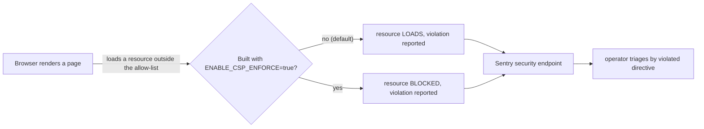

# Security headers

**New here?** HTTP response headers are instructions the server hands
the browser on every page: _don't let other sites frame me_
(`X-Frame-Options`), _only talk to me over HTTPS_
(`Strict-Transport-Security`), _only load scripts from this allow-list_
(`Content-Security-Policy`, "CSP"). They cost nothing at runtime and are
the first thing a large-customer security review greps for, so getting
them right is table stakes for enterprise.

## Design decision: report-only at launch

`ENABLE_CSP_ENFORCE` is read **at build time**, and only an explicit `true`
enforces:

```js
const CSP_ENFORCE = process.env.ENABLE_CSP_ENFORCE === "true";
const CSP_HEADER_KEY = CSP_ENFORCE
  ? "Content-Security-Policy"
  : "Content-Security-Policy-Report-Only";
```

Launch ships `Content-Security-Policy-Report-Only`. A drifted allow-list entry
under enforcement would break Razorpay checkout or Stream calls for every
customer at once, so violations are collected first and triaged in Sentry. Once
the stream is quiet, set `ENABLE_CSP_ENFORCE=true` and redeploy. Leaving the
policy advisory indefinitely is an audit finding: a report-only header logs an
injection, it does not stop one.

> **A change is a redeploy, not a config push.** `process.env` is read when
> `next.config.mjs` is evaluated and baked into the `headers()` output, so an
> env change takes effect at the next deploy.


```mermaid
flowchart LR
  B["Browser renders a page"] -->|"loads a resource outside the allow-list"| EVAL{"Built with ENABLE_CSP_ENFORCE=true?"}
  EVAL -->|"no (default)"| ALLOW["resource LOADS, violation reported"]
  EVAL -->|"yes"| BLOCK["resource BLOCKED, violation reported"]
  ALLOW --> SENTRY["Sentry security endpoint"]
  BLOCK --> SENTRY
  SENTRY --> OP["operator triages by violated directive"]
```

### Where reports go

Reports go straight to Sentry's security-report endpoint; the app has no report
route of its own. `next.config.mjs` derives the URL from
`NEXT_PUBLIC_SENTRY_DSN` (`https://<key>@<host>/<project>`):

```text
https://<host>/api/<project>/security/?sentry_key=<key>[&sentry_environment=<env>]
```

`sentry_environment` is added when `NEXT_PUBLIC_SENTRY_ENVIRONMENT` is set. The
URL is sent twice: as `report-uri` (deprecated, but the only mechanism some
browsers implement) and as `report-to csp-endpoint`, with the group bound by a
`Reporting-Endpoints` header. With no DSN (local dev) the policy carries no
report directive and no `Reporting-Endpoints` header.

## Header inventory (production)

| Header                                | Value                                                          | Notes                                                                       |
| ------------------------------------- | -------------------------------------------------------------- | --------------------------------------------------------------------------- |
| `Content-Security-Policy-Report-Only` | see `next.config.mjs` `CSP_DIRECTIVES`                         | becomes `Content-Security-Policy` when built with `ENABLE_CSP_ENFORCE=true` |
| `Reporting-Endpoints`                 | `csp-endpoint="<Sentry security URL>"`                         | omitted when there is no DSN                                                |
| `Strict-Transport-Security`           | `max-age=63072000; includeSubDomains; preload`                 | 2-year window + preload-list eligibility                                    |
| `X-Frame-Options`                     | `DENY`                                                         | Anti-clickjacking                                                           |
| `X-Content-Type-Options`              | `nosniff`                                                      | Anti-MIME-sniffing                                                          |
| `X-DNS-Prefetch-Control`              | `off`                                                          | Reduces info leakage                                                        |
| `Referrer-Policy`                     | `strict-origin-when-cross-origin`                              |                                                                             |
| `Permissions-Policy`                  | `camera=(self), microphone=(self), geolocation=(), payment=()` | Stream.io needs camera/mic; payment is iframe-scoped via Razorpay           |

All are applied globally via `next.config.mjs` `async headers()` (the single
`source: "/(.*)"` block over `securityHeaders`). There are no per-route
overrides. `poweredByHeader: false` drops `X-Powered-By`.

## The full directive list

`CSP_DIRECTIVES`, in order, with the three "added without a compatibility
cost" directives in bold. Anything not listed is reported now and will be
blocked once enforcement is on.

| Directive         | Value                                                                                                                                                                                                                                                       |
| ----------------- | ----------------------------------------------------------------------------------------------------------------------------------------------------------------------------------------------------------------------------------------------------------- |
| `default-src`     | `'self'`                                                                                                                                                                                                                                                    |
| `script-src`      | `'self' 'unsafe-inline' 'unsafe-eval'` + `checkout.razorpay.com`, `js.stripe.com`, `*.sentry.io`, `*.getstream.io`, `*.supabase.co`                                                                                                                         |
| `connect-src`     | `'self'` + `*.getstream.io` (`wss:`), `*.stream-io-api.com` (`wss:`), `*.stream-io-video.com` (`wss:`), `*.stream-io-cdn.com`, `*.supabase.co`, `*.upstash.io`, `api.razorpay.com`, `api.stripe.com`, `*.sentry.io`, `api.resend.com`, `*.novu.co` (`wss:`) |
| `img-src`         | `'self' data: https: blob:`                                                                                                                                                                                                                                 |
| `media-src`       | `'self' blob:` + `*.getstream.io`, `*.stream-io-cdn.com`, `*.stream-io-api.com`                                                                                                                                                                             |
| `style-src`       | `'self' 'unsafe-inline'`                                                                                                                                                                                                                                    |
| `frame-src`       | `'self'` + `checkout.razorpay.com`, `api.razorpay.com`, `js.stripe.com`, `hooks.stripe.com`                                                                                                                                                                 |
| `font-src`        | `'self' data:`                                                                                                                                                                                                                                              |
| `frame-ancestors` | `'none'`                                                                                                                                                                                                                                                    |
| **`object-src`**  | **`'none'`**                                                                                                                                                                                                                                                |
| **`base-uri`**    | **`'self'`**                                                                                                                                                                                                                                                |
| **`form-action`** | **`'self'`**                                                                                                                                                                                                                                                |
| `report-uri`      | the Sentry security URL (omitted without a DSN)                                                                                                                                                                                                             |
| `report-to`       | `csp-endpoint` (omitted without a DSN)                                                                                                                                                                                                                      |

### The three directives that were simply absent

`object-src 'none'`, `base-uri 'self'` and `form-action 'self'` are absent-by-
accident rather than by decision, and adding them costs nothing here: the app
ships no `<object>`/`<embed>`, no `<base>`, and every form action is
same-origin. That last fact is the point rather than an accident.

- **`object-src 'none'`.** No `<object>` or `<embed>` anywhere, and none of the
  allow-listed origins serve plugin content. Without it a plugin document
  inherits `default-src 'self'`, which still permits _same-origin_ plugin
  content. `'none'` is a real control, not decoration. The payment iframes are
  `<iframe>` (covered by `frame-src`), not `<object>`.
- **`base-uri 'self'`.** Stops an injected `<base href>` from re-pointing every
  relative URL on the page — including form targets and lazy-loaded chunks — at
  an attacker's origin. `default-src` does **not** cover this: `base-uri` is one
  of the directives that does not fall back to it. Every route here uses
  absolute or root-relative URLs, so nothing depends on a `<base>`.
- **`form-action 'self'`.** Where a form without an explicit `action` may
  submit, and also **not** covered by `default-src`. The auth surface is why
  this is not merely theoretical: the sign-in and SSO forms post to
  same-origin `/api/auth/*`, so `'self'` permits every one of them, and the
  directive forecloses an injected form exfiltrating credentials to a third
  party.

### Stream.io does not run on getstream.io

This is the mistake the allow-list originally made, and it is worth stating
plainly because it is easy to repeat: `getstream.io` is Stream's **marketing
and documentation** domain. No SDK traffic goes there. The clients talk to three
unrelated domains, and a CSP host wildcard does not span them:

| Domain                  | Carries                                                                                                                          |
| ----------------------- | -------------------------------------------------------------------------------------------------------------------------------- |
| `*.stream-io-api.com`   | REST calls and both websockets (`wss://video.stream-io-api.com`, `wss://chat.stream-io-api.com`)                                 |
| `*.stream-io-video.com` | the edge-latency hint (`hint.stream-io-video.com`) the client fetches _before_ a call to choose an SFU, then the SFU edge itself |
| `*.stream-io-cdn.com`   | call recordings and chat attachments                                                                                             |

Because only `*.getstream.io` was listed, every dashboard load filed violation
reports for traffic the product cannot function without, and video calling would
have failed outright the moment enforcement was switched on. The domains were
confirmed against a real browser network log on a deploy preview rather than
read off Stream's docs, which is the only way to catch this class of drift.

`*.getstream.io` remains in the list: Stream still serves some static assets
from it, and dropping it is a separate change with its own unobserved blast
radius.

### `script-src` keeps `'unsafe-eval'`, and that is not a pending cleanup

It stays until Next.js 16 ships hashed inline runtime chunks. It is also what
the Stream background-filter / noise-cancellation add-ons need — they are WASM
builds that `eval` their loader, and `worker-src` being absent is the companion
half of the same constraint. Removing it would break those add-ons the day they
are switched on, and until then it buys nothing that `'unsafe-inline'` in the
same directive does not already permit.

`worker-src` is deliberately **absent**. Nothing in the app constructs a
`Worker`, and the add-ons that would need `blob:` workers and
`wasm-unsafe-eval` are not installed. If they are ever adopted, that is the
directive which breaks first, and it falls back to `default-src 'self'`.

### Two origins that are easy to forget in a checkout path

`frame-src` allows Razorpay's checkout iframe from **both**
`checkout.razorpay.com` and `api.razorpay.com` — Razorpay serves the live
checkout iframe from `api.razorpay.com`, not just the CDN, which showed up as a
report-only violation on a real checkout. Razorpay checkout is the highest-risk
path on this page: a missing entry in `frame-src` or `script-src` breaks
payments for every customer at once.

## Switching enforcement on, and back off

Step-by-step in the
[CSP runbook](../50-operations/03-runbooks.md#content-security-policy-csp).
In short: triage the Sentry reports until only noise remains, set
`ENABLE_CSP_ENFORCE=true` in the production build environment and redeploy. To
roll back, remove the variable (or set it to anything but `true`) and redeploy.

## Auditing

The production headers are visible to anyone with `curl -sI`:

```bash
curl -sI https://<production-host>/ | grep -iE 'content-security|reporting-endpoints|strict-transport|x-frame'
```

Expected at launch (report-only):

```text
content-security-policy-report-only: default-src 'self'; ...; report-uri https://<sentry-host>/api/<project>/security/?sentry_key=<key>...; report-to csp-endpoint
reporting-endpoints: csp-endpoint="https://<sentry-host>/api/<project>/security/?sentry_key=<key>..."
strict-transport-security: max-age=63072000; includeSubDomains; preload
x-frame-options: DENY
```

After enforcement the first line starts `content-security-policy:` instead. No
`report-uri` means the build had no `NEXT_PUBLIC_SENTRY_DSN`.
