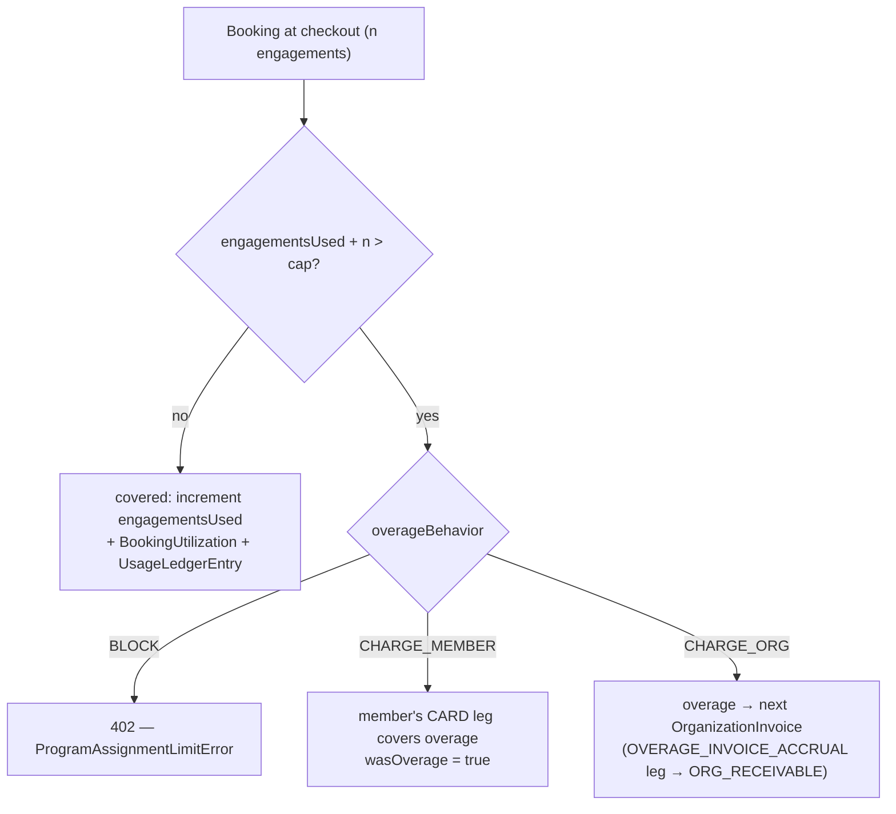

# Programs, assignments, and booking utilization

`Program` is the commercial primitive inside the enterprise layer.
Every sponsored booking **will be** attributed to a `ProgramAssignment`
(the per-member entitlement row), and every successful booking **will
leave** a `BookingUtilization` row + a `UsageLedgerEntry` twin.

> **Wiring status.** Schema, helpers (`recordBookingUtilization`,
> `claimProgramAssignment`, `reverseBookingUtilization`), management
> APIs, and the live checkout path are all wired up. Cap counting is
> done in **engagement units** — see "Counting model" below.

## Counting model — engagements, not bookings, not slots

The cap on a `LicensedSeatConfig` is denominated in **engagements**.
One engagement = one `Appointment` row = one calendar occurrence,
regardless of duration. This avoids two failure modes:

- **Counting bookings under-charges multi-session plans.** A 12-call
  SUBSCRIPTION purchased once at signup would burn 1 cap unit and the
  remaining 11 would escape — the bug fixed by issue #710.
- **Counting slots is commercially incoherent.** Orgs can't sell "8
  slots per cycle"; they sell occurrences. Per-occurrence price is
  governed separately by `priceCapPerEngagementPaise`.

| Plan type             | Cap units consumed                    | Debited at        |
|-----------------------|---------------------------------------|-------------------|
| 30-min CONSULTATION   | 1                                     | checkout          |
| 4-hour CONSULTATION   | 1 (price cap polices the duration)    | checkout          |
| WEBINAR (any length)  | 1                                     | checkout          |
| 8-week CLASS          | 8 (one per class day enrolment)       | checkout          |
| 12-call SUBSCRIPTION  | 1 per consultant allocation (lazy)    | slot allocation   |

The term **engagement** was picked to avoid collision with BetterAuth
`Session` and Stream's `MeetingSession` (which is a video-call record,
not a billing unit).

## Booking → cap → overage



The counter increment + ledger twin are written atomically in one transaction; see [concurrency & idempotency](20-concurrency-and-idempotency.md). `CREDIT_POOL` programs apply the same shape with the cap denominated in credits (1 credit = ₹1).

## Schema

```prisma
model Program {
  id   String @id @default(uuid())
  contractId String
  type       ProgramType     // LICENSED_SEAT | CREDIT_POOL | PROJECT (v2) | RETAINER (v2)
  name       String
  status     ProgramStatus @default(ACTIVE)
  coveredPlanTypes  CoveredPlanType[]
  allowedCategories String[]

  licensedSeatConfig LicensedSeatConfig?
  creditPoolConfig   CreditPoolConfig?

  assignments ProgramAssignment[]
  ...
}
```

The subtype is declared by `type`, and the corresponding config row is
one of two sibling tables. The pre-Arch-4 `customConfig: Json` escape
hatch was removed — bespoke splits live on a per-Program rate-card
override (see `docs/enterprise/10-booking-to-earnings.md`) rather
than as JSON blobs that the typed config tables can't enforce.

## `LicensedSeatConfig`

```prisma
model LicensedSeatConfig {
  programId                  String @id
  ratePerSeatPaise           Int
  cycle                      BillingCycle  // MONTHLY | QUARTERLY | ANNUAL
  coveredEngagementsPerCycle Int?          // null = unlimited (LICENSE)
  overageBehavior            OverageBehavior @default(BLOCK)
  activeSeatCount            Int @default(0)
  priceCapPerEngagementPaise Int?
}
```

- `coveredEngagementsPerCycle = null` is the v1 "unlimited" marker —
  it is the new home for the pre-Arch-4 `PREPAID_UNLIMITED` billing
  mode. A LICENSE-funded org typically has exactly one LICENSED_SEAT
  Program with this column null.
- `priceCapPerEngagementPaise` limits the grossAmount the program will
  absorb for a single engagement. If a plan price exceeds the cap, the
  excess is treated as overage and routed according to
  `overageBehavior`.
- `activeSeatCount` is the aggregate across non-completed assignments.
  A follow-up cron reconciles drift nightly.

## `CreditPoolConfig`

```prisma
model CreditPoolConfig {
  programId               String @id
  cycle                   BillingCycle
  creditsPerCycle         Int                // hard cap (1 credit = ₹1)
  minimumCreditsPerPeriod Int?
}
```

Pool with a per-cycle credit cap. `creditsPerCycle` is the hard cap
when `overageBehavior=BLOCK` (and the soft cap when overage routes
elsewhere). `minimumCreditsPerPeriod` is an optional commitment
minimum that rolls into the next invoice if unconsumed.

**1 credit = ₹1 = 100 paise. Fixed.** The per-credit value + tier
multiplier columns that an earlier draft carried were dropped before
launch — they were never branched in checkout and only added a
translation layer that finance and audit dashboards had to undo at
read time. Per-tier rate adjustments now live on a Program rate-card
override (see `10-booking-to-earnings.md`).

A credit debit moves money exactly like any other WALLET booking: the
`BOOKING` `LedgerTransaction` debits the `WALLET(org)` journal account,
and `walletDebit()` decrements the `BillingAccount.walletBalance`
*cache* in the same conditional UPDATE (see
`08-ledger-and-postings.md` / `09-wallet-and-topups.md`). The
CreditPool Program is the *policy*, not the storage.

## `ProgramAssignment`

```prisma
model ProgramAssignment {
  id           String @id @default(uuid())
  programId    String
  membershipId String

  periodStart DateTime
  periodEnd   DateTime

  engagementsUsed Int @default(0)
  overageCount    Int @default(0)

  utilizations BookingUtilization[]

  @@unique([programId, membershipId, periodStart])
  @@index([membershipId, periodEnd])
}
```

One row per (Program, Membership, cycle). `claimProgramAssignment()`
in `lib/api/organizations/program-helpers.ts` upserts on the composite
unique, which makes the claim idempotent under concurrent bookings.

`engagementsUsed` is incremented atomically by an inline conditional
SQL UPDATE inside `recordBookingUtilization()` (so the cap check and
the increment can't race); a nightly cron reconciles it against
`sum(UsageLedgerEntry.engagementsConsumed)` where the ledger is the
source of truth.

## `BookingUtilization`

```prisma
model BookingUtilization {
  id                  String @id @default(uuid())
  programAssignmentId String
  paymentId           String @unique
  engagementsConsumed Int @default(1)
  priceAtBookingPaise Int
  wasOverage          Boolean @default(false)

  // Rate-card snapshot (ties to OrganizationEarnings for settlement).
  platformBpsAtBooking   Int?
  orgBpsAtBooking        Int?
  consultantBpsAtBooking Int?

  // Reversal marker. Row is never deleted.
  reversedAt     DateTime?
  reversalReason String?
  ...
}
```

The rate-card snapshot columns mirror the ones on
`OrganizationEarnings` (see `10-booking-to-earnings.md`). Settlement
reconciliation compares these two snapshots to detect drift.

`paymentId` is `@unique` — one row per Payment. For SUBSCRIPTION's
lazy allocation pattern, `recordBookingUtilization()` upserts and
*increments* `engagementsConsumed` on subsequent allocations rather
than inserting a new row. The append-only `UsageLedgerEntry` still
gets one row per call, so `sum(ledger.engagementsConsumed)` per
payment equals the upserted `BookingUtilization.engagementsConsumed`.

### Reversal (refund path)

`reverseBookingUtilization()` stamps `reversedAt = now()` and appends
an opposing `UsageLedgerEntry` with negative `engagementsConsumed`.
The row is never deleted because:

- Partial refunds may run more than once per booking — the original
  row is still needed.
- Point-in-time analytics ("who used seats on 2026-04-10?") must
  still find the row.
- Audit trail needs the original cap decision.

The `engagementsUsed` counter on the parent assignment is decremented
at the same time, by the row's full `engagementsConsumed`. Partial
reversal of a SUBSCRIPTION (refunding one allocated call out of N)
isn't supported by this helper — it requires a per-call helper that
doesn't exist yet.

## `OverageBehavior`

| Value           | When a LICENSED_SEAT assignment exceeds cap                |
|-----------------|------------------------------------------------------------|
| `BLOCK`         | Checkout throws `ProgramAssignmentLimitError` → HTTP 402. |
| `CHARGE_MEMBER` | Booking proceeds. Learner pays the overage on their own card. `wasOverage = true`. |
| `CHARGE_ORG`    | Booking proceeds. Overage is attributed to the next `OrganizationInvoice` cycle. |

## API surface

| Route | Verbs | Role |
|-------|-------|------|
| `/api/organizations/[orgId]/programs` | `GET` | any active member |
| `/api/organizations/[orgId]/programs` | `POST` | MAINTAINER |
| `/api/organizations/[orgId]/programs/[programId]` | `GET` | any active member |
| `/api/organizations/[orgId]/programs/[programId]` | `PATCH`, `DELETE` | MAINTAINER |
| `/api/organizations/[orgId]/programs/[programId]/assignments` | `GET` | any active member |
| `/api/organizations/[orgId]/programs/[programId]/assignments` | `POST` | MAINTAINER |
| `/api/organizations/[orgId]/programs/[programId]/assignments/[assignmentId]` | `GET` | any active member |
| `/api/organizations/[orgId]/programs/[programId]/assignments/[assignmentId]` | `PATCH`, `DELETE` | MAINTAINER |

The POST body is a Zod `discriminatedUnion("type", [...])` so a
`LICENSED_SEAT` body with `creditPoolConfig` fails validation at the
edge, not at the FK layer. See
`app/api/organizations/[orgId]/programs/route.ts`.

## Related docs

- `02-funding-and-programs.md` — funding × program matrix.
- `10-booking-to-earnings.md` — where the bps snapshots feed.
- `20-concurrency-and-idempotency.md` — upsert-based claim pattern.
- `08-ledger-and-postings.md` — UsageLedgerEntry invariants.
