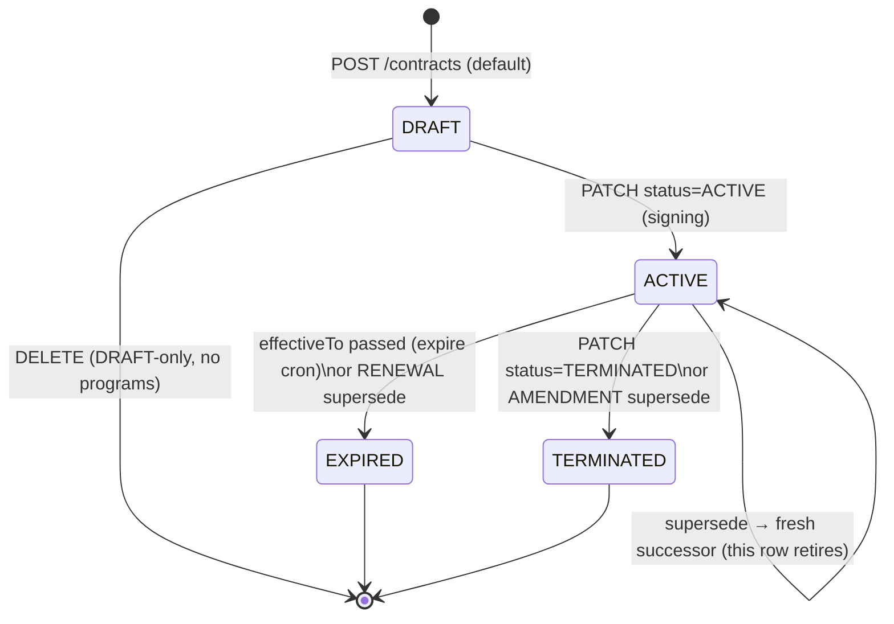

# Contract lifecycle

> **What this covers:** the `Contract` state machine (DRAFT → ACTIVE →
> EXPIRED/TERMINATED), auto-renewal, the supersession chain (amend/renew/
> replace), the end-early/terminate mutation guard + in-tx cascade, and which
> term fields lock once a contract is in use. **Audience:** engineers touching
> contract CRUD, the renewal/expiry crons, or the program/assignment lifecycle
> that hangs off a contract. Last verified against code 2026-06-05 (#779 §A).

A `Contract` is the negotiated commercial relationship between an org and the
platform. Every `Program` hangs off exactly one contract
(`Program.contractId`), and the [cycle engine](27-cycle-engine-and-rollover.md)
only rolls an assignment forward while its governing contract is `ACTIVE` —
so the contract state machine is the spine that the program/assignment
lifecycle is clamped to.

## State machine



- **DRAFT** — created but not signed. Terms are still editable; the row can be
  hard-deleted (only while it has no programs and no invoices).
- **ACTIVE** — signed (`signedAt` stamped, status flipped to `ACTIVE`). Terms
  lock (see *Field locking* below); programs draw against it; invoices bill
  against it.
- **EXPIRED** — `effectiveTo` passed and the expiry cron flipped it, **or** a
  RENEWAL supersede retired it (the completed term ended). Soft enforcement:
  expiry does **not** take the org offline.
- **TERMINATED** — ended early by an operator, **or** retired by an AMENDMENT
  supersede (a live term replaced mid-flight).

`effectiveTo = null` means open-ended — it never auto-expires and the cycle
engine never clamps against it.

## Schema

```prisma
model Contract {
  id               String         @id @default(uuid())
  organizationId   String
  organization     Organization   @relation(fields: [organizationId], references: [id], onDelete: Cascade)
  billingAccountId String
  billingAccount   BillingAccount @relation(fields: [billingAccountId], references: [id])
  purchaseOrderId  String?
  purchaseOrder    PurchaseOrder? @relation(fields: [purchaseOrderId], references: [id])

  status           ContractStatus @default(DRAFT)
  signedAt         DateTime?
  effectiveFrom    DateTime
  effectiveTo      DateTime?
  paymentTermsDays Int            @default(60)
  autoRenew        Boolean        @default(false)

  rateCardId     String?
  rateCard       RateCard?  @relation("ContractRateCard", fields: [rateCardId], references: [id])
  ownedRateCards RateCard[] @relation("RateCardOwnerContract")

  programs     Program[]
  subscription BillingSubscription?
  invoices     OrganizationInvoice[]

  /// #779 §A — amendment/renewal/supersession chain. The OLD row points forward
  /// here; the new row is a fresh Contract. Self-join answers "what replaced X?".
  supersededByContractId String?    @unique
  supersededByContract   Contract?  @relation("ContractSupersession", fields: [supersededByContractId], references: [id], onDelete: SetNull)
  supersededContract     Contract?  @relation("ContractSupersession")
  supersededAt           DateTime?
  supersessionReason     ContractSupersessionReason?
  /// #779 §A — set by the auto-renew cron so renewal is idempotent (claim gate).
  autoRenewedAt DateTime?

  createdAt DateTime @default(now())
  updatedAt DateTime @updatedAt

  @@index([organizationId, status])
  @@index([effectiveFrom, effectiveTo])
}

enum ContractStatus {
  DRAFT
  ACTIVE
  EXPIRED
  TERMINATED
}

enum ContractSupersessionReason {
  AMENDMENT
  RENEWAL
  TERMINATION_REPLACEMENT
}
```

## Field locking — terms are committed once in use 🔒

Contract terms become read-only the moment the contract is committed.
`isContractTermsLocked` (`lib/enterprise/config-lock.ts`) returns locked when
`status !== "DRAFT"` **or** any invoice has been issued **or** any program
under it has a live (in-window) assignment. The locked term fields are:

```ts
// lib/enterprise/config-lock.ts
export const LOCKED_CONTRACT_FIELDS = [
  "billingAccountId",
  "effectiveFrom",
  "effectiveTo",
  "paymentTermsDays",
  "rateCardId",
] as const;
```

The PATCH route enforces a narrower runtime subset (`effectiveFrom`,
`effectiveTo`, `paymentTermsDays`) — editing any of those on a locked contract
returns `409 CONTRACT_TERMS_LOCKED`. `autoRenew` is deliberately **not** locked:
it's a forward-looking toggle that can't rewrite already-settled money, so an
operator can flip it on a live contract at will. The `GET` route returns a
`locked` boolean alongside the contract so the edit drawer disables the locked
inputs without a second round-trip. The rationale mirrors the
[RateCard bump](10-booking-to-earnings.md) / program config-lock immutable
pattern: to change committed terms you **supersede**, you don't mutate.

## Supersession chain — amend / renew / replace

Contracts are immutable once in use, so the only way to change committed terms
is to **supersede**: mint a successor with the new terms, re-point the programs,
and retire the old row with the chain recorded. The OLD row points forward via
`supersededByContractId @unique` (that `@unique` is the double-run backstop —
a second supersede on the same contract hits `P2002`).

| Reason | Trigger | Successor `effectiveFrom` | Old contract → | Set by |
|---|---|---|---|---|
| `AMENDMENT` | mid-term terms change | now (cut-over) | `TERMINATED` | supersede route |
| `RENEWAL` | term rollover | old `effectiveTo` (same duration default) | `EXPIRED` | supersede route **or** auto-renew cron |
| `TERMINATION_REPLACEMENT` | system-set replacement | — | — | system only |

The supersede route (`POST /api/organizations/[orgId]/contracts/[contractId]/supersede`)
accepts **only** `AMENDMENT | RENEWAL` in its Zod body — `TERMINATION_REPLACEMENT`
is reserved for system-initiated replacements and is never client-settable.
In the supersede transaction:

1. Guard: the old contract must be `ACTIVE` (`409 CONTRACT_NOT_ACTIVE`) and not
   already superseded (`409 CONTRACT_ALREADY_SUPERSEDED`).
2. Create the successor (`status = ACTIVE`, `signedAt = now` — the supersede
   action *is* the signing event for the new terms). Omitted fields carry over
   from the old contract.
3. `program.updateMany({ where: { contractId: old } })` re-points every program
   to the successor — without this the cycle engine would see a non-ACTIVE
   contract at the next `periodEnd` and CLOSE the assignments instead of
   rolling them.
4. Stamp the old row: `supersededByContractId`/`supersededAt`/
   `supersessionReason`, and flip it to `TERMINATED` (AMENDMENT) or `EXPIRED`
   (RENEWAL).
5. Emit `CONTRACT_SUPERSEDED` audit.

**Invoices keep their old `contractId`** — the money trail stays on the term
that actually billed them.

## Auto-renew cron

`jobs/contracts/auto-renew-contracts.ts` (GitHub Action
`.github/workflows/auto-renew-contracts.yml`, daily `30 2 * * *` UTC) is the
unattended RENEWAL path. It runs **30 min before** the expiry cron so renewal
wins the race: a contract that's been superseded is no longer the governing
term, so leaving two ACTIVE contracts on one org would double-count billing.

Per contract due (`status = ACTIVE`, `autoRenew = true`, `autoRenewedAt = null`,
`effectiveTo <= now`):

1. **Claim** by stamping `autoRenewedAt` via a conditional `updateMany` (the
   gate doubles as the distributed lock; `count === 0` ⇒ another replica won →
   skip).
2. Mint the RENEWAL successor — same org / billingAccount / PO / payment terms /
   rate card, `effectiveFrom = old.effectiveTo`, `effectiveTo = old.effectiveTo +
   (old duration)`, `status = ACTIVE`, `autoRenew` carried.
3. Re-point programs to the successor (same reason as the manual path).
4. Stamp `supersededByContractId`/`supersededAt`/`supersessionReason = RENEWAL`
   and flip the **old** contract to `EXPIRED` in the same tx (not left ACTIVE
   for the expiry cron).
5. Emit `CONTRACT_AUTO_RENEWED` audit.

The renewal is a **fresh Contract** (supersession), not an in-place
`effectiveTo` bump — this keeps each term's invoices anchored to the term that
billed them. Idempotency: `autoRenewedAt` is the claim gate, and
`supersededByContractId @unique` trips `P2002` if two replicas slip past it
(caught + skipped cleanly).

## Expiry cron

`jobs/contracts/expire-contracts.ts` (GitHub Action
`.github/workflows/expire-contracts.yml`, daily `0 3 * * *`) flips any contract
still `ACTIVE` whose non-null `effectiveTo` has passed → `EXPIRED`. By the time
it runs, auto-renew has already moved anything renewable, so it only catches
non-renewing terms.

**Soft enforcement** — expiry does *not* take the org offline
(`requireOrgAccess` still honours the org). The effects are:

1. New subscription-invoice rolls only generate while the contract is `ACTIVE`
   (see `jobs/billing/generate-subscription-invoices.ts`).
2. The contract's `ACTIVE` programs → `EXPIRED` and their still-live
   assignments (`periodEnd >= now`) → `CLOSED` with `periodEnd` clamped to now,
   so members stop drawing from caps (in-flight bookings complete normally).
   History rows stay queryable for reconciliation.
3. The dashboard renders an expiry banner so operators renew.

Idempotent: the claim `updateMany WHERE status = ACTIVE` means a same-day re-run
or second replica is a no-op.

## End-early / terminate flow

Terminating a live contract is a guarded PATCH (`status = TERMINATED`) on
`/api/organizations/[orgId]/contracts/[contractId]` — **OWNER + canSponsor**.
The guard refuses to sever a money trail or orphan an entitlement:

- **Live-assignment block:** if any `ProgramAssignment` under the contract is
  still in its current cycle (`periodEnd >= now`), the PATCH returns `409` —
  *"Cancel the assignments first or wait for the cycle to expire."* Without this,
  checkout would 500 on the now-parentless assignment lookup. This is the
  dangerous-mutation guard pattern: a status precondition + a count block + an
  in-tx cascade (no `riskLevel` field exists anywhere).
- **Outstanding-invoice block:** if any invoice billed under the contract is
  `ISSUED` or `OVERDUE`, the PATCH returns `409 CONTRACT_HAS_OUTSTANDING_INVOICES`
  (with `counts`). DRAFT invoices haven't billed, so they don't block.

Once the guards pass, the **in-tx cascade** flips the contract's `ACTIVE`
programs → `EXPIRED` and their still-`ACTIVE` assignments → `CLOSED`, so nothing
is left drawing against a dead contract. A dedicated `CONTRACT_TERMINATED`
audit row is written.

`DELETE` is DRAFT-only (and only when the contract has no programs): an active
contract must be terminated via PATCH so the audit timeline keeps continuity.

## Route table

| Route | Verb | Role gate |
|---|---|---|
| `/api/organizations/[orgId]/contracts` | `GET` | MAINTAINER + canSponsor |
| `/api/organizations/[orgId]/contracts` | `POST` | OWNER + canSponsor + **requireActive** |
| `/api/organizations/[orgId]/contracts/[contractId]` | `GET` | MAINTAINER + canSponsor |
| `/api/organizations/[orgId]/contracts/[contractId]` | `PATCH` | OWNER + canSponsor |
| `/api/organizations/[orgId]/contracts/[contractId]` | `DELETE` | OWNER + canSponsor (DRAFT-only) |
| `/api/organizations/[orgId]/contracts/[contractId]/supersede` | `POST` | OWNER + canSponsor |

`POST /contracts` requires a verified/active org (`requireActive: true`) —
nothing should bind the platform to an org that hasn't cleared verification.
A LICENSE-funded contract may carry a flat-fee `BillingSubscription` at create
time (created atomically in the same tx).

## Related docs

- [Funding and programs](02-funding-and-programs.md) — funding × program matrix
  that contracts sit above.
- [Organization lifecycle](04-organization-lifecycle.md) — org-level states
  (verification, suspension) that gate contract creation.
- [Programs](21-programs.md) — the program/assignment accounting that hangs off
  a contract.
- [Cycle engine & rollover](27-cycle-engine-and-rollover.md) — how the contract
  state clamps assignment roll-vs-close.
- [Invoicing](12-invoicing.md) — invoices that reference a contract and block
  its termination while outstanding.
