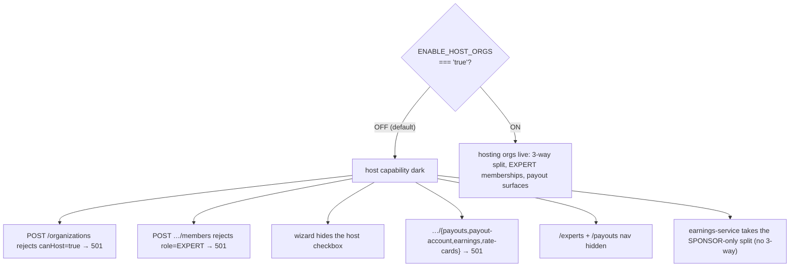

# Feature flags and rollout

> **What this covers:** the five module-level feature flags in
> `lib/feature-flags.ts` (purpose, default, gated surfaces), the non-module
> `process.env` gates that live next to the code they guard, and the
> capability-gated UI + WIP-banner pattern the layer ships behind. **Audience:**
> anyone flipping a flag for a customer go-live or reading why a wired surface
> is dark. Last verified against code 2026-06-05 (#776/#777).

Flags are read from `process.env` **at module load**. Setting one requires a
redeploy — deliberate: we never want a runtime flip on a billing-affecting
feature, because mid-stream some payments would take one settlement path and
others another. To enable a flag locally, add it to `.env` (or export it) before
`npm run dev`.

## Module flags (`lib/feature-flags.ts`)

Exactly five flags are exported from the module. Each is the literal
`process.env.X === "true"` so absent/empty ⇒ off.

| Flag | Default | Purpose | Gated surfaces when OFF |
|---|---|---|---|
| `ENABLE_HOST_ORGS` | off | Hosting orgs (agencies hosting experts, 3-way split). | `POST /organizations` rejects `canHost=true` (501); `POST …/members` rejects `role=EXPERT` (501); org-create wizard hides the host checkbox; `…/{payouts,payout-account,earnings,rate-cards}` return 501; `/experts` + `/payouts` nav hidden; `earnings-service` takes the sponsor-only split. |
| `ENABLE_LIVE_PAYOUTS` | off | Live payout **disbursement** gate (#776 §B). | The whole pipeline runs (batches, ledger, TDS, status machine) but gateway submission is held; org/consultant payouts sit `PROCESSING`, surfaced honestly as "pending platform enablement", **never** as a failure. Server-only — the home action-center + payout surfaces read it server-side and pass the boolean down. |
| `ENABLE_IRP_UPLOADER` | off | IRP (Invoice Registration Portal) live e-invoice submission. | ClearTax GSP connector is wired (`lib/compliance/irp.ts`, `jobs/compliance/irp-uploader.ts`) but the GitHub Action short-circuits so CI doesn't burn minutes on a stub; sub-₹5cr orgs ride the `{ status: "FAILED", reason: "STUB" }` return (they don't need IRN to claim ITC). |
| `ENABLE_TDS_ADMIN_VIEW` | off | Admin TDS dashboard + Form 26Q filing surfaces. | `app/api/admin/tds/route.ts` returns 404 (hides from discovery). TDS data is still captured continuously by the payout pipeline; only the *filing workflow* (mark-as-filed, decrypted-PAN view) is gated. |
| `ENABLE_BETTERSTACK_TELEMETRY` | off | Better Stack Telemetry log sink for operational events (#776 §K). | `recordSystemEvent`/`recordSystemError` always write the `SystemEvent` table (source of truth); the flag (plus `BETTERSTACK_SOURCE_TOKEN` + `BETTERSTACK_INGEST_URL`) only adds the fire-and-forget side-channel that ships those events so a stuck payout / failed reconcile / HMAC failure can page someone. Never on the critical path. |

`ENABLE_HOST_ORGS` is the broadest of the five — flipping it off doesn't just
hide a page, it changes the **split math** and dark-fails a whole capability.
Worth drawing the blast radius so a go-live engineer sees everything one flag
governs:

> 🔒 **`ENABLE_HOST_ORGS` was renamed from `ENABLE_PROVIDER_ORGS`** in the Arch-4
> terminology purge (the rationale is preserved verbatim in the flag's own
> doc-comment, `lib/feature-flags.ts:39`) — "provider" is dead vocabulary; the
> capability is `canHost` and the kind label is `HOST`. No back-compat shim
> (pre-launch). This is the only historical alias worth knowing; nothing reads
> the old name.

> **What this design survived — the PROVIDER→HOST purge.** "Provider" was the
> Arch-3 word for a hosting org, and it was load-bearing in a flag name, a
> capability boolean, an enum label, and a wall of copy. The purge renamed all
> of it in one sweep with **no compatibility shim** — viable only because the
> app is pre-launch, so no persisted `ENABLE_PROVIDER_ORGS` value exists in any
> deployed env to honour. The doc-comment at `lib/feature-flags.ts:39` is the
> single surviving mention of the old name, kept deliberately so a `git log -S`
> for "PROVIDER" lands somewhere that explains the rename instead of a silent
> gap. Post-launch, this rename would have needed a dual-read shim and a
> migration window.

Each flag's go-live checklist lives in its module doc-comment (and a tracking
issue: host #646/#662, live-payout `docs/enterprise/50-operations/06-live-payout-go-live-runbook.md`,
IRP #713, TDS #737). None is a runtime toggle.

## Non-module env gates

These are read inline at the point of use rather than re-exported from
`lib/feature-flags.ts` — they gate a single call-site, so centralising them
would only add indirection.

| Env var | Read at | Effect |
|---|---|---|
| `ENABLE_STRIPE_PAYOUTS` | `app/api/webhooks/stripe/route.ts` | When `!= "true"`, inbound Stripe Connect `transfer.*` / payout webhook events are logged-and-ignored (the platform settles via Razorpay; Stripe Connect payout rails are not live). |
| `ENABLE_ROUTED_WALLET` | `lib/payments/payouts/razorpay-route.ts` | Gates the Razorpay **Route** (linked-account) wallet path. Off ⇒ the routed-wallet branch is skipped. |
| `ENABLE_MOCK_PAYMENTS` | `lib/payments/operations/mock.ts` | Test/dev only — when `"true"`, the mock payment operator stands in for the real gateway so flows run without hitting Razorpay. Must stay off in production. |
| `MAX_INVOICE_BOOKING_PAISE` | `lib/enterprise/governance.ts#getInvoiceCreditLimitPaise` | Numeric override (not a boolean). Sets the starter credit limit for new, not-yet-verified INVOICE-funded orgs for staged ramps; falls back to ₹50,000 (`50_000_00`) when unset/non-positive. Defends the "book everything then ghost" abuse pattern (#687). |

## Capability-gated UI

The dashboard sidebar reads the org's `canSponsor` / `canHost` / `fundingSource`
booleans and the caller's `MemberRole`, and hides pages that would 404/403/501.
See [dashboard pages](04-dashboard-pages.md) for the full matrix. Capability
gating is a **navigation-level hide only** — the API gates stay role-based, so a
MAINTAINER on a `canHost=false` org who hand-crafts `GET …/payouts` gets a 501
(host endpoints) or empty data, not a leak. A `canSponsor=false` org never sees
`/contracts`, `/programs`, `/billing`, `/purchase-orders`; a `canHost=false` org
never sees `/experts` or `/payouts`.

## WIP banners — partial implementations stay visible

The enterprise grid has permutations whose schema + API are wired but whose
end-to-end financial/dashboard surface is still in flight. Rather than hide them
(and risk forgetting to re-enable), we keep them selectable and mount a WIP
banner at the call site linking the open issue — the gap stays auditable. The
component is `components/enterprise/EnterpriseWipBanner.tsx`; the matching
server-side `TODO(#NNN)` comments sit next to the schemas that accept these
values so a surface sweep finds every permutation in one search. When a
permutation's downstream effect ships, drop the banner and its `TODO(#NNN)` in
the same commit.

## Plan visibility (`OrgPlanVisibility`)

Org-owned plans (`ConsultationPlan` / `SubscriptionPlan` / `WebinarPlan` /
`ClassPlan` with `organizationId` set) carry an `OrgPlanVisibility` enum
(`PUBLIC` / `ORG_ONLY` / `ORG_AND_PUBLIC`, default `PUBLIC`). Public marketplace
endpoints filter via `lib/api/plans/visibility.ts` so an `ORG_ONLY` plan never
leaks to `/explore/**`; org-internal catalog surfaces deliberately skip the
filter. Full detail in [public pages & discovery](05-public-pages-and-discovery.md).

## Data-residency flag

Not a feature flag per se: `Organization.dataResidencyRegion: DataRegion` is read
at write time for audit logs + consent artifacts. Rows written against an `IN`
org must never replicate to US-hosted infra. v1 enforces this at the application
layer via a `lib/compliance/` helper; a DB-trigger backstop is a future PR.

## Rollout sequence

The layer ships in one piece — there is no per-funding-source flag (wallet vs
invoice vs license share one already-deployed schema). The order for a new
customer:

1. Sponsor org onboarding (`PERSONAL` or `WALLET` to start).
2. Invite members (LEARNER role).
3. First test booking exercising the full `PaymentLeg` path.
4. (Optional) Upgrade to `INVOICE` or `LICENSE` once a contract is signed.
5. (Optional) Enable `canHost` once host-side KYC clears (needs `ENABLE_HOST_ORGS`).

## Related docs

- [Organization types](../00-foundations/02-organization-types.md) — the capability booleans.
- [Dashboard pages](04-dashboard-pages.md) — page-by-page visibility matrix.
- [Public pages & discovery](05-public-pages-and-discovery.md) — `OrgPlanVisibility` filtering.
- [Scenarios & examples](../60-scenarios-and-verdicts/01-scenarios-and-examples.md) — worked end-to-end flows.
