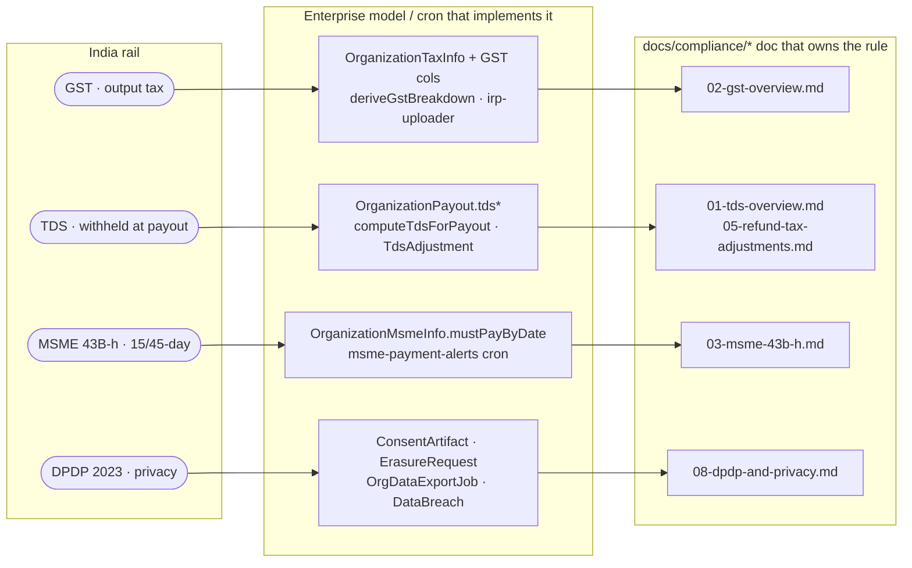

# Compliance: GST · TDS · MSME · DPDP (enterprise touchpoints)

**What this covers:** where the enterprise subsystem *touches* India statutory compliance, and the journal/schema hooks behind each. This is the **enterprise-side map**; the authoritative rules, rates, thresholds, and roadmap live in [`../compliance/`](../../compliance/00-overview.md) — this doc links out rather than restating tax law.

New to this codebase? Four India rails matter for B2B: **GST** (the sales tax we add to invoices), **TDS** (tax withheld *out of* what we pay consultants/host-orgs), **MSME** (a law forcing prompt payment to small suppliers), and **DPDP** (India's GDPR-equivalent privacy law). This doc is the thin "which model/cron implements which rail" index — every rail is one or two columns plus a cron, and the deep rules live one tree over in `docs/compliance/*`.

> **Division of labour.** `docs/compliance/*` owns the regulatory obligation (what the law requires). This doc owns the wiring (which model/posting/cron implements it on the enterprise side). When they disagree, the compliance docs win on *rules*, the code wins on *behaviour*.

Read the columns left-to-right: *rail → the enterprise schema/cron that
wires it → the compliance doc that owns the rule*. The four numbered
sections below expand each row; §5 lists the crons; §6 is the
everything-else table.

---

## 1. GST (output tax on bookings & invoices)

- **Where it posts.** Every booking credits `GST_PAYABLE` with `Payment.taxAmount` ([ledger & postings](../10-money-and-ledger/03-ledger-and-postings.md) §4.2); a refund reverses the prorated GST share (§4.7). `GST_PAYABLE` is a platform liability — collected, owed to the government until remitted.
- **Invoice breakdown.** `OrganizationInvoice` carries `igstPaise` / `cgstPaise` / `sgstPaise` / `placeOfSupply`, derived by `deriveGstBreakdown()` (`lib/compliance/gst.ts`) from place-of-supply — intra-state splits CGST+SGST, inter-state is IGST. The org's GST identity lives on the `OrganizationTaxInfo` carve-out (`gstin`, `gstStateCode`, `gstRegStatus`, `hsnDefault` — #768 moved these off the `Organization` God-Model). See [invoicing](../10-money-and-ledger/08-invoicing.md).
- **Credit notes on refund.** A refund mints a sequential `CreditNote` (per-org, CGST Rule 53) via the idempotent `mintRefundCreditNote` (`lib/payments/operations/refund.ts`; numbering in `lib/payments/billing/credit-note-numbering.ts`). `CreditNote.refundId @unique` makes minting idempotent across webhook redeliveries / cron retries. The invoice-side variant is `mintInvoiceRefundCreditNote`. See [invoicing](../10-money-and-ledger/08-invoicing.md).
- **GST TCS (u/s 52).** Per-payment collection + per-earning accrual reconcile into one monthly `GstTcsBatch` (GSTR-8); refunds net a `GstTcsAdjustment` into the period's batch. Collection + filing are flag-gated pending CA sign-off.
- **e-invoice / IRN.** `OrganizationInvoice.{irn, ackNumber, signedQrPayload, irpStatus, irpRetryCount}` are schema-final. The IRP uploader is **body-live but env-gated** behind `ENABLE_IRP_UPLOADER` + ClearTax GSP creds (`jobs/compliance/irp-uploader.ts` → `lib/compliance/irp.ts` `generateIrn`, payload mapper `lib/compliance/irp-payload.ts`); with creds absent `generateIrn` returns `{ status: "FAILED", reason: "STUB" }` and the cron records it as a normal retry. See [cross-cutting integrations](06-cross-cutting-integrations.md) (F.5).
- **Detail:** [`../compliance/02-gst-overview.md`](../../compliance/02-gst-overview.md).

## 2. TDS (tax withheld at payout)

- **Where it posts.** Both payout flows withhold TDS: `Dr *_PAYABLE (net+TDS) / Cr CASH (net) / Cr TDS_PAYABLE (withheld)` — consultant ([§4.4](../10-money-and-ledger/03-ledger-and-postings.md)) and host-org ([§4.5](../10-money-and-ledger/03-ledger-and-postings.md)). `OrganizationPayout`/`ConsultantPayout` persist `tdsSectionApplied`, `tdsAmountPaise`, and rate snapshots; `TDSRecord` rows back Form 26Q. Computation is the pure `computeTdsForPayout` (`lib/compliance/tds.ts`; `DEFAULT_SECTION = "194O"`).
- **Reversal on refund.** A refund-driven reversal writes a signed-negative `TdsAdjustment` row (`lib/compliance/tds.ts`, #778 §D) — the negative line in the revised 26Q/27Q for previously-withheld TDS. FVU export is deferred.
- **Admin view gating.** The TDS admin surface is behind `ENABLE_TDS_ADMIN_VIEW`.
- **Detail (and the known rate caveats):** [`../compliance/01-tds-overview.md`](../../compliance/01-tds-overview.md), [`../compliance/04-tds-quarterly-filings.md`](../../compliance/04-tds-quarterly-filings.md). Refund/chargeback tax reversal: [`../compliance/05-refund-and-chargeback-tax-adjustments.md`](../../compliance/05-refund-and-chargeback-tax-adjustments.md).

## 3. MSME 43B(h) (15/45-day payment clearance)

- **Where it lives.** `OrganizationMsmeInfo { msmeStatus, msmeWrittenAgreementOnFile }` classifies a host org (#771 D10 — also moved off the `Organization` God-Model); `OrganizationPayout.mustPayByDate` carries the derived statutory deadline (`computeMsmePaymentDeadline`, `lib/compliance/msme.ts`).
- **The rule (web-validated 2026-06-05).** Section 15 of the MSMED Act 2006 caps payment to a Micro/Small supplier at **45 days when a written agreement is on file**, **15 days without one**; §43B(h) of the Income Tax Act (effective 1 Apr 2024) makes the deduction contingent on paying within that window. So `msmeWrittenAgreementOnFile = true` → 45-day deadline, `false` → 15-day. `msme-payment-alerts` cron pages before the deadline a default would lock.
- **Detail:** [`../compliance/03-msme-43b-h.md`](../../compliance/03-msme-43b-h.md).

## 4. DPDP 2023 (consent, erasure, retention)

- **Consent.** `ConsentArtifact` (purpose codes, grant/withdraw timestamps, SHA-256 tamper-evident hash, `auditRetainedUntil`). Org-side surface: `POST/GET/DELETE /api/organizations/[orgId]/consent` (`buildConsentArtifact` / `withdrawConsent`, `lib/compliance/dpdp.ts`); withdrawal stamps `withdrawnAt` and is irreversible (a re-grant is a fresh artifact). A self-service user-account withdrawal route (auth user must match `userId`, not MANAGER) is still to be added. Expired rows are swept by `consent-retention-sweeper`.
- **Erasure (§12).** Filed via `ErasureRequest` (queue: `POST /api/users/me/erasure-requests`, processed at `POST /api/admin/erasure-requests/[id]/process`); PII is tombstone-scrubbed by `lib/compliance/erasure/scrub-user.ts` while `lib/enterprise/audit-sanitize.ts` keeps the org-visible projection clean. Ledger rows are **never** deleted (immutable; financial-retention) — erasure pseudonymizes the actor, not the money. Full flow in [deletion policy](02-deletion-policy.md).
- **Access (§11) / data export.** Org-scoped right-to-access bundle via `OrgDataExportJob` (async worker, 7-day signed URL). See [data export](03-data-export.md).
- **Breach clock.** `databreach-deadline-alerts` cron tracks the 72-hour DPDP breach-reporting window off `DataBreach` rows.
- **Detail:** [`../compliance/08-dpdp-and-privacy.md`](../../compliance/08-dpdp-and-privacy.md).

## 5. Compliance crons

All run as GitHub Actions (`.github/workflows/*.yml`) → `jobs/compliance/*` (thin shims; each has a `CRON_SECRET`-gated `POST /api/cleanup/*` manual trigger):

- `irp-uploader` — e-invoice IRN generation (env-gated, see §1).
- `consent-retention-sweeper` — purges `ConsentArtifact` rows past `auditRetainedUntil`.
- `databreach-deadline-alerts` — 72-hour DPDP breach-reporting clock.
- `msme-payment-alerts` — 15/45-day §43B(h) deadline warnings.

Audit-log retention (7y for INVOICE/PAYOUT/WALLET/CONTRACT/CONSENT, 2y otherwise) is enforced by `prune-audit-logs` (`jobs/cleanup/`).

## 6. Other rails

| Topic | Enterprise hook | Detail |
| --- | --- | --- |
| RBI PA / payment architecture | wallet is a prepaid liability, not custody; payouts via provider float | [`../compliance/10-rbi-pa-and-payment-architecture.md`](../../compliance/10-rbi-pa-and-payment-architecture.md) |
| Cross-border (Sec 195, 15CA/CB) | `OrganizationPayout.form15caPartCRef` / `form15cbRef` (schema-final, stubbed) | [`../compliance/07-cross-border-flows.md`](../../compliance/07-cross-border-flows.md) |
| Consumer protection / grievance | refund SLA, grievance officer | [`../compliance/09-consumer-protection-and-grievance.md`](../../compliance/09-consumer-protection-and-grievance.md) |
| Compliance calendar & roadmap | recurring filing cadence | [`../compliance/12-india-compliance-calendar.md`](../../compliance/12-india-compliance-calendar.md), [`../compliance/13-implementation-roadmap.md`](../../compliance/13-implementation-roadmap.md) |

---

### Related docs
- [Payout pipeline](../10-money-and-ledger/07-payout-pipeline.md) — TDS/MSME fields in the payout flow.
- [Invoicing](../10-money-and-ledger/08-invoicing.md) — GST breakdown + IRN.
- [Ledger & postings](../10-money-and-ledger/03-ledger-and-postings.md) — `GST_PAYABLE` / `TDS_PAYABLE` legs.
- [`../compliance/00-overview.md`](../../compliance/00-overview.md) — the compliance index (authoritative).
