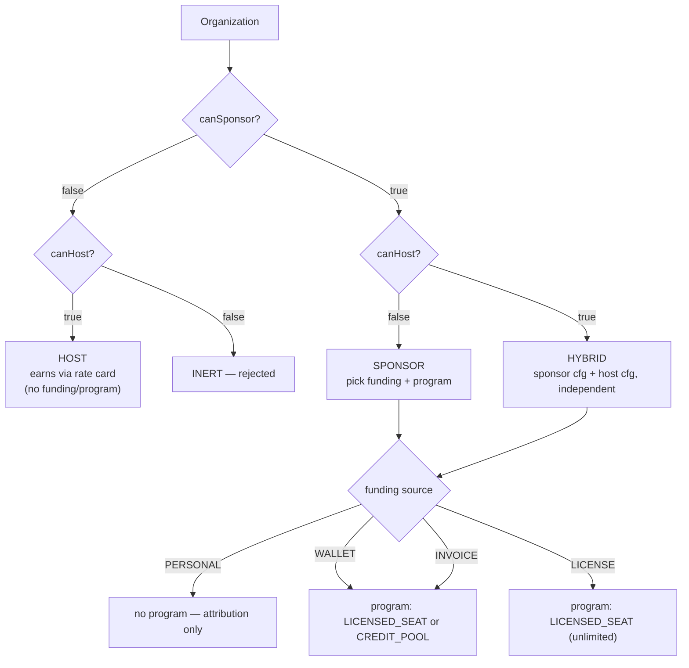
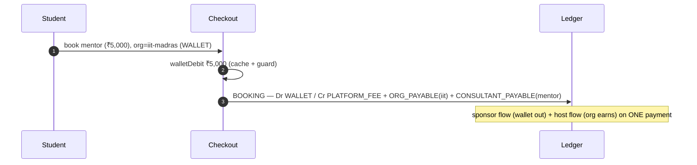

# Scenarios & worked examples — every permutation

**What this covers:** the full cross-product of the enterprise axes — **capability** (`canSponsor` × `canHost`), **funding source**, **program type**, **overage behaviour** — what each combination means, which are valid, and then **detailed end-to-end playthroughs** (a startup, Wipro, LearnPro, a consulting firm, IIT Madras, a solo consultant) showing every leg, posting, and settlement. This is the doc to read once you understand the parts ([01](01-organization-types.md)–[14](14-ledger-integrity.md)) and want to see them compose.

> Every example uses the seed cohort (`prisma/seedFiles/15a-create-organizations.ts`) so the numbers are real and reproducible. Postings are transcribed from [ledger & postings §4](08-ledger-and-postings.md); read that first if a `Dr/Cr` block is unfamiliar. ₹ amounts are paise in code (₹1 = 100 paise).

---

## 1. The axes

| Axis | Values | Lives on | Doc |
| --- | --- | --- | --- |
| **Capability** | `canSponsor` × `canHost` → SPONSOR / HOST / HYBRID (INERT rejected) | `Organization` | [01](01-organization-types.md) |
| **Funding source** (sponsor side only) | PERSONAL · WALLET · INVOICE · LICENSE · *PROJECT (v2)* | `BillingAccount` | [02](02-funding-and-programs.md) |
| **Program type** (the entitlement) | LICENSED_SEAT · CREDIT_POOL · *PROJECT/RETAINER (v2)* | `Program` (under `Contract`) | [21](21-programs.md) |
| **Overage behaviour** (cap exhaustion) | BLOCK · CHARGE_MEMBER · CHARGE_ORG | `LicensedSeatConfig` | [21](21-programs.md) |
| **Payout recipient** (host side) | SELF · ORGANIZATION | `Membership` | [10](10-booking-to-earnings.md) |



---

## 2. Capability × funding — which combinations exist

Funding only applies to the **sponsor** side. A pure HOST org has no `BillingAccount`.

| Capability | PERSONAL | WALLET | INVOICE | LICENSE |
| --- | --- | --- | --- | --- |
| **SPONSOR** (canHost=false) | ✅ attribution-only | ✅ prepaid pool | ✅ NET-NN postpaid | ✅ flat-fee contract |
| **HOST** (canSponsor=false) | — (no billing account) | — | — | — |
| **HYBRID** (both) | ✅ + host earnings | ✅ + host earnings | ✅ + host earnings | ✅ + host earnings |

A HYBRID org runs **two independent flows on the same `Payment`** when it sponsors its own expert: the sponsor side pays (via its funding source) and the host side accrues `OrganizationEarnings` — each computed from its own `RateCard`. They never net inside one ledger account; they're separate postings.

## 3. Funding × program — what the program adds

| Funding | Typical program | Per-booking money | Notes |
| --- | --- | --- | --- |
| PERSONAL | *(none)* | learner's `CARD` → `Dr CASH` | org is attribution-only; `Payment.organizationId` tagged |
| WALLET | LICENSED_SEAT or CREDIT_POOL | `WALLET` leg → `Dr WALLET(org)` | prepaid; overdraft-guarded; balance is a derived cache |
| INVOICE | LICENSED_SEAT or CREDIT_POOL | `INVOICE_ACCRUAL` leg → `Dr ORG_RECEIVABLE(org)` | no cash at booking; billed at cycle close |
| LICENSE | LICENSED_SEAT (`coveredEngagementsPerCycle = null`) | `LICENSE` leg → **0** (no money) | flat fee already paid via subscription; bookings only consume `UsageLedgerEntry` |

## 4. Program × overage — what happens at the cap

`OverageBehavior` only bites when a `LICENSED_SEAT` engagement count (or a `CREDIT_POOL` credit balance) is exhausted mid-cycle:

| Behaviour | At the cap | Money path |
| --- | --- | --- |
| `BLOCK` | checkout returns **402** (`ProgramAssignmentLimitError`) | none |
| `CHARGE_MEMBER` | member pays the overage on their own card | `CARD` leg → `Dr CASH`; `BookingUtilization.wasOverage = true` |
| `CHARGE_ORG` | org absorbs it | WALLET → real-time `Dr WALLET`; INVOICE → `OVERAGE_INVOICE_ACCRUAL` → `Dr ORG_RECEIVABLE` at cycle close |

---

## 5. Worked examples

Each shows **setup → a booking → the leg(s) → the ledger posting → settlement → reconcile**. They build up in capability order — **SPONSOR** (5.1–5.3) → **HOST** (5.4–5.5) → **HYBRID** (5.6, which combines both) → cross-cutting cases (5.7–5.10).

### 5.1 A startup — SPONSOR · PERSONAL (attribution-only, the simplest)

**Setup:** a 20-person startup wants visibility into coaching spend without prepaying. `canSponsor=true, canHost=false`, `BillingAccount(fundingSource=PERSONAL)`, no program.

**A booking.** Employee books a ₹1,500 session on their own card; the org is only tagged:
```
BOOKING  booking:<paymentId>
  Dr CASH(platform)                 150000   (employee card)
     Cr PLATFORM_FEE                 ...
     Cr CONSULTANT_PAYABLE(expert)   ...
     Cr GST_PAYABLE                  ...
```
`Payment.organizationId = <startup>` for analytics; **no wallet, no invoice, no receivable**. Upgrading later to WALLET/INVOICE is a `fundingSource` change (with the wallet-drain guard, [01](01-organization-types.md)).

### 5.2 Wipro — SPONSOR · INVOICE · LICENSED_SEAT (the buyer)

**Setup (seed):** `canSponsor=true, canHost=false`. `BillingAccount(fundingSource=INVOICE, requiresPO=true)`. A `PurchaseOrder` for **₹50,00,000**. A `LICENSED_SEAT` program *"Wipro Engineer Leadership Program"* — **200 seats**, **₹25,000/seat/year**, **`coveredEngagementsPerCycle = 12`**, `overageBehavior = CHARGE_ORG`. Members are LEARNERs; the OWNER is Head of People Ops, with a **BILLING_ADMIN** from finance managing POs/invoices.

**Seat subscription (the recurring money).** The 200 seats × ₹25,000 bill via `BillingSubscription` → `OrganizationInvoice` against the PO. Issuing the invoice decrements `PurchaseOrder.remainingAmountPaise` (atomic compare-and-swap, [12 §6](12-invoicing.md)); paying it posts:
```
INVOICE_PAID  invoicepaid:<invoiceId>
  Dr CASH(platform)            <invoice total>
     Cr ORG_RECEIVABLE(wipro)  <invoice total>
```

**A covered booking (within the 12/cycle cap).** Engineer Alice books her 3rd leadership session this cycle. The seat already paid for it, so **no money moves at booking**:
- `PaymentLeg(source=LICENSE, amountPaise=0)`.
- `recordBookingUtilization` writes a `UsageLedgerEntry(engagementsConsumed=1)` and atomically increments `ProgramAssignment.engagementsUsed` (3 → 4).
- **No `BOOKING` journal txn** — `postLedgerTxn` is skipped because the funding total is 0 (correct: nothing moved). The consultant is paid from the pooled seat revenue at settlement, not per booking.

**An overage booking (the 13th).** `engagementsUsed (12) + 1 > 12` and `overageBehavior = CHARGE_ORG`. Price ₹4,000. Wipro is `canHost=false` and the expert is a marketplace consultant, so there's **no `ORG_PAYABLE`** leg — the org-share bps fold into the platform/consultant split:
```
BOOKING  booking:<paymentId>
  Dr ORG_RECEIVABLE(wipro)         400000
     Cr PLATFORM_FEE                40000   (10%)
     Cr CONSULTANT_PAYABLE(expert) 360000   (90%, expert settles SELF)
     Cr GST_PAYABLE                 (per place-of-supply; omitted for clarity)
```
`BookingUtilization.wasOverage = true`. At cycle close the accrued `ORG_RECEIVABLE` rolls into the next `OrganizationInvoice`; paying it clears the receivable.

**Subsidiaries.** Wipro seeds two child orgs (`parentId = wipro.id`); the subtree UI is deferred ([05-hierarchy](05-hierarchy.md)) but each subsidiary carries its own `BillingAccount`; consolidated reporting against `rootId` is a follow-up cron.

**Reconcile:** `engagementsUsed` == `Σ UsageLedgerEntry` (`PROGRAM_ASSIGNMENT_ENGAGEMENTS_DRIFT`); `activeSeatCount` == in-period LICENSED_SEAT assignments (`ACTIVE_SEAT_COUNT_DRIFT`); every booking/invoice txn balances.

### 5.3 LICENSE — flat-fee, unlimited

**Setup:** an org on `LICENSE` funding with a `LICENSED_SEAT` program where `coveredEngagementsPerCycle = null` (unlimited), `cycle = ANNUAL`, flat fee paid once via subscription invoice. `overageBehavior = BLOCK` is moot (no cap).

**Every booking** posts `PaymentLeg(source=LICENSE, amountPaise=0)` + a `UsageLedgerEntry` — **no money, no `BOOKING` txn, no cap**. Platform + consultant economics settle from the flat-fee revenue at the subscription level. This is why "PREPAID_UNLIMITED" was never a separate funding model — it's just `LICENSED_SEAT` with a null cap ([02](02-funding-and-programs.md)). Together with covered LICENSED_SEAT bookings (§5.2) and pure PERSONAL (§5.1), this is one of the cases where the money journal **legitimately skips a posting** — nothing moved.

### 5.4 LearnPro Academy — HOST · marketplace learner pays (the provider)

**Setup (seed):** `canSponsor=false, canHost=true`. `OrganizationPayoutAccount` + a `RateCard` **10/10/80** + EXPERT memberships. No billing account, no funding source — LearnPro **earns**, it doesn't sponsor.

**A booking.** A marketplace learner (not an org member) books a LearnPro expert for ₹2,000 on their own card:
```
BOOKING  booking:<paymentId>
  Dr CASH(platform)                  200000   (the learner's card)
     Cr PLATFORM_FEE                  20000   (10%)
     Cr ORG_PAYABLE(learnpro)         20000   (10%)
     Cr CONSULTANT_PAYABLE(expert)   160000   (80%)
```
LearnPro's 10% → `OrganizationEarnings`; the expert's 80% → `ConsultantEarnings`. Settlement: `ORG_PAYOUT` to LearnPro, `PAYOUT` to the expert, each withholding TDS. **`PayoutRecipient = SELF`** — the expert is paid directly (contrast §5.5).

> **Time-scoped rate cards:** if LearnPro bumps its card to 10/20/70 at month 3 (`bumpRateCard()`), earnings already created keep settling at their snapshot (`consultantBpsApplied = 8000`) — the bump never rewrites history ([10 §2](10-booking-to-earnings.md)).

### 5.5 Acme Advisory — HOST · salaried consultants (consulting firm as provider)

**Setup:** a boutique consulting firm. `canSponsor=false, canHost=true`. Custom `RateCard` **15/10/75** with each consultant's `Membership.payoutRecipient = ORGANIZATION` (salaried). The consultant-share leg is booked to the **org**, collapsing the three-way split into platform + org.

**A booking** (₹10,000 senior-advisor session):
```
BOOKING  booking:<paymentId>
  Dr CASH(platform)              1000000
     Cr PLATFORM_FEE              150000   (15%)
     Cr ORG_PAYABLE(acme)        850000   (85% = org 10% + consultant 75%, since payoutRecipient=ORGANIZATION)
```
- **No `CONSULTANT_PAYABLE`** leg — the firm collects the consultant's share and pays the advisor through payroll, off-platform.
- `OrganizationEarnings` carries the full 85%; one `ORG_PAYOUT` settles it.

This is the canonical agency / consulting-firm shape: the platform deals with the firm, the firm deals with its people. Set `payoutRecipient = ORGANIZATION` at expert approval ([22](22-expert-lifecycle.md)).

### 5.6 IIT Madras — HYBRID · WALLET · CREDIT_POOL (both flows on one payment)

**Setup (seed):** `canSponsor=true, canHost=true` — it both sponsors students *and* hosts a faculty mentor, so it combines §5.1–5.5. `BillingAccount(fundingSource=WALLET)`. `CREDIT_POOL` program *"IIT Student Coaching Pool"* — **10,000 credits/month** (1 credit = ₹1). Default rate card **10/10/80**.

**Top-ups (seed: 3 × ₹5,00,000).** Each confirmed top-up posts:
```
TOPUP  topup:<orderId>
  Dr CASH(platform)         5000000   (₹5,00,000)
     Cr WALLET(iit-madras)  5000000
```
After 3 top-ups the `WALLET` account owes ₹15,00,000; `walletBalance` cache = ₹15,00,000.

**A booking (seed: 5 × ₹5,000 debits).** A student books IIT's faculty mentor for ₹5,000. IIT is **both** the sponsor (pays from wallet) **and** the host (earns the org share):
```
walletDebit() : UPDATE walletBalance -= 500000 WHERE walletBalance >= 500000   (cache + overdraft guard)

BOOKING  booking:<paymentId>
  Dr WALLET(iit-madras)              500000   (₹5,000 spent from the pool)
     Cr PLATFORM_FEE                  50000   (10%)
     Cr ORG_PAYABLE(iit-madras)       50000   (10% — IIT's host earnings)
     Cr CONSULTANT_PAYABLE(mentor)   400000   (80%)
```
The HYBRID self-deal is visible: ₹5,000 leaves IIT's wallet, ₹500 returns as `ORG_PAYABLE` (host earnings), so IIT's net cost is ₹4,500; the mentor is owed ₹4,000; the platform keeps ₹500.

**Host-side settlement.** `ORG_PAYABLE(iit-madras)` accrues into `OrganizationEarnings` (`PENDING → READY`), then:
```
ORG_PAYOUT  orgpayout:<payoutId>
  Dr ORG_PAYABLE(iit-madras)   <net + TDS>
     Cr CASH(platform)          <net>
     Cr TDS_PAYABLE             <withheld>
```
The mentor's `CONSULTANT_PAYABLE` settles the same way via `payout:<id>`.

**After the seed (5 debits):** `walletBalance = ₹15,00,000 − ₹25,000 = ₹14,75,000`, exactly `-balance(WALLET account)` — `WALLET_BALANCE_DRIFT` passes.



### 5.7 Overage deep-dive (LICENSED_SEAT cap hit)

Wipro's program (§5.2), comparing the three `overageBehavior` settings on the 13th booking (₹4,000):

| Behaviour | Outcome | Posting |
| --- | --- | --- |
| `BLOCK` | checkout 402 `PROGRAM_CAP_EXHAUSTED` | none — nothing books |
| `CHARGE_MEMBER` | Alice pays ₹4,000 on her card | `CARD` leg → `Dr CASH`; split credits as normal; `wasOverage=true` |
| `CHARGE_ORG` (Wipro's setting) | Wipro absorbs it | `OVERAGE_INVOICE_ACCRUAL` → `Dr ORG_RECEIVABLE(wipro)`, billed next cycle (§5.2) |

The cap-check + counter increment are atomic ([20](20-concurrency-and-idempotency.md)); two near-cap bookings can't both "cover." `maxOveragePerCyclePaise` (if set) caps total overage per cycle; `priceCapPerEngagementPaise` caps the per-engagement charge.

### 5.8 Multi-collaborator booking

A webinar co-hosted by two experts at **different** HOST orgs (LearnPro + Acme). Each collaborator's `revenueShareBps` slices the consultant pool; each org accrues its own `OrganizationEarnings` (one row per `(paymentId, organizationId)`).

> **Coverage gap (#773):** the per-collaborator HOST-org settlement writes the earnings rows, but the **balanced `BOOKING` journal txn is deferred** for multi-collaborator payments (single-consultant bookings post inline). Reconcile counts these as `earningsPaymentsWithoutBookingTxn` (informational, not a finding) until #773 lands the multi-leg posting. See [10 §3](10-booking-to-earnings.md) and [14 §2](14-ledger-integrity.md).

### 5.9 Rahul (solo consultant) — pure marketplace, the org-layer no-op

**Setup (seed):** `canSponsor=false, canHost=true` convenience org, but a booking against Rahul by a marketplace learner (no org context) takes the **marketplace** path:
- `Payment.organizationId = null`; `PaymentLeg(source=CARD)` → `Dr CASH`.
- `ConsultantEarnings` at the default split; **no `OrganizationEarnings`, no `BookingUtilization`** (no program), no wallet.
- Rahul's payout runs via the consultant pipeline (`payout:<id>`).

This scenario exists to assert the **enterprise layer must not interfere with the marketplace flow**: every `lib/` enterprise primitive checks "is there an org?" before writing, and settlement short-circuits at `resolveOrgShare() === null`.

### 5.10 Rate-card math (integer paise, no float drift)

Default card `platform=1000, org=1000, consultant=8000` bps; gross ₹10,000 = `1000000` paise:
```
platformFeePaise     = 1000000 * 1000 / 10000 = 100000
orgSharePaise        = 1000000 * 1000 / 10000 = 100000
consultantSharePaise = 1000000 * 8000 / 10000 = 800000
```
Integer division; any ±₹0.01 rounding remainder is absorbed in the platform line so the legs always sum to the gross. Splits are **basis points**, never floats ([06](06-money-model-overview.md)).

---

## 6. The seed cohort at a glance

| Org | Capability | Funding | Program | Money fact |
| --- | --- | --- | --- | --- |
| `wipro` | SPONSOR | INVOICE | LICENSED_SEAT (200 seats, 12/cycle) | PO ₹50,00,000; seat ₹25,000/yr |
| `iit-madras` | HYBRID | WALLET | CREDIT_POOL (10,000/mo) | wallet ₹14,75,000 (3×₹5L − 5×₹5K) |
| `learnpro-academy` | HOST | — | — | 10/10/80 rate card |
| `<rahul>-coaching` | HOST | — | — | solo consultant, dynamic slug |

Sign in as the seed users (`SEED_PASSWORD`, default `SeedPass123!`) to walk these live — see [52-design-partner-customer-set](52-design-partner-customer-set.md).

---

### Related docs
- [01-organization-types](01-organization-types.md) · [02-funding-and-programs](02-funding-and-programs.md) · [21-programs](21-programs.md) — the axes.
- [08-ledger-and-postings](08-ledger-and-postings.md) — every posting shown here, in full.
- [10-booking-to-earnings](10-booking-to-earnings.md) · [11-payout-pipeline](11-payout-pipeline.md) · [12-invoicing](12-invoicing.md) — the settlement paths.
- [14-ledger-integrity](14-ledger-integrity.md) — the reconcile checks that prove each scenario ties out.
- [51-harness-verdict](51-harness-verdict.md) — the scenario-by-scenario verdict table.
