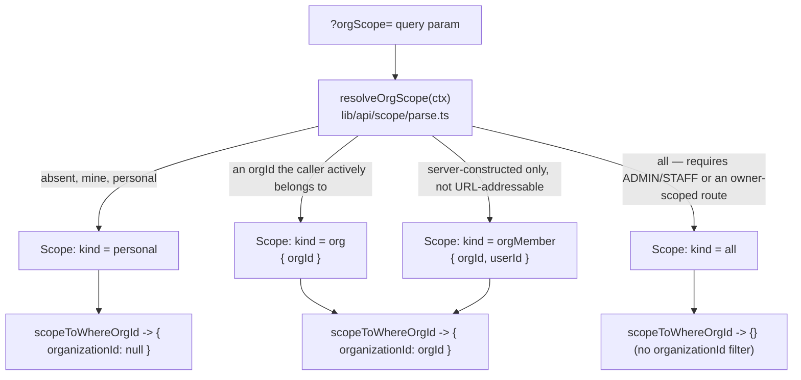

# ADR 18 — The B2B/B2C boundary stays open, with curated-panel and exclusivity stubs

## Context

The platform runs a B2C marketplace and a B2B enterprise layer on the same supply pool, the same checkout, and the same availability engine. A 2026-07-11 review of every point where the two sides intersect found three places where the code permits interactions that were never explicitly decided, and one correctness gap. First, a sponsor organization can fund a booking with any marketplace consultant: the checkout org-resolution block (`lib/payments/operations/checkout.ts`) validates the member's ProgramAssignment but never checks whether the booked plan's consultant has any relationship with the sponsoring org, so a sponsor can pay for a session delivered by a competitor HOST org's expert. Second, collaborations carry no org awareness at all: the `Collaborator` model links two consultant profiles to a plan with no organization column, so cross-org, mixed internal-and-external, and org-plan-with-outside-guest collaborations are all silently permitted. Third, an internal consultant whose `Membership.payoutRecipient` is `ORGANIZATION` (the org captures their share of org-attributed earnings) can freely sell independent B2C plans and keep the full marketplace split, because the membership knob has no reach into their global `ConsultantProfile`. The correctness gap was issue #773, where multi-collaborator payments deferred the balanced BOOKING journal transaction.

The forces in play: the sponsor pitch is that a team gets the whole marketplace, and 2025 benefits-market data favours breadth over curation; collaboration liquidity (an org's star expert bringing an outside guest speaker) is a core webinar use case; and the schema freezes before launch, so any restriction we might plausibly want later must have its columns now even if no code enforces them.

## Decision

The boundary stays open in all three places, and the two restrictions we might later want exist today only as unenforced schema stubs. A sponsor org can fund any marketplace consultant; the economics are already correct because host-side earnings attribute to the consultant's own org via their oldest `canHost` membership, and the platform fee is unaffected by who sponsored. Collaborations remain org-blind; each collaborator's earnings resolve to their own org independently, and the revenue-share guard (collaborators capped at 9000 bps, so the owner keeps at least ten percent) is the only structural limit. Exclusivity for `payoutRecipient=ORGANIZATION` consultants is a contract matter between the org and its consultant, not something the platform polices.

The stubs: `ProgramConsultantAllowlist` (Program × ConsultantProfile, unique pair) models a curated panel per Program — zero rows means the open network, and enforcement lives inside `revalidateInsideLock`, where the plan's consultant is already loaded and the distributed lock closes the check-then-book race (the Program-resolution point in `checkout.ts` carries an ADR-18 comment pointing there). `Membership.exclusiveEngagement Boolean @default(false)` records an org-declared exclusivity arrangement that hides or blocks the consultant's independent plans while it is true. As of 2026-07-11 checkout enforces both: allowlist rows on the funding Program restrict org-sponsored bookings to listed consultants, and an `ACTIVE` membership with `exclusiveEngagement` blocks bookings of the consultant's independent plans (those without an owning organization). The "hide" half of exclusivity — filtering the consultant's independent plans out of marketplace listings — remains future work, so the flag still must not be exposed in any UI that implies full enforcement.

The #773 journal gap is not part of this decision because it was already fixed on `dev` (commit `6187c3f6`): all bookings, single or multi-collaborator, post one balanced `booking:<paymentId>` ledger transaction, and `scripts/reconcile/reconcile-ledgers.ts` holds `earningsPaymentsWithoutBookingTxn` to zero.

This ADR also retires a documentation ghost: `Organization.capabilitiesExtra` appeared in the org-types doc as if it were a schema column, but it has never existed in `prisma/schema.prisma` and no code reads it. The doc now describes it as a rejected escape hatch rather than a field.

## Alternatives considered

Restricting sponsors to org-linked consultants was rejected because it kills the marketplace-access pitch — narrow panels measurably depress participation in benefits programs — and because the case it prevents (funding a competitor's expert) is economically harmless to the platform. Requiring org approval for external collaborators on org-owned plans was rejected as a workflow with no observed demand; the allowlist stub covers the strongest version of that need at the Program level if a sponsor ever asks. Blocking or taxing independent B2C sales by `payoutRecipient=ORGANIZATION` consultants was rejected because provider exclusivity is handled contractually everywhere in this industry, and encoding one org's employment terms into platform behaviour would be premature; the boolean stub preserves the option. Doing nothing at the schema level was rejected because the schema-freeze-before-launch gate makes post-launch columns expensive, while two dormant columns cost nothing.

## Consequences

We keep the strongest version of the sponsor value proposition and full collaboration liquidity, and the defaults change nothing at runtime: a Program with no allowlist rows and a membership with `exclusiveEngagement=false` behave exactly as before, so nothing regresses until an operator opts in. Revisit this decision if org-owned plans with external collaborators produce a real brand or quality incident (add an approval gate at invite time), or if a host org reports revenue leakage through an exclusive consultant's still-visible independent plans (extend the flag to marketplace visibility, the unimplemented "hide" half).

## Org scoping: the two role axes and the `Scope` type

Every list endpoint that supports the personal-vs-org toggle resolves an incoming `?orgScope=` value to exactly one `Scope` (`lib/api/scope/parse.ts`) before it touches Prisma, and `scopeToWhereOrgId(scope)` turns that `Scope` into the `organizationId` fragment of the `where` clause: `{ organizationId: null }` for `personal`, `{ organizationId: orgId }` for `org` and `orgMember`, and `{}` (no filter at all) for `all`. A booking's org-ness is decided once, at write time, by `Appointment.organizationId` alone; whether a given read is allowed to see an org's bookings is a completely separate decision made by the caller's resolved `Scope`. The invariant that follows is the one worth remembering: an org-scoped result requires both a non-null `organizationId` on the row **and** an explicit org `Scope` on the read — a row carrying an org id is not itself a permission, and a privileged caller passing no scope does not accidentally see every organisation's data. `pendingConsultationWhere` and `pendingSubscriptionWhere` in `lib/data/needs-you.ts` show the personal half of that pairing directly: a `personal` scope adds `OR: [{ appointment: null }, { appointment: { organizationId: null } }]` rather than trusting the absence of an `orgId` argument.

Two independent role axes sit above this. `UserRole` (`CONSULTANT`, `CONSULTEE`, `ADMIN`, `STAFF`, `ORG_WORKSPACE`) is the platform-wide role that gates `?orgScope=all` to `ADMIN`/`STAFF` alone; the UI relabels `CONSULTEE` as "Client" wherever a consultant-facing screen names the other party (`app/dashboard/consultee/[consulteeId]/layout.tsx`). `MemberRole` (`OWNER`, `MAINTAINER`, `BILLING_ADMIN`, `MANAGER`, `EXPERT`, `LEARNER`, `SUPPORT`) is per-organisation and answers a different question — what a member may do inside the one org they belong to — and has no bearing on whether `?orgScope=all` is allowed.

| `Scope.kind` | Who gets it | `scopeToWhereOrgId` result |
| --- | --- | --- |
| `personal` | Default for every caller; the caller's own data only. | `{ organizationId: null }` |
| `org` | An active member of that one organisation, requesting the org-wide view. | `{ organizationId: orgId }` |
| `orgMember` | Built by the server only, for one member's own participation inside an org (booked as a learner or delivered as an expert); never addressable via `?orgScope=`. | `{ organizationId: orgId }` |
| `all` | `ADMIN`/`STAFF` by `UserRole`, or a route that is already self-scoped to the caller's own profile and opts in with `allowAllForOwner`. | `{}` — no filter |
