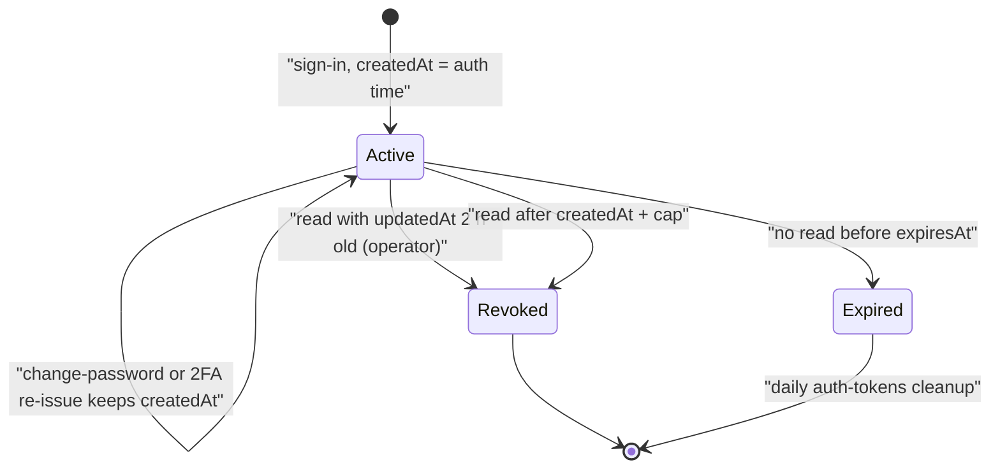
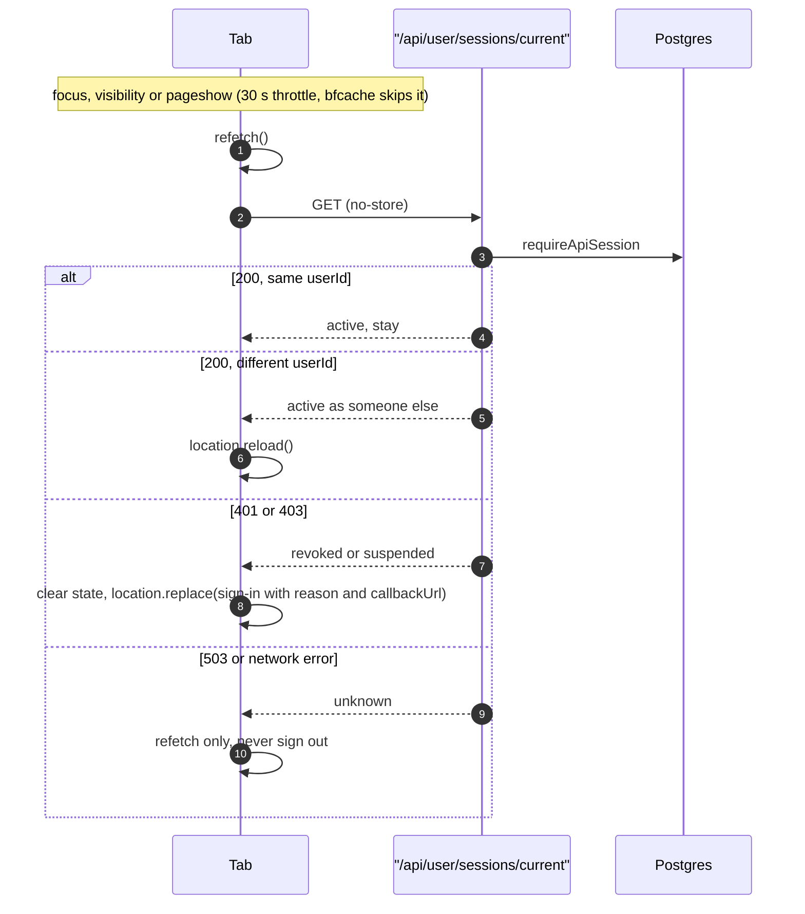

# ADR 35 — User session visibility, lifetime and revocation

## Context

A session is a Postgres `Session` row plus the httpOnly
`__Secure-better-auth.session_token` cookie that carries its signed token
(BetterAuth **1.7.7**). The cookie cache is permanently off, so every server
read loads the row and its user.

The forces:

- A user must see where they are signed in and end sessions they do not
  recognize. That is the whole of account-takeover triage.
- A session token is a bearer credential for the whole account and must never
  leave the server. BetterAuth's own `listSessions()` returns the raw token per
  device, and `revokeSession` accepts only the token, so neither can reach the
  browser.
- An organization must not gain a window into a member's devices (ADR 20's line
  extends here). Staff need enough visibility to resolve "someone else is in my
  account" tickets without a silent kick button.
- Operators (STAFF, ADMIN) hold back-office powers and need short, absolute
  sessions. Consumers need to stay signed in.
- A database blip must never read as "signed out", and a tab rendered for one
  account must never act as another.

## Decision

**A user sees their own sessions in full. Nobody else sees a token. A failed
lookup is never a sign-out.**

### 1. Lifetimes

`lib/auth/session-lifetime.ts` holds the policy; `session.create.before` and
`session.update.before` in `lib/auth.ts` apply it.

| Class                                  | Lifetime                                       |
| -------------------------------------- | ---------------------------------------------- |
| Consumer                               | 30 days, sliding (`updateAge` 1 day)           |
| Enrolled operator (STAFF, ADMIN + 2FA) | 12 h absolute from the original authentication |
| Any operator, idle                     | Ends after 2 h without a read                  |
| Unenrolled operator                    | 1 h absolute (long enough to enrol)            |
| SSO session for an enforced domain     | 24 h absolute                                  |

- **Original authentication.** A capped row's `createdAt` is the time the user
  last proved who they are. The re-issues on `/change-password`,
  `/two-factor/verify-totp` and `/two-factor/verify-backup-code` copy the
  replaced row's `createdAt` into the new row, so neither a password change nor
  2FA enrolment restarts the 12 h clock.
- **SSO class.** A session minted by `/sso/callback/:providerId` for a user
  whose email domain is enforced by an org with an approved provider gets the
  24 h cap. On refresh, a non-operator row whose lifetime is at most 24 h stays
  capped; the class is read from the row, so the refresh needs no query.
- **Idle and cap on refresh.** A capped row always expires inside BetterAuth's
  refresh window, so every read refreshes it, and that write makes `updatedAt`
  the last activity. `update.before` ends the session when an operator's
  `updatedAt` is 2 h old or any capped session has passed its cap: it revokes
  the row through `lib/auth/session-revoke.ts` and returns `false`, which makes
  BetterAuth drop the cookie and answer no session. Otherwise it returns data
  only when it has to clamp `expiresAt` to the cap.

### 2. Tri-state lookup

BetterAuth's `customSession` plugin swallows lookup errors and answers `null`,
which looks the same as "signed out". The app separates the two.

- `getSession({ allowUnenrolledOperator? })` in `lib/auth-server.ts` returns the
  session or `null`, and **throws** `SessionLookupFailedError`
  (`lib/auth/session-lookup-error.ts`) when the read throws, or when it answered
  `null` but the browser holds a validly signed cookie whose row is still live.
  One indexed row read (`classifyMissingSession` in
  `lib/auth/session-cookie.ts`) settles that case. The error is a 503 `Refusal`
  with code `SESSION_LOOKUP_FAILED`, marked expected so it never pages.
- Without `allowUnenrolledOperator`, an operator session without 2FA reads as
  `null`.
- `lookupSession()` in `lib/auth-session-lookup.ts` returns
  `{ kind: "found" | "none" | "failed" }` for the guards. `requireApiAuth` and
  `requireApiSession` answer 503 with `Retry-After: 2`; page guards throw to the
  error boundary, where `DashboardRouteError` shows "Reconnecting…" and retries.
- A route that lets the error reach `apiError()` also answers 503 with
  `Retry-After`, through the `Refusal` mapping.
- Cookie verification uses BetterAuth's signing secret: the first
  `BETTER_AUTH_SECRETS` entry when rotation is configured, else
  `BETTER_AUTH_SECRET`.
- `/api/auth/get-session` (`app/api/auth/[...all]/route.ts`) applies the same
  check. When the plugin answers `200 null` but the cookie is validly signed and
  its row is live (or the row read fails), the route answers 503 with
  `Retry-After: 2`. The BetterAuth client keeps its last session on any
  non-401, so open tabs do not render signed out during a blip.

### 3. Device list and per-device revoke

- `GET /api/user/sessions` returns the caller's unexpired sessions through
  `SESSION_PUBLIC_SELECT` (`lib/auth/session-select.ts`): id, timestamps,
  `ipAddress`, a derived label, `lastSeenAt` (= `updatedAt`) and `isCurrent`.
  Never `token`, never the raw `userAgent` (a fingerprint). It is
  cursor-paginated, 25 per page, newest first: `?cursor=<id>` returns
  `{ sessions, total, nextCursor }`. The UI shows "Show more" and labels the IP
  as "Signed in from". `__tests__/security/session-payload-allowlist.test.ts`
  pins the select keys and the mapper output.
- `DELETE /api/user/sessions/[id]` deletes by `(id, userId)` with `deleteMany`.
  The `userId` in the `where` is the ownership proof; a concurrent second revoke
  is a 0-count success. Foreign or gone ids answer 200 `{ revoked: 0 }`, never
  404, so row existence does not leak across users. Revoking the current
  session is reported as `currentSessionEnded` so the client signs out cleanly.
- `POST /api/user/sessions/revoke-others` ends every session but the caller's.
- "Last active" is `updatedAt`: day-granular for consumers, per read for capped
  sessions. The UI never says "active now".

### 4. One revocation choke point

Every session delete goes through `lib/auth/session-revoke.ts`:

| Function                   | Caller                                                       |
| -------------------------- | ------------------------------------------------------------ |
| `revokeAllUserSessions`    | Ban and suspend, account deletion, erasure, 2FA enrolment    |
| `revokeUserSessionsExcept` | "Sign out other devices"                                     |
| `revokeSessionById`        | Device list, staff revoke, the lifetime hook on refresh      |
| `revokeSessionsForUsers`   | The sweep when an org turns SSO enforcement on               |
| `revokeSessionByToken`     | `supersededSessionRevocation`: signing in over a live cookie |

- Direct Prisma is the right primitive. BetterAuth's admin `revokeUserSessions`
  checks the calling admin's session and cannot join a transaction, and
  system-initiated revokes have neither.
- Signing in over an existing cookie, by any method, revokes the overwritten
  row, so it does not linger as a ghost device. The plugin is registered after
  `twoFactor()`, which clears `newSession` while a challenge is pending.
- BetterAuth's `/revoke-session`, `/revoke-sessions` and
  `/revoke-other-sessions` are in `disabledPaths`.
- Password change uses BetterAuth's `revokeOtherSessions: true` in the same
  request (OWASP: a reset the stolen device survives is not a reset). The
  current session survives. A password reset ends every session.

### 5. Who sees what

- **Organizations see nothing.** No org surface lists, counts or exposes a
  member's auth sessions, for the same reason as ADR 20's content half.
- **Staff see, admin acts.** `GET .../admin/users/[userId]/sessions`
  (`users.read`, operators) shows the list for takeover triage.
  `POST .../revoke` (`users.moderate`, ADMIN only, `reason` plus an
  `OpsActionLog` row) ends sessions. Staff act through the moderation ban path,
  which shares the same helper.
- **No raw tokens anywhere.** `disabledPaths` blocks `/list-sessions` and the
  admin plugin's session endpoints over HTTP; staff roles hold no `session:*`
  permission. `customSession` strips `token` and `impersonatedBy` from the
  public session, and `SESSION_PUBLIC_SELECT` does not select `impersonatedBy`
  (the column stays for the frozen schema).

### 6. Tabs, windows and sign-out

`providers/AuthSyncProvider.tsx`, mounted once at the root, keeps each tab
honest.

- **Revalidation.** On `visibilitychange`, window `focus` and `pageshow` it
  calls `refetch()` and the identity ping `GET /api/user/sessions/current`,
  throttled to one check per 30 s. A bfcache restore (`persisted: true`) skips
  the throttle, because the page may be a signed-out user's history.
- **Ping answers.** The route returns `{ active: true, userId }`.
  - 200 with a different `userId` than the page first resolved, or the session
    store resolving a different user: hard reload (`location.reload`), so no
    stale RSC payload, React Query cache or form acts as the new user.
  - 401 or 403: `leaveEndedSession(signInHref("session-revoked"))` clears
    remembered state, disconnects Stream and calls `location.replace` to
    `/auth/signin?reason=session-revoked&callbackUrl=<current path>`. There is
    no second `POST /sign-out`.
  - 503, any other status, or a network error: unknown. Refetch only.
- **Cold load.** If the remembered flag is set but there is no session, a
  public page forgets the flag quietly. A protected page (prefixes in
  `lib/navigation/protected-routes.ts`, shared with `middleware.ts`) asks the
  server first.
- **Sign-out.** `signOutEverywhere` (`lib/auth/sign-out.ts`) tears down Stream,
  calls `signOut`, and on success posts one `BroadcastChannel("auth")`
  `{ type: "signed-out" }` message, then `location.replace(redirectTo)`. No
  history entry is left, so Back cannot restore the signed-in page (and
  `pageshow` revalidates if it does). Receiving tabs (`subscribeToSignOut`)
  clear local state and either `location.replace("/auth/signin")` on a
  protected page or reload a public one. They never call sign-out.
- Revocation redirects keep `callbackUrl` (`signInHref`). The change-password
  `SESSION_EXPIRED` path keeps it too.

### 7. Identity guard on money and IAM writes

A tab rendered for user A can still post after another tab signed in as user B.
`fetchWithIdentity` (`lib/auth/identity-header.ts`) sends
`x-expected-user: <page's user id>`, which `AuthSyncProvider` sets once per page
load, and reloads the tab on 409 `IDENTITY_CHANGED`.

- Server side, `requireApiAuth({ expectUser: true })`,
  `requireOrgAccess(orgId, { expectUser: true })` and every `withOpsAction`
  door answer 409 `IDENTITY_CHANGED` when the header names another user. An
  absent header passes.
- Wired on `POST /api/checkout`, `POST /api/consultant/payouts/instant`, every
  back-office ops door (refund issue and team IAM included), org member
  `PATCH`/`DELETE` and invitation `POST`/`DELETE`.
- Client call sites use `fetchWithIdentity`: the checkout pages,
  `GetPaidNowSheet`, the org member and invitation dialogs, `ReviewStep`
  invites, `ops-door.ts` and `TeamPageClient`.

### 8. Expired-row cleanup

`lib/auth/cleanup-auth-tokens.ts` is the `auth-tokens` job in
`lib/cron/cleanup-registry.ts`. `cron-daily.yml` runs it through
`POST /api/cleanup/auth-tokens`. There is no per-user session cap.

## Alternatives considered

- **Calling `authClient.listSessions()` / `revokeSession()` from the browser.**
  Rejected: raw tokens in the page. Raising `session.freshAge` would make 1.7's
  `listSessions` callable, but it would still return tokens, and the same value
  gates `/unlink-account`.
- **One "sessions" grant covering staff revoke.** Rejected: the back-office
  matrix already separates seeing (`users.read`) from destroying
  (`users.moderate`).
- **Short sessions for consumers.** Rejected: a constant UX cost for a rare
  event. Short absolute caps apply only where the blast radius is large
  (operators) or where an IdP owns deprovisioning (enforced SSO).
- **Skipping the per-read write for capped sessions.** Not possible: BetterAuth
  1.7.7 has no hook to skip a refresh that is due.
- **Push-style revocation (Redis signal, polling tick).** Rejected: always-on
  traffic to beat "next request or next focus" by seconds.
- **BetterAuth `multiSession` and a per-user session cap.** Not installed. The
  cap is hygiene with no security value; the BetterAuth rate limiter owns brute
  force.

## Consequences

- The device list is the takeover triage surface: a user ends an unknown
  device, changes their password (which sweeps the rest) and is done without
  support.
- Every session read is a database lookup. Capped (operator and SSO) sessions
  also write on every read, because the row always sits inside the refresh
  window. That write is the idle timer.
- About 178 call sites in 127 files still use raw `getSession()` instead of a
  guard. They
  now throw `SessionLookupFailedError` on a failed lookup instead of answering
  401: a 503 when the route uses `apiError()`, otherwise a 500. Moving them to
  the guards is tracked as a GitHub issue.
- A visible, untouched tab on a revoked device keeps its last rendered page
  until the next request, focus or bfcache restore.
- Deferred: Stream chat and video tokens are not revoked when other sessions
  end (revoke-others or password change). This is on the roadmap.

## Deprecated & Superseded Approaches

- **Cookie cache, `getCachedSession()`, `getSession(true)` and the eslint
  freshness rule.** Removed with the cache, which is off for good; there is no
  stale read left to guard against.
- **`getSession` collapsing failures into `null`, and `/get-session` answering
  `200 null` on a failed lookup.** Both turned database blips into 401s and
  signed-out tabs.
- **Visibility-only probe and the sign-out cascade.** Every tab POSTed
  `/sign-out` again on a broadcast, and sign-out used `window.location.href`,
  leaving the signed-in page in history. Replaced by focus/visibility/pageshow
  revalidation, one broadcast, and `location.replace`.
- **Forced redirect on public pages for a remembered but expired session.**
  Replaced by quietly forgetting the flag.
- **Operator cap measured from the row's own `createdAt`.** A password change
  restarted the 12 h clock.
- **`jobs/` and `scripts/` twins of `cleanup-auth-tokens`, `isImpersonated` in
  the device payload, the visible-tab 5-minute tick, a Redis revocation counter,
  `Session.lastSeenAt`/`deviceLabel` columns and the session-generation clock
  (ADR 10).** Deleted. Sessions are not cached in Redis.
