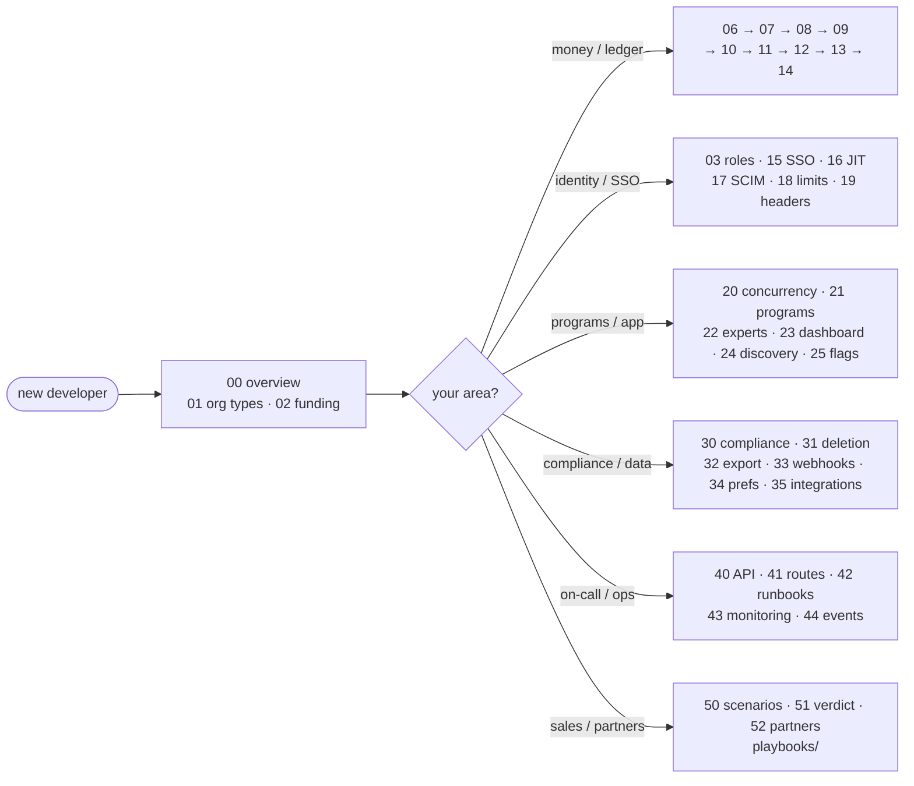

# Familiarise Enterprise — documentation

The **enterprise layer** is a capability-driven B2B surface on top of the marketplace: organizations sponsor and/or host, fund sessions through wallets / invoices / licenses, run programs with seat or credit caps, and settle money through a double-entry ledger. This folder is the engineer's map of it — the numbered docs `00`→`52` are written to be read **in order, as one continuous story**, each section building on the last, with [`explainers/complete-guide`](explainers/complete-guide.md) as the connective end-to-end narrative.

> **New here?** Read [00-overview](00-overview.md) for the system shape, then [explainers/complete-guide](explainers/complete-guide.md) for the end-to-end narrative. For money specifically, start at [06-money-model-overview](06-money-model-overview.md) and walk the `06→14` band.

---

## How to read this

---

## Section map

| Band | Section | Docs |
| --- | --- | --- |
| `00–05` | **Foundations** | overview, org types, funding & programs, roles, lifecycle, hierarchy |
| `06–14` | **Money & ledger** | money model, chart of accounts, postings, wallet, booking→earnings, payouts, invoicing, payment legs, integrity |
| `15–19` | **IAM / SSO / security** | SSO, JIT, SCIM, rate-limiting, security headers |
| `20–25` | **Programs / dashboard / discovery** | concurrency & idempotency, programs, experts, dashboard, discovery, feature flags |
| `30–35` | **Compliance / integrations / data** | compliance map, deletion, data export, outbound webhooks, workspace prefs, cross-cutting integrations |
| `40–44` | **Operations** | API reference, route migration, runbooks, monitoring, system events |
| `50–52` | **Scenarios / verdict / partners** | worked scenarios, harness verdict, design-partner set |

---

## Full index

### Foundations
| # | Doc | Focus |
|---|---|---|
| 00 | [overview](00-overview.md) | system shape, master ER, capability model |
| 01 | [organization-types](01-organization-types.md) | `canSponsor`/`canHost` → BUYER/HOST/HYBRID/INERT |
| 02 | [funding-and-programs](02-funding-and-programs.md) | `FundingSource` enum + program subtypes |
| 03 | [roles-and-permissions](03-roles-and-permissions.md) | `MemberRole` ladder + every API gate |
| 04 | [organization-lifecycle](04-organization-lifecycle.md) | `OrgStatus` + contract/program state machines |
| 05 | [hierarchy](05-hierarchy.md) | `parentId`/`rootId`/`depth` (UI deferred) |

### Money & ledger
| # | Doc | Focus |
|---|---|---|
| 06 | [money-model-overview](06-money-model-overview.md) | integer paise, double-entry, derived balances, what #772 changed |
| 07 | [chart-of-accounts](07-chart-of-accounts.md) | the 10 accounts, normal sides, deterministic ids |
| 08 | [ledger-and-postings](08-ledger-and-postings.md) | `postLedgerTxn`, the balance invariant, every flow's legs |
| 09 | [wallet-and-topups](09-wallet-and-topups.md) | `WalletTopUp` lifecycle, wallet-as-cache |
| 10 | [booking-to-earnings](10-booking-to-earnings.md) | booking → earnings → bps split, rate cards |
| 11 | [payout-pipeline](11-payout-pipeline.md) | earnings roll-up → payout, TDS/MSME, `ORG_PAYOUT` |
| 12 | [invoicing](12-invoicing.md) | GST, IRN, PO match, `ORG_RECEIVABLE`, refunds |
| 13 | [payment-legs](13-payment-legs.md) | stackable funding legs → ledger debits |
| 14 | [ledger-integrity](14-ledger-integrity.md) | the reconciler: 7 checks + report |

### IAM / SSO / security
| # | Doc | Focus |
|---|---|---|
| 15 | [sso-and-authentication](15-sso-and-authentication.md) | `OrganizationSSOSettings`, `SsoProvider`, domain claims |
| 16 | [jit-and-session-refresh](16-jit-and-session-refresh.md) | JIT auto-join, `sessionGeneration`, role-change refresh |
| 17 | [scim-provisioning](17-scim-provisioning.md) | SCIM tokens + provisioning |
| 18 | [rate-limiting](18-rate-limiting.md) | coverage matrix; why BetterAuth's limiter is off |
| 19 | [security-headers](19-security-headers.md) | CSP + header posture |

### Programs / dashboard / discovery
| # | Doc | Focus |
|---|---|---|
| 20 | [concurrency-and-idempotency](20-concurrency-and-idempotency.md) | atomic patterns + every idempotency key |
| 21 | [programs](21-programs.md) | program / assignment / `BookingUtilization` internals |
| 22 | [expert-lifecycle](22-expert-lifecycle.md) | expert apply/approve; `PayoutRecipient` |
| 23 | [dashboard-pages](23-dashboard-pages.md) | every `app/dashboard/organization/[orgId]/**` page |
| 24 | [public-pages-and-discovery](24-public-pages-and-discovery.md) | org catalog, search, marketplace identity |
| 25 | [feature-flags-and-rollout](25-feature-flags-and-rollout.md) | `ENABLE_PROVIDER_ORGS` + capability-gated UI |

### Compliance / integrations / data
| # | Doc | Focus |
|---|---|---|
| 30 | [compliance-dpdp-gst-tds-msme](30-compliance-dpdp-gst-tds-msme.md) | enterprise touchpoints → `../compliance/*` |
| 31 | [deletion-policy](31-deletion-policy.md) | erasure, retention, immutable ledger |
| 32 | [data-export](32-data-export.md) | `OrgDataExport` |
| 33 | [outbound-webhooks](33-outbound-webhooks.md) | `WebhookEndpoint`, delivery, signing |
| 34 | [workspace-preferences](34-workspace-preferences.md) | `OrgWorkspaceProfile` prefs |
| 35 | [cross-cutting-integrations](35-cross-cutting-integrations.md) | per-subsystem wired/skipped map |

### Operations
| # | Doc | Focus |
|---|---|---|
| 40 | [api-reference](40-api-reference.md) | exhaustive route table (roles + audit actions) |
| 41 | [route-migration-table](41-route-migration-table.md) | old-route → new-route map |
| 42 | [runbooks](42-runbooks.md) | incident response + scheduled tasks |
| 43 | [monitoring](43-monitoring.md) | log taxonomy, alerts, dashboards |
| 44 | [system-events](44-system-events.md) | system-event / audit-action taxonomy |

### Scenarios / verdict / partners
| # | Doc | Focus |
|---|---|---|
| 50 | [scenarios-and-examples](50-scenarios-and-examples.md) | worked end-to-end scenarios |
| 51 | [harness-verdict](51-harness-verdict.md) | scenario-by-scenario verdict |
| 52 | [design-partner-customer-set](52-design-partner-customer-set.md) | seed cohort / design partners |

### The complete guide
| File | Purpose |
|---|---|
| [explainers/complete-guide](explainers/complete-guide.md) | the single end-to-end narrative walkthrough across every enterprise concept — read it alongside the numbered band above |

---

## Ground-truth files

Docs **defer to code** when prose drifts. The load-bearing sources:

- `prisma/schema.prisma` — the schema is the source of truth; docs cite model/field names verbatim.
- `lib/payments/ledger/post.ts` — `postLedgerTxn`, `ledgerAccountId`, `ledgerBalancePaise`.
- `scripts/reconcile/reconcile-ledgers.ts` — the integrity invariants.
- `lib/api/organizations/{wallet,program-helpers,rate-card,hierarchy}.ts` — transactional primitives.
- `lib/labels/org-labels.ts`, `lib/enterprise/{audit-actions,role-transitions}.ts`, `lib/auth.ts` (the `customSession` hook).

---

## Post-#772 note

> **The double-entry journal (`LedgerTransaction` / `LedgerEntry` / `LedgerAccount`) replaced the three single-entry logs.** `FundingLedgerEntry`, `WalletEntry`, and `SettlementLedgerEntry` (+ `SettlementKind`) are **gone**; `WalletTopUp` carries top-up lifecycle, and balances derive from the journal. Revenue splits are integer **basis points**, not floats. If you find any of those removed names anywhere in this doc set, it's a stale reference — fix it.

## Conventions

- **Money is integer paise**; splits/percentages are integer **basis points** (`10000 = 100%`).
- **Idempotency keys** are structured: `booking:<paymentId>`, `topup:<orderId>`, `orgpayout:<payoutId>`, … ([20-concurrency-and-idempotency](20-concurrency-and-idempotency.md)).
- **Ledger rows are immutable** — corrections are counter-transactions, never edits or deletes.
- **Balances are derived** by summing the journal; the few cached numbers are reconciled nightly.
