# Familiarise Enterprise — The Complete Guide

> **Purpose:** This is the single consolidated doc for the entire Familiarise Enterprise subsystem — past, present, and planned future. It replaces the need to hop between 25+ docs when onboarding, training, or explaining.
>
> **Audience:** Anyone who needs to understand enterprise. Product managers, sales reps, junior developers, senior engineers, support leads, founders, auditors, and onboarding customers.
>
> **Reading strategy:** the doc is intentionally long. Use the Table of Contents to jump. Each Part stands alone; you don't have to read cover-to-cover.
>
> **Other docs:** `docs/enterprise/**` (25+ specialized docs) is the canonical source of truth for implementation details. This doc is the roadmap **to** those docs. Business folks can stop at Part V. Technical folks can start at Part VI. Reference readers can jump to Part IX.
>
> **Last updated:** 2026-04-22. **Owner:** CEO. **Review cadence:** quarterly or after any schema change.

---

## Table of Contents

**Part I — Foundations (required reading)**
1. How to read this document
2. What is Familiarise Enterprise?
3. The 30-second elevator pitch
4. The three-axis mental model
5. Core terminology cheat sheet

**Part II — The Business Layer**
6. Organization types & capabilities (the four kinds)
7. Billing modes in depth (the four funding patterns)
8. Program types deep dive (the four entitlement shapes)
9. Roles, permissions & governance
10. Real-world business scenarios

**Part III — The User Layer**
11. User journeys & onboarding permutations
12. Common actions by role
13. What users see (role-by-role UX tour)

**Part IV — The Financial Layer**
14. Payment legs & the three-ledger system
15. Rate cards & revenue splits
16. Settlement & payouts
17. Refunds & reversals

**Part V — The Compliance Layer**
18. DPDP — India's data protection act
19. GST — indirect taxation
20. TDS — tax deducted at source
21. MSME — vendor payment timing
22. FEMA — foreign exchange
23. IRN — e-invoicing

**Part VI — The Technical Layer**
24. Prisma schema overview
25. API route structure & discipline
26. Auth gates & RBAC
27. Transaction patterns & race safety
28. Audit logging
29. Cron jobs & scheduled tasks
30. Webhooks & idempotency

**Part VII — Future Features & Roadmap**
31. Programs v2 — PROJECT (milestone-driven)
32. Programs v2 — RETAINER (hours-committed)
33. RESELL capability (multi-tier marketplaces)
34. AOR / EOR (employer-of-record flows)
35. Multi-currency + international payouts
36. Consolidated invoicing (parent-child)
37. HRIS integration (live sync)
38. Org-scoped notifications

**Part VIII — Operations**
39. Common runbooks
40. Troubleshooting guide
41. Monitoring & alerting

**Part IX — Reference**
42. Complete glossary (A-Z)
43. Schema cheat sheet
44. API cheat sheet
45. Related docs index
46. FAQ (40 questions answered)

---
---

# PART I — FOUNDATIONS

## 1. How to read this document

### 1.1 If you're a business person / founder / sales

Read: Parts I, II, V (section 18 — DPDP), VII (roadmap). Skim IX (glossary + FAQ).

Skip: Parts IV, VI, VIII — they're internal financial + technical plumbing.

Time investment: ~45 minutes.

### 1.2 If you're a junior developer new to the codebase

Read in order: Parts I, II, III, IV, VI. Use VII as reference when the product manager says "we're adding PROJECT programs next quarter."

Skip initially: V (compliance will be onboarded by senior engineer when you touch it), VIII (until you're on-call).

Time investment: ~2 hours first pass, then keep as reference.

### 1.3 If you're a support agent / customer success

Read: Parts I, III, VIII. Bookmark IX (FAQ).

Skip: IV, VI.

Time investment: ~1 hour.

### 1.4 If you're an auditor or compliance officer

Read: Parts I, II, V, parts of IV relevant to your audit. Part IX section 45 (related docs).

Time investment: ~2-3 hours.

### 1.5 Relationship to other docs

This doc gives you the holistic mental model. When you need implementation detail, the 25+ docs in `docs/enterprise/**` have depth:

| Need this depth | Go here |
|---|---|
| Every API route in detail | `docs/enterprise/21-api-reference.md` |
| Old → new route migration | `docs/enterprise/22-route-migration-table.md` |
| Runbook for specific failure modes | `docs/enterprise/23-runbooks.md` |
| Monitoring dashboards | `docs/enterprise/24-monitoring.md` |
| Idempotency key design | `docs/enterprise/25-idempotency-keys.md` |
| Programs deep-dive | `docs/enterprise/16-programs.md` |
| Hierarchy (parent-child orgs) | `docs/enterprise/17-hierarchy.md` |
| Ledger discipline | `docs/enterprise/18-three-ledger-discipline.md` |
| SSO testing | `docs/enterprise/sso-testing-guide.md` |

---

## 2. What is Familiarise Enterprise?

### 2.1 In one sentence

Familiarise Enterprise is the **B2B tier** of Familiarise — it lets organizations (companies, educational institutions, training firms) **sponsor, manage, and bill** mentorship sessions on the Familiarise platform, instead of every learner paying individually.

### 2.2 Three concrete examples of who uses it

**Wipro (BUYER org):** Wipro has 200 engineers. Wipro wants all of them to have access to senior-mentor 1:1 sessions for leadership development. Wipro doesn't want each engineer to pay individually and reimburse later. Wipro signs up as an organization, sets up a credit pool (or invoice-monthly arrangement), invites the 200 engineers as LEARNERs, and they book sessions freely.

**LearnPro (PROVIDER / HOST org):** LearnPro is an EdTech company that has 30 in-house senior mentors. LearnPro wants to sell those mentors' time through Familiarise (Familiarise gets audience + tooling; LearnPro provides supply). LearnPro signs up as a HOST org, its 30 mentors join as EXPERT members, revenue gets split 3-ways (platform / LearnPro / mentor).

**IIT Madras (HYBRID org):** IIT Madras has 2,000 students (LEARNERs who consume sessions) AND 100 faculty (EXPERTs who deliver sessions). It runs both sides of the marketplace internally. IIT Madras is HYBRID — it sponsors AND hosts.

### 2.3 Why this matters to the business

Enterprise is 3-5x ACV (annual contract value) compared to B2C. A single Wipro contract can be worth ₹50L/year in commission + seat revenue. Ten enterprise customers can equal a thousand B2C creators.

Enterprise is also **defensive**. Topmate doesn't have an enterprise tier. If Familiarise wins the enterprise market and never makes Topmate's offering, Topmate can't catch up without rebuilding their platform.

---

## 3. The 30-second elevator pitch

> "Familiarise Enterprise lets any company sponsor mentorship for its people, any agency sell its mentors' time, and any institution do both — with one dashboard, one invoice, one compliance stack, and Indian-native billing. 10% commission with UPI settlement, GST-compliant invoices, SSO for security, and credit pools or flat-fee subscriptions depending on how you want to pay."

Use this verbatim on landing pages + sales decks. Four beats: **target (any org), product (one dashboard), differentiation (India-native), flexibility (multiple billing modes)**.

---

## 4. The three-axis mental model

The entire Enterprise subsystem is designed around three orthogonal axes. Internalize this first; everything else falls into place.

### 4.1 The axes

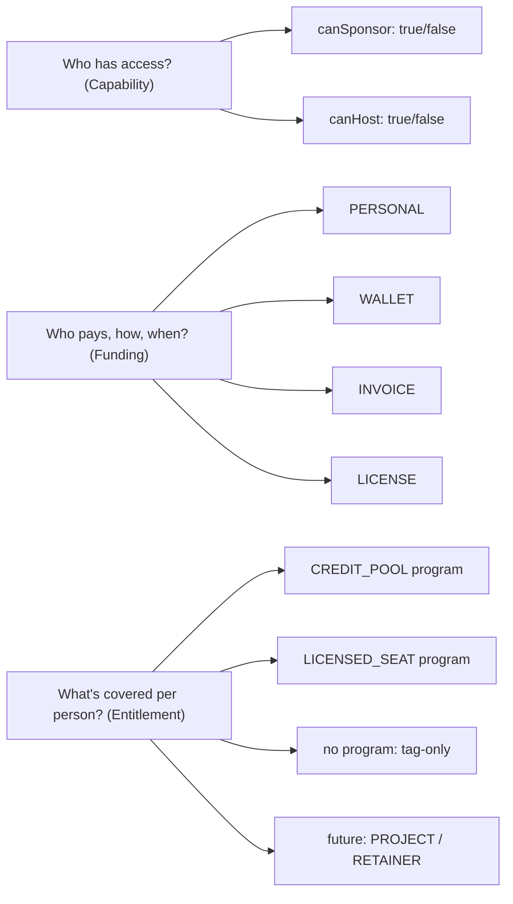

### 4.2 Why three axes?

The old design (pre-Arch-4) pinned every org to one of two enum values for kind (`BUYER`/`PROVIDER`) and one of four enum values for billing mode (`TAG_ONLY`/`SEAT_PACK`/`INVOICED_MONTHLY`/`PREPAID_UNLIMITED`). That was rigid. A real-world org that wanted to sponsor SOME employees via a credit pool and OTHERS via an invoice didn't fit. An org that was both BUYER and PROVIDER (HYBRID) was hacked on.

The three-axis design fixes this. Each axis moves independently:

- An org can switch from PERSONAL to WALLET funding without changing its capability.
- An org can add CREDIT_POOL programs AND LICENSED_SEAT programs at the same time.
- An org can flip from BUYER-only to HYBRID without a schema migration.

### 4.3 How the axes compose

Here are some real permutations:

| Organization | canSponsor | canHost | Funding | Programs | Real-world shape |
|---|---|---|---|---|---|
| Wipro | ✅ | ❌ | WALLET | 1× CREDIT_POOL | Company pre-loads credit pool; engineers book |
| Wipro (alt) | ✅ | ❌ | INVOICE | No program, invoice-accrual | Company pays month-end for whatever was booked |
| Wipro (premium) | ✅ | ❌ | LICENSE | 1× LICENSED_SEAT with unlimited bookings | Company pays flat fee per seat per year |
| LearnPro | ❌ | ✅ | N/A | N/A | Agency that hosts EXPERT mentors; learners pay B2C |
| IIT Madras | ✅ | ✅ | WALLET | 1× CREDIT_POOL | Both sides of marketplace under one roof |
| Freelancer using platform | ❌ | ❌ | N/A | N/A | INERT org — misconfigured or transitional |

### 4.4 Decision tree for "what kind of org am I?"

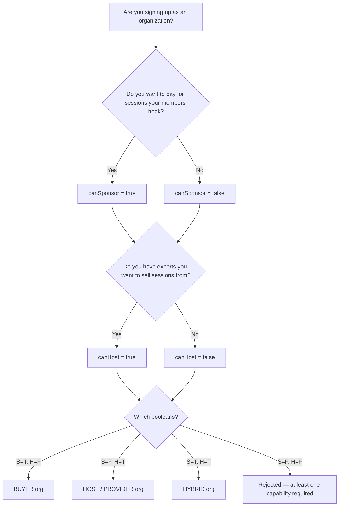

---

## 5. Core terminology cheat sheet

This is a mini-glossary for the terms you'll see everywhere. A full A-Z glossary is in Part IX.

| Term | Meaning |
|---|---|
| **Organization** | The tenant — Wipro, LearnPro, IIT Madras. |
| **Member / Membership** | A person's relationship to an org (distinct from User — a User can have many Memberships in different orgs). |
| **MemberRole** | The role a Member has inside a specific org: OWNER, MAINTAINER, MANAGER, EXPERT, LEARNER, SUPPORT. |
| **canSponsor** | Boolean flag: does this org pay for its members' bookings? |
| **canHost** | Boolean flag: does this org host EXPERTs who earn revenue through it? |
| **BillingAccount** | The org's wallet + funding-source record. 1:1 with Organization when `canSponsor=true`. |
| **FundingSource** | How the org pays: PERSONAL / WALLET / INVOICE / LICENSE. Lives on BillingAccount. |
| **Program** | A commercial package describing what members get: CREDIT_POOL (pay-as-you-go), LICENSED_SEAT (flat fee, unlimited). Future: PROJECT, RETAINER. |
| **ProgramAssignment** | "This member is on this program for this period" — per-member entitlement row. |
| **BookingUtilization** | "This booking consumed this much of this program's entitlement" — per-booking attribution. |
| **Contract** | Legal + commercial agreement between the org and the platform. Holds term dates, rate card, billing cadence. |
| **PurchaseOrder (PO)** | The org's internal PO number for an invoice. Enables 3-way match: PO + invoice + receipt. |
| **OrganizationInvoice** | Bill sent to the org (not the learner). For WALLET top-ups, INVOICE accruals, LICENSE renewals. |
| **PaymentLeg** | One component of a Payment's funding: CARD + REFERRAL_CREDIT + WALLET + INVOICE_ACCRUAL + LICENSE. Legs can stack; sum to Payment.amount. |
| **WalletEntry** | Immutable ledger row for wallet changes (top-ups, debits, refunds). |
| **RateCard** | The 3-way revenue split (platform/org/consultant) applicable to this contract. Versioned with `effectiveFrom` / `effectiveTo`. |
| **OrganizationEarnings** | The org's share of settled sessions (applies to canHost orgs). |
| **OrganizationPayout** | A batch settlement of earnings to the org's bank account. |
| **OrgAuditLog** | Immutable record of every significant mutation on the org (invite sent, member removed, contract signed, etc.). |
| **SSO Provider** | SAML or OIDC identity provider that lets the org's users sign in via their corporate IdP. |
| **Domain Claim** | "This email domain belongs to this org" — enables domain-based auto-join on SSO. |
| **ConsentArtifact** | DPDP-compliant record of a user's consent for data processing. |

---
---

# PART II — THE BUSINESS LAYER

## 6. Organization types & capabilities

The four capability kinds — BUYER, HOST, HYBRID, INERT — are determined by the `canSponsor` and `canHost` booleans.

### 6.1 BUYER (canSponsor=true, canHost=false)

**Shape:** A company or institution that **buys mentorship for its people.**

**Real examples:**

- Wipro sponsoring 200 engineers
- IIT Bombay sponsoring 50 placement-prep students
- A startup sponsoring leadership coaching for 10 managers

**What BUYER orgs can do:**

- Create Programs (CREDIT_POOL or LICENSED_SEAT).
- Assign Programs to members.
- Top up wallet OR receive monthly invoices.
- View sponsored-session analytics.

**What BUYER orgs cannot do:**

- Host EXPERT members (those require canHost=true).
- Receive payouts (they pay, not receive).
- Publish a public marketplace page.

**Typical member composition:**

- 1 OWNER (HR head or Head of People Ops)
- 1-3 MAINTAINERs (HR team)
- 0-2 MANAGERs (department leads)
- 0-2 SUPPORT (non-billing admin)
- 10-500 LEARNERs (employees/students)
- 0 EXPERTs (they don't host)

### 6.2 HOST / PROVIDER (canSponsor=false, canHost=true)

**Shape:** An agency or collective that **sells its experts' time.**

**Real examples:**

- LearnPro (30 mentors, 0 learners — they're a supply-side agency)
- A consulting firm like McKinsey selling its consultants' time externally
- A career coaching collective

**What HOST orgs can do:**

- Invite EXPERT members who become Familiarise consultants under the org banner.
- Receive payouts (3-way split: platform / org / consultant).
- Publish a public marketplace page on `/explore/enterprise/organisations`.
- Set a RateCard that governs all their experts' revenue split.

**What HOST orgs cannot do:**

- Create sponsorship Programs (no members to sponsor).
- Have a BillingAccount (no funding source needed).
- Receive invoices (they issue them indirectly via the platform).

**Typical member composition:**

- 1 OWNER (Agency founder)
- 1-2 MAINTAINERs (Agency admins)
- 0-1 MANAGERs
- 5-50 EXPERTs (the mentors)
- 0 LEARNERs
- 0-5 SUPPORT

### 6.3 HYBRID (canSponsor=true, canHost=true)

**Shape:** An organization that **runs both sides** of the marketplace internally.

**Real examples:**

- IIT Madras: faculty (EXPERT) + students (LEARNER) in one org
- A training firm that both has its own mentors AND sponsors sessions for its corporate-client employees
- A company that has in-house coaches (EXPERT) and also sponsors external-mentor sessions for junior staff (LEARNER)

**What HYBRID orgs can do:**

- Everything BUYER can do + everything HOST can do.
- Internal sessions: LEARNER books an EXPERT member; funded by the org's sponsorship; consultant earns via org's 3-way split.

**HYBRID is the most complex permutation.** When a HYBRID org's LEARNER books its own EXPERT, the money flow is essentially intra-org (minus the platform's commission). Revenue share math gets interesting.

### 6.4 INERT (canSponsor=false, canHost=false)

**Shape:** Organization exists but can't DO anything.

**How orgs end up INERT:**

- Misconfiguration during onboarding (server rejects this now via `.refine()` in validation, but schema-level the state is reachable).
- Transitional: admin is about to flip on a capability.
- Soft-deletion intermediate state.

**What INERT orgs can do:** nothing. All sponsor routes 404; all host routes 404.

**Treatment:** alerting fires if an org sits in INERT for > 24 hours.

### 6.5 Capability transition matrix

| From | To | Allowed? | Notes |
|---|---|---|---|
| BUYER | HYBRID | Yes | Flip `canHost=true`. Must go through Program + RateCard setup. |
| BUYER | HOST | **No** | Would delete the BillingAccount; OWNER must confirm explicitly via a special operation. |
| HOST | HYBRID | Yes | Flip `canSponsor=true`. Must create a BillingAccount. |
| HOST | BUYER | **No** | Would orphan existing EXPERT members. OWNER must remove them first. |
| BUYER | INERT | **No** | Blocked by anti-lockout guard. |
| HYBRID | BUYER | Yes (with confirmation) | Requires removing EXPERT members first. |
| HYBRID | HOST | Yes (with confirmation) | Requires closing BillingAccount + refunding any balance. |
| Any | INERT | **No** | Blocked. |

---

## 7. Billing modes in depth

Only BUYER and HYBRID orgs have a billing mode (HOST orgs don't buy, they sell). There are **four** billing modes.

### 7.1 PERSONAL (tag-only)

**What it is:** The org doesn't pay for anything. Members still use their personal cards/UPI. Bookings just carry a tag "this was booked through $OrgName" for reporting / attribution.

**When to use:**

- Pilot phase — org wants to see usage patterns before committing to a budget.
- Social-enterprise orgs that want to track impact without funding.
- Marketing-only relationships.

**Money flow:**

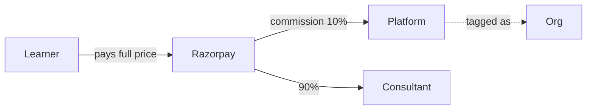

**PaymentLegs written:** 1 leg, `source=CARD`, `amountPaise=full`.

**Example:**

- Wipro pilots Familiarise. 10 engineers opt in voluntarily. Each pays their own ₹999 session. Wipro sees it all in their analytics dashboard but pays nothing.

### 7.2 WALLET (pre-paid credit pool)

**What it is:** The org pre-loads money onto the platform. Each booking debits from that balance. When empty, members can't book until topped up.

**When to use:**

- Org wants cost control (hard cap on spend).
- Usage patterns are variable.
- Finance team wants upfront budget commitment (not post-paid).

**Money flow (top-up):**

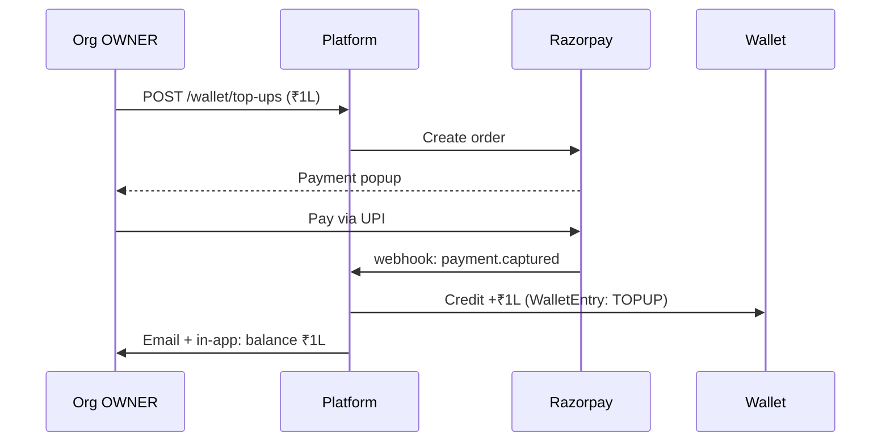

**Money flow (booking):**

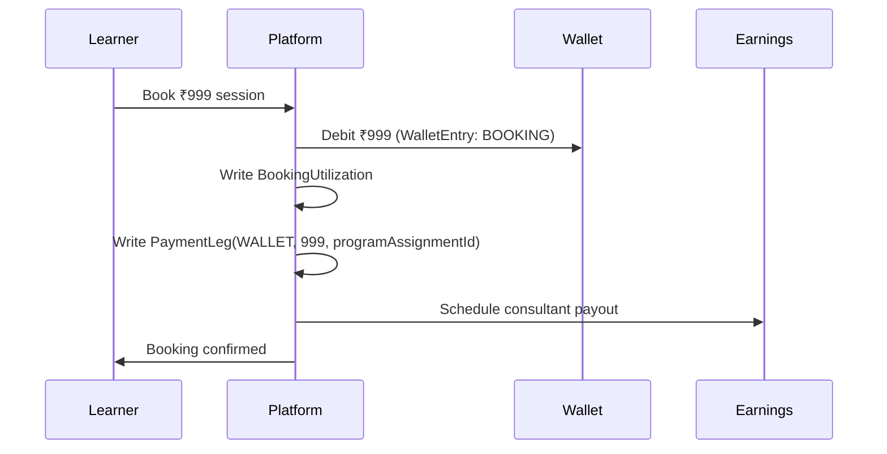

**PaymentLegs written:** 1 leg, `source=WALLET`, `amountPaise=price`.

**Example:**

- Wipro pre-loads ₹5L to its Familiarise wallet. Engineers book sessions freely. Each ₹999 booking debits the wallet. When the wallet hits a low-threshold (configurable, e.g. ₹50K), Wipro's OWNER gets an email asking to top up.

### 7.3 INVOICE (post-paid monthly)

**What it is:** The org signs a contract with a credit limit (e.g. ₹10L). Members book freely. At month-end the platform issues one consolidated invoice. Org pays NET-30 or NET-60.

**When to use:**

- Large enterprises with procurement processes (POs, multiple approval layers).
- Cash-flow management — "pay me at the end of the month, not upfront."
- Tax efficiency — one invoice per month is easier to process.

**Money flow:**

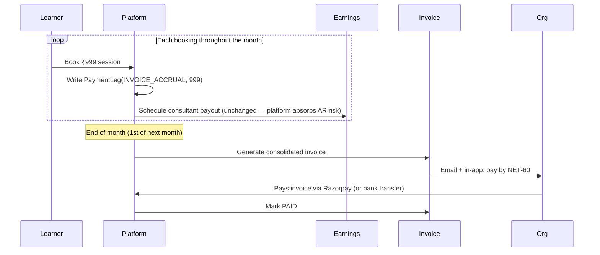

**PaymentLegs written:** 1 leg per booking, `source=INVOICE_ACCRUAL`, `amountPaise=price`. Legs are re-aggregated at month-end into the invoice.

**Example:**

- IIT Madras signs a ₹20L credit-limit contract. Students book sessions throughout the month. On 1st May, invoice is generated for 200 bookings totaling ₹1.5L + GST. IIT Madras pays within 60 days.

### 7.4 LICENSE (flat-fee unlimited)

**What it is:** The org pays a flat monthly/annual fee per seat. Members on that program can book unlimited sessions (up to a configurable soft cap like 4/month) without per-booking billing.

**When to use:**

- Predictable high-volume usage.
- Org wants a simple "per employee per year" cost line.
- HR/Finance prefer a subscription to a usage-based model.

**Money flow:**

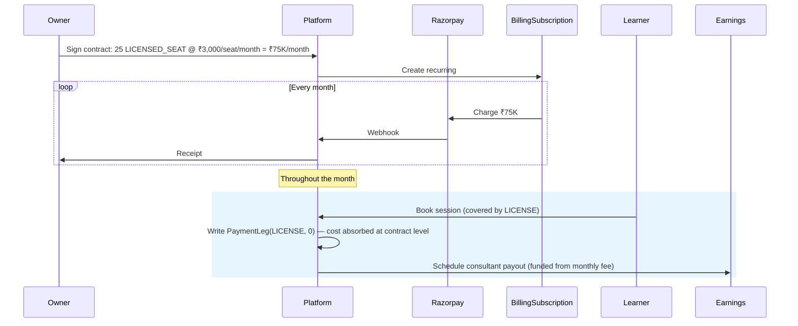

**PaymentLegs written:** 1 leg, `source=LICENSE`, `amountPaise=0` (cost is absorbed at contract level; the leg exists so every Payment has ≥1 leg — reconciliation invariant).

**Example:**

- A startup with 25 engineers signs a ₹75K/month (₹3K/seat) LICENSED_SEAT contract. Engineers book up to 4 sessions/month each. If an engineer tries to book a 5th session that month, they get "cap reached; upgrade tier or wait until next cycle."

### 7.5 Billing mode comparison

| Dimension | PERSONAL | WALLET | INVOICE | LICENSE |
|---|---|---|---|---|
| Who pays? | Individual members | Org (pre-paid) | Org (post-paid) | Org (subscription) |
| When? | At booking time | Upfront | Month-end | Monthly/annual |
| Cost cap? | None | Wallet balance | Credit limit | Seat × rate |
| Financial risk? | Platform absorbs none | Platform absorbs none (money already in) | Platform absorbs AR risk | Platform absorbs none |
| Simple for org finance? | Best (no invoicing) | Good | Good (one invoice/mo) | Best (predictable) |
| Suitable for pilots? | Yes | Marginal | No | No |
| Suitable for scale? | Poor (reporting fragmentation) | Good | Best | Best |
| GST complexity? | None (learner invoice) | Mid (top-up invoice) | Highest (monthly invoice + PO match) | Mid (subscription invoice) |

### 7.6 Choosing a billing mode (decision tree)

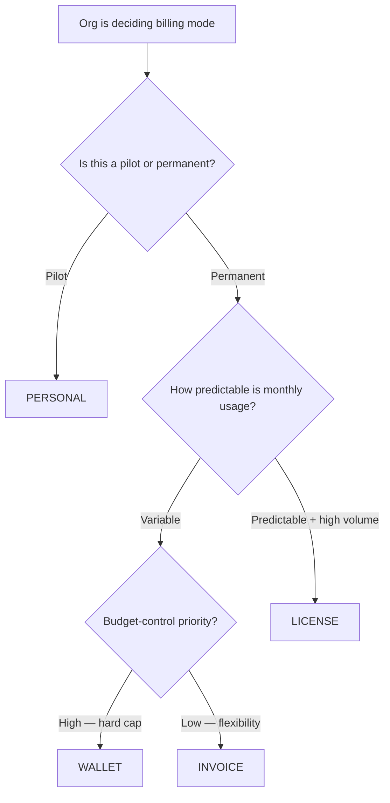

---

## 8. Program types deep dive

A Program is a commercial package describing **what the org has bought for its members.** There are **four** program types in the enum today. Two are shipped, two are reserved for a future release.

### 8.1 LICENSED_SEAT (shipped)

**Shape:** Flat fee per seat per cycle; unlimited bookings (with optional soft cap).

**Sub-config table:** `LicensedSeatConfig` (already in schema).

**Fields:**

| Field | Meaning |
|---|---|
| `seatCount` | Total seats paid for |
| `seatsUsed` | Current assigned seat count (atomically tracked) |
| `cycleMonths` | 1 (monthly) or 12 (annual) |
| `coveredEngagementsPerCycle` | Soft cap per member per cycle; null = unlimited |
| `overageBehavior` | BLOCK (reject) or ALLOW_WITH_OVERAGE (charge extra) |
| `overageRatePaise` | Price per overage session when ALLOW_WITH_OVERAGE |
| `pricePerSeatPaise` | Price per seat per cycle |

**Use case:** Acme Corp wants 25 engineers to have unlimited mentorship. Acme signs a ₹3K/seat/month LICENSED_SEAT contract = ₹75K/month. Each engineer is capped at 4 sessions/month (soft cap) to prevent abuse. If they hit the cap, the overage behavior decides: BLOCK (try next month) or ALLOW_WITH_OVERAGE (charged extra).

### 8.2 CREDIT_POOL (shipped)

**Shape:** Pre-paid credits; each booking deducts credits.

**Sub-config table:** `CreditPoolConfig` (already in schema).

**Fields:**

| Field | Meaning |
|---|---|
| `totalCredits` | Credits purchased in this pool |
| `creditsUsed` | Credits consumed so far |
| `pricePerCreditPaise` | Price per credit (used for top-ups) |
| `premiumMultiplier` | Premium-session multiplier (e.g. 1.5x for senior mentor) |
| `minCreditsPerPeriod` | Minimum commitment per cycle (prevent pool abandonment) |

**Use case:** Wipro buys 500 credits at ₹800/credit = ₹4L pool. Each 1-hour session = 1 credit. Senior-mentor sessions = 1.5 credits (premium multiplier). When credits hit low-threshold, OWNER gets a notification to buy more.

### 8.3 PROJECT (reserved — future)

**Shape:** Fixed-price engagement with milestone-based invoicing. Sessions happen anytime, but billing triggers on milestone acceptance, not per-booking.

**Sub-config table:** `ProjectConfig` (planned; see Part VII § 31).

**Use case:** A consulting engagement where the org pays ₹10L for a 6-month project broken into 4 milestones (Discovery, Design, Build, Handoff). Sessions throughout, but invoicing gated on milestone sign-off.

**Status today:** `ProgramType.PROJECT` exists in the enum; creating a PROJECT program via API returns `400 Bad Request` with "not yet supported". Roadmap is in Part VII.

### 8.4 RETAINER (reserved — future)

**Shape:** Hours/month commitment + overage. Billing based on hour consumption, not per-session.

**Sub-config table:** `RetainerConfig` (planned; see Part VII § 32).

**Use case:** An org commits to 20 hours/month of mentor time at ₹5K/hour = ₹1L base. Mentors log hours. Overage hours (beyond 20) billed at 1.5x.

**Status today:** `ProgramType.RETAINER` reserved in enum; routes 400.

### 8.5 Program type comparison

| Dimension | LICENSED_SEAT | CREDIT_POOL | PROJECT (future) | RETAINER (future) |
|---|---|---|---|---|
| Billing unit | Seat × cycle | Credit | Milestone | Hour |
| Billing trigger | Time (monthly/yearly) | Pre-purchase | Milestone acceptance | Month-end hour total |
| Cost shape | Predictable | Variable (pool deplete) | Fixed total | Predictable base + variable overage |
| Session tracking | Per-member cap | Per-credit | Per-deliverable | Per-hour |
| Best for | Always-on teams | Ad-hoc usage | Consulting projects | Ongoing advisory |
| Real-world analog | Slack seat subscription | Starbucks punchcard | Construction contract | Lawyer retainer |

### 8.6 Program assignment flow

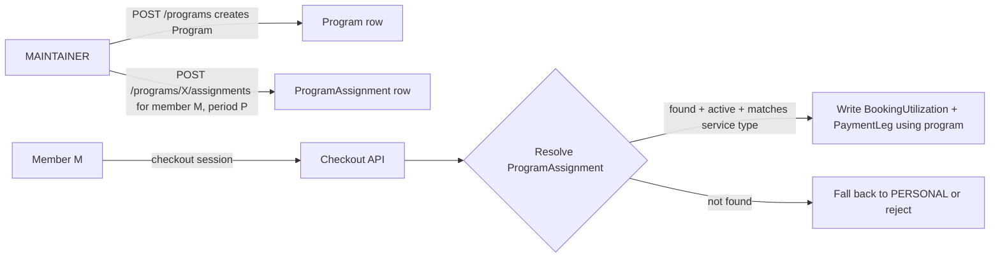

---

## 9. Roles, permissions & governance

Organizations are governed by a **MemberRole** hierarchy, enforced at the API layer.

### 9.1 The six roles

| Role | Seniority | Key capabilities | Platform equivalent |
|---|---|---|---|
| **OWNER** | Highest | Full control: billing, settings, SSO, member management, deletion | GitHub "Owner" |
| **MAINTAINER** | High | Member management, program management, org settings (no billing, SSO, or deletion) | GitHub "Maintainer" |
| **MANAGER** | Mid | View billing, analytics, credit pool. Read-only access to management pages | Department lead |
| **EXPERT** | Mid | Delivers services on behalf of the org (canHost only) | Marketplace consultant |
| **LEARNER** | Base | Consumes sessions via the org | Marketplace consultee |
| **SUPPORT** | Base | Non-billing staff for internal admin | Customer-facing support |

### 9.2 Complete permission matrix

| Action | OWNER | MAINTAINER | MANAGER | EXPERT | LEARNER | SUPPORT |
|---|---|---|---|---|---|---|
| View org dashboard | ✅ | ✅ | ✅ | ✅ | ✅ | ✅ |
| Invite members | ✅ | ✅ | ❌ | ❌ | ❌ | ❌ |
| Change member role | ✅ | ✅ (except OWNER) | ❌ | ❌ | ❌ | ❌ |
| Remove member | ✅ | ✅ (except last OWNER) | ❌ | ❌ | ❌ | ❌ |
| Create Program | ✅ | ✅ | ❌ | ❌ | ❌ | ❌ |
| Assign Program to member | ✅ | ✅ | ❌ | ❌ | ❌ | ❌ |
| Change billing mode | ✅ | ❌ | ❌ | ❌ | ❌ | ❌ |
| Top up wallet | ✅ | ❌ | ❌ | ❌ | ❌ | ❌ |
| Create contract | ✅ | ❌ | ❌ | ❌ | ❌ | ❌ |
| Issue invoice | ✅ | ❌ | ❌ | ❌ | ❌ | ❌ |
| View billing / invoices | ✅ | ❌ | ✅ | ❌ | ❌ | ❌ |
| Create SSO provider | ✅ | ❌ | ❌ | ❌ | ❌ | ❌ |
| Claim domain | ✅ | ❌ | ❌ | ❌ | ❌ | ❌ |
| Receive payout (canHost) | ✅ | ❌ | ❌ | ✅ | ❌ | ❌ |
| Book a session | ✅ | ✅ | ✅ | ❌ | ✅ | ✅ |
| Deliver a session | ❌ | ❌ | ❌ | ✅ | ❌ | ❌ |
| Delete the organization | ✅ | ❌ | ❌ | ❌ | ❌ | ❌ |

### 9.3 Role transitions (the LEARNER ↔ EXPERT guard)

Not all role transitions are allowed. A MAINTAINER can change a LEARNER's role to MANAGER (promotion) but cannot change a LEARNER into an EXPERT (different platform user type — would require consultant verification).

The blocked transitions:

| From | To | Blocked? | Reason |
|---|---|---|---|
| LEARNER | EXPERT | ✅ Blocked | Different platform identity (UserRole.CONSULTEE vs CONSULTANT) |
| EXPERT | LEARNER | ✅ Blocked | Same reason, reverse direction |
| Any other role → OWNER | ✅ Blocked for MAINTAINERs | Only OWNERs can assign OWNER role |
| OWNER → Any (last OWNER) | ✅ Blocked | Anti-lockout guard; can't orphan the org |

### 9.4 Anti-lockout guards

The system explicitly refuses to execute operations that would leave the org in an unusable state. These guards are load-bearing — they're the difference between "user made a mistake" and "customer lost the org forever."

| Guard | Protects against |
|---|---|
| Last-OWNER demotion/removal | Orphaning the org |
| Last-capability disable (canSponsor AND canHost = false) | INERT state |
| Last SSO provider delete when enforceSSO=true | Locking out all users |
| Last domain claim release when enforceSSO=true AND no providers | Same |
| Active member removal during org deletion | Orphaning members |
| Delete Program with existing assignments | Soft-delete instead (sets `status=CANCELLED`) |

### 9.5 Platform roles vs org roles

**Important:** `MemberRole` (org-internal) is distinct from `UserRole` (platform-wide). A single user has:

- One `UserRole` (CONSULTANT, CONSULTEE, STAFF, ADMIN, ORG_ADMIN) — their platform identity.
- Zero or many `MemberRole`s — one per org they belong to.

A platform ADMIN (Staff member of Familiarise) always passes every `requireOrgAccess` check — admins can see + operate on any org for support purposes. This is logged to the audit trail.

---

## 10. Real-world business scenarios

These are end-to-end narrative examples. Each one covers: who the customer is, what they want, how the platform models it, what the money flow looks like.

### 10.1 Scenario A — Wipro (BUYER + INVOICE mode)

**Customer:** Wipro Enterprise HR.

**Need:** Sponsor 1:1 mentorship for 200 senior engineers. Finance wants monthly invoicing (not upfront pre-pay). Procurement requires PO matching.

**Setup:**

1. OWNER (VP HR) signs up, creates org.
2. OWNER configures: `canSponsor=true, canHost=false, fundingSource=INVOICE`.
3. OWNER signs a contract: 12-month term, ₹20L credit limit, NET-60 terms.
4. OWNER does NOT create a Program (INVOICE mode accrues payment legs directly, no per-member entitlement needed).
5. OWNER invites 3 MAINTAINERs (HR team) + 200 LEARNERs (engineers) via CSV upload.
6. LEARNERs accept invites; their billing defaults to "bill to Wipro" when booking.

**Month 1 activity:** 40 sessions booked, totaling ₹40K. 40 PaymentLeg rows written with `source=INVOICE_ACCRUAL`. Consultants get paid as normal (platform absorbs AR risk).

**Month-end:** Platform runs month-end invoice cron, generates one invoice for ₹47,200 (₹40K + 18% GST). Invoice sent to Wipro's billing email + audit entry.

**Payment:** Wipro pays via Razorpay or bank transfer within 60 days. Invoice flips to PAID status.

**Reporting:** Wipro's HR OWNER sees monthly usage by department, top consultants, ROI.

### 10.2 Scenario B — LearnPro (HOST only)

**Customer:** LearnPro, a 3-year-old EdTech agency with 30 in-house senior mentors.

**Need:** Sell mentor time through Familiarise to reach wider audience; get revenue-share income.

**Setup:**

1. OWNER (founder) signs up, creates org.
2. OWNER configures: `canSponsor=false, canHost=true`.
3. OWNER provides PayoutAccount details (bank + KYC).
4. OWNER signs contract with 70/20/10 rate card (consultant gets 70%, LearnPro 20%, platform 10%).
5. OWNER invites 30 EXPERTs via email.
6. Each EXPERT accepts + verifies their consultant profile (independent verification flow).

**Ongoing:** Learners (B2C or sponsored by other orgs) book EXPERTs. Each booking writes `OrganizationEarnings`:

- Gross revenue: ₹5,000
- Consultant share: ₹3,500 (70%)
- LearnPro share: ₹1,000 (20%)
- Platform share: ₹500 (10%)

**Payout:** At month-end, LearnPro's `OrganizationEarnings` are batched into an `OrganizationPayout`. Razorpay Payouts sends ₹X (month total) to LearnPro's account. Consultants get their shares via separate individual payouts.

### 10.3 Scenario C — IIT Madras (HYBRID)

**Customer:** IIT Madras Career Services.

**Need:** Faculty mentors deliver sessions to students (internal) + external public learners book faculty time (external).

**Setup:**

1. OWNER (Director of Career Services) signs up, creates HYBRID org.
2. Configures: `canSponsor=true, canHost=true, fundingSource=WALLET`.
3. Top up wallet with ₹5L from IIT's budget.
4. Create a LICENSED_SEAT Program: 2000 seats, ₹500/seat/year, covering unlimited sessions for students.
5. Invite 100 faculty as EXPERTs + 2000 students as LEARNERs.
6. Students (LEARNERs on LICENSED_SEAT program) book faculty sessions free to them.
7. External public users (non-IIT) discover faculty on `/explore/enterprise/organisations/iit-madras` and book directly (B2C path).

**Internal session money flow:**

- LEARNER books faculty. LICENSED_SEAT program absorbs cost.
- Faculty EXPERT earns via 3-way split (70% to faculty, 20% to IIT Madras, 10% to platform).
- The IIT Madras 20% share funds the LICENSE seat cost; platform settles the faculty 70% from the wallet pre-funding.

**External session money flow:**

- Public learner pays ₹3,000 directly via Razorpay.
- Standard 3-way split (70/20/10) applies.
- Platform keeps 10%, IIT Madras earns 20%, faculty earns 70%.

### 10.4 Scenario D — Solo consultant joining a HOST org

**User:** Freelance career coach.

**Need:** Move from solo B2C to agency-backed (more structured, better tax handling).

**Flow:**

1. Freelancer has been on Familiarise as a CONSULTANT (B2C path).
2. An agency (HOST org) invites them as an EXPERT via email.
3. Freelancer accepts → Membership row created with `role=EXPERT`, `status=ACTIVE`.
4. Freelancer's future bookings now flow through the agency's rate card + earnings split.
5. Existing bookings on the B2C path retain their original (100% to freelancer minus commission) split.

**Governance:** Freelancer can belong to multiple HOST orgs simultaneously. Session attribution uses the org whose marketplace page the learner booked from.

### 10.5 Scenario E — Small startup (BUYER + WALLET + simple)

**Customer:** 15-person early-stage startup.

**Need:** Give the team access to senior mentors. Small budget, no HR team.

**Setup:**

1. Founder signs up as OWNER.
2. Configures: `canSponsor=true, canHost=false, fundingSource=WALLET`.
3. Tops up wallet with ₹50K.
4. Creates a CREDIT_POOL Program: 50 credits at ₹1000/credit.
5. Assigns program to all 15 employees (MAINTAINER role for co-founder).
6. Employees book mentors; each booking deducts credits.

**When credits run out:** OWNER gets notified. Tops up again or raises limits.

**Growth:** If monthly usage stabilizes, OWNER can migrate from CREDIT_POOL to LICENSED_SEAT for cost predictability.

### 10.6 Scenario F — Booking via org program (member POV)

A LEARNER's concrete experience booking a session when their org has a Program:

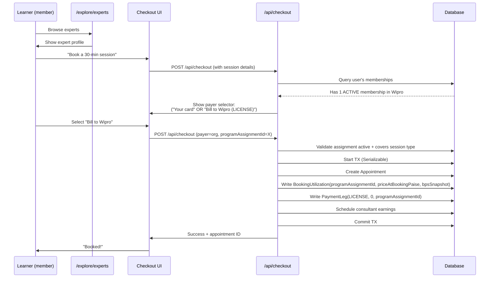

---
---

# PART III — THE USER LAYER

## 11. User journeys & onboarding permutations

Different users enter the system through different flows. Each flow has different validation rules, database writes, and UX.

### 11.1 Journey A — New user signing up as ORG_OWNER

A founder signing up for the first time to create an organization.

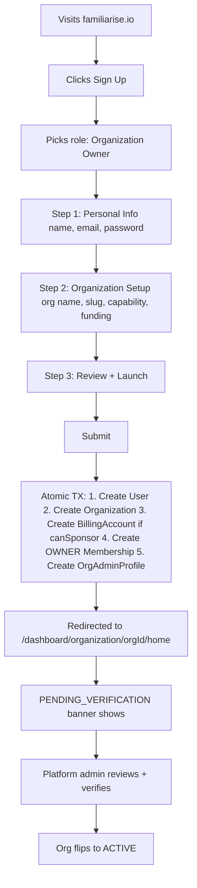

**Key gate:** org status starts at `PENDING_VERIFICATION`. OWNER can configure branding + draft programs but cannot invite members or move money until admin verification.

### 11.2 Journey B — Existing user invited to an org as LEARNER

A user who already has a consultee profile receives an invite link.

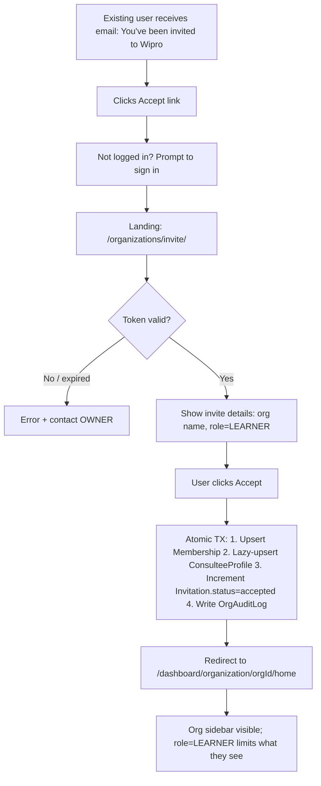

### 11.3 Journey C — New user invited as EXPERT (HOST org)

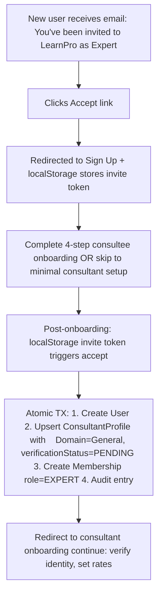

### 11.4 Journey D — MAINTAINER invites a team

A batch invite flow.

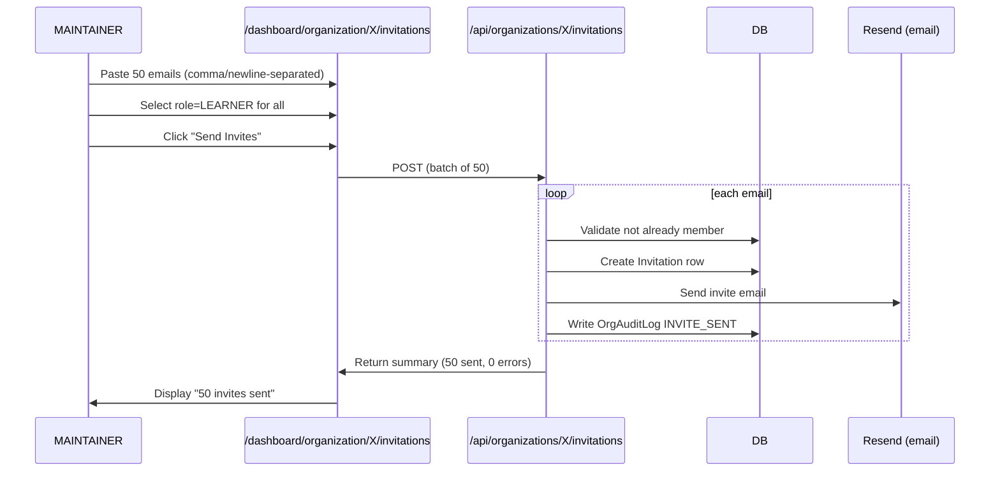

### 11.5 Journey E — User who belongs to multiple orgs

Users can be members of many orgs simultaneously. The UX accommodates via the **OrganizationSwitcher** dropdown.

**Example:**

- Alice is a LEARNER in Wipro.
- Alice is also an EXPERT in LearnPro.
- Alice is also an OWNER in her own side-project org.

**UX:**

- Navbar shows OrgSwitcher dropdown (top-right).
- Dropdown lists all Alice's active memberships with role badges.
- Selecting one switches the dashboard context (URL changes to `/dashboard/organization/{newOrgId}/...`).
- Session state preserves the last-selected org for repeat visits.

### 11.6 Journey F — User leaves an org

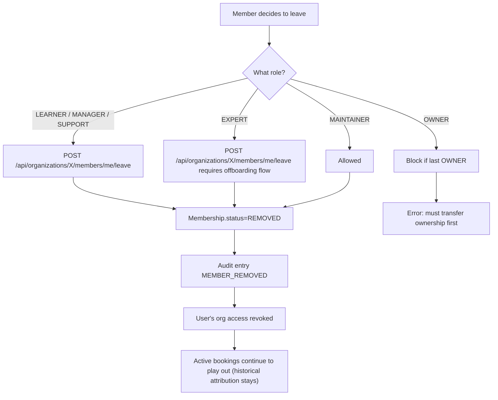

### 11.7 Journey G — SSO auto-join via domain claim

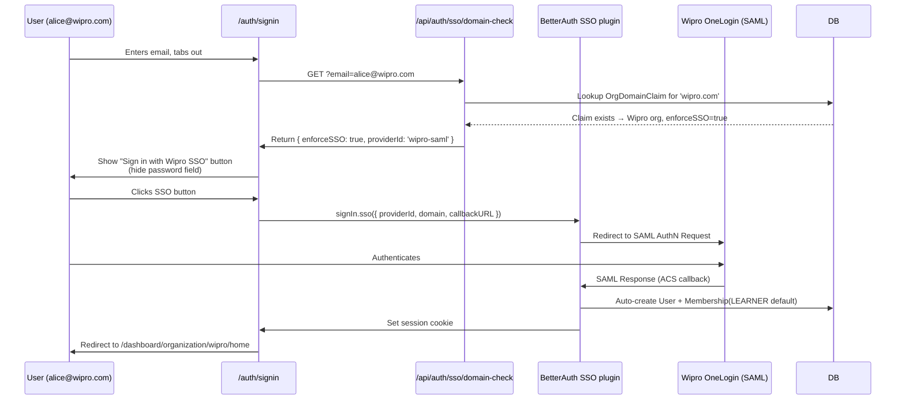

### 11.8 Permutation matrix

A matrix of possible user × org states:

| User has... | Org state | Net effect |
|---|---|---|
| 0 memberships | N/A | Pure B2C — sees B2C dashboard only |
| 1 active LEARNER | ACTIVE | Sees both personal + org dashboards; OrgSwitcher visible |
| 1 pending invite | PENDING_VERIFICATION | Invite link works; acceptance creates Membership |
| 1 active membership | SUSPENDED | Cannot book; sees suspended banner |
| Multiple memberships | Some ACTIVE, some not | Active ones are switchable; suspended ones show banner |
| 1 OWNER | ACTIVE | Full dashboard; can delete org (with confirmation) |
| 1 OWNER + 1 MAINTAINER elsewhere | Both ACTIVE | Switchable; different permissions per context |
| 1 EXPERT + 1 LEARNER (different orgs) | Both ACTIVE | One org hosts them, the other sponsors them |

---

## 12. Common actions by role

A cookbook of what each role typically does day-to-day.

### 12.1 OWNER daily/weekly

- Review monthly invoice + approve payment.
- Invite new senior hires.
- Review audit log for anomalies.
- Approve program creation requests from MAINTAINERs.
- Sign new contracts + approve rate card changes.
- Monthly: review NPS + usage analytics.

### 12.2 MAINTAINER daily/weekly

- Onboard new hires (send invitations).
- Manage member status (reactivate, remove).
- Create / configure Programs (WALLET top-ups, seat counts).
- Assign programs to specific members/cohorts.
- Handle L1 internal support (employee can't find dashboard).
- Daily: review pending invites + invite-acceptance rate.

### 12.3 MANAGER daily/weekly

- View analytics for their department.
- View wallet balance / credit pool usage.
- Escalate booking issues to MAINTAINER.

### 12.4 EXPERT (HOST org)

- Deliver sessions.
- Update availability calendar.
- View earnings (role-appropriate scope; not platform-wide).
- Update consultant profile.

### 12.5 LEARNER

- Browse marketplace / explore experts.
- Book sessions (covered by org program if assigned).
- Attend sessions via integrated Stream.io.
- View past sessions + feedback.

### 12.6 SUPPORT

- Read-only access to most pages.
- Cannot view billing or make changes.
- Typically used for compliance/audit observers who need visibility but no write access.

---

## 13. What users see (role-by-role UX tour)

### 13.1 Dashboard sidebar items (by role)

| Sidebar item | OWNER | MAINTAINER | MANAGER | EXPERT | LEARNER | SUPPORT |
|---|---|---|---|---|---|---|
| Overview (/home) | ✅ | ✅ | ✅ | ✅ | ✅ | ✅ |
| Members | ✅ | ✅ | ✅ (read) | ❌ | ❌ | ✅ (read) |
| Invitations | ✅ | ✅ | ❌ | ❌ | ❌ | ❌ |
| Experts (canHost) | ✅ | ✅ | ✅ (read) | ✅ (read) | ❌ | ❌ |
| Learners (canSponsor) | ✅ | ✅ | ✅ (read) | ❌ | ❌ | ❌ |
| Programs | ✅ | ✅ | ✅ (read) | ❌ | ❌ | ❌ |
| Plans (catalog) | ✅ | ✅ | ✅ (read) | ❌ | ❌ | ❌ |
| Contracts | ✅ | ❌ | ❌ | ❌ | ❌ | ❌ |
| Credits (wallet) | ✅ | ❌ | ✅ (read) | ❌ | ❌ | ❌ |
| Billing | ✅ | ❌ | ✅ (read) | ❌ | ❌ | ❌ |
| Purchase Orders | ✅ | ❌ | ❌ | ❌ | ❌ | ❌ |
| Payouts (canHost) | ✅ | ❌ | ✅ (read) | ❌ | ❌ | ❌ |
| Analytics | ✅ | ✅ | ✅ | ❌ | ❌ | ✅ (read) |
| Settings | ✅ | ❌ | ❌ | ❌ | ❌ | ❌ |
| SSO (in Settings) | ✅ | ❌ | ❌ | ❌ | ❌ | ❌ |
| Consent (DPDP) | ✅ | ❌ | ❌ | ❌ | ❌ | ❌ |

### 13.2 Key UI components

- **OrgContextBar** — top of every `/dashboard/organization/**` page. Shows org name, role badge, NotificationInbox (bell), OrgSwitcher.
- **DashboardNavbar** — for personal dashboard pages (/dashboard/consultee, /dashboard/consultant). Also shows OrgSwitcher when user has memberships.
- **OrgStatusBanner** — displayed for non-ACTIVE orgs (PENDING_VERIFICATION / SUSPENDED / DEACTIVATED).
- **NotificationInbox (bell)** — user-scoped Novu inbox. Org-event notifications are Phase 2 (see roadmap).

### 13.3 Checkout UI changes when user has org context

When a user with at least one active Membership hits the checkout flow, they see a **payer selector**:

```
[ ] Pay with your card / UPI (₹999)
[x] Bill to Wipro Enterprise (covered by org)
```

Server-side, the request includes `organizationId: "wipro-id"` and the payment routes through the org's billing mode (WALLET / INVOICE / LICENSE) instead of personal card.

If the user has no Membership, the payer selector hides entirely (no extra UX noise for B2C users).

---
---

# PART IV — THE FINANCIAL LAYER

## 14. Payment legs & the three-ledger system

Every movement of money on the platform is recorded across **three immutable ledgers** plus the **PaymentLeg** composition model. Understanding this is load-bearing for trusting the numbers.

### 14.1 The three ledgers

| Ledger | What it records | Immutable? |
|---|---|---|
| **UsageLedger** | "This session consumed this much of this entitlement." | Yes |
| **FundingLedger** | "Money came in / went out of this funding source." | Yes |
| **SettlementLedger** | "This invoice issued / this payout processed / this refund happened." | Yes |

**Invariant:** Every booking writes to all three ledgers + one or more PaymentLegs, atomically in a transaction.

### 14.2 PaymentLeg model

A Payment is composed of 1+ PaymentLegs. Each leg has a `source` (CARD, REFERRAL_CREDIT, WALLET, INVOICE_ACCRUAL, LICENSE) and an `amountPaise`. Legs sum to `Payment.amount` — invariant enforced at the end of every checkout transaction.

### 14.3 Leg composition patterns

| Scenario | Legs written | Invariant |
|---|---|---|
| B2C card pay, no credits | 1 × CARD, amount=price | sum = price |
| B2C card pay + ₹500 referral credit | 1 × CARD (price-500), 1 × REFERRAL_CREDIT (500) | sum = price |
| Org WALLET booking | 1 × WALLET, amount=price | sum = price |
| Org INVOICE booking (mid-month) | 1 × INVOICE_ACCRUAL, amount=price | sum = price |
| Org LICENSE booking | 1 × LICENSE, amount=0 | sum = 0; payment.amount = 0 |
| Mock booking (dev) | 0 legs (skipped) | invariant not checked |

### 14.4 Leg invariant enforcement

At the end of the checkout transaction, `checkPaymentLegsSumToAmount()` (in `lib/payments/payment-legs.ts`) logs a warning if the sum doesn't match. For tests and settlement jobs, the hard-throwing sibling `assertPaymentLegsSumToAmount()` raises an exception.

### 14.5 Ledger example — a single INVOICE booking

Wipro employee (LEARNER, on INVOICE mode) books a ₹999 session on April 15.

**Database writes (all atomic):**

1. `Payment.create({ amount: 999 })`
2. `Appointment.create({...})`
3. `BookingUtilization.create({ paymentId, priceAtBookingPaise: 999, bpsSnapshot: 10/20/70 })`
4. `PaymentLeg.create({ source: 'INVOICE_ACCRUAL', amountPaise: 999, sourceRef: programAssignmentId })`
5. `UsageLedgerEntry.create({ org, member, consumedCredits: 1, priceAtBooking: 999 })`
6. `FundingLedgerEntry.create({ source: 'INVOICE_ACCRUAL', amount: 999 })`
7. `OrganizationEarnings.create({ consultant, amount: 690, currency: INR })` — consultant gets 70% immediately
8. `OrgAuditLog.create({ action: 'SESSION_BOOKED_INVOICE_ACCRUAL' })`

**Month-end (April 30):**

1. Month-end cron aggregates 40 bookings totaling ₹40K.
2. `OrganizationInvoice.create({ amount: 40000, gst: 7200, total: 47200 })`
3. `SettlementLedgerEntry.create({ kind: 'INVOICE_ISSUED', invoiceId })`

**May 20 (Wipro pays):**

1. Razorpay webhook captures payment.
2. `OrganizationInvoice.update({ status: 'PAID', paidAt })`
3. `SettlementLedgerEntry.create({ kind: 'INVOICE_PAID' })`

The chain is queryable end-to-end: you can ask "where did this ₹999 come from?" and trace it through the three ledgers back to the original booking.

---

## 15. Rate cards & revenue splits

### 15.1 What a rate card is

A `RateCard` defines the 3-way revenue split for every session booked under a specific contract. Fields:

```prisma
model RateCard {
  platformBps   Int  // e.g. 1000 = 10%
  orgBps        Int  // e.g. 2000 = 20%
  consultantBps Int  // e.g. 7000 = 70%
  effectiveFrom DateTime
  effectiveTo   DateTime?
  ownerContractId String  // FK to Contract
}
```

**Sum invariant:** `platformBps + orgBps + consultantBps = 10000` (100%).

### 15.2 Snapshot semantics

When a session books, the rate card at that instant is **snapshotted** onto the `BookingUtilization` and `OrganizationEarnings` rows:

```
BookingUtilization.platformBpsAtBooking = 1000
BookingUtilization.orgBpsAtBooking = 2000
BookingUtilization.consultantBpsAtBooking = 7000
BookingUtilization.rateCardIdApplied = <rate_card_id>
```

Even if the contract's rate card is updated later, **closed bookings do not re-split.** The snapshot ensures settlement reads historical rates — a core audit invariant.

### 15.3 Rate card rotation (atomic bump)

When an org renegotiates their rate card, the change is applied via the atomic `bumpRateCard()` helper:

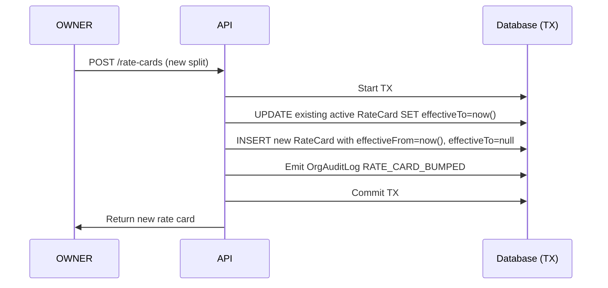

**Race safety:** two OWNERs cannot bump concurrently. The TX holds a row-level lock on Contract; one wins, the other retries with the new state.

### 15.4 Revenue split example

Consultant's ₹5,000 session, 10/20/70 rate card:

| Beneficiary | Basis points | Amount |
|---|---|---|
| Platform | 1000 (10%) | ₹500 |
| Org (HOST or HYBRID) | 2000 (20%) | ₹1,000 |
| Consultant | 7000 (70%) | ₹3,500 |

The org's ₹1,000 accrues to `OrganizationEarnings`. The consultant's ₹3,500 accrues to consultant earnings. Platform's ₹500 is platform revenue (commission).

---

## 16. Settlement & payouts

### 16.1 Settlement cadence

Settlement is **T+7 default** (can be contract-configured):

- Consultant completes a session on April 15.
- Earnings hit `status=HELD` until T+7 (April 22).
- On April 22, a cron promotes `HELD → READY`.
- At month-end (April 30), OWNER triggers payout OR admin-triggered batch payout.

### 16.2 Payout batch creation

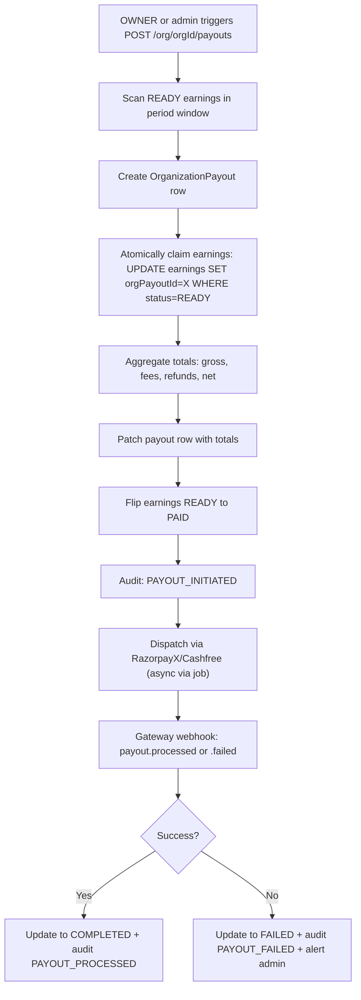

### 16.3 Payout state machine

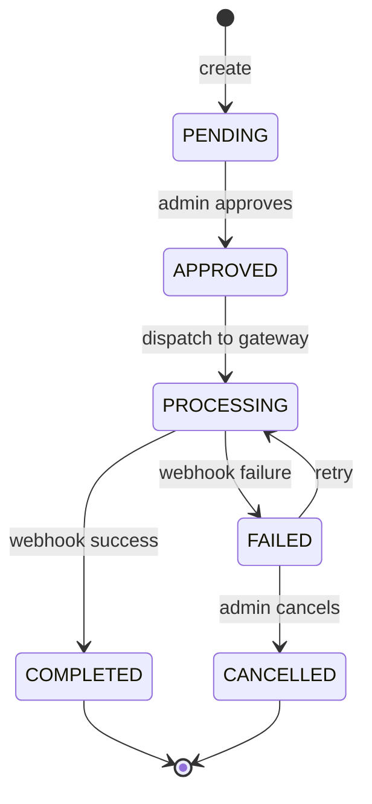

---

## 17. Refunds & reversals

### 17.1 Refund principles

1. **Refunds UPDATE, never DELETE.** Historical rows are preserved.
2. **Reversal uses `reversedAt` + `reversalReason` fields.** Not a separate model.
3. **Refund routing depends on original funding source.** WALLET refunds back to wallet; INVOICE refunds unbill the payment from rollup; LICENSE refunds don't move money (no charge to refund).

### 17.2 Refund flow (PERSONAL card path)

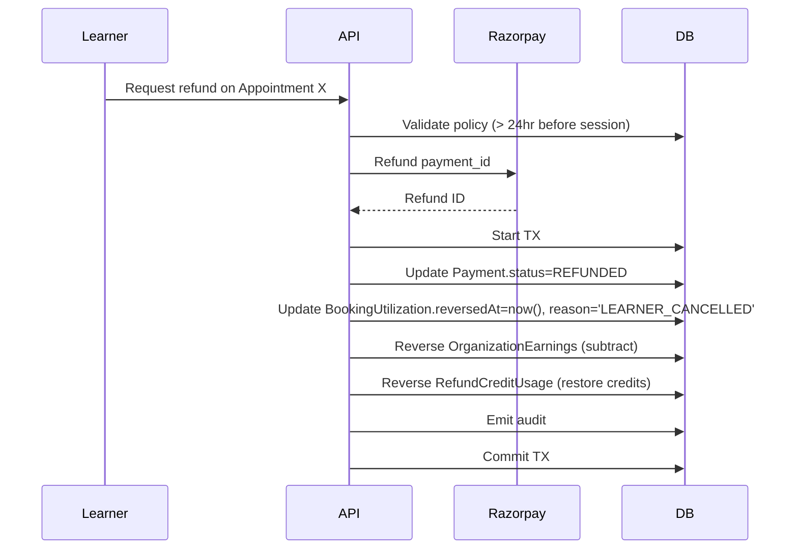

### 17.3 Refund flow (WALLET path)

- Same as PERSONAL, but instead of Razorpay refund call, the wallet is credited back.
- `WalletEntry.create({ reason: 'BOOKING_REFUND', amount: +999 })`.

### 17.4 Refund flow (INVOICE path)

- Invoice has not yet been issued: remove the PaymentLeg and accrual. Invoice at month-end will be lower.
- Invoice already issued: more complex — credit note issued (future work; currently manual reconciliation).

### 17.5 Refund policy matrix

| Cancellation timing | Refund amount | Consultant earnings |
|---|---|---|
| > 24 hours before session | 100% | Reversed (0% to consultant) |
| < 24 hours before session | 50% | 50% to consultant (kept for holding time) |
| No-show by learner | 0% | 100% to consultant (consultant showed up) |
| No-show by consultant | 100% | 0% + strike |

---
---

# PART V — THE COMPLIANCE LAYER

## 18. DPDP — India's Data Protection Act

The Digital Personal Data Protection Act, 2023.

### 18.1 What DPDP requires

- **Lawful grounds for data processing.** Consent is the most common.
- **Data minimization.** Collect only what you need.
- **Right to erasure (§12).** User can request data deletion.
- **Consent recording.** Must be explicit + auditable.
- **Data breach notification (§8).** Report within 72 hours.

### 18.2 How Familiarise implements DPDP

| Requirement | Implementation |
|---|---|
| Consent recording | `ConsentArtifact` model, SHA-256 hash of full policy text at consent time |
| Per-user consent log | `/api/organizations/[orgId]/consent` routes + `DataRegion` on Organization |
| Right to erasure | Manual process in v1 (admin runs deletion script). Future: automated endpoint. |
| Data breach log | `DataBreach` model (schema-final, admin UI pending) |

### 18.3 Consent artifact flow

```mermaid
flowchart TD
    U[User signs up] --> Modal[Consent modal displayed]
    Modal --> Accept[User clicks Accept]
    Accept --> API[POST /api/organizations/consent]
    API --> Hash[buildConsentArtifact: SHA-256 hash of policy text]
    Hash --> DB[Create ConsentArtifact row userId, policyVersion, hash, grantedAt]
    DB --> Audit[OrgAuditLog: CONSENT_GRANTED]
    Audit --> Continue[Onboarding continues]
```

### 18.4 Consent withdrawal

- User can withdraw via settings.
- Withdrawal triggers re-prompt on next action (no silent disable).
- Audit entry CONSENT_WITHDRAWN.

---

## 19. GST — indirect taxation

Indian Goods and Services Tax (GST) applies to almost everything.

### 19.1 GST rates on Familiarise services

| Service | HSN/SAC | GST rate |
|---|---|---|
| Mentorship / consulting services | 999293 | 18% |
| Training / educational services (if qualifying) | 999293 | 18% (or 0% for some exempt cases) |
| Platform commission (B2B) | 999293 | 18% |

### 19.2 Invoice requirements

Every B2B invoice must have:

- Invoice number (format: `INV-<orgId>-<timestamp>-<hex>`).
- GSTIN of supplier (Familiarise) + recipient (org) if registered.
- HSN code.
- Place of supply (state code).
- Tax rate + breakdown (CGST/SGST if intra-state, IGST if inter-state).
- Total + breakdown in both INR and display currency (if applicable).

### 19.3 Reverse charge mechanism (RCM)

For inbound SaaS bought by Familiarise (Claude API, Apple Developer, etc.), we pay GST under RCM (18%) and claim as Input Tax Credit (ITC) if we're GST-registered.

---

## 20. TDS — tax deducted at source

Direct tax withheld from consultant payouts.

### 20.1 Section applicability

| Consultant type | Section | Rate |
|---|---|---|
| Resident Indian consultant, professional | 194J | 10% |
| Resident Indian consultant, non-professional | 194C | 1-2% |
| Non-resident consultant | DTAA-dependent | 5-20% |
| PAN not provided | Section 206AA | 20% |

### 20.2 Current implementation

- `lib/compliance/tds.ts` returns stub 10% rate.
- `OrganizationPayoutAccount.pan` + `OrganizationPayoutAccount.residencyStatus` fields exist.
- TDS withheld at payout creation; `OrganizationPayout.tdsWithheldPaise`.
- Form 26Q (quarterly) filing: admin endpoint exists, actual filing manual in v1.

### 20.3 Roadmap

Live TDS derivation (Part VII § 32 of the Phase 2 epic):

1. Look up PAN → residency → applicable section.
2. Apply DTAA treaty rates for non-residents.
3. Fallback 20% for missing/invalid PAN.

---

## 21. MSME — vendor payment timing

MSME (Micro, Small & Medium Enterprises) Act, §15.

### 21.1 What MSME requires

If your payee is MSME-registered + has a written agreement, you must pay within **45 days** of invoice date. Beyond 45 days, interest accrues at 3x RBI bank rate.

### 21.2 Familiarise's MSME exposure

- Platform → Consultant: consultants may be MSME-registered (freelancers).
- Platform → Supplier: SaaS vendors (less common; most are tech companies).

### 21.3 Current implementation

- `OrganizationPayoutAccount.msmeStatus` + `Contract.writtenAgreementExists` (planned).
- `lib/compliance/msme.ts` returns `invoiceDate + 60 days` as deadline (stub).
- **Risk:** if we pay an MSME consultant past 45 days, we accrue interest liability.

### 21.4 Roadmap

Live MSME deadline derivation:

1. If MSME status true + written agreement true → 45 days.
2. Else standard commercial terms (typically 60 days).
3. Track OVERDUE invoices; admin alert.

---

## 22. FEMA — foreign exchange

Foreign Exchange Management Act, governing cross-border payments.

### 22.1 What FEMA requires

- Outbound payments to non-residents: via RBI-authorized rails (Razorpay IBT, Wise, SWIFT).
- Remittance receipt (FIRC equivalent) must be tracked.
- TDS under DTAA rules.

### 22.2 Current implementation

- Minimal — international payouts via Stripe Connect (which handles FEMA compliance itself).
- Razorpay IBT not yet wired.
- RBI reporting: manual.

### 22.3 Roadmap

Live FEMA-compliant payout splitting:

1. Residency classification at payout creation.
2. Route to appropriate rail (Razorpay domestic / IBT / Wise / Stripe Connect).
3. Persist remittance receipts.

---

## 23. IRN — e-invoicing

Invoice Reference Number (IRN) is required for B2B invoices above ₹5cr turnover.

### 23.1 What IRN requires

- Every B2B invoice uploaded to the GSTN Invoice Registration Portal (IRP) within 30 days of issue.
- IRP returns IRN + ackNumber + signedQrPayload — all must be printed on the invoice.
- 24-hour cancellation window.

### 23.2 Current implementation

- Schema-final: `OrganizationInvoice.irn`, `ackNumber`, `ackDate`, `signedQrPayload`, `irpStatus`, `irpRetryCount`, `irpLastError`.
- `jobs/compliance/irp-uploader.ts` is a stub that retries but doesn't actually call any IRP aggregator.
- `irpStatus` states: PENDING → UPLOADED / FAILED.

### 23.3 Who needs IRN

| Org turnover | IRN required? |
|---|---|
| < ₹5 crore | No (exempt) |
| ≥ ₹5 crore | Yes |

For pre-launch cohort (likely sub-₹5cr turnover), IRN is not launch-blocking.

### 23.4 Roadmap

Pick one aggregator (ClearTax / Masters India / IRIS) and wire the REST API in `jobs/compliance/irp-uploader.ts`.

---
---

# PART VI — THE TECHNICAL LAYER

## 24. Prisma schema overview

The enterprise-flavored section of `prisma/schema.prisma` is ~1200 lines covering ~25 models + ~15 enums. Grouped:

### 24.1 Core identity

| Model | Purpose |
|---|---|
| `Organization` | The tenant; canSponsor + canHost + hierarchy |
| `Membership` | User-to-org relationship with role |
| `Member` | BetterAuth-compat bridge row |
| `Invitation` | Pending / accepted / revoked invites |
| `OrgAdminProfile` | Lazy-created for any user creating an org |

### 24.2 Billing & funding

| Model | Purpose |
|---|---|
| `BillingAccount` | Per-org (canSponsor=true) wallet + funding |
| `Contract` | Legal + commercial agreement |
| `BillingSubscription` | Recurring subscription (LICENSE mode) |
| `WalletEntry` | Immutable ledger |
| `PurchaseOrder` | PO tracking |
| `OrganizationInvoice` | Monthly invoice |

### 24.3 Program entitlement

| Model | Purpose |
|---|---|
| `Program` | The commercial package |
| `LicensedSeatConfig` | Sub-config for LICENSED_SEAT |
| `CreditPoolConfig` | Sub-config for CREDIT_POOL |
| `ProgramAssignment` | Per-member entitlement |
| `BookingUtilization` | Per-booking consumption record |

### 24.4 Revenue, earnings, payout

| Model | Purpose |
|---|---|
| `RateCard` | 3-way split with effective dates |
| `OrganizationEarnings` | Per-session earnings for canHost orgs |
| `OrganizationPayout` | Batch settlement |
| `OrganizationPayoutAccount` | Bank details + compliance fields |

### 24.5 Compliance

| Model | Purpose |
|---|---|
| `ConsentArtifact` | DPDP consent record |
| `DataBreach` | DPDP incident log |
| `HrisConfig` | HRIS integration config |
| `HrisSyncJob` | Sync job record |
| `HrisEmployeeMap` | HRIS-to-member mapping |

### 24.6 Identity & SSO

| Model | Purpose |
|---|---|
| `OrganizationSSOSettings` | Per-org SSO config |
| `SsoProvider` | SAML/OIDC provider |
| `OrgDomainClaim` | Email domain → org mapping |

### 24.7 Audit + ledger

| Model | Purpose |
|---|---|
| `OrgAuditLog` | Immutable action log |
| `UsageLedgerEntry` | Session consumption ledger |
| `FundingLedgerEntry` | Funding flow ledger |
| `SettlementLedgerEntry` | Settlement event ledger |
| `LedgerReconciliationReport` | Read-only audit output |

### 24.8 Enums quick reference

```
OrgStatus: PENDING_VERIFICATION | ACTIVE | SUSPENDED | DEACTIVATED
MemberRole: OWNER | MAINTAINER | MANAGER | EXPERT | LEARNER | SUPPORT
MemberStatus: PENDING | ACTIVE | SUSPENDED | REMOVED
FundingSource: PERSONAL | WALLET | INVOICE | LICENSE
ProgramType: LICENSED_SEAT | CREDIT_POOL | PROJECT* | RETAINER*
ContractStatus: DRAFT | ACTIVE | TERMINATED | EXPIRED
OrgInvoiceStatus: DRAFT | ISSUED | PAID | OVERDUE | VOID | CANCELLED | REFUNDED
IrpStatus: PENDING | UPLOADED | FAILED
PayoutArrangement: DIRECT | AOR* | EOR*
* = reserved but not yet implemented
```

---

## 25. API route structure & discipline

### 25.1 Route tree

```
/api/organizations
├── /                       (GET list, POST create)
├── /invitations/accept     (POST)
└── /[orgId]
    ├── /                   (GET, PATCH, DELETE)
    ├── /members            (GET list, POST add)
    │   └── /[memberId]     (GET, PATCH, DELETE)
    ├── /invitations        (GET list, POST send)
    │   └── /[invitationId] (GET, DELETE)
    ├── /contracts          (GET, POST)
    │   └── /[contractId]   (GET, PATCH, DELETE)
    ├── /programs           (GET, POST)
    │   └── /[programId]
    │       ├── /           (GET, PATCH, DELETE)
    │       └── /assignments (GET, POST)
    │           └── /[assignmentId] (GET, PATCH, DELETE)
    ├── /billing-account    (GET, PATCH)
    │   ├── /wallet         (GET)
    │   ├── /wallet/top-ups (GET, POST)
    │   │   └── /[topUpId]  (GET)
    │   ├── /invoices       (GET, POST)
    │   │   └── /[invoiceId] (GET + /pay)
    │   └── /purchase-orders (GET, POST)
    ├── /payout-account     (GET, PATCH)
    ├── /earnings           (GET)
    ├── /payouts            (GET, POST)
    ├── /rate-cards         (GET, POST)
    ├── /sso                (GET, PATCH)
    │   └── /providers      (GET, POST, etc.)
    ├── /domain-claims      (GET, POST, DELETE)
    ├── /consent            (GET, POST)
    ├── /hris               (GET, PATCH)
    ├── /activity           (audit log)
    ├── /catalog            (org plans)
    ├── /analytics          (aggregated metrics)
    ├── /branding/[asset]   (logo/banner upload)
    └── /settings           (thin projection of org)
```

### 25.2 Route discipline (enforced on every mutation)

```
1. requireOrgAccess(orgId, <role>) gate
2. Zod-validate body
3. Open prisma.$transaction (Serializable if money-touching)
4. Verify cross-org FK ownership INSIDE the TX
5. Perform the mutation
6. Emit OrgAuditLog entry
7. Commit TX
8. Return response
```

### 25.3 Status code conventions

| Code | Meaning |
|---|---|
| 200 | Read success |
| 201 | Created |
| 204 | Deleted |
| 400 | Validation error (Zod fail) |
| 401 | Not authenticated |
| 403 | Authenticated but lacks role / capability |
| 404 | Resource doesn't exist / feature off |
| 409 | State-machine violation / idempotency conflict |
| 429 | Rate-limited |
| 500 | Unexpected error |

---

## 26. Auth gates & RBAC

### 26.1 The central helper

```typescript
requireOrgAccess(orgId: string, options?: {
  minimumRole?: MemberRole;
  canSponsor?: boolean;
  canHost?: boolean;
})
```

Returns either `{ error: NextResponse }` (reject) or `{ member, org, session }` (allow).

### 26.2 Role check order

```mermaid
flowchart TD
    Start[requireOrgAccess called] --> Auth{User authenticated?}
    Auth -->|No| R401[Return 401]
    Auth -->|Yes| OrgLookup[Lookup org by orgId]
    OrgLookup --> OrgExists{Org exists?}
    OrgExists -->|No| R404a[Return 404]
    OrgExists -->|Yes| Member[Lookup user's Membership in this org]
    Member --> MemberExists{Has active membership?}
    MemberExists -->|No, but user is platform ADMIN| Allow[Allow as admin]
    MemberExists -->|No| R403a[Return 403]
    MemberExists -->|Yes| RoleCheck{Role >= minimumRole?}
    RoleCheck -->|No| R403b[Return 403]
    RoleCheck -->|Yes| CapCheck{Org has required capability?}
    CapCheck -->|No| R404b[Return 404 feature off]
    CapCheck -->|Yes| Verify{Org status ACTIVE?}
    Verify -->|No| R409[Return 409 ORG_NOT_VERIFIED]
    Verify -->|Yes| Allow
```

---

## 27. Transaction patterns & race safety

### 27.1 Isolation levels

- **Read Committed (default):** most reads + simple writes.
- **Serializable:** money-moving transactions (checkout, rate-card bump, payout creation) — prevents phantom reads.

### 27.2 Race patterns in enterprise

| Pattern | Mitigation |
|---|---|
| Two concurrent wallet top-ups | `BillingAccount.walletBalance` row lock during TX |
| Two concurrent LICENSED_SEAT assignments exceeding cap | Conditional SQL UPDATE `seatsUsed = seatsUsed + 1 WHERE seatsUsed < seatsTotal` |
| Two concurrent invoice payments | Idempotency on `Payment.paymentIntent` unique constraint |
| Concurrent rate card bumps | Row lock on Contract + atomic close-old-open-new |
| Concurrent invite acceptances | Unique constraint on (org, email, status='pending') |
| Concurrent checkouts on same slot | Distributed lock (Redis) + Serializable TX |

---

## 28. Audit logging

### 28.1 Why audit log matters

- Enterprise customers require audit trail (SOC 2, GDPR, internal security).
- Debugging: "when did this happen?" answered instantly.
- Legal: chain-of-custody for financial events.

### 28.2 OrgAuditLog fields

```
organizationId: String
actorMembershipId: String?   // null for system/cron events
targetMembershipId: String?  // optional target context
category: OrgAuditCategory   // MEMBER | CONTRACT | PROGRAM | ...
action: String               // free-form; AUDIT_ACTIONS constants preferred
description: String          // human-readable
details: Json?               // structured metadata
createdAt: DateTime
```

### 28.3 AUDIT_ACTIONS namespace

See `lib/enterprise/audit-actions.ts`. ~40 well-known action strings grouped by category:

```
MEMBER: MEMBER_ADDED, INVITE_SENT, INVITE_ACCEPTED, INVITE_EXPIRED, ...
CONTRACT: CONTRACT_CREATED, CONTRACT_SIGNED, ...
PROGRAM: PROGRAM_CREATED, PROGRAM_ASSIGNED, ...
WALLET: WALLET_TOPUP, WALLET_REFUND, ...
INVOICE: INVOICE_GENERATED, INVOICE_PAID, INVOICE_ROLLED_UP, ...
PAYOUT: PAYOUT_INITIATED, PAYOUT_PROCESSED, ...
SETTINGS: SETTINGS_CHANGED, SSO_ENABLED, DOMAIN_CLAIMED, SSO_CERT_EXPIRING, ...
CONSENT: CONSENT_GRANTED, DATA_BREACH_REPORTED, ...
SYSTEM: VERIFIED, SUSPENDED, HRIS_SYNC_STARTED, ...
```

### 28.4 Audit emit pattern (in every mutation)

```typescript
await tx.orgAuditLog.create({
  data: {
    organizationId: orgId,
    actorMembershipId: access.member.id,
    category: "MEMBER",
    action: AUDIT_ACTIONS.MEMBER.ROLE_CHANGE,
    description: `Changed role of ${target.user.email} from ${current.role} to ${patch.role}`,
    details: { from: current.role, to: patch.role, targetUserId: target.userId },
  },
});
```

---

## 29. Cron jobs & scheduled tasks

### 29.1 Enterprise-related crons (as of 2026-04)

| Cron | Schedule (IST/UTC) | Purpose | Status |
|---|---|---|---|
| `cleanup-abandoned-org-top-ups` | Daily 07:30 IST / 02:00 UTC | Reap pending WalletEntry rows | Live |
| `cleanup-stale-invitations` | Daily 08:00 IST / 02:30 UTC | Expire PENDING invites past expiresAt | Live (new) |
| `sso-cert-expiry-alert` | Daily 08:30 IST / 03:00 UTC | Parse SAML X.509 notAfter, emit audit | Live (new) |
| `consolidated-invoice-rollup` | Monthly day-1 09:30 IST / 04:00 UTC | Parent-org invoice aggregation | Live (flag-gated) |
| `process-payouts` | Varies | Dispatch payouts to gateway | Live |
| `release-earnings` | Varies | HELD → READY after T+7 | Live |
| `reconcile-payment-status` | Varies | Reconcile Payment table with gateway | Live |
| `irp-uploader` | ? | IRN upload (stub) | Stubbed |

### 29.2 Planning a new cron

Questions to answer:

1. Is this job financial? If yes, register in `FINANCIAL_JOB_NAMES` in `lib/maintenance-cron.ts`.
2. What's the dedup window? (Dedup audit rows, dedup work.)
3. What's the failure mode? Alert vs silent retry.
4. What's the time slot? Stagger from other jobs to avoid Prisma connection contention.

---

## 30. Webhooks & idempotency

### 30.1 Webhook handlers

| Gateway | Handler | Events handled |
|---|---|---|
| Razorpay | `app/api/webhooks/razorpay/route.ts` | payment.captured, payment.failed, refund.created, refund.failed, subscription.charged, payout.processed, payout.reversed, dispute.* |
| Stripe | `app/api/webhooks/stripe/route.ts` | checkout.session.completed, payout.paid, dispute.* |

### 30.2 Idempotency

Every webhook invocation:

1. Check `WebhookEvent` table for `eventId`.
2. If found + processed + no-error: skip (already handled).
3. If found + in-progress > 5min: treat as stale, allow reprocess.
4. If not found: start processing, write WebhookEvent row with status=IN_PROGRESS.
5. On completion: update status to PROCESSED or FAILED.

### 30.3 PII scrub

Before logging webhook payloads, `scrubWebhookPayload()` redacts:

- Email addresses.
- Phone numbers.
- Payment method details (card numbers, CVV).
- Free-text notes from gateway.

---
---

# PART VII — FUTURE FEATURES & ROADMAP

This part describes features **not yet implemented** but planned. Schema elements are ready for some (reserved enum values); full implementation is tracked in **issue #703 Enterprise Phase 2 epic**.

## 31. Programs v2 — PROJECT (milestone-driven)

### 31.1 Why

Current LICENSED_SEAT and CREDIT_POOL handle recurring / metered use cases well. But consulting engagements — where an org buys ONE big project with multiple milestones — don't fit either. Milestones trigger invoicing, not per-session use.

### 31.2 Real-world example

McKinsey-style engagement: client pays ₹10L over 6 months for a strategy project, broken into 4 milestones:

1. Discovery (₹2L, due month 1)
2. Design (₹3L, due month 3)
3. Build (₹3L, due month 5)
4. Handoff (₹2L, due month 6)

Sessions happen throughout. Invoicing triggers on client acceptance of each milestone.

### 31.3 Schema sketch

```prisma
model ProjectConfig {
  id              String  @id @default(uuid())
  programId       String  @unique
  program         Program @relation(fields: [programId], references: [id])
  totalPricePaise Int
  currency        Currency @default(INR)
  sowUrl          String?
  sowSignedAt     DateTime?
  sowSignedBy     String?
  deadline        DateTime?
  status          ProjectStatus @default(DRAFT)
  milestones      ProjectMilestone[]
}

enum ProjectStatus {
  DRAFT
  ACTIVE
  PAUSED
  COMPLETED
  CANCELLED
}

model ProjectMilestone {
  id              String @id @default(uuid())
  projectConfigId String
  title           String
  description     String? @db.Text
  deliverables    Json
  pricePaise      Int
  sequence        Int
  dueDate         DateTime?
  status          MilestoneStatus @default(PENDING)
  submittedAt     DateTime?
  acceptedAt      DateTime?
  acceptedBy      String?
  rejectedAt      DateTime?
  rejectionReason String? @db.Text
  invoiceId       String?
  invoice         OrganizationInvoice? @relation(fields: [invoiceId], references: [id])
}

enum MilestoneStatus {
  PENDING
  SUBMITTED
  ACCEPTED
  REJECTED
  CANCELLED
}
```

### 31.4 Booking path changes

When a PROJECT program is referenced at checkout:

- Pre-condition: the checkout MUST reference a `ProjectMilestone.id`.
- Without a milestone, booking has no price anchor → reject.
- Wallet / invoice-accrual debit is skipped (project bills per milestone).
- `BookingUtilization.priceAtBookingPaise = 0` (cost absorbed at milestone level).
- `PaymentLeg(source='PROJECT_MILESTONE', amount=0, sourceRef=milestoneId)`.

### 31.5 Milestone acceptance flow

```mermaid
sequenceDiagram
    participant O as Org OWNER
    participant API as /api/.../milestones/X/accept
    participant DB
    participant Inv as Invoice

    O->>API: Accept milestone
    API->>DB: Start TX
    API->>DB: Update MilestoneStatus.ACCEPTED
    API->>Inv: Generate OrganizationInvoice
    API->>DB: Link milestone.invoiceId
    API->>DB: Audit: PROGRAM_MILESTONE_ACCEPTED
    API->>DB: Commit TX
```

### 31.6 Effort estimate

~2 eng-weeks (schema + booking + invoicing + UI + tests).

---

## 32. Programs v2 — RETAINER (hours-committed)

### 32.1 Why

GLG-style: organizations commit to N hours/month of expert time with overage billing. Hour ledger, not session ledger.

### 32.2 Schema sketch

```prisma
model RetainerConfig {
  id                    String @id @default(uuid())
  programId             String @unique
  program               Program @relation(fields: [programId], references: [id])
  hourlyRatePaise       Int
  currency              Currency @default(INR)
  monthlyHoursCap       Int
  minimumMonthlyHours   Int
  overageBehavior       OverageBehavior @default(BLOCK)
  overageRatePaise      Int?
  rampDownMonths        Int @default(0)
  ledgerEntries         RetainerHourLedger[]
}

model RetainerHourLedger {
  id                    String @id @default(uuid())
  retainerConfigId      String
  retainerConfig        RetainerConfig @relation(fields: [retainerConfigId], references: [id])
  cycleStart            DateTime
  cycleEnd              DateTime
  committedHundredths   Int @default(0)  // minimum committed hours × 100
  consumedHundredths    Int @default(0)
  overageHundredths     Int @default(0)
  invoiceId             String?
  invoice               OrganizationInvoice? @relation(fields: [invoiceId], references: [id])
}
```

### 32.3 Booking path changes

When a RETAINER program is referenced:

- Resolve active `RetainerHourLedger` for current cycle (create if absent).
- Convert session duration to hundredths (1.5 hour = 150).
- Check against cap:
  - If `consumed + this < cap`: increment `consumedHundredths`; booking proceeds.
  - If exceeds cap + overageBehavior=BLOCK: 409 "retainer cap reached".
  - If exceeds cap + overageBehavior=ALLOW_WITH_OVERAGE: increment `overageHundredths`.
- PaymentLeg(source='RETAINER_HOURS', amountPaise=hoursConsumed × hourlyRate / 100).

### 32.4 Month-end invoicing

```mermaid
sequenceDiagram
    participant Cron as retainer-monthly-invoice
    participant DB

    Cron->>DB: Find ledgers with cycleEnd < now()-1h AND invoiceId IS NULL
    loop each ledger
        Cron->>DB: Compute billable = max(consumed, minimum) + overage
        Cron->>DB: Create OrganizationInvoice with 2 line items:<br/>1. Committed hours at base rate<br/>2. Overage hours at overage rate
        Cron->>DB: Update ledger.invoiceId
        Cron->>DB: Create next cycle's ledger
    end
```

### 32.5 Effort estimate

~2 eng-weeks.

---

## 33. RESELL capability (multi-tier marketplaces)

### 33.1 Why

"Reseller" = an org buys from the platform and resells to its own clients. Example: Wipro buys 1,000 seats from Familiarise and resells 100 to each of 10 client companies.

### 33.2 Current status

Not implemented. Not priority. The `capabilitiesExtra Json?` field on Organization can store `{"RESELL": true}` as an escape hatch if we want to prototype.

### 33.3 Effort estimate

~4 eng-weeks. Deferred indefinitely.

---

## 34. AOR / EOR (employer-of-record flows)

### 34.1 Why

Agent-of-record (AOR) and Employer-of-record (EOR) patterns are common in US freelance marketplaces — the platform acts as the consultant's tax/employment proxy. Less common in India.

### 34.2 Schema status

`PayoutArrangement` enum has `AOR` and `EOR` reserved. No handler code.

### 34.3 Deferred

Low priority for India launch. Revisit if we expand to US.

---

## 35. Multi-currency + international payouts

### 35.1 Why

Today: INR-centric. Orgs whose `contractCurrency` is USD/EUR/GBP route through Stripe and don't fully use Razorpay UPI moat.

### 35.2 What needs to change

- Gateway auto-routing: Razorpay domestic for INR, Razorpay IBT for USD/EUR outbound, Stripe as fallback.
- FX rate capture at invoice time (already supported in schema via `OrganizationInvoice.fxRateUsed`).
- Settlement currency alignment.

### 35.3 Effort estimate

~1.5 eng-weeks.

---

## 36. Consolidated invoicing (parent-child)

### 36.1 Current status

Schema ready (`Organization.parentId`, `rootId`, `depth`). Cron scaffolded but flag-gated (`ENABLE_CONSOLIDATED_INVOICE=false`) because most tenants don't have a parent hierarchy yet.

### 36.2 Use case

Wipro Ltd (parent) has three business units as child orgs:
- Wipro Consulting (child)
- Wipro Engineering (child)
- Wipro Product (child)

Each child has its own CREDIT_POOL + its own invoices. At month-end, the parent rollup cron aggregates children's ISSUED invoices into a single parent invoice. Wipro Ltd finance processes ONE invoice instead of three.

### 36.3 Status

Shipped in close-bundle (`1c28b2b1`) behind flag. Ready for first parent-child tenant.

---

## 37. HRIS integration (live sync)

### 37.1 Vision

Auto-sync `Membership` rows from Workday / BambooHR / Rippling. When an employee is hired / terminated / moved, the org's Familiarise membership updates automatically.

### 37.2 Schema status

Final: `HrisConfig`, `HrisSyncJob`, `HrisEmployeeMap` models exist. Logic stubbed.

### 37.3 Effort

~2 eng-weeks per adapter.

---

## 38. Org-scoped notifications (bell)

### 38.1 Current gap

`components/notifications/NotificationInbox.tsx` is user-scoped via Novu (`subscriberId: session.user.id`). Zero `organizationId` references in Novu workflows.

### 38.2 Events to wire

| Event | Recipients | Trigger |
|---|---|---|
| INVITE_SENT | Invitee (email) | POST /invitations |
| INVITE_ACCEPTED | MAINTAINER+ | POST /invitations/accept |
| INVOICE_ISSUED | billingEmail + OWNER | Invoice creation |
| INVOICE_PAID | OWNER | Webhook |
| WALLET_TOPUP_CONFIRMED | Initiator + OWNER | Webhook |
| PAYOUT_COMPLETED | MANAGER+ (canHost) | Payout success |
| PROGRAM_EXHAUSTED | Member + MAINTAINER | BookingUtilization cap hit |
| SSO_PROVIDER_DELETED | OWNER | DELETE SSO provider |

### 38.3 Effort

~1 eng-week.

---
---

# PART VIII — OPERATIONS

## 39. Common runbooks

### 39.1 Runbook: Add a member manually (admin operation)

1. Lookup the user by email.
2. If user doesn't exist, instruct OWNER to invite via UI (don't bypass).
3. If user exists: `POST /api/organizations/{orgId}/members` with userId + role.
4. Verify Membership row + audit log entry.
5. Email OWNER confirmation.

### 39.2 Runbook: Handle a stuck wallet top-up

Symptom: `WalletEntry` in PENDING state > 1 hour.

1. Check Razorpay dashboard for the order ID.
2. If captured: webhook probably missed. Run `/api/cleanup/reconcile-payment-status`.
3. If failed: mark WalletEntry FAILED manually via admin endpoint.
4. Notify OWNER of resolution.

### 39.3 Runbook: Investigate a suspicious audit entry

1. Query `OrgAuditLog` for the orgId + time range.
2. Look at `actorMembershipId` — which user did this?
3. Look at `details` JSON for context.
4. If user action seems anomalous, check Session log.
5. If suspected account compromise, force re-auth + freeze org.

### 39.4 Runbook: Resolve a failed payout

1. Check `OrganizationPayout.status=FAILED` + failure reason in `details`.
2. Verify payout account still valid (bank + KYC).
3. If valid: retry via admin endpoint.
4. If invalid: contact OWNER to update payout account; hold earnings until resolved.

---

## 40. Troubleshooting guide

Common errors + resolutions.

| Error | Meaning | Resolution |
|---|---|---|
| 403 "Only OWNERs can assign the OWNER role" | MAINTAINER tried to assign OWNER | Have current OWNER do it instead |
| 409 ROLE_TRANSITION_BLOCKED | LEARNER ↔ EXPERT attempted | Not allowed; require separate signup flow |
| 409 LAST_OWNER_GUARD | Trying to demote/remove only OWNER | Promote another member first |
| 404 ORG_NOT_HOSTING | Accessing /payouts on BUYER org | Normal; feature-gated |
| 409 ORG_NOT_VERIFIED | Mutation on PENDING_VERIFICATION org | Wait for admin verification |
| 429 RATE_LIMITED | Too many auth attempts | Wait 15 min or admin override |
| 500 P2034 (Prisma TX conflict) | Concurrent Serializable TX collision | Retry with backoff |
| 409 P2002 (unique constraint) | Duplicate invite/domain/etc. | Surface as "already exists" |
| 400 Invalid body | Zod validation failed | Check error.flatten() for field errors |
| 501 NOT_IMPLEMENTED | PROJECT/RETAINER program type | Not yet supported |

---

## 41. Monitoring & alerting

### 41.1 Key metrics to track

| Metric | Alert threshold |
|---|---|
| Webhook processing failure rate | > 5% over 5 min |
| P0 incidents | Any single one |
| OrganizationInvoice OVERDUE rate | > 10% at month-end |
| Wallet debit failures | > 0.5% |
| PaymentLeg sum mismatch | > 0 |
| SSO provider cert expiring in < 7 days | Any |
| Stream.io usage approaching Maker-tier limits | 80% of cap |
| Cron job failures | Any |

### 41.2 Dashboards

See `docs/enterprise/24-monitoring.md` for suggested BetterStack / Grafana dashboards.

---
---

# PART IX — REFERENCE

## 42. Complete glossary (A-Z)

**Anti-lockout guards** — Validation rules that refuse to execute operations that would leave the org unusable (e.g., removing the last OWNER).

**AOR (Agent-of-record)** — PayoutArrangement value reserved for scenarios where the platform is the consultant's legal payment agent. Not implemented.

**Audit log** — Immutable record of every significant mutation on the org.

**BillingAccount** — The org's wallet + funding-source record.

**BookingUtilization** — Per-booking record of program consumption + rate card snapshot.

**canHost** — Org capability: can host EXPERT members.

**canSponsor** — Org capability: can pay for members' bookings.

**Capability kinds** — Four combinations: BUYER, HOST, HYBRID, INERT.

**Contract** — Legal/commercial agreement between org and platform.

**ConsentArtifact** — DPDP consent record.

**CreditPoolConfig** — Sub-config for CREDIT_POOL program type.

**CRON_SECRET** — Shared secret gating /api/cleanup/* routes.

**DPDP** — India's Digital Personal Data Protection Act 2023.

**Domain claim** — Mapping of email domain to org (enables SSO auto-join).

**EOR (Employer-of-record)** — PayoutArrangement value reserved. Not implemented.

**FEMA** — India's Foreign Exchange Management Act.

**FIRC** — Foreign Inward Remittance Certificate (or equivalent for outbound).

**FundingSource** — How an org pays: PERSONAL / WALLET / INVOICE / LICENSE.

**GST** — India's Goods and Services Tax (18% on mentorship/consulting).

**HRIS** — Human Resources Information System (Workday, BambooHR, Rippling).

**IRN** — Invoice Reference Number (Indian e-invoicing requirement).

**LEARNER** — MemberRole. The org member who consumes sessions.

**LicensedSeatConfig** — Sub-config for LICENSED_SEAT program type.

**MAINTAINER** — MemberRole. Org admin with member + program management rights.

**MANAGER** — MemberRole. Department-level manager with read-only analytics.

**Member** — BetterAuth-compat bridge row pairing a User with an Organization.

**MemberRole** — Enum: OWNER, MAINTAINER, MANAGER, EXPERT, LEARNER, SUPPORT.

**Membership** — Application-layer user-to-org relationship (richer than Member).

**MSME** — Micro Small Medium Enterprises Act §15 (45-day payment rule for registered MSMEs).

**OrgAdminProfile** — Lazy-created profile for any user creating an org.

**OrganizationEarnings** — Per-session earnings for canHost orgs (3-way split).

**OrganizationInvoice** — Bill to the org (not the learner).

**OrganizationPayout** — Batch settlement to the org's bank account.

**OWNER** — MemberRole. Highest-authority role in an org.

**PaymentLeg** — One component of a Payment's funding (CARD, WALLET, etc.).

**PaymentLegSource** — Enum: CARD, WALLET, REFERRAL_CREDIT, INVOICE_ACCRUAL, LICENSE.

**PayoutArrangement** — Enum: DIRECT (default), AOR, EOR.

**Program** — Commercial package describing member entitlement.

**ProgramAssignment** — Per-member entitlement row.

**ProgramStatus** — DRAFT / ACTIVE / PAUSED / CANCELLED.

**ProgramType** — LICENSED_SEAT / CREDIT_POOL / PROJECT (future) / RETAINER (future).

**PurchaseOrder (PO)** — Org's internal PO number for invoice 3-way match.

**RateCard** — 3-way revenue split (platform/org/consultant) with effective dates.

**requireOrgAccess** — Central auth helper gating org-level API routes.

**Residency status** — Consultant's residency (impacts TDS rate + FEMA rail).

**Reverse charge (RCM)** — GST mechanism where recipient pays tax (used for foreign SaaS).

**Settlement** — Final movement of money to bank accounts.

**SOW** — Statement of Work (PROJECT program artifact).

**SSO** — Single Sign-On via SAML or OIDC.

**SUPPORT** — MemberRole. Non-billing admin/observer.

**T+7** — Earnings hold period: 7 days before HELD → READY promotion.

**TDS** — Tax Deducted at Source (Section 194J = 10% for professional services).

**Three axes** — Capability / Funding / Entitlement.

---

## 43. Schema cheat sheet

See `prisma/schema.prisma` for canonical source. Quick navigation:

```
Line 421-541: Organization + Membership + Member + Invitation
Line 543-680: Membership + enums
Line 733-870: BillingAccount + Contract + BillingSubscription + WalletEntry
Line 882-1010: Program + sub-configs + ProgramAssignment + BookingUtilization
Line 1012-1080: RateCard + OrganizationPayoutAccount
Line 1083-1195: OrganizationEarnings + OrganizationPayout + OrganizationInvoice
Line 1320-1400: OrganizationSSOSettings + OrgDomainClaim
Line 1420-1500: OrgAuditLog + ConsentArtifact
```

---

## 44. API cheat sheet

See `docs/enterprise/21-api-reference.md` for the full reference. High-level map:

```
Org CRUD:       /api/organizations[/orgId]
Members:        /api/organizations/[orgId]/members
Invitations:    /api/organizations/[orgId]/invitations
Programs:       /api/organizations/[orgId]/programs
Billing:        /api/organizations/[orgId]/billing-account/*
Payouts:        /api/organizations/[orgId]/payouts
Rate cards:     /api/organizations/[orgId]/rate-cards
SSO:            /api/organizations/[orgId]/sso/*
Domain claims:  /api/organizations/[orgId]/domain-claims
Consent:        /api/organizations/[orgId]/consent
HRIS:           /api/organizations/[orgId]/hris
Activity:       /api/organizations/[orgId]/activity
Analytics:      /api/organizations/[orgId]/analytics
```

Admin:
```
Verify:         /api/admin/organizations/[orgId]/verify
```

Cron:
```
Stale invites:         /api/cleanup/stale-invitations
SSO cert alert:        /api/cleanup/sso-cert-expiry-alert
Consolidated invoice:  /api/cleanup/consolidated-invoice-rollup
Abandoned top-ups:     /api/cleanup/abandoned-org-top-ups
```

---

## 45. Related docs index

| Doc | Coverage |
|---|---|
| `docs/enterprise/00-overview.md` | High-level intro |
| `docs/enterprise/01-organization-types.md` | Org-kind deep dive |
| `docs/enterprise/02-funding-and-programs.md` | Funding + program deep dive |
| `docs/enterprise/03-earnings-and-revenue.md` | 3-way split mechanics |
| `docs/enterprise/04-roles-and-permissions.md` | Permission matrix |
| `docs/enterprise/05-organization-lifecycle.md` | Org status state machine |
| `docs/enterprise/06-expert-lifecycle.md` | EXPERT joining flow |
| `docs/enterprise/07-payout-pipeline.md` | Settlement detail |
| `docs/enterprise/08-sso-and-authentication.md` | SSO implementation |
| `docs/enterprise/09-wallet-and-ledger.md` | Wallet + ledger |
| `docs/enterprise/10-invoicing.md` | Invoice lifecycle |
| `docs/enterprise/11-public-pages-and-discovery.md` | Org marketplace pages |
| `docs/enterprise/12-dashboard-pages.md` | Dashboard UX |
| `docs/enterprise/13-feature-flags-and-rollout.md` | Env flags |
| `docs/enterprise/14-scenarios-and-examples.md` | Worked examples |
| `docs/enterprise/15-concurrency-and-locking.md` | Race safety |
| `docs/enterprise/16-programs.md` | Program deep-dive |
| `docs/enterprise/17-hierarchy.md` | Parent-child orgs |
| `docs/enterprise/18-three-ledger-discipline.md` | Ledger rules |
| `docs/enterprise/19-harness-verdict.md` | Evaluation harness |
| `docs/enterprise/20-payment-legs.md` | PaymentLeg detail |
| `docs/enterprise/21-api-reference.md` | Every API route |
| `docs/enterprise/22-route-migration-table.md` | Old → new routes |
| `docs/enterprise/23-runbooks.md` | Operations runbooks |
| `docs/enterprise/24-monitoring.md` | Dashboards + alerts |
| `docs/enterprise/25-idempotency-keys.md` | Idempotency design |
| `docs/enterprise/sso-testing-guide.md` | SSO testing |
| `PRICING_STRATEGY.md` (repo root) | Pricing strategy |
| `HIRING_PLAN.md` (repo root) | Headcount plan |
| `SALES_MARKETING_PLAYBOOK.md` (repo root) | Sales scripts |
| GitHub issue #703 | Phase 2 epic (deferred work) |
| `docs/competition/*` | Competitor analysis |
| `docs/finances/*` | Financial models |

---

## 46. FAQ (40 questions answered)

### Setup & onboarding

**Q1: Can a user belong to multiple orgs?**
A: Yes. One Membership per org. Dashboard shows an OrgSwitcher dropdown.

**Q2: Can an org have multiple OWNERs?**
A: Yes. Minimum is 1 OWNER (anti-lockout guard); maximum is unlimited.

**Q3: What happens if OWNER deletes their account?**
A: Account deletion is soft; Membership goes to REMOVED. If they were the last OWNER, they must transfer ownership first.

**Q4: Can I create an org without being a MemberRole OWNER of it?**
A: No. Org creator automatically gets OWNER role.

**Q5: How long does org verification take?**
A: Manual today; admins review within 24 hours typically.

**Q6: Can an org change its slug?**
A: No. Slugs are permanent (URL stability).

### Members & invitations

**Q7: How many members can an org have?**
A: No hard limit; constrained by Program capacity (seats or credits).

**Q8: How long are invites valid?**
A: 14 days by default; configurable per invite.

**Q9: Can I re-invite a member who declined?**
A: Yes; creates a fresh Invitation row.

**Q10: What if I invite the same email twice?**
A: Server dedups; latest invite wins. Older one is revoked automatically.

**Q11: Can a member be LEARNER in one org and EXPERT in another?**
A: Yes. MemberRole is per-org.

**Q12: Can a LEARNER become an EXPERT in the same org?**
A: No. Blocked transition. They must separately verify as a consultant via the platform.

### Billing & payments

**Q13: Can an org switch from WALLET to INVOICE mode?**
A: Yes. OWNER changes BillingAccount.fundingSource. Requires migration plan (existing wallet balance is refunded or rolled into first invoice).

**Q14: What happens if wallet runs out during a session booking?**
A: Booking is rejected with 409 "insufficient funds". OWNER notified.

**Q15: Can I refund a partially-used credit pool?**
A: Yes. Unused credits can be refunded; pro-rated based on usage.

**Q16: What's the credit limit on INVOICE mode?**
A: Contract-specific; typically ₹10L-₹50L initial; raised based on payment history.

**Q17: What happens if a B2B invoice isn't paid by due date?**
A: Status flips to OVERDUE. After 30 days past due, org status moves to SUSPENDED until paid.

**Q18: Can members book with a different payer (personal card instead of org)?**
A: Yes. Payer selector at checkout. Member picks.

### Programs

**Q19: Can an org have multiple Programs at once?**
A: Yes. Members can be on any Program (or combinations).

**Q20: How do I assign the same Program to all members?**
A: Bulk assignment via `POST /assignments?bulk=true`.

**Q21: What if a member's Program expires mid-session?**
A: Snapshot already taken; session completes under old terms.

**Q22: Can a Program cover both consultations AND webinars?**
A: Depends on `Program.coveredPlanTypes` config.

**Q23: What's the difference between Program and Plan?**
A: Program = entitlement package for org members. Plan = consultant's public offering (e.g., "30-min consultation for ₹999"). Org can also curate its own plans via CatalogPlan.

### Payouts & earnings

**Q24: When do consultants get paid?**
A: T+7 hold → T+30 payout (monthly batch) by default.

**Q25: What if consultant's bank account is invalid?**
A: Payout fails; admin alerted; consultant notified; earnings held until resolved.

**Q26: Can consultants withdraw on-demand?**
A: Planned (Phase 2). Currently batch-based.

**Q27: How are earnings split for HYBRID orgs?**
A: Same 3-way split (platform/org/consultant) as HOST orgs. The "org" share accrues internally to the HYBRID's own ledger.

### Compliance

**Q28: Do we need to register for GST?**
A: If revenue > ₹20L/year, yes. Sole Prop can wait until threshold.

**Q29: Is IRN required for all invoices?**
A: Only if turnover > ₹5cr/year.

**Q30: What TDS rate applies?**
A: Section 194J (10%) for professional services to resident Indian consultants. Higher for PAN-missing (20%) or DTAA-dependent for non-residents.

**Q31: How is DPDP consent recorded?**
A: `ConsentArtifact` row with SHA-256 hash of policy + timestamp.

### SSO & security

**Q32: Is SAML SSO supported?**
A: Yes. OIDC too.

**Q33: How do I enforce SSO-only login?**
A: Set `OrganizationSSOSettings.enforceSSO = true`. User must have email in a claimed domain.

**Q34: What if a user has SSO enforced but no matching provider?**
A: Login fails with "SSO required but no valid provider for your domain".

**Q35: Can multiple SSO providers serve one org?**
A: Yes. Multiple providers can coexist (e.g., SAML for employees, OIDC for contractors).

### Technical

**Q36: How do I test my webhook handler locally?**
A: Use the `razorpay-test-webhook` tool or ngrok + curl with signed payloads.

**Q37: What if my migration has a backfill concern?**
A: Use `npx prisma migrate diff` in staging first; always review migrations before production.

**Q38: How do I query "all sponsored sessions for org X last month"?**
A: `BookingUtilization WHERE programAssignment.organizationId = X AND bookedAt >= '2026-03-01' AND bookedAt < '2026-04-01'`.

**Q39: How do I add a new audit action string?**
A: Add a constant to `lib/enterprise/audit-actions.ts` under the right category. No migration needed.

**Q40: What's the difference between requireOrgAccess and requireOrgOwner?**
A: `requireOrgAccess(orgId, 'OWNER')` does the same thing as `requireOrgOwner(orgId)`. The former is more flexible (any minimum role); the latter is a convenience alias.

---

## Final notes

This doc is intentionally comprehensive and long. Keep it as the **one** go-to for anyone new to enterprise. Specialized docs in `docs/enterprise/**` are for depth.

**When to update this doc:**

- After any schema change involving enterprise models.
- After any new capability or billing mode addition.
- After new MemberRole values (shouldn't happen; enum is stable).
- After new compliance requirements land.
- At least once per quarter (stale check).

**Review process:**

1. CEO reviews annually or after major feature launch.
2. Senior engineer reviews quarterly.
3. Any team member can propose edits via PR with "enterprise" label.

---

_End of document. 46 sections across 9 parts. Next review: 2026-07-22._
