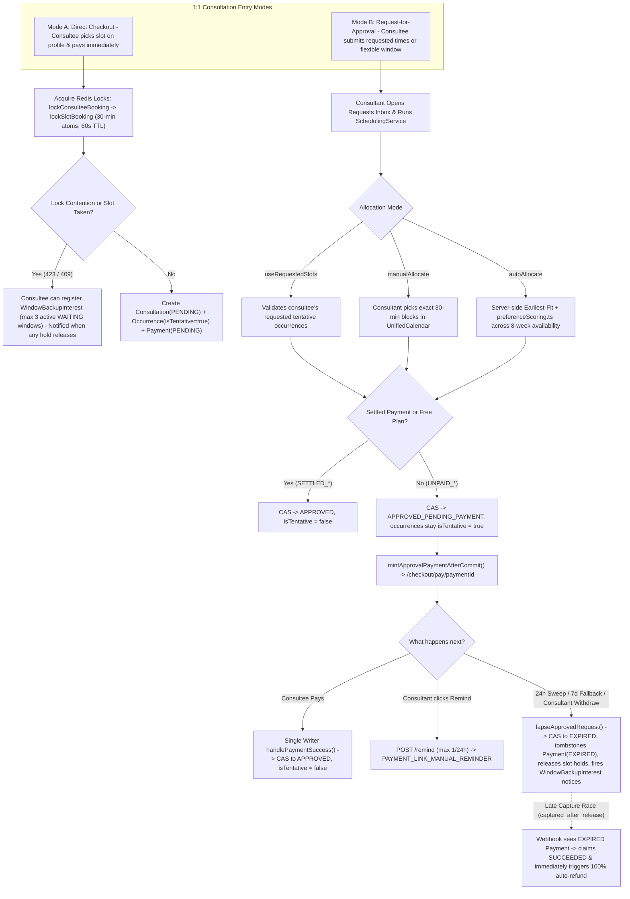
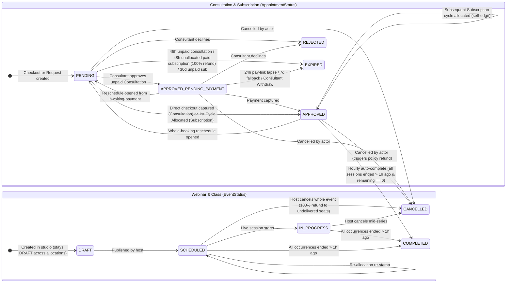
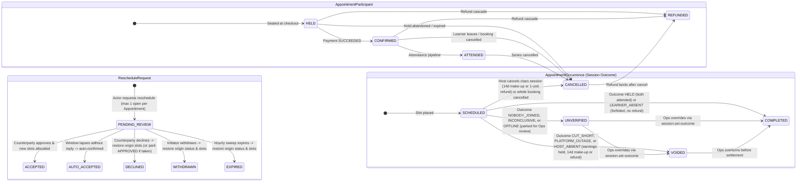
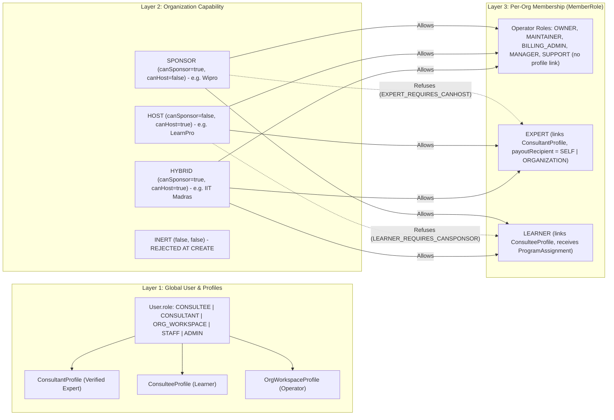
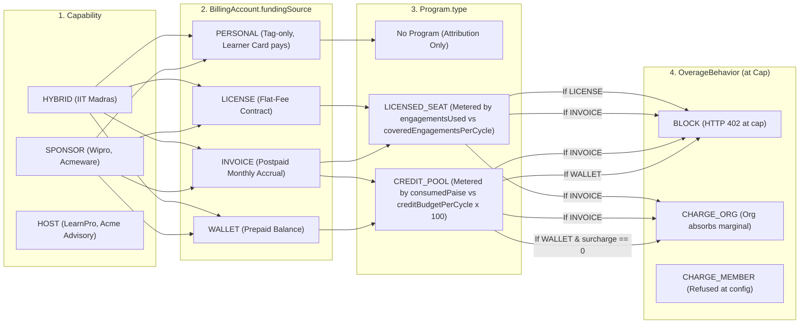
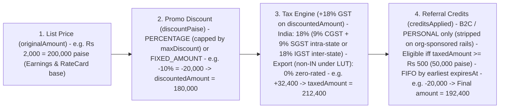
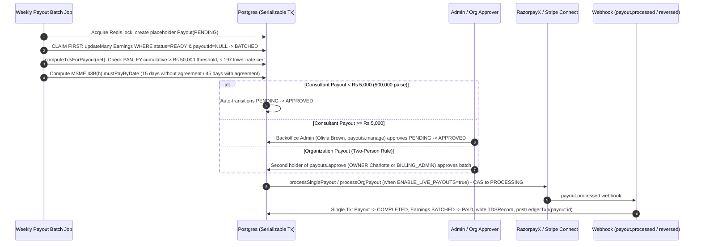

# The Booking & Money Machinery — Visual Guide, Organizational Scoping & Worked Permutations

> **The Core Architectural Spine in One Sentence**
> There is **one checkout pipeline** (`handleCheckout()` in `lib/payments/operations/checkout.ts`), **one payment confirmation writer** (`handlePaymentSuccess()` in `lib/payments/webhooks/handlers.ts`), and **one append-only double-entry journal** (`postLedgerTxn()` in `lib/payments/ledger/post.ts`); consumer (B2C) and enterprise (B2B) flows differ **only in which [`PaymentLeg`](../../payments/04-b2c-b2b-funding-seam.md) rows fund the `Payment`** and **whether an organization claims a host share via [`RateCard`](../10-money-and-ledger/05-booking-to-earnings.md)**.

---

## 1. Cast of Real Seeded People & Organizations

All examples below use the canonical seed cohort from `prisma/seedFiles/1a-create-users.ts`, `prisma/seedFiles/14a-create-organizations.ts`, and [`docs/team/mock-credentials.md`](../../team/mock-credentials.md) (universal dev password: `SeedPass123!`). All money in the database is stored as **integer paise** (`BigInt` in Postgres, converted to JS `number` via `lib/prisma.ts`, where `₹1 = 100 paise`), and all percentage splits are stored in **basis points** (`10,000 bps = 100%`).

### 1.1 Organizations Cohort

| Organization (`slug`)                                          | Capability Booleans                  | Derived Kind      | Sponsor Funding & Commercial Setup                                                                                                                                                                                                                                                                                                                        | Host Payout & RateCard Setup                                                                                                                                | Key Seeded People (`MemberRole` / `UserRole`)                                                                                                                                                                                                                                                                                    |
| :------------------------------------------------------------- | :----------------------------------- | :---------------- | :-------------------------------------------------------------------------------------------------------------------------------------------------------------------------------------------------------------------------------------------------------------------------------------------------------------------------------------------------------- | :---------------------------------------------------------------------------------------------------------------------------------------------------------- | :------------------------------------------------------------------------------------------------------------------------------------------------------------------------------------------------------------------------------------------------------------------------------------------------------------------------------- |
| **Wipro Limited** (`wipro`)                                    | `canSponsor=true` `canHost=false` | **`SPONSOR`**     | `FundingSource.INVOICE` (NET-60, GSTIN `29AABCW1234K1Z5`, KA). Credit limit: **₹1,00,00,000** (`1,000,000,000` paise). Backed by `PurchaseOrder` of **₹50,00,000**. `LICENSED_SEAT` program (_"Wipro Engineer Leadership Program"_): **200 seats** @ **₹25,000/seat/yr**, **12 engagements/cycle**, `priceCap = ₹10,000`, `overageBehavior = CHARGE_ORG`. | None (No `OrganizationPayoutAccount`; never earns).                                                                                                         | • **Samantha Anderson** (`samantha.anderson@yahoo.com`) — `OWNER` (`CONSULTEE`) • **Olivia Anderson** (`olivia.anderson@gmail.com`) — `LEARNER` • **Patrick Anderson** (`patrick.anderson@outlook.com`) — `LEARNER` • **Priya Anderson** (`priya.anderson@yahoo.com`) — `LEARNER`                                       |
| **LearnPro Academy** (`learnpro-academy`)                      | `canSponsor=false` `canHost=true` | **`HOST`**        | None (No `BillingAccount`; never sponsors learners).                                                                                                                                                                                                                                                                                                      | `OrganizationPayoutAccount` + default `RateCard` **10% Platform / 10% Org / 80% Expert** (`1000 / 1000 / 8000` bps).                                        | • **Daniel Anderson** (`daniel.anderson@outlook.com`) — `OWNER` (`CONSULTANT`) • **Aarav, Aditi, Alex, Amit, Ananya Anderson** — 5 `EXPERT`s (`payoutRecipient = SELF`)                                                                                                                                                       |
| **IIT Madras** (`iit-madras`)                                  | `canSponsor=true` `canHost=true`  | **`HYBRID`**      | `FundingSource.WALLET`. Seeded with **3 × ₹5,00,000** top-ups (**₹15,00,000**) minus **5 × ₹5,000** bookings = **₹14,75,000** (`147,500,000` paise) `walletBalance`. `CREDIT_POOL` program (_"IIT Student Coaching Pool"_): **10,000 credits/mo** (`₹10,000/mo`), `overageBehavior = BLOCK`.                                                              | `OrganizationPayoutAccount` + `RateCard` **10% / 10% / 80%** (`1000 / 1000 / 8000` bps). Hosts both salaried faculty and external experts.                  | • **Charlotte Anderson** (`charlotte.anderson@gmail.com`) — `OWNER` (`ORG_WORKSPACE`) • **Andrew & Angela Anderson** — `EXPERT`s (`payoutRecipient = ORGANIZATION`, salaried) • **Arjun, Benjamin, Catherine Anderson** — `EXPERT`s (`payoutRecipient = SELF`) • **Rachel, Raj, Rebecca, Robert Anderson** — `LEARNER`s |
| **Arjun Anderson's Coaching** (`arjun-anderson-coaching-vghi`) | `canSponsor=false` `canHost=true` | **`HOST` (Solo)** | None. Convenience single-member org for a solo freelancer.                                                                                                                                                                                                                                                                                                | `OrganizationPayoutAccount`, `10 / 10 / 80` default card (when booked via org) or **20% / 80%** marketplace split when booked directly without org context. | • **Arjun Anderson** (`arjun.anderson@yahoo.com`) — `OWNER` (`CONSULTANT`, `SELF`)                                                                                                                                                                                                                                               |
| **Acmeware** _(Architecture Reference Archetype)_              | `canSponsor=true` `canHost=false` | **`SPONSOR`**     | `FundingSource.INVOICE` + `CREDIT_POOL` (_"Acmeware IC Growth Pool"_): **50,000 credits/mo** (**₹50,000/mo**), `CHARGE_ORG`, `overageSurchargeBps = 1000` (10%), `maxOveragePerCyclePaise = ₹10,000`.                                                                                                                                                     | None.                                                                                                                                                       | • **Dev** — `LEARNER` (Product Engineer)                                                                                                                                                                                                                                                                                         |
| **Acme Advisory** _(Architecture Reference Archetype)_         | `canSponsor=false` `canHost=true` | **`HOST` (Firm)** | None.                                                                                                                                                                                                                                                                                                                                                     | Custom `RateCard` **15% Platform / 10% Org / 75% Consultant** (`1500 / 1000 / 7500` bps), all experts `payoutRecipient = ORGANIZATION` (85% paid to firm).  | • Salaried Senior Advisors (`EXPERT`, `ORGANIZATION`)                                                                                                                                                                                                                                                                            |

### 1.2 Independent Marketplace & Platform Operator Cast

| Persona Category                        | Real Seeded People                                                                                                                                         | Role & Mechanics                                                                                                                                                                                                                               |
| :-------------------------------------- | :--------------------------------------------------------------------------------------------------------------------------------------------------------- | :--------------------------------------------------------------------------------------------------------------------------------------------------------------------------------------------------------------------------------------------- |
| **Independent Marketplace Consultants** | **Grace Anderson** (`grace.anderson@outlook.com`), **Hannah Anderson** (`hannah.anderson@yahoo.com`), **James Anderson** (`james.anderson@protonmail.com`) | `UserRole.CONSULTANT`, `isIndependent = true` (zero `ACTIVE` `EXPERT` memberships at `canHost` orgs). Settled on the **20% Platform / 80% Consultant** marketplace split (`PLATFORM_FEE_PERCENTAGE = 20`).                                     |
| **Independent Marketplace Consultees**  | **Charlotte Brown** (`charlotte.brown@protonmail.com`), **Daniel Brown** (`daniel.brown@gmail.com`), **David Brown** (`david.brown@outlook.com`)           | `UserRole.CONSULTEE`, no org membership. Pay via `CARD` (Razorpay/Stripe), can apply promo `DiscountCode`s and personal `ReferralCredit`s.                                                                                                     |
| **Platform Backoffice Admins**          | **Olivia Brown** (`olivia.brown@protonmail.com`), **Patrick Brown** (`patrick.brown@gmail.com`), **Priya Brown** (`priya.brown@outlook.com`)               | `UserRole.ADMIN`. Full access to `/dashboard/admin/money/*`. Can execute refunds, payouts, earnings holds/releases, ledger reconcilers, and pass any org gate via synthetic `__admin_stub_<userId>` `OWNER` membership.                        |
| **Platform Backoffice Staff**           | **Maria Brown** (`maria.brown@gmail.com`), **Michael Brown** (`michael.brown@outlook.com`), **Natalie Brown** (`natalie.brown@yahoo.com`)                  | `UserRole.STAFF`. Own support tickets, user verification, moderation, and non-money class doors (`classSeries.support`); hold **read-only** visibility into all money tabs (`payments.read`, `refunds.read`, `payouts.read`, `disputes.read`). |

---

## 2. Master End-to-End Architecture Diagram

The diagram below traces how every booking and rupee flows through the single spine from checkout to ledger reconciliation.

```mermaid
flowchart TB
  subgraph Actors["1. Buyer & Context Selection"]
    B2C_BUYER["Marketplace Consultee (e.g. Charlotte Brown) - organizationId = null"]
    B2B_BUYER["Org Learner (e.g. Olivia Anderson @ Wipro or Rachel Anderson @ IIT Madras) - passes organizationId"]
  end

  subgraph Checkout["2. Unified Checkout Pipeline - POST /api/checkout - handleCheckout()"]
    direction TB
    ORG_GATES["Org Resolution Chain (9 Fail-Closed Gates if organizationId present) - Org ACTIVE/PENDING, canSponsor, Dunning check, ACTIVE Membership, DPDP SESSION_BOOKING consent, Domain/CreditLimit, ACTIVE ProgramAssignment"]
    STEP1["Step 1: Pure Price Derivation - deriveCheckoutAmount() - Base Price -> DiscountCode -> +18% GST -> -ReferralCredit (B2C only, min Rs 500)"]
    STEP2["Step 2: Distributed Redis Locks - lockConsulteeBooking(userId) -> lockSlotBooking(consultantId, 30m atoms)"]
    STEP3["Step 3: In-Lock Revalidation - revalidateInsideLock() - Slot conflict check, self-booking guard, ADR-18 allowlist & exclusiveEngagement"]
    STEP4["Step 4: Serializable DB Transaction - withSerializableRetry() - Appointment + AppointmentOccurrence + AppointmentParticipant + Payment + PaymentLeg[]"]
    TRIG1["DB Constraint Trigger at COMMIT: payment_legs_sum_to_amount & occurrence_no_confirmed_overlap (GiST)"]

    ORG_GATES --> STEP1 --> STEP2 --> STEP3 --> STEP4 --> TRIG1
  end

  B2C_BUYER --> STEP1
  B2B_BUYER --> ORG_GATES

  TRIG1 --> RAIL_FORK{"Funding Rail?"}

  subgraph Rail_Gateway["3A. Gateway Rail (B2C / PERSONAL Org Tag / Member Overage)"]
    GW_PEND["Payment status = PENDING (expiresAt = +30m) - Occurrence isTentative = true - Participant status = HELD - Razorpay Order minted"]
    GW_DOORS["4 Confirmation Doors: 1. Webhook payment.captured  2. /checkout/verify-signature  3. /checkout/verify?sync=true  4. Cron reconcile-payment-status"]
    SINGLE_WRITER["Single Writer: handlePaymentSuccess() - Phase 1 (Serializable Tx): Amount parity check -> CAS PENDING to SUCCEEDED -> isTentative = false -> Participant HELD to CONFIRMED -> Request APPROVED"]
    GW_PEND --> GW_DOORS --> SINGLE_WRITER
  end

  subgraph Rail_Skip["3B. Instant-Confirm Rail (skipPayment = true: WALLET / INVOICE / LICENSE / 100% Free Credit)"]
    SKIP_TX["Inside Step 4 Transaction: Payment created SUCCEEDED immediately - Synthetic intent (org_wallet_*, org_invoice_*, org_license_*, free_*) - walletDebit() CAS or recordBookingUtilization() + recordOverageAtCheckout()"]
  end

  RAIL_FORK -->|"CARD (amount > 0)"| GW_PEND
  RAIL_FORK -->|"WALLET / INVOICE / LICENSE / Rs 0"| SKIP_TX

  SINGLE_WRITER --> SETTLE
  SKIP_TX --> SETTLE

  subgraph Downstream["4. Shared Settlement, Ledger, Payout & Reversal Spine"]
    direction TB
    SETTLE["Phase 2 Settlement: createEarningsFromPayment() - Resolves RateCard (10/10/80) or Marketplace (20/80) + Collaborator bps - Writes ConsultantEarnings + OrganizationEarnings - Calls postLedgerTxn(booking:paymentId)"]
    TRIG2["DB Constraint Trigger at COMMIT: ledger_txn_balanced (Sum DEBIT == Sum CREDIT)"]
    HOLD["Earnings Hold Window - 24h Consultation / 48h Webinar / 168h Subscription & Class - PENDING (or PENDING_TRUST) -> READY"]
    PAYOUTS["Payout Pipeline (Weekly Batch) - ConsultantPayout (<Rs 5k auto-approve) & OrganizationPayout (2-person approval) - Computes TDS 194-O (0.1% or 5% no-PAN) -> RazorpayX / Stripe Connect -> postLedgerTxn(payout:id)"]
    INVOICES["B2B Monthly Rollup (settle-invoice-accruals) - Sums INVOICE_ACCRUAL legs -> OrganizationInvoice (ISSUED, NET-60) - Dunning cron (3x 7d reminders -> suspend) -> Paid: postLedgerTxn(invoicepaid:id)"]
    REFUNDS["Refunds, Voids & Disputes - quoteBookingRefund() -> Two-Phase Gateway Refund -> applyRefundCascade() - Reverses PaymentLegs, Utilization, Earnings, Overage, issues CreditNote, posts refund:id"]
    RECON["Nightly Control Loop (reconcile-ledgers) - Re-derives all 26 invariants from LedgerEntry journal - Auto-freezes drifted org wallets (freezeWalletSpend)"]

    SETTLE --> TRIG2 --> HOLD --> PAYOUTS
    TRIG2 --> INVOICES
    TRIG2 --> REFUNDS
    PAYOUTS --> RECON
    INVOICES --> RECON
    REFUNDS --> RECON
  end
```

---

## 3. Complete Entity-Relationship Model (Booking + Orgs + Money + Ledger)

```mermaid
erDiagram
  User ||--o| ConsulteeProfile : "consumer facet"
  User ||--o| ConsultantProfile : "expert facet"
  User ||--o| OrgWorkspaceProfile : "org operator facet"
  User ||--o{ Membership : "1 role per (user, org)"

  Organization ||--o{ Membership : "OWNER/MAINTAINER/BILLING_ADMIN/MANAGER/SUPPORT/EXPERT/LEARNER"
  Organization ||--o| BillingAccount : "if canSponsor=true"
  Organization ||--o| OrganizationPayoutAccount : "if canHost=true"
  Organization ||--o{ RateCard : "platformBps + orgBps + consultantBps = 10000"
  Organization ||--o{ Contract : "DRAFT -> ACTIVE -> EXPIRED/TERMINATED"

  Contract ||--o{ Program : "LICENSED_SEAT or CREDIT_POOL"
  Program ||--o| LicensedSeatConfig : "ratePerSeat, coveredEngagementsPerCycle, overageBehavior"
  Program ||--o| CreditPoolConfig : "creditBudgetPerCycle, overageBehavior"
  Program ||--o{ ProgramAssignment : "per member per cycle (engagementsUsed, consumedPaise)"

  BillingAccount ||--o{ WalletTopUp : "Dr CASH / Cr WALLET(org)"
  BillingAccount ||--o{ OrganizationInvoice : "monthly accrual rollup"
  BillingAccount ||--o{ PurchaseOrder : "3-way match drawdown"

  ConsultationPlan ||--o{ Consultation : "1:1 single call"
  SubscriptionPlan ||--o{ Subscription : "1:1 multi-call cycles"
  SubscriptionPlan ||--o{ Trial : "1 per (consultee, consultant)"
  WebinarPlan ||--o{ Webinar : "1:many single call"
  ClassPlan ||--o{ ClassEvent : "1:many multi-call series"

  Consultation ||--o| Appointment : "1 wrapper"
  Subscription ||--o| Appointment : "1 wrapper"
  Webinar ||--o| Appointment : "1 shared wrapper"
  ClassEvent ||--o| Appointment : "1 shared wrapper"
  Trial ||--o| Appointment : "1 wrapper"

  Appointment ||--o{ AppointmentOccurrence : "1 row per held call (startsAt, endsAt, isTentative, completionStatus)"
  Appointment ||--o{ AppointmentParticipant : "sole roster (HELD -> CONFIRMED -> ATTENDED / CANCELLED / REFUNDED)"
  Appointment }o--o| CancellationPolicy : "snapshotted policy version"

  Appointment ||--o{ Payment : "unique per (userId, appointmentId)"
  Payment ||--o{ PaymentLeg : "CARD, WALLET, INVOICE_ACCRUAL, OVERAGE_INVOICE_ACCRUAL, LICENSE, REFERRAL_CREDIT"
  Payment ||--o| BookingUtilization : "links to ProgramAssignment"
  BookingUtilization ||--o| OverageEvent : "basePaise + surchargePaise = marginalPaise"
  Payment ||--o{ ConsultantEarnings : "1 row per owner/collaborator"
  Payment ||--o{ OrganizationEarnings : "1 row per (payment, hostOrg)"
  Payment ||--o{ Refund : "PENDING -> SUCCEEDED"
  Payment ||--o{ Dispute : "chargebacks"
  Payment ||--o| ConsumerInvoice : "FAM-FY-SEQ5"

  ConsultantEarnings }o--o| ConsultantPayout : "batched weekly"
  OrganizationEarnings }o--o| OrganizationPayout : "batched weekly"
  ConsultantPayout ||--o| TDSRecord : "194-O withholding"
  OrganizationPayout ||--o| TDSRecord : "194-O withholding"

  LedgerTransaction ||--|{ LedgerEntry : "2+ entries (Sum DEBIT == Sum CREDIT)"
  LedgerEntry }o--|| LedgerAccount : "deterministic ID: kind|orgId|consultantId|INR"
```

---

## 4. The Complete Booking Machinery

### 4.1 All 6 Deliverable Offerings & Their Mechanics

| Offering Type           | Cardinality                                                               | Wrapper & Occurrence Structure                                                                                                                                                                                | How & When Slots Are Allocated                                                                                                                                                                                                                                                                                             | How & When Paid                                                                                                                                                                                                                                                                                  | Org Program Cap Metering (`BookingUtilization`)                                                                                                |
| :---------------------- | :------------------------------------------------------------------------ | :------------------------------------------------------------------------------------------------------------------------------------------------------------------------------------------------------------ | :------------------------------------------------------------------------------------------------------------------------------------------------------------------------------------------------------------------------------------------------------------------------------------------------------------------------- | :----------------------------------------------------------------------------------------------------------------------------------------------------------------------------------------------------------------------------------------------------------------------------------------------- | :--------------------------------------------------------------------------------------------------------------------------------------------- |
| **1. Consultation**     | 1:1, single call (`0.5h–4h`)                                              | `1 Consultation` → `1 Appointment` → `1 AppointmentOccurrence` + `2 AppointmentParticipant`s (Consultant + Consultee)                                                                                         | **Direct Checkout**: Consultee picks consecutive 30-min blocks at checkout (`isTentative=true` until capture). **Request Mode**: Consultee requests slots (or window); Consultant approves via `SchedulingService` (`useRequestedSlots`, `manualAllocate`, or `autoAllocate`).                                          | **Direct**: At checkout. **Request**: After approval via `/checkout/pay/[paymentId]` within **24h** (or **7d** fallback) before `lapseApprovedRequest` expires it.                                                                                                                            | Consumes **1 engagement** (or full price in paise for `CREDIT_POOL`) at checkout.                                                              |
| **2. Subscription**     | 1:1, recurring (`M` calls across fill-order cycles)                       | `1 Subscription` → `1 Appointment` wrapper → initially **0 occurrences** (placeholder at checkout); `SchedulingService` adds `1 AppointmentOccurrence` per call as cycles are scheduled.                      | **Always allocated after payment** by the consultant in **fill-order tranches** (`capacity = sessionsPerWeek`, `nextBatch = min(capacity - filledInCycle, remaining)` in `lib/booking/entitlement.ts`). First cycle **must be allocated within 48h of capture** or `expireUnallocatedPaidSubscriptions` auto-refunds 100%. | **Always paid upfront at purchase**. Request-then-pay is forbidden (`409 SUBSCRIPTION_UNPAID`).                                                                                                                                                                                                  | **0 at checkout** (`engagementsForCap = null`). Debited **lazily** in `SchedulingService.createAppointments` as each cycle batch is allocated. |
| **3. Webinar**          | 1:many, single call                                                       | `1 Webinar` → `1 shared Appointment` → `1 master AppointmentOccurrence`. Each enrollee adds `1 AppointmentParticipant` row (`status = HELD -> CONFIRMED`).                                                    | Pre-scheduled by the consultant before publishing (`DRAFT -> SCHEDULED`). Enrollees never create occurrences; they only claim a seat on the roster up to `maxParticipants`.                                                                                                                                                | Paid at enrollment (`1 Payment` per `(userId, appointmentId)`). Host sees aggregated seat summary; each attendee sees only their own `Payment` ([ADR 2026-09-13](../../decisions/2026-09-13-appointment-money-is-per-seat.md)).                                                                  | Consumes **1 engagement** at checkout.                                                                                                         |
| **4. Class**            | 1:many, recurring series (`M` calls)                                      | `1 Class` → `1 shared Appointment` wrapper → `M AppointmentOccurrence` rows (one per session ordinal `1..M`). Each enrollee gets **1 `AppointmentParticipant` row** on the wrapper covering all `M` sessions. | Pre-scheduled by the consultant (`M` occurrences). Enrolment is open while `remaining > 0` and next session ordinal $\le$ `lateJoinUntilSession` (default `1`). Late joiners pay **pro-rata** for `sessionsPurchased` remaining sessions.                                                                                  | Paid upfront in full (or via Razorpay card EMI when $\ge$ ₹3,000 and `ENABLE_CHECKOUT_EMI` is on).                                                                                                                                                                                               | Consumes **`N` engagements** at checkout (`classResult.engagementsConsumed`).                                                                  |
| **5. Trial**            | 1:1, single call (default `30m`), max **1 per `(consultee, consultant)`** | `1 Trial` → `1 Appointment` (`TRIAL`) → `1 AppointmentOccurrence`. Linked to a `SubscriptionPlan` with `trialEnabled = true`.                                                                                 | Consultee requests trial (`POST /api/trials`). Consultant accepts & picks slot (`PATCH /api/trials/[id]` with `status: SCHEDULED`), taking `lockConsulteeBooking` + `lockSlotBooking`.                                                                                                                                     | **Free (`trialPriceInPaise = 0`)**: No payment. **Priced (`> 0`)**: Paid at request on `/checkout/plans/trial/[trialId]` while `Trial.status = PENDING`. Consultant cannot accept until paid (`409 TRIAL_UNPAID`). Unanswered after **48h** → auto-cancelled & refunded (`TRIAL_UNANSWERED`). | Not org-sponsored. Purchasing a `Subscription` after a `COMPLETED` trial flips `Trial.status` to `CONVERTED`.                                  |
| **6. Recording Replay** | Standalone digital purchase                                               | `1 Recording` (`status=AVAILABLE`, `storageType=SUPABASE`, `listingStatus=PUBLISHED`) → `1 RecordingPurchase` per buyer.                                                                                      | No calendar slot. Webinar/Class recordings only (1:1 recordings are private and never sellable).                                                                                                                                                                                                                           | `POST /api/recordings/[id]/purchase` → Razorpay order (`notes.type = recording_purchase`) → webhook flips `RecordingPurchase` `PENDING -> SUCCEEDED`.                                                                                                                                            | Outside `Payment` / `Appointment` table invariants; grants 1h signed Supabase playback URLs.                                                   |

---

### 4.2 Booking Modes, Allocation Engine & Contention Flow

---

### 4.3 Booking, Participant, Reschedule & Session Outcome State Machines

#### A. Request Status (`Consultation` & `Subscription`) and Group Event Status (`Webinar` & `Class`)

#### B. Participant Seat Status, Reschedule Lifecycle & Post-Session Outcomes

### 4.4 Session Outcome Classification & Class Series Protection Rules

One hour after any `SCHEDULED` occurrence's `endsAt`, the hourly `auto-complete-appointments` sweep runs `classifySessionOutcome()` (`lib/booking/session-outcome.ts`) over device-level `MeetingPresence` intervals, Stream call reports, and maintenance windows ([ADR 2026-09-25](../../decisions/2026-09-25-session-outcomes.md)):

| Verdict (`SessionOutcome`)                       | Occurrence Status                    | Who Was Present & Rule                                                                                                                                                                                                   | Financial & Booking Effect                                                                                                                                                                                                                                                                                                                                      |
| :----------------------------------------------- | :----------------------------------- | :----------------------------------------------------------------------------------------------------------------------------------------------------------------------------------------------------------------------- | :-------------------------------------------------------------------------------------------------------------------------------------------------------------------------------------------------------------------------------------------------------------------------------------------------------------------------------------------------------------- |
| **`HELD`**                                       | `COMPLETED`                          | Both host side (consultant or accepted collaborator) and learner joined; host-side absence loss $< \min(15\text{ min}, \text{duration}/2)$ (crediting reconnects $<2\text{m}$ and up to $30\text{m}$ overtime together). | Normal completion. Earnings release after `holdUntil`.                                                                                                                                                                                                                                                                                                          |
| **`LEARNER_ABSENT`**                             | `COMPLETED`                          | Host was present; zero learners joined.                                                                                                                                                                                  | **Session is forfeited by the learner.** Counts as delivered; consultant is paid in full; no refund.                                                                                                                                                                                                                                                            |
| **`HOST_ABSENT`**                                | `VOIDED` (or Consultation cancelled) | Learner waited; no host-side person ever joined.                                                                                                                                                                         | • **Consultation**: Claimed by `detect-consultant-no-shows` → booking `CANCELLED` + **100% auto-refund**. • **Class / Webinar**: `VOIDED` → host has **14 days** to schedule a make-up or `settle-cancelled-sessions` refunds 1 unit. • **Subscription**: Returns 1 session to plan allowance (if unused at period end, refunded at `amount / sessions`). |
| **`CUT_SHORT`**                                  | `VOIDED`                             | Host dropped while learners stayed for $\ge \min(15\text{ min}, \text{duration}/2)$.                                                                                                                                     | Counts as a **host-attributed miss** (raises `class-reliability` flag at $\ge 3$ misses or $\ge 25\%$ of series). Same 14-day make-up or refund remedy.                                                                                                                                                                                                         |
| **`PLATFORM_OUTAGE`**                            | `VOIDED`                             | All participants dropped within 2 minutes of each other, or call overlapped a `DEGRADED`/`OFFLINE` maintenance window.                                                                                                   | Counts toward **learner's class exit right** ($\ge 3$ misses or $\ge 25\%$ of series allows 100% refund of all undelivered sessions), but **never** penalizes the host's reliability flag.                                                                                                                                                                      |
| **`NOBODY_JOINED` / `INCONCLUSIVE` / `OFFLINE`** | `UNVERIFIED`                         | Nobody joined, open presence interval, Stream participant count mismatch, or no room created.                                                                                                                            | **Doubtful verdict never moves money automatically.** Holds earnings and surfaces in Backoffice Ops Queue for `session.set-outcome`.                                                                                                                                                                                                                            |

---

## 5. Organizational Scoping: All Permutations & Combinations

### 5.1 Axis 1 × Axis 2 × Axis 3: Platform `UserRole` × Org Capability × `MemberRole`

Every user has one global `User.role` (`UserRole`), independent global profile links (`consultantProfileId`, `consulteeProfileId`, `orgWorkspaceProfileId`), and one `Membership` (`MemberRole`) per organization ([`docs/onboarding/02-identity-and-org-permutations.md`](../../onboarding/02-identity-and-org-permutations.md)).

#### Exhaustive Permutation Table (`UserRole × Org Capability × MemberRole`)

| Global `User.role`    | Org Capability (`SPONSOR` / `HOST` / `HYBRID`) | Target `MemberRole`                                              | Status & Exact System Behavior                                                                                                                                                                                                                        | Real Seeded / Concrete Example                                                                                                                                 |
| :-------------------- | :--------------------------------------------- | :--------------------------------------------------------------- | :---------------------------------------------------------------------------------------------------------------------------------------------------------------------------------------------------------------------------------------------------- | :------------------------------------------------------------------------------------------------------------------------------------------------------------- |
| **`ORG_WORKSPACE`**   | `SPONSOR` / `HOST` / `HYBRID`                  | `OWNER` / `MAINTAINER` / `BILLING_ADMIN` / `MANAGER` / `SUPPORT` | **Allowed** (Canonical operator setup). Only `ORG_WORKSPACE` and `ADMIN` can call `POST /api/organizations` to create an org. Profile links on `Membership` are cleared.                                                                              | **Charlotte Anderson** (`charlotte.anderson@gmail.com`) is `ORG_WORKSPACE` + `OWNER` of **IIT Madras** (`HYBRID`).                                             |
| **`ORG_WORKSPACE`**   | `HOST` / `HYBRID`                              | `EXPERT`                                                         | **Refused (`400 NOT_A_CONSULTANT`)** unless the user first completes the onboarding wizard's Add-Consultant mode (`/form/onboarding?add=CONSULTANT`), which creates a `ConsultantProfile` while keeping `User.role = ORG_WORKSPACE`.                  | Operator adding a consulting practice to their account.                                                                                                        |
| **`ORG_WORKSPACE`**   | `SPONSOR` / `HYBRID`                           | `LEARNER`                                                        | **Allowed** via invitation accept; lazily creates `ConsulteeProfile` (`ensureConsulteeProfile`).                                                                                                                                                      | Operator learning through a sponsor org.                                                                                                                       |
| **`CONSULTANT`**      | `HOST` / `HYBRID`                              | `OWNER` / `MAINTAINER` / `BILLING_ADMIN` / `MANAGER` / `SUPPORT` | **Allowed by invitation** (or seeded). Cannot create a new org via `POST /api/organizations` unless role is `ORG_WORKSPACE`/`ADMIN`.                                                                                                                  | **Daniel Anderson** (`daniel.anderson@outlook.com`) is `CONSULTANT` + `OWNER` of **LearnPro Academy** (`HOST`); **Arjun Anderson** is `OWNER` of his solo org. |
| **`CONSULTANT`**      | `HOST` / `HYBRID`                              | `EXPERT` (`payoutRecipient = SELF`)                              | **Allowed**. Links `ConsultantProfile`; flips `ConsultantProfile.isIndependent = false`. Expert receives their `consultantBps` share into `ConsultantEarnings`.                                                                                       | **Aarav, Aditi, Alex, Amit, Ananya Anderson** at **LearnPro Academy**; **Arjun, Benjamin, Catherine Anderson** at **IIT Madras**.                              |
| **`CONSULTANT`**      | `HOST` / `HYBRID`                              | `EXPERT` (`payoutRecipient = ORGANIZATION`)                      | **Allowed** (Salaried / Internal Faculty). Expert's `consultantBps` share is routed directly into `OrganizationEarnings` (`CONSULTANT_PAYABLE = 0`).                                                                                                  | **Andrew Anderson** & **Angela Anderson** at **IIT Madras** (`HYBRID`).                                                                                        |
| **`CONSULTANT`**      | `SPONSOR`                                      | `EXPERT`                                                         | **Refused (`400 EXPERT_REQUIRES_CANHOST`)**. A pure `SPONSOR` org cannot host experts.                                                                                                                                                                | Attempting to invite **Aarav Anderson** as `EXPERT` to **Wipro** is rejected.                                                                                  |
| **`CONSULTANT`**      | `SPONSOR` / `HYBRID`                           | `LEARNER`                                                        | **Allowed**! Lazily creates `ConsulteeProfile` (`ensureConsulteeProfile`). A consultant in Org A can be a sponsored `LEARNER` in Org B. **Self-Deal Guard**: `revalidateInsideLock` blocks them from booking their _own_ `ConsultantProfile`'s plans! | A consultant who is also an enrolled learner at **Wipro**.                                                                                                     |
| **`CONSULTEE`**       | `SPONSOR` / `HYBRID`                           | `LEARNER`                                                        | **Allowed** (Canonical B2B learner). Links `ConsulteeProfile`. Lands on `/dashboard/organization/[orgId]/my-program`.                                                                                                                                 | **Olivia, Patrick, Priya Anderson** at **Wipro** (`SPONSOR`); **Rachel, Raj, Rebecca, Robert Anderson** at **IIT Madras** (`HYBRID`).                          |
| **`CONSULTEE`**       | `HOST`                                         | `LEARNER`                                                        | **Refused (`400 LEARNER_REQUIRES_CANSPONSOR`)**. A pure `HOST` org cannot sponsor learners.                                                                                                                                                           | Attempting to invite **Olivia Anderson** as `LEARNER` to **LearnPro Academy** is rejected.                                                                     |
| **`CONSULTEE`**       | `HOST` / `HYBRID`                              | `EXPERT`                                                         | **Refused (`400 NOT_A_CONSULTANT`)** until the user completes `/form/onboarding?add=CONSULTANT`, which creates `ConsultantProfile` and promotes `User.role` from `CONSULTEE` → `CONSULTANT`.                                                          | Learner upgrading to become an expert.                                                                                                                         |
| **`CONSULTEE`**       | `SPONSOR` / `HOST` / `HYBRID`                  | `OWNER` / `MAINTAINER` / `BILLING_ADMIN` / `MANAGER` / `SUPPORT` | **Allowed by invitation** (or seed).                                                                                                                                                                                                                  | **Samantha Anderson** (`samantha.anderson@yahoo.com`) is `CONSULTEE` + `OWNER` of **Wipro Limited**.                                                           |
| **Any User**          | Same Org                                       | `LEARNER` $\leftrightarrow$ `EXPERT`                             | **Refused (`409 ROLE_TRANSITION_BLOCKED`)** & `@@unique([userId, organizationId])` prevents holding both roles in the same org. Must remove (`REMOVE_AND_REINVITE` if obligations cleared) and re-invite.                                             | Prevents `ProgramAssignment` attribution ambiguity and in-org self-dealing.                                                                                    |
| **`ADMIN` / `STAFF`** | Any Org                                        | Synthetic `OWNER` Stub                                           | **Bypasses `requireOrgAccess`** (`__admin_stub_<userId>`) so platform operators can inspect/assist while keeping `OrgAuditLog.actorMembershipId` valid.                                                                                               | **Olivia Brown** (`ADMIN`) or **Maria Brown** (`STAFF`).                                                                                                       |

---

### 5.2 Complete Organization Role Permission Matrix (`lib/auth/org-permissions.ts`)

Authorization inside an organization is governed by a **46-key permission matrix** across **7 `MemberRole`s** ([`04-roles-and-permissions.md`](../00-foundations/04-roles-and-permissions.md)), not a linear rank ladder, because finance (`BILLING_ADMIN`) and operations (`MANAGER`, `SUPPORT`) are orthogonal tracks:

| Surface / Domain    | Permission Key                                                                | `OWNER` | `MAINTAINER` | `BILLING_ADMIN` | `MANAGER` | `SUPPORT` | `EXPERT` | `LEARNER` | What It Controls                                                                                                                      |
| :------------------ | :---------------------------------------------------------------------------- | :-----: | :----------: | :-------------: | :-------: | :-------: | :------: | :-------: | :------------------------------------------------------------------------------------------------------------------------------------ |
| **Activity**        | `activity.read`                                                               |    ✓    |      ✓       |        —        |     ✓     |     —     |    —     |     —     | Org activity feed                                                                                                                     |
| **Appointments**    | `appointments.actForOrg.cancel`                                               |    ✓    |      ✓       |        —        |     —     |     —     |    —     |     —     | Cancel org-funded 1:1/subscription booking (triggers refund)                                                                          |
|                     | `appointments.actForOrg.reschedule`                                           |    ✓    |      ✓       |        —        |     ✓     |     —     |    —     |     —     | Request reschedule on org-funded 1:1/subscription booking                                                                             |
|                     | `appointments.allocate.calendarRead`                                          |    ✓    |      ✓       |        —        |     —     |     —     |    —     |     —     | Read calendar availability for allocation                                                                                             |
|                     | `appointments.unscheduled.read`                                               |    ✓    |      ✓       |        —        |     ✓     |     —     |    —     |     —     | View unscheduled bookings queue                                                                                                       |
| **Audit**           | `audit.read`                                                                  |    ✓    |      ✓       |        ✓        |     ✓     |     ✓     |    —     |     —     | Access audit log surface                                                                                                              |
|                     | `audit.read.money`                                                            |    ✓    |      ✓       |        ✓        |     —     |     —     |    —     |     —     | View financial audit events (`WALLET`, `INVOICE`, `PAYOUT`)                                                                           |
|                     | `audit.read.ops`                                                              |    ✓    |      ✓       |        —        |     ✓     |     ✓     |    —     |     —     | View operational audit events (`MEMBER`, `PROGRAM`, `CATALOG`)                                                                        |
| **Billing**         | `billing.fundingSource.switch`                                                |    ✓    |      —       |        ✓        |     —     |     —     |    —     |     —     | Switch `PERSONAL`/`WALLET`/`INVOICE`/`LICENSE` (requires drained wallet if disabling sponsor)                                         |
|                     | `billing.manage`                                                              |    ✓    |      —       |        ✓        |     —     |     —     |    —     |     —     | Top up wallet, pay invoices, edit `billingEmail` & `paymentTermsDays`                                                                 |
|                     | `billing.read`                                                                |    ✓    |      ✓       |        ✓        |     ✓     |     —     |    —     |     —     | View billing account, invoices, wallet balance                                                                                        |
| **Catalog**         | `catalog.manage`                                                              |    ✓    |      ✓       |        —        |     ✓     |     —     |    —     |     —     | Create/edit org-owned offerings & rate cards                                                                                          |
| **Consent (DPDP)**  | `consent.read` / `consent.requestWithdrawal`                                  |    ✓    |      ✓       |        —        |     ✓     |     —     |    —     |     —     | View member DPDP consent status / trigger withdrawal                                                                                  |
| **Contracts**       | `contracts.manage`                                                            |    ✓    |      —       |        —        |     —     |     —     |    —     |     —     | Create/supersede (`AMENDMENT` / `RENEWAL`) commercial contracts                                                                       |
|                     | `contracts.read`                                                              |    ✓    |      ✓       |        ✓        |     —     |     —     |    —     |     —     | Read commercial contracts                                                                                                             |
| **Data Exports**    | `dataExports.finance`                                                         |    ✓    |      —       |        ✓        |     —     |     —     |    —     |     —     | Export invoices, ledger, payouts, reimbursements CSVs                                                                                 |
|                     | `dataExports.people`                                                          |    ✓    |      ✓       |        —        |     —     |     —     |    —     |     —     | Export members, utilization, activity CSVs                                                                                            |
| **Disputes**        | `disputes.read`                                                               |    ✓    |      ✓       |        ✓        |     ✓     |     —     |    —     |     —     | View payment chargebacks                                                                                                              |
| **Identity (SSO)**  | `identity.manage`                                                             |    ✓    |      —       |        —        |     —     |     —     |    —     |     —     | Configure SAML/OIDC SSO, SCIM tokens, domain verification                                                                             |
|                     | `identity.read`                                                               |    ✓    |      ✓       |        —        |     —     |     —     |    —     |     —     | View SSO & domain settings                                                                                                            |
| **Integrations**    | `integrations.manage`                                                         |    ✓    |      —       |        ✓        |     —     |     —     |    —     |     —     | Manage outbound webhooks (non-member events) & HRIS                                                                                   |
| **Invitations**     | `invitations.manage`                                                          |    ✓    |      ✓       |        —        |     —     |     —     |    —     |     —     | Send/revoke member invitations                                                                                                        |
| **Materials**       | `materials.manage.orgPlan`                                                    |    ✓    |      ✓       |        —        |     ✓     |     —     |    —     |     —     | Add/replace/remove materials on org-owned plans (audited)                                                                             |
| **Member Content**  | `memberContent.delete`                                                        |    —    |      —       |        —        |     —     |     —     |    —     |     —     | **Nobody in org** (ADR 20: private session chats/uploads/recordings are metadata-only to orgs; only platform backoffice can moderate) |
| **Members**         | `members.directory`                                                           |    ✓    |      ✓       |        ✓        |     ✓     |     ✓     |    ✓     |     ✓     | View basic member directory                                                                                                           |
|                     | `members.read`                                                                |    ✓    |      ✓       |        —        |     ✓     |     ✓     |    —     |     —     | View detailed member roster & obligations                                                                                             |
|                     | `members.manage` / `members.role.grant.operational`                           |    ✓    |      ✓       |        —        |     —     |     —     |    —     |     —     | Grant/change/remove `MANAGER`, `SUPPORT`, `EXPERT`, `LEARNER`                                                                         |
|                     | `members.role.grant.governance`                                               |    ✓    |      —       |        —        |     —     |     —     |    —     |     —     | Grant/change/remove `OWNER`, `MAINTAINER`, `BILLING_ADMIN`                                                                            |
|                     | `members.remove.force`                                                        |    ✓    |      —       |        —        |     —     |     —     |    —     |     —     | Force-remove member with active obligations (`?force=true`)                                                                           |
|                     | `members.payoutRecipient.change`                                              |    ✓    |      —       |        ✓        |     —     |     —     |    —     |     —     | Flip `EXPERT` between `SELF` and `ORGANIZATION`                                                                                       |
| **Messaging**       | `messaging.read`                                                              |    ✓    |      ✓       |        —        |     ✓     |     —     |    —     |     —     | Read org-level channel metadata                                                                                                       |
| **Member Views**    | `myArrangement.read`                                                          |    —    |      —       |        —        |     —     |     —     |    ✓     |     —     | Expert's `/compensation` view (shows only their effective RateCard)                                                                   |
|                     | `myProgram.read`                                                              |    —    |      —       |        —        |     —     |     —     |    —     |     ✓     | Learner's `/my-program` view (shows seat/pool utilization)                                                                            |
| **Operations**      | `operations.read` / `quality.read`                                            |    ✓    |      ✓       |        —        |     ✓     |     ✓     |    —     |     —     | View operational queues & aggregate quality signals                                                                                   |
| **Organization**    | `org.delete` / `settings.ownerFields` / `settings.cancellationPolicy.publish` |    ✓    |      —       |        —        |     —     |     —     |    —     |     —     | Delete org, edit `slug`/`canSponsor`/`canHost`/`gstin`/`pan`/`requiresPO`, publish org refund ladder                                  |
| **Settings**        | `settings.manage` / `settings.verification.resubmit`                          |    ✓    |      ✓       |        —        |     —     |     —     |    —     |     —     | Edit branding (`name`, `logo`, colors) & resubmit KYB                                                                                 |
| **Payouts**         | `payouts.account.manage`                                                      |    ✓    |      —       |        —        |     —     |     —     |    —     |     —     | Link/change `OrganizationPayoutAccount` bank/UPI                                                                                      |
|                     | `payouts.approve` / `payouts.manage`                                          |    ✓    |      —       |        ✓        |     —     |     —     |    —     |     —     | Create & approve org payout batches (**Two-Person Rule**: creator cannot approve if another active holder exists)                     |
|                     | `payouts.read`                                                                |    ✓    |      ✓       |        ✓        |     —     |     —     |    —     |     —     | View org earnings & payout batches                                                                                                    |
| **Programs**        | `programs.manage` / `programs.seat.period`                                    |    ✓    |      ✓       |        —        |     —     |     —     |    —     |     —     | Create/archive programs & extend seat periods                                                                                         |
|                     | `programs.assign`                                                             |    ✓    |      ✓       |        —        |     ✓     |     —     |    —     |     —     | Assign/unassign learners to program seats                                                                                             |
|                     | `programs.read`                                                               |    ✓    |      ✓       |        ✓        |     ✓     |     —     |    —     |     —     | View programs & assignments                                                                                                           |
| **Purchase Orders** | `purchaseOrders.manage`                                                       |    ✓    |      —       |        ✓        |     —     |     —     |    —     |     —     | Create/edit POs                                                                                                                       |
|                     | `purchaseOrders.read` / `reimbursements.read`                                 |    ✓    |      ✓       |        ✓        |     ✓     |     —     |    —     |     —     | View POs & out-of-pocket reimbursements                                                                                               |
| **Support**         | `supportRequests.org`                                                         |    ✓    |      ✓       |        ✓        |     ✓     |     ✓     |    —     |     —     | Raise/view org support cases                                                                                                          |
| **Webhooks**        | `webhooks.delete` / `rotateSecret` / `subscribe.memberEvents`                 |    ✓    |      —       |        —        |     —     |     —     |    —     |     —     | Delete webhooks, rotate signing secrets, subscribe to PII `member.*` events                                                           |

---

### 5.3 Platform Backoffice Permission Matrix (`lib/auth/backoffice-permissions.ts`)

| Backoffice Surface Category              | Surface Keys                                                                                                                                                                                                                                                                       |                  **`ADMIN`** (Olivia Brown)                  |                    **`STAFF`** (Maria Brown)                    | Policy Rationale                                                                                                                         |
| :--------------------------------------- | :--------------------------------------------------------------------------------------------------------------------------------------------------------------------------------------------------------------------------------------------------------------------------------- | :----------------------------------------------------------: | :-------------------------------------------------------------: | :--------------------------------------------------------------------------------------------------------------------------------------- |
| **Support & Triage**                     | `tickets.manage`, `threads.manage`, `feedback.manage`, `moderation.manage`, `appointments.manage`, `waitlist.manage`, `users.read`, `users.verify`, `team.read`, `analytics.read`, `opsLog.read`                                                                                   |                       **Read + Write**                       | **Read + Write** (Staff see only their own `OpsActionLog` rows) | Staff own day-to-day support, appointment triage, and expert verification.                                                               |
| **Class Series Non-Money Doors**         | `classSeries.support` (Cancel 1 session for host, grant make-up + 14d bypass, flag/clear reliability, add ops note)                                                                                                                                                                |                         **Execute**                          |                           **Execute**                           | Moves schedule state, never moves money.                                                                                                 |
| **Money Surfaces (Read vs Execute)**     | `payments.*`, `refunds.*`, `disputes.*`, `invoices.*`, `subscriptions.*`, `payouts.*`, `referrals.*`                                                                                                                                                                               |           **`.read` + `.manage` (Execute Money)**            |                        **`.read` ONLY**                         | Staff can inspect every payment, refund, dispute, invoice, and payout to answer billing tickets, but **cannot execute money mutations**. |
| **Admin-Only Money & Tax Doors**         | `classSeries.money` (Skip make-up early refund, cancel whole series with refunds, run 14d sweep), `approvalPayments.manage`, `tds.read`                                                                                                                                            |                        **Admin Only**                        |                                —                                | Directly moves cash/credits or exposes cross-org tax aggregates.                                                                         |
| **Sensitive Content & Platform Control** | `recordings.play` (watch private video), `users.moderate` (ban/role change/operator revoke), `organizations.manage` (KYB verify/suspend), `systemJobs.manage`, `maintenance.manage`, `compliance.manage` (DPDP erasure), `leads.manage`, `announcements.manage`, `newsletter.send` | **Admin Only** (`recordings.read` metadata is open to Staff) |                                —                                | Irreversible account/org actions and private video playback are restricted strictly to `ADMIN`.                                          |

---

### 5.4 Enterprise Funding × Program × Overage Configuration Matrix (`lib/enterprise/reachable-paths.ts`)

When an organization has `canSponsor = true` (`SPONSOR` or `HYBRID`), its commercial setup is the cross-product of **Capability × `FundingSource` × `ProgramType` × `OverageBehavior`**. The platform enforces a strict **10-tuple reachable funding allowlist** (`REACHABLE_ORG_FUNDING_PATHS`) plus configuration-time overage guards (`overageBehaviorUnsupportedReason()`):

#### Exhaustive Matrix of Valid vs Refused Enterprise Combinations

|   #    | Capability           | `FundingSource`             | `ProgramType`   | `OverageBehavior`              | `overageSurchargeBps` | Status                                                  | Why / How It Works at Checkout & Settlement                                                                                                                                                                                                                                                                                                |
| :----: | :------------------- | :-------------------------- | :-------------- | :----------------------------- | :-------------------- | :------------------------------------------------------ | :----------------------------------------------------------------------------------------------------------------------------------------------------------------------------------------------------------------------------------------------------------------------------------------------------------------------------------------- |
| **1**  | `SPONSOR` / `HYBRID` | `PERSONAL` (`PERSONAL_TAG`) | `null` (None)   | N/A                            | N/A                   | ✅ **Valid**                                            | Learner pays via `CARD` (`Dr CASH`). `Payment.organizationId` is stamped for analytics only. Personal referral credits ARE allowed.                                                                                                                                                                                                        |
| **2**  | `SPONSOR` / `HYBRID` | `WALLET`                    | `CREDIT_POOL`   | `BLOCK`                        | `0` / `null`          | ✅ **Valid** (Default for `WALLET`)                     | **IIT Madras seed shape**. `walletDebit()` atomically decrements `walletBalance` (`Dr WALLET(org)`). Breaching `creditBudgetPerCycle` returns `402 ProgramAssignmentLimitError`.                                                                                                                                                           |
| **3**  | `SPONSOR` / `HYBRID` | `WALLET`                    | `CREDIT_POOL`   | `CHARGE_ORG`                   | `0` / `null`          | ✅ **Valid**                                            | Wallet debit already took the full nominal booking price at commit. `OverageEvent` is born `CHARGED` immediately; no extra leg is written.                                                                                                                                                                                                 |
| **4**  | `SPONSOR` / `HYBRID` | `WALLET`                    | `CREDIT_POOL`   | `CHARGE_ORG`                   | **`> 0`**             | ❌ **Refused at Config (`400 INVALID_OVERAGE_CONFIG`)** | `walletDebit()` only debits the booking price; no rail collects a markup on top without breaking `payment_legs_sum_to_amount`.                                                                                                                                                                                                             |
| **5**  | `SPONSOR` / `HYBRID` | `WALLET`                    | `LICENSED_SEAT` | Any                            | Any                   | ❌ **Refused (`!isReachableOrgFundingPath`)**           | `WALLET` is already a money pool (`CREDIT_POOL`); per-seat licensing uses `INVOICE` or `LICENSE`.                                                                                                                                                                                                                                          |
| **6**  | `SPONSOR` / `HYBRID` | `INVOICE`                   | `LICENSED_SEAT` | `CHARGE_ORG`                   | `0` or `> 0`          | ✅ **Valid** (Default for `INVOICE`)                    | **Wipro Limited seed shape**. Within cap: `INVOICE_ACCRUAL` leg (`Dr ORG_RECEIVABLE`). Past cap: carves `basePaise` out of `INVOICE_ACCRUAL` and writes `OVERAGE_INVOICE_ACCRUAL = base + surcharge` (`surcharge` credited to `PLATFORM_FEE`). Capped by `maxOveragePerCyclePaise` circuit breaker (`402 PROGRAM_CAP_EXHAUSTED`).          |
| **7**  | `SPONSOR` / `HYBRID` | `INVOICE`                   | `LICENSED_SEAT` | `BLOCK`                        | N/A                   | ✅ **Valid**                                            | Within cap: `INVOICE_ACCRUAL`. At cap: `402 ProgramAssignmentLimitError`.                                                                                                                                                                                                                                                                  |
| **8**  | `SPONSOR` / `HYBRID` | `INVOICE`                   | `CREDIT_POOL`   | `CHARGE_ORG`                   | `0` or `> 0`          | ✅ **Valid**                                            | **Acmeware shape**. Metered by `consumedPaise` against `creditBudgetPerCycle × 100`. Straddling booking splits into `INVOICE_ACCRUAL` (covered remainder) + `OVERAGE_INVOICE_ACCRUAL` (over-cap base + surcharge).                                                                                                                         |
| **9**  | `SPONSOR` / `HYBRID` | `INVOICE`                   | `CREDIT_POOL`   | `BLOCK`                        | N/A                   | ✅ **Valid**                                            | Within budget: `INVOICE_ACCRUAL`. Over budget: `402 ProgramAssignmentLimitError`.                                                                                                                                                                                                                                                          |
| **10** | `SPONSOR` / `HYBRID` | `LICENSE`                   | `LICENSED_SEAT` | `BLOCK`                        | `null`                | ✅ **Valid**                                            | Flat-fee annual/quarterly contract (`BillingSubscription`). Writes `PaymentLeg(source=LICENSE, amountPaise=0)`. No `BOOKING` ledger posting needed (₹0 moved).                                                                                                                                                                             |
| **11** | `SPONSOR` / `HYBRID` | `LICENSE`                   | `LICENSED_SEAT` | `CHARGE_ORG` / `CHARGE_MEMBER` | Any                   | ❌ **Refused at Config (`400 INVALID_OVERAGE_CONFIG`)** | `LICENSE` leg is ₹0 and only exempt from `payment_legs_sum_to_amount` when it is the **sole** funding leg; adding an overage leg crashes COMMIT.                                                                                                                                                                                           |
| **12** | `SPONSOR` / `HYBRID` | `LICENSE`                   | `CREDIT_POOL`   | Any                            | Any                   | ❌ **Refused (`!isReachableOrgFundingPath`)**           | `LICENSE` only pairs with `LICENSED_SEAT`.                                                                                                                                                                                                                                                                                                 |
| **13** | Any                  | Any                         | Any             | `CHARGE_MEMBER`                | Any                   | ❌ **Refused at Config**                                | Refused on all rails for new programs (`CHARGE_MEMBER_NEEDS_EARNINGS_HOLD`) because the member pays via a post-checkout side-`Payment` (`overage:<parentId>`) that can time out after 14 days while consultant earnings were already recognized on the full price. (Legacy programs still settle existing `OVERAGE_MEMBER` side-payments). |
| **14** | `HOST`               | `null`                      | `null`          | N/A                            | N/A                   | ✅ **Valid**                                            | **LearnPro Academy** / **Acme Advisory**. Never sponsors; earns `OrganizationEarnings` via `RateCard` when its `EXPERT`s are booked.                                                                                                                                                                                                       |

---

## 6. The Complete Money Machinery & Double-Entry Ledger

### 6.1 Step 1 of Checkout: Price Derivation Order of Operations (`deriveCheckoutAmount()`)

Every checkout computes the payable amount using strict integer paise arithmetic in four ordered steps (`lib/payments/pricing/derive-checkout-amount.ts`):

> **Critical Invariant: Consultant & Host Org Earnings Base vs Tax & Discounts**
>
> - **Platform Fee, Host Org Share, and Consultant Share** are **always** calculated on `Payment.originalAmount` (the pre-discount, pre-tax list price, e.g., `200,000` paise = ₹2,000).
> - Why? Because a platform promo code (`DiscountCode`) or a `ReferralCredit` is a marketing subsidy funded by the platform (`Dr DISCOUNT` and `Dr PLATFORM_PROMO` in the ledger), **never** deducted from the consultant's earnings.
> - **GST (18%)** is calculated on `discountedAmount` (`originalAmount - discountPaise`), because under Section 15(3)(a) of the CGST Act, a pre-supply invoice discount reduces the taxable value of supply.

---

### 6.2 Chart of Accounts (`10 LedgerAccountKind` Buckets)

Every `LedgerAccount` has a deterministic primary key `kind|organizationId-or-_|consultantProfileId-or-_|INR` ([ADR 03](../70-design-decisions/03-deterministic-ledger-account-ids.md)). Every `LedgerEntry.amountPaise` is strictly positive; sign is determined by `DEBIT` vs `CREDIT` and the account's normal side:

| Account Kind (`LedgerAccountKind`) | Scope                        | Normal Side | What Increases It                                                         | What Decreases It                                                     | Meaning                                                                                             |
| :--------------------------------- | :--------------------------- | :---------: | :------------------------------------------------------------------------ | :-------------------------------------------------------------------- | :-------------------------------------------------------------------------------------------------- |
| **`CASH`**                         | Platform (`_\|_`)            |  **DEBIT**  | `Dr CASH` (Card capture, Wallet top-up, Invoice paid)                     | `Cr CASH` (Gateway refund, Consultant/Org payout)                     | Cash settled via Razorpay / Stripe / RazorpayX.                                                     |
| **`ORG_RECEIVABLE`**               | Per Sponsor Org (`orgId\|_`) |  **DEBIT**  | `Dr ORG_RECEIVABLE(org)` (`INVOICE_ACCRUAL` booking)                      | `Cr ORG_RECEIVABLE(org)` (`INVOICE_PAID` or unpaid accrual `REFUND`)  | Accounts receivable owed to the platform by an `INVOICE`-funded sponsor org.                        |
| **`PLATFORM_PROMO`**               | Platform (`_\|_`)            |  **DEBIT**  | `Dr PLATFORM_PROMO` (`REFERRAL_CREDIT` consumed at checkout)              | `Cr PLATFORM_PROMO` (Credit restored on refund)                       | Marketing expense for referral/promo credits redeemed by buyers.                                    |
| **`DISCOUNT`**                     | Platform (`_\|_`)            |  **DEBIT**  | `Dr DISCOUNT` (Coupon discount gap at booking)                            | `Cr DISCOUNT` (Pro-rata reversal on refund)                           | Contra-revenue for promo coupon discounts (`originalAmount + taxAmount - fundingDebitTotal`).       |
| **`WALLET`**                       | Per Sponsor Org (`orgId\|_`) | **CREDIT**  | `Cr WALLET(org)` (`TOPUP` confirmed, or `WALLET` booking refunded)        | `Dr WALLET(org)` (`WALLET`-funded booking, or `TOPUP_REFUND`)         | Unearned prepaid liability we owe a `WALLET`-funded org (cached in `BillingAccount.walletBalance`). |
| **`CONSULTANT_PAYABLE`**           | Per Consultant (`_\|cpId`)   | **CREDIT**  | `Cr CONSULTANT_PAYABLE(cp)` (`BOOKING` settlement)                        | `Dr CONSULTANT_PAYABLE(cp)` (`PAYOUT` completed, or `REFUND`)         | Liability owed to an expert (cached in `ConsultantEarnings`).                                       |
| **`ORG_PAYABLE`**                  | Per Host Org (`orgId\|_`)    | **CREDIT**  | `Cr ORG_PAYABLE(host)` (`BOOKING` host share, or `OVERAGE_MEMBER` relief) | `Dr ORG_PAYABLE(host)` (`ORG_PAYOUT` completed, or `REFUND`)          | Liability owed to a `HOST`/`HYBRID` org (cached in `OrganizationEarnings`).                         |
| **`GST_PAYABLE`**                  | Platform (`_\|_`)            | **CREDIT**  | `Cr GST_PAYABLE` (18% GST at `BOOKING`)                                   | `Dr GST_PAYABLE` (Credit Note issued on `REFUND` / `LOST` dispute)    | Output GST liability owed to the government.                                                        |
| **`TDS_PAYABLE`**                  | Platform (`_\|_`)            | **CREDIT**  | `Cr TDS_PAYABLE` (Section 194-O withheld at `PAYOUT` / `ORG_PAYOUT`)      | `Dr TDS_PAYABLE` (Payout reversal)                                    | Income tax withheld at source on payouts, remitted via quarterly 26Q.                               |
| **`PLATFORM_FEE`**                 | Platform (`_\|_`)            | **CREDIT**  | `Cr PLATFORM_FEE` (20% B2C or RateCard `platformBps` + overage surcharge) | `Dr PLATFORM_FEE` (`REFUND` reversal; absorbs $\pm 1$ paisa rounding) | Recognized platform commission revenue.                                                             |

---

## 7. Worked Numeric Examples Across All Permutations (Real People, Orgs & Ledger Postings)

### Permutation 1: Pure B2C Marketplace Booking + Promo Discount + Referral Credit

- **Buyer**: **Charlotte Brown** (`charlotte.brown@protonmail.com`, independent `CONSULTEE` in Karnataka, `buyerCountry = "IN"`).
- **Seller**: **Grace Anderson** (`grace.anderson@outlook.com`, independent `CONSULTANT`, `isIndependent = true` → **20% Platform / 80% Consultant** split).
- **Offering**: 1-hour 1:1 Consultation Plan priced at **₹2,000** (`200,000` paise).
- **Discounts & Credits**: Charlotte applies a **10% promo code** (`WELCOME10`) and redeems her **₹200** (`20,000` paise) `REFEREE_BONUS` referral credit.

#### Step-by-Step Math (`deriveCheckoutAmount`)

1. `originalAmount` (List Price / Earnings Base) = **₹2,000.00** (`200,000` paise)
2. `discountPaise` (10% of `200,000`) = **₹200.00** (`20,000` paise) → `discountedAmount` = **₹1,800.00** (`180,000` paise)
3. `taxAmount` (18% GST on `180,000` = 9% CGST ₹162 + 9% SGST ₹162) = **₹324.00** (`32,400` paise) → `taxedAmount` = **₹2,124.00** (`212,400` paise $\ge$ ₹500 floor ✅)
4. `creditsApplied` (FIFO `ReferralCredit`) = **₹200.00** (`20,000` paise)
5. `Payment.amount` (Charged to Razorpay Card) = `212,400 - 20,000` = **₹1,924.00** (`192,400` paise)

#### `PaymentLeg` Rows Written at Checkout

- `PaymentLeg(source = CARD, amountPaise = 192,400)` — satisfies trigger: $\sum(\text{non-reversal, non-REFERRAL\_CREDIT}) = 192,400 == \text{Payment.amount}$.
- `PaymentLeg(source = REFERRAL_CREDIT, amountPaise = 20,000)`

#### Earnings & Double-Entry Ledger Posting (`booking:<paymentId>`)

- **Grace Anderson's `ConsultantEarnings`**: `grossAmount = 200,000`, `platformFeePaise = 40,000` (20% of ₹2,000), `consultantSharePaise = 160,000` (80% of ₹2,000 = **₹1,600.00**), `shareBps = 10000`, `status = PENDING` (`holdUntil = +24h`).

| Ledger Account (`id`)                  |  Direction   |                   Amount (Paise) |    Amount (₹) | Explanation                                                     |
| :------------------------------------- | :----------: | -------------------------------: | ------------: | :-------------------------------------------------------------- |
| `CASH\|_\|\_\|INR`                     |  **DEBIT**   |                        `192,400` |     ₹1,924.00 | `CARD` leg captured via Razorpay                                |
| `PLATFORM_PROMO\|_\|\_\|INR`           |  **DEBIT**   |                         `20,000` |       ₹200.00 | `REFERRAL_CREDIT` leg absorbed by platform                      |
| `DISCOUNT\|_\|\_\|INR`                 |  **DEBIT**   |                         `20,000` |       ₹200.00 | Plug: `(original 200,000 + tax 32,400) - fundingDebits 212,400` |
| `PLATFORM_FEE\|_\|\_\|INR`             |  **CREDIT**  |                         `40,000` |       ₹400.00 | 20% of `originalAmount` (`200,000`)                             |
| `CONSULTANT_PAYABLE\|_\|grace_cp\|INR` |  **CREDIT**  |                        `160,000` |     ₹1,600.00 | 80% of `originalAmount` (`200,000`) owed to Grace               |
| `GST_PAYABLE\|_\|\_\|INR`              |  **CREDIT**  |                         `32,400` |       ₹324.00 | 18% GST on `discountedAmount` (`180,000`)                       |
| **Total**                              | **BALANCED** | **Dr `232,400` == Cr `232,400`** | **₹2,324.00** | Verified by `ledger_txn_balanced` trigger at COMMIT             |

---

### Permutation 2: B2C Buyer Books a `HOST` Org Expert (`payoutRecipient = SELF`)

- **Buyer**: **Daniel Brown** (`daniel.brown@gmail.com`, independent `CONSULTEE`).
- **Seller**: **Aarav Anderson** (`aarav.anderson@gmail.com`), who holds an `ACTIVE` `EXPERT` membership (`payoutRecipient = SELF`) at **LearnPro Academy** (`learnpro-academy`, `canHost = true`, `RateCard` = **10% Platform / 10% Org / 80% Expert** = `1000 / 1000 / 8000` bps).
- **Offering**: Consultation priced at **₹8,000** (`800,000` paise) + 18% GST (**₹1,440** = `144,000` paise) = **₹9,440** (`944,000` paise) paid via `CARD`.

#### Earnings & Double-Entry Ledger Posting (`booking:<paymentId>`)

`resolveOrgSplit()` detects Aarav's `ACTIVE` `EXPERT` membership at **LearnPro Academy** and applies the `1000 / 1000 / 8000` `RateCard`:

- **`ConsultantEarnings` (Aarav Anderson)**: `consultantSharePaise = floor(800,000 × 8000 / 10000) = 640,000` (**₹6,400.00**).
- **`OrganizationEarnings` (LearnPro Academy)**: `platformFeePaise = 80,000` (**₹800.00**), `orgSharePaise = 800,000 - 80,000 - 640,000 = 80,000` (**₹800.00**, absorbs any rounding paisa), `consultantSharePaise = 640,000`, `platformBpsApplied = 1000`, `orgBpsApplied = 1000`, `consultantBpsApplied = 8000`.

| Ledger Account (`id`)                  |  Direction   |                   Amount (Paise) |    Amount (₹) | Explanation                                              |
| :------------------------------------- | :----------: | -------------------------------: | ------------: | :------------------------------------------------------- |
| `CASH\|_\|\_\|INR`                     |  **DEBIT**   |                        `944,000` |     ₹9,440.00 | `CARD` leg paid by Daniel Brown                          |
| `PLATFORM_FEE\|_\|\_\|INR`             |  **CREDIT**  |                         `80,000` |       ₹800.00 | 10% (`1000` bps) Platform Fee                            |
| `ORG_PAYABLE\|learnpro\|\_\|INR`       |  **CREDIT**  |                         `80,000` |       ₹800.00 | 10% (`1000` bps) Host Org share to LearnPro Academy      |
| `CONSULTANT_PAYABLE\|_\|aarav_cp\|INR` |  **CREDIT**  |                        `640,000` |     ₹6,400.00 | 80% (`8000` bps) Expert share to Aarav Anderson (`SELF`) |
| `GST_PAYABLE\|_\|\_\|INR`              |  **CREDIT**  |                        `144,000` |     ₹1,440.00 | 18% GST                                                  |
| **Total**                              | **BALANCED** | **Dr `944,000` == Cr `944,000`** | **₹9,440.00** | 3-way split settled cleanly                              |

---

### Permutation 3: Buyer Books a Salaried `HOST` Org Expert (`payoutRecipient = ORGANIZATION`)

- **Buyer**: **Daniel Brown** (`daniel.brown@gmail.com`).
- **Seller**: **Andrew Anderson** (`andrew.anderson@gmail.com`), salaried professor at **IIT Madras** (`iit-madras`, `RateCard` `1000 / 1000 / 8000` bps) with `Membership.payoutRecipient = ORGANIZATION` (or an advisor at **Acme Advisory** with `1500 / 1000 / 7500` bps and `payoutRecipient = ORGANIZATION`).
- **Offering**: **₹10,000** (`1,000,000` paise) session + 18% GST (**₹1,800** = `180,000` paise) = **₹11,800** (`1,180,000` paise).

#### How `payoutRecipient = ORGANIZATION` Changes the Split

Because Andrew is salaried by **IIT Madras**, his 80% consultant share (`800,000` paise) is folded directly into **IIT Madras's `OrganizationEarnings`** (`orgSharePaise = 100,000 + 800,000 = 900,000` paise = **₹9,000.00**), and **no `CONSULTANT_PAYABLE` credit** is posted (Andrew's `ConsultantEarnings.consultantSharePaise = 0`):

| Ledger Account (`id`)              |  Direction   |                       Amount (Paise) |     Amount (₹) | Explanation                                                             |
| :--------------------------------- | :----------: | -----------------------------------: | -------------: | :---------------------------------------------------------------------- |
| `CASH\|_\|\_\|INR`                 |  **DEBIT**   |                          `1,180,000` |     ₹11,800.00 | `CARD` leg paid by Daniel Brown                                         |
| `PLATFORM_FEE\|_\|\_\|INR`         |  **CREDIT**  |                            `100,000` |      ₹1,000.00 | 10% Platform Fee                                                        |
| `ORG_PAYABLE\|iit-madras\|\_\|INR` |  **CREDIT**  |                            `900,000` |      ₹9,000.00 | **90% Combined Share** (10% Host + 80% Salaried Expert)                 |
| `GST_PAYABLE\|_\|\_\|INR`          |  **CREDIT**  |                            `180,000` |      ₹1,800.00 | 18% GST                                                                 |
| **Total**                          | **BALANCED** | **Dr `1,180,000` == Cr `1,180,000`** | **₹11,800.00** | IIT Madras receives ₹9,000 via `ORG_PAYOUT` and pays Andrew via payroll |

---

### Permutation 4: Multi-Collaborator Webinar Across Multiple Host Orgs

- **Buyer**: **Charlotte Brown** enrolls in a Webinar priced at **₹1,000** (`100,000` paise) + 18% GST (**₹180** = `18,000` paise) = **₹1,180** (`118,000` paise).
- **Collaborators on the Webinar Plan**:
  1. **Owner (Primary Host)**: **Grace Anderson** (Independent Marketplace Consultant — keeps remainder of pool: `6000` bps = **60%**).
  2. **Co-Host (`COLLABORATOR`)**: **Aarav Anderson** (`revenueShareBps = 2500` = **25% of pool**; member of **LearnPro Academy** on `10 / 10 / 80` RateCard, `SELF`).
  3. **Moderator (`COLLABORATOR`)**: **Benjamin Anderson** (`revenueShareBps = 1500` = **15% of pool**; member of **IIT Madras** on `10 / 10 / 80` RateCard, `SELF`).

#### Step-by-Step Collaborator & Per-Collaborator Host-Org Split ([`docs/collaborators/03-revenue-sharing.md`](../../collaborators/03-revenue-sharing.md))

1. **Primary Marketplace Fee & Consultant Pool** (since plan is owned by independent **Grace Anderson**):
   - Primary `platformFeePaise = floor(100,000 × 20 / 100) = 20,000` paise (**₹200.00**).
   - Total `pool = 100,000 - 20,000 = 80,000` paise (**₹800.00**).
2. **Pool Division (`calculateRevenueSplit`)**:
   - **Aarav's Raw Pool Slice** (25%): `floor(80,000 × 2500 / 10000) = 20,000` paise (**₹200.00**).
   - **Benjamin's Raw Pool Slice** (15%): `floor(80,000 × 1500 / 10000) = 12,000` paise (**₹120.00**).
   - **Grace's Owner Remainder** (60%): `80,000 - 20,000 - 12,000 = 48,000` paise (**₹480.00**).
3. **Collaborator Host-Org Decomposition (`resolveOrgSplit` per collaborator)**:
   - **Grace (Independent)**: Keeps full **₹480.00** (`48,000` paise).
   - **Aarav (`LearnPro Academy` 10/10/80 on `20,000` paise)**:
     - Additional Platform Fee slice = `floor(20,000 × 1000 / 10000) = 2,000` paise (**₹20.00**)
     - Aarav Net (`ConsultantEarnings`) = `floor(20,000 × 8000 / 10000) = 16,000` paise (**₹160.00**)
     - LearnPro Host Cut (`OrganizationEarnings`) = `20,000 - 2,000 - 16,000 = 2,000` paise (**₹20.00**)
   - **Benjamin (`IIT Madras` 10/10/80 on `12,000` paise)**:
     - Additional Platform Fee slice = `floor(12,000 × 1000 / 10000) = 1,200` paise (**₹12.00**)
     - Benjamin Net (`ConsultantEarnings`) = `floor(12,000 × 8000 / 10000) = 9,600` paise (**₹96.00**)
     - IIT Madras Host Cut (`OrganizationEarnings`) = `12,000 - 1,200 - 9,600 = 1,200` paise (**₹12.00**)

#### Resulting `BOOKING` Journal Posting (`booking:<paymentId>`)

| Ledger Account (`id`)                     |  Direction   |                   Amount (Paise) |    Amount (₹) | Explanation                                                     |
| :---------------------------------------- | :----------: | -------------------------------: | ------------: | :-------------------------------------------------------------- |
| `CASH\|_\|\_\|INR`                        |  **DEBIT**   |                        `118,000` |     ₹1,180.00 | `CARD` leg from Charlotte Brown                                 |
| `PLATFORM_FEE\|_\|\_\|INR`                |  **CREDIT**  |                         `23,200` |       ₹232.00 | Primary `20,000` + Aarav slice `2,000` + Benjamin slice `1,200` |
| `CONSULTANT_PAYABLE\|_\|grace_cp\|INR`    |  **CREDIT**  |                         `48,000` |       ₹480.00 | Owner Grace Anderson (60% of ₹800 pool)                         |
| `CONSULTANT_PAYABLE\|_\|aarav_cp\|INR`    |  **CREDIT**  |                         `16,000` |       ₹160.00 | Co-host Aarav Anderson (80% of his ₹200 slice)                  |
| `ORG_PAYABLE\|learnpro\|\_\|INR`          |  **CREDIT**  |                          `2,000` |        ₹20.00 | LearnPro Academy host share (10% of Aarav's ₹200 slice)         |
| `CONSULTANT_PAYABLE\|_\|benjamin_cp\|INR` |  **CREDIT**  |                          `9,600` |        ₹96.00 | Moderator Benjamin Anderson (80% of his ₹120 slice)             |
| `ORG_PAYABLE\|iit-madras\|\_\|INR`        |  **CREDIT**  |                          `1,200` |        ₹12.00 | IIT Madras host share (10% of Benjamin's ₹120 slice)            |
| `GST_PAYABLE\|_\|\_\|INR`                 |  **CREDIT**  |                         `18,000` |       ₹180.00 | 18% GST                                                         |
| **Total**                                 | **BALANCED** | **Dr `118,000` == Cr `118,000`** | **₹1,180.00** | 3 `ConsultantEarnings` rows + 2 `OrganizationEarnings` rows     |

---

### Permutation 5: `SPONSOR` + `INVOICE` + `LICENSED_SEAT` — Covered vs Overage + Surcharge + Circuit Breaker

- **Sponsor Org**: **Wipro Limited** (`wipro`, `canSponsor=true, canHost=false`, `FundingSource.INVOICE`, NET-60, PO ₹50,00,000).
- **Program**: _"Wipro Engineer Leadership Program"_ (`LICENSED_SEAT`, 200 seats @ ₹25,000/yr, `coveredEngagementsPerCycle = 12`, `priceCapPerEngagementPaise = 1,000,000` [₹10,000], `overageBehavior = CHARGE_ORG`, plus `overageSurchargeBps = 1500` [15%] and `maxOveragePerCyclePaise = 2,000,000` [₹20,000]).
- **Buyer**: **Olivia Anderson** (`olivia.anderson@gmail.com`, `LEARNER` at Wipro).
- **Seller**: **Grace Anderson** (Independent Marketplace Consultant, 20% Platform / 80% Consultant).

#### Sub-case 5A: Covered Booking (Olivia's 3rd session of 12, priced at ₹4,000 + ₹720 GST = ₹4,720)

- Because Wipro is `INVOICE`-funded on a `LICENSED_SEAT` program and Olivia is within her 12-engagement cap (`engagementsUsed`: `3 → 4`), `skipPayment = true` (synthetic intent `org_invoice_...`), `Payment.status = SUCCEEDED` immediately:
- **Under pure Seat Coverage (`PaymentLeg.source = LICENSE`, `amountPaise = 0`)**: When the seat subscription (`BillingSubscription`) already prepaid the seat, the per-booking leg is `LICENSE` (`₹0`) and no `BOOKING` journal posts at booking time (only `UsageLedgerEntry(engagementsConsumed = 1)`).
- **Under Postpaid Accrual (`PaymentLeg.source = INVOICE_ACCRUAL`, `amountPaise = 472,000`)**: Accrues `Dr ORG_RECEIVABLE(wipro) 472,000` / `Cr PLATFORM_FEE 80,000` + `Cr CONSULTANT_PAYABLE(grace) 320,000` + `Cr GST_PAYABLE 72,000`.

#### Sub-case 5B: Over-Cap Booking #13 with `priceCap` & 15% Surcharge (`CHARGE_ORG`)

Olivia has used all 12 engagements (`engagementsUsed = 12`) and books a **13th session** priced at **₹12,000** (`1,200,000` paise) + 18% GST (**₹2,160** = `216,000` paise):

1. **Overage Math (`computeOverageForBooking`)**:
   - `basePaise` (capped by `priceCapPerEngagementPaise` ₹10,000) = **₹10,000.00** (`1,000,000` paise)
   - `surchargePaise` (`floor(1,000,000 × 1500 / 10000)`) = **₹1,500.00** (`150,000` paise, 15% markup)
   - `marginalPaise` (`basePaise + surchargePaise`) = **₹11,500.00** (`1,150,000` paise)
2. **Circuit Breaker Check**: Cycle overage so far is `₹0 + ₹11,500 <= ₹20,000` (`maxOveragePerCyclePaise`) → **Passes!**
3. **Leg Carve (`recordOverageAtCheckout`)**:
   - Carves `basePaise` (`1,000,000`) out of the base `INVOICE_ACCRUAL` leg (`200,000` paise + `216,000` GST = `416,000` paise remains on `INVOICE_ACCRUAL`).
   - Writes `PaymentLeg(source = OVERAGE_INVOICE_ACCRUAL, amountPaise = 1,150,000)`.
   - Increments `Payment.amount` by `surchargePaise` (`150,000`) to `1,566,000` paise (**₹15,660.00**) so `PaymentLeg` sum == `Payment.amount`.
   - Creates `OverageEvent(chargeStatus = PENDING, basePaise = 1,000,000, surchargePaise = 150,000, marginalPaise = 1,150,000)`.
4. **Ledger Posting (`booking:<paymentId>`)**: The `surchargePaise` (`150,000`) is credited to `PLATFORM_FEE`:
   - `Dr ORG_RECEIVABLE(wipro)` = `416,000` (`INVOICE_ACCRUAL`) + `1,150,000` (`OVERAGE_INVOICE_ACCRUAL`) = **`1,566,000`** (₹15,660.00)
   - `Cr PLATFORM_FEE` = `240,000` (20% of ₹12,000) + `150,000` (15% overage surcharge) = **`390,000`** (₹3,900.00)
   - `Cr CONSULTANT_PAYABLE(grace)` = **`960,000`** (80% of ₹12,000 = ₹9,600.00)
   - `Cr GST_PAYABLE` = **`216,000`** (₹2,160.00)
5. **Monthly Rollup & Settlement**:
   - On the 1st of the month (`settle-invoice-accruals`), unbilled `INVOICE_ACCRUAL` and `OVERAGE_INVOICE_ACCRUAL` legs roll into `OrganizationInvoice` (`INV-WIP-2026-0002`, `status = ISSUED`, `dueDate = +60d`), flipping `OverageEvent` `PENDING → ACCRUED`.
   - When Wipro pays the invoice via Razorpay (`notes.type = invoice_payment`), the webhook posts `invoicepaid:<invoiceId>` (`Dr CASH 1,566,000 / Cr ORG_RECEIVABLE(wipro) 1,566,000`) and flips `OverageEvent` `ACCRUED → CHARGED`.

#### Sub-case 5C: Overage Booking #14 Trips the Circuit Breaker (`PROGRAM_CAP_EXHAUSTED`)

If Olivia tries to book a 14th session (another ₹11,500 marginal), cumulative cycle overage would be `₹11,500 + ₹11,500 = ₹23,000 > ₹20,000` (`maxOveragePerCyclePaise`). `recordOverageAtCheckout` records `OverageEvent(BLOCKED)` and throws **`402 PROGRAM_CAP_EXHAUSTED`** — no booking is created and no money moves.

---

### Permutation 6: `SPONSOR` + `INVOICE` + `CREDIT_POOL` — Straddling the Money Meter

- **Sponsor Org**: **Acmeware** (`canSponsor=true, canHost=false`, `INVOICE`, `CREDIT_POOL` budget = **50,000 credits/mo = ₹50,000/mo** = `5,000,000` paise, `CHARGE_ORG`, `overageSurchargeBps = 1000` [10%], `maxOveragePerCyclePaise = ₹10,000`).
- **Buyer**: Engineer **Dev** (`consumedPaise = 4,900,000` = **₹49,000** already spent this month; **₹1,000** of budget remaining).
- **Booking**: Dev books a **₹5,000** (`500,000` paise) session with **Grace Anderson** (exempt/0% tax for simplicity of pool illustration, or tax added on top):
  - `coveredPaise` = **₹1,000** (`100,000` paise remaining in pool)
  - `basePaise` (over-budget pass-through) = `₹5,000 - ₹1,000` = **₹4,000** (`400,000` paise)
  - `surchargePaise` (10% of `400,000`) = **₹400** (`40,000` paise)
  - `marginalPaise` = `400,000 + 40,000` = **₹4,400** (`440,000` paise)
  - **Legs Written**:
    - `PaymentLeg(source = INVOICE_ACCRUAL, amountPaise = 100,000)` (the covered ₹1,000)
    - `PaymentLeg(source = OVERAGE_INVOICE_ACCRUAL, amountPaise = 440,000)` (the ₹4,400 overage marginal)
  - **Ledger Posting (`booking:<paymentId>`)**:
    - `Dr ORG_RECEIVABLE(acmeware)` = `540,000` (₹5,400.00)
    - `Cr PLATFORM_FEE` = `100,000` (20% of ₹5,000) + `40,000` (surcharge) = `140,000` (₹1,400.00)
    - `Cr CONSULTANT_PAYABLE(grace)` = `400,000` (80% of ₹5,000 = ₹4,000.00)

---

### Permutation 7: `HYBRID` + `WALLET` + `CREDIT_POOL` — Sponsor & Host on the Same Payment

- **Org**: **IIT Madras** (`iit-madras`, `canSponsor=true, canHost=true`, `FundingSource.WALLET` with `walletBalance = ₹14,75,000`, `RateCard` = **10% Platform / 10% Org / 80% Expert**).
- **Buyer**: Student **Rachel Anderson** (`rachel.anderson@hotmail.com`, `LEARNER` at IIT Madras).
- **Seller**: Professor **Benjamin Anderson** (`benjamin.anderson@hotmail.com`, `EXPERT` at IIT Madras with `payoutRecipient = SELF`).
- **Offering**: **₹5,000** (`500,000` paise) coaching session (with 18% GST = **₹900** [`90,000` paise], total `Payment.amount = 590,000` paise = **₹5,900**):

#### Execution Flow

1. **Top-Up (Prior Seed Event)**: Charlotte Anderson topped up 3 × ₹5,00,000 via Razorpay (`notes.type = credit_purchase`). Each webhook confirmed `WalletTopUp(CONFIRMED)`, incremented `BillingAccount.walletBalance += 50,000,000`, and posted `topup:<orderId>`:
   - `Dr CASH 50,000,000` / `Cr WALLET(iit-madras) 50,000,000`
2. **Checkout (Instant-Confirm `skipPayment = true`)**:
   - `walletDebit()` executes atomic `UPDATE BillingAccount SET walletBalance = walletBalance - 590,000 WHERE id = ... AND walletBalance >= 590,000`.
   - Writes `Payment(SUCCEEDED, amount = 590,000, originalAmount = 500,000, taxAmount = 90,000, paymentIntent = "org_wallet_...")` + `PaymentLeg(source = WALLET, amountPaise = 590,000)`.
3. **Inline Settlement (`createEarningsFromPayment`)**:
   - Sponsor side debits `WALLET(iit-madras)`.
   - Host side credits `ORG_PAYABLE(iit-madras)` (10% of `500,000` = `50,000` paise = **₹500.00**) and `CONSULTANT_PAYABLE(benjamin)` (80% = `400,000` paise = **₹4,000.00**):

| Ledger Account (`id`)                     |  Direction   |                   Amount (Paise) |    Amount (₹) | Explanation                                                                           |
| :---------------------------------------- | :----------: | -------------------------------: | ------------: | :------------------------------------------------------------------------------------ |
| `WALLET\|iit-madras\|\_\|INR`             |  **DEBIT**   |                        `590,000` |     ₹5,900.00 | Debited from IIT Madras's prepaid wallet                                              |
| `PLATFORM_FEE\|_\|\_\|INR`                |  **CREDIT**  |                         `50,000` |       ₹500.00 | 10% (`1000` bps) Platform Fee                                                         |
| `ORG_PAYABLE\|iit-madras\|\_\|INR`        |  **CREDIT**  |                         `50,000` |       ₹500.00 | 10% (`1000` bps) Host Org share earned back by IIT Madras                             |
| `CONSULTANT_PAYABLE\|_\|benjamin_cp\|INR` |  **CREDIT**  |                        `400,000` |     ₹4,000.00 | 80% (`8000` bps) Expert share to Benjamin Anderson (`SELF`)                           |
| `GST_PAYABLE\|_\|\_\|INR`                 |  **CREDIT**  |                         `90,000` |       ₹900.00 | 18% GST                                                                               |
| **Total**                                 | **BALANCED** | **Dr `590,000` == Cr `590,000`** | **₹5,900.00** | Sponsor debit and Host credit never net inside one account; both trails stay explicit |

> **What if Rachel booked Andrew Anderson (`payoutRecipient = ORGANIZATION`) instead of Benjamin?**
> Then `CONSULTANT_PAYABLE` is `0`, and `ORG_PAYABLE(iit-madras)` receives **`450,000` paise (₹4,500.00 = 90%)**. IIT Madras spends ₹5,900 from its `WALLET` and earns back ₹4,500 in `ORG_PAYABLE`, so its net pre-tax platform cost for an internal faculty session is just the 10% `PLATFORM_FEE` (₹500).

---

### Permutation 8: Payout Pipeline, TDS Section 194-O Withholding, & MSME 43B(h) Deadlines

Once `holdUntil` passes (`24h` Consultation, `48h` Webinar, `168h` Subscription/Class) and no live dispute or unsettled session void exists, `release-earnings` flips `ConsultantEarnings` and `OrganizationEarnings` from `PENDING → READY`.

#### Worked Payout & TDS Numbers (Section 194-O)

Suppose **Arjun Anderson** has crossed the ₹50,000 financial-year threshold and has **₹80,000** (`8,000,000` paise) of `READY` earnings batched into `ConsultantPayout`:

| Tax Profile of Payee                                               | TDS Rate (Sec 194-O) | Gross Payable Debited (`Dr *_PAYABLE`) |                 TDS Withheld (`Cr TDS_PAYABLE`) |          Net Cash Sent (`Cr CASH`) |
| :----------------------------------------------------------------- | :------------------: | -------------------------------------: | ----------------------------------------------: | ---------------------------------: |
| **Valid Encrypted PAN on File** (`ConsultantTaxInfo.panEncrypted`) | **0.1%** (`10` bps)  |           **₹80,000.00** (`8,000,000`) |                      **₹80.00** (`8,000` paise) | **₹79,920.00** (`7,992,000` paise) |
| **No PAN on File** (Higher rate under Sec 206AA)                   | **5.0%** (`500` bps) |           **₹80,000.00** (`8,000,000`) |                 **₹4,000.00** (`400,000` paise) | **₹76,000.00** (`7,600,000` paise) |
| **Non-Resident Consultant** (`ResidencyStatus.NON_RESIDENT`)       | DTAA / Sec 195 rate  |           **₹80,000.00** (`8,000,000`) | Per `lib/compliance/dtaa-rates.json` + Form 10F |   `Gross - TDS` via Stripe Connect |

- **If `payout.reversed` fires later**: `markPayoutReversed` flips `COMPLETED → REVERSED`, returns earnings `PAID → READY`, writes a negative `TDSRecord`, and posts `payout-reversal:<payoutId>` (`Dr CASH 7,992,000` + `Dr TDS_PAYABLE 8,000` / `Cr CONSULTANT_PAYABLE 8,000,000`).

---

### Permutation 9: Refunds, Cancellation Tiers, Clawbacks & Chargeback Disputes

#### A. Cancellation Policy Ladder (`quoteBookingRefund` in `lib/payments/operations/cancellation-policy.ts`)

- **Whose policy applies?**
  - **B2C & `PERSONAL`-tagged bookings**: Platform default ladder (`>= 24h` before start → **100%**, `2h to < 24h` → **50%**, `< 2h` → **0%**).
  - **Org-sponsored (`WALLET`, `INVOICE`, `LICENSE`) 1:1 & Subscription bookings**: The sponsoring org's published `CancellationPolicy` version snapshotted onto `Appointment.cancellationPolicyId` at checkout (falls back to platform ladder if org has none).
  - **Consultant-initiated cancellation**: Always **100% refund** regardless of notice window (note: an Org Admin cancelling via `appointments.actForOrg.cancel` acts on the _payer_ side and is subject to the notice tier).
  - **Subscriptions**: Prorated by undelivered sessions (`remaining / totalSessions × tierPct`).
  - **Class Series**: Per-seat `unit = floor(seat.amount / sessionsPurchased)`. Leaving before `refundWindowHours` (or after a host reschedules `movedAt > seat.createdAt`, or after $\ge 3$ host/outage misses) refunds undelivered units ([ADR 2026-09-25](../../decisions/2026-09-25-class-series-money-rules.md)).

#### B. Worked 50% Partial Refund Cascade (`applyRefundCascade` in `lib/payments/operations/refund.ts`)

Take **Daniel Brown's** booking of **Aarav Anderson** at **LearnPro Academy** from **Permutation 2** (List **₹8,000** + GST **₹1,440** = **₹9,440** = `944,000` paise). Daniel cancels **10 hours** before the session (falls into the `2h–24h` **50% tier**):

1. **Quote**: `refundAmount = 50% of 944,000 = 472,000` paise (**₹4,720.00**).
2. **Two-Phase Gateway Call**:
   - Phase 1 (`Serializable` tx): Re-verifies refundable cap (`amount - sum(SUCCEEDED/PENDING refunds) - sum(LOST disputes)`), creates `Refund(status = PENDING, refundId = "pending_<uuid>")`.
   - Phase 2: Calls Razorpay `refunds.create` with `idempotencyKey = reservation.id`.
   - Phase 3 (`applyRefundCascade`, claimed once via `Refund.cascadedAt`):
     - **Step 4 (Legs)**: Gateway `CARD` refund (or if `WALLET`, calls `walletCredit()`; if unpaid `INVOICE_ACCRUAL`, upserts negative `INVOICE_ACCRUAL_REVERSAL = -472,000`).
     - **Step 5 (Utilization)**: If B2B full refund, reverses `BookingUtilization` (`engagementsUsed--` or `consumedPaise -= ...`).
     - **Step 6 (Consultant Earnings)**: Increments `Aarav.refundedShareAmount += floor(640,000 × 0.5) = 320,000` (**₹3,200.00**). (If Aarav's earning was already `PAID`, creates a negative `TDSRecord` adjustment).
     - **Step 7 (Org Earnings & Clawback)**: Increments `LearnPro.refundedShareAmount += 40,000` (**₹400.00**). If LearnPro's `OrganizationPayout` was already `COMPLETED`, stamps `OrganizationPayout.clawbackAmountPaise += 40,000` and writes `PAYOUT_CLAWBACK` to `OrgAuditLog`.
     - **Step 7.5 (Statutory Credit Note)**: Mints `ConsumerCreditNote` (`CN-FY-SEQ5`) for **₹4,000 base + ₹720 GST = ₹4,720**.
     - **Step 9 (Ledger Reversal `refund:<refundId>`)**:

| Ledger Account (`id`)                  |  Direction   |                   Amount (Paise) |    Amount (₹) | Explanation                                                                 |
| :------------------------------------- | :----------: | -------------------------------: | ------------: | :-------------------------------------------------------------------------- |
| `PLATFORM_FEE\|_\|\_\|INR`             |  **DEBIT**   |                         `40,000` |       ₹400.00 | 50% of Platform Fee reversed (plug absorbs any $\pm 1$ paisa rounding)      |
| `ORG_PAYABLE\|learnpro\|\_\|INR`       |  **DEBIT**   |                         `40,000` |       ₹400.00 | 50% of LearnPro Academy's host share reversed                               |
| `CONSULTANT_PAYABLE\|_\|aarav_cp\|INR` |  **DEBIT**   |                        `320,000` |     ₹3,200.00 | 50% of Aarav Anderson's share reversed                                      |
| `GST_PAYABLE\|_\|\_\|INR`              |  **DEBIT**   |                         `72,000` |       ₹720.00 | 50% of Output GST reversed via Credit Note                                  |
| `CASH\|_\|\_\|INR`                     |  **CREDIT**  |                        `472,000` |     ₹4,720.00 | Cash returned to Daniel Brown's card (or `Cr WALLET` / `Cr ORG_RECEIVABLE`) |
| **Total**                              | **BALANCED** | **Dr `472,000` == Cr `472,000`** | **₹4,720.00** | Books tie out across partial & full refunds                                 |

---

## 8. Concurrency, Database Sidecars & Nightly Reconciliation Summary

```mermaid
flowchart LR
  subgraph L0["Layer 0: Postgres Triggers & Constraints"]
    T1["ledger_txn_balanced (DEFERRABLE INITIALLY DEFERRED): Sum DEBIT == Sum CREDIT"]
    T2["payment_legs_sum_to_amount: Sum funding legs == Payment.amount"]
    T3["occurrence_no_confirmed_overlap (GiST): No overlapping non-tentative slots per consultant"]
    T4["~30 CHECK constraints: wallet_nonnegative, rate_card_bps_sum_is_whole, etc."]
  end

  subgraph L1_L2["Layer 1 & 2: CAS-in-WHERE + Serializable Retry"]
    CAS["updateMany WHERE status IN ALLOWED_FROM (count == 0 -> lost race)"]
    SSI["withSerializableRetry() on P2034 serialization conflicts"]
  end

  subgraph L4["Layer 4: Redis Locks (Coordination Only)"]
    RL["lockConsulteeBooking -> lockSlotBooking (30-min atoms) & withCronLock (fail-closed for money jobs)"]
  end

  subgraph Reconciler["Nightly Control Loop (reconcile-ledgers.ts)"]
    R_CHK["Verifies 26 invariants across Journal, Wallet caches, Earnings caches, Program counters, Invoices, and TDS"]
    R_FRZ["On WALLET_BALANCE_DRIFT: Calls freezeWalletSpend() & pages Sentry"]
  end

  RL --> SSI --> CAS --> L0 --> Reconciler
```

---

## 9. Deprecated & Superseded Approaches

To prevent re-introducing retired models or legacy financial patterns, the following approaches are permanently superseded:

1. **Single-Entry Ledger Logs (`FundingLedgerEntry`, `WalletEntry`, `SettlementLedgerEntry`)**:
   - **What it was**: Three separate single-entry audit tables with float percentages (`platformFeePct`, `orgSharePct`, `consultantSharePct`) and no cross-table balance invariant.
   - **Why it was superseded**: Single-entry logs drifted whenever a partial refund, overage surcharge, or multi-collaborator split touched multiple parties. Replaced by the unified double-entry journal (`LedgerAccount`, `LedgerTransaction`, `LedgerEntry`) enforced at `COMMIT` by `ledger_txn_balanced`, with all splits expressed in integer basis points (`10,000 bps = 100%`).
2. **Legacy `SlotOfAppointment` Table & Implicit `Appointment.payments[0]` Reads**:
   - **What it was**: Scheduling times and participants were stored together on `SlotOfAppointment` with a legacy M:N `_SlotOfAppointmentToUser` join table, and UI surfaces read `appointment.payments[0]` as "the" payment of an appointment.
   - **Why it was superseded**: A group Webinar or Class shares one `Appointment` across N seats (`N` distinct `Payment` rows), while a multi-session Class or Subscription has `M` distinct session times. Time is now modeled strictly on `AppointmentOccurrence`, roster/seat state is modeled strictly on `AppointmentParticipant`, and money is isolated per seat (`(userId, appointmentId)`).
3. **`CHARGE_MEMBER` Overage Behavior on New Programs**:
   - **What it was**: Allowing a learner who breached a `LICENSED_SEAT` or `CREDIT_POOL` cap to complete the booking immediately on the org's `INVOICE_ACCRUAL` or `WALLET` leg while minting a post-checkout side-`Payment` (`overage:<parentPaymentId>`) due from the learner within 14 days.
   - **Why it was superseded**: Because `createEarningsFromPayment` recognized consultant earnings on the full booking price at checkout, an abandoned 14-day member side-payment left an uncollected overage gap unless earnings were held. `overageBehaviorUnsupportedReason()` now refuses `CHARGE_MEMBER` at program creation/edit (`CHARGE_MEMBER_NEEDS_EARNINGS_HOLD`), while keeping the settlement handler intact for pre-existing legacy rows.
4. **Request-for-Approval on Subscriptions (`SUBSCRIPTION_UNPAID`)**:
   - **What it was**: Allowing consultees to submit unpaid subscription requests for consultant slot allocation prior to payment capture.
   - **Why it was superseded**: Allocating multi-week recurring slot batches before payment tied up consultant inventory without financial commitment. Subscriptions now require upfront payment at checkout (`POST /api/checkout`), and `SchedulingService` refuses unpaid subscription allocation with `409 SUBSCRIPTION_UNPAID`.
