# Enterprise Subsystem — Prisma Schema Diagram

Generated from `prisma/schema.prisma` (April 2026, enterprise-arch4 branch).
All enterprise-specific models across six domain clusters: Identity & Access, Commercial/Billing, Programs & Entitlements, Supply/Payouts, Three Ledgers, and Compliance/HRIS.

---

## Full Architecture Map

```mermaid
flowchart TD
    subgraph ORG["Organization (anchor)"]
        Org["Organization\nstatus · canSponsor · canHost\nGST · hierarchy · currency"]
        OrgWorkspace["OrgWorkspaceProfile"]
        OrgPlan["OrganizationPlan\ncatalog of plans curated by org"]
    end

    subgraph IAM["Identity & Access"]
        Membership["Membership\nrole · status · departmentLabel\nlinked to ConsulteeProfile or ConsultantProfile"]
        Member["Member\nBetterAuth compat layer\nfree-form role string"]
        Invitation["Invitation\nemail · role · expiresAt"]
        SSOSettings["OrganizationSSOSettings\nenforceSSO · allowedEmailDomains\ndefaultRoleForAutoJoin"]
        DomainClaim["OrgDomainClaim\ndomain · verificationToken\nverifiedAt"]
        SsoProvider["SsoProvider\nOIDC / SAML config"]
    end

    subgraph BILLING["Commercial / Sponsor Side"]
        BA["BillingAccount\nfundingSource · walletBalance\ncreditLimit · currency"]
        Contract["Contract\nstatus · effectiveFrom · effectiveTo\npaymentTermsDays · autoRenew"]
        BillSub["BillingSubscription\nmodel PER_SEAT / FLAT_FEE\ncycle · activeSeatCount"]
        PO["PurchaseOrder\npoNumber · totalAmountPaise\nremainingAmountPaise"]
        Wallet["WalletEntry\ndeltaPaise · reason · balanceAfter\nproviderOrderId (idempotency)"]
        Invoice["OrganizationInvoice\nIRN · GST fields · e-invoice\nstatus · dueDate · items JSON"]
        RateCard["RateCard\nplatformBps · orgBps · consultantBps\neffectiveFrom · effectiveTo"]
    end

    subgraph PROGRAMS["Programs & Entitlements"]
        Program["Program\ntype LICENSED_SEAT / CREDIT_POOL\ncoveredPlanTypes · status"]
        LicSeat["LicensedSeatConfig\nratePerSeatPaise · cycle\ncoveredEngagementsPerCycle\noverageBehavior"]
        CreditPool["CreditPoolConfig\ncreditValuePaise\npremiumMultiplier"]
        Assignment["ProgramAssignment\nperiodStart · periodEnd\nengagementsUsed · overageCount"]
        BookUtil["BookingUtilization\npriceAtBookingPaise · engagementsConsumed\nplatformBps/orgBps/consultantBps snapshot\nreversedAt"]
    end

    subgraph SUPPLY["Supply / Host Side"]
        PayoutAcct["OrganizationPayoutAccount\nencrypted bank details\nstripeConnectId · razorpayContactId\nstatus"]
        OrgEarn["OrganizationEarnings\ngrossAmountPaise · orgSharePaise\nconsultantSharePaise · platformFeePaise\nrate-card snapshot · status"]
        OrgPayout["OrganizationPayout\namountPaise · status · gateway\nperiodStart · periodEnd\nTDS / RBI / FX fields"]
    end

    subgraph LEDGERS["Three Ledgers (immutable)"]
        UsageLedger["UsageLedgerEntry\nengagementsConsumed · minutesConsumed\npriceAtBookingPaise · wasOverage"]
        FundingLedger["FundingLedgerEntry\ndeltaPaise · reason · balanceAfterPaise"]
        SettleLedger["SettlementLedgerEntry\nkind · amountPaise · currency\npaymentId / invoiceId / payoutId"]
        ReconReport["LedgerReconciliationReport\nsummary JSON · findings JSON\nok · durationMs"]
    end

    subgraph HRIS["HRIS — stub v1"]
        HrisConf["HrisConfig\nprovider · tenantKey · active"]
        HrisJob["HrisSyncJob\nstartedAt · status · recordsProcessed"]
        HrisMap["HrisEmployeeMap\nexternalEmployeeId · department\nlocation · managerRef"]
    end

    subgraph COMPLIANCE["Compliance / DPDP"]
        Consent["ConsentArtifact\npurposeCodes · grantedAt\nwithdrawAt · hash\nauditRetainedUntil"]
        DataBreach["DataBreach\ndetectedAt · reportedAt\naffectedUserIds · dpbReference"]
        AuditLog["OrgAuditLog\ncategory · action · details JSON\nactorMembershipId · targetMembershipId"]
    end

    %% ── Org anchors ──────────────────────────────────────────────────────
    Org --- OrgWorkspace
    Org --- OrgPlan
    Org --- AuditLog

    %% ── IAM ──────────────────────────────────────────────────────────────
    Org -->|"1 : N"| Membership
    Org -->|"1 : N"| Invitation
    Org -->|"1 : 1"| SSOSettings
    Org -->|"1 : N"| DomainClaim
    Membership -.->|"BetterAuth bridge\nbetterAuthMemberId"| Member
    SSOSettings -.->|"domain enforcement"| DomainClaim

    %% ── Sponsor side ─────────────────────────────────────────────────────
    Org -->|"1 : 1\ncanSponsor=true"| BA
    BA -->|"1 : N"| Contract
    BA -->|"1 : 1"| BillSub
    BA -->|"1 : N"| Wallet
    BA -->|"1 : N"| Invoice
    Contract -->|"N : 0/1"| PO
    Contract -->|"1 : 1"| BillSub
    Contract -->|"1 : N"| Invoice
    Contract -.->|"negotiated\nRateCard"| RateCard
    RateCard -.->|"per-member\noverride"| Membership

    %% ── Programs ─────────────────────────────────────────────────────────
    Contract -->|"1 : N"| Program
    Program -->|"1 : 0/1"| LicSeat
    Program -->|"1 : 0/1"| CreditPool
    Program -->|"1 : N"| Assignment
    Assignment -->|"N : 1"| Membership
    Assignment -->|"1 : N"| BookUtil

    %% ── Host side ────────────────────────────────────────────────────────
    Org -->|"1 : 1\ncanHost=true"| PayoutAcct
    Org -->|"1 : N"| OrgEarn
    Org -->|"1 : N"| OrgPayout
    OrgEarn -->|"N : 1"| OrgPayout

    %% ── HRIS ─────────────────────────────────────────────────────────────
    Org -->|"1 : 1"| HrisConf
    HrisConf -->|"1 : N"| HrisJob
    HrisConf -->|"1 : N"| HrisMap

    %% ── Ledgers (write-only, never mutated) ──────────────────────────────
    BookUtil -.->|"write on\nbooking / refund"| UsageLedger
    Wallet -.->|"mirrors\nWALLET funding"| FundingLedger
    Invoice -.->|"write on\nISSUED / PAID"| SettleLedger
    OrgPayout -.->|"write on\nSENT / REVERSED"| SettleLedger
    ReconReport -.->|"audits"| UsageLedger
    ReconReport -.->|"audits"| FundingLedger
    ReconReport -.->|"audits"| SettleLedger
```

---

## Key Invariants Encoded in the Schema

| Invariant | Enforcement |
|---|---|
| Sponsor org has exactly one `BillingAccount` | `billingAccountId @unique` on `Organization` |
| Host org has exactly one `OrganizationPayoutAccount` | `organizationId @unique` on `OrganizationPayoutAccount` |
| Rate-card bps must sum to 10,000 | `CHECK (platformBps + orgBps + consultantBps = 10000)` — TODO: add as DB constraint per #688 SC-5 |
| Ledger rows are immutable | DB trigger rejecting `UPDATE` on the three ledger tables — TODO per #688 SC-3 |
| Booking utilization preserves rate-card snapshot | `platformBpsAtBooking / orgBpsAtBooking / consultantBpsAtBooking` copied at booking time; settlement never reads live `RateCard` |
| Rate-card history preserved via time-scoping | New rate card row created per change (`effectiveFrom = now()`); previous card's `effectiveTo` closed atomically |
| `BillingAccount.ownerOrgId` orphan prevention | TODO: add reverse FK with `onDelete: Restrict` per #688 SC-4 |
| SSO domain enforcement requires DNS verification | `verifiedAt IS NOT NULL` gate on `OrgDomainClaim`; unverified claims are recorded but not honored |
| Wallet atomicity | Raw-SQL `UPDATE … WHERE walletBalance >= debit` conditional; no separate lock row |
| DPDP consent retention | `auditRetainedUntil = grantedAt + 7 years`; tamper-evident `hash` field |

---

## Enum Quick Reference

| Enum | Values |
|---|---|
| `MemberRole` | OWNER · MAINTAINER · MANAGER · EXPERT · LEARNER · SUPPORT |
| `MemberStatus` | PENDING · ACTIVE · SUSPENDED · REMOVED |
| `OrgStatus` | PENDING_VERIFICATION · ACTIVE · SUSPENDED · DEACTIVATED |
| `FundingSource` | PERSONAL · LICENSE · WALLET · INVOICE · PROJECT (v2) |
| `ProgramType` | LICENSED_SEAT · CREDIT_POOL · PROJECT (v2) · RETAINER (v2) |
| `OverageBehavior` | BLOCK · CHARGE_MEMBER · CHARGE_ORG |
| `BillingCycle` | MONTHLY · QUARTERLY · ANNUAL |
| `OrgInvoiceStatus` | DRAFT · ISSUED · PAID · OVERDUE · VOID · CANCELLED · REFUNDED |
| `IrpStatus` | PENDING · GENERATED · CANCELLED · FAILED |
| `OrgAuditCategory` | MEMBER · CONTRACT · PROGRAM · WALLET · INVOICE · PAYOUT · SETTINGS · CONSENT · CATALOG · SYSTEM |
| `HrisProvider` | WORKDAY · BAMBOOHR · SAP · ORACLE · CERIDIAN · DARWINBOX · CSV |
| `PayoutRecipient` | SELF · ORGANIZATION |
| `SettlementKind` | INVOICE_ISSUED · INVOICE_PAID · PAYMENT_RECEIVED · REFUND_ISSUED · PAYOUT_SENT · PAYOUT_REVERSED · CHARGEBACK · CREDIT_NOTE |

---

## Model Count

| Cluster | Models |
|---|---|
| Organization (anchor) | Organization, OrgWorkspaceProfile, OrganizationPlan |
| Identity & Access | Membership, Member, Invitation, OrganizationSSOSettings, OrgDomainClaim, SsoProvider |
| Commercial / Billing | BillingAccount, Contract, BillingSubscription, PurchaseOrder, WalletEntry, OrganizationInvoice, RateCard |
| Programs & Entitlements | Program, LicensedSeatConfig, CreditPoolConfig, ProgramAssignment, BookingUtilization |
| Supply / Payouts | OrganizationPayoutAccount, OrganizationEarnings, OrganizationPayout |
| Three Ledgers | UsageLedgerEntry, FundingLedgerEntry, SettlementLedgerEntry, LedgerReconciliationReport |
| HRIS | HrisConfig, HrisSyncJob, HrisEmployeeMap |
| Compliance / DPDP | ConsentArtifact, DataBreach, OrgAuditLog |
| **Total** | **33 models** |
