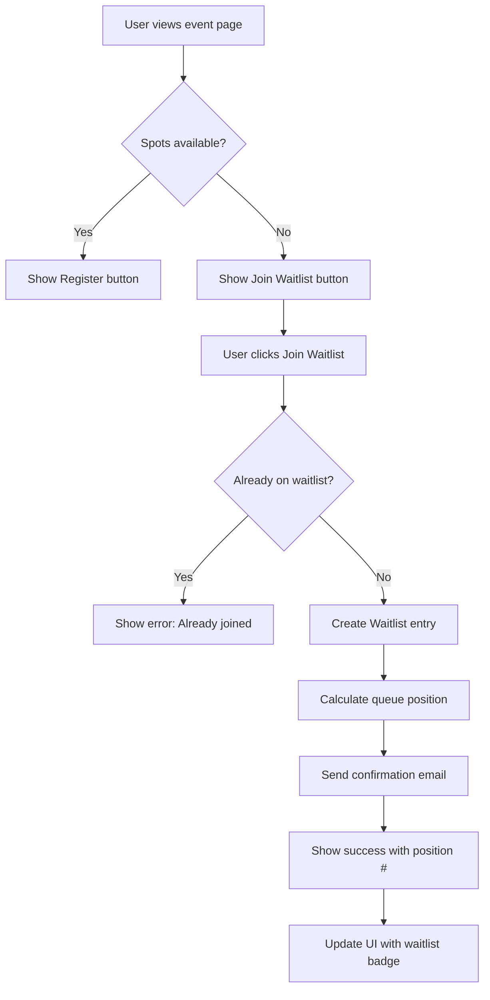
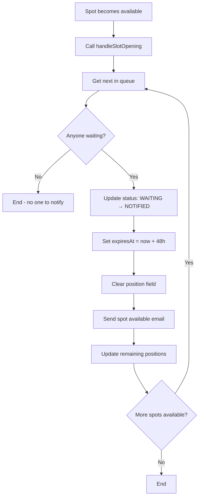
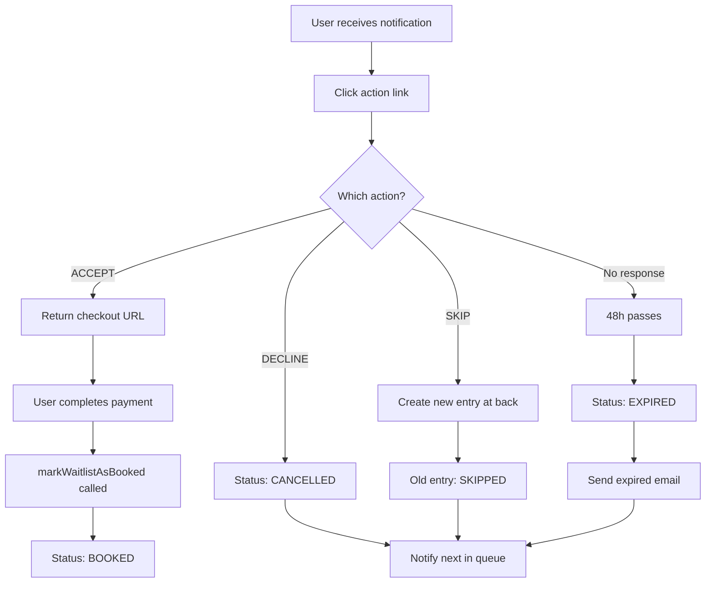
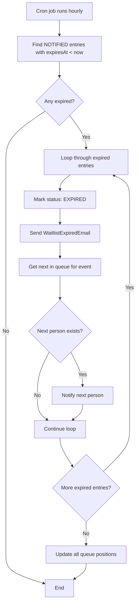
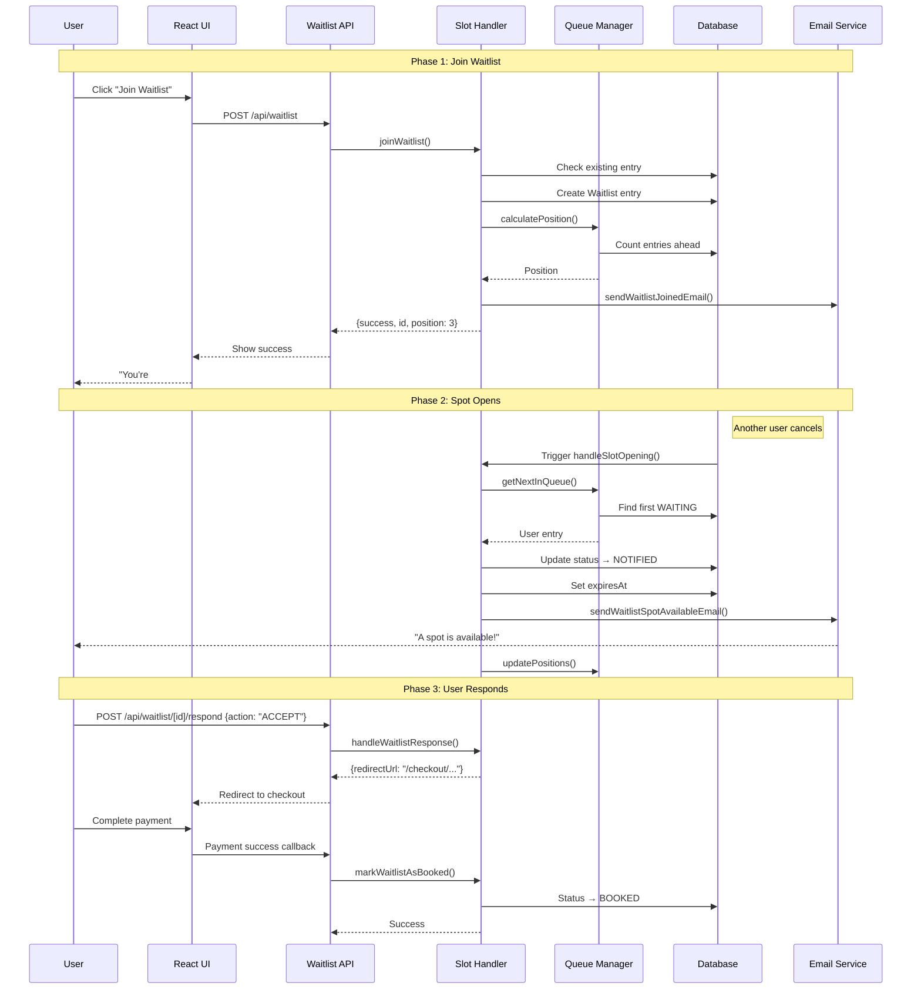
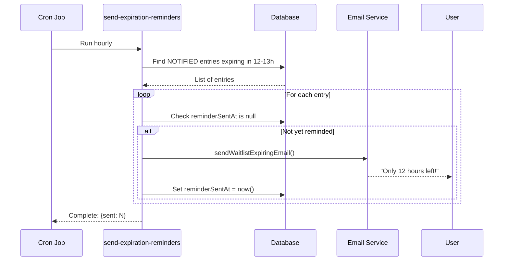
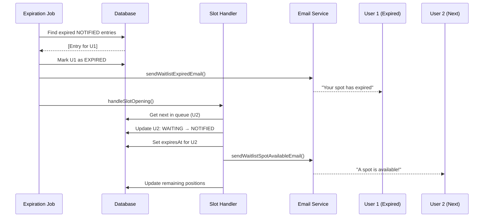

# Waitlist System Documentation

## Table of Contents

1. [Overview](#overview)
2. [Key Features](#key-features)
3. [User Flows](#user-flows)
4. [Architecture](#architecture)
5. [Database Schema](#database-schema)
6. [API Reference](#api-reference)
7. [Flowcharts](#flowcharts)
8. [Sequence Diagrams](#sequence-diagrams)
9. [Background Jobs](#background-jobs)
10. [Email Templates](#email-templates)
11. [UI Components](#ui-components)
12. [Configuration](#configuration)

---

## Overview

The Waitlist System allows users to join a queue when webinars or classes are at full capacity. When spots become available (through cancellations or capacity increases), users are automatically notified in queue order and given a time-limited window to complete their booking.

### Problem Solved

- Users don't miss out on popular events just because they filled up
- Consultants can maximize event attendance by automatically filling cancelled spots
- Fair, transparent queue management with position tracking

### Key Metrics

- **Notification Window**: 48 hours to complete booking after notification
- **Reminder**: Sent 12 hours before notification expires
- **Queue Order**: Priority-based (higher priority first), then join time (FIFO)

---

## Key Features

### For Consultees (Users)

- **Join Waitlist**: One-click join when event is full
- **Position Tracking**: Real-time queue position display
- **Notifications**: Email alerts when spots become available
- **48-Hour Window**: Guaranteed reservation time to complete booking
- **Response Options**: Accept, Decline, or Skip (move to back of queue)

### For Consultants

- **Automatic Management**: No manual intervention needed
- **Stats Dashboard**: View total waiting users per event
- **Capacity Control**: System responds to capacity changes automatically

### For Admins/Staff

- **Waitlist Dashboard**: View all waitlist entries across events
- **Filtering**: By status, event type, timeline
- **Monitoring**: Track conversion rates and queue health

---

## User Flows

### Consultee Flow

```
1. View Event → Event is FULL
2. Click "Join Waitlist"
3. Receive confirmation email with position #
4. Wait in queue...
5. [Spot Opens] → Receive "Spot Available" email
6. Choose:
   a. ACCEPT → Redirect to checkout → Pay → Confirmed!
   b. DECLINE → Removed from waitlist, next person notified
   c. SKIP → Moved to back of queue
   d. [No Response] → After 48h, marked EXPIRED, next person notified
```

### Consultant Flow

```
1. Create webinar/class with max capacity
2. Event fills up → Users join waitlist automatically
3. User cancels → System notifies next waitlisted user
4. View waitlist stats in dashboard
5. Optionally increase capacity → System notifies waiting users
```

### Admin/Staff Flow

```
1. Access Waitlist Dashboard
2. View all entries with filters (status, event type, search)
3. Monitor queue health and conversion rates
4. Troubleshoot issues for support tickets
```

---

## Architecture

### System Components

```
┌─────────────────────────────────────────────────────────────────┐
│                        Client Layer                              │
├─────────────────────────────────────────────────────────────────┤
│  JoinWaitlistButton  │  WaitlistBadge  │  WaitlistStatusBadge   │
│  SlotAvailableModal  │  Consultee Dashboard (Home, Waitlists)   │
└─────────────────────────────────────────────────────────────────┘
                                │
                                ▼
┌─────────────────────────────────────────────────────────────────┐
│                        API Layer                                 │
├─────────────────────────────────────────────────────────────────┤
│  /api/waitlist           (POST: join, GET: user entries)        │
│  /api/waitlist/[id]      (GET: details, DELETE: leave)          │
│  /api/waitlist/[id]/respond  (POST/GET: handle responses)       │
│  /api/waitlist/stats     (GET: consultant stats)                │
│  /api/admin/waitlists    (GET: admin dashboard data)            │
└─────────────────────────────────────────────────────────────────┘
                                │
                                ▼
┌─────────────────────────────────────────────────────────────────┐
│                      Service Layer                               │
├─────────────────────────────────────────────────────────────────┤
│  lib/waitlist/queue-manager.ts                                   │
│    - calculatePosition()     - getNextInQueue()                  │
│    - updatePositions()       - processExpiredNotifications()     │
│    - getWaitlistStats()      - getUserWaitlistEntries()          │
│                                                                  │
│  lib/waitlist/slot-handler.ts                                    │
│    - joinWaitlist()          - leaveWaitlist()                   │
│    - handleSlotOpening()     - handleWaitlistResponse()          │
│    - markWaitlistAsBooked()  - checkEventAvailability()          │
│                                                                  │
│  lib/waitlist/notifications.ts                                   │
│    - sendWaitlistJoinedEmail()                                   │
│    - sendWaitlistSpotAvailableEmail()                            │
│    - sendWaitlistExpiringEmail()                                 │
│    - sendWaitlistExpiredEmail()                                  │
└─────────────────────────────────────────────────────────────────┘
                                │
                                ▼
┌─────────────────────────────────────────────────────────────────┐
│                    Background Jobs                               │
├─────────────────────────────────────────────────────────────────┤
│  jobs/waitlist/send-expiration-reminders.ts (hourly)            │
│  jobs/waitlist/process-expired-notifications.ts (hourly)        │
└─────────────────────────────────────────────────────────────────┘
                                │
                                ▼
┌─────────────────────────────────────────────────────────────────┐
│                      Data Layer                                  │
├─────────────────────────────────────────────────────────────────┤
│  Prisma ORM → PostgreSQL                                         │
│  Models: Waitlist, Webinar, Class, User                          │
└─────────────────────────────────────────────────────────────────┘
```

### Data Flow

1. **User Joins** → API creates Waitlist entry → Email sent
2. **Spot Opens** → Job/Trigger calls `handleSlotOpening()` → Next user notified
3. **User Responds** → API calls `handleWaitlistResponse()` → Status updated
4. **User Pays** → Checkout flow calls `markWaitlistAsBooked()` → Entry completed
5. **Time Expires** → Cron job marks EXPIRED → Next user notified

---

## Database Schema

### Waitlist Model

```prisma
model Waitlist {
  id              String          @id @default(uuid())
  joinedAt        DateTime        @default(now())

  // Queue Management
  position        Int?            // Calculated queue position
  status          WaitlistStatus  @default(WAITING)
  priority        Int             @default(0)  // Higher = more priority

  // Notification Tracking
  notifiedAt      DateTime?       // When spot available notification sent
  expiresAt       DateTime?       // 48h window deadline
  reminderSentAt  DateTime?       // 12h before expiration reminder
  bookedAt        DateTime?       // When payment completed
  respondedAt     DateTime?       // When user responded

  // User Preferences
  preferences     Json?           // Future use

  // Relations
  userId          String
  user            User            @relation(...)
  webinarId       String?
  webinar         Webinar?        @relation(...)
  classId         String?
  class           Class?          @relation(...)

  // Constraints
  @@unique([userId, webinarId])
  @@unique([userId, classId])
  @@index([status, webinarId])
  @@index([status, classId])
  @@index([expiresAt])
  @@index([priority, joinedAt])
}
```

### WaitlistStatus Enum

| Status | Description |
|--------|-------------|
| `WAITING` | In queue, waiting for spot to open |
| `NOTIFIED` | Spot offered, 48h window active |
| `BOOKED` | Successfully completed booking |
| `EXPIRED` | 48h window passed without response |
| `CANCELLED` | User left waitlist voluntarily |
| `SKIPPED` | User declined, moved to back of queue |

---

## API Reference

### POST /api/waitlist

Join a waitlist for a webinar or class.

**Request:**
```json
{
  "webinarId": "uuid",  // OR
  "classId": "uuid",
  "preferences": {}     // Optional
}
```

**Response:**
```json
{
  "success": true,
  "id": "waitlist-entry-uuid",
  "position": 3,
  "message": "Successfully joined waitlist"
}
```

**Errors:**
- `400`: Missing event ID
- `401`: Not authenticated
- `409`: Already on waitlist
- `422`: Event has available spots (should register instead)

---

### GET /api/waitlist

Get current user's waitlist entries.

**Response:**
```json
{
  "webinars": [
    {
      "id": "entry-uuid",
      "status": "WAITING",
      "position": 2,
      "joinedAt": "2024-01-15T10:00:00Z",
      "webinar": {
        "id": "webinar-uuid",
        "webinarPlan": { "title": "..." }
      }
    }
  ],
  "classes": [...]
}
```

---

### GET /api/waitlist/[id]

Get details of a specific waitlist entry.

**Response:**
```json
{
  "id": "entry-uuid",
  "status": "NOTIFIED",
  "position": null,
  "joinedAt": "2024-01-15T10:00:00Z",
  "notifiedAt": "2024-01-16T14:00:00Z",
  "expiresAt": "2024-01-18T14:00:00Z",
  "webinar": { ... },
  "user": { "name": "...", "email": "..." }
}
```

---

### DELETE /api/waitlist/[id]

Leave a waitlist.

**Response:**
```json
{
  "success": true,
  "message": "Successfully left waitlist"
}
```

---

### POST /api/waitlist/[id]/respond

Respond to a spot available notification.

**Request:**
```json
{
  "action": "ACCEPT" | "DECLINE" | "SKIP"
}
```

**Response (ACCEPT):**
```json
{
  "success": true,
  "redirectUrl": "/checkout/plans/webinar/plan-uuid?eventId=...&fromWaitlist=..."
}
```

**Response (DECLINE/SKIP):**
```json
{
  "success": true,
  "message": "You have declined the spot"
}
```

---

### GET /api/waitlist/stats

Get waitlist statistics for consultant dashboard.

**Response:**
```json
{
  "totalWaiting": 15,
  "byWebinar": [
    { "webinarId": "...", "title": "...", "waitingCount": 5 }
  ],
  "byClass": [...],
  "averageWaitTime": 48  // hours
}
```

---

### GET /api/admin/waitlists

Get all waitlist entries for admin dashboard.

**Query Parameters:**
- `status`: Filter by status (WAITING, NOTIFIED, etc.)
- `eventType`: Filter by webinar or class
- `search`: Search by user name/email
- `groupBy`: Group results by event
- `timeline`: Filter by time period
- `page`, `limit`: Pagination

**Response:**
```json
{
  "waitlists": [...],
  "groupedByEvent": { ... },
  "stats": {
    "active": 10,
    "total": 50,
    "booked": 30,
    "expired": 5
  },
  "total": 50,
  "page": 1,
  "totalPages": 5
}
```

---

## Flowcharts

### User Join Waitlist Flow



### Spot Available Flow



### User Response Flow



### Expiration Processing Flow



---

## Sequence Diagrams

### Complete Waitlist Journey



### Expiration Reminder Flow



### Notification Cascade



---

## Background Jobs

### send-expiration-reminders.ts

**Purpose:** Send reminder emails 12 hours before the 48-hour notification window expires.

**Schedule:** Run every hour via GitHub Actions

**Logic:**
```typescript
// Find NOTIFIED entries expiring in 12-13 hours (not yet reminded)
const entries = await prisma.waitlist.findMany({
  where: {
    status: "NOTIFIED",
    expiresAt: {
      gte: now + 12h,
      lte: now + 13h
    },
    reminderSentAt: null
  }
});

// Send reminder to each, mark as reminded
for (const entry of entries) {
  await sendWaitlistExpiringEmail(...);
  await prisma.waitlist.update({
    where: { id: entry.id },
    data: { reminderSentAt: new Date() }
  });
}
```

**GitHub Action:** `.github/workflows/send-waitlist-reminders.yml`

---

### process-expired-notifications.ts

**Purpose:** Mark expired notifications and notify next users in queue.

**Schedule:** Run hourly via GitHub Actions

**Logic:**
```typescript
// 1. Process all expired notifications
const result = await processExpiredNotifications();
// Returns entries that were just marked EXPIRED

// 2. For each expired entry:
for (const entry of result.entries) {
  // Send expired email to user
  await sendWaitlistExpiredEmail(...);

  // Notify next person in queue
  await handleSlotOpening({
    webinarId: entry.webinarId,
    classId: entry.classId,
    slotsAvailable: 1
  });
}
```

**GitHub Action:** `.github/workflows/process-waitlist-expirations.yml`

---

## Email Templates

All email templates are located in `emails/waitlist/` and use React Email.

### WaitlistJoinedEmail

**Trigger:** User joins waitlist
**Purpose:** Confirm position and explain the process

**Content:**
- Queue position (#N in line)
- Event details (title, date, consultant)
- How it works explanation
- Link to manage waitlist

---

### WaitlistSpotAvailableEmail

**Trigger:** Spot opens for notified user
**Purpose:** Urgent call-to-action to book

**Content:**
- Strong urgency messaging
- Event details
- 48-hour deadline countdown
- Three action buttons: Book Now, Skip, Leave Waitlist

---

### WaitlistExpiringEmail

**Trigger:** 12 hours before notification expires
**Purpose:** Final reminder to take action

**Content:**
- "Only 12 hours left!" messaging
- Red-themed urgency
- Single "Complete My Booking" button
- Explanation of what happens if no action

---

### WaitlistExpiredEmail

**Trigger:** 48-hour window passed
**Purpose:** Inform user and suggest next steps

**Content:**
- Explanation of what happened
- Next person was notified
- Option to rejoin if interested

---

## UI Components

### WaitlistStatusBadge

**Location:** `components/ui/waitlist-status-badge.tsx`

**Purpose:** Display booking status for webinars/classes

**Variants:**
- `CONFIRMED` (green): User has paid and has a confirmed slot
- `WAITLISTED` (amber): User is on waitlist, shows position #
- `NOTIFIED` (blue, animated): Spot available, needs action

**Usage:**
```tsx
<WaitlistStatusBadge
  bookingStatus="WAITLISTED"
  waitlistPosition={3}
  size="sm"
  showIcon={true}
/>
```

---

### JoinWaitlistButton

**Location:** `components/waitlist/JoinWaitlistButton.tsx`

**Purpose:** Allow users to join waitlist from event pages

**Features:**
- Shows current position if already joined
- Handles loading states
- Updates when props change (useEffect sync)

---

### WaitlistBadge

**Location:** `components/waitlist/WaitlistBadge.tsx`

**Purpose:** Simple badge showing waitlist position

---

### SlotAvailableModal

**Location:** `components/waitlist/SlotAvailableModal.tsx`

**Purpose:** Modal for NOTIFIED users to take action

**Features:**
- Countdown timer to expiration
- Accept/Decline/Skip buttons
- Handles undefined expiresAt gracefully

---

## Configuration

### Environment Variables

```env
# Required for email links
NEXT_PUBLIC_APP_URL=https://familiarise.com

# Email service (Resend)
RESEND_API_KEY=re_xxxxx

# Database
DATABASE_URL=postgresql://...
```

### GitHub Actions Cron Jobs

**send-waitlist-reminders.yml:**
```yaml
on:
  schedule:
    - cron: '0 * * * *'  # Every hour
  workflow_dispatch: {}  # Manual trigger
```

**process-waitlist-expirations.yml:**
```yaml
on:
  schedule:
    - cron: '0 * * * *'  # Every hour
  workflow_dispatch: {}  # Manual trigger
```

### Notification Window

The 48-hour window is configured in `lib/waitlist/slot-handler.ts`:

```typescript
const NOTIFICATION_WINDOW_HOURS = 48;

// In handleSlotOpening:
expiresAt: new Date(Date.now() + NOTIFICATION_WINDOW_HOURS * 60 * 60 * 1000)
```

### Priority System

Priority is stored as an integer in the Waitlist model. Higher values = higher priority.

```typescript
// Default priority
priority: 0

// Premium users could get higher priority
priority: 10
```

Queue ordering: `ORDER BY priority DESC, joinedAt ASC`

---

## Troubleshooting

### Common Issues

**User didn't receive notification email:**
1. Check `notifiedAt` timestamp in database
2. Verify email service logs (Resend dashboard)
3. Check spam folder

**Position seems wrong:**
1. Run `calculatePosition(entryId)` to verify
2. Check if `updatePositions()` ran after last change
3. Verify no duplicate entries exist

**Booking didn't mark as complete:**
1. Verify `markWaitlistAsBooked()` was called
2. Check checkout flow includes `fromWaitlist` param
3. Verify entry status is NOTIFIED (not already expired)

---

## Future Enhancements

- [ ] SMS notifications option
- [ ] Configurable notification window per event
- [ ] VIP/premium priority levels
- [ ] Waitlist analytics dashboard
- [ ] Automatic capacity optimization suggestions
