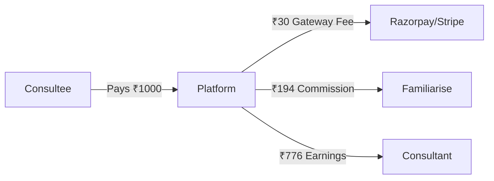

# Business Model & Revenue Strategy

## Overview

Familiarise operates as a **marketplace platform** connecting consultants (experts) with consultees (learners/clients). The platform generates revenue through **commission fees** on transactions.

---

## Revenue Model: Commission-Based



**Formula:**
```
Consultant Earnings = (Payment Amount - Gateway Fee) × (1 - Platform Commission %)
```

---

## Industry Benchmarks

| Platform | Platform Take Rate | Creator Gets | Model |
|----------|-------------------|--------------|-------|
| **Udemy** (marketplace) | 63% | 37% | High discovery, low creator control |
| **Udemy** (instructor promo) | 3% | 97% | Self-marketing |
| **Skillshare** | ~50% | ~50% | Subscription pool |
| **Teachable** | 5-10% | 90-95% | SaaS + transaction |
| **Thinkific** | 0% | 100% | Pure SaaS (monthly fee) |
| **Whop** | 3% | 97% | Low take rate |
| **Toptal** | 30-50% | 50-70% | Premium consulting |
| **Upwork** | 5-20% | 80-95% | Sliding scale |
| **Fiverr** | 20% | 80% | Gig marketplace |
| **App Stores** | 30% | 70% | Digital goods |

**Source:** [Udemy Revenue Share](https://support.udemy.com/hc/en-us/articles/229605008-Instructor-Revenue-Share)

---

## Commission Model Options

### Option 1: Fixed Percentage (Recommended for MVP)

| Commission | Platform Gets | Consultant Gets | Use Case |
|------------|---------------|-----------------|----------|
| 15% | ₹145.50 | ₹824.50 | Competitive, attracts creators |
| 20% | ₹194 | ₹776 | Balanced |
| 25% | ₹242.50 | ₹727.50 | Higher margin |
| 30% | ₹291 | ₹679 | Premium features included |

*Based on ₹1000 payment after 3% gateway fee (₹970 net)*

**Pros:**
- Simple to understand
- Easy to implement
- Transparent for consultants

**Cons:**
- Doesn't reward high-volume consultants
- May lose top performers to competitors

---

### Option 2: Tiered by Volume (Growth Stage)

| Monthly GMV | Platform Commission | Example |
|-------------|---------------------|---------|
| ₹0 - ₹50,000 | 25% | New consultants |
| ₹50,001 - ₹2,00,000 | 20% | Growing consultants |
| ₹2,00,001 - ₹5,00,000 | 15% | Established consultants |
| ₹5,00,000+ | 10% | Top performers |

**Pros:**
- Rewards loyalty and growth
- Retains top performers
- Encourages consultants to drive more business

**Cons:**
- Complex to implement
- Harder to predict revenue
- Requires volume tracking

---

### Option 3: Per Event Type

| Event Type | Commission | Rationale |
|------------|------------|-----------|
| Consultation (1:1) | 20% | High value, simple |
| Subscription | 15% | Recurring, lower margin OK |
| Webinar | 25% | Platform provides tech |
| Class | 20% | Multi-session commitment |

**Pros:**
- Reflects platform value-add per type
- Can optimize by event profitability

**Cons:**
- Confusing for consultants
- Complex pricing communication

---

### Option 4: Consultant Tier-Based (Recommended)

This model segments consultants by their experience and pricing level, with commission rates that reward top-tier talent.

| Tier | Price Range (Hourly) | Commission | Badge | Target |
|------|---------------------|------------|-------|--------|
| **Budget** | ₹299 - ₹999 | 20% | None | Students, early-career |
| **Everyday** | ₹1,000 - ₹2,999 | 20% | Verified | Working professionals |
| **Premium** | ₹3,000 - ₹9,999 | 18% | Premium | Senior professionals |
| **Luxury** | ₹10,000 - ₹50,000+ | 15% | Elite | C-suite, celebrities |

**Pros:**
- Attracts consultants across all price points
- Retains luxury consultants with lower commission
- Clear progression path for growth
- Market positioning from budget to luxury

**Cons:**
- More complex than fixed percentage
- Requires tier eligibility verification

See [07-pricing-calculator.md](./07-pricing-calculator.md) for complete tier details.

---

### Option 5: Freemium + Commission (Alternative)

| Plan | Monthly Fee | Commission | Features |
|------|-------------|------------|----------|
| Free | ₹0 | 25% | Basic features |
| Pro | ₹999/mo | 15% | Priority support, analytics |
| Enterprise | ₹4,999/mo | 10% | Custom branding, API access |

**Pros:**
- Predictable subscription revenue
- Lower commission attracts pros
- Upsell path

**Cons:**
- Barrier to entry for new consultants
- Dual revenue stream complexity

---

## Minimum Pricing Strategy

To ensure platform profitability, consultants should set prices above minimum thresholds.

### Cost Structure Per Transaction

| Cost Component | Amount | Notes |
|----------------|--------|-------|
| Payment Gateway | 2-3% + ₹3 | Razorpay/Stripe |
| Server Costs | ~₹5/transaction | Estimated |
| Video/Meeting | ~₹10/session | Stream/meeting service |
| Support Overhead | ~₹5/transaction | Customer service |
| **Total Variable Cost** | **~₹25-30** | Per transaction |

### Minimum Price Calculation

```
Minimum Price = Variable Cost / (1 - Commission % - Gateway %)

Example (20% commission, 3% gateway):
Minimum Price = ₹30 / (1 - 0.20 - 0.03)
Minimum Price = ₹30 / 0.77
Minimum Price = ₹39 (round to ₹50)
```

### Recommended Minimums (Updated December 2025)

| Event Type | Minimum Price | Platform Earns | Consultant Earns |
|------------|---------------|----------------|------------------|
| Consultation (15 min) | ₹299 | ₹58 | ₹183 |
| Consultation (30 min) | ₹499 | ₹97 | ₹305 |
| Consultation (1 hour) | ₹999 | ₹194 | ₹610 |
| Webinar | ₹199 | ₹39 | ₹122 |
| Subscription (monthly) | ₹999 | ₹194 | ₹610 |
| Class (per session) | ₹399 | ₹77 | ₹244 |

*At 20% commission, 3% gateway. Premium/Luxury tiers have higher minimums and lower commissions.*

---

## Break-Even Analysis

### Fixed Costs (Monthly Estimate)

| Cost | Amount | Notes |
|------|--------|-------|
| Server/Infrastructure | ₹50,000 | Vercel, Supabase, etc. |
| Team Salaries | ₹3,00,000 | 3-4 people initially |
| Marketing | ₹50,000 | Ads, content |
| Tools/SaaS | ₹20,000 | Analytics, email, etc. |
| Miscellaneous | ₹30,000 | Legal, accounting |
| **Total Fixed Costs** | **₹4,50,000** | Monthly |

### Break-Even Calculation

```
Break-Even GMV = Fixed Costs / Effective Commission Rate

At 20% commission (after gateway):
Break-Even GMV = ₹4,50,000 / 0.17
Break-Even GMV = ₹26,47,059 (~₹26.5 Lakhs)
```

### Monthly Targets

| Stage | GMV Target | Revenue | Profit |
|-------|------------|---------|--------|
| Month 1-3 | ₹5,00,000 | ₹85,000 | -₹3,65,000 |
| Month 4-6 | ₹15,00,000 | ₹2,55,000 | -₹1,95,000 |
| Month 7-9 | ₹30,00,000 | ₹5,10,000 | +₹60,000 |
| Month 10-12 | ₹50,00,000 | ₹8,50,000 | +₹4,00,000 |

---

## Competitive Positioning

### Price vs Value Matrix

```
High Commission
     │
     │  Udemy (63%)
     │      ●
     │           Fiverr (20%)
     │               ●
     │                   Familiarise (20%)
     │                       ●
     │                           Teachable (10%)
     │                               ●
     │                                   Whop (3%)
     │                                       ●
Low Commission ────────────────────────────────────
              Low Value-Add              High Value-Add
```

### Our Position
- **Commission:** 15-20% (competitive with Fiverr/Upwork)
- **Value-Add:** High (video, scheduling, payments, analytics)
- **Target:** Quality consultants who want control + platform benefits

---

## Decision Matrix

| If You Want... | Choose... | Commission |
|----------------|-----------|------------|
| Maximum consultant attraction | Fixed 15% | Low margin |
| Balanced growth | Fixed 20% | Standard |
| Reward loyalty | Tiered volume | Complex |
| Premium positioning | Fixed 25% + features | Higher margin |

---

## Next Steps

1. **MVP:** Start with **Tier-Based** commission (Budget/Everyday at 20%, Premium at 18%, Luxury at 15%)
2. **Month 3:** Implement tier eligibility verification and badge system
3. **Month 6:** Introduce volume discounts for high-performing consultants
4. **Month 12:** Consider adding freemium SaaS tier for enterprise consultants

---

## Related Documents

- [02-payout-architecture.md](./02-payout-architecture.md) - How money flows to consultants
- [04-revenue-distribution.md](./04-revenue-distribution.md) - Detailed calculations
- [07-pricing-calculator.md](./07-pricing-calculator.md) - Minimum price calculator
