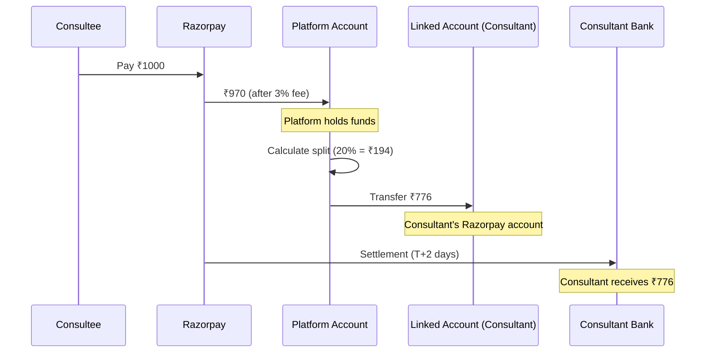
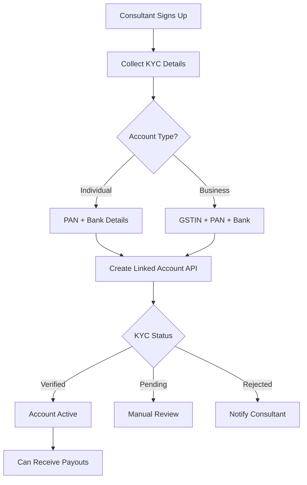
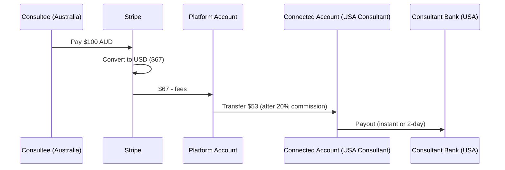
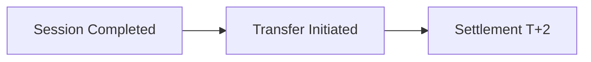
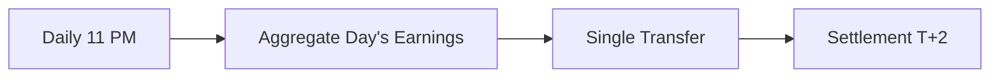
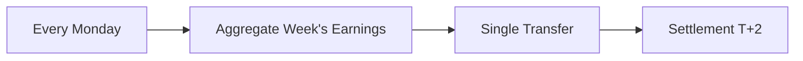
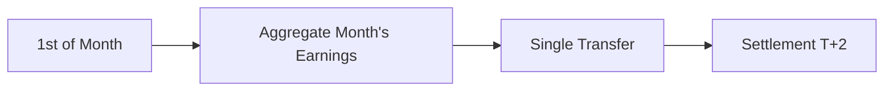
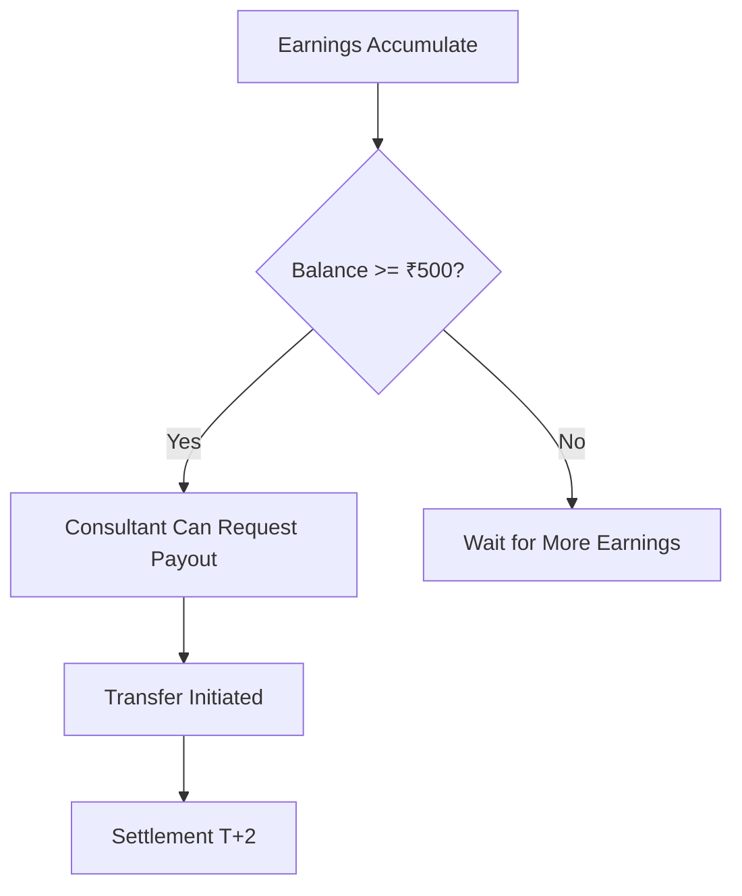
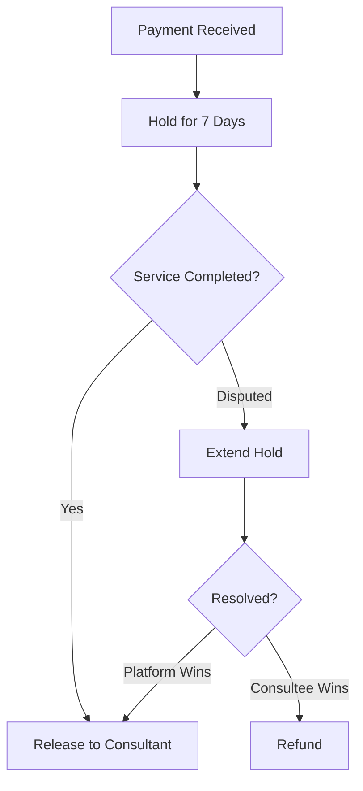

# Payout Architecture

## Overview

This document covers how money flows from customers to consultants using payment gateway payout systems.

**Priority:** India first (Razorpay Route) → International later (Stripe Connect)

---

## Current State: NOT IMPLEMENTED

As of December 2025:
- Payment collection works (Stripe/Razorpay)
- **NO payout system to consultants**
- Money sits in platform account
- Manual transfers would be required (not scalable)

---

## Razorpay Route (India - Priority)

### What is Razorpay Route?

[Razorpay Route](https://razorpay.com/route/) enables split payments where incoming payments are automatically distributed to multiple parties (consultants, platform).

### Key Concepts

| Term | Definition |
|------|------------|
| **Linked Account** | Consultant's Razorpay sub-account |
| **Transfer** | Moving money from main account to linked account |
| **Settlement** | When linked account receives actual bank deposit |
| **Hold** | Delaying settlement (e.g., until service delivered) |

### Architecture Flow



### Linked Account Setup

**Consultant Onboarding Flow:**



### KYC Requirements (India)

| Account Type | Required Documents |
|--------------|-------------------|
| **Individual** | PAN Card, Bank Account, Aadhaar (optional) |
| **Business** | GSTIN, PAN, Bank Account, Business Proof |
| **LLP/Company** | Registration Certificate, PAN, Bank, Directors' KYC |

### API Integration

**1. Create Linked Account:**
```javascript
const account = await razorpay.accounts.create({
  email: "consultant@example.com",
  phone: "9876543210",
  legal_business_name: "John Doe Consulting",
  business_type: "individual",
  contact_name: "John Doe",
  profile: {
    category: "education",
    subcategory: "tutoring_services",
    addresses: {
      registered: {
        street1: "123 Main St",
        city: "Mumbai",
        state: "Maharashtra",
        postal_code: 400001,
        country: "IN"
      }
    }
  },
  legal_info: {
    pan: "ABCDE1234F",
    gst: "27ABCDE1234F1Z5" // Optional
  },
  bank_account: {
    beneficiary_name: "John Doe",
    account_number: "1234567890123456",
    account_type: "savings",
    ifsc_code: "HDFC0001234"
  }
});
```

**2. Split Payment at Checkout:**
```javascript
const order = await razorpay.orders.create({
  amount: 100000, // ₹1000 in paise
  currency: "INR",
  transfers: [
    {
      account: "acc_ConsultantLinkedAccountId",
      amount: 77600, // ₹776 to consultant
      currency: "INR",
      on_hold: false, // or true to delay settlement
      on_hold_until: null // timestamp if on_hold is true
    }
  ]
});
// Platform automatically keeps ₹194 (100000 - 77600 - gateway fee)
```

**3. Manual Transfer (Alternative):**
```javascript
// After payment success, transfer manually
const transfer = await razorpay.transfers.create({
  account: "acc_ConsultantLinkedAccountId",
  amount: 77600,
  currency: "INR"
});
```

### Settlement Timeline

| Event | Timeline |
|-------|----------|
| Payment Captured | T+0 |
| Transfer to Linked Account | T+0 (instant) |
| Settlement to Consultant Bank | T+2 business days |
| Settlement to Platform Bank | T+2 business days |

### Razorpay Route Pricing

| Component | Fee |
|-----------|-----|
| Payment Processing | 2% + GST |
| Route Transfer | FREE (included) |
| Linked Account | FREE |
| Settlement | FREE |

---

## Stripe Connect (International - Future)

### What is Stripe Connect?

[Stripe Connect](https://stripe.com/connect) enables platforms to pay out to users in 118+ countries.

### Account Types

| Type | Control | Onboarding | Use Case |
|------|---------|------------|----------|
| **Express** | Stripe handles | Stripe-hosted | Easiest, recommended |
| **Standard** | User controls | User goes to Stripe | Existing Stripe users |
| **Custom** | Platform controls | Platform builds | Full white-label |

**Recommendation:** Start with **Express** accounts

### Architecture Flow



### Stripe Connect Pricing

| Component | Fee |
|-----------|-----|
| Payment Processing | 2.9% + $0.30 |
| Connect Fee | 0.25% + $0.25 per payout |
| International Cards | +1.5% |
| Currency Conversion | 1% |
| Instant Payouts | 1% (min $0.50) |

### API Integration

**1. Create Connected Account:**
```javascript
const account = await stripe.accounts.create({
  type: 'express',
  country: 'US',
  email: 'consultant@example.com',
  capabilities: {
    card_payments: { requested: true },
    transfers: { requested: true },
  },
});
```

**2. Onboarding Link:**
```javascript
const accountLink = await stripe.accountLinks.create({
  account: account.id,
  refresh_url: 'https://familiarise.in/consultant/onboarding/refresh',
  return_url: 'https://familiarise.in/consultant/onboarding/complete',
  type: 'account_onboarding',
});
// Redirect consultant to accountLink.url
```

**3. Split Payment:**
```javascript
const paymentIntent = await stripe.paymentIntents.create({
  amount: 10000, // $100 in cents
  currency: 'usd',
  transfer_data: {
    destination: 'acct_ConsultantConnectedAccountId',
    amount: 7760, // $77.60 to consultant
  },
});
// Platform keeps $22.40 (before Stripe fees)
```

### Supported Countries (118+)

**Full Payout Support:**
- USA, UK, Canada, Australia, Germany, France, Netherlands, Singapore, Japan, etc.

**Limited Support:**
- India (receive only, not send)
- Brazil, Mexico (additional requirements)

---

## Comparison: Razorpay Route vs Stripe Connect

| Feature | Razorpay Route | Stripe Connect |
|---------|---------------|----------------|
| **Primary Market** | India | Global |
| **Currencies** | INR (settles in INR) | 135+ currencies |
| **Payout Countries** | India only | 118+ countries |
| **Setup Fee** | Free | Free |
| **Transfer Fee** | Free | 0.25% + $0.25 |
| **Settlement Time** | T+2 days | T+2 days (instant available) |
| **KYC** | PAN + Bank | Varies by country |
| **API Complexity** | Medium | Medium-High |
| **Dashboard** | Good | Excellent |

---

## Payout Frequency Options

### Option 1: Instant (After Each Session)



**Pros:** Consultants love it
**Cons:** High operational load, more transfer fees

### Option 2: Daily



**Pros:** Balance of speed and efficiency
**Cons:** Still frequent processing

### Option 3: Weekly



**Pros:** Efficient, predictable
**Cons:** Consultants wait longer

### Option 4: Monthly



**Pros:** Most efficient, matches invoicing
**Cons:** Long wait, cash flow issues for consultants

### Option 5: On-Demand (Threshold-Based)



**Pros:** Flexible, consultant control
**Cons:** Complex to implement

### Recommendation

| Stage | Frequency | Minimum |
|-------|-----------|---------|
| MVP | Weekly | ₹500 |
| Growth | Daily or On-Demand | ₹200 |
| Scale | Instant or Daily | ₹100 |

---

## Hold & Release Mechanism

For protecting against refunds/disputes:



### Hold Periods by Event Type

| Event Type | Hold Period | Rationale |
|------------|-------------|-----------|
| Consultation | 24 hours | Quick delivery |
| Webinar | 48 hours | After event ends |
| Subscription | 7 days | First session buffer |
| Class | Per-session | Release after each |

---

## Security Considerations

1. **Never store bank details** - Use tokenized accounts via Razorpay/Stripe
2. **Verify consultant identity** before first payout
3. **Implement velocity checks** - Flag unusual payout patterns
4. **Audit trail** - Log all transfers with reasons
5. **Dispute buffer** - Hold period before release

---

## Related Documents

- [01-business-model.md](./01-business-model.md) - Commission rates
- [03-international-payments.md](./03-international-payments.md) - Cross-border details
- [06-payout-implementation-plan.md](./06-payout-implementation-plan.md) - Technical implementation
