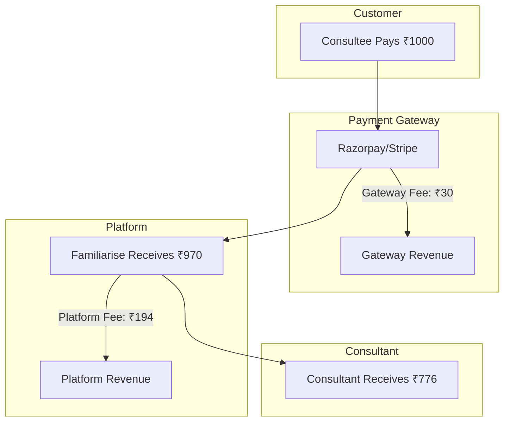
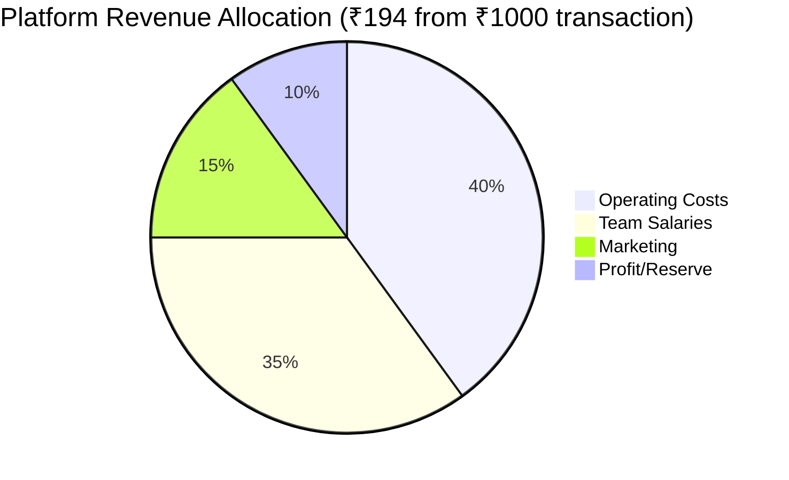

# Revenue Distribution Guide

## Overview

This document details how revenue is distributed among all parties: Payment Gateway, Platform, and Consultants. It also covers employee compensation models.

---

## Money Flow Diagram



---

## Detailed Breakdown

### Standard Transaction (₹1,000)

| Party                   | Amount | Percentage | Calculation |
| ----------------------- | ------ | ---------- | ----------- |
| **Consultee Pays**      | ₹1,000 | 100%       | -           |
| **Gateway Fee**         | ₹30    | 3%         | 1000 × 3%   |
| **Net to Platform**     | ₹970   | 97%        | 1000 - 30   |
| **Platform Commission** | ₹194   | 20% of net | 970 × 20%   |
| **Consultant Earnings** | ₹776   | 80% of net | 970 × 80%   |

---

## Commission Model Calculations

### Model 1: Fixed 15% Commission

| Payment | Gateway (3%) | Net    | Platform (15%) | Consultant (85%) |
| ------- | ------------ | ------ | -------------- | ---------------- |
| ₹500    | ₹15          | ₹485   | ₹73            | ₹412             |
| ₹1,000  | ₹30          | ₹970   | ₹146           | ₹824             |
| ₹2,500  | ₹75          | ₹2,425 | ₹364           | ₹2,061           |
| ₹5,000  | ₹150         | ₹4,850 | ₹728           | ₹4,122           |
| ₹10,000 | ₹300         | ₹9,700 | ₹1,455         | ₹8,245           |

### Model 2: Fixed 20% Commission

| Payment | Gateway (3%) | Net    | Platform (20%) | Consultant (80%) |
| ------- | ------------ | ------ | -------------- | ---------------- |
| ₹500    | ₹15          | ₹485   | ₹97            | ₹388             |
| ₹1,000  | ₹30          | ₹970   | ₹194           | ₹776             |
| ₹2,500  | ₹75          | ₹2,425 | ₹485           | ₹1,940           |
| ₹5,000  | ₹150         | ₹4,850 | ₹970           | ₹3,880           |
| ₹10,000 | ₹300         | ₹9,700 | ₹1,940         | ₹7,760           |

### Model 3: Fixed 25% Commission

| Payment | Gateway (3%) | Net    | Platform (25%) | Consultant (75%) |
| ------- | ------------ | ------ | -------------- | ---------------- |
| ₹500    | ₹15          | ₹485   | ₹121           | ₹364             |
| ₹1,000  | ₹30          | ₹970   | ₹243           | ₹727             |
| ₹2,500  | ₹75          | ₹2,425 | ₹606           | ₹1,819           |
| ₹5,000  | ₹150         | ₹4,850 | ₹1,213         | ₹3,637           |
| ₹10,000 | ₹300         | ₹9,700 | ₹2,425         | ₹7,275           |

### Model 4: Tiered Volume Commission

**Tiers:**

- ₹0-50K GMV/month: 25%
- ₹50K-2L GMV/month: 20%
- ₹2L-5L GMV/month: 15%
- ₹5L+ GMV/month: 10%

| Consultant GMV | Commission | Platform Earns | Consultant Earns |
| -------------- | ---------- | -------------- | ---------------- |
| ₹30,000/mo     | 25%        | ₹7,275         | ₹21,825          |
| ₹1,00,000/mo   | 20%        | ₹19,400        | ₹77,600          |
| ₹3,00,000/mo   | 15%        | ₹43,650        | ₹247,350         |
| ₹8,00,000/mo   | 10%        | ₹77,600        | ₹698,400         |

### Model 5: Consultant Tier-Based Commission (Recommended)

**Tiers by pricing and experience level:**

| Tier     | Price Range           | Commission | Target Consultants     |
| -------- | --------------------- | ---------- | ---------------------- |
| Budget   | ₹299 - ₹999/hr        | 20%        | Students, early-career |
| Everyday | ₹1,000 - ₹2,999/hr    | 20%        | Working professionals  |
| Premium  | ₹3,000 - ₹9,999/hr    | 18%        | Senior professionals   |
| Luxury   | ₹10,000 - ₹50,000+/hr | 15%        | C-suite, celebrities   |

**Example Calculations (60-min Consultation):**

| Tier     | Listing Price | Gateway (3%) | Net     | Platform Fee | Consultant Earns | Take-Home % |
| -------- | ------------- | ------------ | ------- | ------------ | ---------------- | ----------- |
| Budget   | ₹999          | ₹30          | ₹969    | ₹194 (20%)   | ₹775             | 77.6%       |
| Everyday | ₹2,499        | ₹75          | ₹2,424  | ₹485 (20%)   | ₹1,939           | 77.6%       |
| Premium  | ₹6,999        | ₹210         | ₹6,789  | ₹1,222 (18%) | ₹5,567           | 79.5%       |
| Luxury   | ₹25,000       | ₹750         | ₹24,250 | ₹3,638 (15%) | ₹20,612          | 82.4%       |

**Why Lower Commission for Higher Tiers?**

- Luxury consultants bring prestige and marketing value
- Higher transaction values offset lower percentage
- Prevents top talent from going direct or to competitors
- Platform still earns more per transaction (₹3,638 vs ₹194)

See [07-pricing-calculator.md](./07-pricing-calculator.md) for complete tier details.

---

## Platform Revenue Allocation

### Where Platform Commission Goes



| Category                         | % of Revenue | From ₹194 |
| -------------------------------- | ------------ | --------- |
| Operating Costs (servers, tools) | 40%          | ₹78       |
| Team Salaries                    | 35%          | ₹68       |
| Marketing & Growth               | 15%          | ₹29       |
| Profit/Reserve                   | 10%          | ₹19       |

---

## Employee Compensation Models

### Option 1: Fixed Salary Only

| Role           | Monthly Salary      | Annual    | Notes                         |
| -------------- | ------------------- | --------- | ----------------------------- |
| CEO/Founder    | ₹50,000 - ₹1,00,000 | ₹6-12L    | Early stage, reinvest profits |
| CTO/Tech Lead  | ₹80,000 - ₹1,50,000 | ₹9.6-18L  | Key technical hire            |
| Full-Stack Dev | ₹50,000 - ₹1,00,000 | ₹6-12L    | Junior to mid                 |
| Marketing      | ₹40,000 - ₹80,000   | ₹4.8-9.6L | Growth focus                  |
| Support        | ₹25,000 - ₹40,000   | ₹3-4.8L   | Customer success              |

**Pros:** Simple, predictable costs
**Cons:** No alignment with company success

---

### Option 2: Salary + Profit Sharing

**Structure:**

- Base Salary: 70-80% of market rate
- Profit Share: 10-20% of company profits distributed quarterly

| Role      | Base Salary | Profit Pool % | Example (₹5L Profit) |
| --------- | ----------- | ------------- | -------------------- |
| CEO       | ₹70,000     | 30%           | +₹1,50,000           |
| CTO       | ₹80,000     | 25%           | +₹1,25,000           |
| Dev 1     | ₹50,000     | 15%           | +₹75,000             |
| Dev 2     | ₹50,000     | 15%           | +₹75,000             |
| Marketing | ₹40,000     | 10%           | +₹50,000             |
| Support   | ₹25,000     | 5%            | +₹25,000             |

**Calculation:**

```
Quarterly Profit = Revenue - Costs - Reserves
Distributable = Profit × 50% (keep 50% for growth)
Employee Share = Distributable × Their Pool %
```

**Pros:** Aligns incentives, attracts talent
**Cons:** Variable income, complex accounting

---

### Option 3: Salary + Equity (ESOP)

**Structure:**

- Market-rate salary
- Equity pool: 10-15% of company for employees
- 4-year vesting, 1-year cliff

| Role           | Salary    | Equity % | Vesting |
| -------------- | --------- | -------- | ------- |
| CTO            | ₹1,20,000 | 3-5%     | 4 years |
| Early Dev      | ₹80,000   | 1-2%     | 4 years |
| Marketing Lead | ₹70,000   | 0.5-1%   | 4 years |
| Later Hires    | Market    | 0.1-0.5% | 4 years |

**Value Example (Company valued at ₹10 Cr):**

- CTO (3%): ₹30 lakhs in equity
- Early Dev (1%): ₹10 lakhs in equity

**Pros:** Attracts top talent, long-term alignment
**Cons:** Dilution, complex legal, only valuable if exit

---

### Option 4: Hybrid (Recommended)

**Structure:**

- Competitive base salary
- Small profit share (5-10%)
- Equity for key hires

| Role        | Base    | Profit %  | Equity      |
| ----------- | ------- | --------- | ----------- |
| Founders    | ₹50K-1L | Remainder | 40-50% each |
| CTO (hired) | ₹1.2L   | 10%       | 2-4%        |
| Early Team  | ₹60-80K | 5% each   | 0.5-1%      |
| Later Team  | Market  | 2-3% each | 0.1-0.25%   |

---

## Payout Frequency Options

### Weekly Payouts

| Day          | Action                         |
| ------------ | ------------------------------ |
| Sunday 11 PM | Aggregate week's earnings      |
| Monday       | Initiate transfers             |
| Wednesday    | Settlement to consultant banks |

**Minimum Payout:** ₹500
**Fees:** None (included in commission)

### Bi-Weekly Payouts

| Day        | Action             |
| ---------- | ------------------ |
| 1st & 15th | Aggregate earnings |
| 2nd & 16th | Initiate transfers |
| 4th & 18th | Settlement         |

**Minimum Payout:** ₹500
**Fees:** None

### Monthly Payouts

| Day               | Action             |
| ----------------- | ------------------ |
| Last day of month | Aggregate earnings |
| 1st of next month | Initiate transfers |
| 3rd of month      | Settlement         |

**Minimum Payout:** ₹100
**Fees:** None

### On-Demand Payouts

| Trigger             | Action                   |
| ------------------- | ------------------------ |
| Consultant requests | Check balance >= minimum |
| If eligible         | Initiate transfer        |
| T+2                 | Settlement               |

**Minimum Payout:** ₹500
**Fees:** ₹10 per request (or free if >₹2000)

---

## Example Monthly Scenario

### Platform with 100 Active Consultants

**Assumptions:**

- Average transaction: ₹1,000
- Average transactions per consultant: 10/month
- Commission: 20%

| Metric                    | Amount     |
| ------------------------- | ---------- |
| Total Transactions        | 1,000      |
| GMV                       | ₹10,00,000 |
| Gateway Fees (3%)         | ₹30,000    |
| Net to Platform           | ₹9,70,000  |
| Platform Commission (20%) | ₹1,94,000  |
| Consultant Payouts        | ₹7,76,000  |

**Platform P&L:**
| Item | Amount |
|------|--------|
| Revenue | ₹1,94,000 |
| Server Costs | -₹30,000 |
| Salaries (4 people) | -₹2,00,000 |
| Marketing | -₹30,000 |
| Tools/SaaS | -₹15,000 |
| **Net Profit** | **-₹81,000** |

_Need ~₹5,00,000 revenue (~260 consultants × 10 transactions) to break even_

---

## Revenue Projection (Year 1)

| Month | Consultants | Transactions | GMV        | Platform Revenue |
| ----- | ----------- | ------------ | ---------- | ---------------- |
| 1     | 10          | 50           | ₹50,000    | ₹9,700           |
| 2     | 20          | 120          | ₹1,20,000  | ₹23,280          |
| 3     | 35          | 250          | ₹2,50,000  | ₹48,500          |
| 4     | 50          | 400          | ₹4,00,000  | ₹77,600          |
| 5     | 70          | 600          | ₹6,00,000  | ₹1,16,400        |
| 6     | 90          | 850          | ₹8,50,000  | ₹1,64,900        |
| 7     | 110         | 1,100        | ₹11,00,000 | ₹2,13,400        |
| 8     | 130         | 1,400        | ₹14,00,000 | ₹2,71,600        |
| 9     | 150         | 1,700        | ₹17,00,000 | ₹3,29,800        |
| 10    | 170         | 2,000        | ₹20,00,000 | ₹3,88,000        |
| 11    | 190         | 2,400        | ₹24,00,000 | ₹4,65,600        |
| 12    | 200         | 2,800        | ₹28,00,000 | ₹5,43,200        |

**Year 1 Total:**

- GMV: ~₹1.36 Cr
- Platform Revenue: ~₹26.5 Lakhs

---

## Related Documents

- [01-business-model.md](./01-business-model.md) - Commission models
- [02-payout-architecture.md](./02-payout-architecture.md) - Payout systems
- [05-saas-metrics-monthly.md](./05-saas-metrics-monthly.md) - Tracking metrics
