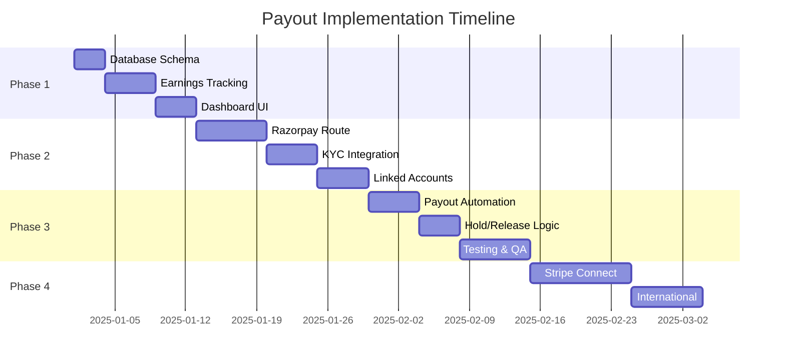

# Payout Implementation Plan

## Overview

This document outlines the technical implementation plan for adding payout functionality to Familiarise. Currently, payments are collected but there is no automated payout system to consultants.

**Current State (December 2025):**

- Payment collection: Working (Stripe/Razorpay)
- Payout system: NOT IMPLEMENTED
- Money flow: Held in platform account

---

## Implementation Phases



---

## Phase 1: Database Schema & Earnings Tracking

### 1.1 New Prisma Models

Add to `prisma/schema.prisma`:

```prisma
// ============================================
// PAYOUT SYSTEM MODELS
// ============================================

/// Tracks consultant earnings from completed transactions
model ConsultantEarnings {
  id                  String               @id @default(uuid())

  // Linked to consultant
  consultantProfile   ConsultantProfile    @relation(fields: [consultantProfileId], references: [id], onDelete: Cascade)
  consultantProfileId String

  // Linked to payment
  payment             Payment              @relation(fields: [paymentId], references: [id], onDelete: Cascade)
  paymentId           String               @unique

  // Amounts (in smallest currency unit, e.g., paise)
  grossAmount         Int                  // Total payment amount
  gatewayFee          Int                  // Payment gateway fee deducted
  platformFee         Int                  // Platform commission
  netAmount           Int                  // Amount owed to consultant
  currency            String               @default("INR")

  // Status tracking
  status              EarningStatus        @default(PENDING)
  holdUntil           DateTime?            // For dispute protection

  // Payout tracking
  payout              Payout?              @relation(fields: [payoutId], references: [id])
  payoutId            String?

  createdAt           DateTime             @default(now())
  updatedAt           DateTime             @updatedAt

  @@index([consultantProfileId, status])
  @@index([payoutId])
  @@index([holdUntil])
}

enum EarningStatus {
  PENDING          // Payment received, in hold period
  AVAILABLE        // Ready for payout
  PROCESSING       // Included in a payout batch
  PAID             // Successfully paid out
  DISPUTED         // Under dispute
  REFUNDED         // Refunded to consultee
}

/// Payout request/batch to consultant
model Payout {
  id                  String               @id @default(uuid())

  // Linked to consultant
  consultantProfile   ConsultantProfile    @relation(fields: [consultantProfileId], references: [id], onDelete: Cascade)
  consultantProfileId String

  // Amounts
  amount              Int                  // Total payout amount
  currency            String               @default("INR")

  // Gateway details
  gateway             PayoutGateway
  gatewayPayoutId     String?              @unique // External payout ID from gateway
  gatewayAccountId    String?              // Linked/Connected account ID

  // Status
  status              PayoutStatus         @default(PENDING)
  failureReason       String?

  // Timing
  requestedAt         DateTime             @default(now())
  processedAt         DateTime?
  settledAt           DateTime?            // When funds hit bank

  // Related earnings
  earnings            ConsultantEarnings[]

  createdAt           DateTime             @default(now())
  updatedAt           DateTime             @updatedAt

  @@index([consultantProfileId, status])
  @@index([gateway, gatewayPayoutId])
}

enum PayoutGateway {
  RAZORPAY_ROUTE
  STRIPE_CONNECT
  BANK_TRANSFER    // Manual/fallback
}

enum PayoutStatus {
  PENDING          // Requested but not processed
  PROCESSING       // Being processed by gateway
  SUCCEEDED        // Successfully transferred
  FAILED           // Transfer failed
  CANCELLED        // Cancelled before processing
  REVERSED         // Reversed after success
}

/// KYC and bank details for payouts (via Razorpay/Stripe, not stored locally)
model LinkedAccount {
  id                  String               @id @default(uuid())

  // Linked to consultant
  consultantProfile   ConsultantProfile    @relation(fields: [consultantProfileId], references: [id], onDelete: Cascade)
  consultantProfileId String               @unique

  // Gateway account IDs (we don't store actual bank details)
  razorpayAccountId   String?              @unique // acc_xxxxx
  stripeAccountId     String?              @unique // acct_xxxxx

  // Status
  razorpayKycStatus   KycStatus?
  stripeKycStatus     KycStatus?
  isActive            Boolean              @default(false)

  // Metadata
  displayName         String?              // Masked for display "HDFC ****1234"
  lastPayoutAt        DateTime?

  createdAt           DateTime             @default(now())
  updatedAt           DateTime             @updatedAt

  @@index([razorpayAccountId])
  @@index([stripeAccountId])
}

enum KycStatus {
  NOT_STARTED
  PENDING
  UNDER_REVIEW
  VERIFIED
  REJECTED
  NEEDS_ATTENTION
}
```

### 1.2 Update Existing Models

```prisma
// Add to ConsultantProfile model
model ConsultantProfile {
  // ... existing fields ...

  // Payout relations
  earnings       ConsultantEarnings[]
  payouts        Payout[]
  linkedAccount  LinkedAccount?

  // Cached balance (updated via triggers/jobs)
  availableBalance Int @default(0)
  pendingBalance   Int @default(0)
}

// Add to Payment model
model Payment {
  // ... existing fields ...

  // Earnings relation
  earnings ConsultantEarnings?
}
```

### 1.3 Migration SQL

```sql
-- Migration: add_payout_system
-- Generated: 2025-01-XX

-- Create earnings tracking table
CREATE TABLE "ConsultantEarnings" (
    "id" TEXT NOT NULL,
    "consultantProfileId" TEXT NOT NULL,
    "paymentId" TEXT NOT NULL,
    "grossAmount" INTEGER NOT NULL,
    "gatewayFee" INTEGER NOT NULL,
    "platformFee" INTEGER NOT NULL,
    "netAmount" INTEGER NOT NULL,
    "currency" TEXT NOT NULL DEFAULT 'INR',
    "status" TEXT NOT NULL DEFAULT 'PENDING',
    "holdUntil" TIMESTAMP(3),
    "payoutId" TEXT,
    "createdAt" TIMESTAMP(3) NOT NULL DEFAULT CURRENT_TIMESTAMP,
    "updatedAt" TIMESTAMP(3) NOT NULL,
    CONSTRAINT "ConsultantEarnings_pkey" PRIMARY KEY ("id")
);

-- Create payouts table
CREATE TABLE "Payout" (
    "id" TEXT NOT NULL,
    "consultantProfileId" TEXT NOT NULL,
    "amount" INTEGER NOT NULL,
    "currency" TEXT NOT NULL DEFAULT 'INR',
    "gateway" TEXT NOT NULL,
    "gatewayPayoutId" TEXT,
    "gatewayAccountId" TEXT,
    "status" TEXT NOT NULL DEFAULT 'PENDING',
    "failureReason" TEXT,
    "requestedAt" TIMESTAMP(3) NOT NULL DEFAULT CURRENT_TIMESTAMP,
    "processedAt" TIMESTAMP(3),
    "settledAt" TIMESTAMP(3),
    "createdAt" TIMESTAMP(3) NOT NULL DEFAULT CURRENT_TIMESTAMP,
    "updatedAt" TIMESTAMP(3) NOT NULL,
    CONSTRAINT "Payout_pkey" PRIMARY KEY ("id")
);

-- Create linked accounts table
CREATE TABLE "LinkedAccount" (
    "id" TEXT NOT NULL,
    "consultantProfileId" TEXT NOT NULL,
    "razorpayAccountId" TEXT,
    "stripeAccountId" TEXT,
    "razorpayKycStatus" TEXT,
    "stripeKycStatus" TEXT,
    "isActive" BOOLEAN NOT NULL DEFAULT false,
    "displayName" TEXT,
    "lastPayoutAt" TIMESTAMP(3),
    "createdAt" TIMESTAMP(3) NOT NULL DEFAULT CURRENT_TIMESTAMP,
    "updatedAt" TIMESTAMP(3) NOT NULL,
    CONSTRAINT "LinkedAccount_pkey" PRIMARY KEY ("id")
);

-- Add balance columns to ConsultantProfile
ALTER TABLE "ConsultantProfile" ADD COLUMN "availableBalance" INTEGER NOT NULL DEFAULT 0;
ALTER TABLE "ConsultantProfile" ADD COLUMN "pendingBalance" INTEGER NOT NULL DEFAULT 0;

-- Create indexes
CREATE UNIQUE INDEX "ConsultantEarnings_paymentId_key" ON "ConsultantEarnings"("paymentId");
CREATE INDEX "ConsultantEarnings_consultantProfileId_status_idx" ON "ConsultantEarnings"("consultantProfileId", "status");
CREATE INDEX "ConsultantEarnings_payoutId_idx" ON "ConsultantEarnings"("payoutId");
CREATE INDEX "ConsultantEarnings_holdUntil_idx" ON "ConsultantEarnings"("holdUntil");

CREATE UNIQUE INDEX "Payout_gatewayPayoutId_key" ON "Payout"("gatewayPayoutId");
CREATE INDEX "Payout_consultantProfileId_status_idx" ON "Payout"("consultantProfileId", "status");
CREATE INDEX "Payout_gateway_gatewayPayoutId_idx" ON "Payout"("gateway", "gatewayPayoutId");

CREATE UNIQUE INDEX "LinkedAccount_consultantProfileId_key" ON "LinkedAccount"("consultantProfileId");
CREATE UNIQUE INDEX "LinkedAccount_razorpayAccountId_key" ON "LinkedAccount"("razorpayAccountId");
CREATE UNIQUE INDEX "LinkedAccount_stripeAccountId_key" ON "LinkedAccount"("stripeAccountId");

-- Add foreign keys
ALTER TABLE "ConsultantEarnings" ADD CONSTRAINT "ConsultantEarnings_consultantProfileId_fkey" FOREIGN KEY ("consultantProfileId") REFERENCES "ConsultantProfile"("id") ON DELETE CASCADE ON UPDATE CASCADE;
ALTER TABLE "ConsultantEarnings" ADD CONSTRAINT "ConsultantEarnings_paymentId_fkey" FOREIGN KEY ("paymentId") REFERENCES "Payment"("id") ON DELETE CASCADE ON UPDATE CASCADE;
ALTER TABLE "ConsultantEarnings" ADD CONSTRAINT "ConsultantEarnings_payoutId_fkey" FOREIGN KEY ("payoutId") REFERENCES "Payout"("id") ON DELETE SET NULL ON UPDATE CASCADE;

ALTER TABLE "Payout" ADD CONSTRAINT "Payout_consultantProfileId_fkey" FOREIGN KEY ("consultantProfileId") REFERENCES "ConsultantProfile"("id") ON DELETE CASCADE ON UPDATE CASCADE;

ALTER TABLE "LinkedAccount" ADD CONSTRAINT "LinkedAccount_consultantProfileId_fkey" FOREIGN KEY ("consultantProfileId") REFERENCES "ConsultantProfile"("id") ON DELETE CASCADE ON UPDATE CASCADE;
```

---

## Phase 2: Razorpay Route Integration

### 2.1 File Structure

```
lib/
├── payments/
│   ├── payouts/
│   │   ├── index.ts                    # Export all payout functions
│   │   ├── earnings-service.ts         # Create/manage earnings records
│   │   ├── payout-service.ts           # Process payouts
│   │   ├── balance-service.ts          # Balance calculations
│   │   └── razorpay/
│   │       ├── linked-accounts.ts      # Create/manage Razorpay linked accounts
│   │       ├── transfers.ts            # Process transfers via Route
│   │       └── webhooks.ts             # Handle Razorpay payout webhooks
│   └── webhooks/
│       └── handlers.ts                 # Add earnings creation on payment success
```

### 2.2 Earnings Service

```typescript
// lib/payments/payouts/earnings-service.ts

import { prisma } from "@/lib/prisma";
import { Payment, EarningStatus } from "@prisma/client";

interface CreateEarningsParams {
  payment: Payment;
  consultantProfileId: string;
  platformCommissionRate: number; // e.g., 0.20 for 20%
  gatewayFeeRate: number; // e.g., 0.03 for 3%
}

export async function createEarningsRecord({
  payment,
  consultantProfileId,
  platformCommissionRate,
  gatewayFeeRate,
}: CreateEarningsParams) {
  const grossAmount = payment.amount;
  const gatewayFee = Math.round(grossAmount * gatewayFeeRate);
  const netAfterGateway = grossAmount - gatewayFee;
  const platformFee = Math.round(netAfterGateway * platformCommissionRate);
  const netAmount = netAfterGateway - platformFee;

  // Calculate hold period (24 hours for consultations, 7 days for subscriptions)
  const holdPeriodHours = getHoldPeriod(payment.appointmentId);
  const holdUntil = new Date(Date.now() + holdPeriodHours * 60 * 60 * 1000);

  const earnings = await prisma.consultantEarnings.create({
    data: {
      consultantProfileId,
      paymentId: payment.id,
      grossAmount,
      gatewayFee,
      platformFee,
      netAmount,
      currency: payment.currency,
      status: EarningStatus.PENDING,
      holdUntil,
    },
  });

  // Update pending balance
  await prisma.consultantProfile.update({
    where: { id: consultantProfileId },
    data: {
      pendingBalance: { increment: netAmount },
    },
  });

  return earnings;
}

function getHoldPeriod(appointmentId: string | null): number {
  // Default 24 hours, can be customized per appointment type
  return 24;
}
```

### 2.3 Linked Account Service

```typescript
// lib/payments/payouts/razorpay/linked-accounts.ts

import Razorpay from "razorpay";
import { prisma } from "@/lib/prisma";
import { KycStatus } from "@prisma/client";

const razorpay = new Razorpay({
  key_id: process.env.RAZORPAY_KEY_ID!,
  key_secret: process.env.RAZORPAY_KEY_SECRET!,
});

interface CreateLinkedAccountParams {
  consultantProfileId: string;
  email: string;
  phone: string;
  legalName: string;
  businessType: "individual" | "registered_business";
  pan: string;
  gst?: string;
  bankAccount: {
    accountNumber: string;
    ifscCode: string;
    beneficiaryName: string;
    accountType: "savings" | "current";
  };
  address: {
    street: string;
    city: string;
    state: string;
    postalCode: number;
  };
}

export async function createRazorpayLinkedAccount(
  params: CreateLinkedAccountParams,
) {
  const account = await razorpay.accounts.create({
    email: params.email,
    phone: params.phone,
    legal_business_name: params.legalName,
    business_type: params.businessType,
    contact_name: params.legalName,
    profile: {
      category: "education",
      subcategory: "tutoring_services",
      addresses: {
        registered: {
          street1: params.address.street,
          city: params.address.city,
          state: params.address.state,
          postal_code: params.address.postalCode,
          country: "IN",
        },
      },
    },
    legal_info: {
      pan: params.pan,
      gst: params.gst,
    },
    bank_account: {
      beneficiary_name: params.bankAccount.beneficiaryName,
      account_number: params.bankAccount.accountNumber,
      account_type: params.bankAccount.accountType,
      ifsc_code: params.bankAccount.ifscCode,
    },
  });

  // Store in database
  const linkedAccount = await prisma.linkedAccount.upsert({
    where: { consultantProfileId: params.consultantProfileId },
    update: {
      razorpayAccountId: account.id,
      razorpayKycStatus: mapKycStatus(account.status),
      displayName: maskBankAccount(params.bankAccount.accountNumber),
      isActive: account.status === "activated",
    },
    create: {
      consultantProfileId: params.consultantProfileId,
      razorpayAccountId: account.id,
      razorpayKycStatus: mapKycStatus(account.status),
      displayName: maskBankAccount(params.bankAccount.accountNumber),
      isActive: account.status === "activated",
    },
  });

  return linkedAccount;
}

function mapKycStatus(razorpayStatus: string): KycStatus {
  const statusMap: Record<string, KycStatus> = {
    created: KycStatus.PENDING,
    activated: KycStatus.VERIFIED,
    suspended: KycStatus.NEEDS_ATTENTION,
    rejected: KycStatus.REJECTED,
  };
  return statusMap[razorpayStatus] || KycStatus.PENDING;
}

function maskBankAccount(accountNumber: string): string {
  return `****${accountNumber.slice(-4)}`;
}
```

### 2.4 Transfer Service

```typescript
// lib/payments/payouts/razorpay/transfers.ts

import Razorpay from "razorpay";
import { prisma } from "@/lib/prisma";
import { PayoutStatus, PayoutGateway, EarningStatus } from "@prisma/client";

const razorpay = new Razorpay({
  key_id: process.env.RAZORPAY_KEY_ID!,
  key_secret: process.env.RAZORPAY_KEY_SECRET!,
});

interface ProcessPayoutParams {
  consultantProfileId: string;
  earningIds: string[];
}

export async function processRazorpayPayout({
  consultantProfileId,
  earningIds,
}: ProcessPayoutParams) {
  // Get linked account
  const linkedAccount = await prisma.linkedAccount.findUnique({
    where: { consultantProfileId },
  });

  if (!linkedAccount?.razorpayAccountId || !linkedAccount.isActive) {
    throw new Error("No active Razorpay linked account found");
  }

  // Get earnings to payout
  const earnings = await prisma.consultantEarnings.findMany({
    where: {
      id: { in: earningIds },
      consultantProfileId,
      status: EarningStatus.AVAILABLE,
    },
  });

  if (earnings.length === 0) {
    throw new Error("No available earnings to payout");
  }

  const totalAmount = earnings.reduce((sum, e) => sum + e.netAmount, 0);

  // Create payout record
  const payout = await prisma.payout.create({
    data: {
      consultantProfileId,
      amount: totalAmount,
      currency: "INR",
      gateway: PayoutGateway.RAZORPAY_ROUTE,
      gatewayAccountId: linkedAccount.razorpayAccountId,
      status: PayoutStatus.PROCESSING,
    },
  });

  try {
    // Execute transfer via Razorpay Route
    const transfer = await razorpay.transfers.create({
      account: linkedAccount.razorpayAccountId,
      amount: totalAmount,
      currency: "INR",
      notes: {
        payout_id: payout.id,
        consultant_id: consultantProfileId,
      },
    });

    // Update payout with gateway ID
    await prisma.$transaction([
      prisma.payout.update({
        where: { id: payout.id },
        data: {
          gatewayPayoutId: transfer.id,
          processedAt: new Date(),
        },
      }),
      prisma.consultantEarnings.updateMany({
        where: { id: { in: earningIds } },
        data: {
          status: EarningStatus.PROCESSING,
          payoutId: payout.id,
        },
      }),
      prisma.consultantProfile.update({
        where: { id: consultantProfileId },
        data: {
          availableBalance: { decrement: totalAmount },
        },
      }),
    ]);

    return { payout, transfer };
  } catch (error) {
    // Mark payout as failed
    await prisma.payout.update({
      where: { id: payout.id },
      data: {
        status: PayoutStatus.FAILED,
        failureReason: error instanceof Error ? error.message : "Unknown error",
      },
    });
    throw error;
  }
}
```

### 2.5 Webhook Handler for Payouts

```typescript
// lib/payments/payouts/razorpay/webhooks.ts

import { prisma } from "@/lib/prisma";
import { PayoutStatus, EarningStatus } from "@prisma/client";

interface RazorpayTransferEvent {
  event: string;
  payload: {
    transfer: {
      entity: {
        id: string;
        status: string;
        settlement_status?: string;
        settled_at?: number;
        failure_reason?: string;
      };
    };
  };
}

export async function handleRazorpayPayoutWebhook(
  event: RazorpayTransferEvent,
) {
  const transfer = event.payload.transfer.entity;

  const payout = await prisma.payout.findUnique({
    where: { gatewayPayoutId: transfer.id },
    include: { earnings: true },
  });

  if (!payout) {
    console.warn(`Payout not found for transfer: ${transfer.id}`);
    return;
  }

  switch (event.event) {
    case "transfer.processed":
      await prisma.$transaction([
        prisma.payout.update({
          where: { id: payout.id },
          data: { status: PayoutStatus.SUCCEEDED },
        }),
        prisma.consultantEarnings.updateMany({
          where: { payoutId: payout.id },
          data: { status: EarningStatus.PAID },
        }),
        prisma.linkedAccount.update({
          where: { consultantProfileId: payout.consultantProfileId },
          data: { lastPayoutAt: new Date() },
        }),
      ]);
      break;

    case "transfer.settled":
      await prisma.payout.update({
        where: { id: payout.id },
        data: {
          settledAt: transfer.settled_at
            ? new Date(transfer.settled_at * 1000)
            : new Date(),
        },
      });
      break;

    case "transfer.failed":
      const refundAmount = payout.amount;
      await prisma.$transaction([
        prisma.payout.update({
          where: { id: payout.id },
          data: {
            status: PayoutStatus.FAILED,
            failureReason: transfer.failure_reason || "Transfer failed",
          },
        }),
        prisma.consultantEarnings.updateMany({
          where: { payoutId: payout.id },
          data: {
            status: EarningStatus.AVAILABLE,
            payoutId: null,
          },
        }),
        prisma.consultantProfile.update({
          where: { id: payout.consultantProfileId },
          data: { availableBalance: { increment: refundAmount } },
        }),
      ]);
      break;

    case "transfer.reversed":
      await prisma.$transaction([
        prisma.payout.update({
          where: { id: payout.id },
          data: { status: PayoutStatus.REVERSED },
        }),
        prisma.consultantEarnings.updateMany({
          where: { payoutId: payout.id },
          data: {
            status: EarningStatus.AVAILABLE,
            payoutId: null,
          },
        }),
        prisma.consultantProfile.update({
          where: { id: payout.consultantProfileId },
          data: { availableBalance: { increment: payout.amount } },
        }),
      ]);
      break;
  }
}
```

---

## Phase 3: Automated Jobs

### 3.1 Release Hold Job

```typescript
// jobs/release-earnings-hold.ts

import { prisma } from "@/lib/prisma";
import { EarningStatus } from "@prisma/client";

/**
 * Runs every 15 minutes via GitHub Actions
 * Releases earnings from hold when holdUntil has passed
 */
export async function releaseEarningsFromHold() {
  const now = new Date();

  const result = await prisma.$transaction(async (tx) => {
    // Find earnings ready to release
    const earningsToRelease = await tx.consultantEarnings.findMany({
      where: {
        status: EarningStatus.PENDING,
        holdUntil: { lte: now },
      },
      include: {
        consultantProfile: true,
      },
    });

    // Group by consultant for balance updates
    const consultantBalances = new Map<string, number>();

    for (const earning of earningsToRelease) {
      const current = consultantBalances.get(earning.consultantProfileId) || 0;
      consultantBalances.set(
        earning.consultantProfileId,
        current + earning.netAmount,
      );
    }

    // Update earnings status
    await tx.consultantEarnings.updateMany({
      where: {
        id: { in: earningsToRelease.map((e) => e.id) },
      },
      data: {
        status: EarningStatus.AVAILABLE,
      },
    });

    // Update consultant balances
    for (const [profileId, amount] of consultantBalances) {
      await tx.consultantProfile.update({
        where: { id: profileId },
        data: {
          pendingBalance: { decrement: amount },
          availableBalance: { increment: amount },
        },
      });
    }

    return earningsToRelease.length;
  });

  console.log(`Released ${result} earnings from hold`);
  return result;
}
```

### 3.2 Auto-Payout Job (Weekly)

```typescript
// jobs/process-weekly-payouts.ts

import { prisma } from "@/lib/prisma";
import { EarningStatus, PayoutStatus } from "@prisma/client";
import { processRazorpayPayout } from "@/lib/payments/payouts/razorpay/transfers";

const MINIMUM_PAYOUT_AMOUNT = 50000; // ₹500 in paise

/**
 * Runs every Monday at 11 PM via GitHub Actions
 * Processes weekly payouts for eligible consultants
 */
export async function processWeeklyPayouts() {
  // Find consultants with available balance >= minimum
  const eligibleConsultants = await prisma.consultantProfile.findMany({
    where: {
      availableBalance: { gte: MINIMUM_PAYOUT_AMOUNT },
      linkedAccount: {
        isActive: true,
        razorpayAccountId: { not: null },
      },
    },
    include: {
      linkedAccount: true,
      earnings: {
        where: { status: EarningStatus.AVAILABLE },
      },
    },
  });

  const results = {
    processed: 0,
    failed: 0,
    errors: [] as string[],
  };

  for (const consultant of eligibleConsultants) {
    try {
      const earningIds = consultant.earnings.map((e) => e.id);

      await processRazorpayPayout({
        consultantProfileId: consultant.id,
        earningIds,
      });

      results.processed++;
      console.log(`✅ Processed payout for consultant: ${consultant.id}`);
    } catch (error) {
      results.failed++;
      const message = error instanceof Error ? error.message : "Unknown error";
      results.errors.push(`${consultant.id}: ${message}`);
      console.error(`❌ Failed payout for ${consultant.id}:`, message);
    }
  }

  console.log(
    `Weekly payouts complete: ${results.processed} processed, ${results.failed} failed`,
  );
  return results;
}
```

### 3.3 GitHub Actions Workflow

```yaml
# .github/workflows/payouts.yml

name: Payout Jobs

on:
  schedule:
    - cron: "0 */1 * * *" # Every hour: release holds
    - cron: "30 17 * * 1" # Monday 11 PM IST: weekly payouts
  workflow_dispatch:
    inputs:
      job:
        description: "Job to run"
        required: true
        type: choice
        options:
          - release-holds
          - weekly-payouts

jobs:
  release-holds:
    if: github.event_name == 'schedule' && github.event.schedule == '0 */1 * * *' || github.event.inputs.job == 'release-holds'
    runs-on: ubuntu-latest
    steps:
      - uses: actions/checkout@v4
      - uses: actions/setup-node@v4
        with:
          node-version: "20"
      - run: npm ci
      - run: npx tsx jobs/release-earnings-hold.ts
        env:
          DATABASE_URL: ${{ secrets.DATABASE_URL }}

  weekly-payouts:
    if: github.event_name == 'schedule' && github.event.schedule == '30 17 * * 1' || github.event.inputs.job == 'weekly-payouts'
    runs-on: ubuntu-latest
    steps:
      - uses: actions/checkout@v4
      - uses: actions/setup-node@v4
        with:
          node-version: "20"
      - run: npm ci
      - run: npx tsx jobs/process-weekly-payouts.ts
        env:
          DATABASE_URL: ${{ secrets.DATABASE_URL }}
          RAZORPAY_KEY_ID: ${{ secrets.RAZORPAY_KEY_ID }}
          RAZORPAY_KEY_SECRET: ${{ secrets.RAZORPAY_KEY_SECRET }}
```

---

## Phase 4: Stripe Connect (International)

### 4.1 Stripe Account Creation

```typescript
// lib/payments/payouts/stripe/connected-accounts.ts

import Stripe from "stripe";
import { prisma } from "@/lib/prisma";
import { KycStatus } from "@prisma/client";

const stripe = new Stripe(process.env.STRIPE_SECRET_KEY!);

export async function createStripeConnectedAccount(
  consultantProfileId: string,
  email: string,
  country: string,
) {
  const account = await stripe.accounts.create({
    type: "express",
    country,
    email,
    capabilities: {
      card_payments: { requested: true },
      transfers: { requested: true },
    },
  });

  await prisma.linkedAccount.upsert({
    where: { consultantProfileId },
    update: {
      stripeAccountId: account.id,
      stripeKycStatus: KycStatus.PENDING,
    },
    create: {
      consultantProfileId,
      stripeAccountId: account.id,
      stripeKycStatus: KycStatus.PENDING,
    },
  });

  return account;
}

export async function getStripeOnboardingLink(
  accountId: string,
  refreshUrl: string,
  returnUrl: string,
) {
  const accountLink = await stripe.accountLinks.create({
    account: accountId,
    refresh_url: refreshUrl,
    return_url: returnUrl,
    type: "account_onboarding",
  });

  return accountLink.url;
}
```

---

## Implementation Checklist

### Phase 1: Database & Core

- [ ] Add Prisma models (ConsultantEarnings, Payout, LinkedAccount)
- [ ] Run migration
- [ ] Implement earnings-service.ts
- [ ] Implement balance-service.ts
- [ ] Add earnings creation to payment webhook handler
- [ ] Create consultant earnings dashboard UI

### Phase 2: Razorpay Route

- [ ] Set up Razorpay Route in Razorpay dashboard
- [ ] Implement linked-accounts.ts
- [ ] Create KYC collection UI
- [ ] Implement transfers.ts
- [ ] Add payout webhook handler
- [ ] Test with sandbox accounts

### Phase 3: Automation

- [ ] Implement release-earnings-hold.ts job
- [ ] Implement process-weekly-payouts.ts job
- [ ] Create GitHub Actions workflow
- [ ] Add monitoring/alerting
- [ ] Create admin payout dashboard

### Phase 4: International

- [ ] Set up Stripe Atlas or US entity
- [ ] Implement Stripe Connect integration
- [ ] Add currency conversion handling
- [ ] Test international payouts
- [ ] Update tax documentation

---

## Testing Checklist

### Unit Tests

- [ ] Earnings calculation accuracy
- [ ] Balance update atomicity
- [ ] Hold period calculations
- [ ] KYC status mapping

### Integration Tests

- [ ] Razorpay sandbox linked account creation
- [ ] Razorpay sandbox transfer execution
- [ ] Webhook signature verification
- [ ] End-to-end payout flow

### Load Testing

- [ ] 100 concurrent payouts
- [ ] Large batch processing
- [ ] Database connection pooling

---

## Related Documents

- [02-payout-architecture.md](./02-payout-architecture.md) - Architecture details
- [03-international-payments.md](./03-international-payments.md) - Cross-border handling
- [04-revenue-distribution.md](./04-revenue-distribution.md) - Commission calculations
