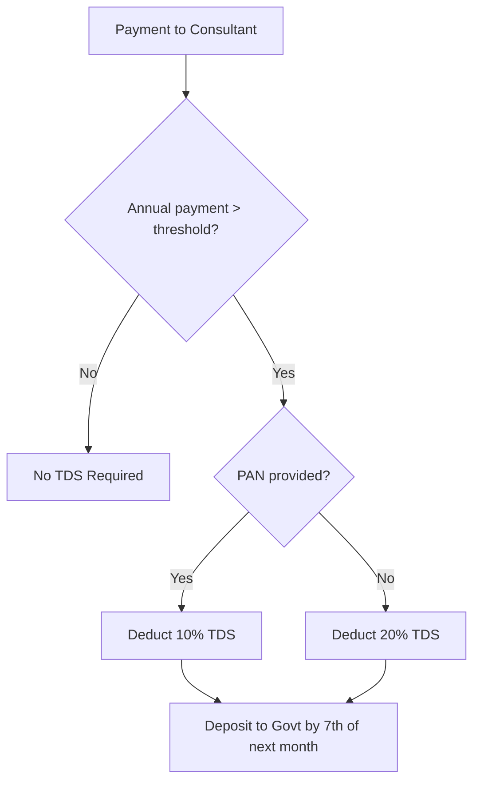

# Tax Compliance Guide - India

## Overview

This document covers tax obligations for Familiarise as an Indian marketplace platform. It includes GST, TDS, and other regulatory requirements.

**Disclaimer**: This is a reference guide. Consult a qualified CA/tax professional for specific advice.

---

## How Tax Collection Works (The Basics)

Before diving into rates and compliance, understand how tax actually flows through your business.

### Money Flow

```
Customer pays: ₹1,180 (₹1,000 service + ₹180 GST)
        ↓
Payment Gateway (Razorpay/Stripe) - deducts ~2% fee
        ↓
Your Bank Account - receives ~₹1,156 (full amount minus gateway fee)
        ↓
You file GST returns monthly/quarterly
        ↓
You remit ₹180 GST to government (minus any Input Tax Credit)
```

### Key Concept: You Are a Tax Collector

| What Happens | Who Does It |
|--------------|-------------|
| Customer pays service + tax | Customer |
| Full amount lands in your bank | Payment gateway |
| Tax portion sits in your account | You (temporarily) |
| File returns, calculate net tax | You |
| Remit collected tax to government | You |

**Important**: Payment gateways do NOT automatically split or remit tax. They transfer the full amount to you. You are responsible for:
1. Tracking how much tax you collected
2. Filing accurate returns
3. Paying the government what you owe

### Input Tax Credit (ITC)

You don't always pay the full GST you collected. You can deduct GST you paid on business expenses:

```
GST Collected from customers:     ₹18,000
GST Paid on expenses:             ₹5,000 (hosting, software, etc.)
────────────────────────────────────────
Net GST owed to government:       ₹13,000
```

This is called Input Tax Credit (ITC) - it prevents tax cascading.

### What This Means for Your Code

The `math.ts` checkout utilities calculate tax for **display and invoicing purposes**. The actual tax compliance happens outside the codebase through:
- Accounting software (Zoho Books, Tally, etc.)
- CA/tax professional filing returns
- Manual or automated bank transfers to government

---

## GST (Goods & Services Tax)

### Platform Registration

| Requirement          | Threshold            | Notes                                         |
| -------------------- | -------------------- | --------------------------------------------- |
| GST Registration     | Turnover > ₹20 lakhs | Mandatory for service providers               |
| Inter-state supplies | Any amount           | Registration required regardless of threshold |
| E-commerce operator  | Any amount           | Special provisions apply                      |

**Source**: [ClearTax GST Guide](https://cleartax.in/s/gst-rates)

### Applicable GST Rates

| Service Type             | GST Rate | SAC Code                          |
| ------------------------ | -------- | --------------------------------- |
| Platform fees/Commission | 18%      | 998313 (Online content)           |
| IT-enabled services      | 18%      | 998314                            |
| Educational services     | 18%      | 999293 (except exempt categories) |
| Payment gateway services | 18%      | 997159                            |

### GST 2.0 Changes (September 2025)

The 56th GST Council meeting introduced a simplified two-rate framework:

| Old Structure         | New Structure (GST 2.0)       |
| --------------------- | ----------------------------- |
| 0%, 5%, 12%, 18%, 28% | 5% (no ITC) or 18% (with ITC) |

**Impact**: Most platform services remain at 18% with Input Tax Credit (ITC) available.

### E-commerce TCS (Tax Collected at Source)

| Provision                    | Rate                 | Notes                       |
| ---------------------------- | -------------------- | --------------------------- |
| TCS on supplies via platform | 0.5%                 | Reduced from 1% (July 2024) |
| Applies to                   | Intra-state supplies | Interstate = IGST           |

**When TCS applies**: When e-commerce operator collects payment on behalf of suppliers (consultants).

---

## TDS (Tax Deducted at Source)

### Section 194J - Professional Services

**Applies to**: Payments to consultants for professional/technical services

| Parameter           | FY 2024-25   | FY 2025-26   |
| ------------------- | ------------ | ------------ |
| Threshold           | ₹30,000/year | ₹50,000/year |
| Rate (Professional) | 10%          | 10%          |
| Rate (Technical)    | 2%           | 2%           |
| No PAN rate         | 20%          | 20%          |

**Source**: [ClearTax Section 194J](https://cleartax.in/s/section-194j)

### When to Deduct TDS



### TDS Compliance Calendar

| Due Date          | Action         | Form        |
| ----------------- | -------------- | ----------- |
| 7th of each month | TDS deposit    | Challan 281 |
| 31st July         | Q1 return      | 26Q         |
| 31st October      | Q2 return      | 26Q         |
| 31st January      | Q3 return      | 26Q         |
| 31st May          | Q4 return      | 26Q         |
| 15th June         | Form 16A issue | 16A         |

### TDS Calculation Example

```
Consultant Annual Earnings: ₹1,00,000
TDS Threshold (FY 2025-26): ₹50,000

Since ₹1,00,000 > ₹50,000:
TDS @ 10% = ₹10,000

Consultant receives: ₹90,000
Platform deposits: ₹10,000 to government
```

### Section 194C vs 194J

| Section        | 194C (Contractors)          | 194J (Professionals)  |
| -------------- | --------------------------- | --------------------- |
| Applies to     | Physical work contracts     | Professional services |
| Rate (Ind/HUF) | 1%                          | 10%                   |
| Rate (Others)  | 2%                          | 10%                   |
| Threshold      | ₹30K single / ₹1L aggregate | ₹30K → ₹50K           |

**For Familiarise**: Use Section 194J for consultant payments (professional services)

---

## Platform Tax Obligations

### As an Aggregator/Marketplace

| Obligation         | Requirement                                  |
| ------------------ | -------------------------------------------- |
| GST Registration   | Mandatory                                    |
| TCS Collection     | If collecting payment on behalf of suppliers |
| TDS Deduction      | On payments to consultants above threshold   |
| Invoice Generation | For platform fees charged                    |

### Invoice Requirements

**For Platform Commission (charged to consultants):**

```
Invoice to Consultant:
- Platform Name, GSTIN
- Consultant Name, GSTIN (if registered)
- SAC Code: 998313
- Commission Amount
- GST @ 18% (CGST 9% + SGST 9% or IGST 18%)
- Total Amount
```

### Record Keeping

| Document        | Retention Period |
| --------------- | ---------------- |
| Invoices        | 8 years          |
| TDS records     | 8 years          |
| GST returns     | 8 years          |
| Payment records | 8 years          |

---

## Consultant Tax Implications

### GST for Consultants

| Consultant Status    | GST Requirement            |
| -------------------- | -------------------------- |
| Turnover < ₹20 lakhs | Not required (can opt-in)  |
| Turnover > ₹20 lakhs | Mandatory GST registration |
| Inter-state services | Registration required      |

### Income Tax for Consultants

| Income Slab (Old Regime) | Tax Rate |
| ------------------------ | -------- |
| Up to ₹2.5 lakhs         | Nil      |
| ₹2.5 - 5 lakhs           | 5%       |
| ₹5 - 10 lakhs            | 20%      |
| Above ₹10 lakhs          | 30%      |

### TDS Credit

Consultants can claim TDS deducted by platform:

1. TDS reflects in Form 26AS
2. Claim credit while filing ITR
3. Excess TDS can be refunded

---

## Implementation in Codebase

### Track TDS-Applicable Payments

```typescript
// lib/tax/tds-tracker.ts

interface ConsultantPaymentTracker {
  consultantId: string;
  financialYear: string; // "2025-26"
  totalPayments: number;
  tdsDeducted: number;
  tdsThreshold: number; // 50000 for FY 2025-26
}

function shouldDeductTDS(
  totalPaidThisYear: number,
  thresholdFY: number = 50000,
): boolean {
  return totalPaidThisYear > thresholdFY;
}

function calculateTDS(
  amount: number,
  hasPAN: boolean,
  isFirstPaymentAboveThreshold: boolean,
  totalPaidThisYear: number,
  threshold: number,
): number {
  if (totalPaidThisYear <= threshold) return 0;

  const rate = hasPAN ? 0.1 : 0.2; // 10% or 20%

  if (isFirstPaymentAboveThreshold) {
    // Deduct TDS on entire amount above threshold
    return Math.round((totalPaidThisYear - threshold) * rate);
  }

  // Deduct TDS on current payment
  return Math.round(amount * rate);
}
```

### Database Schema Additions

```prisma
// Track TDS for compliance
model ConsultantTaxInfo {
  id                  String   @id @default(uuid())
  consultantProfileId String   @unique
  pan                 String?  // Masked: ABCDE****F
  panVerified         Boolean  @default(false)
  gstNumber           String?
  gstVerified         Boolean  @default(false)

  consultantProfile   ConsultantProfile @relation(fields: [consultantProfileId], references: [id])

  createdAt           DateTime @default(now())
  updatedAt           DateTime @updatedAt
}

model TDSRecord {
  id                  String   @id @default(uuid())
  consultantProfileId String
  financialYear       String   // "2025-26"
  quarter             Int      // 1, 2, 3, 4
  grossPayment        Int      // Total payment in quarter
  tdsAmount           Int      // TDS deducted
  tdsRate             Float    // 0.10 or 0.20
  depositedAt         DateTime?
  challanNumber       String?

  consultantProfile   ConsultantProfile @relation(fields: [consultantProfileId], references: [id])

  createdAt           DateTime @default(now())
  updatedAt           DateTime @updatedAt

  @@unique([consultantProfileId, financialYear, quarter])
}
```

---

## Compliance Checklist

### Monthly

- [ ] Deposit TDS by 7th of next month
- [ ] Track consultant payment totals
- [ ] Generate GST invoices

### Quarterly

- [ ] File TDS return (Form 26Q)
- [ ] File GSTR-1 (Outward supplies)
- [ ] File GSTR-3B (Summary return)
- [ ] Reconcile TDS deposits with records

### Annually

- [ ] Issue Form 16A to all consultants (by June 15)
- [ ] File annual GST return (GSTR-9)
- [ ] Reconcile all tax credits
- [ ] Audit if turnover > ₹2 crore

---

## Common Scenarios

### Scenario 1: New Consultant (No TDS)

```
Consultant joins mid-year
Total payments FY 2025-26: ₹40,000
Threshold: ₹50,000

Result: No TDS deduction required
```

### Scenario 2: Established Consultant (TDS Applies)

```
Consultant's 6th month payment
Previous payments: ₹48,000
Current payment: ₹12,000
Total: ₹60,000

TDS calculation:
- Threshold crossed: ₹60,000 > ₹50,000
- TDS on excess: (₹60,000 - ₹50,000) × 10% = ₹1,000
OR
- TDS on current: ₹12,000 × 10% = ₹1,200

Note: Once threshold crossed, TDS on all subsequent payments
```

### Scenario 3: Consultant Without PAN

```
Payment: ₹20,000
Threshold already crossed
PAN: Not provided

TDS @ 20% = ₹4,000 (higher rate)
```

---

## Important Thresholds Summary

| Tax Type         | Threshold              | Rate | Notes                  |
| ---------------- | ---------------------- | ---- | ---------------------- |
| GST Registration | ₹20 lakhs turnover     | 18%  | Services               |
| TDS 194J         | ₹50,000/year (FY25-26) | 10%  | Professional           |
| TCS E-commerce   | Any amount             | 0.5% | If collecting payments |
| Tax Audit        | ₹2 crore turnover      | -    | Mandatory audit        |

---

## Resources & Forms

| Purpose            | Form/Document |
| ------------------ | ------------- |
| TDS Payment        | Challan 281   |
| TDS Return         | Form 26Q      |
| TDS Certificate    | Form 16A      |
| GST Registration   | REG-01        |
| GST Monthly Return | GSTR-3B       |
| GST Annual Return  | GSTR-9        |

### Useful Links

- [Income Tax e-Filing](https://www.incometax.gov.in)
- [GST Portal](https://www.gst.gov.in)
- [TDS Rate Chart - ClearTax](https://cleartax.in/s/tds-rate-chart)
- [Section 194J Guide](https://cleartax.in/s/section-194j)
- [GST Rates 2025](https://cleartax.in/s/gst-rates)

---

## Related Documents

- [08-saas-expenditures.md](./08-saas-expenditures.md) - Cost structure
- [04-revenue-distribution.md](./04-revenue-distribution.md) - Revenue split
- [06-payout-implementation-plan.md](./06-payout-implementation-plan.md) - Payout system
