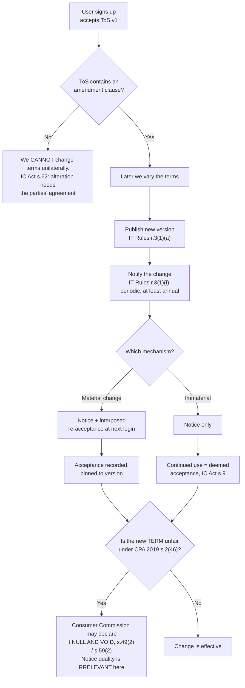
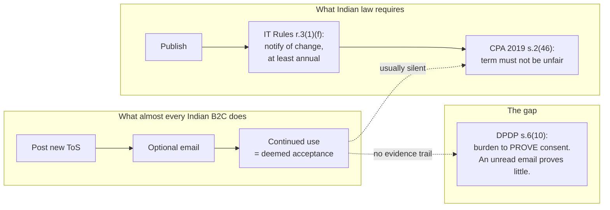
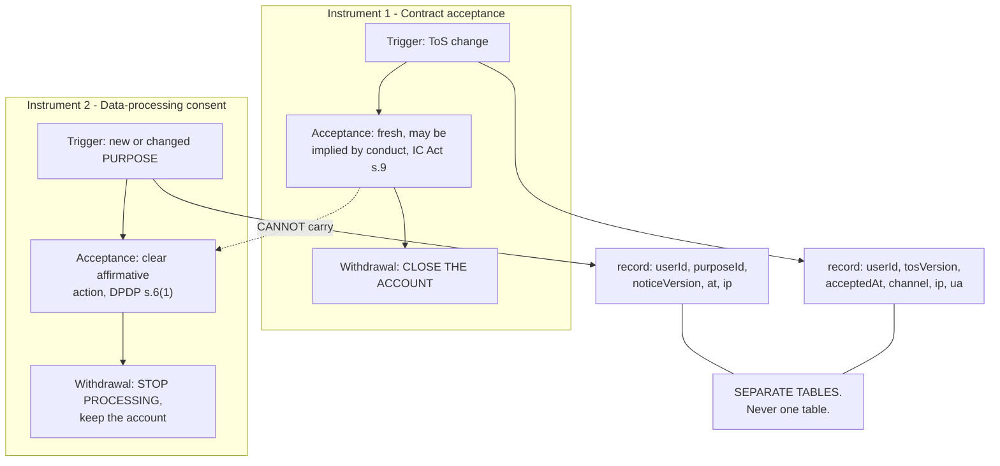

# 01 — Consent and terms-change landscape (India)

**Research date 2026-09-29.** Indian law as it stood then. Two corrections to
common framings appear first, because both propagate if you start from them
wrong.

## 1. Two corrections before anything else

**Indian Contract Act s.56 is the frustration provision** ("agreement to do an
impossible act"), not the consent-to-terms provision. The doctrine is **ss.7–10**
(acceptance), **s.13** (meeting of minds), **s.14** (free consent), and **s.62**
(alteration requires the agreement of the parties).

**"Silence does not constitute consent" is the wrong formulation of the Indian
rule.** The accurate and more useful one: under **s.9**, acceptance may be
**express or implied** — made "otherwise than in words". Conduct counts. Indian
law does not require words, and a user who keeps using the app has on the face
of s.9 assented to a change the ToS told them at sign-up they would be bound by.

**CPA 2019 "unfair contract term" is s.2(46)**, not s.2(47) (that is unfair
trade practice). Getting this wrong in a ToS recital is a small credibility risk.

## 2. The instrument: notice, not consent

Two things fall out of this diagram that are easy to miss:

1. **The load-bearing question is not the newsletter — it is whether the clause
   pre-dated the user's acceptance.** Add a clause now and you are making a
   material change requiring the full machinery.
2. **The CPA attack is on the _term_, not the _notice_.** Perfect notice does
   not save an unfair term. That is the real risk in a terms rewrite, and it is
   the opposite of where engineering attention usually goes.

## 3. What Indian law actually requires

| Regime                         | Duty                                                                                                                                   | Binds a B2C marketplace?                                                                                          |
| ------------------------------ | -------------------------------------------------------------------------------------------------------------------------------------- | ----------------------------------------------------------------------------------------------------------------- |
| **IT Rules 2021 r.3(1)(f)**    | Notify users of changes to rules/privacy policy/user agreement, **periodically and at least once a year**                              | Yes, if an intermediary. **This is the one Indian statutory change-notification duty, and it is almost unknown.** |
| **IT Rules 2021 r.3(1)(a)**    | Prominently publish rules, privacy policy, user agreement                                                                              | Yes                                                                                                               |
| **IT Rules 2021 r.3(2)(a)(i)** | Grievance Officer must **acknowledge in 24 hours, dispose in 15 days**                                                                 | **Yes, and it is live today**                                                                                     |
| **IT Rules 2021 r.3(1)(h)**    | Retain registration data **180 days after cancellation**                                                                               | Yes                                                                                                               |
| **IT Rules 2021 r.3A**         | Grievance Appellate Committee — **live, free, online at gac.gov.in.** 30 days to appeal, GAC aims to resolve in 30 days, order binding | Yes                                                                                                               |
| **CPA 2019 s.2(46)**           | A term causing significant change in consumer rights can be **declared null and void**                                                 | Yes                                                                                                               |
| **CPA 2019 s.2(48) + s.19**    | Unfair contract terms / unfair trade practices, incl. unilateral termination without cause                                             | Yes                                                                                                               |
| **E-Commerce Rules 2020**      | **No** user-agreement or material-change provision exists                                                                              | — (premise corrected)                                                                                             |
| **DPDP s.5(1) + s.6(1)**       | Notice must accompany or precede a consent request; consent must be for the "specified purpose"                                        | From 2027-05-13                                                                                                   |
| **DPDP s.5(2) illustration**   | For _pre-commencement_ consent, **"email, in-app notification or other effective method"** is explicitly sufficient — no re-consent    | India's clearest endorsement of multi-channel notice                                                              |

⚠ Note India's r.3(1)(f) duty is **weaker than GDPR Art 13(3)**: annual notice
_afterwards_, not consent _before_ processing. We can be stricter by choice.

⚠ The **Consumer Protection (E-Commerce) Amendment Rules 2026** (in force
**1 Jan 2027**) import dark-pattern compliance and require a **yearly self-audit
with a published certificate**. That constrains how any re-acceptance flow may be
built.

## 4. What the Indian market actually does

Read directly from each company's live terms, 2026-09-29.

| Company                  | Channel                                                       | Forces re-acceptance? | The clause                                                                                                                    |
| ------------------------ | ------------------------------------------------------------- | --------------------- | ----------------------------------------------------------------------------------------------------------------------------- |
| **Groww**                | Email; explicitly "with or without any requirement to notify" | **No**                | "Your use of the Platform after the posting of modifications… will constitute Your acceptance."                               |
| **Zerodha**              | Email + SMS for **fee** changes                               | **No**                | "You agree to any and all changes to the Terms without specific communication… by Your continuing usage."                     |
| **Swiggy**               | "We **may** choose to notify you" — optional                  | **No**                | "Your continued use of the Platform… constitutes your acceptance."                                                            |
| **Zomato**               | Posted on platform                                            | **No**                | "Clicking to accept **or** actually using the Services."                                                                      |
| **Nykaa**                | **"without notice to its users"**                             | **No**                | "whether or not you have read them."                                                                                          |
| **Flipkart**             | None stated                                                   | **No**                | "without any prior written notice… following the changes will mean that you accept."                                          |
| **Postman** (Chennai)    | Email or site notice, **material changes only**               | **No**                | The only one gating notice on materiality.                                                                                    |
| **Freshworks** (Chennai) | Email + in-product, **10 days' notice**                       | **No**                | "continued use… may be relied upon by Provider as Customer's acceptance." Changes effective **at next renewal** for paid B2B. |
| **Hasura** (Bengaluru)   | Email                                                         | **No**                | "continued use shall constitute your consent" (internally inconsistent with "only upon your acceptance").                     |

**Nobody forces re-acceptance for a ToS change.** The market norm is
post-and-continue. That is a _convention_, not a legal requirement — and it
leaves the s.6(10) evidentiary burden unmet.

One instructive outlier found: an Indian B2C app doing publish + notify +
**interposed re-acceptance for material changes only**, with the same 7-year
version-pinned evidence practice described in `04`.

## 5. The instrument that makes email a valid channel

**IT Act s.4A** (not s.43A): where any law requires information in writing, that
requirement is satisfied if the information is "rendered or made available in an
electronic form" and "accessible so as to be usable for a subsequent reference."
A hyperlink to a **version-pinned** ToS satisfies limb (b).

Reinforced at DPDP s.5(3) and IT Rules r.3(1)(a) (Eighth Schedule language
availability), and DPDP s.5(2) illustration ("email, in-app notification or
other effective method").

⚠ **Email alone is not sufficient for a material change.** In descending
severity: (1) no proof of notice, and s.6(10) puts the burden on us;
(2) deliverability; (3) Eighth Schedule language availability; (4) it cannot
discharge data-consent duties at all. Also keep it promotional-free — **TRAI UCC
2018** bites if a transactional notice carries marketing content.

## 6. The distinction that decides the architecture

**A ToS re-acceptance can never carry new data-processing consent.** Two
independent grounds:

- **Structural.** A ToS change is a contract about the service relationship. A
  processing purpose is defined _by reference to the notice under DPDP s.5_.
  Different documents, different triggers, different withdrawal mechanics.
  Accepting a ToS cannot supply s.6(1)'s "clear affirmative action" for a
  purpose, because ToS acceptance is neither purpose-specific nor granular.
- **Express.** GDPR Art 7(4) makes bundling unlawful. EDPB Guidelines 03/2022:
  _"Consent that is 'bundled' with the acceptance of the terms and conditions… does
  not qualify as 'freely given'."_ EDPB 05/2020 ¶89: a new purpose needs new
  consent.

⚠ **India has no express anti-bundling clause.** s.6(1) requires consent to be
"free" and "unconditional", and practitioners read that to cover bundling, but
there is no s.7(4) equivalent. Enforcement risk is _lower in India than the EU_ —
which is exactly why it is a bad place to be, given a future foreign slice and
the 2027 amendment.

## 7. Not settled — do not pretend otherwise

- **Can consent be a condition of service?** _Planet49_ (CJEU) left it open;
  Conseil d'État allows cookie walls; EDPB §39 says prohibited. Unresolved at EU
  level. Do not build a cookie wall.
- **Does withdrawal imply erasure?** ICO says yes (PECR). Bavarian DPA says no.
  CJEU C-129/21: withdrawal → Art 17 applies, **scoped to the purpose**.
  **Highest-risk ambiguity in this area.** Resolve per-purpose in writing.
- **Must you re-prompt when the notice text changes?** IAB TCF says no. Most CMPs
  say yes. No regulator has squarely required it.
- **Is "continuous prompting" a dark pattern?** EDPB 03/2022 says yes, naming it
  explicitly. So "modal at every login" is a risk, not a safeguard — and the
  2027 Indian amendment imports that constraint.

## Sources

IC Act ss.7, 9, 10, 13, 14, 62 · IT Act ss.4A, 10A, 43A · IT Rules 2021
r.3(1)(a), r.3(1)(f), r.3(2)(a)(i), r.3(1)(h), r.3A (consolidated to
10.02.2026) · CPA 2019 ss.2(46), 2(48), 19, 49(2), 59(2) · Consumer Protection
(E-Commerce) Rules 2020 · Consumer Protection (E-Commerce) Amendment Rules 2026
(CG-DL-E-10092026-276125, in force 1 Jan 2027) · DPDP Act ss.2(za), 5, 6, 6(10) ·
DPDP Rules 2025 rr.1, 3 · Dark Patterns Guidelines 2023 · EDPB 05/2020, 03/2022 ·
GDPR Art 7(4), 13(3) · CJEU C-129/21, C-191/15, Planet49 · ICO right to
erasure · TRAI TCCCPR 2018.
