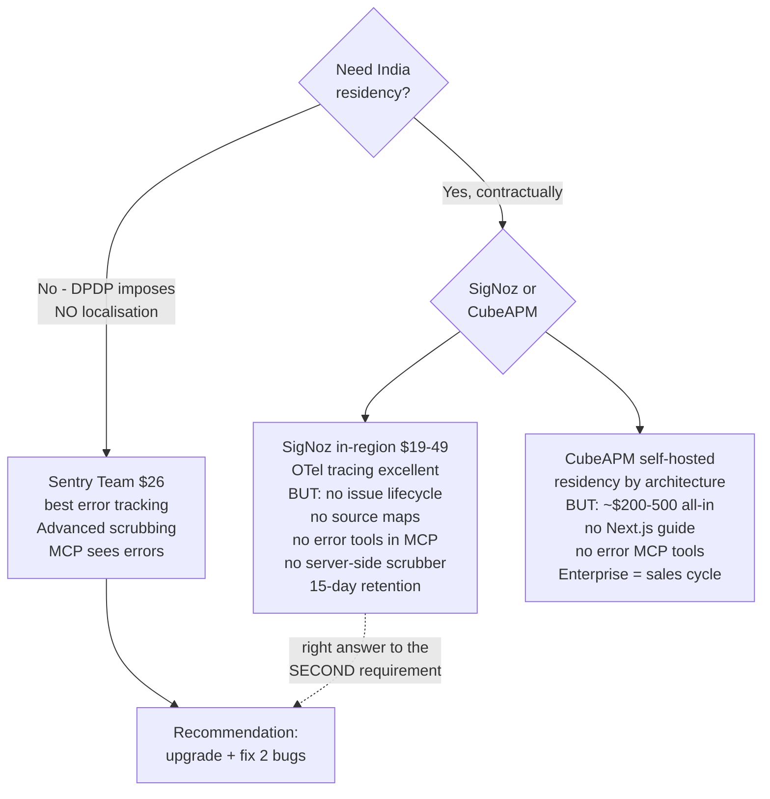
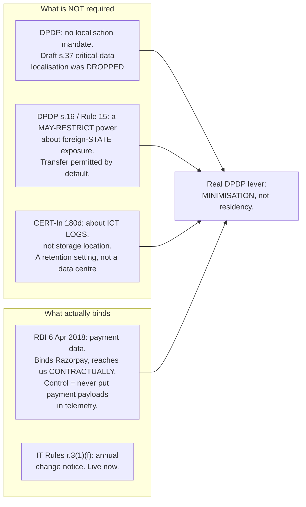
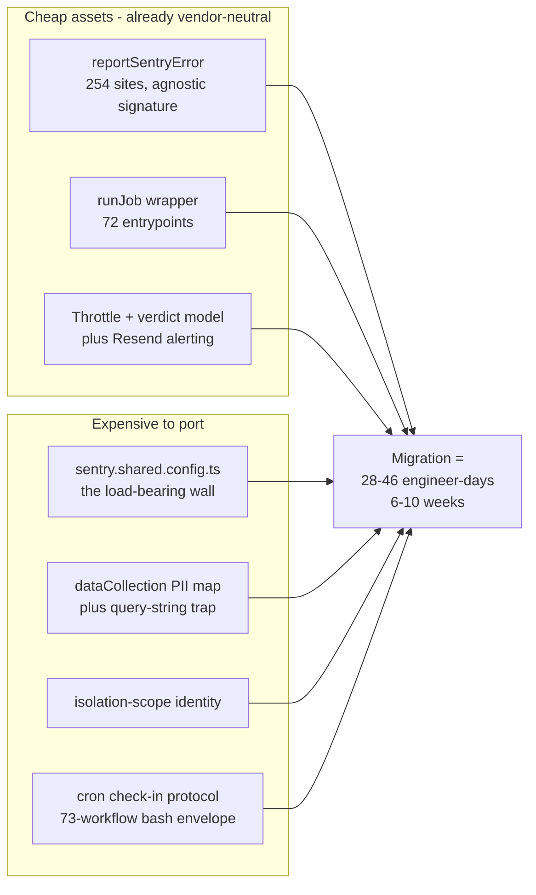

# 02 — Observability vendor landscape

**Research date 2026-09-29.** All prices read off vendor pricing pages, not blog
posts. The single most load-bearing number (Sentry Team) was re-verified directly.

## 0. Three corrections

**"Cube APM" is two companies.** `cube.dev` is a _semantic layer / analytics_
product (Free / Starter $40-dev / Premium $80-dev) with no APM. The
observability product is **CubeAPM** (`cubeapm.com`) — separate, India-focused,
bootstrapped (Vijay Aggarwal, Vineet Chirania), customers almost entirely Indian
(Delhivery, redBus, Practo, Mamaearth, Policybazaar, BharatPe, Shiprocket, Ola).

**CubeAPM is SOC 2 + ISO 27001 only.** Not PCI DSS, not HIPAA. The PCI/HIPAA
positioning is Cube.dev's healthcare-vertical marketing.

**GlitchTip is a three-person company in New York** — Burke Software and
Consulting LLC, DBA GlitchTip.

## 1. Sentry's plans — VERIFIED on sentry.io/pricing, 2026-09-29

|                         | Developer      | **Team**            | Business         |
| ----------------------- | -------------- | ------------------- | ---------------- |
| Price                   | $0             | **$26/mo** (annual) | $80/mo           |
| Users                   | **1**          | **Unlimited**       | Unlimited        |
| **Errors**              | **5,000**      | **50,000**          | 50,000           |
| Retention               | 30-day         | **Up to 90-day**    | 90-day + sampled |
| Dashboards              | 10             | 20                  | Unlimited        |
| Cron monitors           | 1              | 1 (+$0.78)          | 1 (+$0.78)       |
| Uptime monitors         | 1              | 1 (+$1.00)          | 1 (+$1.00)       |
| Spans / Logs / Metrics  | 5M / 5GB / 5GB | same                | same             |
| **Spend notifications** | —              | **yes**             | yes              |
| **Max spend threshold** | —              | **yes**             | yes              |
| MCP access              | yes            | yes                 | yes              |

Team overage per error: 50K–100K **$0.0003625** · 100K–500K $0.0002188 ·
500K–10M $0.0001875 · 10M–20M $0.0001625 · 20M+ $0.00015.

**The two features that address a silent-quota-exhaustion incident are Team
features: spend notifications and a maximum spend threshold.**

## 2. Our actual volume

| Band                  | Errors/mo                                    | Headroom on Team's 50k        |
| --------------------- | -------------------------------------------- | ----------------------------- |
| **Today** (pre-scale) | ~500–2,000 normal; **~5,000 in one bad day** | **25–100×**                   |
| 1k users              | ~2k–8k                                       | ~6–25×                        |
| 10k users             | ~10k–30k                                     | ~1.7–5× — _spans break first_ |
| 50k users             | ~50k–150k                                    | over                          |

The 2026-09-21 Upstash incident burned ~5,000 events in 24h — ~80% of the
Developer allowance — with essentially no user load. Steady state is far below.
The ingest canary alone is 1,440/month at 30-min cadence: **29% of the Developer
allowance for a health check.**

## 3. The landscape

|                    | Residency              | Price at our scale                         | Error tracking               | MCP                                | Users-affected                 | Replay     | Server-side scrub          |
| ------------------ | ---------------------- | ------------------------------------------ | ---------------------------- | ---------------------------------- | ------------------------------ | ---------- | -------------------------- |
| **Sentry Team** ✅ | US/EU                  | **$26**                                    | Best                         | ✅                                 | ✅                             | ✅         | ✅ Advanced Data Scrubbing |
| **GlitchTip**      | US/EU (DigitalOcean)   | **$15** (100k)                             | Good, Sentry-fork            | ✅ **17 tools incl. issues**       | ❌ "does not support sessions" | ❌         | ❌ **ABSENCE**             |
| **SigNoz**         | **US/EU/India (`in`)** | **$49** ($49 usage incl.); **$19** startup | ⚠️ from traces, no lifecycle | ✅ ~30 tools, **ZERO error tools** | n/a                            | ❌         | ❌ self-host a Collector   |
| **CubeAPM**        | **Your own cloud**     | $0.20–0.23/GB **+ infra ≈$150–400**        | ⚠️ unverified depth          | ✅ 10 tools, **ZERO error tools**  | n/a                            | ❌         | unknown                    |
| **Better Stack**   | EU/US/**Singapore**    | **$0** errors (100k free) + $87 responders | Good, Sentry-compatible      | ✅                                 | ✅                             | ✅ incl.   | SDK hooks                  |
| **Datadog**        | ✅ India               | ~$100+ (complex)                           | Good                         | ✅ GA 2026-03                      | ✅                             | ✅         | ✅                         |
| **New Relic**      | ✅                     | ~$25–100                                   | Good                         | ✅ preview                         | ✅                             | add-on     | ✅                         |
| **Grafana Cloud**  | ✅ **Mumbai**          | ~$19+ usage                                | ❌ no Sentry-grade errors    | ✅                                 | n/a                            | Faro (OSS) | ❌                         |
| **Netlify native** | n/a                    | **free, included**                         | ❌ no grouping/lifecycle     | ❌                                 | ❌                             | ❌         | ❌                         |

## 4. The two serious alternatives, and why each loses

### SigNoz — excellent product, wrong problem first

Real, documented **India region** (`ingest.in.signoz.cloud`,
`mcp.in.signoz.cloud`) on the **$49 Teams tier** — not Enterprise-gated. OTel-native
tracing with genuine log correlation is the best in the set. Best docs in the
category (llms.txt, per-page `.md`, full sitemap).

Its own docs concede the rest:

- **Exceptions are read from traces.** "Nothing appears until your services send
  traces" — a cron error with no active span may not be recorded at all.
- **Grouping is service + exception type + message only.** A message with a UUID
  fragments one problem into thousands of groups.
- **On Cloud you cannot change the grouping strategy** (self-host-only flag;
  Cloud users are told to contact support).
- **No issue lifecycle**: no resolve, ignore, assignee, ownership rules, suspect
  commits, affected-user counts, breadcrumbs, release health.
- **No JS source-map story.** Traces will be minified.
- **15-day retention** vs 90.
- **MCP has zero exception tools.** If MCP is how you triage, this makes error
  triage _worse_ than today.
- No replay; a maintainer confirmed (Jul 2026) it is not near-term roadmap.

Its own comparison page concedes Sentry wins for "developer-led teams where
frontend debugging speed matters most".

### CubeAPM — residency by architecture, wrong runtime

**Data sovereignty by architecture**: the binary runs in your cloud; there is no
vendor-operated store. That is the strongest residency posture available.
⚠ Their own pages contradict on price (/pricing $0.20/GB vs
/platform/error-tracking $0.15/GB) — get a written quote.

At our scale it is **more expensive and more work**: the per-GB fee lands on top
of a 4–8 vCPU Mumbai deployment (~$150–400/mo before a single GB is billed). That
converts a $26 SaaS line into a $200–500 infra line plus a sales cycle.

Runtime is wrong too: OTel/Datadog/Elastic agents only, and their docs list
**NodeJS Express, Fastify, Nest — no Next.js guide at all.** No App Router, no
`@vercel/otel`, no `instrumentation.ts`, no `onRequestError`. MCP has zero error
tools.

### GlitchTip — the real trade

A partial fork of Sentry's pre-proprietary open-source codebase. **You change the
DSN; every official Sentry SDK keeps working.** REST API is Sentry-shaped
(`/api/0/...`). CLI exists (`glitchtip-cli`) including
`monitors run <UUID> -- your-cron`. MCP built in, **with issue-level tools**.

Maturity signals are real: daily DB snapshots, 8h RTO, 72-hour breach
notification, production access behind SSO + hardware YubiKey, Mozilla
Observatory A+. Open source, self-hostable in ~4 containers — the
"vendor-disappears" hedge is genuine.

What you give up:

- **No sessions.** `auto_session_tracking: false` is required; their docs say
  "GlitchTip does not support sessions". **That kills "N users affected"** —
  load-bearing in our triage runbook and `lib/observability/sentry-issues.ts`.
- **No server-side data-scrubbing engine (ABSENCE).** Searched their docs,
  GitLab and blog; no equivalent to Sentry's Advanced Data Scrubbing. Our
  scrubbing would live entirely in SDK hooks — which is where most of it already
  is, so a partial loss rather than total.
- No cron monitoring beyond heartbeats, no profiling, no Discover, weaker UI.
- Over-quota: throttles 10% up to 2×, then blocks. Better than a hard 429, still
  drops silently under load.
- 3-person vendor, 1h/8h off-hours support, no SOC 2 Type II (they _design to_
  SOC 2 principles, which is not being audited).

**$15 vs $26 is an $11/month saving bought with "Users affected", server-side
scrubbing and 3-person-vendor risk, on the system that just lost six days of
visibility.** Not taken.

## 5. Does an India region fix DPDP? No.

**And on minimisation the incumbents are better.** SigNoz and CubeAPM both have
**no hosted server-side scrubber** — you must run an OTel Collector to get
equivalent. Moving to them makes our privacy posture **worse**, not better.

**What would change the answer:** a customer contract or board policy requiring
India residency for telemetry specifically. DPDP itself will not force it.

## 6. MCP — the decisive table

| Vendor           | Official MCP            | Has **error/issue** tools        |
| ---------------- | ----------------------- | -------------------------------- |
| **Sentry**       | ✅ `mcp.sentry.dev/mcp` | ✅ in use today                  |
| **GlitchTip**    | ✅ built-in, 17 tools   | ✅ issues, resolve, stack traces |
| **Better Stack** | ✅                      | ✅ errors, replay, incidents     |
| **Datadog**      | ✅ GA 2026-03-09        | ✅                               |
| **Grafana**      | ✅ OSS + Cloud          | n/a                              |
| **New Relic**    | ✅ preview              | ✅                               |
| **Coralogix**    | ✅                      | ✅                               |
| **SigNoz**       | ✅ ~30 tools            | ❌ **none**                      |
| **CubeAPM**      | ✅ 10 tools             | ❌ **none**                      |

**The two we would move _to_ are the two whose MCP cannot see errors.**

## 7. Platform-native and replay

**Netlify Observability** ships on all credit-based plans — request metrics,
function duration, cold starts, errors, plus `netlify logs --follow --level
error`. Retention 1 day (Free) to 7 (Pro). It **cannot**: group errors, manage an
issue lifecycle, count affected users, monitor crons, handle source maps, scope
by release, run alert rules, or serve MCP. A real question answered for free, not
a replacement.

**Microsoft Clarity is explicitly US-hosted** — "Clarity data is stored in one of
Microsoft's US data centers." The India data centre does **not** exist for Clarity
and it is not region-selectable. Free forever, credible as a _product_ for
Next.js — but adopting it would be **adding** a tool, and it would be a **privacy
regression** on the axis we have done the most work on. **No credible
India-resident session-replay product exists.** We use no replay today, so there
is nothing to migrate.

## 8. What we would lose — measured in our own repo

520 direct `Sentry.captureException` sites across 325 files · 254 helper sites ·
171 `Sentry.logger.*` · 414 files · **48 distinct `subsystem:` tags** · **73 of 80**
workflows call `notify-ops-failure.sh`, a hand-written Sentry envelope in bash+jq,
and it is the **only** working page-a-human for money-critical cron failure · 72
bare-Node `runJob()` entrypoints · ~1,500 lines of operational doctrine.

| Rework item                                                                                    | Days      |
| ---------------------------------------------------------------------------------------------- | --------- |
| Rewrite `sentry.shared.config.ts`                                                              | 2–3       |
| **Re-derive the PII policy** (dataCollection map, query-string trap, timezone, 4 scrub passes) | **4–6**   |
| 520 + 254 capture sites                                                                        | 5–8       |
| `job-sentry.ts` + 72 `runJob()` entrypoints                                                    | 2–3       |
| `cron-tick.mts` check-in + `alertFailedTargets`                                                | 3–4       |
| `notify-ops-failure.sh` bash envelope, 73 workflows                                            | 2–3       |
| `sentry-issues.ts` + `user.id` join — **no cross-vendor equivalent**                           | 3–5       |
| Source maps (new plugin, _and_ they don't work today)                                          | 2–3       |
| 48 subsystem tags, searches, dashboards, alert rules                                           | 2–3       |
| Re-author 9 observability docs                                                                 | 2–3       |
| Parallel run, alert re-authoring, MCP re-onboarding, cutover                                   | 3–5       |
| **Total**                                                                                      | **28–46** |

Add **2–4 more weeks** via OpenTelemetry: Next.js's own OTel bindings are
**serverless-functions-only** (we would lose edge + client), we have no
long-lived runtime to host a Collector, and `opentelemetry-go#7596` documents
that `Shutdown()` does not force-flush. We would also be migrating _away from_ an
SDK that has been OTel-native since v8.

## 9. Recommendation

**Upgrade Developer → Team. $26/mo.** Then fix two live defects, then enable the
second sink we already own.

1. **This is a plan-tier problem, not a vendor problem.** Developer is 5,000
   errors and **one user**. Team is 50,000, unlimited users, 90-day retention,
   and **spend notifications with a max spend threshold** — the exact control
   that turns a silent quota exhaustion into an alert.
2. **We are not being hurt by Sentry.** 25–100× headroom for $26.
3. **Every alternative is worse on the axes that matter.** Two have no error tools
   in their MCP and no server-side scrubber. GlitchTip takes away
   "Users affected". Netlify-native cannot group. Clarity is US-only.
4. **Migration costs 6–10 senior weeks for negative benefit.** Three engineers,
   pre-scale.
5. **Source maps are already broken** — a bug fix, not migration overhead.

### The two defects to fix first

**① Source maps upload nowhere. Stack traces are minified in production today.**
The Netlify token was unset after the 2026-06-26 org-spelling outage, CI does not
pass `SENTRY_AUTH_TOKEN` into the step that could use it, and the `.env` org
token 401s. Mint a token for `practitionist` with `project:releases` +
`org:read` scoped to `familiarise_web`; set it on Netlify **and** in the CI build
step env; verify on a deploy preview. `silent: !process.env.CI` means a local
build tells you nothing.

**② Enable the Better Stack sink.** `lib/observability/betterstack-telemetry.ts`
already exists, 100k free exceptions, Sentry-SDK-compatible, already in our MCP
config, inert behind `ENABLE_BETTERSTACK_TELEMETRY`. Point a Better Stack
heartbeat at the existing ingest canary and assert the heartbeat arrived within
12 hours. **That is the control that would have caught the 6-day outage, costs
$0, and is vendor-agnostic.**

### When to revisit

| Flip to                 | When                                                                                                                                                                                                     |
| ----------------------- | -------------------------------------------------------------------------------------------------------------------------------------------------------------------------------------------------------- |
| **SigNoz `in`**         | A customer/board policy requires India residency for telemetry **specifically**; or tracing + log correlation becomes primary and error tracking is judged solved. **Add it alongside, do not replace.** |
| **GlitchTip**           | We confirm we don't need "Users affected" and accept a 3-person vendor's support targets. $11/month is not a reason alone.                                                                               |
| **Better Stack errors** | We benchmark head-to-head against Sentry Team. Genuinely competitive.                                                                                                                                    |
| **CubeAPM**             | We need residency as an architectural fact _and_ can run self-hosted OTel _and_ can absorb a Next.js instrumentation effort.                                                                             |
| **Datadog / New Relic** | Enterprise customer demands it. **Host-based pricing is dead on arrival — we have zero hosts.**                                                                                                          |
| **Grafana Cloud**       | We decide to build a self-owned OTel pipeline. Best contractual India residency; you assemble the error pipeline.                                                                                        |

## Sources

sentry.io/pricing (VERIFIED 2026-09-29) · Sentry data-storage-location docs ·
SigNoz pricing/MCP/exceptions/PII-scrubbing docs + GitHub discussion #3846 ·
GlitchTip pricing, MCP, CLI, logs, architecture, privacy · CubeAPM pricing,
instrumentation, MCP, compliance · Better Stack pricing + heartbeat docs ·
Datadog MCP GA press release · Grafana Cloud regional availability · Microsoft
Clarity privacy policy · Next.js OTel guide · opentelemetry-specification#351 ·
opentelemetry-go#7596 · DPDP Act 2023 · CERT-In Directions 28.04.2022.
