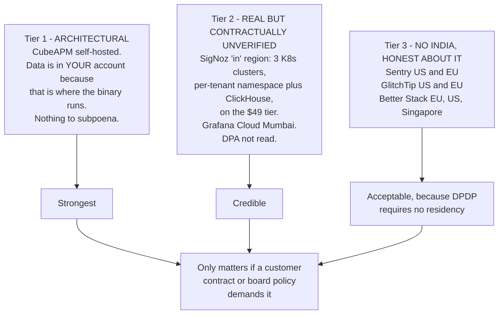
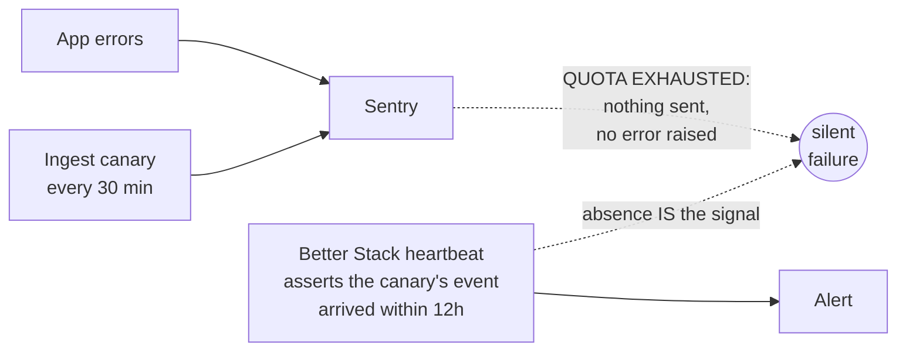

# 03 — Competitor pattern catalogue

**Research date 2026-09-29.** Indexed by **mechanism**, not by company, because
the transferable insight is the pattern and any company is just an instance.
Verbatim clauses are quoted from each company's live terms on that date.

## The pattern index

| #   | Pattern                                         | Who does it                                                 | Strength                                       | Isolate-and-exit? |
| --- | ----------------------------------------------- | ----------------------------------------------------------- | ---------------------------------------------- | ----------------- |
| P1  | Post-and-continue (deemed acceptance)           | Almost every Indian B2C                                     | Weak evidence, matches market norm             | **No**            |
| P2  | Version-pin + 7-year evidence record            | Our own emerging design                                     | Strong                                         | Yes               |
| P3  | Interposed re-acceptance, material changes only | One Indian B2C outlier; Postman gates notice on materiality | Strongest defensible                           | Yes               |
| P4  | Notice period before effect (10 days)           | Freshworks                                                  | Strong, and pairs with a renewal hook          | Yes               |
| P5  | Email + SMS specifically for **fee** changes    | Zerodha                                                     | Targeted; recognises not all changes are equal | Yes               |
| P6  | Annual-change notice as a standing clause       | Zerodha, Groww                                              | Compliant floor                                | Yes               |
| P7  | Independent auditor / SOC 2 as a trust signal   | CubeAPM (SOC 2 + ISO 27001)                                 | Necessary for enterprise, not sufficient       | n/a               |
| P8  | Residency by architecture, not by promise       | CubeAPM self-hosted                                         | Strongest form; highest ops cost               | n/a               |
| P9  | Sentry-protocol compatibility as a switch       | GlitchTip, Better Stack                                     | **Enables exit at near-zero cost**             | Yes               |
| P10 | Second sink, always-on, vendor-agnostic         | Our own design                                              | Catches the failure the primary cannot report  | Yes               |

## P1 — Post-and-continue

The market norm. Nine of eleven companies researched.

> **Groww:** "The Company reserves an unconditional right to modify or amend this
> Terms of Use **with or without any requirement to notify You**… Your use of the
> Platform… after the posting of modifications to the Terms will constitute Your
> acceptance… **Groww shall not be liable for any loss arising from a user's
> failure to review updated Terms.**"

> **Zerodha:** "You agree to any and all changes to the Terms **without specific
> communication from Zerodha, by Your continuing usage of the Platform** and/or
> continuing to hold an account."

> **Nykaa:** "reserves the unilateral right to change… **without notice to its
> users**… Your continued use… constitutes your acceptance… **whether or not you
> have read them.**"

> **Flipkart:** "at any time and **without any prior written notice to you**…
> Your continued use of the Website following the changes will mean that you
> accept and agree to the revisions."

> **Swiggy:** "**We may choose to notify you**" — notification is optional.

> **Zomato:** "Clicking to accept **or** actually using the Services. In this
> case, you understand and agree that Zomato will treat your use of the Services
> as acceptance."

**Assessment.** Lawful, and IC Act s.9 supports it (conduct is acceptance). But
it leaves **DPDP s.6(10) unmet**: the burden is on us to _prove_ a notice was
given and consent obtained, and an unread email proves very little. It is also the
mechanism by which an unfair term becomes enforceable-by-default, which is
precisely what CPA 2019 s.2(46) exists to prevent.

**Verdict: compliant, minimal, and evidentially weak. Not a model to copy.**

## P2 — Version-pin + 7-year evidence record

> One Indian B2C privacy policy: "We retain a minimal record of your agreement to
> our Terms and Privacy Policy (**timestamp, policy versions, and purposes
> consented to, linked to a pseudonymous identifier**) for up to seven years
> after acceptance to demonstrate compliance with applicable law."

**Assessment.** This is the right primitive and it is rare. Three properties that
make it strong:

1. **Pseudonymous link, not the raw id** — the evidence survives the erasure of
   the subject's identifying rows, which is what lets it be retained at all.
2. **Version pinning** — you can prove _which text_ was agreed to. Without it,
   shipping new copy silently invalidates nothing and the record is useless.
3. **7 years** matches the DPDP audit window.

**Verdict: adopt. It is compatible with P3 rather than exclusive of it.**

## P3 — Interposed re-acceptance, material changes only

> One Indian B2C: "For material changes, we will notify account holders by email
> or in-app notice where appropriate. **Material changes require explicit
> re-acceptance at your next login before you can continue using the app.**"

> **Postman** gates the _notice_ on materiality — "If Postman makes any material
> changes to these Terms, **we may notify you**" — though not the acceptance.

**Assessment.** The strongest defensible design, for three reasons: it creates
**evidence** rather than an assumption; it gives a **clean exit** for
non-accepters; and it is scoped to material changes so it is not a nag.

⚠ **It is a dark pattern if mis-scoped.** EDPB Guidelines 03/2022 names
"**continuous prompting** — repeatedly asking users to agree to a new purpose" as
a deceptive design pattern, noting users "end up giving in, wearied". And the
Consumer Protection (E-Commerce) Amendment Rules 2026 (**in force 1 Jan 2027**)
import dark-pattern compliance into Indian consumer-adjacent regulation. The
materiality threshold is therefore a legal control, not a UX preference.

**Verdict: adopt for material changes. Define "material" in the ToS, tied to
CPA s.2(46)'s own vocabulary so it reads as compliance rather than licence.**

## P4 — Notice period with a renewal hook

> **Freshworks:** "Provider will notify Customer **not less than ten (10) days
> prior to the Effective Date** of any amendments… continued use… may be relied
> upon by Provider as Customer's acceptance." Current version: changes take
> effect **at next renewal**.

**Assessment.** The renewal hook is the elegant part: re-acceptance is
unobtrusive because the user was going to renew anyway. **We have no renewal
hook** — a B2C consumer does not renew. That is the core structural difficulty in
P3 for our product, and P3's "gate at next login" is the consumer equivalent.

**Verdict: adopt the 10-day notice period. Cannot adopt the renewal hook.**

## P5 — Targeted notice for money changes

> **Zerodha** s.12.2: "Zerodha shall notify the Client… **through an email
> and/or SMS**" — used specifically for fee changes.

**Assessment.** Small, cheap, and correct in a way the others are not: it
recognises that **not all changes carry equal consequence**. A contact-detail
correction and a fee change should not take the same channel. This maps directly
onto a materiality threshold, at the channel level rather than the
acceptance level.

**Verdict: adopt as a channel-selection rule. SMS for anything money-adjacent.**

## P6 — Annual-change notice as a standing clause

> **Zerodha** s.1.3: "subject to change without notice" + a periodic-review
> obligation. **Groww:** "It shall be Your responsibility to check these Terms of
> Use periodically for changes."

**Assessment.** The IT Rules r.3(1)(f) floor. Note it is a **floor, not a
strategy** — it satisfies the regulation and nothing more. A clause that shifts
the burden to the user ("it is your responsibility to check") is worth having as
a _floor_ and worth not relying on as the whole mechanism.

**Verdict: adopt as the minimum. Never as the answer.**

## P7 — Certification as a trust signal

**CubeAPM: SOC 2 + ISO 27001.** (Explicitly _not_ PCI DSS or HIPAA — a
misattribution that attaches to Cube.dev's healthcare analytics product.)

GlitchTip's posture is instructive in the other direction: they _design to_ SOC 2
/ ISO 27001 / HIPAA principles and self-certify GDPR compliance, but hold **no
SOC 2 Type II**. "Designs to" and "is audited" are different claims and vendor
copy blurs them.

**Assessment.** Necessary for enterprise procurement, never sufficient. Verify
the report exists and covers the services you actually use — a report for the
marketing site is not a report for the API.

**Verdict: check before trusting. Record which certification, which scope, which
date.**

## P8 — Residency by architecture

**CubeAPM:** a managed self-hosted binary in your own cloud. "Data sovereignty:
Yes. Day-2 ops: None." There is no vendor-operated store to breach or subpoena.

Compare the three tiers:

**Assessment.** Tier 1 is genuinely the strongest and also the most expensive
here: the per-GB fee lands on top of a 4–8 vCPU deployment (~$150–400/mo at a
Bengaluru or Mumbai region) _before a single GB is billed_, and Enterprise is a
"Book a Demo" motion.

**Verdict: the tier is the wrong question. Nothing requires Tier 1.**

## P9 — Protocol compatibility as an exit

**GlitchTip** is a partial fork of Sentry's pre-proprietary open-source codebase;
**Better Stack** is Sentry-SDK-compatible. Both accept a DSN change and keep every
official Sentry SDK working. GlitchTip's REST API is Sentry-shaped (`/api/0/...`),
which is why third-party tooling works.

|               | GlitchTip                                                          | Better Stack                          |
| ------------- | ------------------------------------------------------------------ | ------------------------------------- |
| Migration     | **DSN swap**                                                       | **DSN swap**                          |
| Source maps   | `glitchtip-cli` (Beta)                                             | Sentry mechanics                      |
| CLI           | `glitchtip-cli` incl. `monitors run <UUID> -- cmd`                 | —                                     |
| MCP           | built-in, 17 tools, **issue-level**                                | ✅                                    |
| Free tier     | 1,000 events                                                       | **100,000 exceptions + 90d + replay** |
| What you lose | sessions/affected-users, server-side scrubber, profiling, Discover | unknown depth                         |

**Assessment.** This is the most important pattern in the whole document, and it
is a _design_ pattern rather than a vendor choice: **an exit is only cheap if you
built the seam.** Our `reportSentryError()` abstraction (254 call sites, entirely
vendor-agnostic signature) and `runJob()` wrapper (72 entrypoints) are that seam.
`lib/observability/betterstack-telemetry.ts` already exists as a second sink and
is **inert** behind a feature flag — we own an exit and never turned it on.

**Verdict: keep the abstraction layer. Enable the second sink. A switch should be
a DSN change, not a quarter of engineering.**

## P10 — Monitor the monitor

No company does this, which is why a six-day silent ingest failure was possible.

**Assessment.** Every monitoring system fails the same way: it cannot report its
own failure. An ingest canary that reports _through_ the broken channel is not an
independent check — which is why `lib/observability/ingest-canary.ts` classifies
the HTTP verdict (`rate-limited`, `rejected-auth`, `unconfigured`) rather than
trusting `flush()`.

**Verdict: adopt, and keep the external assertion on a separate vendor. This is
the single highest-value pattern here and it costs $0.**

## Cross-cutting observations

**Nobody in the set does consent-state-machine work.** Every company researched
treats consent as a boolean or a small set of purposes, with no representation
for "asked but unanswered" vs "never asked". This is a genuine gap in the market,
not a research failure — which is why the state machine in `04` is the
differentiator.

**Maturity correlates inversely with flexibility.** Freshworks' renewal hook is
the best mechanism found and is available only because it is B2B with annual
contracts. The more consumer-facing a product, the weaker its consent mechanism
— because a consumer has no renewal moment to hang re-acceptance on. P3's
"gate at next login" is the consumer workaround, and it is the pattern to adopt.

**Certification is table stakes and says nothing about correctness.** Three of
the vendors researched hold SOC 2 or ISO 27001; the two with the weakest error
tracking (SigNoz, CubeAPM) are among the best certified. Certification attests to
process, not to whether the tool can do the job.

## Sources

Company terms read directly 2026-09-29: Groww, Zerodha, Swiggy, Zomato, Nykaa,
Flipkart Stories, Postman, Freshworks, Hasura. Plus EDPB Guidelines 03/2022 ·
EDPB 05/2020 · IC Act s.9 · CPA 2019 s.2(46) · IT Rules 2021 r.3(1)(f) ·
Consumer Protection (E-Commerce) Amendment Rules 2026 · CubeAPM compliance and
pricing pages · GlitchTip architecture and pricing pages.
