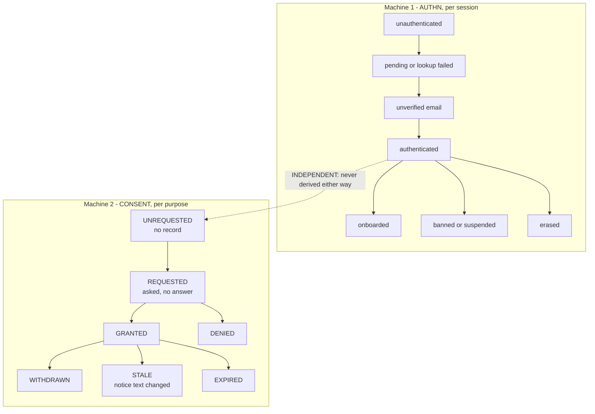
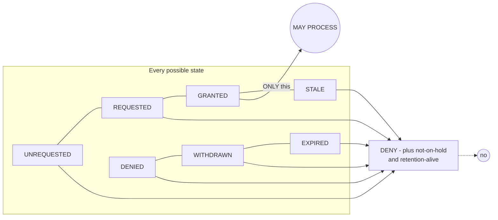
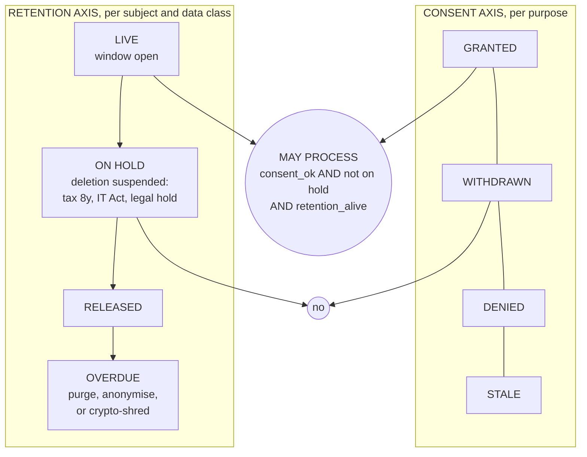
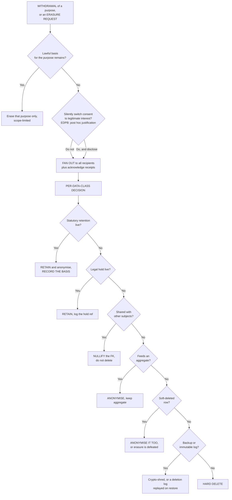
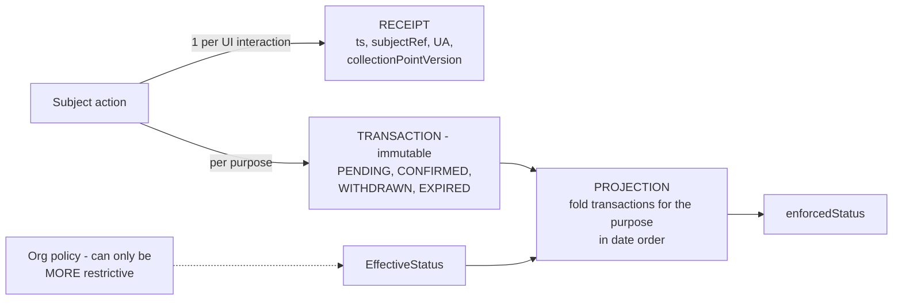
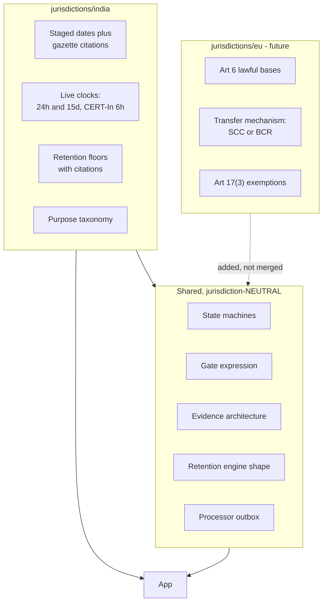

# 04 — Reusable compliance substrate

**This is the portable part.** Jurisdiction-neutral architecture to lift into
other companies. `01`, `02` and `03` are a dated India baseline; this is the
machinery that survives a new market.

The design principle: **a new country is a new entry in `jurisdictions/`, never a
rewrite of this file.** If porting a compliance system requires rewriting the
state machines, the abstraction is wrong.

## 1. The four separations

Everything else follows from these. Each is a table/model boundary, not a
convention.

| Separation                        | Rule                                                                                                  | Why it must be structural                                                                      |
| --------------------------------- | ----------------------------------------------------------------------------------------------------- | ---------------------------------------------------------------------------------------------- |
| **Authn ⇄ Consent**               | Two machines, two tables, two audit streams. Never derive one from the other.                         | Login success is not consent. Conflating them means a session can resurrect withdrawn consent. |
| **Withdrawal ⇄ Erasure**          | Two events, two states, two records. One may _impute_ the other; the audit must show which was asked. | Different legal bases, different scopes, different evidence.                                   |
| **Subject ⇄ Processing**          | Consent is per (subject × purpose × notice version). Never a user-level boolean.                      | A single boolean cannot express granularity, and bundling is the named anti-pattern.           |
| **Consent axis ⇄ Retention axis** | Legal hold and retention are suppression over _retention_, orthogonal to consent.                     | A hold on the consent axis destroys the evidence you need to defend the hold.                  |



**The two start states in Machine 2 are the whole point of the design.**
`UNREQUESTED` is a _system_ fact (no record exists) and must never be displayed
as if the subject had decided something. `REQUESTED` is a _record_ without a
decision. Both collapse to deny at the gate.

## 2. The gate is a whitelist, never a blacklist



```ts
// The one expression. Everything else is a presentation concern.
MAY_PROCESS(purpose) :=
    state(purpose) == GRANTED
 && noticeVersion(purpose) == CURRENT_NOTICE_VERSION
 && !retention.onHold(subject, dataClass)
 && now < retention.until(subject, dataClass)
```

This single form satisfies, simultaneously, the strictest reading of every
regime we researched — India's "toute inaction doit être interprétée comme un
refus" (CNIL 2020-092 §9), the IAB TCF fail-safe ("if a CMP is not present…
vendors should assume no consent"), and UAE Open Finance's enforcement rule
("reject all requests where consent is not `Authorized` — **including
`AwaitingAuthorization`**"). No other formulation covers all three.

**Reconciling the apparent conflict.** CNIL makes a _legal_ claim (absence of
consent = refusal). CAMARA and the Consent Manager APIs make an _evidentiary_
claim (we can tell you _why_ there is no consent). Both are right, at different
layers. **Collapse to deny at the gate; keep the states distinct in the
machine.** Building only the legal view and discarding the evidentiary view is
the single most common modelling mistake.

## 3. Two axes, not one



**A legal hold never mutates consent state.** It sets the retention axis and logs
a hold reference. Modelling it on the consent axis means a hold destroys the
consent timeline you need to defend the hold.

## 4. Withdrawal → erasure, end to end



Two rules that are easy to get wrong and expensive to get wrong:

- **Withdrawal is prospective and purpose-scoped.** It does not delete data
  already collected, and in flight orders survive (DPDP s.6(5)).
- **Every branch is recorded**, _including the ones that decide not to delete_.
  "Absence of deletion is evidence too." A per-record logged decision is the
  artifact an auditor asks for; a table of intentions is not.

## 5. Evidence architecture

Immutable events, folded into a projection. This satisfies integrity
requirements (Art 5(2), 7(1)) and makes the state machine re-derivable.



Four properties, each earned:

1. **Immutability** — revocation is a new `WITHDRAWN` row; the grant row is never
   touched. Enforce in the DB (`CREATE RULE … DO INSTEAD NOTHING`), not just in
   review.
2. **Projection from events** — the "was it overwritten?" question becomes
   answerable, and the state machine is trivially re-derivable.
3. **EffectiveStatus overlay** — the only published mechanism for _org policy
   beats individual choice while still recording the individual choice_. Matters
   for employer/employee imbalance, which is a real DPDP and GDPR problem.
4. **Per-purpose withdrawal is independent of subject state**, so an erasure need
   not lie about the consent history.

**Every record needs**: `subjectRef` (pseudonymised, never the email),
`purposeId`, `noticeVersion`, `decision`, `fromState`, `toState`, `jurisdiction`,
`actorId`, `channel`/`collectionPointVersion`, `occurredAt` (server time),
`version` (optimistic concurrency).

**The state change and the audit row must commit in the same transaction.** An
asynchronous best-effort log cannot be the only evidence.

## 6. Non-negotiable invariants

1. **The gate is a whitelist.** §2. Never a denylist.
2. **Append-only evidence.** No `UPDATE`/`DELETE` on the consent ledger. Enforce
   in the database.
3. **Read consent at the point of processing, not at enqueue.** Never trust a
   consent value copied into a job payload or a stale tab. (Same class as OAuth
   scope elevation; RFC 9700.)
4. **Withdrawal propagates and you get receipts.** You are responsible for the
   whole chain, including consents you did not obtain.
5. **Withdrawal does not delete the proof.** Retain the consent record per the
   audit requirement; erase the _data_ per §4.
6. **Impute erasure on withdrawal only where the law says to** (PECR/ICO), and
   keep both record ids so the audit shows which was requested.
7. **A legal hold never mutates consent state.**
8. **New notice text ⇒ new record, never a relabel.** Old grants stay under the
   old version forever.
9. **Erasure is deterministic and encoded once.** A per-data-class × jurisdiction
   rules table, with a **coverage test that fails the build** if any table
   holding classified personal data lacks a rule or a documented exemption.
10. **Vendor work is durable.** A process death between commit and the processor
    call must not lose the obligation. Use an outbox row written in the same
    transaction, drained by a retry job.

## 7. What to deliberately NOT build

| Anti-pattern                                  | Why not                                                                                                                                                              |
| --------------------------------------------- | -------------------------------------------------------------------------------------------------------------------------------------------------------------------- |
| An `IMPLICIT` consent state                   | OneTrust has it; silence and inactivity are not consent (Recital 32). Model "implicit" as a **channel**, never as a grant.                                           |
| `WITHDRAWN` as a first record with no history | OneTrust admits it leaves no evidence. If you must represent an unrecorded prior state, use a **reconciliation event** with its own type, not a fabricated decision. |
| One global "marketing" toggle                 | EDPB §3.2 granularity; CJEU/EDPB hostility to bundling. Marketing is a **set** of purposes.                                                                          |
| Mandatory re-prompt on every text edit        | Make it a policy on top of hard version-bound validity (the TCF v2.2 choice). Both are lawful; the second is better UX. Pick consciously.                            |
| Blocking on _no_ consent event at all         | Silently broken for six days. Absence of errors is not health.                                                                                                       |

## 8. Jurisdiction model



**The registry, not the code, is where a new market lives.** Each jurisdiction
entry declares: statutory sources with citations; commencement status per
provision; the clocks that are live _now_; the purpose taxonomy; the retention
floor per data class; the transfer mechanism; and the enforcement reality
(including "the regulator is unstaffed" — which changes urgency, not duty).

**Two failure modes to design against:**

- **A jurisdiction entry that is a snapshot.** It goes stale silently. Mitigate
  with the `05-claims-register` pattern: every entry row has a source, a date
  checked, and a confidence marker.
- **A jurisdiction entry that quietly becomes the default.** An
  India-first posture written without this framing becomes "India-specific
  _facts_" rather than "India as the first instance". Every rule should be
  "here is the requirement and its source", so a new market substitutes its own
  answer without touching the machinery.

## 9. What we deliberately left open

- Does withdrawal imply erasure? **Three regulators, three answers, no CJEU
  ruling.** Resolve per-purpose in writing; do not guess.
- Can consent be a condition of service? **Unresolved at EU level.** Do not
  build a cookie wall.
- Must the notice be in all 22 Schedule VIII languages? DPDP s.5(3) requires
  Eighth Schedule availability; whether English alone suffices is unaddressed.
- Are Consent Managers required? DPDP s.6(7) permits them, s.6(9) requires
  _them_ to be registered. No rule yet requires us to use one.

**These belong with counsel. The engineering consequence is that the substrate
above must be able to represent each answer without a redesign** — which is
exactly what the four separations in §1 are for.
