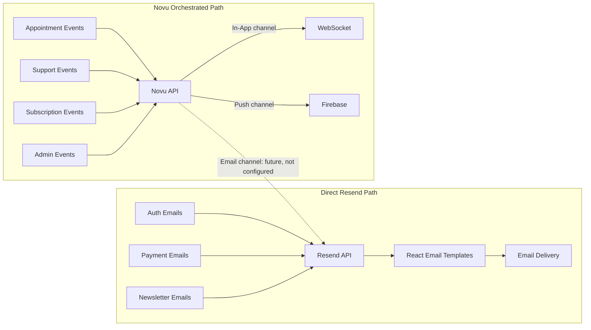
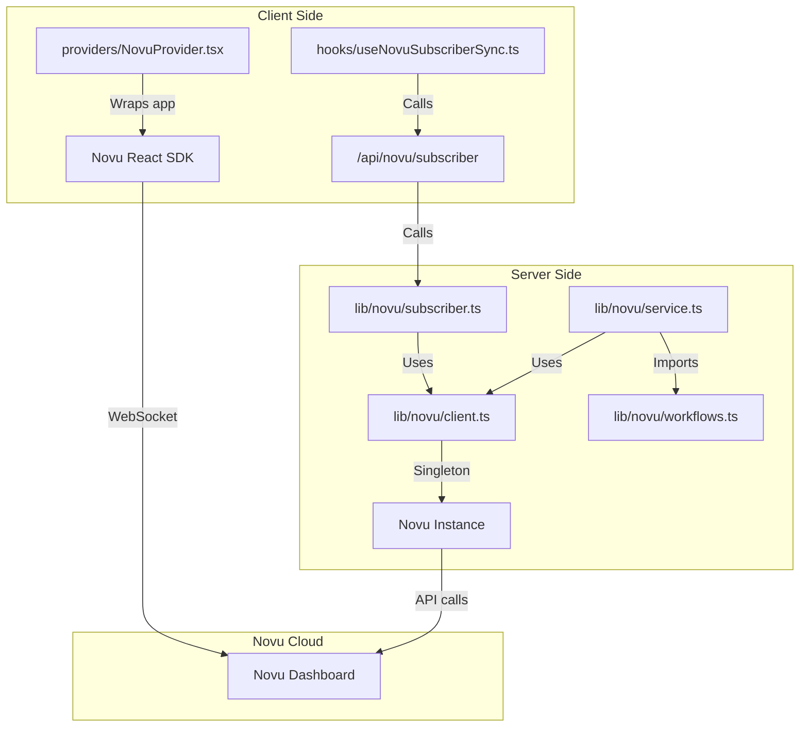
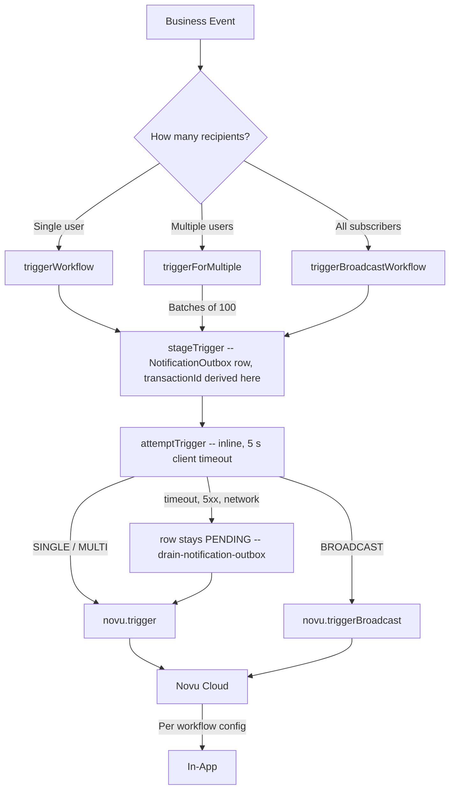
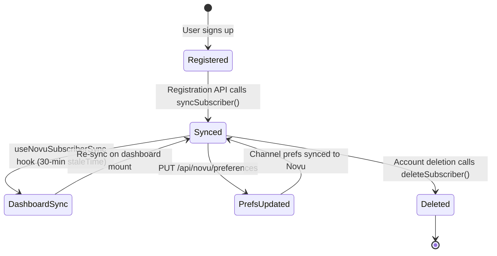
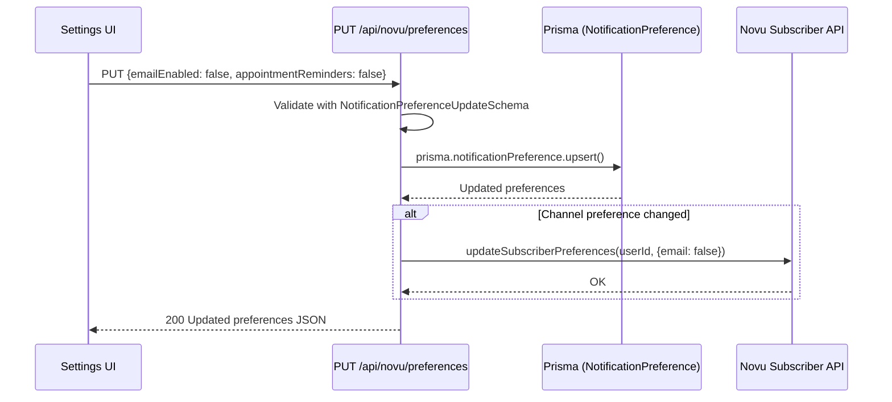

# Notification Architecture

## Design Decision: Resend + Novu

The notification system uses two complementary services rather than one:

| Service    | Role                                     | Analogy     |
| ---------- | ---------------------------------------- | ----------- |
| **Resend** | Email delivery infrastructure            | The postman |
| **Novu**   | Multi-channel notification orchestration | The brain   |

**Why both?** Resend sends emails reliably (DKIM, SPF, bounce handling) but cannot do in-app notifications, push notifications, digest batching, or user preference routing. Novu orchestrates all channels but cannot deliver emails itself. As of ADR 30 every Novu workflow family is in-app only, so the Novu email channel shown below is a possible future path, not a configured one; Novu sends no email today.

**Why not Novu for everything?** Some emails (auth, payment links) are tightly coupled to their API routes and don't need multi-channel delivery. Sending these directly through Resend avoids unnecessary complexity.



### When to Use Each Path

| Use Resend Directly                                   | Use Novu                                                          |
| ----------------------------------------------------- | ----------------------------------------------------------------- |
| Auth emails (welcome, password reset, account linked) | Appointment lifecycle (booked, cancelled, rescheduled, completed) |
| Payment transactional (payment link, success, failed) | Support tickets (created, updated, response)                      |
| Newsletter opt-in (confirm, welcome)                  | Feedback and reviews                                              |
| Any email that doesn't need in-app/push delivery      | Trial sessions, subscriptions                                     |
|                                                       | Consultant-specific (booking requests, verification, payouts)     |
|                                                       | Admin/system (announcements, new applications)                    |
|                                                       | Disputes, recordings                                              |

---

## Resend Layer

### Client Initialization

```
lib/email/
├── index.ts          -- 11 sender functions plus renderPaymentSuccessEmail()/renderPaymentFailedEmail(); @/lib/email still resolves to this module
├── config.ts         -- SENDERS getters, EMAIL_BUDGET_MS, supportEmail(), contactInboxAddress(), billingEmail(), companyPostalAddress()
├── deliver.ts         -- deliver() = stage() + attempt(), the single send core; getResendClient(), recordFailedEmail(), EmailNotConfiguredError
├── idempotency.ts     -- derives the content-hash Idempotency-Key shared by a sender and the retry worker
├── classify.ts        -- classifies a Resend failure as terminal or transient
└── render.ts          -- renderEmail(), returns { html, text }

sendWelcomeEmail()         -- from: SENDERS.onboarding (onboarding@mail.familiarisenow.com)
sendPasswordResetEmail()   -- from: SENDERS.security (security@mail.familiarisenow.com)
sendVerificationEmail()    -- from: SENDERS.onboarding
sendAccountLinkedEmail()   -- from: SENDERS.security
sendPaymentLinkEmail()     -- from: SENDERS.payments (payments@mail.familiarisenow.com)
sendPaymentSuccessEmail()  -- from: SENDERS.payments
sendPaymentFailedEmail()   -- from: SENDERS.payments
sendOrgInvitationEmail()   -- from: SENDERS.notifications (no caller today)
sendWaitlistConfirmEmail() -- from: SENDERS.newsletter (newsletter@news.familiarisenow.com)
sendWaitlistWelcomeEmail() -- from: SENDERS.newsletter
sendContactInquiryEmail()  -- from: SENDERS.notifications, to: contactInboxAddress()
```

Every domain in `SENDERS` is read from `EMAIL_TRANSACTIONAL_DOMAIN` / `EMAIL_NEWSLETTER_DOMAIN` at call time (defaults `mail.familiarisenow.com` / `news.familiarisenow.com`), not hardcoded, so an environment can point sends at a different verified domain without a code change.

### Email Rendering Pipeline

Every sender follows render → build → deliver. `renderEmail()` (`lib/email/render.ts`) renders the React Email element once and returns both an HTML string and a plain-text string, so every outbound message carries a text part alongside the HTML part. `deliver()` (`lib/email/deliver.ts`) is the single send core all eleven senders funnel through, and since #1654 it is two phases: `stage()` writes the rendered message as a `PENDING` `FailedEmail` row before any network call, and `attempt()` performs one inline send under a time budget and settles the row. The outbox row exists the moment the business change is durable, so a function that freezes between the commit and the send can no longer lose the email; the relay described below finishes whatever the inline attempt left `PENDING`.

```mermaid
sequenceDiagram
    participant API as API Route
    participant Fn as Email Function
    participant RE as renderEmail()
    participant DL as deliver() = stage() + attempt()
    participant FE as FailedEmail table
    participant RS as Resend API

    API->>Fn: sendPaymentLinkEmail({email, name, amount, ...})
    Fn->>RE: renderEmail(PaymentLinkEmail({name, amount, ...}))
    RE-->>Fn: {html, text}
    Fn->>DL: deliver({from, to, subject, html, text}, emailType, {entityRef, budgetMs})
    DL->>FE: stage() -- PENDING row with the rendered body and entityRef
    DL->>RS: attempt() -- emails.send(payload, {idempotencyKey, signal: AbortSignal.timeout(budgetMs)})
    alt sent
        RS-->>DL: {id: "email_xxx"}
        DL->>FE: status SENT, sentAt, resendId
        DL-->>Fn: {success: true, data}
    else timed out
        DL->>DL: log once, no Sentry
        DL-->>Fn: {success: false, staged: true} -- the row stays PENDING for the relay
    else terminal error (dead key, unverified domain, rejected body)
        DL->>FE: status DEAD_LETTER, lastError; Sentry error fingerprint ["email-send-terminal", reason]
        DL-->>Fn: {success: false, staged: true}
    else transient error or missing key
        DL->>FE: lastError only -- still PENDING, the relay's backoff starts from its own first try
        DL-->>Fn: {success: false, staged: true}
    end
    Fn-->>API: DeliverResult
```

The inline attempt runs under a budget named in `EMAIL_BUDGET_MS` (`lib/email/config.ts`) and chosen per caller, because the caller's request is what a slow provider would otherwise hold open until Netlify's ~26-second ceiling. The table below lists the budgets and who uses each.

| Budget                 | Milliseconds | Callers                                                                                                        |
| ---------------------- | ------------ | -------------------------------------------------------------------------------------------------------------- |
| `AUTH`                 | 8 000        | The Better Auth hooks (welcome, verification, password reset, account linked) and the organisation invitation. |
| `CONTACT_AND_WAITLIST` | 5 000        | The contact form and both waitlist senders.                                                                    |
| `WEBHOOK`              | 3 000        | The payment senders (receipt, failure notice, payment link).                                                   |
| `JOB`                  | 10 000       | The compliance alert jobs and every send the relay itself makes.                                               |

A timeout is not a failure. The Resend SDK spreads the request options into `fetch`, so the `AbortSignal` genuinely aborts the call, and `attempt()` recognises either a thrown `AbortError`/`TimeoutError` or the SDK's generic "could not be resolved" error while its own signal is aborted; in both cases the row is left `PENDING` and untouched, a single log line is written, and nothing reaches Sentry. The relay sends the row on its next pass under the same content-hash Idempotency-Key (`lib/email/idempotency.ts`, of the form `<EMAIL_TYPE>/<sha256(to\nsubject\nhtml)[:48]>`), which Resend deduplicates for 24 hours, so a send that actually completed after the caller stopped waiting is not delivered twice. `deliver()` defaults Reply-To to `supportEmail()` when the caller does not set one; `stage()` applies the same default so the row and the send agree. A missing key (`EmailNotConfiguredError`) is reported at level `"error"` with fingerprint `["email-send-terminal", "not_configured"]` but leaves the row `PENDING`, because it replays once the key exists (#1298); a dead key, an unverified domain or a body Resend rejects dead-letters the row on the spot, since no replay changes the answer.

Every sender stamps the row's `entityRef` with the business anchor it knows: the auth senders write `user:<id>`, the payment senders `payment:<id>`, the waitlist senders `waitlist:<email>` and the contact form `contact:<email>`. A sender's `DeliverResult` carries `staged: true` on failure when the row exists, which is how `app/api/contact/route.ts` answers success for an inquiry that is durable but not yet delivered and keeps its 502 for the case where even the row could not be written.

#### Staging inside a transaction

A caller that owns a database transaction calls the two phases itself rather than `deliver()`: `stage(message, emailType, { tx, entityRef })` inside the transaction and `attempt(staged, message, emailType, { budgetMs })` after it commits. Inside a transaction a staging failure propagates, so the row and the business write roll back together, which is the whole point of the outbox; an attempt inside the transaction would send before the business write is durable, so the split is deliberate. `lib/payments/webhooks/handlers.ts` is the one caller today: `stagePaymentSuccessEmail()` reads the receipt's inputs through the Phase 1 transaction, renders with `renderPaymentSuccessEmail()` (`lib/email/index.ts`, the render-only half of `sendPaymentSuccessEmail()`), stages the row, and Phase 2 attempts it under the `WEBHOOK` budget; the two blocked outcomes that Phase 2 refunds (a capture after cancellation, a double-booking loser) stage nothing. `handlePaymentFailure()` does the same with `stagePaymentFailedEmail()` and attempts after its own transaction commits. Nothing else in the money transaction changed (ADR 21).

### The relay

`jobs/email/retry-failed-emails.ts` is both the retry worker of #474 and the outbox relay of #1654: it drains `FailedEmail` rows whose status is `PENDING`, or `RETRY` with a `nextRetryAt` that has passed, up to fifty per tick, re-sends each stored message verbatim under its original Idempotency-Key with the `JOB` budget as an abort signal, writes `resendId` on success, and walks the shared backoff ladder in `lib/retry/backoff.ts` on failure. The drain paces itself at one send every 125 milliseconds, because Resend's team limit is ten requests a second and the inline fast path sends alongside the relay. It runs from two places: the Netlify ticker (`netlify/functions/cron-tick.mts`) posts `/api/cleanup/retry-failed-emails?limit=20` on every tick whose wall-clock minute is a multiple of fifteen, and the GitHub Actions workflow `retry-failed-emails.yml` runs the same worker unbounded as the backstop (#1648, ADR 27). Both entries take the fail-closed cron lock `retry-failed-emails`, so an overlap answers 409 instead of sending a row twice.

### From Address Convention

| Domain Prefix    | Used For                                                    | Domain                    |
| ---------------- | ----------------------------------------------------------- | ------------------------- |
| `onboarding@`    | Welcome, email verification                                 | `mail.familiarisenow.com` |
| `security@`      | Password reset, account linking                             | `mail.familiarisenow.com` |
| `payments@`      | Payment link, success, failure                              | `mail.familiarisenow.com` |
| `notifications@` | Org invitations, contact inquiry                            | `mail.familiarisenow.com` |
| `finance@`       | Finance-facing notices                                      | `mail.familiarisenow.com` |
| `dpdp@`          | DPDP compliance alerts                                      | `mail.familiarisenow.com` |
| `noreply@`       | Data-export notice (the worker falls back to `onboarding@`) | `mail.familiarisenow.com` |
| `system` (bare)  | Internal requester id, not a `From` header                  | `mail.familiarisenow.com` |
| `newsletter@`    | Waitlist opt-in + broadcast                                 | `news.familiarisenow.com` |

---

## Novu Layer

### Client Architecture



### Server-Side Client (`lib/novu/client.ts`)

Singleton pattern matching `lib/stream-client.ts`:

- `isNovuConfigured()` -- checks whether the secret key for the detected Novu environment is set: `NOVU_PRODUCTION_KEY` when `NEXT_PUBLIC_SENTRY_ENVIRONMENT=production`, otherwise `NOVU_DEVELOPMENT_KEY` (`lib/novu/secret-key.ts`)
- `validateNovuConfig()` -- throws if not configured (used by `getNovuClient`)
- `getNovuClient()` -- returns singleton `Novu` instance
- `resetNovuClient()` -- clears singleton (for testing)

### Core Trigger Functions (`lib/novu/service.ts`)

Three trigger patterns handle all notification scenarios, and since #1654 all three are outbox-first: `lib/novu/outbox.ts` stages a `NotificationOutbox` row, attempts the wire call inline under the client's five-second timeout, and leaves anything unsettled for the drain.



The table below lists the three core functions; each accepts an optional trailing `{ tx?, entityRef? }`.

| Function                                                                | Use Case                                            | Batching             |
| ----------------------------------------------------------------------- | --------------------------------------------------- | -------------------- |
| `triggerWorkflow(workflowId, subscriberId, payload, dedupeKey?, opts?)` | Single recipient (payment success, booking request) | N/A                  |
| `triggerForMultiple(workflowId, userIds, payload, dedupeKey?, opts?)`   | Both parties or staff group                         | 100 per API call     |
| `triggerBroadcastWorkflow(workflowId, payload, opts?)`                  | System announcements to all users                   | Novu handles fan-out |

All three follow the same sequence:

```
1. stageTrigger() -- upsert the NotificationOutbox row on its transactionId (PENDING, entityRef, notBefore)
2. If Novu is not configured: report, return {success: false} -- the row waits for the relay
3. If a tx was passed: return {success: true, staged} -- the caller runs attemptTrigger(staged) after commit
4. attemptTrigger(): novu.trigger() / novu.triggerBroadcast() under the same transactionId
5. On success (or a 2xx the SDK could not parse): row SENT, return {success: true}
6. On a terminal 4xx: row DEAD_LETTER, Sentry error fingerprint ["novu-trigger-terminal", reason]
7. On a timeout, 5xx or connection failure: row stays PENDING with lastError, return {success: false}
```

`transactionId` is derived when the row is staged, by `deriveTransactionId()` in `lib/novu/outbox.ts`, from the event id, the sorted recipient ids and the canonical payload (or an explicit `dedupeKey`); the sort is a code-point comparator, never `localeCompare`, because a collation-dependent sort produced different ids for the same mixed-case recipients on different runtimes. Novu deduplicates on that id, so a relay that triggers, dies before marking the row `SENT`, and triggers again rings the bell once. Staging is an upsert with an empty update on the same key, so a replayed webhook or a re-run job that stages the same notification twice gets the existing row back rather than a unique violation that would roll back its transaction. The zoned variants (`triggerWorkflowZoned`, `triggerForMultipleZoned`) only shape the rendered payload per recipient timezone; they do not defer the send, so the row's `notBefore` stays null today and the column waits for the quiet-hours work.

When Novu is not configured the row is still staged, so notifications raised before the key is set are delivered by the drain once it is; the warning that used to say "dropped" now says "staged".

#### Staging a trigger inside a transaction

A caller inside a `$transaction` passes `{ tx, entityRef }` as the trailing option of the `notify*` helper; the helper stages only and returns `{ success: true, staged }`, and the caller runs `attemptTrigger(staged)` from `lib/novu` after the commit. Four helpers accept the option because four call sites are inside transactions: `notifyPaymentFailed` in `lib/payments/webhooks/handlers.ts`, and `notifyRefundProcessed`, `notifyDisputeCreated` and `notifyDisputeResolved` in `app/api/webhooks/utils.ts`. Every other `notify*` call site that used to be `void` is now awaited, because an un-awaited trigger is dropped when the Netlify instance freezes after the response (#1616, #691 NTF-1).

### The Novu relay

`jobs/notifications/drain-notification-outbox.ts` drains `NotificationOutbox` rows whose status is `PENDING`, or `RETRY` with a `nextRetryAt` that has passed, and whose `notBefore` is null or in the past, fifty per tick, through `attemptTrigger(row, { relay: true })`. In relay mode an attempt counts against the row's five, a transient failure schedules `RETRY` on the ladder in `lib/retry/backoff.ts`, and the fifth failure dead-letters. The inline attempt spends none of those five, so the ladder starts from the relay's first try. It runs under the fail-closed cron lock `drain-notification-outbox`, has the CRON_SECRET twin `/api/cleanup/drain-notification-outbox`, and the Netlify ticker posts it with `?limit=20` on every five-minute tick.

### 20+ Exported Trigger Functions

Each exported function in `lib/novu/service.ts` is a thin wrapper over the core triggers with the correct workflow ID:

```
notifyAppointmentBooked(userIds[], payload)      -> triggerForMultiple
notifyAppointmentCancelled(userIds[], payload)    -> triggerForMultiple
notifyAppointmentRescheduled(userIds[], payload)  -> triggerForMultiple
notifyAppointmentCompleted(userIds[], payload)    -> triggerForMultiple
notifyPaymentSuccess(userId, payload)             -> triggerWorkflow
notifyPaymentFailed(userId, payload)              -> triggerWorkflow
notifyRefundProcessed(userId, payload)            -> triggerWorkflow
notifyRefundRequested(adminUserIds[], payload)    -> triggerForMultiple
notifySupportTicketCreated(staffUserIds[], payload)   -> triggerForMultiple
notifySupportTicketUpdate(userId, payload)            -> triggerWorkflow
notifySupportTicketResponse(userId, payload)          -> triggerWorkflow
notifyFeedbackReceived(adminUserIds[], payload)   -> triggerForMultiple
notifyNewReview(consultantUserId, payload)        -> triggerWorkflow
notifyTrialRequested(consultantUserId, payload)  -> triggerWorkflow
notifyTrialScheduled(consulteeUserId, payload)   -> triggerWorkflow
notifyTrialCompleted(userIds[], payload)         -> triggerForMultiple
notifyTrialCancelled(userIds[], payload)         -> triggerForMultiple
notifySubscriptionStarted(userId, payload)        -> triggerWorkflow
notifySubscriptionCancelled(userIds[], payload)   -> triggerForMultiple
notifySubscriptionRenewed(userId, payload)        -> triggerWorkflow
notifyNewBookingRequest(consultantUserId, payload)          -> triggerWorkflow
notifyVerificationStatusChanged(consultantUserId, payload)  -> triggerWorkflow
notifyPayoutProcessed(consultantUserId, payload)            -> triggerWorkflow
notifyGeneralAnnouncement(payload)                -> triggerBroadcastWorkflow
notifyNewConsultantApplication(adminUserIds[], payload)  -> triggerForMultiple
notifyDisputeCreated(userIds[], payload)          -> triggerForMultiple
notifyDisputeResolved(userIds[], payload)         -> triggerForMultiple
notifyRecordingAvailable(userIds[], payload)      -> triggerForMultiple
```

---

## Subscriber Management

### Subscriber Lifecycle



### Server-Side Sync (`lib/novu/subscriber.ts`)

| Function                                     | Purpose                                   | Called When                                   |
| -------------------------------------------- | ----------------------------------------- | --------------------------------------------- |
| `syncSubscriber(data)`                       | Creates or updates Novu subscriber        | Registration, dashboard mount, profile update |
| `updateSubscriberPreferences(userId, prefs)` | Syncs channel toggles to Novu custom data | Preference update via API                     |
| `deleteSubscriber(userId)`                   | Removes subscriber from Novu              | Account deletion                              |

Subscriber data mapped from User model:

| Novu Field     | Source                         |
| -------------- | ------------------------------ |
| `subscriberId` | `User.id`                      |
| `firstName`    | First word of `User.name`      |
| `lastName`     | Remaining words of `User.name` |
| `email`        | `User.email`                   |
| `phone`        | `User.phone`                   |
| `avatar`       | `User.image`                   |
| `locale`       | `"en"` (hardcoded)             |

### Client-Side Sync (`hooks/useNovuSubscriberSync.ts`)

Uses React Query with aggressive caching to avoid redundant API calls:

```
useQuery({
  queryKey: ["novu-subscriber-sync", session?.user?.id],
  queryFn: () => fetch("/api/novu/subscriber", {method: "POST"}),
  enabled: !!session?.user?.id && !!process.env.NEXT_PUBLIC_NOVU_APP_ID,
  staleTime: 30 * 60 * 1000,     // 30 minutes
  gcTime: 60 * 60 * 1000,        // 1 hour
  retry: 1,
  refetchOnWindowFocus: false,
  refetchOnMount: false,
})
```

### Client-Side Provider (`providers/NovuProvider.tsx`)

Wraps the app with Novu's React SDK. Only renders when both conditions are met:

1. User is authenticated (`session.user.id` exists)
2. `NEXT_PUBLIC_NOVU_APP_ID` env var is configured

When active, provides WebSocket connection for real-time in-app notifications (bell icon, notification center).

---

## Notification Preferences

### Schema (`schemas/user.ts`)

```
NotificationPreferenceSchema:
  allNotifications: boolean (default: true)

  Channel Preferences:
    inAppEnabled: boolean (default: true)
    emailEnabled: boolean (default: true)
    pushEnabled: boolean (default: false)

  Legacy (backward compatibility):
    mentions: boolean (default: false)
    directMessages: boolean (default: false)
    updates: boolean (default: false)

  Category Preferences:
    appointmentReminders: boolean (default: true)
    paymentNotifications: boolean (default: true)
    supportUpdates: boolean (default: true)
    feedbackAlerts: boolean (default: true)
    trialNotifications: boolean (default: true)
    subscriptionAlerts: boolean (default: true)
    marketingEmails: boolean (default: false)

  Quiet Hours:
    quietHoursEnabled: boolean (default: false)
    quietHoursStart: string | null
    quietHoursEnd: string | null
    quietHoursTimezone: string | null
```

### Preference Update Flow



When no preferences exist yet, `GET /api/novu/preferences` returns hardcoded defaults (all enabled except push and marketing).

---

## Side Effects and the Essential Path

Notifications must never fail, roll back or slow down the business change that caused them, and since #1654 the mechanism for that is the outbox rather than fire-and-forget. Example from the payment webhook handler:

```
// In lib/payments/webhooks/handlers.ts
const txResult = await prisma.$transaction(async (tx) => {
  // ... confirm the payment, confirm the appointment ...
  const successEmail = await stagePaymentSuccessEmail(tx, payment, appointment.id, type);
  return { ..., successEmail };
});

// AFTER the transaction commits:
if (txResult.successEmail) {
  await attemptEmail(txResult.successEmail.staged, txResult.successEmail.message, "PAYMENT_SUCCESS", { budgetMs: EMAIL_BUDGET_MS.WEBHOOK });
}
```

This shape guarantees three things:

1. Core business operations (payments, bookings) always succeed even if Resend or Novu is down, because the only thing inside the transaction is a row insert.
2. A rollback takes the outbox row with it, so no email or bell describes a change that never happened.
3. A crash or freeze between the commit and the send cannot lose the message, because the row already exists and the relay finishes it.

Before #1654 the shape was send-first with a dead-letter safety net: `deliver()` awaited one Resend call with no timeout and wrote a `FailedEmail` row only when the call failed, so a slow provider could hold a signup to Netlify's ceiling and a freeze between the commit and the insert lost the email with no trace; Novu triggers were fired without awaiting and simply forgotten on failure (#691 NTF-1). The retry ladder is unchanged: a transient failure is retried by `jobs/email/retry-failed-emails.ts` on the shared schedule of one minute, five minutes, thirty minutes, two hours and eight hours, replaying the same content-hash Idempotency-Key so a Resend-side success that never reached the caller is not re-sent as a duplicate; a terminal failure (dead key, unverified domain, rejected body) is dead-lettered on the first attempt and pages through Sentry at level `"error"`; an `EMAIL_VERIFICATION` row older than 60 minutes or a `PASSWORD_RESET` row older than 30 minutes is dead-lettered without a send, because a stale link is no longer useful to the recipient.

`lib/auth.ts` awaits its senders inside a try/catch, and every `notify*` call site is awaited, because a Netlify instance that freezes immediately after the response is sent drops an un-awaited call before it reaches the provider, which is the same failure class as #1616. The await costs at most the caller's budget, and a budget that runs out leaves a row the relay sends.

The tables behind this shape (the `FailedEmail` provider id and business anchor, `FailedEmailBatch`, the `NotificationOutbox` for Novu triggers) and the Resend webhook tables of #1647 (`EmailEvent`, `EmailSuppression`) are documented column by column in [07-schema-reference.md](07-schema-reference.md); the design rationale and the options that were ruled out are in issue #1654.

---

## Environment Variables

| Variable                             | Side   | Required                                                    | Purpose                                                                                                   |
| ------------------------------------ | ------ | ----------------------------------------------------------- | --------------------------------------------------------------------------------------------------------- |
| `RESEND_API_KEY`                     | Server | Yes (for emails)                                            | Resend API key for email delivery                                                                         |
| `EMAIL_TRANSACTIONAL_DOMAIN`         | Server | No (defaults to `mail.familiarisenow.com`)                  | Domain for transactional senders (onboarding/security/payments/notifications/finance/dpdp/noreply/system) |
| `EMAIL_NEWSLETTER_DOMAIN`            | Server | No (defaults to `news.familiarisenow.com`)                  | Domain for the waitlist/newsletter sender                                                                 |
| `NEXT_PUBLIC_SUPPORT_EMAIL`          | Both   | No (defaults to `support@familiarisenow.com`)               | Public support mailbox; also the default Reply-To on every send                                           |
| `CONTACT_INBOX_ADDRESS`              | Server | No (defaults to `supportEmail()`)                           | Where `/contactus` inquiries are delivered                                                                |
| `BILLING_EMAIL`                      | Server | No (defaults to `supportEmail()`)                           | Supplier contact printed on tax invoices                                                                  |
| `NEXT_PUBLIC_COMPANY_POSTAL_ADDRESS` | Both   | No (line omitted when unset)                                | Optional postal line in `EmailFooter`                                                                     |
| `NOVU_DEVELOPMENT_KEY`               | Server | Yes (for notifications)                                     | Novu secret key, Development environment                                                                  |
| `NOVU_PRODUCTION_KEY`                | Server | Yes (production only)                                       | Novu secret key, Production environment                                                                   |
| `NEXT_PUBLIC_NOVU_APP_ID`            | Client | Yes (for in-app)                                            | Novu application identifier for React SDK                                                                 |
| `NEXT_PUBLIC_APP_URL`                | Both   | Yes in production; local dev falls back to `localhost:3000` | Base URL for email links (`lib/url.ts` also honours Netlify `DEPLOY_PRIME_URL` / `URL`)                   |

### NPM Packages

| Package        | Version | Purpose                                                                                                        |
| -------------- | ------- | -------------------------------------------------------------------------------------------------------------- |
| `resend`       | ^6.28.0 | Resend Node.js SDK                                                                                             |
| `react-email`  | 6.9.5   | Server-side React Email rendering; replaces the deprecated `@react-email/components` and `@react-email/render` |
| `@novu/api`    | 3.13.0  | Novu server-side SDK                                                                                           |
| `@novu/nextjs` | 3.13.0  | Novu Next.js integration (provider)                                                                            |
| `@novu/react`  | 3.13.0  | Novu React SDK (notification center)                                                                           |
